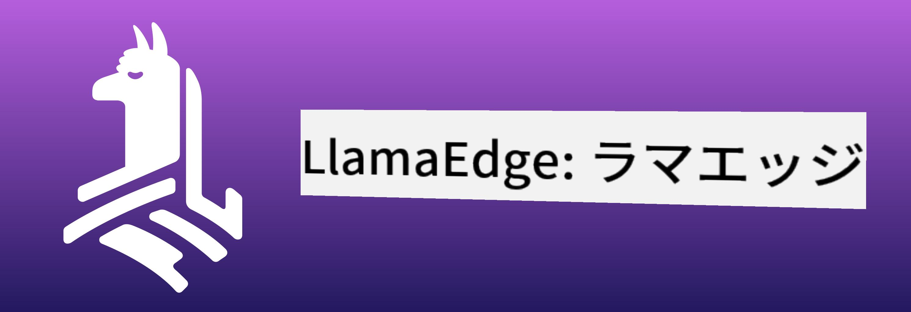
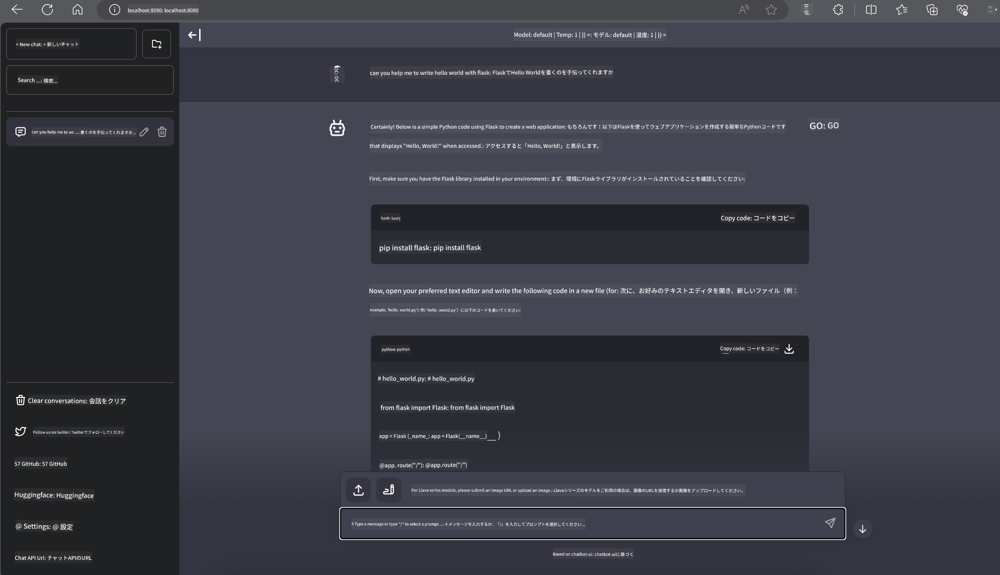

<!--
CO_OP_TRANSLATOR_METADATA:
{
  "original_hash": "be4101a30d98e95a71d42c276e8bcd37",
  "translation_date": "2025-05-08T05:55:06+00:00",
  "source_file": "md/01.Introduction/03/Jetson_Inference.md",
  "language_code": "ja"
}
-->
# **Nvidia JetsonでのPhi-3推論**

Nvidia Jetsonは、Nvidiaが提供する組み込みコンピューティングボードのシリーズです。Jetson TK1、TX1、TX2の各モデルは、ARMアーキテクチャのCPUを統合したNvidiaのTegraプロセッサ（またはSoC）を搭載しています。Jetsonは低消費電力システムであり、機械学習アプリケーションの高速化を目的としています。Nvidia Jetsonは、あらゆる業界で画期的なAI製品を開発するプロの開発者や、実践的なAI学習や素晴らしいプロジェクト作成に取り組む学生や愛好家に利用されています。SLMはJetsonのようなエッジデバイスに展開され、産業向け生成AIアプリケーションシナリオの実装をより良くします。

## NVIDIA Jetsonへの展開：
自律ロボティクスや組み込み機器の開発者はPhi-3 Miniを活用できます。Phi-3は比較的小型で、エッジ展開に最適です。トレーニング中にパラメータが綿密に調整されており、高精度な応答が保証されています。

### TensorRT-LLM最適化：
NVIDIAの[Tensorrt-LLMライブラリ](https://github.com/NVIDIA/TensorRT-LLM?WT.mc_id=aiml-138114-kinfeylo)は大規模言語モデルの推論を最適化します。Phi-3 Miniの長いコンテキストウィンドウをサポートし、スループットとレイテンシの両方を向上させます。最適化にはLongRoPE、FP8、インフライトバッチ処理などの技術が含まれます。

### 利用可能性と展開：
開発者は128Kコンテキストウィンドウを持つPhi-3 Miniを[NVIDIAのAIページ](https://www.nvidia.com/en-us/ai-data-science/generative-ai/)で試すことができます。これは標準APIを備えたマイクロサービスであるNVIDIA NIMとしてパッケージ化されており、どこにでも展開可能です。さらに、[GitHub上のTensorRT-LLM実装](https://github.com/NVIDIA/TensorRT-LLM)も利用できます。

## **1. 準備**

a. Jetson Orin NX / Jetson NX

b. JetPack 5.1.2+

c. Cuda 11.8

d. Python 3.8+

## **2. JetsonでのPhi-3実行**

[Ollama](https://ollama.com)または[LlamaEdge](https://llamaedge.com)を選択できます。

クラウドとエッジデバイスの両方でggufを使いたい場合、LlamaEdgeはWasmEdgeとして理解できます（WasmEdgeはクラウドネイティブ、エッジ、分散型アプリケーションに適した軽量で高性能なスケーラブルWebAssemblyランタイムです。サーバーレスアプリケーション、組み込み関数、マイクロサービス、スマートコントラクト、IoTデバイスをサポートします）。LlamaEdgeを通じて、ggufの量子化モデルをエッジデバイスとクラウドに展開可能です。



使用手順は以下の通りです。

1. 関連するライブラリやファイルをインストールおよびダウンロードする

```bash

curl -sSf https://raw.githubusercontent.com/WasmEdge/WasmEdge/master/utils/install.sh | bash -s -- --plugin wasi_nn-ggml

curl -LO https://github.com/LlamaEdge/LlamaEdge/releases/latest/download/llama-api-server.wasm

curl -LO https://github.com/LlamaEdge/chatbot-ui/releases/latest/download/chatbot-ui.tar.gz

tar xzf chatbot-ui.tar.gz

```

**注意**：llama-api-server.wasmとchatbot-uiは同じディレクトリに配置してください

2. ターミナルでスクリプトを実行する

```bash

wasmedge --dir .:. --nn-preload default:GGML:AUTO:{Your gguf path} llama-api-server.wasm -p phi-3-chat

```

実行結果は以下の通りです



***サンプルコード*** [Phi-3 mini WASM Notebook Sample](https://github.com/Azure-Samples/Phi-3MiniSamples/tree/main/wasm)

まとめると、Phi-3 Miniは効率性、コンテキスト認識、NVIDIAの最適化技術を融合した言語モデルの飛躍的進歩を示しています。ロボット開発やエッジアプリケーション構築において、Phi-3 Miniは知っておくべき強力なツールです。

**免責事項**:  
本書類はAI翻訳サービス「[Co-op Translator](https://github.com/Azure/co-op-translator)」を使用して翻訳されています。正確性を期しておりますが、自動翻訳には誤りや不正確な部分が含まれる可能性があります。原文はあくまで正式な情報源とみなしてください。重要な情報については、専門の人間による翻訳を推奨します。本翻訳の使用により生じた誤解や誤訳について、一切の責任を負いかねます。