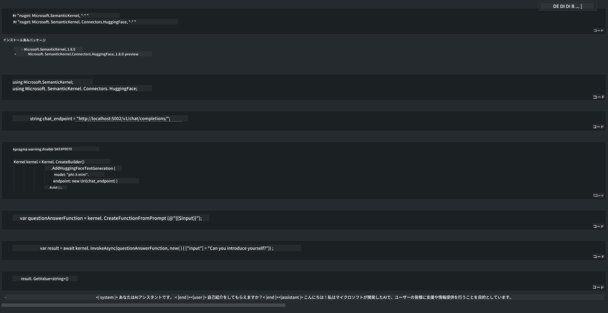

<!--
CO_OP_TRANSLATOR_METADATA:
{
  "original_hash": "bcf5dd7031db0031abdb9dd0c05ba118",
  "translation_date": "2025-07-16T20:55:55+00:00",
  "source_file": "md/01.Introduction/03/Local_Server_Inference.md",
  "language_code": "ja"
}
-->
# **ローカルサーバーでの Phi-3 推論**

Phi-3 をローカルサーバーに展開することができます。ユーザーは [Ollama](https://ollama.com) や [LM Studio](https://llamaedge.com) のソリューションを選ぶか、自分でコードを書くことも可能です。Phi-3 のローカルサービスには [Semantic Kernel](https://github.com/microsoft/semantic-kernel?WT.mc_id=aiml-138114-kinfeylo) や [Langchain](https://www.langchain.com/) を通じて接続し、Copilot アプリケーションを構築できます。

## **Semantic Kernel を使って Phi-3-mini にアクセスする**

Copilot アプリケーションでは、Semantic Kernel / LangChain を使ってアプリケーションを作成します。この種のアプリケーションフレームワークは一般的に Azure OpenAI Service / OpenAI モデルと互換性があり、Hugging Face のオープンソースモデルやローカルモデルもサポートできます。Semantic Kernel を使って Phi-3-mini にアクセスしたい場合はどうすればよいでしょうか？.NET を例にすると、Semantic Kernel の Hugging Face Connector と組み合わせて使うことができます。デフォルトでは Hugging Face 上のモデルIDに対応しており（初回使用時は Hugging Face からモデルをダウンロードするため時間がかかります）、ローカルで構築したサービスにも接続可能です。両者を比較すると、特に企業向けアプリケーションでは自律性が高い後者の利用を推奨します。

図からわかるように、Semantic Kernel を通じてローカルサービスにアクセスすることで、自作の Phi-3-mini モデルサーバーに簡単に接続できます。以下は実行結果です。

***サンプルコード*** https://github.com/kinfey/Phi3MiniSamples/tree/main/semantickernel

**免責事項**：  
本書類はAI翻訳サービス「[Co-op Translator](https://github.com/Azure/co-op-translator)」を使用して翻訳されました。正確性の向上に努めておりますが、自動翻訳には誤りや不正確な部分が含まれる可能性があります。原文の言語によるオリジナル文書が正式な情報源とみなされるべきです。重要な情報については、専門の人間による翻訳を推奨します。本翻訳の利用により生じたいかなる誤解や誤訳についても、当方は責任を負いかねます。