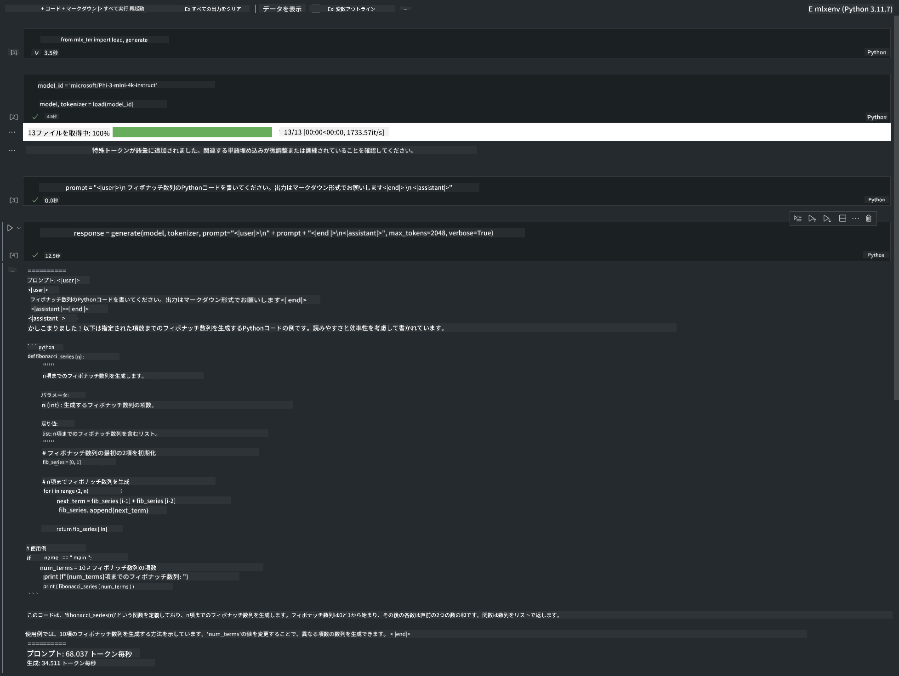

<!--
CO_OP_TRANSLATOR_METADATA:
{
  "original_hash": "dcb656f3d206fc4968e236deec5d4384",
  "translation_date": "2025-05-08T06:00:59+00:00",
  "source_file": "md/01.Introduction/03/MLX_Inference.md",
  "language_code": "ja"
}
-->
# **Apple MLX FrameworkでのPhi-3推論**

## **MLX Frameworkとは**

MLXはAppleシリコン上での機械学習研究向けの配列フレームワークで、Appleの機械学習研究チームによって開発されました。

MLXは機械学習研究者が機械学習研究者のために設計しています。使いやすさを重視しつつ、モデルのトレーニングやデプロイを効率的に行えるように作られています。フレームワーク自体の設計も概念的にシンプルです。研究者が新しいアイデアを素早く試せるよう、MLXを拡張・改良しやすいことを目指しています。

Appleシリコン搭載デバイス上でMLXを使えばLLMの高速化が可能で、モデルをローカルで手軽に実行できます。

## **MLXを使ったPhi-3-miniの推論**

### **1. MLX環境のセットアップ**

1. Python 3.11.x  
2. MLXライブラリのインストール  


```bash

pip install mlx-lm

```

### **2. ターミナルでMLXを使ってPhi-3-miniを実行する**

```bash

python -m mlx_lm.generate --model microsoft/Phi-3-mini-4k-instruct --max-token 2048 --prompt  "<|user|>\nCan you introduce yourself<|end|>\n<|assistant|>"

```

結果（私の環境はApple M1 Max、64GB）は以下の通りです。


### **3. ターミナルでMLXを使ったPhi-3-miniの量子化**

```bash

python -m mlx_lm.convert --hf-path microsoft/Phi-3-mini-4k-instruct

```

***Note：*** モデルはmlx_lm.convertを使って量子化可能で、デフォルトはINT4です。この例ではPhi-3-miniをINT4に量子化しています。

モデルはmlx_lm.convertで量子化でき、デフォルトはINT4となっています。この例ではPhi-3-miniをINT4に量子化し、量子化後のモデルはデフォルトのディレクトリ ./mlx_model に保存されます。

量子化したモデルはターミナルからテストできます。

```bash

python -m mlx_lm.generate --model ./mlx_model/ --max-token 2048 --prompt  "<|user|>\nCan you introduce yourself<|end|>\n<|assistant|>"

```

結果は以下の通りです。


### **4. Jupyter NotebookでMLXを使ってPhi-3-miniを実行する**



***Note:*** サンプルは[こちらのリンク](../../../../../code/03.Inference/MLX/MLX_DEMO.ipynb)を参照してください。


## **リソース**

1. Apple MLX Frameworkについて学ぶ [https://ml-explore.github.io](https://ml-explore.github.io/mlx/build/html/index.html)

2. Apple MLX GitHubリポジトリ [https://github.com/ml-explore](https://github.com/ml-explore)

**免責事項**:  
本書類はAI翻訳サービス「[Co-op Translator](https://github.com/Azure/co-op-translator)」を使用して翻訳されています。正確性を期しておりますが、自動翻訳には誤りや不正確な箇所が含まれる可能性があることをご了承ください。原文（原言語の文書）が権威ある情報源とみなされます。重要な情報については、専門の人間による翻訳を推奨します。本翻訳の使用により生じた誤解や誤訳について、一切の責任を負いかねます。