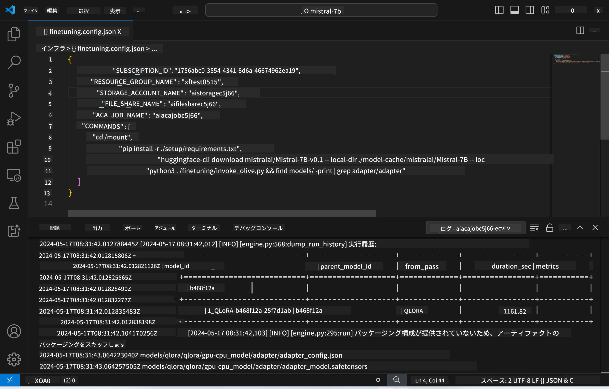
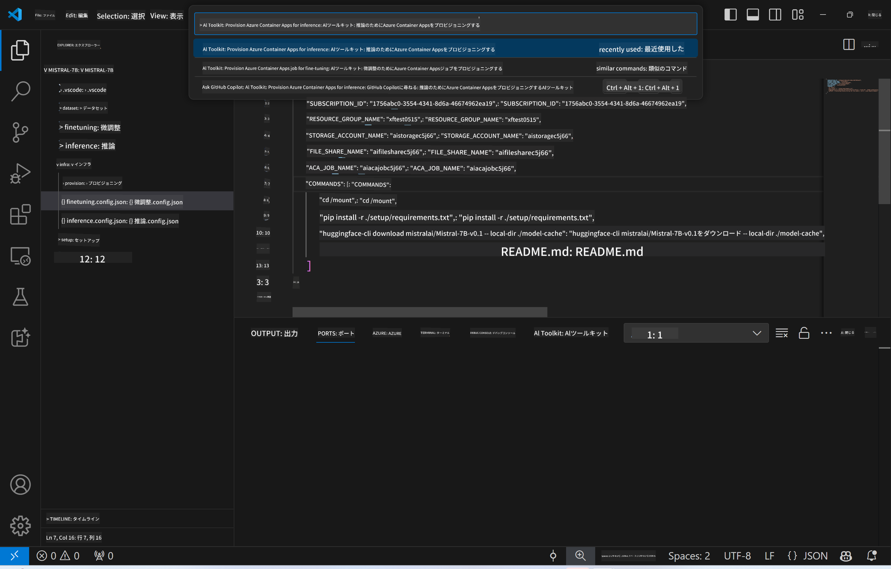
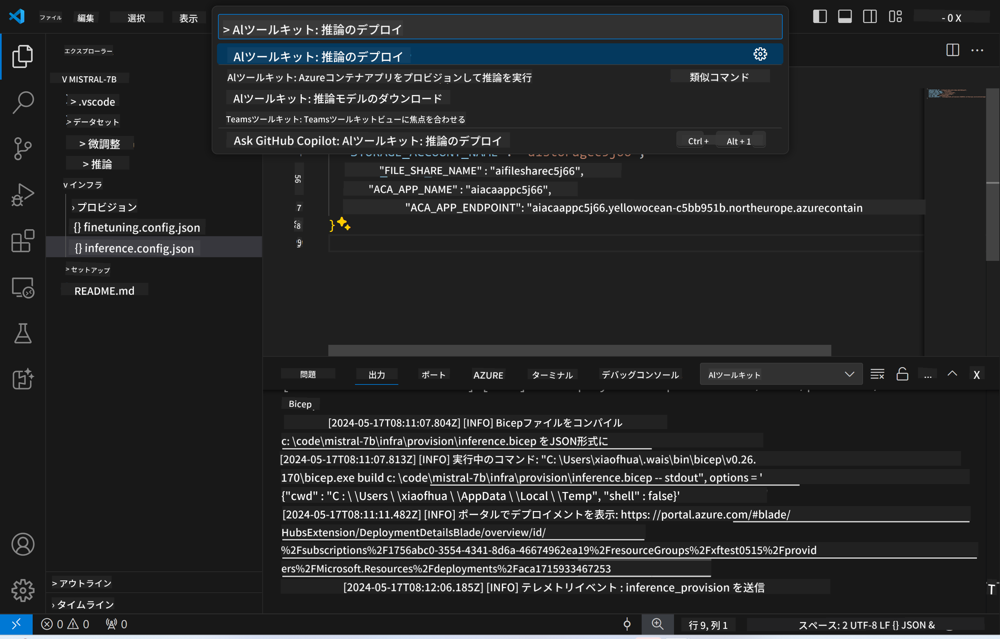

<!--
CO_OP_TRANSLATOR_METADATA:
{
  "original_hash": "8782d16f62bc2bdae1f0b38f39a2417c",
  "translation_date": "2025-04-04T12:09:00+00:00",
  "source_file": "md\\01.Introduction\\03\\Remote_Interence.md",
  "language_code": "ja"
}
-->
# リモート環境で微調整済みモデルを推論

リモート環境でアダプターをトレーニングした後、簡単なGradioアプリケーションを使用してモデルと対話できます。



### Azureリソースの準備
コマンドパレットから`AI Toolkit: Provision Azure Container Apps for inference`を実行して、リモート推論用のAzureリソースを設定する必要があります。この設定中に、Azureサブスクリプションとリソースグループを選択するよう求められます。  

   
デフォルトでは、推論用のサブスクリプションとリソースグループは微調整に使用したものと一致する必要があります。推論は同じAzure Container App Environmentを使用し、微調整ステップで生成されたAzure Filesに保存されたモデルとモデルアダプターにアクセスします。

## AI Toolkitの使用方法

### 推論用デプロイ  
推論コードを修正したり、推論モデルを再ロードしたりする場合は、`AI Toolkit: Deploy for inference`コマンドを実行してください。このコマンドは最新のコードをACAに同期し、レプリカを再起動します。



デプロイが成功すると、エンドポイントを使用してモデルを評価する準備が整います。

### 推論APIへのアクセス

VSCode通知に表示される「*Go to Inference Endpoint*」ボタンをクリックすることで推論APIにアクセスできます。また、Web APIエンドポイントは`ACA_APP_ENDPOINT`の`./infra/inference.config.json`や出力パネルに記載されています。


> **Note:** 推論エンドポイントが完全に動作するまで数分かかる場合があります。

## テンプレートに含まれる推論コンポーネント
 
| フォルダ | 内容 |
| ------ |--------- |
| `infra` | リモート操作に必要なすべての設定を含む。 |
| `infra/provision/inference.parameters.json` | Azureリソースをプロビジョニングするためのbicepテンプレートのパラメータを保持。 |
| `infra/provision/inference.bicep` | Azureリソースをプロビジョニングするためのテンプレートを含む。 |
| `infra/inference.config.json` | `AI Toolkit: Provision Azure Container Apps for inference`コマンドによって生成された設定ファイル。他のリモートコマンドパレットの入力として使用される。 |

### AI Toolkitを使用したAzureリソースプロビジョニングの設定
[AI Toolkit](https://marketplace.visualstudio.com/items?itemName=ms-windows-ai-studio.windows-ai-studio)を設定してください。

推論用のAzure Container Appsをプロビジョニングするには` command.

You can find configuration parameters in `./infra/provision/inference.parameters.json` file. Here are the details:
| Parameter | Description |
| --------- |------------ |
| `defaultCommands` | This is the commands to initiate a web API. |
| `maximumInstanceCount` | This parameter sets the maximum capacity of GPU instances. |
| `location` | This is the location where Azure resources are provisioned. The default value is the same as the chosen resource group's location. |
| `storageAccountName`, `fileShareName` `acaEnvironmentName`, `acaEnvironmentStorageName`, `acaAppName`,  `acaLogAnalyticsName` | These parameters are used to name the Azure resources for provision. By default, they will be same to the fine-tuning resource name. You can input a new, unused resource name to create your own custom-named resources, or you can input the name of an already existing Azure resource if you'd prefer to use that. For details, refer to the section [Using existing Azure Resources](../../../../../md/01.Introduction/03). |

### Using Existing Azure Resources

By default, the inference provision use the same Azure Container App Environment, Storage Account, Azure File Share, and Azure Log Analytics that were used for fine-tuning. A separate Azure Container App is created solely for the inference API. 

If you have customized the Azure resources during the fine-tuning step or want to use your own existing Azure resources for inference, specify their names in the `./infra/inference.parameters.json`ファイルを使用します。そして、コマンドパレットから`AI Toolkit: Provision Azure Container Apps for inference`コマンドを実行してください。この操作により、指定されたリソースが更新され、不足しているものが作成されます。

例えば、既存のAzureコンテナ環境がある場合、`./infra/finetuning.parameters.json`は次のようになります：

```json
{
    "$schema": "https://schema.management.azure.com/schemas/2019-04-01/deploymentParameters.json#",
    "contentVersion": "1.0.0.0",
    "parameters": {
      ...
      "acaEnvironmentName": {
        "value": "<your-aca-env-name>"
      },
      "acaEnvironmentStorageName": {
        "value": null
      },
      ...
    }
  }
```

### 手動プロビジョニング  
Azureリソースを手動で設定したい場合は、`./infra/provision` folders. If you have already set up and configured all the Azure resources without using the AI Toolkit command palette, you can simply enter the resource names in the `inference.config.json`ファイル内の提供されたbicepファイルを使用できます。

例えば：

```json
{
  "SUBSCRIPTION_ID": "<your-subscription-id>",
  "RESOURCE_GROUP_NAME": "<your-resource-group-name>",
  "STORAGE_ACCOUNT_NAME": "<your-storage-account-name>",
  "FILE_SHARE_NAME": "<your-file-share-name>",
  "ACA_APP_NAME": "<your-aca-name>",
  "ACA_APP_ENDPOINT": "<your-aca-endpoint>"
}
```

**免責事項**:  
この文書は、AI翻訳サービス [Co-op Translator](https://github.com/Azure/co-op-translator) を使用して翻訳されています。正確性を追求しておりますが、自動翻訳には誤りや不正確な部分が含まれる可能性がありますのでご注意ください。原文書の母国語版を信頼できる情報源としてお考えください。重要な情報については、専門の人間による翻訳をお勧めします。この翻訳の使用に起因する誤解や誤解釈について、当社は一切責任を負いません。