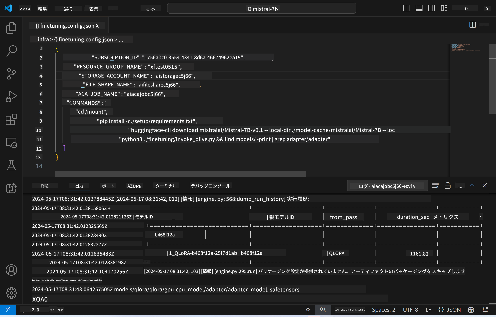

<!--
CO_OP_TRANSLATOR_METADATA:
{
  "original_hash": "a54cd3d65b6963e4e8ce21e143c3ab04",
  "translation_date": "2025-05-08T05:57:56+00:00",
  "source_file": "md/01.Introduction/03/Remote_Interence.md",
  "language_code": "ja"
}
-->
# ファインチューニング済みモデルを使ったリモート推論

リモート環境でアダプターのトレーニングが完了したら、シンプルなGradioアプリケーションを使ってモデルと対話します。



### Azureリソースのプロビジョニング  
コマンドパレットから`AI Toolkit: Provision Azure Container Apps for inference`を実行して、リモート推論用のAzureリソースをセットアップします。このセットアップ中に、Azureサブスクリプションとリソースグループの選択を求められます。  


デフォルトでは、推論用のサブスクリプションとリソースグループはファインチューニング時と同じものを使用します。推論は同じAzure Container App Environmentを利用し、ファインチューニング時に生成されたAzure Filesに保存されたモデルとモデルアダプターにアクセスします。

## AI Toolkitの使用

### 推論用のデプロイ  
推論コードを修正したり、推論モデルを再読み込みしたい場合は、`AI Toolkit: Deploy for inference`コマンドを実行してください。これにより、最新のコードがACAと同期され、レプリカが再起動されます。


デプロイが正常に完了すると、このエンドポイントを使ってモデルの評価が可能になります。

### 推論APIへのアクセス

VSCodeの通知に表示される「*Go to Inference Endpoint*」ボタンをクリックすることで推論APIにアクセスできます。あるいは、`./infra/inference.config.json`の`ACA_APP_ENDPOINT`にあるWeb APIエンドポイントや出力パネルからも確認可能です。


> **Note:** 推論エンドポイントが完全に動作可能になるまで数分かかる場合があります。

## テンプレートに含まれる推論コンポーネント

| フォルダー | 内容 |
| ------ |--------- |
| `infra` | リモート操作に必要なすべての設定が含まれています。 |
| `infra/provision/inference.parameters.json` | 推論用Azureリソースのプロビジョニングに使うbicepテンプレートのパラメーターが格納されています。 |
| `infra/provision/inference.bicep` | 推論用Azureリソースのプロビジョニング用テンプレートが含まれています。 |
| `infra/inference.config.json` | `AI Toolkit: Provision Azure Container Apps for inference`コマンドで生成される設定ファイルで、他のリモートコマンドパレットの入力として使用されます。 |

### AI Toolkitを使ったAzureリソースプロビジョニングの設定  
[AI Toolkit](https://marketplace.visualstudio.com/items?itemName=ms-windows-ai-studio.windows-ai-studio)を設定します。

推論用のAzure Container Appsをプロビジョニングするには、`./infra/provision/inference.parameters.json`ファイルの`defaultCommands`、`maximumInstanceCount`、`location`、`storageAccountName`、`fileShareName`、`acaEnvironmentName`、`acaEnvironmentStorageName`、`acaAppName`、`acaLogAnalyticsName`などのパラメーターを編集します。編集後、コマンドパレットから`AI Toolkit: Provision Azure Container Apps for inference`コマンドを実行してください。これにより指定されたリソースの更新や不足しているリソースの作成が行われます。

例えば、既存のAzureコンテナ環境がある場合、`./infra/finetuning.parameters.json`は以下のようになります：

```json
{
    "$schema": "https://schema.management.azure.com/schemas/2019-04-01/deploymentParameters.json#",
    "contentVersion": "1.0.0.0",
    "parameters": {
      ...
      "acaEnvironmentName": {
        "value": "<your-aca-env-name>"
      },
      "acaEnvironmentStorageName": {
        "value": null
      },
      ...
    }
  }
```

### 手動プロビジョニング  
Azureリソースを手動で設定したい場合は、`./infra/provision`内のbicepファイルと`inference.config.json`ファイルを使用できます。

例：

```json
{
  "SUBSCRIPTION_ID": "<your-subscription-id>",
  "RESOURCE_GROUP_NAME": "<your-resource-group-name>",
  "STORAGE_ACCOUNT_NAME": "<your-storage-account-name>",
  "FILE_SHARE_NAME": "<your-file-share-name>",
  "ACA_APP_NAME": "<your-aca-name>",
  "ACA_APP_ENDPOINT": "<your-aca-endpoint>"
}
```

**免責事項**：  
本書類はAI翻訳サービス「Co-op Translator」（https://github.com/Azure/co-op-translator）を使用して翻訳されています。正確性には努めておりますが、自動翻訳には誤りや不正確な箇所が含まれる可能性があることをご了承ください。原文の言語によるオリジナルの文書が正式な情報源とみなされます。重要な情報については、専門の人間による翻訳を推奨します。本翻訳の利用により生じたいかなる誤解や誤訳についても、当方は責任を負いかねます。