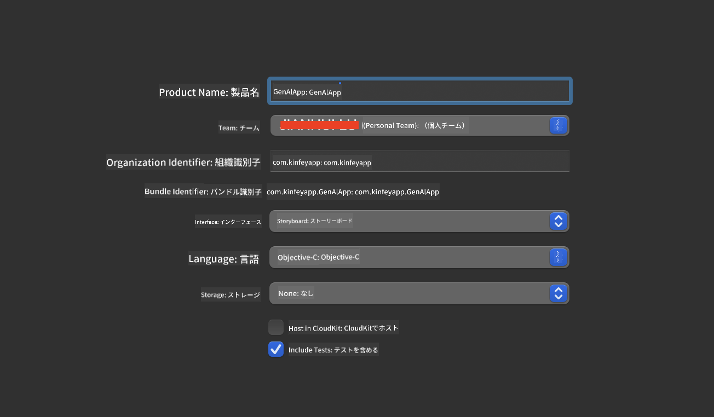
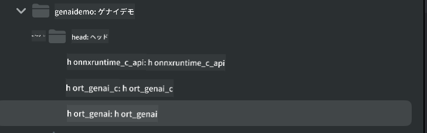

<!--
CO_OP_TRANSLATOR_METADATA:
{
  "original_hash": "82af197df38d25346a98f1f0e84d1698",
  "translation_date": "2025-05-08T05:55:57+00:00",
  "source_file": "md/01.Introduction/03/iOS_Inference.md",
  "language_code": "ja"
}
-->
# **iOSでのPhi-3推論**

Phi-3-miniはMicrosoftの新しいモデルシリーズで、エッジデバイスやIoTデバイス上で大規模言語モデル（LLM）を展開可能にします。Phi-3-miniはiOS、Android、エッジデバイス向けに提供されており、BYOD環境での生成AIの展開を可能にします。以下の例ではiOS上でのPhi-3-miniの展開方法を示します。

## **1. 準備**

- **a.** macOS 14以上
- **b.** Xcode 15以上
- **c.** iOS SDK 17.x（iPhone 14 A16以上推奨）
- **d.** Python 3.10以上をインストール（Conda推奨）
- **e.** Pythonライブラリをインストール：`python-flatbuffers`
- **f.** CMakeをインストール

### Semantic Kernelと推論

Semantic KernelはAzure OpenAI Service、OpenAIモデル、さらにはローカルモデルと互換性のあるアプリケーションフレームワークです。Semantic Kernelを通じてローカルサービスにアクセスすることで、自身でホストするPhi-3-miniモデルサーバーと簡単に連携できます。

### OllamaまたはLlamaEdgeで量子化モデルを呼び出す

多くのユーザーはローカルでモデルを動かすために量子化モデルを好みます。[Ollama](https://ollama.com)と[LlamaEdge](https://llamaedge.com)は様々な量子化モデルの呼び出しを可能にします。

#### **Ollama**

`ollama run phi3`を直接実行するか、オフラインで設定できます。Modelfileに`gguf`ファイルのパスを記述してください。Phi-3-mini量子化モデルを実行するサンプルコード：

```gguf
FROM {Add your gguf file path}
TEMPLATE \"\"\"<|user|> .Prompt<|end|> <|assistant|>\"\"\"
PARAMETER stop <|end|>
PARAMETER num_ctx 4096
```

#### **LlamaEdge**

クラウドとエッジデバイスの両方で`gguf`を使いたい場合、LlamaEdgeが優れた選択肢です。

## **2. iOS向けONNX Runtimeのコンパイル**

```bash

git clone https://github.com/microsoft/onnxruntime.git

cd onnxruntime

./build.sh --build_shared_lib --ios --skip_tests --parallel --build_dir ./build_ios --ios --apple_sysroot iphoneos --osx_arch arm64 --apple_deploy_target 17.5 --cmake_generator Xcode --config Release

cd ../

```

### **注意**

- **a.** コンパイル前にXcodeが正しく設定されていることを確認し、ターミナルでアクティブな開発者ディレクトリに設定してください：

    ```bash
    sudo xcode-select -switch /Applications/Xcode.app/Contents/Developer
    ```

- **b.** ONNX Runtimeは異なるプラットフォーム向けにコンパイルする必要があります。iOSの場合は`arm64` or `x86_64`向けにコンパイル可能です。

- **c.** コンパイルには最新のiOS SDKの使用を推奨しますが、以前のSDKと互換性を持たせたい場合は古いバージョンも使用可能です。

## **3. iOS向けONNX Runtimeでの生成AIのコンパイル**

> **Note:** ONNX Runtimeを使った生成AIはプレビュー段階のため、仕様変更の可能性があります。

```bash

git clone https://github.com/microsoft/onnxruntime-genai
 
cd onnxruntime-genai
 
mkdir ort
 
cd ort
 
mkdir include
 
mkdir lib
 
cd ../
 
cp ../onnxruntime/include/onnxruntime/core/session/onnxruntime_c_api.h ort/include
 
cp ../onnxruntime/build_ios/Release/Release-iphoneos/libonnxruntime*.dylib* ort/lib
 
export OPENCV_SKIP_XCODEBUILD_FORCE_TRYCOMPILE_DEBUG=1
 
python3 build.py --parallel --build_dir ./build_ios --ios --ios_sysroot iphoneos --ios_arch arm64 --ios_deployment_target 17.5 --cmake_generator Xcode --cmake_extra_defines CMAKE_XCODE_ATTRIBUTE_CODE_SIGNING_ALLOWED=NO

```

## **4. XcodeでAppアプリケーションを作成**

生成AIをONNX RuntimeのC++ APIで使うため、Objective-Cを選びました。Objective-Cは互換性が高いためです。もちろんSwiftのブリッジングを使って呼び出すことも可能です。



## **5. ONNXの量子化INT4モデルをAppプロジェクトにコピー**

ONNX形式のINT4量子化モデルをインポートする必要があります。まずはモデルをダウンロードしてください。


ダウンロード後、Xcodeのプロジェクト内Resourcesディレクトリに追加します。


## **6. ViewControllersにC++ APIを追加**

> **注意:**

- **a.** 対応するC++ヘッダーファイルをプロジェクトに追加します。

  

- **b.** Objective-C++を有効にするために`onnxruntime-genai` dynamic library in Xcode.

  

- **c.** Use the C Samples code for testing. You can also add additional features like ChatUI for more functionality.

- **d.** Since you need to use C++ in your project, rename `ViewController.m` to `ViewController.mm`をインクルードしてください。

```objc

    NSString *llmPath = [[NSBundle mainBundle] resourcePath];
    char const *modelPath = llmPath.cString;

    auto model =  OgaModel::Create(modelPath);

    auto tokenizer = OgaTokenizer::Create(*model);

    const char* prompt = "<|system|>You are a helpful AI assistant.<|end|><|user|>Can you introduce yourself?<|end|><|assistant|>";

    auto sequences = OgaSequences::Create();
    tokenizer->Encode(prompt, *sequences);

    auto params = OgaGeneratorParams::Create(*model);
    params->SetSearchOption("max_length", 100);
    params->SetInputSequences(*sequences);

    auto output_sequences = model->Generate(*params);
    const auto output_sequence_length = output_sequences->SequenceCount(0);
    const auto* output_sequence_data = output_sequences->SequenceData(0);
    auto out_string = tokenizer->Decode(output_sequence_data, output_sequence_length);
    
    auto tmp = out_string;

```

## **7. アプリケーションの実行**

セットアップが完了したら、アプリを実行してPhi-3-miniモデル推論の結果を確認できます。


詳しいサンプルコードや手順は[Phi-3 Mini Samplesリポジトリ](https://github.com/Azure-Samples/Phi-3MiniSamples/tree/main/ios)をご覧ください。

**免責事項**：  
本書類はAI翻訳サービス「Co-op Translator」（https://github.com/Azure/co-op-translator）を使用して翻訳されました。正確性を期していますが、自動翻訳には誤りや不正確な箇所が含まれる可能性があることをご承知おきください。原文の言語による文書が正式な情報源とみなされます。重要な情報については、専門の人間による翻訳を推奨します。本翻訳の使用により生じた誤解や誤訳について、当方は一切の責任を負いかねます。