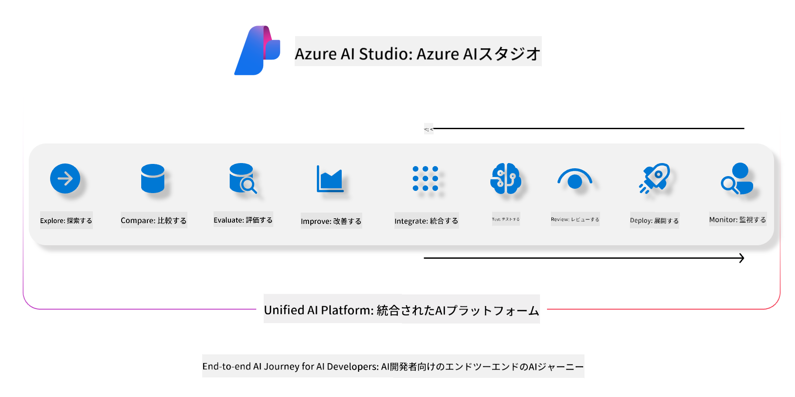
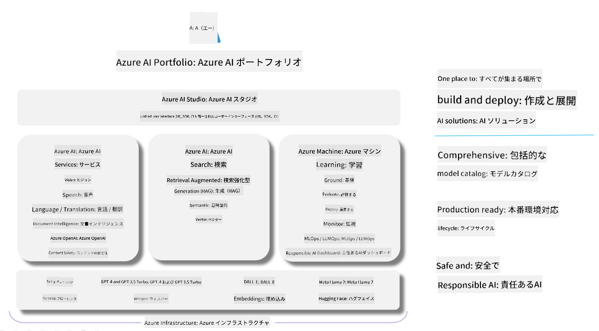

<!--
CO_OP_TRANSLATOR_METADATA:
{
  "original_hash": "5dfb4983a2e74e4b5e8317eb16fc2154",
  "translation_date": "2025-04-04T12:18:29+00:00",
  "source_file": "md\\01.Introduction\\05\\AIFoundry.md",
  "language_code": "ja"
}
-->
# **Azure AI Foundryを使用した評価**

[Azure AI Foundry](https://ai.azure.com?WT.mc_id=aiml-138114-kinfeylo)を使用して生成型AIアプリケーションを評価する方法について解説します。単一ターンや複数ターンの会話を評価する場合でも、Azure AI Foundryはモデルの性能と安全性を評価するためのツールを提供します。

## Azure AI Foundryを使用した生成型AIアプリの評価方法
詳細な手順については、[Azure AI Foundryのドキュメント](https://learn.microsoft.com/azure/ai-studio/how-to/evaluate-generative-ai-app?WT.mc_id=aiml-138114-kinfeylo)を参照してください。

以下は開始するためのステップです。

## Azure AI Foundryで生成型AIモデルを評価する

**前提条件**

- CSVまたはJSON形式のテストデータセット。
- デプロイ済みの生成型AIモデル（Phi-3、GPT 3.5、GPT 4、Davinciモデルなど）。
- 評価を実行するためのコンピュートインスタンスを備えたランタイム。

## 組み込み評価指標

Azure AI Foundryでは、単一ターンの会話や複雑な複数ターンの会話を評価することができます。
特定のデータに基づいてモデルを動作させるRetrieval Augmented Generation (RAG)シナリオでは、組み込み評価指標を使用して性能を評価することが可能です。
また、一般的な単一ターンの質問応答シナリオ（非RAG）の評価も行えます。

## 評価実行の作成

Azure AI FoundryのUIから、EvaluateページまたはPrompt Flowページに移動します。
評価作成ウィザードに従って評価実行をセットアップします。評価に任意の名前を付けることも可能です。
アプリケーションの目的に合ったシナリオを選択します。
モデルの出力を評価するために、1つ以上の評価指標を選択します。

## カスタム評価フロー（任意）

より柔軟性を持たせるために、カスタム評価フローを設定することができます。特定の要件に基づいて評価プロセスをカスタマイズしてください。

## 結果の確認

評価を実行した後、Azure AI Foundryで詳細な評価指標を記録し、確認し、分析することができます。アプリケーションの能力と限界についての洞察を得ることができます。

**注** Azure AI Foundryは現在パブリックプレビュー中です。そのため、実験や開発目的で使用してください。運用環境でのワークロードには他の選択肢を検討してください。公式の[AI Foundryドキュメント](https://learn.microsoft.com/azure/ai-studio/?WT.mc_id=aiml-138114-kinfeylo)を参照し、詳細な手順を確認してください。

**免責事項**:  
この文書はAI翻訳サービス [Co-op Translator](https://github.com/Azure/co-op-translator) を使用して翻訳されています。正確性を追求していますが、自動翻訳には誤りや不正確さが含まれる場合がありますのでご注意ください。原文の母国語で書かれた文書が公式な情報源として考慮されるべきです。重要な情報については、専門の人間による翻訳を推奨します。この翻訳の使用に起因する誤解や誤認について、当方は一切責任を負いません。