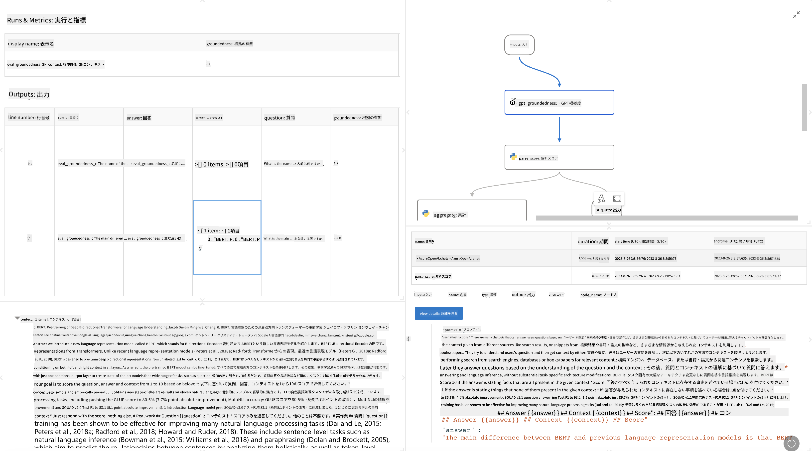

<!--
CO_OP_TRANSLATOR_METADATA:
{
  "original_hash": "3cbe7629d254f1043193b7fe22524d55",
  "translation_date": "2025-05-08T06:07:22+00:00",
  "source_file": "md/01.Introduction/05/Promptflow.md",
  "language_code": "ja"
}
-->
# **Promptflowの紹介**

[Microsoft Prompt Flow](https://microsoft.github.io/promptflow/index.html?WT.mc_id=aiml-138114-kinfeylo)は、事前構築されたテンプレートやカスタムコネクタを使って自動化ワークフローを作成できるビジュアルワークフロー自動化ツールです。開発者やビジネスアナリストが、データ管理、コラボレーション、プロセス最適化などのタスクに対して迅速に自動化プロセスを構築できるよう設計されています。Prompt Flowを使えば、異なるサービスやアプリケーション、システムを簡単に接続し、複雑なビジネスプロセスを自動化できます。

Microsoft Prompt Flowは、大規模言語モデル（LLM）を活用したAIアプリケーションの開発サイクル全体を効率化するために設計されています。アイデア出し、プロトタイピング、テスト、評価、展開のいずれの段階でも、Prompt Flowはプロセスを簡素化し、実運用レベルのLLMアプリケーション構築を支援します。

## Microsoft Prompt Flowの主な特徴とメリット

**インタラクティブな作成体験**

Prompt Flowはフローの構造を視覚的に表現し、プロジェクトの理解と操作を容易にします。  
ノートブックのようなコーディング環境で効率的にフローの開発やデバッグが行えます。

**プロンプトのバリエーションと調整**

複数のプロンプトバリエーションを作成・比較し、反復的な改善プロセスを促進します。  
異なるプロンプトのパフォーマンスを評価し、最も効果的なものを選択できます。

**組み込みの評価フロー**

組み込みの評価ツールを使って、プロンプトやフローの品質と効果を評価します。  
LLMベースのアプリケーションのパフォーマンスを把握できます。

**充実したリソース**

Prompt Flowには、組み込みツール、サンプル、テンプレートのライブラリが含まれています。  
これらは開発の出発点となり、創造力を刺激し、開発を加速させます。

**コラボレーションと企業対応**

複数ユーザーがプロンプトエンジニアリングプロジェクトに共同で取り組めるようサポートします。  
バージョン管理を維持し、知識を効果的に共有。開発から評価、展開、監視までのプロンプトエンジニアリング全体を効率化します。

## Prompt Flowにおける評価

Microsoft Prompt Flowでは、AIモデルのパフォーマンスを評価するために評価が重要な役割を果たします。Prompt Flow内で評価フローやメトリクスをカスタマイズする方法を見ていきましょう。

**Prompt Flowにおける評価の理解**

Prompt Flowでは、フローは入力を処理し出力を生成するノードの連続です。  
評価フローは、特定の基準や目標に基づいて実行結果のパフォーマンスを評価するための特別なフローです。

**評価フローの主な特徴**

評価フローは通常、テスト対象のフローの実行後に動作し、その出力を利用します。  
スコアやメトリクスを計算して、テスト対象フローのパフォーマンスを測定します。  
メトリクスには正確度、関連度スコア、その他の適切な指標が含まれます。

### 評価フローのカスタマイズ

**入力の定義**

評価フローは、テスト対象の実行結果の出力を受け取る必要があります。  
標準的なフローと同様に入力を定義してください。  
例えば、QnAフローを評価する場合は入力名を「answer」、分類フローの場合は「category」とします。  
正解ラベルなどのグラウンドトゥルース入力も必要になることがあります。

**出力とメトリクス**

評価フローは、テスト対象フローのパフォーマンスを測る結果を生成します。  
メトリクスはPythonやLLMを使って計算できます。  
log_metric()関数を使って関連メトリクスを記録しましょう。

**カスタマイズした評価フローの利用**

特定のタスクや目的に合わせて独自の評価フローを開発します。  
評価目標に基づいてメトリクスをカスタマイズ可能です。  
大規模テストには、このカスタマイズした評価フローをバッチ実行に適用します。

## 組み込みの評価手法

Prompt Flowは組み込みの評価手法も提供しています。  
バッチ実行を提出し、これらの手法を使って大規模データセットに対するフローのパフォーマンスを評価できます。  
評価結果を確認し、メトリクスを比較しながら必要に応じて改善を重ねましょう。  
評価はAIモデルが求められる基準や目標を満たしていることを保証するために欠かせません。  
Microsoft Prompt Flowでの評価フローの開発と利用に関する詳細は公式ドキュメントをご覧ください。

まとめると、Microsoft Prompt Flowはプロンプトエンジニアリングを簡素化し、強力な開発環境を提供することで、高品質なLLMアプリケーションの構築を支援します。LLMを扱うなら、Prompt Flowはぜひ活用したいツールです。  
詳細な評価フローの開発・利用手順については、[Prompt Flow Evaluation Documents](https://learn.microsoft.com/azure/machine-learning/prompt-flow/how-to-develop-an-evaluation-flow?view=azureml-api-2?WT.mc_id=aiml-138114-kinfeylo)をご参照ください。

**免責事項**:  
本書類はAI翻訳サービス[Co-op Translator](https://github.com/Azure/co-op-translator)を使用して翻訳されています。正確性を期しておりますが、自動翻訳には誤りや不正確な箇所が含まれる可能性があることをご承知おきください。原文はその言語における正式な情報源とみなされるべきです。重要な情報については、専門の人間による翻訳を推奨します。本翻訳の利用により生じた誤解や解釈の違いについて、当方は一切の責任を負いかねます。