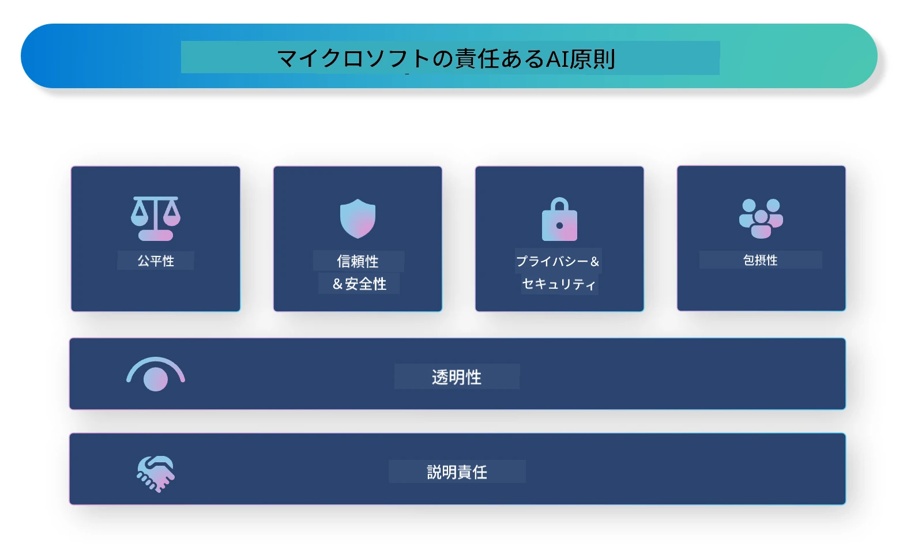

# **責任あるAIの紹介**

[Microsoftの責任あるAI](https://www.microsoft.com/ai/responsible-ai?WT.mc_id=aiml-138114-kinfeylo) は、開発者や組織が透明性があり、信頼でき、説明責任のあるAIシステムを構築できるよう支援する取り組みです。このイニシアチブは、プライバシー、公平性、透明性などの倫理的原則に沿った責任あるAIソリューションの開発に役立つガイダンスやリソースを提供します。また、責任あるAIシステムの構築に伴う課題やベストプラクティスについても探っていきます。

## Microsoftの責任あるAIの概要

**倫理的原則**

Microsoftの責任あるAIは、プライバシー、公平性、透明性、説明責任、安全性といった一連の倫理的原則に基づいています。これらの原則は、AIシステムが倫理的かつ責任を持って開発されることを保証するために設計されています。

**透明性のあるAI**

Microsoftの責任あるAIは、AIシステムの透明性の重要性を強調しています。これには、AIモデルの仕組みを明確に説明することや、データソースやアルゴリズムを公開することが含まれます。

**説明責任のあるAI**

[Microsoftの責任あるAI](https://www.microsoft.com/ai/responsible-ai?WT.mc_id=aiml-138114-kinfeylo) は、AIモデルの意思決定過程を理解できる説明責任のあるAIシステムの開発を推進しています。これにより、ユーザーはAIシステムの出力を理解し、信頼できるようになります。

**包摂性**

AIシステムはすべての人に利益をもたらすよう設計されるべきです。Microsoftは、多様な視点を考慮し、偏見や差別を避ける包摂的なAIの実現を目指しています。

**信頼性と安全性**

AIシステムの信頼性と安全性を確保することは非常に重要です。Microsoftは、一貫して高い性能を発揮し、有害な結果を回避する堅牢なモデルの構築に注力しています。

**AIにおける公平性**

Microsoftの責任あるAIは、偏ったデータやアルゴリズムで学習したAIシステムが偏見を助長する可能性があることを認識しています。このイニシアチブは、人種、性別、年齢などに基づく差別を行わない公平なAIシステムの開発に関するガイダンスを提供します。

**プライバシーとセキュリティ**

Microsoftの責任あるAIは、AIシステムにおけるユーザーのプライバシーとデータセキュリティの保護を重視しています。これには、強力なデータ暗号化やアクセス制御の実装、定期的な脆弱性監査が含まれます。

**説明責任と責任感**

Microsoftの責任あるAIは、AIの開発と運用における説明責任と責任感を促進します。これには、開発者や組織がAIシステムに伴う潜在的なリスクを認識し、それらのリスクを軽減するための対策を講じることが含まれます。

## 責任あるAIシステム構築のベストプラクティス

**多様なデータセットを用いてAIモデルを開発する**

AIシステムの偏りを避けるためには、多様な視点や経験を反映したデータセットを使用することが重要です。

**説明可能なAI技術を活用する**

説明可能なAI技術は、ユーザーがAIモデルの意思決定過程を理解するのに役立ち、システムへの信頼を高めます。

**AIシステムの脆弱性を定期的に監査する**

定期的な監査により、対処すべき潜在的なリスクや脆弱性を特定できます。

**強力なデータ暗号化とアクセス制御を実装する**

データ暗号化とアクセス制御は、AIシステムにおけるユーザーのプライバシーとセキュリティを守るために重要です。

**AI開発において倫理的原則を遵守する**

公平性、透明性、説明責任などの倫理的原則を守ることで、AIシステムへの信頼を築き、責任ある開発を実現できます。

## 責任あるAIのためのAI Foundryの活用

[Azure AI Foundry](https://ai.azure.com?WT.mc_id=aiml-138114-kinfeylo) は、開発者や組織が迅速に高度で市場対応可能な責任あるインテリジェントアプリケーションを作成できる強力なプラットフォームです。Azure AI Foundryの主な特徴と機能は以下の通りです。

**すぐに使えるAPIとモデル**

Azure AI Foundryは、生成AI、会話の自然言語処理、検索、監視、翻訳、音声、画像認識、意思決定など、幅広いAIタスクに対応した事前構築済みかつカスタマイズ可能なAPIとモデルを提供します。

**Prompt Flow**

Azure AI FoundryのPrompt Flowは、会話型AI体験の作成を可能にします。会話の流れを設計・管理でき、チャットボットやバーチャルアシスタント、その他の対話型アプリケーションの構築を容易にします。

**Retrieval Augmented Generation (RAG)**

RAGは、検索ベースと生成ベースのアプローチを組み合わせた技術です。既存の知識（検索）と創造的な生成（生成）を活用することで、生成される応答の質を向上させます。

**生成AIの評価と監視の指標**

Azure AI Foundryは、生成AIモデルの評価と監視のためのツールを提供します。性能や公平性などの重要な指標を評価し、責任ある展開を支援します。さらに、ダッシュボードを作成している場合は、Azure Machine Learning StudioのノーコードUIを使って[Responsible AI Toolbox](https://responsibleaitoolbox.ai/?WT.mc_id=aiml-138114-kinfeylo) Pythonライブラリに基づくResponsible AIダッシュボードやスコアカードをカスタマイズ・生成できます。このスコアカードは、公平性や特徴の重要度、その他の責任ある展開に関する主要な洞察を技術者だけでなく非技術者にも共有するのに役立ちます。

責任あるAIのためにAI Foundryを活用する際のベストプラクティスは以下の通りです。

**AIシステムの問題と目的を明確に定義する**

開発を始める前に、AIシステムが解決しようとする問題や目的を明確に定めることが重要です。これにより、効果的なモデル構築に必要なデータ、アルゴリズム、リソースを特定できます。

**関連データの収集と前処理を行う**

AIシステムの性能は、学習に使用するデータの質と量に大きく影響されます。したがって、関連性の高いデータを収集し、クリーンアップや前処理を行い、対象とする集団や問題を適切に代表していることを確認することが重要です。

**適切な評価手法を選択する**

さまざまな評価アルゴリズムが存在します。データや問題に最も適したアルゴリズムを選ぶことが重要です。

**モデルの評価と解釈を行う**

AIモデルを構築したら、適切な指標を用いて性能を評価し、その結果を透明性を持って解釈することが大切です。これにより、モデルの偏りや限界を特定し、必要に応じて改善できます。

**透明性と説明可能性を確保する**

AIシステムは透明で説明可能であるべきです。ユーザーが仕組みや意思決定の過程を理解できることが重要であり、特に医療、金融、法務など人の生活に大きな影響を与える分野では不可欠です。

**モデルの監視と更新を継続する**

AIシステムは、時間の経過とともに正確かつ効果的であり続けるよう、継続的に監視・更新する必要があります。これには、定期的なメンテナンス、テスト、再学習が含まれます。

まとめると、Microsoftの責任あるAIは、開発者や組織が透明性があり信頼でき、説明責任のあるAIシステムを構築できるよう支援する取り組みです。責任あるAIの実装は非常に重要であり、Azure AI Foundryはそれを実践的に実現するためのプラットフォームを提供します。倫理的原則とベストプラクティスに従うことで、社会全体に利益をもたらす責任あるAIシステムの開発と展開が可能になります。

**免責事項**：  

本書類はAI翻訳サービス「[Co-op Translator](https://github.com/Azure/co-op-translator)」を使用して翻訳されました。正確性の向上に努めておりますが、自動翻訳には誤りや不正確な部分が含まれる可能性があることをご了承ください。原文の言語による文書が正式な情報源とみなされます。重要な情報については、専門の人間による翻訳を推奨します。本翻訳の利用により生じたいかなる誤解や誤訳についても、当方は一切の責任を負いかねます。
