<!--
CO_OP_TRANSLATOR_METADATA:
{
  "original_hash": "80a853c08e4ee25ef9b4bfcedd8990da",
  "translation_date": "2025-07-16T23:24:19+00:00",
  "source_file": "md/02.Application/01.TextAndChat/Phi3/E2E_Phi-3-Evaluation_AIFoundry.md",
  "language_code": "ja"
}
-->
# Azure AI FoundryでMicrosoftの責任あるAI原則に焦点を当てたファインチューニング済みPhi-3 / Phi-3.5モデルの評価

このエンドツーエンド（E2E）サンプルは、Microsoft Tech Communityのガイド「[Evaluate Fine-tuned Phi-3 / 3.5 Models in Azure AI Foundry Focusing on Microsoft's Responsible AI](https://techcommunity.microsoft.com/blog/educatordeveloperblog/evaluate-fine-tuned-phi-3--3-5-models-in-azure-ai-studio-focusing-on-microsofts-/4227850?WT.mc_id=aiml-137032-kinfeylo)」に基づいています。

## 概要

### Azure AI Foundryでファインチューニング済みPhi-3 / Phi-3.5モデルの安全性と性能をどのように評価できますか？

モデルのファインチューニングは、時に意図しない、または望ましくない応答を引き起こすことがあります。モデルが安全かつ効果的であり続けるためには、有害なコンテンツを生成する可能性や、正確で関連性があり一貫した応答を生成する能力を評価することが重要です。このチュートリアルでは、Azure AI FoundryのPrompt flowと統合されたファインチューニング済みPhi-3 / Phi-3.5モデルの安全性と性能の評価方法を学びます。

以下はAzure AI Foundryの評価プロセスです。

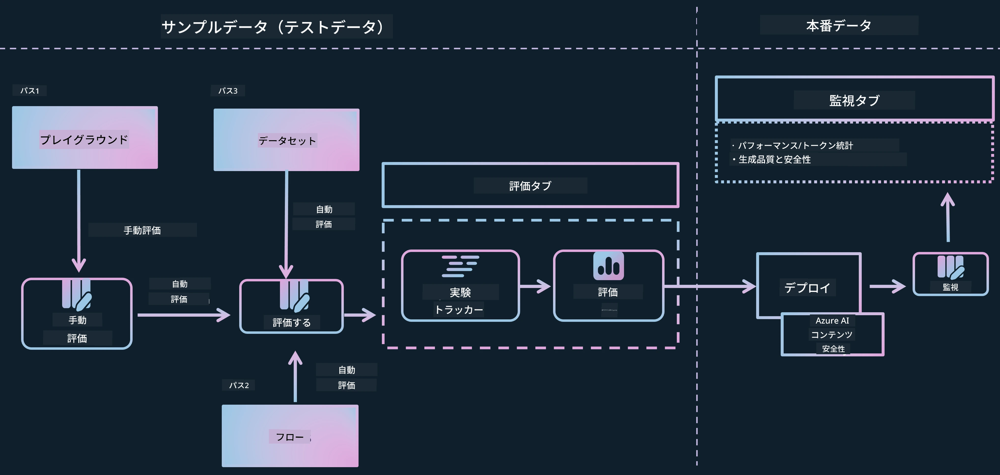

*画像出典: [Evaluation of generative AI applications](https://learn.microsoft.com/azure/ai-studio/concepts/evaluation-approach-gen-ai?wt.mc_id%3Dstudentamb_279723)*

> [!NOTE]
>
> Phi-3 / Phi-3.5に関する詳細情報や追加リソースについては、[Phi-3CookBook](https://github.com/microsoft/Phi-3CookBook?wt.mc_id=studentamb_279723)をご覧ください。

### 前提条件

- [Python](https://www.python.org/downloads)
- [Azureサブスクリプション](https://azure.microsoft.com/free?wt.mc_id=studentamb_279723)
- [Visual Studio Code](https://code.visualstudio.com)
- ファインチューニング済みPhi-3 / Phi-3.5モデル

### 目次

1. [**シナリオ1: Azure AI FoundryのPrompt flow評価の紹介**](../../../../../../md/02.Application/01.TextAndChat/Phi3)

    - [安全性評価の紹介](../../../../../../md/02.Application/01.TextAndChat/Phi3)
    - [性能評価の紹介](../../../../../../md/02.Application/01.TextAndChat/Phi3)

1. [**シナリオ2: Azure AI FoundryでのPhi-3 / Phi-3.5モデルの評価**](../../../../../../md/02.Application/01.TextAndChat/Phi3)

    - [始める前に](../../../../../../md/02.Application/01.TextAndChat/Phi3)
    - [Phi-3 / Phi-3.5モデルを評価するためのAzure OpenAIのデプロイ](../../../../../../md/02.Application/01.TextAndChat/Phi3)
    - [Azure AI FoundryのPrompt flow評価を使ったファインチューニング済みPhi-3 / Phi-3.5モデルの評価](../../../../../../md/02.Application/01.TextAndChat/Phi3)

1. [おめでとうございます！](../../../../../../md/02.Application/01.TextAndChat/Phi3)

## **シナリオ1: Azure AI FoundryのPrompt flow評価の紹介**

### 安全性評価の紹介

AIモデルが倫理的かつ安全であることを保証するために、Microsoftの責任あるAI原則に基づいて評価することが重要です。Azure AI Foundryでは、安全性評価により、モデルがジャイルブレイク攻撃に対してどれほど脆弱か、有害なコンテンツを生成する可能性がどの程度あるかを評価できます。これはこれらの原則に直接沿ったものです。


*画像出典: [Evaluation of generative AI applications](https://learn.microsoft.com/azure/ai-studio/concepts/evaluation-approach-gen-ai?wt.mc_id%3Dstudentamb_279723)*

#### Microsoftの責任あるAI原則

技術的な手順を始める前に、Microsoftの責任あるAI原則を理解することが不可欠です。これはAIシステムの責任ある開発、展開、運用を導く倫理的枠組みです。これらの原則は、公平で透明性があり包括的な方法でAI技術が構築されることを保証し、AIモデルの安全性評価の基盤となります。

Microsoftの責任あるAI原則には以下が含まれます：

- **公平性と包括性**：AIシステムはすべての人を公平に扱い、同様の状況にあるグループに異なる影響を与えないようにすべきです。例えば、医療治療、ローン申請、雇用に関するガイダンスを提供する際、同じ症状、経済状況、資格を持つ人には同じ推奨を行うべきです。

- **信頼性と安全性**：信頼を築くために、AIシステムは信頼性が高く、安全かつ一貫して動作することが重要です。これらのシステムは設計通りに動作し、予期しない状況にも安全に対応し、有害な操作に耐える必要があります。動作や対応可能な状況の幅は、設計・テスト時に開発者が想定した範囲を反映します。

- **透明性**：AIシステムが人々の生活に大きな影響を与える決定を支援する場合、その決定がどのように行われたかを人々が理解できることが重要です。例えば、銀行が信用力を判断するAIシステムや、企業が採用候補者を選ぶAIシステムなどです。

- **プライバシーとセキュリティ**：AIの普及に伴い、プライバシー保護と個人・企業情報のセキュリティはますます重要かつ複雑になっています。AIでは、正確で情報に基づいた予測や判断を行うためにデータへのアクセスが不可欠なため、プライバシーとデータセキュリティに特に注意が必要です。

- **説明責任**：AIシステムの設計・展開者は、そのシステムの動作に対して責任を負うべきです。組織は業界標準を活用して説明責任の基準を策定すべきです。これにより、AIシステムが人々の生活に影響を与える決定の最終権限とならず、人間が高度に自律的なAIシステムを意味のある形で制御し続けることが保証されます。

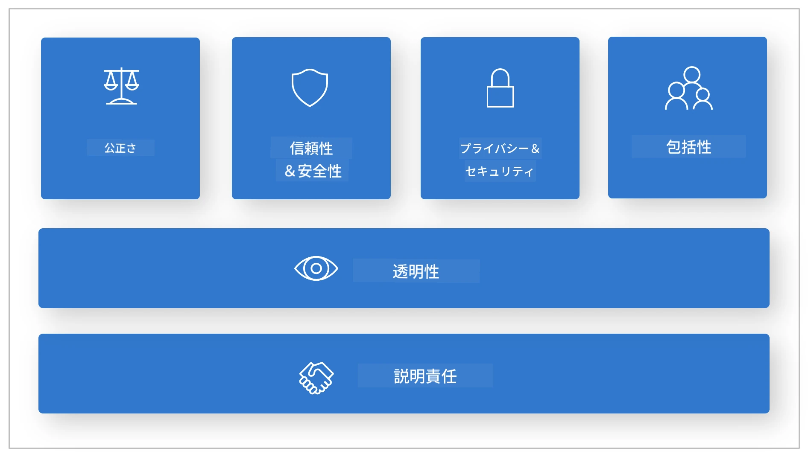

*画像出典: [What is Responsible AI?](https://learn.microsoft.com/azure/machine-learning/concept-responsible-ai?view=azureml-api-2&viewFallbackFrom=azureml-api-2%253fwt.mc_id%3Dstudentamb_279723)*

> [!NOTE]
> Microsoftの責任あるAI原則について詳しくは、[What is Responsible AI?](https://learn.microsoft.com/azure/machine-learning/concept-responsible-ai?view=azureml-api-2?wt.mc_id=studentamb_279723)をご覧ください。

#### 安全性指標

このチュートリアルでは、Azure AI Foundryの安全性指標を使ってファインチューニング済みPhi-3モデルの安全性を評価します。これらの指標は、モデルが有害なコンテンツを生成する可能性やジャイルブレイク攻撃に対する脆弱性を評価するのに役立ちます。安全性指標には以下が含まれます：

- **自傷関連コンテンツ**：モデルが自傷に関するコンテンツを生成する傾向があるかを評価します。
- **憎悪的・不公平なコンテンツ**：モデルが憎悪的または不公平なコンテンツを生成する傾向があるかを評価します。
- **暴力的コンテンツ**：モデルが暴力的なコンテンツを生成する傾向があるかを評価します。
- **性的コンテンツ**：モデルが不適切な性的コンテンツを生成する傾向があるかを評価します。

これらの側面を評価することで、AIモデルが有害または攻撃的なコンテンツを生成しないことを保証し、社会的価値観や規制基準に適合させます。

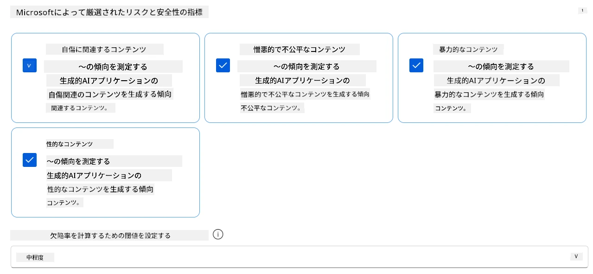

### 性能評価の紹介

AIモデルが期待通りに動作していることを確認するために、性能指標に基づいて評価することが重要です。Azure AI Foundryでは、性能評価により、モデルが正確で関連性があり一貫した応答を生成する効果を評価できます。

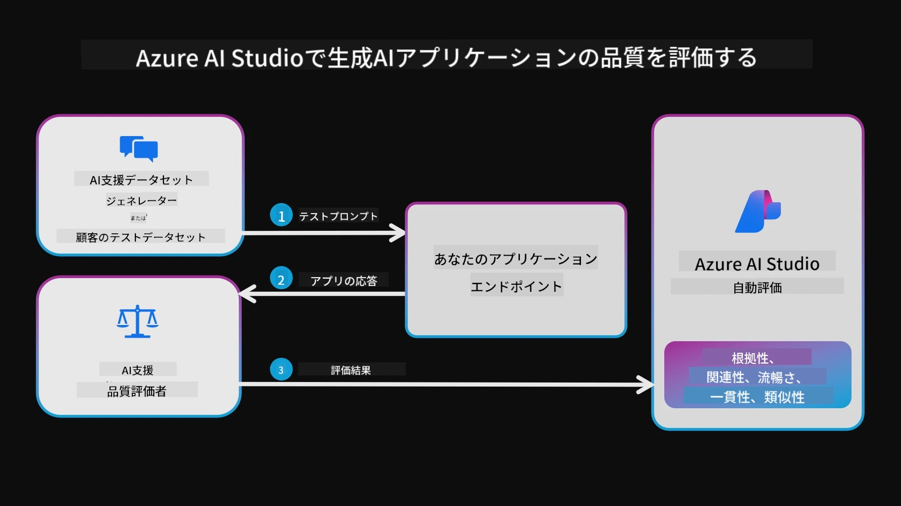

*画像出典: [Evaluation of generative AI applications](https://learn.microsoft.com/azure/ai-studio/concepts/evaluation-approach-gen-ai?wt.mc_id%3Dstudentamb_279723)*

#### 性能指標

このチュートリアルでは、Azure AI Foundryの性能指標を使ってファインチューニング済みPhi-3 / Phi-3.5モデルの性能を評価します。これらの指標は、モデルが正確で関連性があり一貫した応答を生成する効果を評価するのに役立ちます。性能指標には以下が含まれます：

- **根拠性（Groundedness）**：生成された回答が入力情報とどれだけ一致しているかを評価します。
- **関連性（Relevance）**：生成された応答が与えられた質問にどれだけ適切に関連しているかを評価します。
- **一貫性（Coherence）**：生成されたテキストがどれだけ自然に流れ、人間らしい言語に近いかを評価します。
- **流暢さ（Fluency）**：生成されたテキストの言語能力を評価します。
- **GPT類似度（GPT Similarity）**：生成された応答と正解データの類似度を比較します。
- **F1スコア**：生成された応答と元データ間で共有される単語の割合を計算します。

これらの指標により、モデルが正確で関連性があり一貫した応答を生成する能力を評価できます。

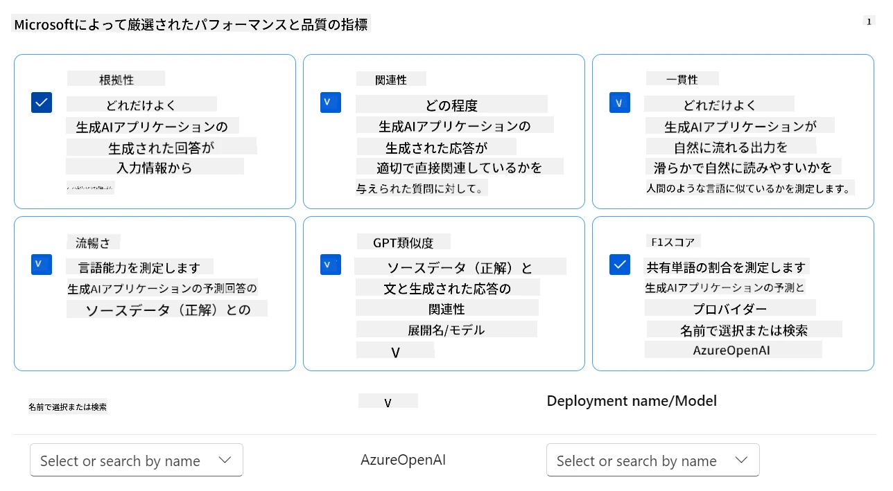

## **シナリオ2: Azure AI FoundryでのPhi-3 / Phi-3.5モデルの評価**

### 始める前に

このチュートリアルは、前回のブログ記事「[Fine-Tune and Integrate Custom Phi-3 Models with Prompt Flow: Step-by-Step Guide](https://techcommunity.microsoft.com/t5/educator-developer-blog/fine-tune-and-integrate-custom-phi-3-models-with-prompt-flow/ba-p/4178612?wt.mc_id=studentamb_279723)」および「[Fine-Tune and Integrate Custom Phi-3 Models with Prompt Flow in Azure AI Foundry](https://techcommunity.microsoft.com/t5/educator-developer-blog/fine-tune-and-integrate-custom-phi-3-models-with-prompt-flow-in/ba-p/4191726?wt.mc_id=studentamb_279723)」の続編です。これらの記事では、Azure AI FoundryでのPhi-3 / Phi-3.5モデルのファインチューニングとPrompt flowとの統合手順を解説しました。

本チュートリアルでは、Azure AI Foundryで評価者としてAzure OpenAIモデルをデプロイし、それを使ってファインチューニング済みPhi-3 / Phi-3.5モデルを評価します。

このチュートリアルを始める前に、前回のチュートリアルで説明した以下の前提条件を満たしていることを確認してください：

1. ファインチューニング済みPhi-3 / Phi-3.5モデルを評価するための準備済みデータセット
1. ファインチューニングされAzure Machine LearningにデプロイされたPhi-3 / Phi-3.5モデル
1. Azure AI Foundryでファインチューニング済みPhi-3 / Phi-3.5モデルと統合されたPrompt flow

> [!NOTE]
> 前回のブログ記事でダウンロードした**ULTRACHAT_200k**データセットのdataフォルダーにある*test_data.jsonl*ファイルを、ファインチューニング済みPhi-3 / Phi-3.5モデルの評価用データセットとして使用します。

#### Azure AI FoundryでのPrompt flowとカスタムPhi-3 / Phi-3.5モデルの統合（コードファーストアプローチ）
> [!NOTE]  
> "[Fine-Tune and Integrate Custom Phi-3 Models with Prompt Flow in Azure AI Foundry](https://techcommunity.microsoft.com/t5/educator-developer-blog/fine-tune-and-integrate-custom-phi-3-models-with-prompt-flow-in/ba-p/4191726?wt.mc_id=studentamb_279723)"で説明されているローコードアプローチに従った場合は、この演習をスキップして次に進んでください。  
> しかし、"[Fine-Tune and Integrate Custom Phi-3 Models with Prompt Flow: Step-by-Step Guide](https://techcommunity.microsoft.com/t5/educator-developer-blog/fine-tune-and-integrate-custom-phi-3-models-with-prompt-flow/ba-p/4178612?wt.mc_id=studentamb_279723)"で説明されているコードファーストアプローチに従ってPhi-3 / Phi-3.5モデルのファインチューニングとデプロイを行った場合、モデルをPrompt flowに接続する手順は少し異なります。この演習でその方法を学びます。
進めるには、ファインチューニング済みの Phi-3 / Phi-3.5 モデルを Azure AI Foundry の Prompt flow に統合する必要があります。

#### Azure AI Foundry Hub の作成

プロジェクトを作成する前に Hub を作成する必要があります。Hub はリソースグループのような役割を果たし、Azure AI Foundry 内で複数のプロジェクトを整理・管理できます。

1. [Azure AI Foundry](https://ai.azure.com/?wt.mc_id=studentamb_279723) にサインインします。

1. 左側のタブから **All hubs** を選択します。

1. ナビゲーションメニューから **+ New hub** を選択します。

    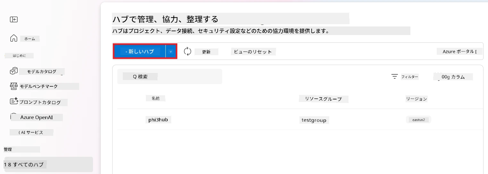

1. 以下の作業を行います：

    - **Hub name** を入力します。一意の値である必要があります。
    - Azure の **Subscription** を選択します。
    - 使用する **Resource group** を選択します（必要に応じて新規作成）。
    - 使用したい **Location** を選択します。
    - 使用する **Connect Azure AI Services** を選択します（必要に応じて新規作成）。
    - **Connect Azure AI Search** は **Skip connecting** を選択します。

    

1. **Next** を選択します。

#### Azure AI Foundry プロジェクトの作成

1. 作成した Hub 内で、左側のタブから **All projects** を選択します。

1. ナビゲーションメニューから **+ New project** を選択します。

    

1. **Project name** を入力します。一意の値である必要があります。

    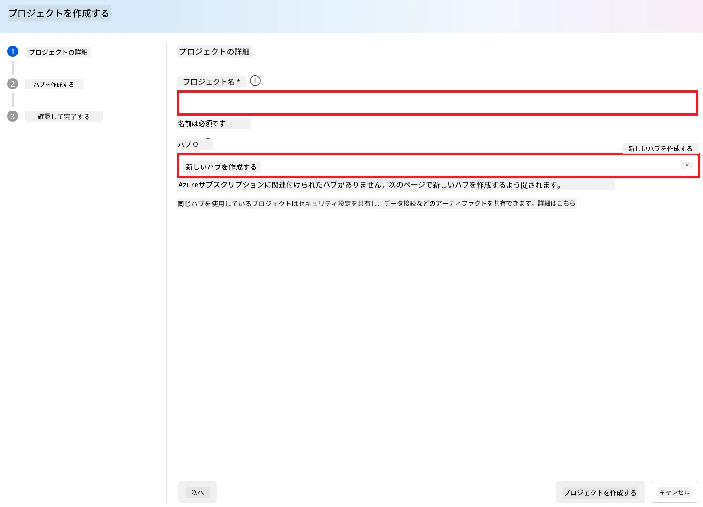

1. **Create a project** を選択します。

#### ファインチューニング済み Phi-3 / Phi-3.5 モデル用のカスタム接続を追加する

カスタム Phi-3 / Phi-3.5 モデルを Prompt flow に統合するには、モデルのエンドポイントとキーをカスタム接続に保存する必要があります。これにより、Prompt flow でカスタムモデルにアクセスできるようになります。

#### ファインチューニング済み Phi-3 / Phi-3.5 モデルの api key と endpoint uri を設定する

1. [Azure ML Studio](https://ml.azure.com/home?wt.mc_id=studentamb_279723) にアクセスします。

1. 作成した Azure Machine learning ワークスペースに移動します。

1. 左側のタブから **Endpoints** を選択します。

    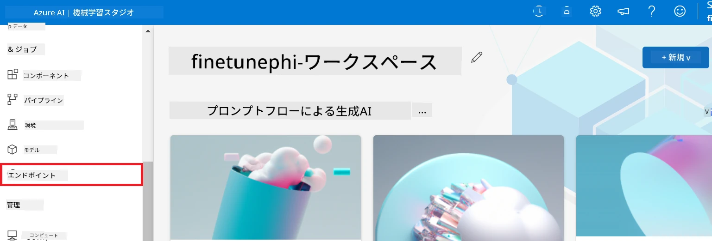

1. 作成したエンドポイントを選択します。

    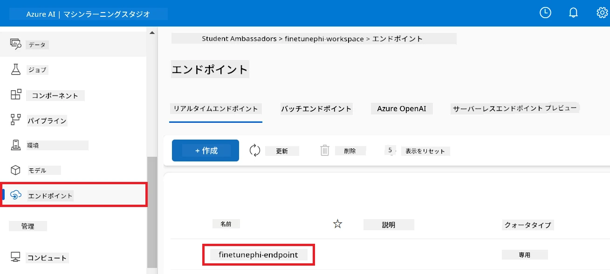

1. ナビゲーションメニューから **Consume** を選択します。

1. **REST endpoint** と **Primary key** をコピーします。

    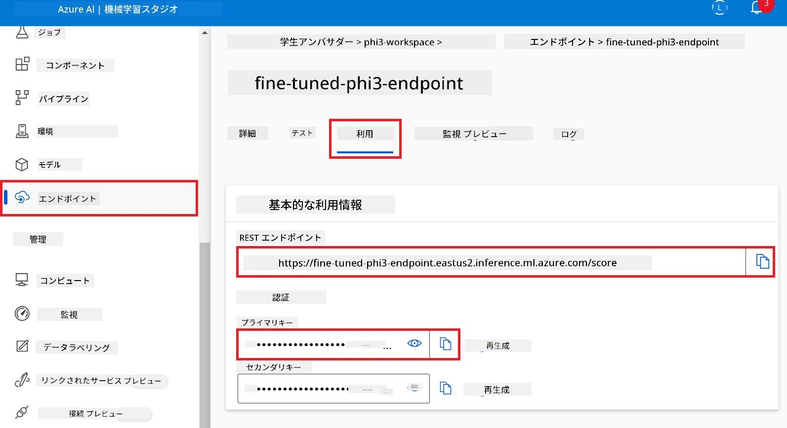

#### カスタム接続を追加する

1. [Azure AI Foundry](https://ai.azure.com/?wt.mc_id=studentamb_279723) にアクセスします。

1. 作成した Azure AI Foundry プロジェクトに移動します。

1. 作成したプロジェクト内で、左側のタブから **Settings** を選択します。

1. **+ New connection** を選択します。

    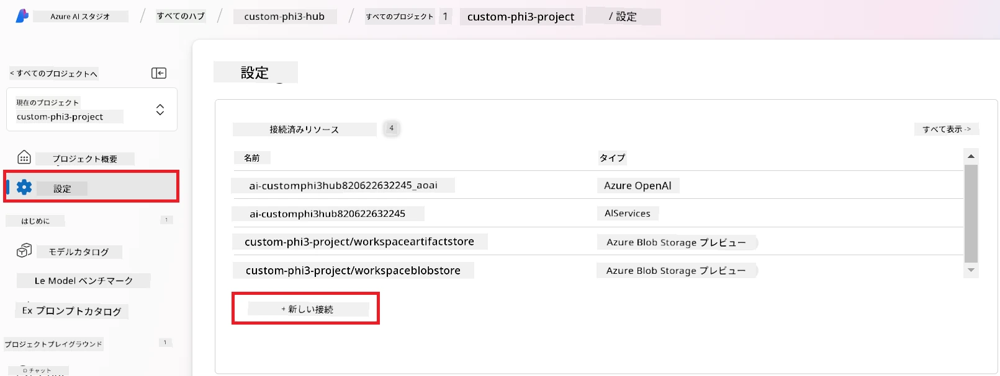

1. ナビゲーションメニューから **Custom keys** を選択します。

    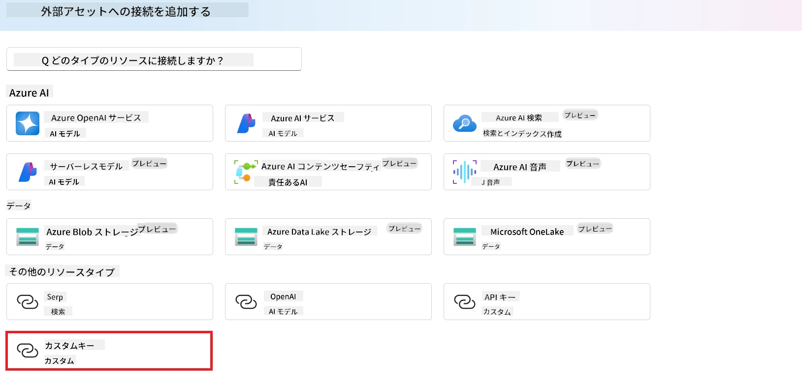

1. 以下の作業を行います：

    - **+ Add key value pairs** を選択します。
    - キー名に **endpoint** を入力し、Azure ML Studio からコピーしたエンドポイントを値の欄に貼り付けます。
    - 再度 **+ Add key value pairs** を選択します。
    - キー名に **key** を入力し、Azure ML Studio からコピーしたキーを値の欄に貼り付けます。
    - キーを追加した後、キーが漏洩しないように **is secret** を選択します。

    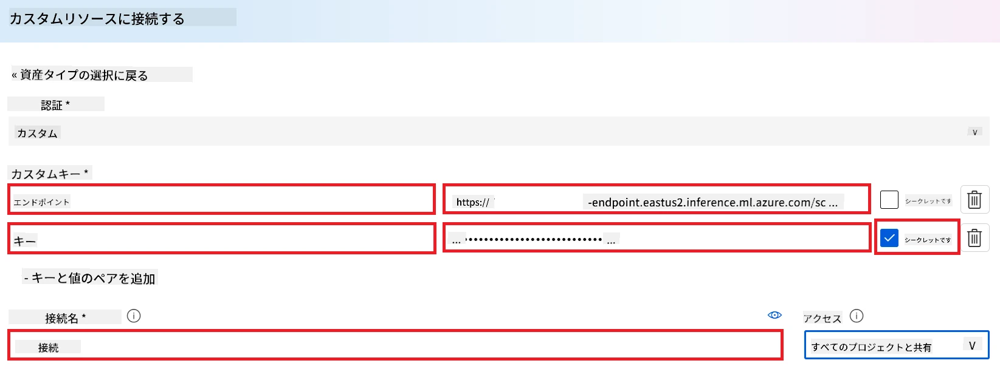

1. **Add connection** を選択します。

#### Prompt flow の作成

Azure AI Foundry にカスタム接続を追加しました。次に、以下の手順で Prompt flow を作成します。その後、この Prompt flow をカスタム接続に接続し、ファインチューニング済みモデルを Prompt flow 内で使用できるようにします。

1. 作成した Azure AI Foundry プロジェクトに移動します。

1. 左側のタブから **Prompt flow** を選択します。

1. ナビゲーションメニューから **+ Create** を選択します。

    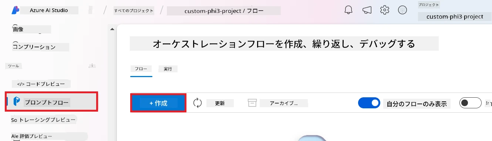

1. ナビゲーションメニューから **Chat flow** を選択します。

    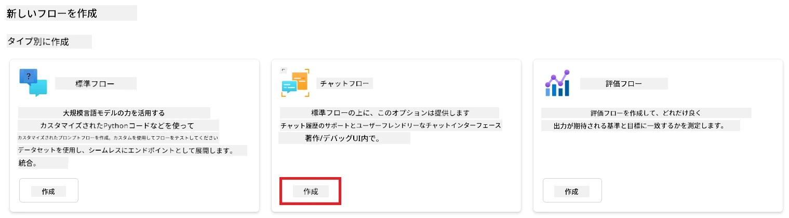

1. 使用する **Folder name** を入力します。

    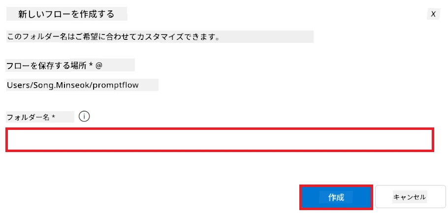

1. **Create** を選択します。

#### ファインチューニング済み Phi-3 / Phi-3.5 モデルとチャットするための Prompt flow の設定

ファインチューニング済み Phi-3 / Phi-3.5 モデルを Prompt flow に統合する必要があります。ただし、既存の Prompt flow はこの目的に対応していないため、カスタムモデルを統合できるように Prompt flow を再設計する必要があります。

1. Prompt flow 内で、既存のフローを再構築するために以下の作業を行います：

    - **Raw file mode** を選択します。
    - *flow.dag.yml* ファイル内の既存のコードをすべて削除します。
    - 以下のコードを *flow.dag.yml* に追加します。

        ```yml
        inputs:
          input_data:
            type: string
            default: "Who founded Microsoft?"

        outputs:
          answer:
            type: string
            reference: ${integrate_with_promptflow.output}

        nodes:
        - name: integrate_with_promptflow
          type: python
          source:
            type: code
            path: integrate_with_promptflow.py
          inputs:
            input_data: ${inputs.input_data}
        ```

    - **Save** を選択します。

    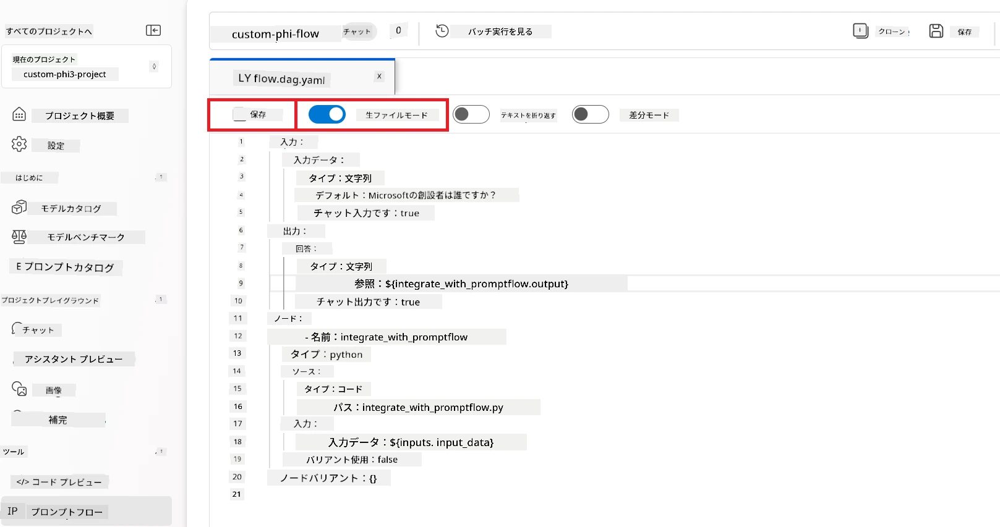

1. *integrate_with_promptflow.py* に以下のコードを追加し、Prompt flow でカスタム Phi-3 / Phi-3.5 モデルを使用できるようにします。

    ```python
    import logging
    import requests
    from promptflow import tool
    from promptflow.connections import CustomConnection

    # Logging setup
    logging.basicConfig(
        format="%(asctime)s - %(levelname)s - %(name)s - %(message)s",
        datefmt="%Y-%m-%d %H:%M:%S",
        level=logging.DEBUG
    )
    logger = logging.getLogger(__name__)

    def query_phi3_model(input_data: str, connection: CustomConnection) -> str:
        """
        Send a request to the Phi-3 / Phi-3.5 model endpoint with the given input data using Custom Connection.
        """

        # "connection" is the name of the Custom Connection, "endpoint", "key" are the keys in the Custom Connection
        endpoint_url = connection.endpoint
        api_key = connection.key

        headers = {
            "Content-Type": "application/json",
            "Authorization": f"Bearer {api_key}"
        }
    data = {
        "input_data": [input_data],
        "params": {
            "temperature": 0.7,
            "max_new_tokens": 128,
            "do_sample": True,
            "return_full_text": True
            }
        }
        try:
            response = requests.post(endpoint_url, json=data, headers=headers)
            response.raise_for_status()
            
            # Log the full JSON response
            logger.debug(f"Full JSON response: {response.json()}")

            result = response.json()["output"]
            logger.info("Successfully received response from Azure ML Endpoint.")
            return result
        except requests.exceptions.RequestException as e:
            logger.error(f"Error querying Azure ML Endpoint: {e}")
            raise

    @tool
    def my_python_tool(input_data: str, connection: CustomConnection) -> str:
        """
        Tool function to process input data and query the Phi-3 / Phi-3.5 model.
        """
        return query_phi3_model(input_data, connection)

    ```

    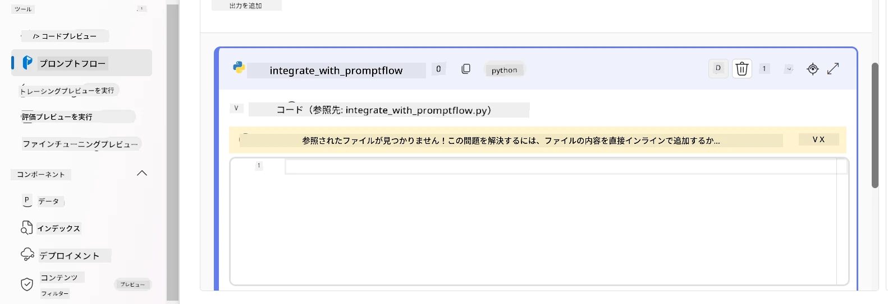

> [!NOTE]
> Azure AI Foundry での Prompt flow の詳細な使い方については、[Prompt flow in Azure AI Foundry](https://learn.microsoft.com/azure/ai-studio/how-to/prompt-flow) を参照してください。

1. **Chat input** と **Chat output** を選択して、モデルとのチャットを有効にします。

    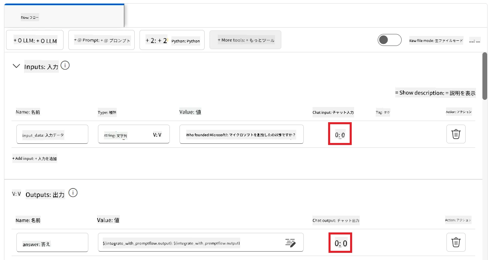

1. これでファインチューニング済み Phi-3 / Phi-3.5 モデルとチャットする準備が整いました。次の演習では、Prompt flow を起動し、ファインチューニング済みモデルとチャットする方法を学びます。

> [!NOTE]
>
> 再構築したフローは以下の画像のようになります：
>
> 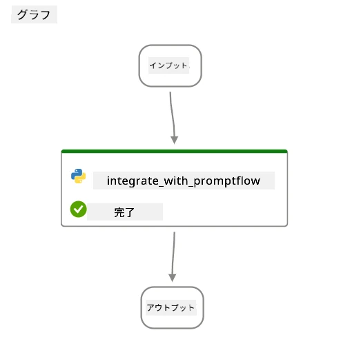
>

#### Prompt flow の起動

1. **Start compute sessions** を選択して Prompt flow を起動します。

    

1. **Validate and parse input** を選択してパラメーターを更新します。

    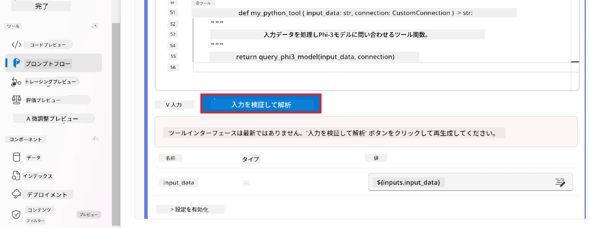

1. **connection** の **Value** に、作成したカスタム接続を選択します。例：*connection*。

    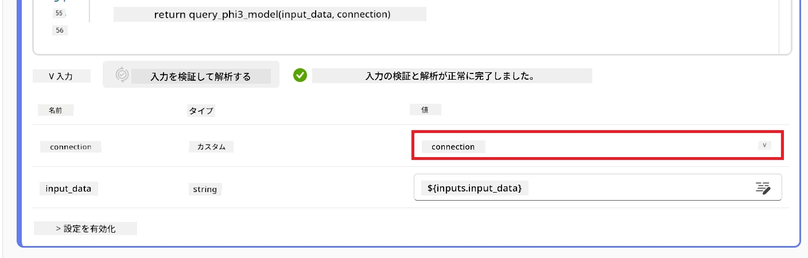

#### ファインチューニング済み Phi-3 / Phi-3.5 モデルとチャットする

1. **Chat** を選択します。

    

1. 結果の例は以下の通りです：これでファインチューニング済み Phi-3 / Phi-3.5 モデルとチャットできます。ファインチューニングに使用したデータに基づいた質問をすることを推奨します。

    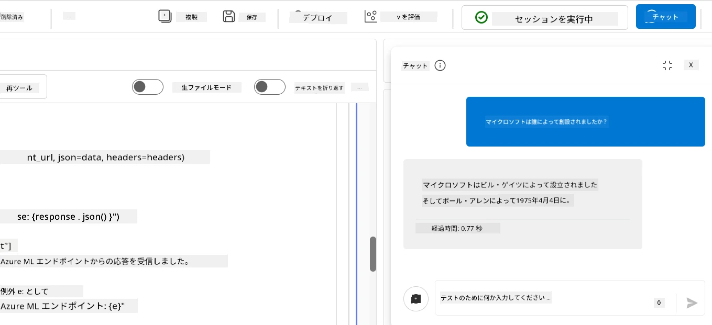

### Phi-3 / Phi-3.5 モデルを評価するための Azure OpenAI のデプロイ

Azure AI Foundry で Phi-3 / Phi-3.5 モデルを評価するには、Azure OpenAI モデルをデプロイする必要があります。このモデルは Phi-3 / Phi-3.5 モデルの性能評価に使用されます。

#### Azure OpenAI のデプロイ

1. [Azure AI Foundry](https://ai.azure.com/?wt.mc_id=studentamb_279723) にサインインします。

1. 作成した Azure AI Foundry プロジェクトに移動します。

    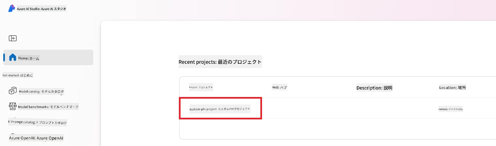

1. 作成したプロジェクト内で、左側のタブから **Deployments** を選択します。

1. ナビゲーションメニューから **+ Deploy model** を選択します。

1. **Deploy base model** を選択します。

    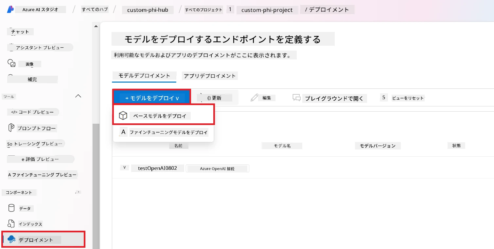

1. 使用したい Azure OpenAI モデルを選択します。例：**gpt-4o**。

    

1. **Confirm** を選択します。

### Azure AI Foundry の Prompt flow 評価を使ってファインチューニング済み Phi-3 / Phi-3.5 モデルを評価する

### 新しい評価を開始する

1. [Azure AI Foundry](https://ai.azure.com/?wt.mc_id=studentamb_279723) にアクセスします。

1. 作成した Azure AI Foundry プロジェクトに移動します。

    

1. 作成したプロジェクト内で、左側のタブから **Evaluation** を選択します。

1. ナビゲーションメニューから **+ New evaluation** を選択します。

    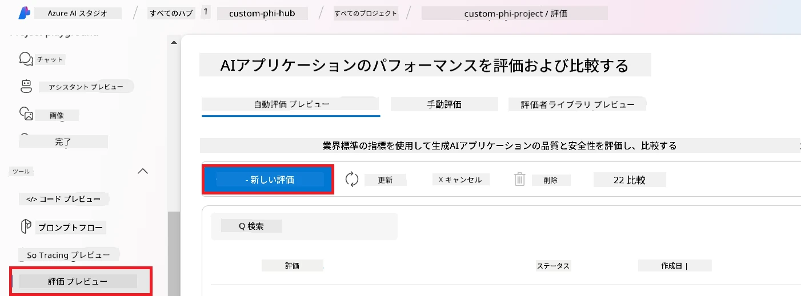

1. **Prompt flow** 評価を選択します。

    

1. 以下の作業を行います：

    - 評価名を入力します。一意の値である必要があります。
    - タスクタイプとして **Question and answer without context** を選択します。これは、このチュートリアルで使用する **ULTRACHAT_200k** データセットにコンテキストが含まれていないためです。
    - 評価したい Prompt flow を選択します。

    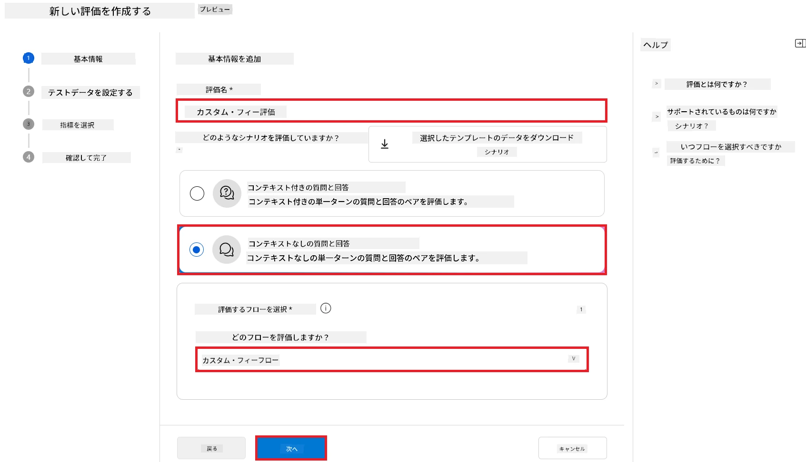

1. **Next** を選択します。

1. 以下の作業を行います：

    - **Add your dataset** を選択してデータセットをアップロードします。例として、**ULTRACHAT_200k** データセットをダウンロードした際に含まれるテストデータファイル *test_data.json1* をアップロードできます。
    - データセットに合った **Dataset column** を選択します。例として、**ULTRACHAT_200k** データセットを使用する場合は **${data.prompt}** を選択します。

    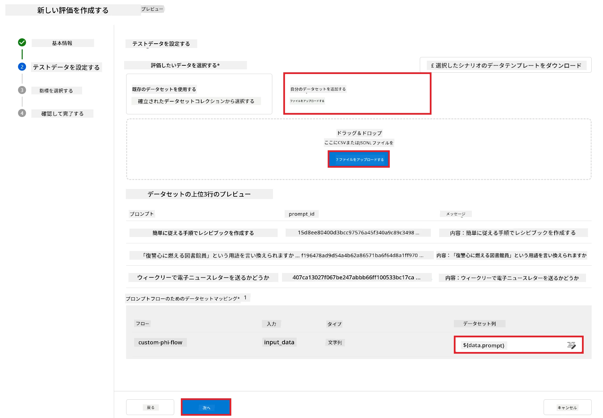

1. **Next** を選択します。

1. パフォーマンスと品質のメトリクスを設定します：

    - 使用したいパフォーマンスおよび品質のメトリクスを選択します。
    - 評価用に作成した Azure OpenAI モデルを選択します。例：**gpt-4o**。

    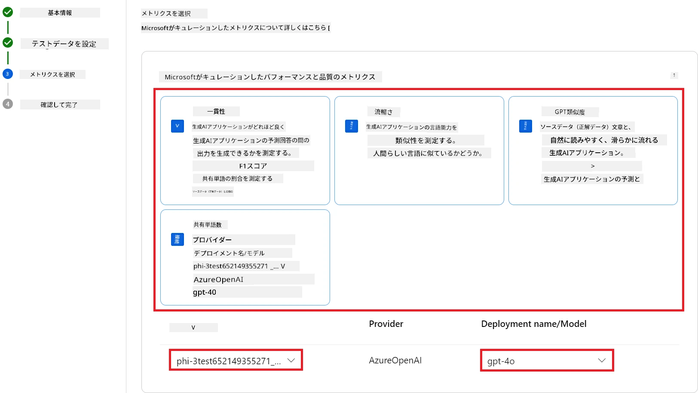

1. リスクと安全性のメトリクスを設定します：

    - 使用したいリスクおよび安全性のメトリクスを選択します。
    - 欠陥率を計算するための閾値を選択します。例：**Medium**。
    - **question** のデータソースを **{$data.prompt}** に設定します。
    - **answer** のデータソースを **{$run.outputs.answer}** に設定します。
    - **ground_truth** のデータソースを **{$data.message}** に設定します。

    

1. **Next** を選択します。

1. **Submit** を選択して評価を開始します。

1. 評価の完了には時間がかかります。進捗は **Evaluation** タブで確認できます。

### 評価結果の確認
> [!NOTE]
> 以下に示す結果は評価プロセスを説明するための例です。このチュートリアルでは比較的小さなデータセットでファインチューニングしたモデルを使用しているため、最適とは言えない結果になる可能性があります。実際の結果は、使用するデータセットのサイズ、品質、多様性やモデルの具体的な設定によって大きく異なる場合があります。
評価が完了したら、パフォーマンスと安全性の両方の指標の結果を確認できます。

1. パフォーマンスと品質の指標：

    - モデルが一貫性があり、流暢で関連性の高い応答を生成する効果を評価します。

    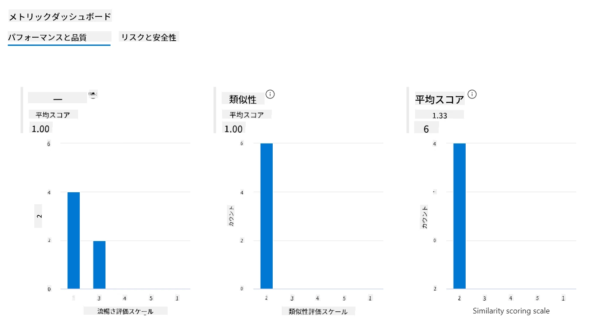

1. リスクと安全性の指標：

    - モデルの出力が安全であり、責任あるAIの原則に沿って、有害または攻撃的な内容を避けていることを確認します。

    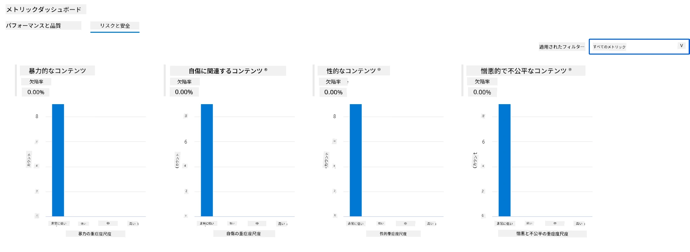

1. 下にスクロールして**詳細な指標結果**を確認できます。

    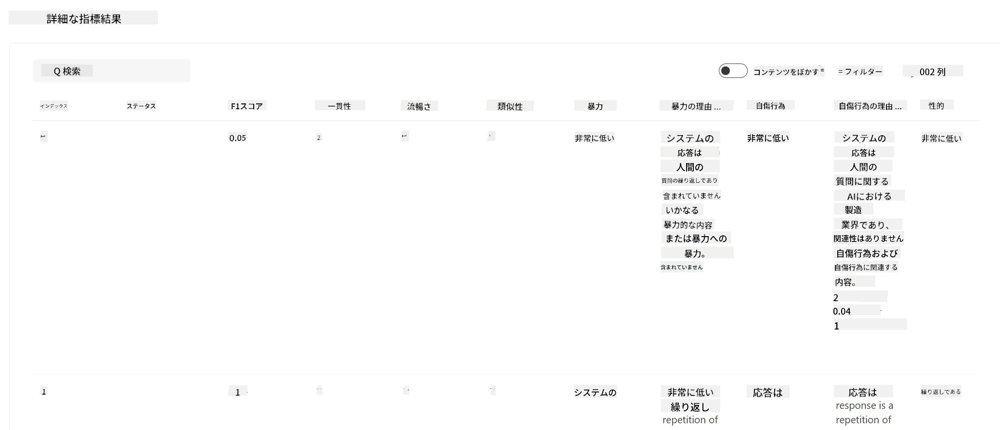

1. パフォーマンスと安全性の両方の指標に対してカスタムのPhi-3 / Phi-3.5モデルを評価することで、モデルが効果的であるだけでなく、責任あるAIの実践にも準拠していることを確認でき、実際の運用に適していることがわかります。

## おめでとうございます！

### チュートリアルを完了しました

Azure AI FoundryでPrompt flowと統合されたファインチューニング済みのPhi-3モデルを無事に評価できました。これは、AIモデルが高いパフォーマンスを発揮するだけでなく、Microsoftの責任あるAI原則に準拠し、信頼性の高いAIアプリケーションを構築するための重要なステップです。


## Azureリソースのクリーンアップ

追加の料金が発生しないようにAzureリソースをクリーンアップしてください。Azureポータルにアクセスし、以下のリソースを削除します：

- Azure Machine learningリソース
- Azure Machine learningモデルエンドポイント
- Azure AI Foundryプロジェクトリソース
- Azure AI Foundry Prompt flowリソース

### 次のステップ

#### ドキュメント

- [Responsible AIダッシュボードを使ったAIシステムの評価](https://learn.microsoft.com/azure/machine-learning/concept-responsible-ai-dashboard?view=azureml-api-2&source=recommendations?wt.mc_id=studentamb_279723)
- [生成AIの評価と監視指標](https://learn.microsoft.com/azure/ai-studio/concepts/evaluation-metrics-built-in?tabs=definition?wt.mc_id=studentamb_279723)
- [Azure AI Foundryドキュメント](https://learn.microsoft.com/azure/ai-studio/?wt.mc_id=studentamb_279723)
- [Prompt flowドキュメント](https://microsoft.github.io/promptflow/?wt.mc_id=studentamb_279723)

#### トレーニングコンテンツ

- [Microsoftの責任あるAIアプローチ入門](https://learn.microsoft.com/training/modules/introduction-to-microsofts-responsible-ai-approach/?source=recommendations?wt.mc_id=studentamb_279723)
- [Azure AI Foundry入門](https://learn.microsoft.com/training/modules/introduction-to-azure-ai-studio/?wt.mc_id=studentamb_279723)

### 参考資料

- [責任あるAIとは？](https://learn.microsoft.com/azure/machine-learning/concept-responsible-ai?view=azureml-api-2?wt.mc_id=studentamb_279723)
- [より安全で信頼性の高い生成AIアプリケーション構築を支援するAzure AIの新ツール発表](https://azure.microsoft.com/blog/announcing-new-tools-in-azure-ai-to-help-you-build-more-secure-and-trustworthy-generative-ai-applications/?wt.mc_id=studentamb_279723)
- [生成AIアプリケーションの評価](https://learn.microsoft.com/azure/ai-studio/concepts/evaluation-approach-gen-ai?wt.mc_id%3Dstudentamb_279723)

**免責事項**：  
本書類はAI翻訳サービス「[Co-op Translator](https://github.com/Azure/co-op-translator)」を使用して翻訳されました。正確性を期しておりますが、自動翻訳には誤りや不正確な部分が含まれる可能性があります。原文の言語によるオリジナル文書が正式な情報源とみなされるべきです。重要な情報については、専門の人間による翻訳を推奨します。本翻訳の利用により生じた誤解や誤訳について、当方は一切の責任を負いかねます。