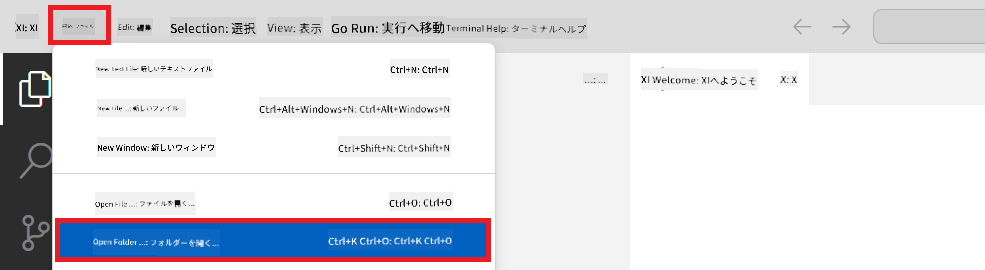
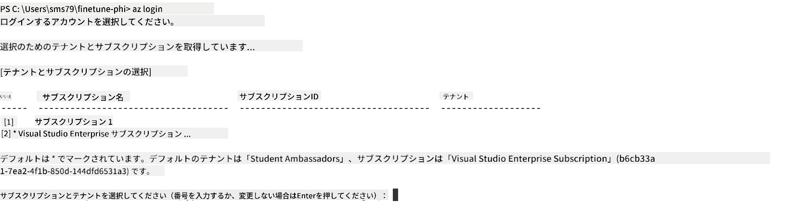
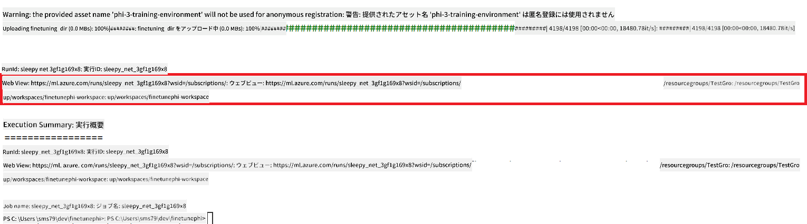
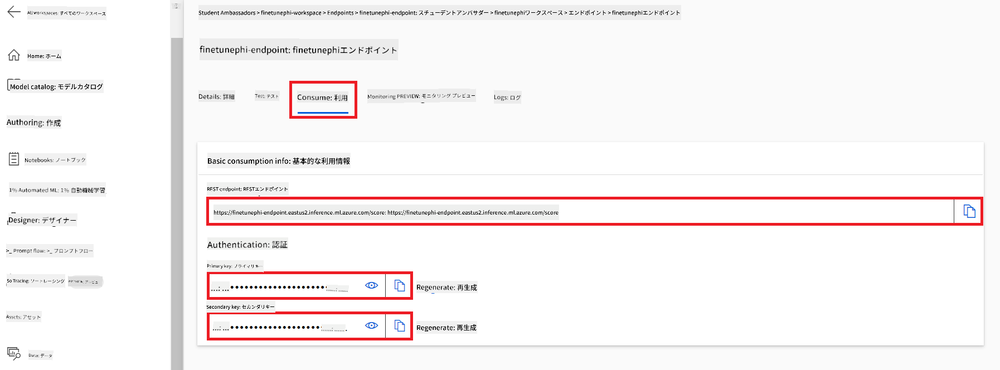

<!--
CO_OP_TRANSLATOR_METADATA:
{
  "original_hash": "455be2b7b9c3390d367d528f8fab2aa0",
  "translation_date": "2025-07-17T00:14:08+00:00",
  "source_file": "md/02.Application/01.TextAndChat/Phi3/E2E_Phi-3-FineTuning_PromptFlow_Integration.md",
  "language_code": "ja"
}
-->
# Fine-tune and Integrate custom Phi-3 models with Prompt flow

このエンドツーエンド（E2E）サンプルは、Microsoft Tech Communityのガイド「[Fine-Tune and Integrate Custom Phi-3 Models with Prompt Flow: Step-by-Step Guide](https://techcommunity.microsoft.com/t5/educator-developer-blog/fine-tune-and-integrate-custom-phi-3-models-with-prompt-flow/ba-p/4178612?WT.mc_id=aiml-137032-kinfeylo)」に基づいています。カスタムPhi-3モデルのファインチューニング、デプロイ、およびPrompt flowとの統合のプロセスを紹介します。

## 概要

このE2Eサンプルでは、Phi-3モデルのファインチューニングとPrompt flowとの統合方法を学びます。Azure Machine LearningとPrompt flowを活用して、カスタムAIモデルのデプロイと利用のためのワークフローを構築します。このE2Eサンプルは以下の3つのシナリオに分かれています。

**シナリオ1: Azureリソースのセットアップとファインチューニングの準備**

**シナリオ2: Phi-3モデルのファインチューニングとAzure Machine Learning Studioでのデプロイ**

**シナリオ3: Prompt flowとの統合とカスタムモデルとのチャット**

以下はこのE2Eサンプルの概要です。


### 目次

1. **[シナリオ1: Azureリソースのセットアップとファインチューニングの準備](../../../../../../md/02.Application/01.TextAndChat/Phi3)**
    - [Azure Machine Learning ワークスペースの作成](../../../../../../md/02.Application/01.TextAndChat/Phi3)
    - [AzureサブスクリプションでGPUクォータのリクエスト](../../../../../../md/02.Application/01.TextAndChat/Phi3)
    - [ロール割り当ての追加](../../../../../../md/02.Application/01.TextAndChat/Phi3)
    - [プロジェクトのセットアップ](../../../../../../md/02.Application/01.TextAndChat/Phi3)
    - [ファインチューニング用データセットの準備](../../../../../../md/02.Application/01.TextAndChat/Phi3)

1. **[シナリオ2: Phi-3モデルのファインチューニングとAzure Machine Learning Studioでのデプロイ](../../../../../../md/02.Application/01.TextAndChat/Phi3)**
    - [Azure CLIのセットアップ](../../../../../../md/02.Application/01.TextAndChat/Phi3)
    - [Phi-3モデルのファインチューニング](../../../../../../md/02.Application/01.TextAndChat/Phi3)
    - [ファインチューニング済みモデルのデプロイ](../../../../../../md/02.Application/01.TextAndChat/Phi3)

1. **[シナリオ3: Prompt flowとの統合とカスタムモデルとのチャット](../../../../../../md/02.Application/01.TextAndChat/Phi3)**
    - [カスタムPhi-3モデルをPrompt flowと統合](../../../../../../md/02.Application/01.TextAndChat/Phi3)
    - [カスタムモデルとのチャット](../../../../../../md/02.Application/01.TextAndChat/Phi3)

## シナリオ1: Azureリソースのセットアップとファインチューニングの準備

### Azure Machine Learning ワークスペースの作成

1. ポータルページ上部の**検索バー**に「azure machine learning」と入力し、表示されたオプションから**Azure Machine Learning**を選択します。

    

1. ナビゲーションメニューから**+ 作成**を選択します。

1. ナビゲーションメニューから**新しいワークスペース**を選択します。

    

1. 以下の項目を設定します：

    - Azureの**サブスクリプション**を選択します。
    - 使用する**リソースグループ**を選択（必要に応じて新規作成）。
    - **ワークスペース名**を入力。ユニークな値である必要があります。
    - 使用したい**リージョン**を選択します。
    - 使用する**ストレージアカウント**を選択（必要に応じて新規作成）。
    - 使用する**キーコンテナー**を選択（必要に応じて新規作成）。
    - 使用する**Application Insights**を選択（必要に応じて新規作成）。
    - 使用する**コンテナレジストリ**を選択（必要に応じて新規作成）。

    

1. **確認および作成**を選択します。

1. **作成**を選択します。

### AzureサブスクリプションでGPUクォータのリクエスト

このE2Eサンプルでは、ファインチューニングに*Standard_NC24ads_A100_v4 GPU*を使用します。これはクォータリクエストが必要です。デプロイには*Standard_E4s_v3* CPUを使用し、こちらはクォータリクエスト不要です。

> [!NOTE]
>
> GPU割り当てはPay-As-You-Goサブスクリプション（標準サブスクリプションタイプ）のみ対象であり、ベネフィットサブスクリプションは現在サポートされていません。
>
> ベネフィットサブスクリプション（例：Visual Studio Enterprise Subscription）を使用している場合や、ファインチューニングとデプロイのプロセスを手早く試したい場合は、CPUを使った最小限のデータセットでのファインチューニング方法も本チュートリアルで案内しています。ただし、GPUと大規模データセットを使った場合の方がファインチューニングの結果は大幅に良くなります。

1. [Azure ML Studio](https://ml.azure.com/home?wt.mc_id=studentamb_279723)にアクセスします。

1. *Standard NCADSA100v4 Family*クォータをリクエストするために以下を行います：

    - 左側のタブから**Quota**を選択。
    - 使用する**仮想マシンファミリー**を選択。例として、*Standard NCADSA100v4 Family Cluster Dedicated vCPUs*（*Standard_NC24ads_A100_v4* GPUを含む）を選択。
    - ナビゲーションメニューから**Request quota**を選択。

        

    - Request quotaページで、使用したい**新しいコア数の上限**を入力。例：24。
    - Request quotaページで**送信**を選択し、GPUクォータをリクエスト。

> [!NOTE]
> 必要に応じて、[Sizes for Virtual Machines in Azure](https://learn.microsoft.com/azure/virtual-machines/sizes/overview?tabs=breakdownseries%2Cgeneralsizelist%2Ccomputesizelist%2Cmemorysizelist%2Cstoragesizelist%2Cgpusizelist%2Cfpgasizelist%2Chpcsizelist)ドキュメントを参照し、適切なGPUまたはCPUを選択してください。

### ロール割り当ての追加

モデルのファインチューニングとデプロイを行うには、まずUser Assigned Managed Identity（UAI）を作成し、適切な権限を割り当てる必要があります。このUAIはデプロイ時の認証に使用されます。

#### User Assigned Managed Identity(UAI)の作成

1. ポータルページ上部の**検索バー**に「managed identities」と入力し、表示されたオプションから**Managed Identities**を選択します。

    

1. **+ 作成**を選択します。

    

1. 以下の項目を設定します：

    - Azureの**サブスクリプション**を選択。
    - 使用する**リソースグループ**を選択（必要に応じて新規作成）。
    - 使用したい**リージョン**を選択。
    - **名前**を入力。ユニークな値である必要があります。

1. **確認および作成**を選択します。

1. **+ 作成**を選択します。

#### Managed IdentityにContributorロールを割り当てる

1. 作成したManaged Identityリソースに移動します。

1. 左側のタブから**Azure role assignments**を選択します。

1. ナビゲーションメニューから**+ ロール割り当ての追加**を選択します。

1. ロール割り当て追加ページで以下を設定します：
    - **スコープ**を**リソースグループ**に設定。
    - Azureの**サブスクリプション**を選択。
    - 使用する**リソースグループ**を選択。
    - **ロール**を**Contributor**に設定。

    

1. **保存**を選択します。

#### Managed IdentityにStorage Blob Data Readerロールを割り当てる

1. ポータルページ上部の**検索バー**に「storage accounts」と入力し、表示されたオプションから**Storage accounts**を選択します。

    

1. 作成したAzure Machine Learningワークスペースに関連付けられたストレージアカウントを選択します。例：*finetunephistorage*。

1. ロール割り当て追加ページに移動するために以下を行います：

    - 作成したAzure Storageアカウントに移動。
    - 左側のタブから**アクセス制御 (IAM)**を選択。
    - ナビゲーションメニューから**+ 追加**を選択。
    - **ロール割り当ての追加**を選択。

    

1. ロール割り当て追加ページで以下を設定します：

    - ロールページの検索バーに「Storage Blob Data Reader」と入力し、表示された**Storage Blob Data Reader**を選択。
    - **次へ**を選択。
    - メンバーのページで**アクセスを割り当てる対象**を**Managed identity**に設定。
    - **+ メンバーの選択**を選択。
    - Managed identity選択ページでAzureの**サブスクリプション**を選択。
    - **Managed identity**を選択。
    - 作成したManaged Identityを選択。例：*finetunephi-managedidentity*。
    - **選択**を選択。

    

1. **確認および割り当て**を選択します。

#### Managed IdentityにAcrPullロールを割り当てる

1. ポータルページ上部の**検索バー**に「container registries」と入力し、表示されたオプションから**Container registries**を選択します。

    

1. Azure Machine Learningワークスペースに関連付けられたコンテナレジストリを選択します。例：*finetunephicontainerregistries*

1. ロール割り当て追加ページに移動するために以下を行います：

    - 左側のタブから**アクセス制御 (IAM)**を選択。
    - ナビゲーションメニューから**+ 追加**を選択。
    - **ロール割り当ての追加**を選択。

1. ロール割り当て追加ページで以下を設定します：

    - ロールページの検索バーに「AcrPull」と入力し、表示された**AcrPull**を選択。
    - **次へ**を選択。
    - メンバーのページで**アクセスを割り当てる対象**を**Managed identity**に設定。
    - **+ メンバーの選択**を選択。
    - Managed identity選択ページでAzureの**サブスクリプション**を選択。
    - **Managed identity**を選択。
    - 作成したManaged Identityを選択。例：*finetunephi-managedidentity*。
    - **選択**を選択。
    - **確認および割り当て**を選択。

### プロジェクトのセットアップ

ここからは作業用のフォルダーを作成し、ユーザーと対話し、Azure Cosmos DBに保存されたチャット履歴を利用して応答を生成するプログラムを開発するための仮想環境をセットアップします。

#### 作業用フォルダーの作成

1. ターミナルを開き、デフォルトのパスに*finetune-phi*という名前のフォルダーを作成するために以下のコマンドを入力します。

    ```console
    mkdir finetune-phi
    ```

1. 作成した*finetune-phi*フォルダーに移動するために以下のコマンドを入力します。

    ```console
    cd finetune-phi
    ```

#### 仮想環境の作成

1. *.venv*という名前の仮想環境を作成するために以下のコマンドを入力します。

    ```console
    python -m venv .venv
    ```

1. 仮想環境を有効化するために以下のコマンドを入力します。

    ```console
    .venv\Scripts\activate.bat
    ```
> [!NOTE]
>
> うまくいけば、コマンドプロンプトの前に *(.venv)* が表示されるはずです。
#### 必要なパッケージのインストール

1. ターミナルで以下のコマンドを入力し、必要なパッケージをインストールします。

    ```console
    pip install datasets==2.19.1
    pip install transformers==4.41.1
    pip install azure-ai-ml==1.16.0
    pip install torch==2.3.1
    pip install trl==0.9.4
    pip install promptflow==1.12.0
    ```

#### プロジェクトファイルの作成

この演習では、プロジェクトに必要な基本ファイルを作成します。これらのファイルには、データセットのダウンロード、Azure Machine Learning環境のセットアップ、Phi-3モデルのファインチューニング、ファインチューニング済みモデルのデプロイ用のスクリプトが含まれます。また、ファインチューニング環境を構築するための *conda.yml* ファイルも作成します。

この演習で行うこと：

- データセットをダウンロードするための *download_dataset.py* ファイルを作成します。
- Azure Machine Learning環境をセットアップするための *setup_ml.py* ファイルを作成します。
- *finetuning_dir* フォルダー内に *fine_tune.py* ファイルを作成し、データセットを使ってPhi-3モデルをファインチューニングします。
- ファインチューニング環境をセットアップするための *conda.yml* ファイルを作成します。
- ファインチューニング済みモデルをデプロイするための *deploy_model.py* ファイルを作成します。
- ファインチューニング済みモデルをPrompt flowと統合し、モデルを実行するための *integrate_with_promptflow.py* ファイルを作成します。
- Prompt flowのワークフロー構造を設定するための *flow.dag.yml* ファイルを作成します。
- Azure情報を入力するための *config.py* ファイルを作成します。

> [!NOTE]
>
> 完成したフォルダ構成：
>
> ```text
> └── YourUserName
> .    └── finetune-phi
> .        ├── finetuning_dir
> .        │      └── fine_tune.py
> .        ├── conda.yml
> .        ├── config.py
> .        ├── deploy_model.py
> .        ├── download_dataset.py
> .        ├── flow.dag.yml
> .        ├── integrate_with_promptflow.py
> .        └── setup_ml.py
> ```

1. **Visual Studio Code** を開きます。

1. メニューバーから **File** を選択します。

1. **Open Folder** を選択します。

1. 作成した *finetune-phi* フォルダーを選択します。場所は *C:\Users\yourUserName\finetune-phi* です。

    

1. Visual Studio Codeの左ペインで右クリックし、**New File** を選択して *download_dataset.py* ファイルを作成します。

1. 同様に、*setup_ml.py* ファイルを作成します。

1. 同様に、*deploy_model.py* ファイルを作成します。

    

1. 左ペインで右クリックし、**New Folder** を選択して *finetuning_dir* フォルダーを作成します。

1. *finetuning_dir* フォルダー内に *fine_tune.py* ファイルを作成します。

#### *conda.yml* ファイルの作成と設定

1. 左ペインで右クリックし、**New File** を選択して *conda.yml* ファイルを作成します。

1. 以下のコードを *conda.yml* ファイルに追加し、Phi-3モデルのファインチューニング環境をセットアップします。

    ```yml
    name: phi-3-training-env
    channels:
      - defaults
      - conda-forge
    dependencies:
      - python=3.10
      - pip
      - numpy<2.0
      - pip:
          - torch==2.4.0
          - torchvision==0.19.0
          - trl==0.8.6
          - transformers==4.41
          - datasets==2.21.0
          - azureml-core==1.57.0
          - azure-storage-blob==12.19.0
          - azure-ai-ml==1.16
          - azure-identity==1.17.1
          - accelerate==0.33.0
          - mlflow==2.15.1
          - azureml-mlflow==1.57.0
    ```

#### *config.py* ファイルの作成と設定

1. 左ペインで右クリックし、**New File** を選択して *config.py* ファイルを作成します。

1. 以下のコードを *config.py* ファイルに追加し、Azure情報を入力します。

    ```python
    # Azure settings
    AZURE_SUBSCRIPTION_ID = "your_subscription_id"
    AZURE_RESOURCE_GROUP_NAME = "your_resource_group_name" # "TestGroup"

    # Azure Machine Learning settings
    AZURE_ML_WORKSPACE_NAME = "your_workspace_name" # "finetunephi-workspace"

    # Azure Managed Identity settings
    AZURE_MANAGED_IDENTITY_CLIENT_ID = "your_azure_managed_identity_client_id"
    AZURE_MANAGED_IDENTITY_NAME = "your_azure_managed_identity_name" # "finetunephi-mangedidentity"
    AZURE_MANAGED_IDENTITY_RESOURCE_ID = f"/subscriptions/{AZURE_SUBSCRIPTION_ID}/resourceGroups/{AZURE_RESOURCE_GROUP_NAME}/providers/Microsoft.ManagedIdentity/userAssignedIdentities/{AZURE_MANAGED_IDENTITY_NAME}"

    # Dataset file paths
    TRAIN_DATA_PATH = "data/train_data.jsonl"
    TEST_DATA_PATH = "data/test_data.jsonl"

    # Fine-tuned model settings
    AZURE_MODEL_NAME = "your_fine_tuned_model_name" # "finetune-phi-model"
    AZURE_ENDPOINT_NAME = "your_fine_tuned_model_endpoint_name" # "finetune-phi-endpoint"
    AZURE_DEPLOYMENT_NAME = "your_fine_tuned_model_deployment_name" # "finetune-phi-deployment"

    AZURE_ML_API_KEY = "your_fine_tuned_model_api_key"
    AZURE_ML_ENDPOINT = "your_fine_tuned_model_endpoint_uri" # "https://{your-endpoint-name}.{your-region}.inference.ml.azure.com/score"
    ```

#### Azure環境変数の追加

1. Azure Subscription IDを追加する手順：

    - ポータルページ上部の **検索バー** に *subscriptions* と入力し、表示されたオプションから **Subscriptions** を選択します。
    - 現在使用しているAzureサブスクリプションを選択します。
    - Subscription IDをコピーし、*config.py* ファイルに貼り付けます。

    

1. Azure Workspace Nameを追加する手順：

    - 作成したAzure Machine Learningリソースに移動します。
    - アカウント名をコピーし、*config.py* ファイルに貼り付けます。

    

1. Azure Resource Group Nameを追加する手順：

    - 作成したAzure Machine Learningリソースに移動します。
    - Azure Resource Group名をコピーし、*config.py* ファイルに貼り付けます。

    

2. Azure Managed Identity名を追加する手順：

    - 作成したManaged Identitiesリソースに移動します。
    - Azure Managed Identity名をコピーし、*config.py* ファイルに貼り付けます。

    

### ファインチューニング用データセットの準備

この演習では、*download_dataset.py* ファイルを実行して *ULTRACHAT_200k* データセットをローカル環境にダウンロードします。その後、このデータセットを使ってAzure Machine Learning上でPhi-3モデルをファインチューニングします。

#### *download_dataset.py* を使ってデータセットをダウンロード

1. Visual Studio Codeで *download_dataset.py* ファイルを開きます。

1. 以下のコードを *download_dataset.py* に追加します。

    ```python
    import json
    import os
    from datasets import load_dataset
    from config import (
        TRAIN_DATA_PATH,
        TEST_DATA_PATH)

    def load_and_split_dataset(dataset_name, config_name, split_ratio):
        """
        Load and split a dataset.
        """
        # Load the dataset with the specified name, configuration, and split ratio
        dataset = load_dataset(dataset_name, config_name, split=split_ratio)
        print(f"Original dataset size: {len(dataset)}")
        
        # Split the dataset into train and test sets (80% train, 20% test)
        split_dataset = dataset.train_test_split(test_size=0.2)
        print(f"Train dataset size: {len(split_dataset['train'])}")
        print(f"Test dataset size: {len(split_dataset['test'])}")
        
        return split_dataset

    def save_dataset_to_jsonl(dataset, filepath):
        """
        Save a dataset to a JSONL file.
        """
        # Create the directory if it does not exist
        os.makedirs(os.path.dirname(filepath), exist_ok=True)
        
        # Open the file in write mode
        with open(filepath, 'w', encoding='utf-8') as f:
            # Iterate over each record in the dataset
            for record in dataset:
                # Dump the record as a JSON object and write it to the file
                json.dump(record, f)
                # Write a newline character to separate records
                f.write('\n')
        
        print(f"Dataset saved to {filepath}")

    def main():
        """
        Main function to load, split, and save the dataset.
        """
        # Load and split the ULTRACHAT_200k dataset with a specific configuration and split ratio
        dataset = load_and_split_dataset("HuggingFaceH4/ultrachat_200k", 'default', 'train_sft[:1%]')
        
        # Extract the train and test datasets from the split
        train_dataset = dataset['train']
        test_dataset = dataset['test']

        # Save the train dataset to a JSONL file
        save_dataset_to_jsonl(train_dataset, TRAIN_DATA_PATH)
        
        # Save the test dataset to a separate JSONL file
        save_dataset_to_jsonl(test_dataset, TEST_DATA_PATH)

    if __name__ == "__main__":
        main()

    ```

> [!TIP]
>
> **CPUを使った最小限データセットでのファインチューニングのガイド**
>
> CPUでファインチューニングを行いたい場合、この方法はVisual Studio Enterprise Subscriptionなどの特典サブスクリプションを持つ方や、ファインチューニングとデプロイのプロセスを素早くテストしたい方に最適です。
>
> `dataset = load_and_split_dataset("HuggingFaceH4/ultrachat_200k", 'default', 'train_sft[:1%]')` を `dataset = load_and_split_dataset("HuggingFaceH4/ultrachat_200k", 'default', 'train_sft[:10]')` に置き換えてください。
>

1. ターミナルで以下のコマンドを入力し、スクリプトを実行してデータセットをローカル環境にダウンロードします。

    ```console
    python download_data.py
    ```

1. データセットがローカルの *finetune-phi/data* ディレクトリに正常に保存されたことを確認します。

> [!NOTE]
>
> **データセットのサイズとファインチューニング時間**
>
> このE2Eサンプルでは、データセットの1%（`train_sft[:1%]`）のみを使用しています。これによりデータ量が大幅に減り、アップロードとファインチューニングの時間が短縮されます。トレーニング時間とモデル性能のバランスを見ながら、パーセンテージを調整してください。データセットのサブセットを小さくすることで、ファインチューニングにかかる時間を短縮し、E2Eサンプルとして扱いやすくなります。

## シナリオ2：Phi-3モデルのファインチューニングとAzure Machine Learning Studioでのデプロイ

### Azure CLIのセットアップ

環境認証のためにAzure CLIをセットアップする必要があります。Azure CLIを使うことで、コマンドラインから直接Azureリソースを管理でき、Azure Machine Learningがこれらのリソースにアクセスするための認証情報を提供します。まずは [Azure CLIのインストール](https://learn.microsoft.com/cli/azure/install-azure-cli) を行ってください。

1. ターミナルを開き、以下のコマンドを入力してAzureアカウントにログインします。

    ```console
    az login
    ```

1. 使用するAzureアカウントを選択します。

1. 使用するAzureサブスクリプションを選択します。

    

> [!TIP]
>
> Azureへのサインインに問題がある場合は、デバイスコードを使ってみてください。ターミナルを開き、以下のコマンドを入力してAzureアカウントにサインインします：
>
> ```console
> az login --use-device-code
> ```
>

### Phi-3モデルのファインチューニング

この演習では、提供されたデータセットを使ってPhi-3モデルをファインチューニングします。まず、*fine_tune.py* ファイルでファインチューニングの処理を定義します。次に、Azure Machine Learning環境を設定し、*setup_ml.py* ファイルを実行してファインチューニングを開始します。このスクリプトにより、ファインチューニングはAzure Machine Learning環境内で実行されます。

*setup_ml.py* を実行することで、Azure Machine Learning環境でファインチューニングが開始されます。

#### *fine_tune.py* ファイルにコードを追加

1. *finetuning_dir* フォルダーに移動し、Visual Studio Codeで *fine_tune.py* ファイルを開きます。

1. 以下のコードを *fine_tune.py* に追加します。

    ```python
    import argparse
    import sys
    import logging
    import os
    from datasets import load_dataset
    import torch
    import mlflow
    from transformers import AutoModelForCausalLM, AutoTokenizer, TrainingArguments
    from trl import SFTTrainer

    # To avoid the INVALID_PARAMETER_VALUE error in MLflow, disable MLflow integration
    os.environ["DISABLE_MLFLOW_INTEGRATION"] = "True"

    # Logging setup
    logging.basicConfig(
        format="%(asctime)s - %(levelname)s - %(name)s - %(message)s",
        datefmt="%Y-%m-%d %H:%M:%S",
        handlers=[logging.StreamHandler(sys.stdout)],
        level=logging.WARNING
    )
    logger = logging.getLogger(__name__)

    def initialize_model_and_tokenizer(model_name, model_kwargs):
        """
        Initialize the model and tokenizer with the given pretrained model name and arguments.
        """
        model = AutoModelForCausalLM.from_pretrained(model_name, **model_kwargs)
        tokenizer = AutoTokenizer.from_pretrained(model_name)
        tokenizer.model_max_length = 2048
        tokenizer.pad_token = tokenizer.unk_token
        tokenizer.pad_token_id = tokenizer.convert_tokens_to_ids(tokenizer.pad_token)
        tokenizer.padding_side = 'right'
        return model, tokenizer

    def apply_chat_template(example, tokenizer):
        """
        Apply a chat template to tokenize messages in the example.
        """
        messages = example["messages"]
        if messages[0]["role"] != "system":
            messages.insert(0, {"role": "system", "content": ""})
        example["text"] = tokenizer.apply_chat_template(
            messages, tokenize=False, add_generation_prompt=False
        )
        return example

    def load_and_preprocess_data(train_filepath, test_filepath, tokenizer):
        """
        Load and preprocess the dataset.
        """
        train_dataset = load_dataset('json', data_files=train_filepath, split='train')
        test_dataset = load_dataset('json', data_files=test_filepath, split='train')
        column_names = list(train_dataset.features)

        train_dataset = train_dataset.map(
            apply_chat_template,
            fn_kwargs={"tokenizer": tokenizer},
            num_proc=10,
            remove_columns=column_names,
            desc="Applying chat template to train dataset",
        )

        test_dataset = test_dataset.map(
            apply_chat_template,
            fn_kwargs={"tokenizer": tokenizer},
            num_proc=10,
            remove_columns=column_names,
            desc="Applying chat template to test dataset",
        )

        return train_dataset, test_dataset

    def train_and_evaluate_model(train_dataset, test_dataset, model, tokenizer, output_dir):
        """
        Train and evaluate the model.
        """
        training_args = TrainingArguments(
            bf16=True,
            do_eval=True,
            output_dir=output_dir,
            eval_strategy="epoch",
            learning_rate=5.0e-06,
            logging_steps=20,
            lr_scheduler_type="cosine",
            num_train_epochs=3,
            overwrite_output_dir=True,
            per_device_eval_batch_size=4,
            per_device_train_batch_size=4,
            remove_unused_columns=True,
            save_steps=500,
            seed=0,
            gradient_checkpointing=True,
            gradient_accumulation_steps=1,
            warmup_ratio=0.2,
        )

        trainer = SFTTrainer(
            model=model,
            args=training_args,
            train_dataset=train_dataset,
            eval_dataset=test_dataset,
            max_seq_length=2048,
            dataset_text_field="text",
            tokenizer=tokenizer,
            packing=True
        )

        train_result = trainer.train()
        trainer.log_metrics("train", train_result.metrics)

        mlflow.transformers.log_model(
            transformers_model={"model": trainer.model, "tokenizer": tokenizer},
            artifact_path=output_dir,
        )

        tokenizer.padding_side = 'left'
        eval_metrics = trainer.evaluate()
        eval_metrics["eval_samples"] = len(test_dataset)
        trainer.log_metrics("eval", eval_metrics)

    def main(train_file, eval_file, model_output_dir):
        """
        Main function to fine-tune the model.
        """
        model_kwargs = {
            "use_cache": False,
            "trust_remote_code": True,
            "torch_dtype": torch.bfloat16,
            "device_map": None,
            "attn_implementation": "eager"
        }

        # pretrained_model_name = "microsoft/Phi-3-mini-4k-instruct"
        pretrained_model_name = "microsoft/Phi-3.5-mini-instruct"

        with mlflow.start_run():
            model, tokenizer = initialize_model_and_tokenizer(pretrained_model_name, model_kwargs)
            train_dataset, test_dataset = load_and_preprocess_data(train_file, eval_file, tokenizer)
            train_and_evaluate_model(train_dataset, test_dataset, model, tokenizer, model_output_dir)

    if __name__ == "__main__":
        parser = argparse.ArgumentParser()
        parser.add_argument("--train-file", type=str, required=True, help="Path to the training data")
        parser.add_argument("--eval-file", type=str, required=True, help="Path to the evaluation data")
        parser.add_argument("--model_output_dir", type=str, required=True, help="Directory to save the fine-tuned model")
        args = parser.parse_args()
        main(args.train_file, args.eval_file, args.model_output_dir)

    ```

1. *fine_tune.py* ファイルを保存して閉じます。

> [!TIP]
> **Phi-3.5モデルのファインチューニングも可能です**
>
> *fine_tune.py* ファイル内の `pretrained_model_name` を `"microsoft/Phi-3-mini-4k-instruct"` から任意のモデル名に変更できます。例えば、`"microsoft/Phi-3.5-mini-instruct"` に変更すると、Phi-3.5-mini-instructモデルでファインチューニングが行えます。使用したいモデル名は [Hugging Face](https://huggingface.co/) で検索し、名前をコピーしてスクリプトの `pretrained_model_name` フィールドに貼り付けてください。
>
> :::image type="content" source="../../imgs/03/FineTuning-PromptFlow/finetunephi3.5.png" alt-text="Phi-3.5のファインチューニング":::
>

#### *setup_ml.py* ファイルにコードを追加

1. Visual Studio Codeで *setup_ml.py* ファイルを開きます。

1. 以下のコードを *setup_ml.py* に追加します。

    ```python
    import logging
    from azure.ai.ml import MLClient, command, Input
    from azure.ai.ml.entities import Environment, AmlCompute
    from azure.identity import AzureCliCredential
    from config import (
        AZURE_SUBSCRIPTION_ID,
        AZURE_RESOURCE_GROUP_NAME,
        AZURE_ML_WORKSPACE_NAME,
        TRAIN_DATA_PATH,
        TEST_DATA_PATH
    )

    # Constants

    # Uncomment the following lines to use a CPU instance for training
    # COMPUTE_INSTANCE_TYPE = "Standard_E16s_v3" # cpu
    # COMPUTE_NAME = "cpu-e16s-v3"
    # DOCKER_IMAGE_NAME = "mcr.microsoft.com/azureml/openmpi4.1.0-ubuntu20.04:latest"

    # Uncomment the following lines to use a GPU instance for training
    COMPUTE_INSTANCE_TYPE = "Standard_NC24ads_A100_v4"
    COMPUTE_NAME = "gpu-nc24s-a100-v4"
    DOCKER_IMAGE_NAME = "mcr.microsoft.com/azureml/curated/acft-hf-nlp-gpu:59"

    CONDA_FILE = "conda.yml"
    LOCATION = "eastus2" # Replace with the location of your compute cluster
    FINETUNING_DIR = "./finetuning_dir" # Path to the fine-tuning script
    TRAINING_ENV_NAME = "phi-3-training-environment" # Name of the training environment
    MODEL_OUTPUT_DIR = "./model_output" # Path to the model output directory in azure ml

    # Logging setup to track the process
    logger = logging.getLogger(__name__)
    logging.basicConfig(
        format="%(asctime)s - %(levelname)s - %(name)s - %(message)s",
        datefmt="%Y-%m-%d %H:%M:%S",
        level=logging.WARNING
    )

    def get_ml_client():
        """
        Initialize the ML Client using Azure CLI credentials.
        """
        credential = AzureCliCredential()
        return MLClient(credential, AZURE_SUBSCRIPTION_ID, AZURE_RESOURCE_GROUP_NAME, AZURE_ML_WORKSPACE_NAME)

    def create_or_get_environment(ml_client):
        """
        Create or update the training environment in Azure ML.
        """
        env = Environment(
            image=DOCKER_IMAGE_NAME,  # Docker image for the environment
            conda_file=CONDA_FILE,  # Conda environment file
            name=TRAINING_ENV_NAME,  # Name of the environment
        )
        return ml_client.environments.create_or_update(env)

    def create_or_get_compute_cluster(ml_client, compute_name, COMPUTE_INSTANCE_TYPE, location):
        """
        Create or update the compute cluster in Azure ML.
        """
        try:
            compute_cluster = ml_client.compute.get(compute_name)
            logger.info(f"Compute cluster '{compute_name}' already exists. Reusing it for the current run.")
        except Exception:
            logger.info(f"Compute cluster '{compute_name}' does not exist. Creating a new one with size {COMPUTE_INSTANCE_TYPE}.")
            compute_cluster = AmlCompute(
                name=compute_name,
                size=COMPUTE_INSTANCE_TYPE,
                location=location,
                tier="Dedicated",  # Tier of the compute cluster
                min_instances=0,  # Minimum number of instances
                max_instances=1  # Maximum number of instances
            )
            ml_client.compute.begin_create_or_update(compute_cluster).wait()  # Wait for the cluster to be created
        return compute_cluster

    def create_fine_tuning_job(env, compute_name):
        """
        Set up the fine-tuning job in Azure ML.
        """
        return command(
            code=FINETUNING_DIR,  # Path to fine_tune.py
            command=(
                "python fine_tune.py "
                "--train-file ${{inputs.train_file}} "
                "--eval-file ${{inputs.eval_file}} "
                "--model_output_dir ${{inputs.model_output}}"
            ),
            environment=env,  # Training environment
            compute=compute_name,  # Compute cluster to use
            inputs={
                "train_file": Input(type="uri_file", path=TRAIN_DATA_PATH),  # Path to the training data file
                "eval_file": Input(type="uri_file", path=TEST_DATA_PATH),  # Path to the evaluation data file
                "model_output": MODEL_OUTPUT_DIR
            }
        )

    def main():
        """
        Main function to set up and run the fine-tuning job in Azure ML.
        """
        # Initialize ML Client
        ml_client = get_ml_client()

        # Create Environment
        env = create_or_get_environment(ml_client)
        
        # Create or get existing compute cluster
        create_or_get_compute_cluster(ml_client, COMPUTE_NAME, COMPUTE_INSTANCE_TYPE, LOCATION)

        # Create and Submit Fine-Tuning Job
        job = create_fine_tuning_job(env, COMPUTE_NAME)
        returned_job = ml_client.jobs.create_or_update(job)  # Submit the job
        ml_client.jobs.stream(returned_job.name)  # Stream the job logs
        
        # Capture the job name
        job_name = returned_job.name
        print(f"Job name: {job_name}")

    if __name__ == "__main__":
        main()

    ```

1. `COMPUTE_INSTANCE_TYPE`、`COMPUTE_NAME`、`LOCATION` をご自身の環境に合わせて置き換えます。

    ```python
   # Uncomment the following lines to use a GPU instance for training
    COMPUTE_INSTANCE_TYPE = "Standard_NC24ads_A100_v4"
    COMPUTE_NAME = "gpu-nc24s-a100-v4"
    ...
    LOCATION = "eastus2" # Replace with the location of your compute cluster
    ```

> [!TIP]
>
> **CPUを使った最小限データセットでのファインチューニングのガイド**
>
> CPUでファインチューニングを行いたい場合、この方法はVisual Studio Enterprise Subscriptionなどの特典サブスクリプションを持つ方や、ファインチューニングとデプロイのプロセスを素早くテストしたい方に最適です。
>
> 1. *setup_ml* ファイルを開きます。
> 2. `COMPUTE_INSTANCE_TYPE`、`COMPUTE_NAME`、`DOCKER_IMAGE_NAME` を以下の内容に置き換えます。*Standard_E16s_v3* にアクセスできない場合は、同等のCPUインスタンスを使用するか、新しいクォータをリクエストしてください。
> 3. `LOCATION` をご自身の環境に合わせて置き換えます。
>
>    ```python
>    # Uncomment the following lines to use a CPU instance for training
>    COMPUTE_INSTANCE_TYPE = "Standard_E16s_v3" # cpu
>    COMPUTE_NAME = "cpu-e16s-v3"
>    DOCKER_IMAGE_NAME = "mcr.microsoft.com/azureml/openmpi4.1.0-ubuntu20.04:latest"
>    LOCATION = "eastus2" # Replace with the location of your compute cluster
>    ```
>

1. 以下のコマンドを入力し、*setup_ml.py* スクリプトを実行してAzure Machine Learning上でファインチューニングを開始します。

    ```python
    python setup_ml.py
    ```

1. この演習で、Azure Machine Learningを使ってPhi-3モデルのファインチューニングに成功しました。*setup_ml.py* スクリプトを実行することで、Azure Machine Learning環境がセットアップされ、*fine_tune.py* ファイルで定義したファインチューニング処理が開始されます。ファインチューニングにはかなりの時間がかかる場合があります。`python setup_ml.py` コマンド実行後は処理が完了するまで待機してください。ターミナルに表示されるリンクからAzure Machine Learningポータルでジョブの状況を確認できます。

    

### ファインチューニング済みモデルのデプロイ

ファインチューニング済みのPhi-3モデルをPrompt Flowと連携させるには、リアルタイム推論が可能なようにモデルをデプロイする必要があります。このプロセスでは、モデルの登録、オンラインエンドポイントの作成、モデルのデプロイを行います。

#### デプロイ用のモデル名、エンドポイント名、デプロイ名の設定

1. *config.py* ファイルを開きます。

1. `AZURE_MODEL_NAME = "your_fine_tuned_model_name"` を希望するモデル名に置き換えます。

1. `AZURE_ENDPOINT_NAME = "your_fine_tuned_model_endpoint_name"` を希望するエンドポイント名に置き換えます。

1. `AZURE_DEPLOYMENT_NAME = "your_fine_tuned_model_deployment_name"` を希望するデプロイ名に置き換えます。

#### *deploy_model.py* ファイルにコードを追加

*deploy_model.py* ファイルを実行すると、モデルの登録、エンドポイントの作成、デプロイが自動で行われます。これらはすべて *config.py* ファイルに設定したモデル名、エンドポイント名、デプロイ名に基づいて実行されます。

1. Visual Studio Codeで *deploy_model.py* ファイルを開きます。

1. 以下のコードを *deploy_model.py* に追加します。

    ```python
    import logging
    from azure.identity import AzureCliCredential
    from azure.ai.ml import MLClient
    from azure.ai.ml.entities import Model, ProbeSettings, ManagedOnlineEndpoint, ManagedOnlineDeployment, IdentityConfiguration, ManagedIdentityConfiguration, OnlineRequestSettings
    from azure.ai.ml.constants import AssetTypes

    # Configuration imports
    from config import (
        AZURE_SUBSCRIPTION_ID,
        AZURE_RESOURCE_GROUP_NAME,
        AZURE_ML_WORKSPACE_NAME,
        AZURE_MANAGED_IDENTITY_RESOURCE_ID,
        AZURE_MANAGED_IDENTITY_CLIENT_ID,
        AZURE_MODEL_NAME,
        AZURE_ENDPOINT_NAME,
        AZURE_DEPLOYMENT_NAME
    )

    # Constants
    JOB_NAME = "your-job-name"
    COMPUTE_INSTANCE_TYPE = "Standard_E4s_v3"

    deployment_env_vars = {
        "SUBSCRIPTION_ID": AZURE_SUBSCRIPTION_ID,
        "RESOURCE_GROUP_NAME": AZURE_RESOURCE_GROUP_NAME,
        "UAI_CLIENT_ID": AZURE_MANAGED_IDENTITY_CLIENT_ID,
    }

    # Logging setup
    logging.basicConfig(
        format="%(asctime)s - %(levelname)s - %(name)s - %(message)s",
        datefmt="%Y-%m-%d %H:%M:%S",
        level=logging.DEBUG
    )
    logger = logging.getLogger(__name__)

    def get_ml_client():
        """Initialize and return the ML Client."""
        credential = AzureCliCredential()
        return MLClient(credential, AZURE_SUBSCRIPTION_ID, AZURE_RESOURCE_GROUP_NAME, AZURE_ML_WORKSPACE_NAME)

    def register_model(ml_client, model_name, job_name):
        """Register a new model."""
        model_path = f"azureml://jobs/{job_name}/outputs/artifacts/paths/model_output"
        logger.info(f"Registering model {model_name} from job {job_name} at path {model_path}.")
        run_model = Model(
            path=model_path,
            name=model_name,
            description="Model created from run.",
            type=AssetTypes.MLFLOW_MODEL,
        )
        model = ml_client.models.create_or_update(run_model)
        logger.info(f"Registered model ID: {model.id}")
        return model

    def delete_existing_endpoint(ml_client, endpoint_name):
        """Delete existing endpoint if it exists."""
        try:
            endpoint_result = ml_client.online_endpoints.get(name=endpoint_name)
            logger.info(f"Deleting existing endpoint {endpoint_name}.")
            ml_client.online_endpoints.begin_delete(name=endpoint_name).result()
            logger.info(f"Deleted existing endpoint {endpoint_name}.")
        except Exception as e:
            logger.info(f"No existing endpoint {endpoint_name} found to delete: {e}")

    def create_or_update_endpoint(ml_client, endpoint_name, description=""):
        """Create or update an endpoint."""
        delete_existing_endpoint(ml_client, endpoint_name)
        logger.info(f"Creating new endpoint {endpoint_name}.")
        endpoint = ManagedOnlineEndpoint(
            name=endpoint_name,
            description=description,
            identity=IdentityConfiguration(
                type="user_assigned",
                user_assigned_identities=[ManagedIdentityConfiguration(resource_id=AZURE_MANAGED_IDENTITY_RESOURCE_ID)]
            )
        )
        endpoint_result = ml_client.online_endpoints.begin_create_or_update(endpoint).result()
        logger.info(f"Created new endpoint {endpoint_name}.")
        return endpoint_result

    def create_or_update_deployment(ml_client, endpoint_name, deployment_name, model):
        """Create or update a deployment."""

        logger.info(f"Creating deployment {deployment_name} for endpoint {endpoint_name}.")
        deployment = ManagedOnlineDeployment(
            name=deployment_name,
            endpoint_name=endpoint_name,
            model=model.id,
            instance_type=COMPUTE_INSTANCE_TYPE,
            instance_count=1,
            environment_variables=deployment_env_vars,
            request_settings=OnlineRequestSettings(
                max_concurrent_requests_per_instance=3,
                request_timeout_ms=180000,
                max_queue_wait_ms=120000
            ),
            liveness_probe=ProbeSettings(
                failure_threshold=30,
                success_threshold=1,
                period=100,
                initial_delay=500,
            ),
            readiness_probe=ProbeSettings(
                failure_threshold=30,
                success_threshold=1,
                period=100,
                initial_delay=500,
            ),
        )
        deployment_result = ml_client.online_deployments.begin_create_or_update(deployment).result()
        logger.info(f"Created deployment {deployment.name} for endpoint {endpoint_name}.")
        return deployment_result

    def set_traffic_to_deployment(ml_client, endpoint_name, deployment_name):
        """Set traffic to the specified deployment."""
        try:
            # Fetch the current endpoint details
            endpoint = ml_client.online_endpoints.get(name=endpoint_name)
            
            # Log the current traffic allocation for debugging
            logger.info(f"Current traffic allocation: {endpoint.traffic}")
            
            # Set the traffic allocation for the deployment
            endpoint.traffic = {deployment_name: 100}
            
            # Update the endpoint with the new traffic allocation
            endpoint_poller = ml_client.online_endpoints.begin_create_or_update(endpoint)
            updated_endpoint = endpoint_poller.result()
            
            # Log the updated traffic allocation for debugging
            logger.info(f"Updated traffic allocation: {updated_endpoint.traffic}")
            logger.info(f"Set traffic to deployment {deployment_name} at endpoint {endpoint_name}.")
            return updated_endpoint
        except Exception as e:
            # Log any errors that occur during the process
            logger.error(f"Failed to set traffic to deployment: {e}")
            raise


    def main():
        ml_client = get_ml_client()

        registered_model = register_model(ml_client, AZURE_MODEL_NAME, JOB_NAME)
        logger.info(f"Registered model ID: {registered_model.id}")

        endpoint = create_or_update_endpoint(ml_client, AZURE_ENDPOINT_NAME, "Endpoint for finetuned Phi-3 model")
        logger.info(f"Endpoint {AZURE_ENDPOINT_NAME} is ready.")

        try:
            deployment = create_or_update_deployment(ml_client, AZURE_ENDPOINT_NAME, AZURE_DEPLOYMENT_NAME, registered_model)
            logger.info(f"Deployment {AZURE_DEPLOYMENT_NAME} is created for endpoint {AZURE_ENDPOINT_NAME}.")

            set_traffic_to_deployment(ml_client, AZURE_ENDPOINT_NAME, AZURE_DEPLOYMENT_NAME)
            logger.info(f"Traffic is set to deployment {AZURE_DEPLOYMENT_NAME} at endpoint {AZURE_ENDPOINT_NAME}.")
        except Exception as e:
            logger.error(f"Failed to create or update deployment: {e}")

    if __name__ == "__main__":
        main()

    ```

1. `JOB_NAME` を取得するための手順：

    - 作成したAzure Machine Learningリソースに移動します。
    - **Studio web URL** を選択してAzure Machine Learningワークスペースを開きます。
    - 左側のタブから **Jobs** を選択します。
    - ファインチューニング用の実験（例：*finetunephi*）を選択します。
    - 作成したジョブを選択します。
- *deploy_model.py* ファイルの `JOB_NAME = "your-job-name"` にジョブ名をコピー＆ペーストしてください。

1. `COMPUTE_INSTANCE_TYPE` をご自身の環境に合わせて置き換えてください。

1. 次のコマンドを入力して *deploy_model.py* スクリプトを実行し、Azure Machine Learning でのデプロイを開始します。

    ```python
    python deploy_model.py
    ```


> [!WARNING]
> 追加料金を避けるために、Azure Machine Learning ワークスペースで作成したエンドポイントは必ず削除してください。
>

#### Azure Machine Learning ワークスペースでデプロイ状況を確認する

1. [Azure ML Studio](https://ml.azure.com/home?wt.mc_id=studentamb_279723) にアクセスします。

1. 作成した Azure Machine Learning ワークスペースに移動します。

1. **Studio web URL** を選択して Azure Machine Learning ワークスペースを開きます。

1. 左側のタブから **Endpoints** を選択します。

    

2. 作成したエンドポイントを選択します。

    

3. このページで、デプロイ時に作成されたエンドポイントを管理できます。

## シナリオ3: Prompt flow と統合してカスタムモデルとチャットする

### カスタム Phi-3 モデルを Prompt flow と統合する

ファインチューニングしたモデルのデプロイに成功したら、Prompt flow と統合してリアルタイムアプリケーションでモデルを活用できます。これにより、カスタム Phi-3 モデルを使ったさまざまなインタラクティブなタスクが可能になります。

#### ファインチューニングした Phi-3 モデルの API キーとエンドポイント URI を設定する

1. 作成した Azure Machine Learning ワークスペースに移動します。  
1. 左側のタブから **Endpoints** を選択します。  
1. 作成したエンドポイントを選択します。  
1. ナビゲーションメニューから **Consume** を選択します。  
1. **REST endpoint** をコピーし、*config.py* ファイルの `AZURE_ML_ENDPOINT = "your_fine_tuned_model_endpoint_uri"` をご自身の **REST endpoint** に置き換えて貼り付けます。  
1. **Primary key** をコピーし、*config.py* ファイルの `AZURE_ML_API_KEY = "your_fine_tuned_model_api_key"` をご自身の **Primary key** に置き換えて貼り付けます。

    

#### *flow.dag.yml* ファイルにコードを追加する

1. Visual Studio Code で *flow.dag.yml* ファイルを開きます。

1. 次のコードを *flow.dag.yml* に追加します。

    ```yml
    inputs:
      input_data:
        type: string
        default: "Who founded Microsoft?"

    outputs:
      answer:
        type: string
        reference: ${integrate_with_promptflow.output}

    nodes:
    - name: integrate_with_promptflow
      type: python
      source:
        type: code
        path: integrate_with_promptflow.py
      inputs:
        input_data: ${inputs.input_data}
    ```

#### *integrate_with_promptflow.py* ファイルにコードを追加する

1. Visual Studio Code で *integrate_with_promptflow.py* ファイルを開きます。

1. 次のコードを *integrate_with_promptflow.py* に追加します。

    ```python
    import logging
    import requests
    from promptflow.core import tool
    import asyncio
    import platform
    from config import (
        AZURE_ML_ENDPOINT,
        AZURE_ML_API_KEY
    )

    # Logging setup
    logging.basicConfig(
        format="%(asctime)s - %(levelname)s - %(name)s - %(message)s",
        datefmt="%Y-%m-%d %H:%M:%S",
        level=logging.DEBUG
    )
    logger = logging.getLogger(__name__)

    def query_azml_endpoint(input_data: list, endpoint_url: str, api_key: str) -> str:
        """
        Send a request to the Azure ML endpoint with the given input data.
        """
        headers = {
            "Content-Type": "application/json",
            "Authorization": f"Bearer {api_key}"
        }
        data = {
            "input_data": [input_data],
            "params": {
                "temperature": 0.7,
                "max_new_tokens": 128,
                "do_sample": True,
                "return_full_text": True
            }
        }
        try:
            response = requests.post(endpoint_url, json=data, headers=headers)
            response.raise_for_status()
            result = response.json()[0]
            logger.info("Successfully received response from Azure ML Endpoint.")
            return result
        except requests.exceptions.RequestException as e:
            logger.error(f"Error querying Azure ML Endpoint: {e}")
            raise

    def setup_asyncio_policy():
        """
        Setup asyncio event loop policy for Windows.
        """
        if platform.system() == 'Windows':
            asyncio.set_event_loop_policy(asyncio.WindowsSelectorEventLoopPolicy())
            logger.info("Set Windows asyncio event loop policy.")

    @tool
    def my_python_tool(input_data: str) -> str:
        """
        Tool function to process input data and query the Azure ML endpoint.
        """
        setup_asyncio_policy()
        return query_azml_endpoint(input_data, AZURE_ML_ENDPOINT, AZURE_ML_API_KEY)

    ```

### カスタムモデルとチャットする

1. 次のコマンドを入力して *deploy_model.py* スクリプトを実行し、Azure Machine Learning でのデプロイを開始します。

    ```python
    pf flow serve --source ./ --port 8080 --host localhost
    ```

1. 結果の例はこちらです。これでカスタム Phi-3 モデルとチャットが可能になります。ファインチューニングに使用したデータに基づいた質問をすることをおすすめします。

    

**免責事項**：  
本書類はAI翻訳サービス「[Co-op Translator](https://github.com/Azure/co-op-translator)」を使用して翻訳されました。正確性を期しておりますが、自動翻訳には誤りや不正確な部分が含まれる可能性があります。原文の言語による文書が正式な情報源とみなされるべきです。重要な情報については、専門の人間による翻訳を推奨します。本翻訳の利用により生じた誤解や誤訳について、当方は一切の責任を負いかねます。
