# Fine-tune and Integrate custom Phi-3 models with Prompt flow

このエンドツーエンド (E2E) サンプルは Microsoft Tech Community のガイド「[Fine-Tune and Integrate Custom Phi-3 Models with Prompt Flow: Step-by-Step Guide](https://techcommunity.microsoft.com/t5/educator-developer-blog/fine-tune-and-integrate-custom-phi-3-models-with-prompt-flow/ba-p/4178612?WT.mc_id=aiml-137032-kinfeylo)」に基づいています。カスタム Phi-3 モデルのファインチューニング、展開、Prompt flow との統合のプロセスを紹介します。

## Overview

この E2E サンプルでは、Phi-3 モデルのファインチューニングと Prompt flow との統合方法を学びます。Azure Machine Learning と Prompt flow を活用することで、カスタム AI モデルの展開と利用のワークフローを確立します。この E2E サンプルは以下の 3 つのシナリオに分かれています。

**シナリオ 1: Azure リソースのセットアップとファインチューニング準備**

**シナリオ 2: Phi-3 モデルのファインチューニングと Azure Machine Learning Studio での展開**

**シナリオ 3: Prompt flow との統合とカスタムモデルとのチャット**

以下はこの E2E サンプルの概要です。


### 目次

1. **[シナリオ 1: Azure リソースのセットアップとファインチューニング準備](../../../../../../md/02.Application/01.TextAndChat/Phi3)**
    - [Azure Machine Learning ワークスペースの作成](../../../../../../md/02.Application/01.TextAndChat/Phi3)
    - [Azure サブスクリプションでの GPU クォータのリクエスト](../../../../../../md/02.Application/01.TextAndChat/Phi3)
    - [ロールの割り当てを追加](../../../../../../md/02.Application/01.TextAndChat/Phi3)
    - [プロジェクトのセットアップ](../../../../../../md/02.Application/01.TextAndChat/Phi3)
    - [ファインチューニング用データセットの準備](../../../../../../md/02.Application/01.TextAndChat/Phi3)

1. **[シナリオ 2: Phi-3 モデルのファインチューニングと Azure Machine Learning Studio での展開](../../../../../../md/02.Application/01.TextAndChat/Phi3)**
    - [Azure CLI のセットアップ](../../../../../../md/02.Application/01.TextAndChat/Phi3)
    - [Phi-3 モデルのファインチューニング](../../../../../../md/02.Application/01.TextAndChat/Phi3)
    - [ファインチューニングしたモデルの展開](../../../../../../md/02.Application/01.TextAndChat/Phi3)

1. **[シナリオ 3: Prompt flow と統合しカスタムモデルとチャット](../../../../../../md/02.Application/01.TextAndChat/Phi3)**
    - [カスタム Phi-3 モデルを Prompt flow と統合](../../../../../../md/02.Application/01.TextAndChat/Phi3)
    - [カスタムモデルとチャット](../../../../../../md/02.Application/01.TextAndChat/Phi3)

## Scenario 1: Set up Azure resources and Prepare for fine-tuning

### Azure Machine Learning ワークスペースの作成

1. ポータルページ上部の **検索バー** に「azure machine learning」と入力し、表示されたオプションから **Azure Machine Learning** を選択します。

    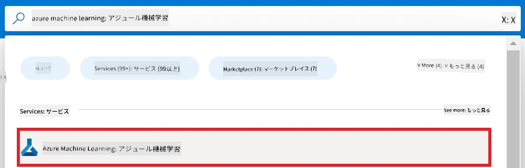

1. ナビゲーションメニューから **+ 作成** を選択します。

1. ナビゲーションメニューから **新しいワークスペース** を選択します。

    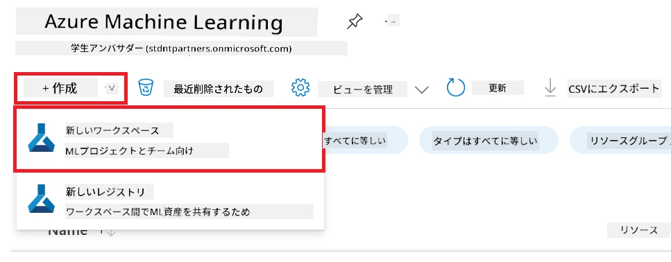

1. 以下の項目を設定します:

    - Azure の **サブスクリプション** を選択します。
    - 使用する **リソース グループ** を選択します（必要に応じて新規作成）。
    - **ワークスペース名** を入力します。ユニークな値でなければなりません。
    - 使用したい **リージョン** を選択します。
    - 使用する **ストレージアカウント** を選択します（必要に応じて新規作成）。
    - 使用する **キー コンテナー** を選択します（必要に応じて新規作成）。
    - 使用する **Application insights** を選択します（必要に応じて新規作成）。
    - 使用する **コンテナ レジストリ** を選択します（必要に応じて新規作成）。

    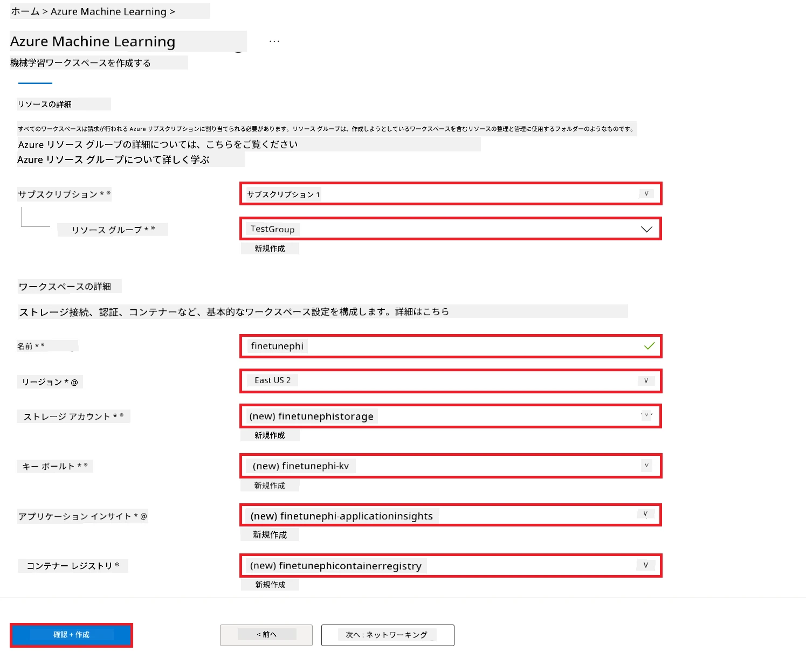

1. **確認および作成** を選択します。

1. **作成** を選択します。

### Azure サブスクリプションでの GPU クォータのリクエスト

この E2E サンプルでは、ファインチューニング用に *Standard_NC24ads_A100_v4 GPU* を使用します。これはクォータのリクエストが必要です。展開にはクォータのリクエスト不要の *Standard_E4s_v3* CPU を使います。

> [!NOTE]
>
> GPU 割り当ては Pay-As-You-Go サブスクリプション（標準サブスクリプションタイプ）のみ対象であり、ベネフィット サブスクリプションは現在サポートされていません。
>
> Visual Studio Enterprise Subscription などのベネフィット サブスクリプションを使っている方や、ファインチューニング・展開のプロセスを素早く試したい方のために、このチュートリアルでは CPU を使った最小データセットによるファインチューニングも案内しています。ただし、GPU と大きなデータセットを使った方がファインチューニング結果は大幅に良くなります。

1. [Azure ML Studio](https://ml.azure.com/home?wt.mc_id=studentamb_279723) にアクセスします。

1. *Standard NCADSA100v4 Family* クォータをリクエストするために以下を行います:

    - 左側のタブから **クォータ** を選択。
    - 使用したい **仮想マシンファミリー** を選択。例として *Standard NCADSA100v4 Family Cluster Dedicated vCPUs* を選ぶと *Standard_NC24ads_A100_v4* GPU が含まれます。
    - ナビゲーションメニューから **クォータのリクエスト** を選択。

        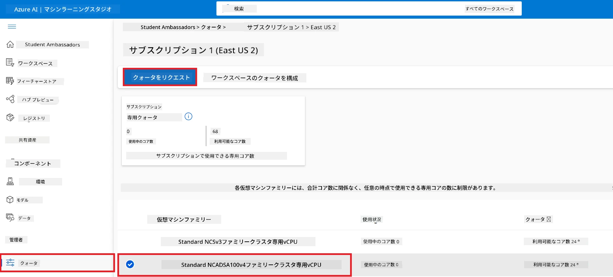

    - クォータリクエストページ内で使いたい **新しいコア数制限** を入力。例: 24。
    - クォータリクエストページ内で **送信** をクリックし GPU クォータをリクエスト。

> [!NOTE]
> 目的に応じて適切な GPU や CPU を選ぶには、[Azure の仮想マシンサイズ](https://learn.microsoft.com/azure/virtual-machines/sizes/overview?tabs=breakdownseries%2Cgeneralsizelist%2Ccomputesizelist%2Cmemorysizelist%2Cstoragesizelist%2Cgpusizelist%2Cfpgasizelist%2Chpcsizelist) のドキュメントを参照してください。

### ロールの割り当てを追加

モデルのファインチューニングと展開には、User Assigned Managed Identity (UAI) を作成し適切な権限を割り当てる必要があります。この UAI は展開時の認証に使用されます。

#### User Assigned Managed Identity (UAI) の作成

1. ポータルページ上部の **検索バー** に「managed identities」と入力し、表示されたオプションから **Managed Identities** を選択します。

    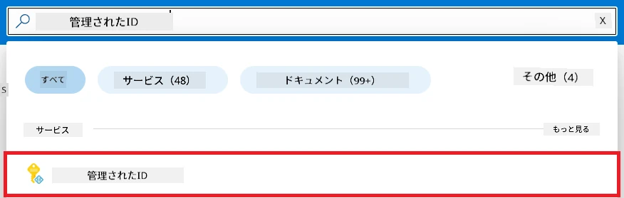

1. **+ 作成** を選択します。

    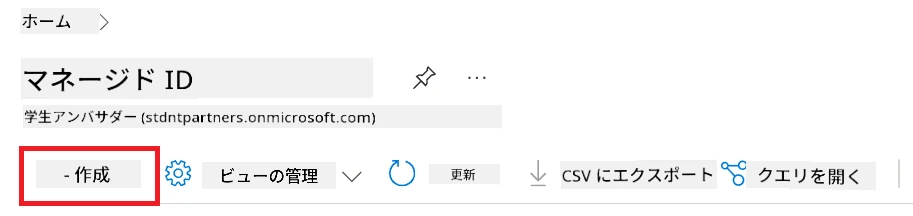

1. 以下を設定します:

    - Azure の **サブスクリプション** を選択。
    - 使用する **リソース グループ** を選択（必要に応じて新規作成）。
    - 使用したい **リージョン** を選択。
    - **名前** を入力。ユニークな値でなければなりません。

1. **確認および作成** を選択。

1. **+ 作成** を選択。

#### Managed Identity に Contributor ロールの割り当てを追加

1. 作成した Managed Identity のリソースに移動。

1. 左側のタブから **Azure ロールの割り当て** を選択。

1. ナビゲーションメニューから **+ ロールの割り当てを追加** を選択。

1. ロールの割り当て追加ページ内で以下を行います:

    - **スコープ** を **リソースグループ** に設定。
    - Azure の **サブスクリプション** を選択。
    - 使用する **リソースグループ** を選択。
    - **ロール** を **Contributor** に設定。

    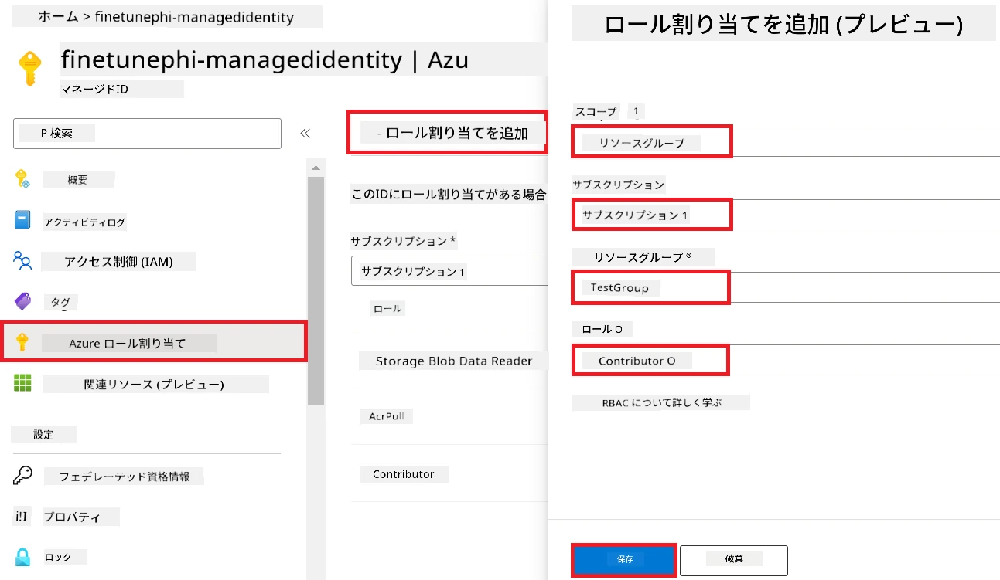

1. **保存** を選択。

#### Managed Identity に Storage Blob Data Reader ロールの割り当てを追加

1. ポータルページ上部の **検索バー** に「storage accounts」と入力し、表示されたオプションから **Storage accounts** を選択。

    

1. 作成した Azure Machine Learning ワークスペースに関連付けられたストレージ アカウントを選択。例: *finetunephistorage*。

1. ロールの割り当て追加ページへ移動するため、以下の手順を実行:

    - 作成した Azure ストレージアカウントに移動。
    - 左側のタブから **アクセス制御 (IAM)** を選択。
    - ナビゲーションメニューから **+ 追加** を選択。
    - **ロールの割り当てを追加** を選択。

    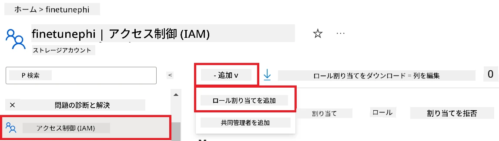

1. ロールの割り当て追加ページ内で以下の操作を行う:

    - 「Storage Blob Data Reader」と検索バーに入力し、表示された「Storage Blob Data Reader」を選択。
    - **次へ** を選択。
    - メンバーの画面で **割り当て対象** を **Managed identity** に設定。
    - **メンバーの選択** を選択。
    - Azure の **サブスクリプション** を選択。
    - 割り当てる Managed Identity を選択（例: *finetunephi-managedidentity*）。
    - **選択** をクリック。

    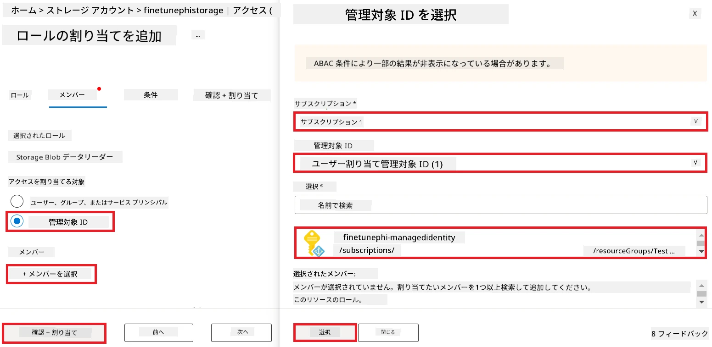

1. **確認および割り当て** を選択。

#### Managed Identity に AcrPull ロールの割り当てを追加

1. ポータルページ上部の **検索バー** に「container registries」と入力し、表示されたオプションから **Container registries** を選択。

    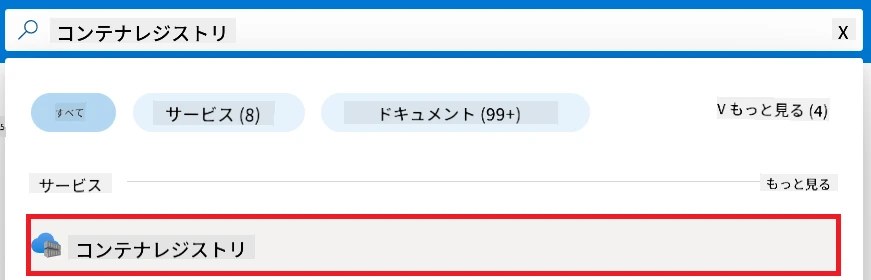

1. Azure Machine Learning ワークスペースに関連付けられたコンテナ レジストリを選択。例: *finetunephicontainerregistries*

1. ロールの割り当て追加ページへ移動するため以下を実行:

    - 左側のタブから **アクセス制御 (IAM)** を選択。
    - ナビゲーションメニューから **+ 追加** を選択。
    - **ロールの割り当てを追加** を選択。

1. ロールの割り当て追加ページ内で以下の操作を実施:

    - 「AcrPull」と検索バーに入力し、表示された「AcrPull」を選択。
    - **次へ** を選択。
    - 割り当て対象を **Managed identity** に設定。
    - **メンバーの選択** を選択。
    - Azure の **サブスクリプション** を選択。
    - 割り当てる Managed Identity を選択（例: *finetunephi-managedidentity*）。
    - **選択** をクリック。
    - **確認および割り当て** を選択。

### プロジェクトのセットアップ

ここで作業用フォルダーを作成し、Azure Cosmos DB に保存されたチャット履歴を活用しつつユーザーとやり取りするプログラムを開発するための仮想環境をセットアップします。

#### 作業用フォルダーの作成

1. ターミナルを開き、以下のコマンドを入力してデフォルトパスに *finetune-phi* フォルダーを作成します。

    ```console
    mkdir finetune-phi
    ```

1. 続けて以下のコマンドをターミナルに入力し、作成した *finetune-phi* フォルダーに移動します。

    ```console
    cd finetune-phi
    ```

#### 仮想環境の作成

1. 以下のコマンドをターミナルに入力し、*.venv* という名前の仮想環境を作成します。

    ```console
    python -m venv .venv
    ```

1. 以下のコマンドをターミナルに入力し、仮想環境をアクティブにします。

    ```console
    .venv\Scripts\activate.bat
    ```

> [!NOTE]
>
> 正常に動作すると、コマンドプロンプトの前に *(.venv)* が表示されます。

#### 必要なパッケージのインストール

1. 以下のコマンドをターミナルに入力し、必要なパッケージをインストールします。

    ```console
    pip install datasets==2.19.1
    pip install transformers==4.41.1
    pip install azure-ai-ml==1.16.0
    pip install torch==2.3.1
    pip install trl==0.9.4
    pip install promptflow==1.12.0
    ```

#### プロジェクトファイルの作成
この演習では、プロジェクトの基本的なファイルを作成します。これらのファイルには、データセットのダウンロード、Azure Machine Learning 環境のセットアップ、Phi-3 モデルのファインチューニング、およびファインチューニングされたモデルのデプロイに関するスクリプトが含まれます。また、ファインチューニング環境を設定するための *conda.yml* ファイルも作成します。

この演習で行うことは以下の通りです:

- データセットをダウンロードするための *download_dataset.py* ファイルを作成します。
- Azure Machine Learning 環境をセットアップするための *setup_ml.py* ファイルを作成します。
- *finetuning_dir* フォルダー内に *fine_tune.py* ファイルを作成し、データセットを使って Phi-3 モデルのファインチューニングを行います。
- ファインチューニング環境をセットアップするための *conda.yml* ファイルを作成します。
- ファインチューニングされたモデルをデプロイするための *deploy_model.py* ファイルを作成します。
- ファインチューニングされたモデルを統合し、Prompt flow を使ってモデルを実行するための *integrate_with_promptflow.py* ファイルを作成します。
- Prompt flow のワークフロー構造を設定するための flow.dag.yml ファイルを作成します。
- Azure の情報を入力する *config.py* ファイルを作成します。

> [!NOTE]
>
> 完成したフォルダー構成:
>
> ```text
> └── YourUserName
> .    └── finetune-phi
> .        ├── finetuning_dir
> .        │      └── fine_tune.py
> .        ├── conda.yml
> .        ├── config.py
> .        ├── deploy_model.py
> .        ├── download_dataset.py
> .        ├── flow.dag.yml
> .        ├── integrate_with_promptflow.py
> .        └── setup_ml.py
> ```

1. **Visual Studio Code** を開きます。

1. メニューバーから **ファイル** を選択します。

1. **フォルダーを開く** を選択します。

1. 作成した *finetune-phi* フォルダーを選択します。フォルダーは *C:\Users\yourUserName\finetune-phi* にあります。

    

1. Visual Studio Code の左ペインで右クリックし、**新しいファイル** を選択して *download_dataset.py* という名前の新しいファイルを作成します。

1. 左ペインで右クリックし、**新しいファイル** を選択して *setup_ml.py* という名前の新しいファイルを作成します。

1. 左ペインで右クリックし、**新しいファイル** を選択して *deploy_model.py* という名前の新しいファイルを作成します。

    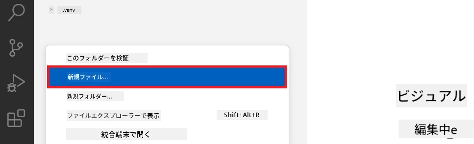

1. 左ペインで右クリックし、**新しいフォルダー** を選択して *finetuning_dir* という名前の新しいフォルダーを作成します。

1. *finetuning_dir* フォルダーに移動し、*fine_tune.py* という名前の新しいファイルを作成します。

#### *conda.yml* ファイルの作成と設定

1. Visual Studio Code の左ペインで右クリックし、**新しいファイル** を選択して *conda.yml* ファイルを作成します。

1. 以下のコードを *conda.yml* ファイルに追加し、Phi-3 モデルのファインチューニング環境をセットアップします。

    ```yml
    name: phi-3-training-env
    channels:
      - defaults
      - conda-forge
    dependencies:
      - python=3.10
      - pip
      - numpy<2.0
      - pip:
          - torch==2.4.0
          - torchvision==0.19.0
          - trl==0.8.6
          - transformers==4.41
          - datasets==2.21.0
          - azureml-core==1.57.0
          - azure-storage-blob==12.19.0
          - azure-ai-ml==1.16
          - azure-identity==1.17.1
          - accelerate==0.33.0
          - mlflow==2.15.1
          - azureml-mlflow==1.57.0
    ```

#### *config.py* ファイルの作成と設定

1. Visual Studio Code の左ペインで右クリックし、**新しいファイル** を選択して *config.py* ファイルを作成します。

1. 以下のコードを *config.py* ファイルに追加し、Azure の情報を入力します。

    ```python
    # Azureの設定
    AZURE_SUBSCRIPTION_ID = "your_subscription_id"
    AZURE_RESOURCE_GROUP_NAME = "your_resource_group_name" # "TestGroup"

    # Azure Machine Learningの設定
    AZURE_ML_WORKSPACE_NAME = "your_workspace_name" # "finetunephi-workspace"

    # AzureマネージドIDの設定
    AZURE_MANAGED_IDENTITY_CLIENT_ID = "your_azure_managed_identity_client_id"
    AZURE_MANAGED_IDENTITY_NAME = "your_azure_managed_identity_name" # "finetunephi-mangedidentity"
    AZURE_MANAGED_IDENTITY_RESOURCE_ID = f"/subscriptions/{AZURE_SUBSCRIPTION_ID}/resourceGroups/{AZURE_RESOURCE_GROUP_NAME}/providers/Microsoft.ManagedIdentity/userAssignedIdentities/{AZURE_MANAGED_IDENTITY_NAME}"

    # データセットファイルのパス
    TRAIN_DATA_PATH = "data/train_data.jsonl"
    TEST_DATA_PATH = "data/test_data.jsonl"

    # 微調整済みモデルの設定
    AZURE_MODEL_NAME = "your_fine_tuned_model_name" # "finetune-phi-model"
    AZURE_ENDPOINT_NAME = "your_fine_tuned_model_endpoint_name" # "finetune-phi-endpoint"
    AZURE_DEPLOYMENT_NAME = "your_fine_tuned_model_deployment_name" # "finetune-phi-deployment"

    AZURE_ML_API_KEY = "your_fine_tuned_model_api_key"
    AZURE_ML_ENDPOINT = "your_fine_tuned_model_endpoint_uri" # "https://{your-endpoint-name}.{your-region}.inference.ml.azure.com/score"
    ```

#### Azure 環境変数の追加

1. Azure サブスクリプション ID を追加するために以下の手順を行います:

    - ポータルページの上部にある **検索バー** に *subscriptions* と入力し、表示されるオプションから **サブスクリプション** を選択します。
    - 使用中の Azure サブスクリプションを選択します。
    - サブスクリプション ID をコピーして *config.py* ファイルに貼り付けます。

    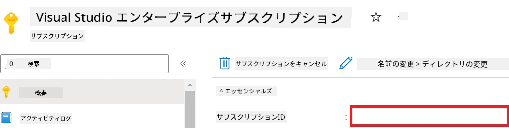

1. Azure ワークスペース名を追加するために以下の手順を行います:

    - 作成した Azure Machine Learning リソースに移動します。
    - アカウント名をコピーして *config.py* ファイルに貼り付けます。

    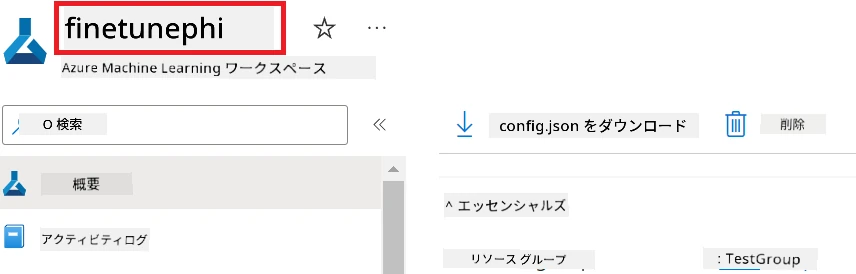

1. Azure リソースグループ名を追加するために以下の手順を行います:

    - 作成した Azure Machine Learning リソースに移動します。
    - Azure リソースグループ名をコピーして *config.py* ファイルに貼り付けます。

    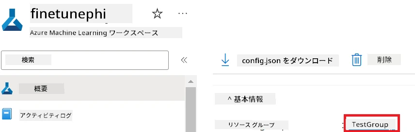

2. Azure マネージド アイデンティティ名を追加するために以下の手順を行います:

    - 作成した Managed Identities リソースに移動します。
    - Azure マネージド アイデンティティ名をコピーして *config.py* ファイルに貼り付けます。

    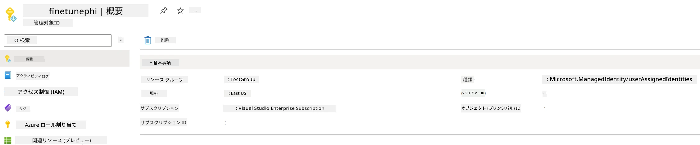

### ファインチューニング用データセットの準備

この演習では、*download_dataset.py* ファイルを実行して *ULTRACHAT_200k* データセットをローカル環境にダウンロードします。次に、このデータセットを使って Azure Machine Learning で Phi-3 モデルのファインチューニングを行います。

#### *download_dataset.py*を使ってデータセットをダウンロードする

1. Visual Studio Code で *download_dataset.py* ファイルを開きます。

1. 以下のコードを *download_dataset.py* に追加します。

    ```python
    import json
    import os
    from datasets import load_dataset
    from config import (
        TRAIN_DATA_PATH,
        TEST_DATA_PATH)

    def load_and_split_dataset(dataset_name, config_name, split_ratio):
        """
        Load and split a dataset.
        """
        # 指定された名前、設定、および分割比率でデータセットをロードする
        dataset = load_dataset(dataset_name, config_name, split=split_ratio)
        print(f"Original dataset size: {len(dataset)}")
        
        # データセットを訓練セットとテストセットに分割する（訓練80%、テスト20%）
        split_dataset = dataset.train_test_split(test_size=0.2)
        print(f"Train dataset size: {len(split_dataset['train'])}")
        print(f"Test dataset size: {len(split_dataset['test'])}")
        
        return split_dataset

    def save_dataset_to_jsonl(dataset, filepath):
        """
        Save a dataset to a JSONL file.
        """
        # ディレクトリが存在しない場合は作成する
        os.makedirs(os.path.dirname(filepath), exist_ok=True)
        
        # ファイルを上書きモードで開く
        with open(filepath, 'w', encoding='utf-8') as f:
            # データセットの各レコードを繰り返し処理する
            for record in dataset:
                # レコードをJSONオブジェクトとしてダンプし、ファイルに書き込む
                json.dump(record, f)
                # レコードを区切るために改行文字を書く
                f.write('\n')
        
        print(f"Dataset saved to {filepath}")

    def main():
        """
        Main function to load, split, and save the dataset.
        """
        # 特定の設定と分割比率でULTRACHAT_200kデータセットをロードして分割する
        dataset = load_and_split_dataset("HuggingFaceH4/ultrachat_200k", 'default', 'train_sft[:1%]')
        
        # 分割から訓練データセットとテストデータセットを抽出する
        train_dataset = dataset['train']
        test_dataset = dataset['test']

        # 訓練データセットをJSONLファイルに保存する
        save_dataset_to_jsonl(train_dataset, TRAIN_DATA_PATH)
        
        # テストデータセットを別のJSONLファイルに保存する
        save_dataset_to_jsonl(test_dataset, TEST_DATA_PATH)

    if __name__ == "__main__":
        main()

    ```

> [!TIP]
>
> **最小限のデータセットで CPU を使ってファインチューニングするためのガイダンス**
>
> CPU を使ってファインチューニングする場合、この方法は特典サブスクリプション（例: Visual Studio Enterprise Subscription）を持つ方や、ファインチューニングとデプロイのプロセスを素早くテストしたい方に適しています。
>
> `dataset = load_and_split_dataset("HuggingFaceH4/ultrachat_200k", 'default', 'train_sft[:1%]')` を `dataset = load_and_split_dataset("HuggingFaceH4/ultrachat_200k", 'default', 'train_sft[:10]')` に置き換えてください。
>

1. ターミナル内で以下のコマンドを入力し、スクリプトを実行してデータセットをローカル環境にダウンロードします。

    ```console
    python download_data.py
    ```

1. データセットがローカルの *finetune-phi/data* ディレクトリに正常に保存されたことを確認します。

> [!NOTE]
>
> **データセットのサイズとファインチューニングの時間**
>
> このエンドツーエンド（E2E）サンプルでは、データセットのうち1%（`train_sft[:1%]`）のみを使用しています。これによりデータ量が大幅に減り、アップロードとファインチューニングのプロセスが高速になります。トレーニング時間とモデル性能のバランスを調整するためにパーセンテージを変更できます。より小さいサブセットを使用することで、ファインチューニングに要する時間を短縮し、E2E サンプルのプロセスがより扱いやすくなります。

## シナリオ 2: Phi-3 モデルのファインチューニングと Azure Machine Learning Studio でのデプロイ

### Azure CLI のセットアップ

環境を認証するために Azure CLI をセットアップする必要があります。Azure CLI を使うと、コマンドラインから直接 Azure リソースを管理でき、Azure Machine Learning がこれらのリソースにアクセスするために必要な資格情報を提供します。まずは [Azure CLI](https://learn.microsoft.com/cli/azure/install-azure-cli) をインストールしてください。

1. ターミナルウィンドウを開き、以下のコマンドを入力して Azure アカウントにログインします。

    ```console
    az login
    ```

1. 使用する Azure アカウントを選択します。

1. 使用する Azure サブスクリプションを選択します。

    

> [!TIP]
>
> Azure へのサインインに問題がある場合は、デバイスコードを使用してみてください。ターミナルウィンドウを開き、以下のコマンドを入力して Azure アカウントにサインインします:
>
> ```console
> az login --use-device-code
> ```
>

### Phi-3 モデルのファインチューニング

この演習では、提供されたデータセットを使用して Phi-3 モデルをファインチューニングします。まず、*fine_tune.py* ファイルにファインチューニングの処理を定義します。次に、Azure Machine Learning 環境を設定し、*setup_ml.py* ファイルを実行してファインチューニングプロセスを開始します。このスクリプトはファインチューニングが Azure Machine Learning 環境内で行われるようにします。

*setup_ml.py* を実行すると、Azure Machine Learning 環境内でファインチューニングプロセスが実行されます。

#### *fine_tune.py* ファイルにコードを追加する

1. *finetuning_dir* フォルダーに移動し、Visual Studio Code で *fine_tune.py* ファイルを開きます。

1. 以下のコードを *fine_tune.py* に追加します。

    ```python
    import argparse
    import sys
    import logging
    import os
    from datasets import load_dataset
    import torch
    import mlflow
    from transformers import AutoModelForCausalLM, AutoTokenizer, TrainingArguments
    from trl import SFTTrainer

    # MLflowのINVALID_PARAMETER_VALUEエラーを回避するために、MLflow統合を無効にします
    os.environ["DISABLE_MLFLOW_INTEGRATION"] = "True"

    # ロギングの設定
    logging.basicConfig(
        format="%(asctime)s - %(levelname)s - %(name)s - %(message)s",
        datefmt="%Y-%m-%d %H:%M:%S",
        handlers=[logging.StreamHandler(sys.stdout)],
        level=logging.WARNING
    )
    logger = logging.getLogger(__name__)

    def initialize_model_and_tokenizer(model_name, model_kwargs):
        """
        Initialize the model and tokenizer with the given pretrained model name and arguments.
        """
        model = AutoModelForCausalLM.from_pretrained(model_name, **model_kwargs)
        tokenizer = AutoTokenizer.from_pretrained(model_name)
        tokenizer.model_max_length = 2048
        tokenizer.pad_token = tokenizer.unk_token
        tokenizer.pad_token_id = tokenizer.convert_tokens_to_ids(tokenizer.pad_token)
        tokenizer.padding_side = 'right'
        return model, tokenizer

    def apply_chat_template(example, tokenizer):
        """
        Apply a chat template to tokenize messages in the example.
        """
        messages = example["messages"]
        if messages[0]["role"] != "system":
            messages.insert(0, {"role": "system", "content": ""})
        example["text"] = tokenizer.apply_chat_template(
            messages, tokenize=False, add_generation_prompt=False
        )
        return example

    def load_and_preprocess_data(train_filepath, test_filepath, tokenizer):
        """
        Load and preprocess the dataset.
        """
        train_dataset = load_dataset('json', data_files=train_filepath, split='train')
        test_dataset = load_dataset('json', data_files=test_filepath, split='train')
        column_names = list(train_dataset.features)

        train_dataset = train_dataset.map(
            apply_chat_template,
            fn_kwargs={"tokenizer": tokenizer},
            num_proc=10,
            remove_columns=column_names,
            desc="Applying chat template to train dataset",
        )

        test_dataset = test_dataset.map(
            apply_chat_template,
            fn_kwargs={"tokenizer": tokenizer},
            num_proc=10,
            remove_columns=column_names,
            desc="Applying chat template to test dataset",
        )

        return train_dataset, test_dataset

    def train_and_evaluate_model(train_dataset, test_dataset, model, tokenizer, output_dir):
        """
        Train and evaluate the model.
        """
        training_args = TrainingArguments(
            bf16=True,
            do_eval=True,
            output_dir=output_dir,
            eval_strategy="epoch",
            learning_rate=5.0e-06,
            logging_steps=20,
            lr_scheduler_type="cosine",
            num_train_epochs=3,
            overwrite_output_dir=True,
            per_device_eval_batch_size=4,
            per_device_train_batch_size=4,
            remove_unused_columns=True,
            save_steps=500,
            seed=0,
            gradient_checkpointing=True,
            gradient_accumulation_steps=1,
            warmup_ratio=0.2,
        )

        trainer = SFTTrainer(
            model=model,
            args=training_args,
            train_dataset=train_dataset,
            eval_dataset=test_dataset,
            max_seq_length=2048,
            dataset_text_field="text",
            tokenizer=tokenizer,
            packing=True
        )

        train_result = trainer.train()
        trainer.log_metrics("train", train_result.metrics)

        mlflow.transformers.log_model(
            transformers_model={"model": trainer.model, "tokenizer": tokenizer},
            artifact_path=output_dir,
        )

        tokenizer.padding_side = 'left'
        eval_metrics = trainer.evaluate()
        eval_metrics["eval_samples"] = len(test_dataset)
        trainer.log_metrics("eval", eval_metrics)

    def main(train_file, eval_file, model_output_dir):
        """
        Main function to fine-tune the model.
        """
        model_kwargs = {
            "use_cache": False,
            "trust_remote_code": True,
            "torch_dtype": torch.bfloat16,
            "device_map": None,
            "attn_implementation": "eager"
        }

        # pretrained_model_name = "microsoft/Phi-3-mini-4k-instruct"
        pretrained_model_name = "microsoft/Phi-3.5-mini-instruct"

        with mlflow.start_run():
            model, tokenizer = initialize_model_and_tokenizer(pretrained_model_name, model_kwargs)
            train_dataset, test_dataset = load_and_preprocess_data(train_file, eval_file, tokenizer)
            train_and_evaluate_model(train_dataset, test_dataset, model, tokenizer, model_output_dir)

    if __name__ == "__main__":
        parser = argparse.ArgumentParser()
        parser.add_argument("--train-file", type=str, required=True, help="Path to the training data")
        parser.add_argument("--eval-file", type=str, required=True, help="Path to the evaluation data")
        parser.add_argument("--model_output_dir", type=str, required=True, help="Directory to save the fine-tuned model")
        args = parser.parse_args()
        main(args.train_file, args.eval_file, args.model_output_dir)

    ```

1. *fine_tune.py* ファイルを保存して閉じます。

> [!TIP]
> **Phi-3.5 モデルもファインチューニング可能です**
>
> *fine_tune.py* ファイル内の `pretrained_model_name` を `"microsoft/Phi-3-mini-4k-instruct"` から任意のファインチューニングしたいモデル名に変更できます。例えば、`"microsoft/Phi-3.5-mini-instruct"` に変更すると Phi-3.5-mini-instruct モデルでファインチューニングします。希望するモデル名を見つけるには [Hugging Face](https://huggingface.co/) にアクセスし、興味のあるモデルを検索してその名前をスクリプト内の `pretrained_model_name` フィールドにコピー＆ペーストしてください。
>
> <image type="content" src="../../../../../../translated_images/ja/finetunephi3.5.a55fc02962430af5.webp" alt-text="Phi-3.5 をファインチューニング。">
>

#### *setup_ml.py* ファイルにコードを追加する

1. Visual Studio Code で *setup_ml.py* ファイルを開きます。

1. 以下のコードを *setup_ml.py* に追加します。

    ```python
    import logging
    from azure.ai.ml import MLClient, command, Input
    from azure.ai.ml.entities import Environment, AmlCompute
    from azure.identity import AzureCliCredential
    from config import (
        AZURE_SUBSCRIPTION_ID,
        AZURE_RESOURCE_GROUP_NAME,
        AZURE_ML_WORKSPACE_NAME,
        TRAIN_DATA_PATH,
        TEST_DATA_PATH
    )

    # 定数

    # 学習にCPUインスタンスを使用する場合は、以下の行のコメントを解除してください
    # COMPUTE_INSTANCE_TYPE = "Standard_E16s_v3" # cpu
    # COMPUTE_NAME = "cpu-e16s-v3"
    # DOCKER_IMAGE_NAME = "mcr.microsoft.com/azureml/openmpi4.1.0-ubuntu20.04:latest"

    # 学習にGPUインスタンスを使用する場合は、以下の行のコメントを解除してください
    COMPUTE_INSTANCE_TYPE = "Standard_NC24ads_A100_v4"
    COMPUTE_NAME = "gpu-nc24s-a100-v4"
    DOCKER_IMAGE_NAME = "mcr.microsoft.com/azureml/curated/acft-hf-nlp-gpu:59"

    CONDA_FILE = "conda.yml"
    LOCATION = "eastus2" # コンピュートクラスターの場所に置き換えてください
    FINETUNING_DIR = "./finetuning_dir" # ファインチューニングスクリプトへのパス
    TRAINING_ENV_NAME = "phi-3-training-environment" # 学習環境の名前
    MODEL_OUTPUT_DIR = "./model_output" # Azure ML内のモデル出力ディレクトリへのパス

    # プロセスを追跡するためのロギング設定
    logger = logging.getLogger(__name__)
    logging.basicConfig(
        format="%(asctime)s - %(levelname)s - %(name)s - %(message)s",
        datefmt="%Y-%m-%d %H:%M:%S",
        level=logging.WARNING
    )

    def get_ml_client():
        """
        Initialize the ML Client using Azure CLI credentials.
        """
        credential = AzureCliCredential()
        return MLClient(credential, AZURE_SUBSCRIPTION_ID, AZURE_RESOURCE_GROUP_NAME, AZURE_ML_WORKSPACE_NAME)

    def create_or_get_environment(ml_client):
        """
        Create or update the training environment in Azure ML.
        """
        env = Environment(
            image=DOCKER_IMAGE_NAME,  # 環境用のDockerイメージ
            conda_file=CONDA_FILE,  # Conda環境ファイル
            name=TRAINING_ENV_NAME,  # 環境の名前
        )
        return ml_client.environments.create_or_update(env)

    def create_or_get_compute_cluster(ml_client, compute_name, COMPUTE_INSTANCE_TYPE, location):
        """
        Create or update the compute cluster in Azure ML.
        """
        try:
            compute_cluster = ml_client.compute.get(compute_name)
            logger.info(f"Compute cluster '{compute_name}' already exists. Reusing it for the current run.")
        except Exception:
            logger.info(f"Compute cluster '{compute_name}' does not exist. Creating a new one with size {COMPUTE_INSTANCE_TYPE}.")
            compute_cluster = AmlCompute(
                name=compute_name,
                size=COMPUTE_INSTANCE_TYPE,
                location=location,
                tier="Dedicated",  # コンピュートクラスターの階層
                min_instances=0,  # 最小インスタンス数
                max_instances=1  # 最大インスタンス数
            )
            ml_client.compute.begin_create_or_update(compute_cluster).wait()  # クラスターが作成されるのを待つ
        return compute_cluster

    def create_fine_tuning_job(env, compute_name):
        """
        Set up the fine-tuning job in Azure ML.
        """
        return command(
            code=FINETUNING_DIR,  # fine_tune.pyへのパス
            command=(
                "python fine_tune.py "
                "--train-file ${{inputs.train_file}} "
                "--eval-file ${{inputs.eval_file}} "
                "--model_output_dir ${{inputs.model_output}}"
            ),
            environment=env,  # 学習環境
            compute=compute_name,  # 使用するコンピュートクラスター
            inputs={
                "train_file": Input(type="uri_file", path=TRAIN_DATA_PATH),  # 学習データファイルへのパス
                "eval_file": Input(type="uri_file", path=TEST_DATA_PATH),  # 評価データファイルへのパス
                "model_output": MODEL_OUTPUT_DIR
            }
        )

    def main():
        """
        Main function to set up and run the fine-tuning job in Azure ML.
        """
        # MLクライアントの初期化
        ml_client = get_ml_client()

        # 環境の作成
        env = create_or_get_environment(ml_client)
        
        # 既存のコンピュートクラスターの作成または取得
        create_or_get_compute_cluster(ml_client, COMPUTE_NAME, COMPUTE_INSTANCE_TYPE, LOCATION)

        # ファインチューニングジョブの作成と送信
        job = create_fine_tuning_job(env, COMPUTE_NAME)
        returned_job = ml_client.jobs.create_or_update(job)  # ジョブの送信
        ml_client.jobs.stream(returned_job.name)  # ジョブログのストリーミング
        
        # ジョブ名の取得
        job_name = returned_job.name
        print(f"Job name: {job_name}")

    if __name__ == "__main__":
        main()

    ```

1. `COMPUTE_INSTANCE_TYPE`、`COMPUTE_NAME`、および `LOCATION` をご自身の環境に合わせて置き換えてください。

    ```python
   # トレーニングにGPUインスタンスを使用するには、以下の行のコメントを解除してください
    COMPUTE_INSTANCE_TYPE = "Standard_NC24ads_A100_v4"
    COMPUTE_NAME = "gpu-nc24s-a100-v4"
    ...
    LOCATION = "eastus2" # コンピュートクラスタの場所に置き換えてください
    ```

> [!TIP]
>
> **最小限のデータセットで CPU を使ってファインチューニングするためのガイダンス**
>
> CPU でファインチューニングを行う場合、この方法は特典サブスクリプション（例: Visual Studio Enterprise Subscription）を持つ方やファインチューニングおよびデプロイプロセスを素早くテストしたい方向けに理想的です。
>
> 1. *setup_ml* ファイルを開きます。
> 1. `COMPUTE_INSTANCE_TYPE`、`COMPUTE_NAME`、および `DOCKER_IMAGE_NAME` を次のものに置き換えます。*Standard_E16s_v3* にアクセスできない場合は、同等の CPU インスタンスを使用するか、新しい割当量をリクエストしてください。
> 1. `LOCATION` をご自身の環境に合わせて置き換えます。
>
>    ```python
>    # Uncomment the following lines to use a CPU instance for training
>    COMPUTE_INSTANCE_TYPE = "Standard_E16s_v3" # cpu
>    COMPUTE_NAME = "cpu-e16s-v3"
>    DOCKER_IMAGE_NAME = "mcr.microsoft.com/azureml/openmpi4.1.0-ubuntu20.04:latest"
>    LOCATION = "eastus2" # Replace with the location of your compute cluster
>    ```
>

1. 以下のコマンドを入力し、*setup_ml.py* スクリプトを実行して Azure Machine Learning でファインチューニングプロセスを開始します。

    ```python
    python setup_ml.py
    ```

1. この演習では、Azure Machine Learning を使用して Phi-3 モデルのファインチューニングに成功しました。*setup_ml.py* スクリプトを実行することで、Azure Machine Learning 環境がセットアップされ、*fine_tune.py* ファイルで定義したファインチューニングプロセスが開始されました。ファインチューニングにはかなりの時間がかかる場合があるため、`python setup_ml.py` コマンドを実行した後は処理が完了するまで待つ必要があります。ファインチューニングジョブの状態は、ターミナルに表示されるリンクから Azure Machine Learning ポータルで確認できます。

    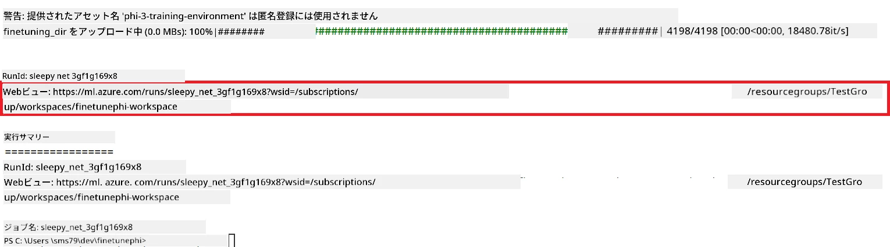

### ファインチューニング済みモデルのデプロイ

ファインチューニングした Phi-3 モデルを Prompt Flow と統合するために、リアルタイム推論で利用可能にするためにモデルをデプロイする必要があります。このプロセスでは、モデルの登録、オンラインエンドポイントの作成、およびモデルのデプロイを行います。

#### デプロイのためのモデル名、エンドポイント名、およびデプロイ名の設定

1. *config.py* ファイルを開きます。

1. `AZURE_MODEL_NAME = "your_fine_tuned_model_name"` をご希望のモデル名に置き換えます。

1. `AZURE_ENDPOINT_NAME = "your_fine_tuned_model_endpoint_name"` をご希望のエンドポイント名に置き換えます。

1. `AZURE_DEPLOYMENT_NAME = "your_fine_tuned_model_deployment_name"` をご希望のデプロイ名に置き換えます。

#### *deploy_model.py* ファイルにコードを追加する

*deploy_model.py* ファイルを実行すると、デプロイプロセス全体が自動化されます。モデルの登録、エンドポイントの作成、デプロイ処理はすべて *config.py* に記載された設定（モデル名、エンドポイント名、デプロイ名）に基づいて行われます。

1. Visual Studio Code で *deploy_model.py* ファイルを開きます。

1. 以下のコードを *deploy_model.py* に追加します。

    ```python
    import logging
    from azure.identity import AzureCliCredential
    from azure.ai.ml import MLClient
    from azure.ai.ml.entities import Model, ProbeSettings, ManagedOnlineEndpoint, ManagedOnlineDeployment, IdentityConfiguration, ManagedIdentityConfiguration, OnlineRequestSettings
    from azure.ai.ml.constants import AssetTypes

    # 設定のインポート
    from config import (
        AZURE_SUBSCRIPTION_ID,
        AZURE_RESOURCE_GROUP_NAME,
        AZURE_ML_WORKSPACE_NAME,
        AZURE_MANAGED_IDENTITY_RESOURCE_ID,
        AZURE_MANAGED_IDENTITY_CLIENT_ID,
        AZURE_MODEL_NAME,
        AZURE_ENDPOINT_NAME,
        AZURE_DEPLOYMENT_NAME
    )

    # 定数
    JOB_NAME = "your-job-name"
    COMPUTE_INSTANCE_TYPE = "Standard_E4s_v3"

    deployment_env_vars = {
        "SUBSCRIPTION_ID": AZURE_SUBSCRIPTION_ID,
        "RESOURCE_GROUP_NAME": AZURE_RESOURCE_GROUP_NAME,
        "UAI_CLIENT_ID": AZURE_MANAGED_IDENTITY_CLIENT_ID,
    }

    # ロギングの設定
    logging.basicConfig(
        format="%(asctime)s - %(levelname)s - %(name)s - %(message)s",
        datefmt="%Y-%m-%d %H:%M:%S",
        level=logging.DEBUG
    )
    logger = logging.getLogger(__name__)

    def get_ml_client():
        """Initialize and return the ML Client."""
        credential = AzureCliCredential()
        return MLClient(credential, AZURE_SUBSCRIPTION_ID, AZURE_RESOURCE_GROUP_NAME, AZURE_ML_WORKSPACE_NAME)

    def register_model(ml_client, model_name, job_name):
        """Register a new model."""
        model_path = f"azureml://jobs/{job_name}/outputs/artifacts/paths/model_output"
        logger.info(f"Registering model {model_name} from job {job_name} at path {model_path}.")
        run_model = Model(
            path=model_path,
            name=model_name,
            description="Model created from run.",
            type=AssetTypes.MLFLOW_MODEL,
        )
        model = ml_client.models.create_or_update(run_model)
        logger.info(f"Registered model ID: {model.id}")
        return model

    def delete_existing_endpoint(ml_client, endpoint_name):
        """Delete existing endpoint if it exists."""
        try:
            endpoint_result = ml_client.online_endpoints.get(name=endpoint_name)
            logger.info(f"Deleting existing endpoint {endpoint_name}.")
            ml_client.online_endpoints.begin_delete(name=endpoint_name).result()
            logger.info(f"Deleted existing endpoint {endpoint_name}.")
        except Exception as e:
            logger.info(f"No existing endpoint {endpoint_name} found to delete: {e}")

    def create_or_update_endpoint(ml_client, endpoint_name, description=""):
        """Create or update an endpoint."""
        delete_existing_endpoint(ml_client, endpoint_name)
        logger.info(f"Creating new endpoint {endpoint_name}.")
        endpoint = ManagedOnlineEndpoint(
            name=endpoint_name,
            description=description,
            identity=IdentityConfiguration(
                type="user_assigned",
                user_assigned_identities=[ManagedIdentityConfiguration(resource_id=AZURE_MANAGED_IDENTITY_RESOURCE_ID)]
            )
        )
        endpoint_result = ml_client.online_endpoints.begin_create_or_update(endpoint).result()
        logger.info(f"Created new endpoint {endpoint_name}.")
        return endpoint_result

    def create_or_update_deployment(ml_client, endpoint_name, deployment_name, model):
        """Create or update a deployment."""

        logger.info(f"Creating deployment {deployment_name} for endpoint {endpoint_name}.")
        deployment = ManagedOnlineDeployment(
            name=deployment_name,
            endpoint_name=endpoint_name,
            model=model.id,
            instance_type=COMPUTE_INSTANCE_TYPE,
            instance_count=1,
            environment_variables=deployment_env_vars,
            request_settings=OnlineRequestSettings(
                max_concurrent_requests_per_instance=3,
                request_timeout_ms=180000,
                max_queue_wait_ms=120000
            ),
            liveness_probe=ProbeSettings(
                failure_threshold=30,
                success_threshold=1,
                period=100,
                initial_delay=500,
            ),
            readiness_probe=ProbeSettings(
                failure_threshold=30,
                success_threshold=1,
                period=100,
                initial_delay=500,
            ),
        )
        deployment_result = ml_client.online_deployments.begin_create_or_update(deployment).result()
        logger.info(f"Created deployment {deployment.name} for endpoint {endpoint_name}.")
        return deployment_result

    def set_traffic_to_deployment(ml_client, endpoint_name, deployment_name):
        """Set traffic to the specified deployment."""
        try:
            # 現在のエンドポイントの詳細を取得
            endpoint = ml_client.online_endpoints.get(name=endpoint_name)
            
            # デバッグのために現在のトラフィック配分をログに記録
            logger.info(f"Current traffic allocation: {endpoint.traffic}")
            
            # デプロイメントのトラフィック配分を設定
            endpoint.traffic = {deployment_name: 100}
            
            # 新しいトラフィック配分でエンドポイントを更新
            endpoint_poller = ml_client.online_endpoints.begin_create_or_update(endpoint)
            updated_endpoint = endpoint_poller.result()
            
            # デバッグのために更新後のトラフィック配分をログに記録
            logger.info(f"Updated traffic allocation: {updated_endpoint.traffic}")
            logger.info(f"Set traffic to deployment {deployment_name} at endpoint {endpoint_name}.")
            return updated_endpoint
        except Exception as e:
            # 処理中に発生したエラーをログに記録
            logger.error(f"Failed to set traffic to deployment: {e}")
            raise


    def main():
        ml_client = get_ml_client()

        registered_model = register_model(ml_client, AZURE_MODEL_NAME, JOB_NAME)
        logger.info(f"Registered model ID: {registered_model.id}")

        endpoint = create_or_update_endpoint(ml_client, AZURE_ENDPOINT_NAME, "Endpoint for finetuned Phi-3 model")
        logger.info(f"Endpoint {AZURE_ENDPOINT_NAME} is ready.")

        try:
            deployment = create_or_update_deployment(ml_client, AZURE_ENDPOINT_NAME, AZURE_DEPLOYMENT_NAME, registered_model)
            logger.info(f"Deployment {AZURE_DEPLOYMENT_NAME} is created for endpoint {AZURE_ENDPOINT_NAME}.")

            set_traffic_to_deployment(ml_client, AZURE_ENDPOINT_NAME, AZURE_DEPLOYMENT_NAME)
            logger.info(f"Traffic is set to deployment {AZURE_DEPLOYMENT_NAME} at endpoint {AZURE_ENDPOINT_NAME}.")
        except Exception as e:
            logger.error(f"Failed to create or update deployment: {e}")

    if __name__ == "__main__":
        main()

    ```

1. `JOB_NAME` を取得するために以下の手順を行います:

    - 作成した Azure Machine Learning リソースに移動します。
    - **Studio web URL** を選択して Azure Machine Learning ワークスペースを開きます。
    - 左側のタブから **Jobs** を選択します。
    - ファインチューニングの実験を選択します。例: *finetunephi*。
    - 作成したジョブを選択します。
- *deploy_model.py* ファイルの `JOB_NAME = "your-job-name"` にジョブ名をコピーして貼り付けます。

1. `COMPUTE_INSTANCE_TYPE` をあなたの具体的な詳細に置き換えます。

1. 次のコマンドを入力して *deploy_model.py* スクリプトを実行し、Azure Machine Learning でのデプロイメントプロセスを開始します。

    ```python
    python deploy_model.py
    ```

> [!WARNING]
> アカウントへの追加料金を避けるために、Azure Machine Learning ワークスペースで作成したエンドポイントを削除してください。
>

#### Azure Machine Learning ワークスペースでデプロイ状態を確認する

1. [Azure ML Studio](https://ml.azure.com/home?wt.mc_id=studentamb_279723) にアクセスします。

1. 作成した Azure Machine Learning ワークスペースに移動します。

1. **Studio web URL** を選択して Azure Machine Learning ワークスペースを開きます。

1. 左側のタブから **Endpoints** を選択します。

    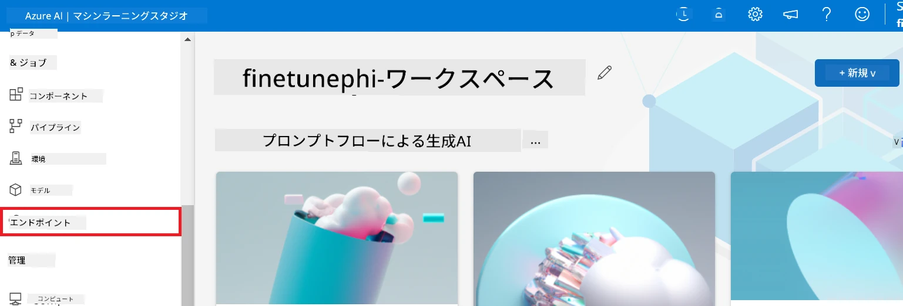

2. 作成したエンドポイントを選択します。

    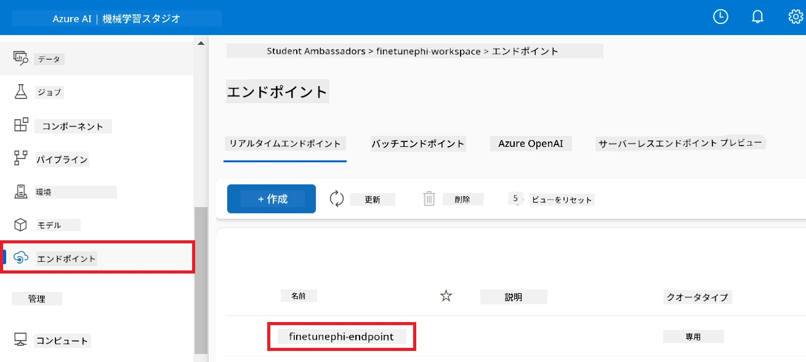

3. このページで、デプロイメントプロセス中に作成されたエンドポイントを管理できます。

## シナリオ 3: Prompt flow と連携し、カスタムモデルとチャットする

### カスタム Phi-3 モデルを Prompt flow と統合する

ファインチューニングしたモデルのデプロイに成功したら、Prompt flow と統合してリアルタイムアプリケーションでモデルを使用できるようにし、カスタム Phi-3 モデルとの対話型タスクを多様に実行可能にします。

#### ファインチューニング済み Phi-3 モデルの api キーとエンドポイント URI を設定する

1. 作成した Azure Machine Learning ワークスペースに移動します。
1. 左側のタブから **Endpoints** を選択します。
1. 作成したエンドポイントを選択します。
1. ナビゲーションメニューから **Consume** を選びます。
1. **REST endpoint** をコピーして *config.py* ファイルの `AZURE_ML_ENDPOINT = "your_fine_tuned_model_endpoint_uri"` をあなたの **REST endpoint** に置き換えます。
1. **Primary key** をコピーして *config.py* ファイルの `AZURE_ML_API_KEY = "your_fine_tuned_model_api_key"` をあなたの **Primary key** に置き換えます。

    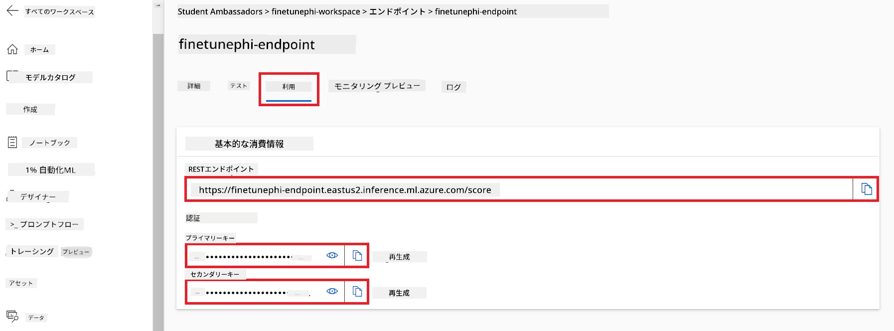

#### *flow.dag.yml* ファイルにコードを追加する

1. Visual Studio Code で *flow.dag.yml* ファイルを開きます。

1. 以下のコードを *flow.dag.yml* に追加します。

    ```yml
    inputs:
      input_data:
        type: string
        default: "Who founded Microsoft?"

    outputs:
      answer:
        type: string
        reference: ${integrate_with_promptflow.output}

    nodes:
    - name: integrate_with_promptflow
      type: python
      source:
        type: code
        path: integrate_with_promptflow.py
      inputs:
        input_data: ${inputs.input_data}
    ```

#### *integrate_with_promptflow.py* ファイルにコードを追加する

1. Visual Studio Code で *integrate_with_promptflow.py* ファイルを開きます。

1. 以下のコードを *integrate_with_promptflow.py* に追加します。

    ```python
    import logging
    import requests
    from promptflow.core import tool
    import asyncio
    import platform
    from config import (
        AZURE_ML_ENDPOINT,
        AZURE_ML_API_KEY
    )

    # ロギングのセットアップ
    logging.basicConfig(
        format="%(asctime)s - %(levelname)s - %(name)s - %(message)s",
        datefmt="%Y-%m-%d %H:%M:%S",
        level=logging.DEBUG
    )
    logger = logging.getLogger(__name__)

    def query_azml_endpoint(input_data: list, endpoint_url: str, api_key: str) -> str:
        """
        Send a request to the Azure ML endpoint with the given input data.
        """
        headers = {
            "Content-Type": "application/json",
            "Authorization": f"Bearer {api_key}"
        }
        data = {
            "input_data": [input_data],
            "params": {
                "temperature": 0.7,
                "max_new_tokens": 128,
                "do_sample": True,
                "return_full_text": True
            }
        }
        try:
            response = requests.post(endpoint_url, json=data, headers=headers)
            response.raise_for_status()
            result = response.json()[0]
            logger.info("Successfully received response from Azure ML Endpoint.")
            return result
        except requests.exceptions.RequestException as e:
            logger.error(f"Error querying Azure ML Endpoint: {e}")
            raise

    def setup_asyncio_policy():
        """
        Setup asyncio event loop policy for Windows.
        """
        if platform.system() == 'Windows':
            asyncio.set_event_loop_policy(asyncio.WindowsSelectorEventLoopPolicy())
            logger.info("Set Windows asyncio event loop policy.")

    @tool
    def my_python_tool(input_data: str) -> str:
        """
        Tool function to process input data and query the Azure ML endpoint.
        """
        setup_asyncio_policy()
        return query_azml_endpoint(input_data, AZURE_ML_ENDPOINT, AZURE_ML_API_KEY)

    ```

### カスタムモデルとチャットする

1. 次のコマンドを入力して *deploy_model.py* スクリプトを実行し、Azure Machine Learning でのデプロイメントプロセスを開始します。

    ```python
    pf flow serve --source ./ --port 8080 --host localhost
    ```

1. 以下は結果の例です：これでカスタム Phi-3 モデルとチャットできます。ファインチューニングに使用したデータに基づく質問をすることを推奨します。

    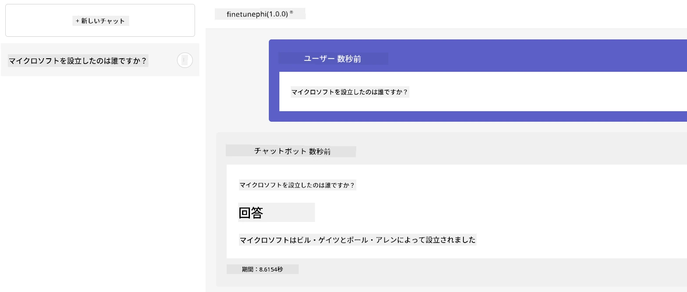

---

<!-- CO-OP TRANSLATOR DISCLAIMER START -->
**免責事項**：  
本書類はAI翻訳サービス「[Co-op Translator](https://github.com/Azure/co-op-translator)」を使用して翻訳されました。正確性を期しておりますが、自動翻訳には誤りや不正確な部分が含まれる可能性があります。原文の言語によるオリジナル文書が正式な情報源とみなされるべきです。重要な情報については、専門の人間による翻訳を推奨します。本翻訳の利用により生じた誤解や誤訳について、当方は一切の責任を負いかねます。
<!-- CO-OP TRANSLATOR DISCLAIMER END -->
