<!--
CO_OP_TRANSLATOR_METADATA:
{
  "original_hash": "0df910a227098303cc392b6ad204c271",
  "translation_date": "2026-01-06T04:21:04+00:00",
  "source_file": "md/02.Application/01.TextAndChat/Phi3/E2E_Phi-3-FineTuning_PromptFlow_Integration_AIFoundry.md",
  "language_code": "ja"
}
-->
# Azure AI Foundry での Prompt flow を使用したカスタム Phi-3 モデルのファインチューニングと統合

このエンドツーエンド（E2E）サンプルは、Microsoft Tech Community のガイド「[Azure AI Foundry での Prompt flow を使用したカスタム Phi-3 モデルのファインチューニングと統合](https://techcommunity.microsoft.com/t5/educator-developer-blog/fine-tune-and-integrate-custom-phi-3-models-with-prompt-flow-in/ba-p/4191726?WT.mc_id=aiml-137032-kinfeylo)」に基づいています。本ガイドでは、Azure AI Foundry においてカスタム Phi-3 モデルをファインチューニング、デプロイ、および Prompt flow との統合を行うプロセスを紹介します。
E2E サンプル「[Prompt Flow とのカスタム Phi-3 モデルのファインチューニングと統合](./E2E_Phi-3-FineTuning_PromptFlow_Integration.md)」で行われたローカルでのコード実行とは異なり、本チュートリアルは完全に Azure AI / ML Studio 上でのファインチューニングとモデルの統合に焦点を当てています。

## 概要

この E2E サンプルでは、Phi-3 モデルのファインチューニング方法と Azure AI Foundry における Prompt flow との統合方法を学びます。Azure AI / ML Studio を活用して、カスタム AI モデルのデプロイと活用のためのワークフローを構築します。本サンプルは以下の3つのシナリオに分かれています。

**シナリオ 1: Azure リソースのセットアップとファインチューニングの準備**

**シナリオ 2: Phi-3 モデルのファインチューニングと Azure Machine Learning Studio へのデプロイ**

**シナリオ 3: Prompt flow との統合および Azure AI Foundry でカスタムモデルとチャット**

以下に本 E2E サンプルの概要を示します。


### 目次

1. **[シナリオ 1: Azure リソースのセットアップとファインチューニングの準備](../../../../../../md/02.Application/01.TextAndChat/Phi3)**
    - [Azure Machine Learning ワークスペースの作成](../../../../../../md/02.Application/01.TextAndChat/Phi3)
    - [Azure サブスクリプションの GPU クォータ申請](../../../../../../md/02.Application/01.TextAndChat/Phi3)
    - [ロール割り当ての追加](../../../../../../md/02.Application/01.TextAndChat/Phi3)
    - [プロジェクトのセットアップ](../../../../../../md/02.Application/01.TextAndChat/Phi3)
    - [ファインチューニング用データセットの準備](../../../../../../md/02.Application/01.TextAndChat/Phi3)

1. **[シナリオ 2: Phi-3 モデルのファインチューニングと Azure Machine Learning Studio へのデプロイ](../../../../../../md/02.Application/01.TextAndChat/Phi3)**
    - [Phi-3 モデルのファインチューニング](../../../../../../md/02.Application/01.TextAndChat/Phi3)
    - [ファインチューニング済み Phi-3 モデルのデプロイ](../../../../../../md/02.Application/01.TextAndChat/Phi3)

1. **[シナリオ 3: Prompt flow との統合および Azure AI Foundry でカスタムモデルとチャット](../../../../../../md/02.Application/01.TextAndChat/Phi3)**
    - [カスタム Phi-3 モデルと Prompt flow の統合](../../../../../../md/02.Application/01.TextAndChat/Phi3)
    - [カスタム Phi-3 モデルとのチャット](../../../../../../md/02.Application/01.TextAndChat/Phi3)

## シナリオ 1: Azure リソースのセットアップとファインチューニングの準備

### Azure Machine Learning ワークスペースの作成

1. ポータルページ上部の**検索バー**に *azure machine learning* と入力し、表示されるオプションから **Azure Machine Learning** を選択します。

    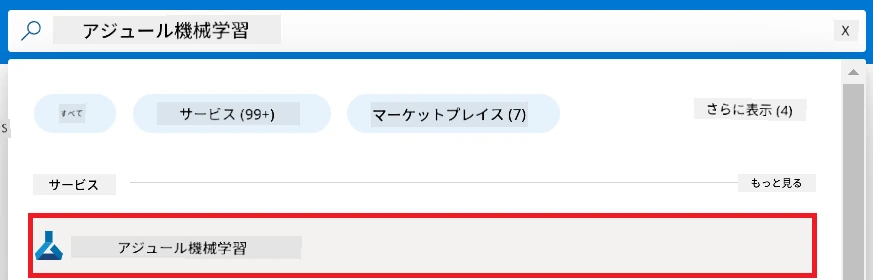

2. ナビゲーションメニューから **+ 作成** を選択します。

3. ナビゲーションメニューから **新しいワークスペース** を選択します。

    

4. 以下の項目を入力・選択します：

    - Azure の **サブスクリプション** を選択します。
    - 利用する **リソース グループ** を選択します（必要に応じて新規作成）。
    - **ワークスペース名** を入力します。固有の値である必要があります。
    - 利用したい **リージョン** を選択します。
    - 利用する **ストレージアカウント** を選択します（必要に応じて新規作成）。
    - 利用する **キー コンテナー** を選択します（必要に応じて新規作成）。
    - 利用する **アプリケーション インサイト** を選択します（必要に応じて新規作成）。
    - 利用する **コンテナ レジストリ** を選択します（必要に応じて新規作成）。

    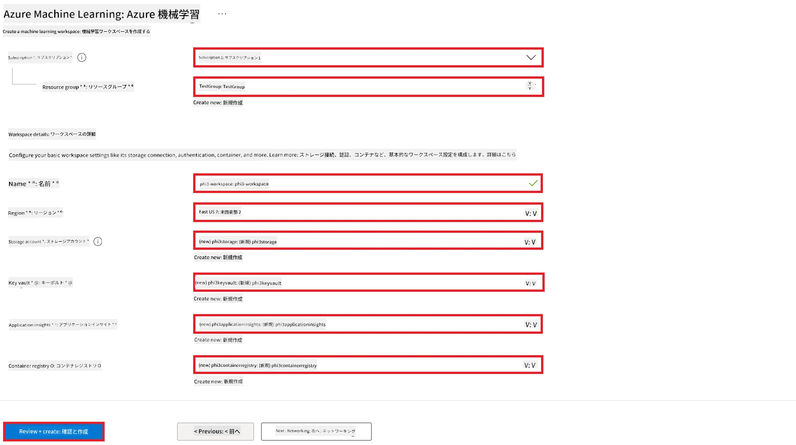

5. **確認および作成** を選択します。

6. **作成** を選択します。

### Azure サブスクリプションの GPU クォータ申請

本チュートリアルでは、Phi-3 モデルのファインチューニングおよびデプロイに GPU を使用します。ファインチューニングでは *Standard_NC24ads_A100_v4* GPU を使用し、クォータの申請が必要です。デプロイには *Standard_NC6s_v3* GPU を使用し、こちらもクォータ申請が必要です。

> [!NOTE]
>
> Pay-As-You-Go サブスクリプション（標準のサブスクリプションタイプ）のみが GPU 割当の対象であり、ベネフィット サブスクリプションは現在対応していません。
>

1. [Azure ML Studio](https://ml.azure.com/home?wt.mc_id=studentamb_279723) にアクセスします。

1. *Standard NCADSA100v4 Family* クォータを申請するには、以下を行います：

    - 左側タブから **Quota** を選択します。
    - 利用したい **仮想マシンファミリー** を選択します。例として *Standard NCADSA100v4 Family Cluster Dedicated vCPUs* を選択します。これは *Standard_NC24ads_A100_v4* GPU を含みます。
    - ナビゲーションメニューから **Quota 申請** を選択します。

        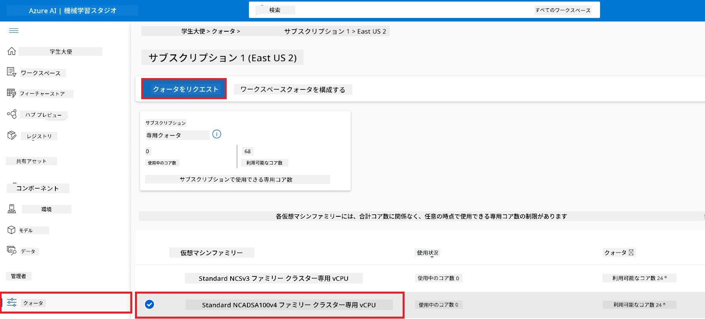

    - 申請ページで使用したい **新しいコア数の上限** を入力します。例：24。
    - **送信** を選択して GPU クォータを申請します。

1. *Standard NCSv3 Family* クォータを申請するには、以下を行います：

    - 左側タブから **Quota** を選択します。
    - 利用したい **仮想マシンファミリー** を選択します。例として *Standard NCSv3 Family Cluster Dedicated vCPUs* を選択します。これは *Standard_NC6s_v3* GPU を含みます。
    - ナビゲーションメニューから **Quota 申請** を選択します。
    - 申請ページで使用したい **新しいコア数の上限** を入力します。例：24。
    - **送信** を選択して GPU クォータを申請します。

### ロール割り当ての追加

モデルのファインチューニングおよびデプロイを行うには、まずユーザー割り当てマネージド ID (UAI) を作成し、それに適切な権限を割り当てる必要があります。この UAI はデプロイ時の認証に使用します。

#### ユーザー割り当てマネージド ID (UAI) の作成

1. ポータルページ上部の**検索バー**に *managed identities* と入力し、表示されたオプションから **Managed Identities** を選択します。

    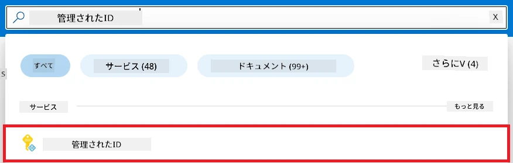

1. **+ 作成** を選択します。

    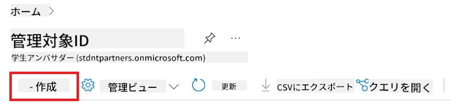

1. 以下の項目を入力・選択します：

    - Azure **サブスクリプション** を選択します。
    - 利用する **リソース グループ** を選択します（必要に応じて新規作成）。
    - 利用したい **リージョン** を選択します。
    - **名前** を入力します。固有の値である必要があります。

    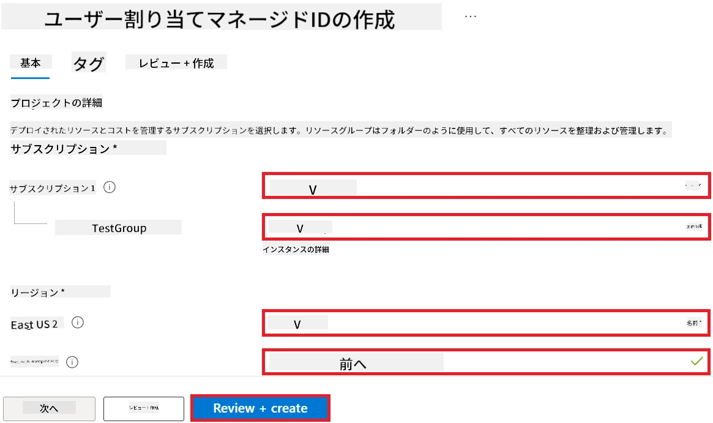

1. **確認および作成** を選択します。

1. **作成** を選択します。

#### マネージド ID に Contributor ロールの割り当て

1. 作成したマネージド ID のリソースページに移動します。

1. 左側タブから **Azure ロール割り当て** を選択します。

1. ナビゲーションメニューから **+ ロール割り当ての追加** を選択します。

1. ロール割り当て追加ページで以下を実施します：
    - **スコープ** を **リソース グループ** に設定します。
    - Azure **サブスクリプション** を選択します。
    - 利用する **リソース グループ** を選択します。
    - **ロール** に **Contributor** を選択します。

    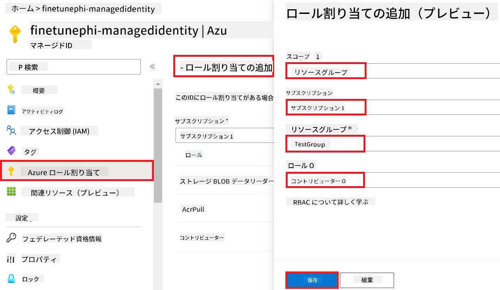

2. **保存** を選択します。

#### マネージド ID に Storage Blob Data Reader ロールの割り当て

1. ポータルページ上部の**検索バー**に *storage accounts* と入力し、表示されたオプションから **Storage accounts** を選択します。

    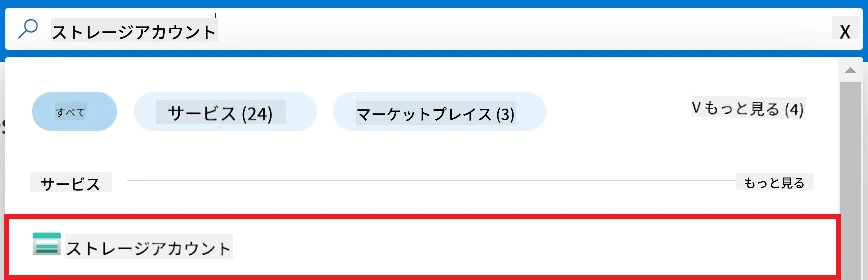

1. 作成した Azure Machine Learning ワークスペースに紐づくストレージアカウントを選択します。例：*finetunephistorage*。

1. 以下の操作でロール割り当て追加ページに移動します：

    - 作成した Azure ストレージアカウントのページに移動します。
    - 左側タブから **アクセス制御（IAM）** を選択します。
    - ナビゲーションメニューから **+ 追加** を選択します。
    - **ロール割り当ての追加** を選択します。

    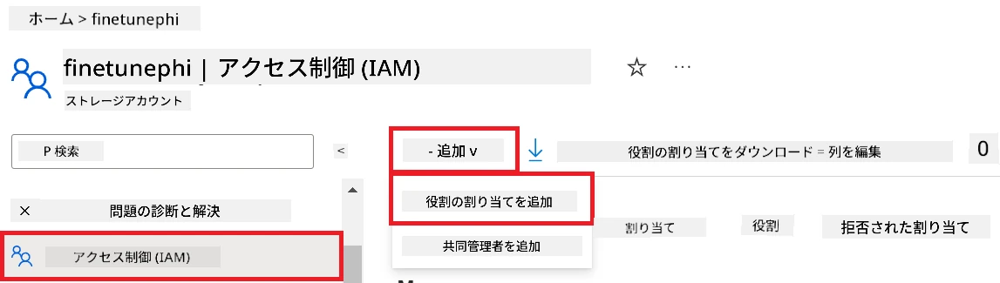

1. ロール割り当て追加ページで以下を実施します：

    - ロールページの検索バーに *Storage Blob Data Reader* と入力し、表示されたオプションから **Storage Blob Data Reader** を選択します。
    - **次へ** を選択します。
    - メンバーのページで、**アクセスを割り当てる対象** に **Managed identity** を選択します。
    - **+ メンバーの選択** を選択します。
    - マネージド ID 選択ページで Azure **サブスクリプション** を選択します。
    - マネージド ID 選択ページで **Managed Identity** を選択します。
    - 作成したマネージド ID を選択します。例：*finetunephi-managedidentity*。
    - **選択** をクリックします。

    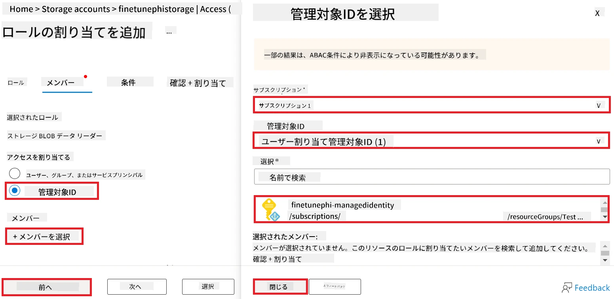

1. **確認および割り当て** を選択します。

#### マネージド ID に AcrPull ロールの割り当て

1. ポータルページ上部の**検索バー**に *container registries* と入力し、表示されたオプションから **Container registries** を選択します。

    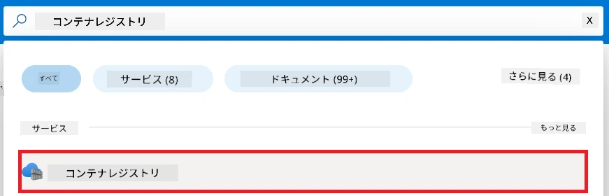

1. Azure Machine Learning ワークスペースに紐づくコンテナ レジストリを選択します。例：*finetunephicontainerregistry*

1. ロール割り当て追加ページへ以下の操作で移動します：

    - 左側タブから **アクセス制御（IAM）** を選択します。
    - ナビゲーションメニューから **+ 追加** を選択します。
    - **ロール割り当ての追加** を選択します。

1. ロール割り当て追加ページで以下を実施します：

    - ロールページの検索バーに *AcrPull* と入力し、表示されたオプションから **AcrPull** を選択します。
    - **次へ** を選択します。
    - メンバーのページで、**アクセスを割り当てる対象** に **Managed identity** を選択します。
    - **+ メンバーの選択** を選択します。
    - マネージド ID 選択ページで Azure **サブスクリプション** を選択します。
    - マネージド ID 選択ページで **Managed Identity** を選択します。
    - 作成したマネージド ID を選択します。例：*finetunephi-managedidentity*。
    - **選択** をクリックします。
    - **確認および割り当て** を選択します。

### プロジェクトのセットアップ

ファインチューニングに必要なデータセットをダウンロードするために、ローカル環境をセットアップします。

この演習では、

- 作業フォルダを作成します。
- 仮想環境を作成します。
- 必要なパッケージをインストールします。
- データセットをダウンロードするための *download_dataset.py* ファイルを作成します。

#### 作業用フォルダの作成

1. ターミナルウィンドウを開き、次のコマンドを入力してデフォルトパスに *finetune-phi* という名前のフォルダを作成します。

    ```console
    mkdir finetune-phi
    ```

2. 作成した *finetune-phi* フォルダーに移動するために、ターミナルに以下のコマンドを入力します。

    ```console
    cd finetune-phi
    ```

#### 仮想環境の作成

1. *.venv* という名前の仮想環境を作成するために、ターミナルに以下のコマンドを入力します。

    ```console
    python -m venv .venv
    ```

2. 仮想環境をアクティブにするために、ターミナルに以下のコマンドを入力します。

    ```console
    .venv\Scripts\activate.bat
    ```

> [!NOTE]
> うまくいった場合は、コマンドプロンプトの前に *(.venv)* が表示されます。

#### 必要なパッケージのインストール

1. 必要なパッケージをインストールするために、ターミナルに以下のコマンドを入力します。

    ```console
    pip install datasets==2.19.1
    ```

#### `download_dataset.py` の作成

> [!NOTE]
> 完成したフォルダー構成：
>
> ```text
> └── YourUserName
> .    └── finetune-phi
> .        └── download_dataset.py
> ```

1. **Visual Studio Code** を起動します。

1. メニューバーから **ファイル** を選択します。

1. **フォルダーを開く** を選択します。

1. 作成した *finetune-phi* フォルダーを選択します。場所は *C:\Users\yourUserName\finetune-phi* です。

    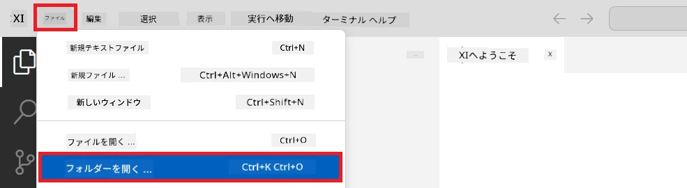

1. Visual Studio Code の左ペインで右クリックし、**新しいファイル** を選択して *download_dataset.py* という新しいファイルを作成します。

    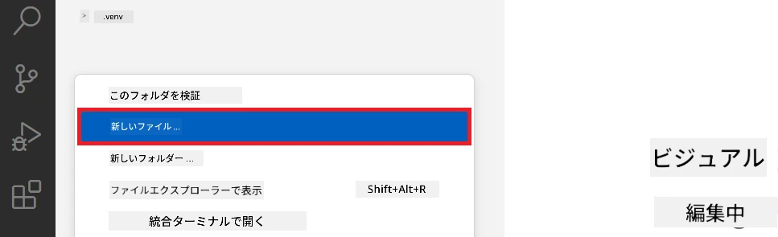

### ファインチューニング用のデータセット準備

この演習では、*download_dataset.py* ファイルを実行して *ultrachat_200k* データセットをローカル環境にダウンロードします。その後、このデータセットを使用して Azure Machine Learning 上の Phi-3 モデルをファインチューニングします。

この演習で行うこと：

- *download_dataset.py* ファイルにデータセットをダウンロードするコードを追加する。
- *download_dataset.py* ファイルを実行してデータセットをローカル環境にダウンロードする。

#### *download_dataset.py* を使ってデータセットをダウンロードする

1. Visual Studio Code で *download_dataset.py* ファイルを開きます。

1. *download_dataset.py* ファイルに次のコードを追加します。

    ```python
    import json
    import os
    from datasets import load_dataset

    def load_and_split_dataset(dataset_name, config_name, split_ratio):
        """
        Load and split a dataset.
        """
        # 指定された名前、設定、および分割比率でデータセットを読み込みます
        dataset = load_dataset(dataset_name, config_name, split=split_ratio)
        print(f"Original dataset size: {len(dataset)}")
        
        # データセットをトレインセットとテストセットに分割します（トレイン80%、テスト20%）
        split_dataset = dataset.train_test_split(test_size=0.2)
        print(f"Train dataset size: {len(split_dataset['train'])}")
        print(f"Test dataset size: {len(split_dataset['test'])}")
        
        return split_dataset

    def save_dataset_to_jsonl(dataset, filepath):
        """
        Save a dataset to a JSONL file.
        """
        # ディレクトリが存在しない場合は作成します
        os.makedirs(os.path.dirname(filepath), exist_ok=True)
        
        # ファイルを書き込みモードで開きます
        with open(filepath, 'w', encoding='utf-8') as f:
            # データセット内の各レコードを反復処理します
            for record in dataset:
                # レコードをJSONオブジェクトとしてダンプし、ファイルに書き込みます
                json.dump(record, f)
                # レコードを区切るために改行文字を書き込みます
                f.write('\n')
        
        print(f"Dataset saved to {filepath}")

    def main():
        """
        Main function to load, split, and save the dataset.
        """
        # 特定の設定と分割比率でULTRACHAT_200kデータセットを読み込み、分割します
        dataset = load_and_split_dataset("HuggingFaceH4/ultrachat_200k", 'default', 'train_sft[:1%]')
        
        # 分割からトレインデータセットとテストデータセットを抽出します
        train_dataset = dataset['train']
        test_dataset = dataset['test']

        # トレインデータセットをJSONLファイルに保存します
        save_dataset_to_jsonl(train_dataset, "data/train_data.jsonl")
        
        # テストデータセットを別のJSONLファイルに保存します
        save_dataset_to_jsonl(test_dataset, "data/test_data.jsonl")

    if __name__ == "__main__":
        main()

    ```

1. ターミナルに以下のコマンドを入力してスクリプトを実行し、データセットをローカル環境にダウンロードします。

    ```console
    python download_dataset.py
    ```

1. データセットがローカルの *finetune-phi/data* ディレクトリに正しく保存されていることを確認します。

> [!NOTE]
>
> #### データセットのサイズとファインチューニング時間についての注意
>
> このチュートリアルでは、データセットのわずか1%のみ（`split='train[:1%]'`）を使用します。これによりデータ量が大幅に減少し、アップロードやファインチューニングの時間が短縮されます。トレーニング時間とモデルの性能のバランスを考慮しながら、割合を調整できます。データセットの小さなサブセットを使用することで、チュートリアルに適した管理しやすい時間でファインチューニングが実行可能になります。

## シナリオ 2：Phi-3 モデルのファインチューニングと Azure Machine Learning Studio でのデプロイ

### Phi-3 モデルのファインチューニング

この演習では、Azure Machine Learning Studio 上で Phi-3 モデルをファインチューニングします。

この演習で行うこと：

- ファインチューニング用のコンピュータークラスターを作成する。
- Azure Machine Learning Studio 上で Phi-3 モデルをファインチューニングする。

#### ファインチューニング用コンピュータークラスターの作成

1. [Azure ML Studio](https://ml.azure.com/home?wt.mc_id=studentamb_279723) にアクセスします。

1. 左側のタブから **Compute** を選択します。

1. ナビゲーションメニューから **Compute clusters** を選択します。

1. **+ New** を選択します。

    

1. 次の設定を行います：

    - 利用したい **リージョン** を選択します。
    - **仮想マシン階層** を **Dedicated** に設定します。
    - **仮想マシンの種類** を **GPU** に設定します。
    - **仮想マシンサイズ** フィルタを **すべてのオプションから選択** に設定します。
    - **仮想マシンサイズ** を **Standard_NC24ads_A100_v4** に設定します。

    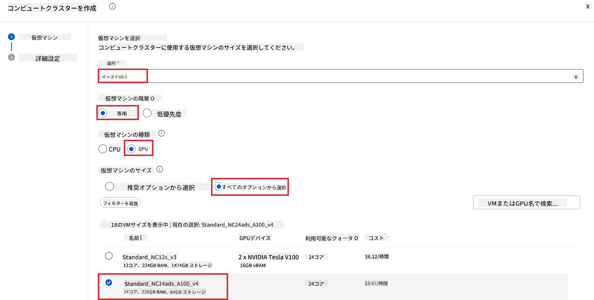

1. **Next** を選択します。

1. 次の設定を行います：

    - **Compute 名** を入力します。ユニークな値である必要があります。
    - **最低ノード数** を **0** に設定します。
    - **最大ノード数** を **1** に設定します。
    - **スケールダウンまでのアイドル秒数** を **120** に設定します。

    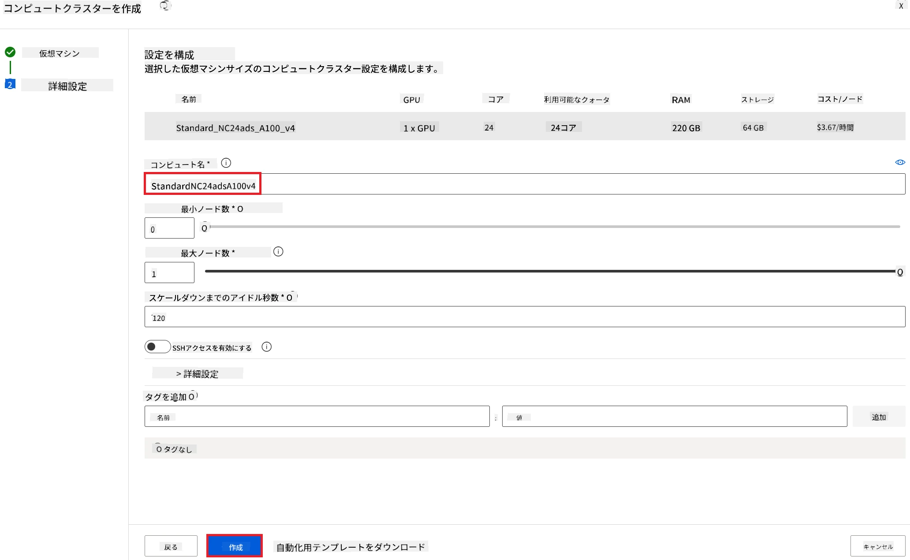

1. **Create** を選択します。

#### Phi-3 モデルのファインチューニング

1. [Azure ML Studio](https://ml.azure.com/home?wt.mc_id=studentamb_279723) にアクセスします。

1. 作成した Azure Machine Learning ワークスペースを選択します。

    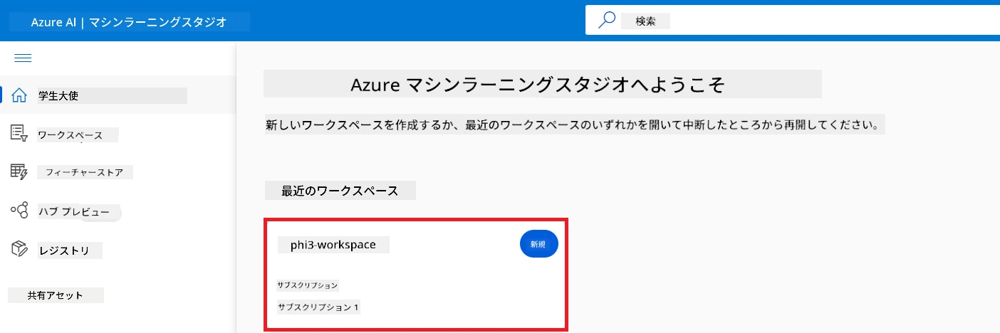

1. 次の操作を行います：

    - 左側のタブから **Model catalog** を選択します。
    - **検索バー** に *phi-3-mini-4k* と入力し、表示されたオプションから **Phi-3-mini-4k-instruct** を選択します。

    

1. ナビゲーションメニューから **Fine-tune** を選択します。

    

1. 次の操作を行います：

    - **Select task type** を **Chat completion** に設定します。
    - **+ Select data** を選択して **Training data** をアップロードします。
    - 検証データのアップロードタイプを **Provide different validation data** に設定します。
    - **+ Select data** を選択して **Validation data** をアップロードします。

    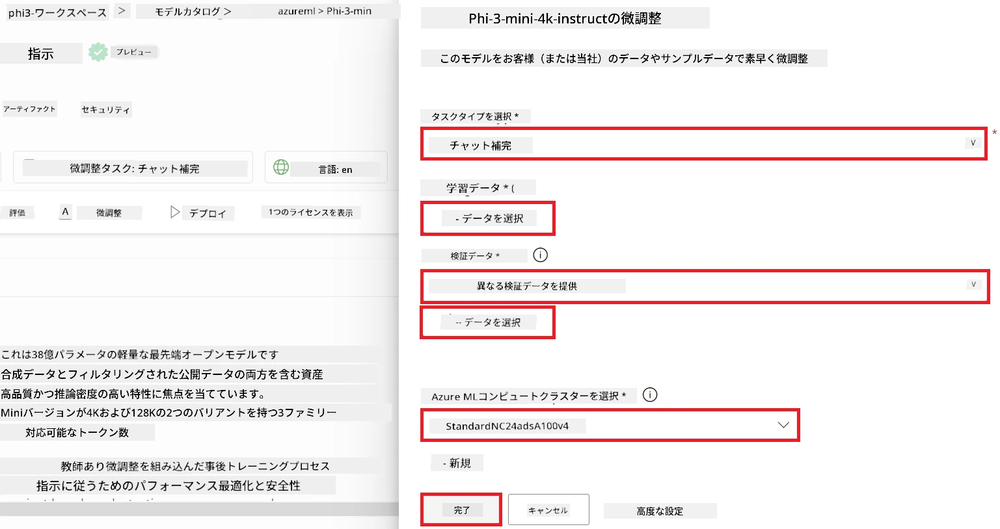

> [!TIP]
>
> **詳細設定** を選択すると、**learning_rate** や **lr_scheduler_type** などの設定をカスタマイズし、ファインチューニングプロセスを最適化できます。

1. **Finish** を選択します。

1. この演習で、Azure Machine Learning を使用して Phi-3 モデルのファインチューニングに成功しました。ファインチューニングにはかなりの時間がかかることがあります。ファインチューニングジョブの実行後、完了するまで待つ必要があります。Azure Machine Learning ワークスペースの左のジョブタブで進行状況を確認できます。次のシリーズでは、ファインチューニングしたモデルをデプロイし、Prompt flow と統合します。

    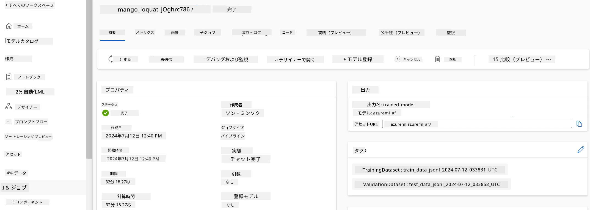

### ファインチューニングした Phi-3 モデルのデプロイ

ファインチューニングした Phi-3 モデルを Prompt flow と連携させるには、リアルタイム推論に対応できるようモデルをデプロイする必要があります。このプロセスには、モデルの登録、オンラインエンドポイントの作成、モデルのデプロイが含まれます。

この演習で行うこと：

- Azure Machine Learning ワークスペースにファインチューニング済みモデルを登録する。
- オンラインエンドポイントを作成する。
- 登録したファインチューニング済み Phi-3 モデルをデプロイする。

#### ファインチューニング済みモデルの登録

1. [Azure ML Studio](https://ml.azure.com/home?wt.mc_id=studentamb_279723) にアクセスします。

1. 作成した Azure Machine Learning ワークスペースを選択します。

    

1. 左側のタブから **Models** を選択します。
1. **+ Register** を選択します。
1. **From a job output** を選択します。

    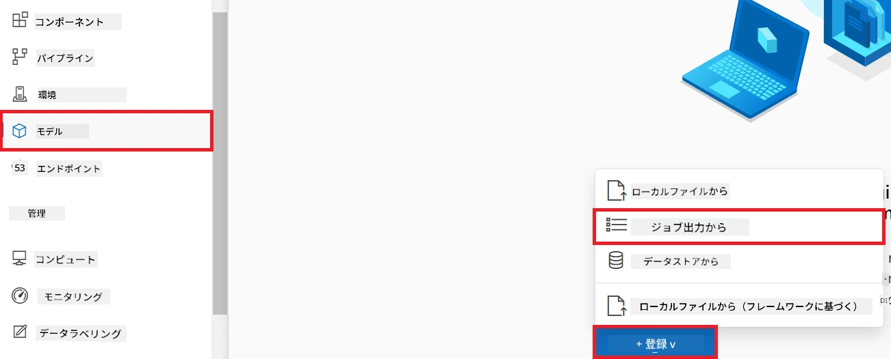

1. 作成したジョブを選択します。

    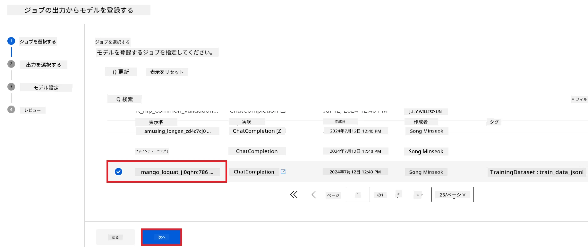

1. **Next** を選択します。

1. **Model type** を **MLflow** に設定します。

1. **Job output** が選択されていることを確認します。通常、自動的に選択されています。

    

2. **Next** を選択します。

3. **Register** を選択します。

    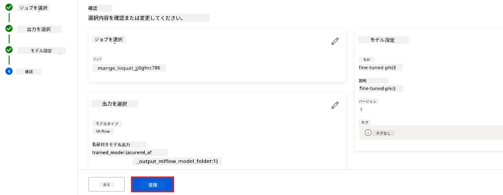

4. 左側のタブの **Models** メニューから登録したモデルを確認できます。

    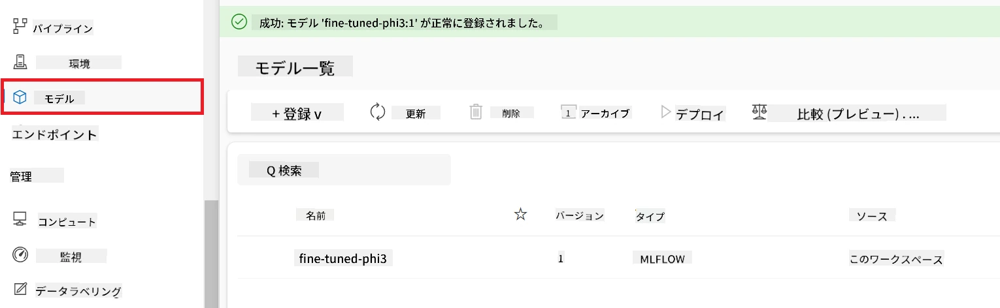

#### ファインチューニング済みモデルのデプロイ

1. 作成した Azure Machine Learning ワークスペースに移動します。

1. 左側のタブから **Endpoints** を選択します。

1. ナビゲーションメニューから **Real-time endpoints** を選択します。

    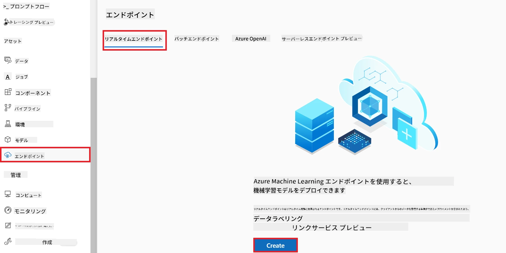

1. **Create** を選択します。

1. 登録済みのモデルを選択します。

    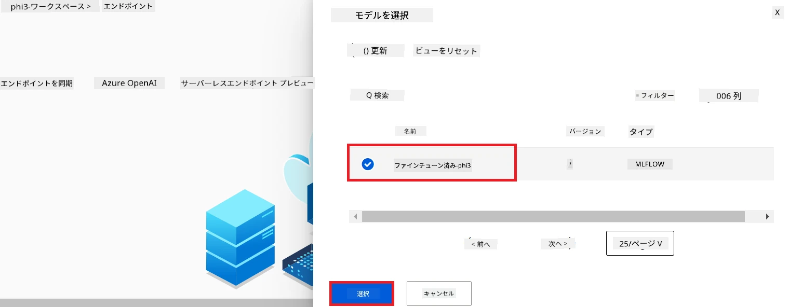

1. **Select** を選択します。

1. 次の設定を行います：

    - **Virtual machine** を *Standard_NC6s_v3* に設定します。
    - 使用したい **インスタンス数** を設定します。例：*1*。
    - **Endpoint** を **New** に設定してエンドポイントを作成します。
    - **Endpoint 名** を入力します。ユニークな値である必要があります。
    - **Deployment 名** を入力します。ユニークな値である必要があります。

    

1. **Deploy** を選択します。

> [!WARNING]
> 追加料金を避けるため、Azure Machine Learning ワークスペースで作成したエンドポイントは不要になったら必ず削除してください。
>

#### Azure Machine Learning ワークスペースでのデプロイ状況の確認

1. 作成した Azure Machine Learning ワークスペースに移動します。

1. 左側のタブから **Endpoints** を選択します。

1. 作成したエンドポイントを選択します。

    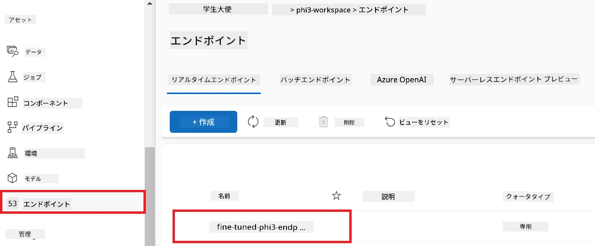

1. このページでデプロイ中のエンドポイントを管理できます。

> [!NOTE]
> デプロイ完了後、**Live traffic** が **100%** に設定されていることを確認してください。そうでない場合は、**Update traffic** を選択してトラフィック設定を調整します。トラフィックが 0% の場合、モデルのテストができません。
>
> 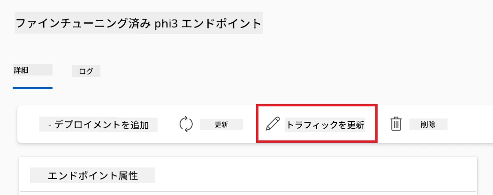
>

## シナリオ 3：Prompt flow と統合して Azure AI Foundry でカスタムモデルとチャット

### カスタム Phi-3 モデルを Prompt flow と統合

ファインチューニングしたモデルを正常にデプロイしたら、Prompt Flow と統合してリアルタイムでモデルを使用できるようにします。これにより、カスタム Phi-3 モデルを用いた様々な対話型タスクが可能になります。

この演習で行うこと：

- Azure AI Foundry Hub を作成する。
- Azure AI Foundry プロジェクトを作成する。
- Prompt flow を作成する。
- ファインチューニングした Phi-3 モデル用のカスタム接続を追加する。
- カスタム Phi-3 モデルとチャットできるよう Prompt flow を設定する。

> [!NOTE]
> Azure ML Studio を使っても Promptflow と統合可能です。同じ統合プロセスを Azure ML Studio に適用できます。

#### Azure AI Foundry Hub の作成

プロジェクトを作成する前に Hub を作成する必要があります。Hub はリソースグループのように機能し、Azure AI Foundry 内で複数のプロジェクトを整理・管理できます。

1. [Azure AI Foundry](https://ai.azure.com/?WT.mc_id=aiml-137032-kinfeylo) にアクセスします。

1. 左側のタブから **All hubs** を選択します。

1. ナビゲーションメニューから **+ New hub** を選択します。
    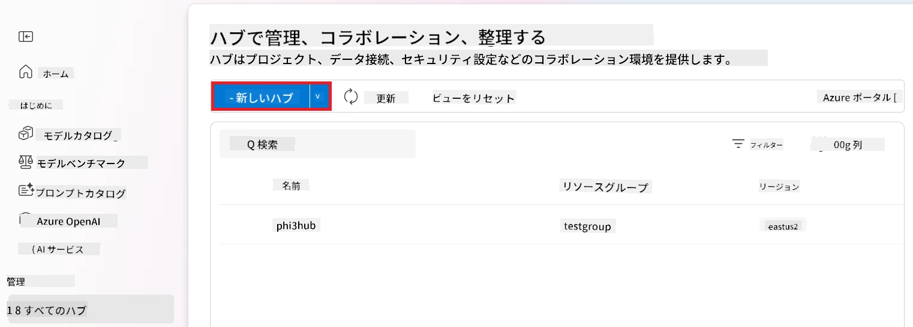

1. 以下のタスクを実行します：

    - **ハブ名** を入力します。ユニークな値でなければなりません。
    - Azure の **サブスクリプション** を選択します。
    - 使用する **リソースグループ** を選択します（必要に応じて新規作成）。
    - 使用したい **ロケーション** を選択します。
    - 使用する **Azure AI サービスに接続** を選択します（必要に応じて新規作成）。
    - **Azure AI 検索に接続** を **接続をスキップ** に設定します。

    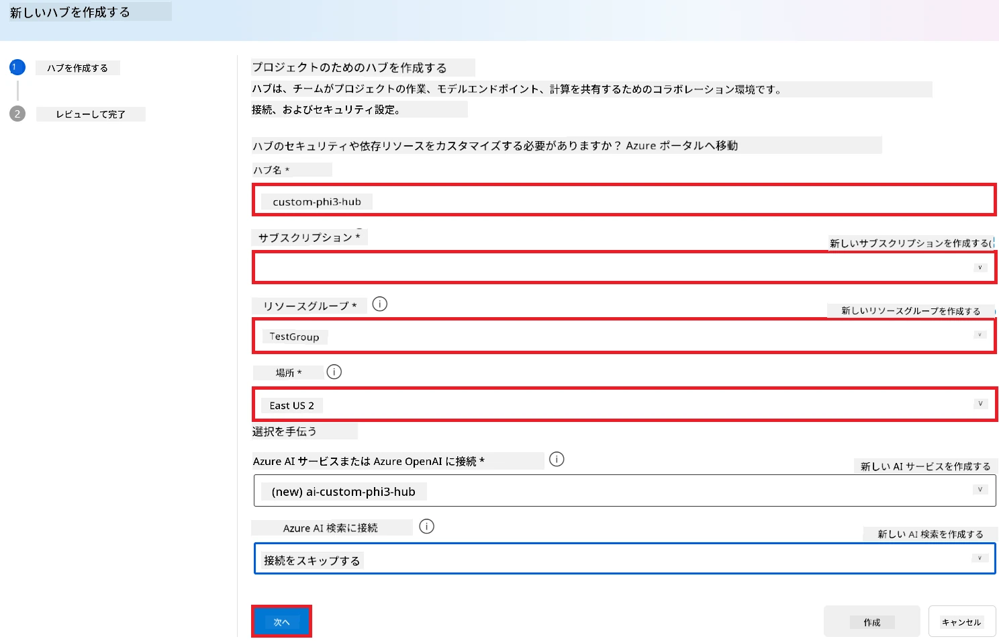

1. **次へ** を選択します。

#### Azure AI Foundry プロジェクトの作成

1. 作成したハブで、左側のタブから **すべてのプロジェクト** を選択します。

1. ナビゲーションメニューから **+ 新しいプロジェクト** を選択します。

    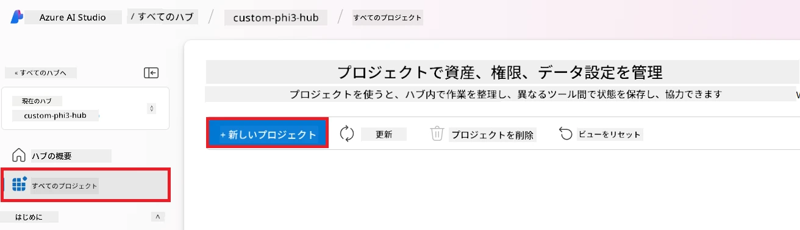

1. **プロジェクト名** を入力します。ユニークな値でなければなりません。

    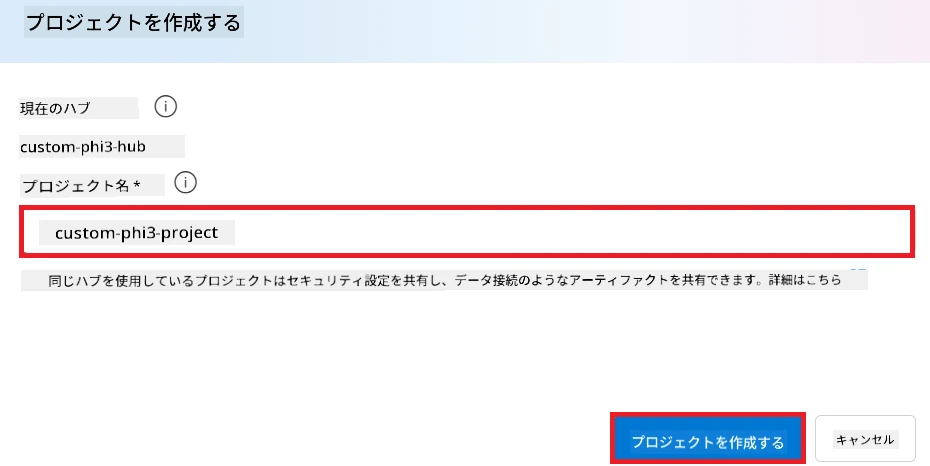

1. **プロジェクトを作成** を選択します。

#### ファインチューニングした Phi-3 モデル用のカスタム接続を追加する

カスタム Phi-3 モデルを Prompt flow に統合するには、モデルのエンドポイントとキーをカスタム接続に保存する必要があります。この設定により、Prompt flow でカスタム Phi-3 モデルにアクセスできるようになります。

#### ファインチューニング済み Phi-3 モデルの api キーとエンドポイント URI を設定する

1. [Azure ML Studio](https://ml.azure.com/home?WT.mc_id=aiml-137032-kinfeylo) にアクセスします。

1. 作成した Azure Machine Learning ワークスペースに移動します。

1. 左側のタブから **エンドポイント** を選択します。

    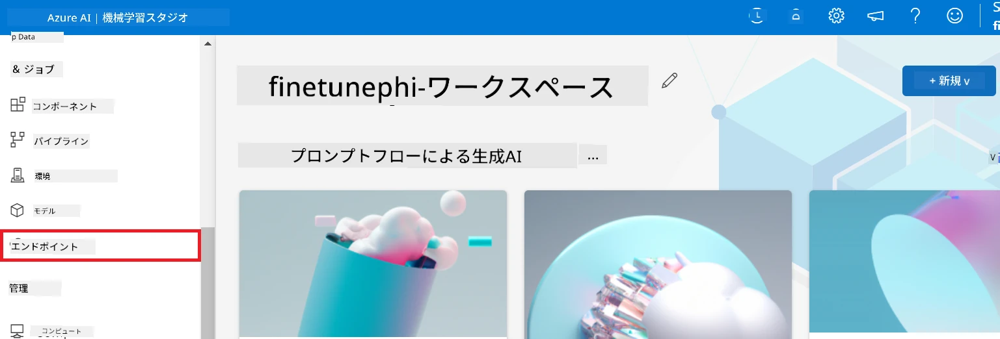

1. 作成したエンドポイントを選択します。

    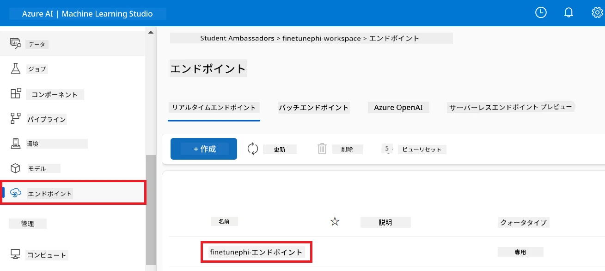

1. ナビゲーションメニューから **利用** を選択します。

1. **REST エンドポイント** と **プライマリキー** をコピーします。

    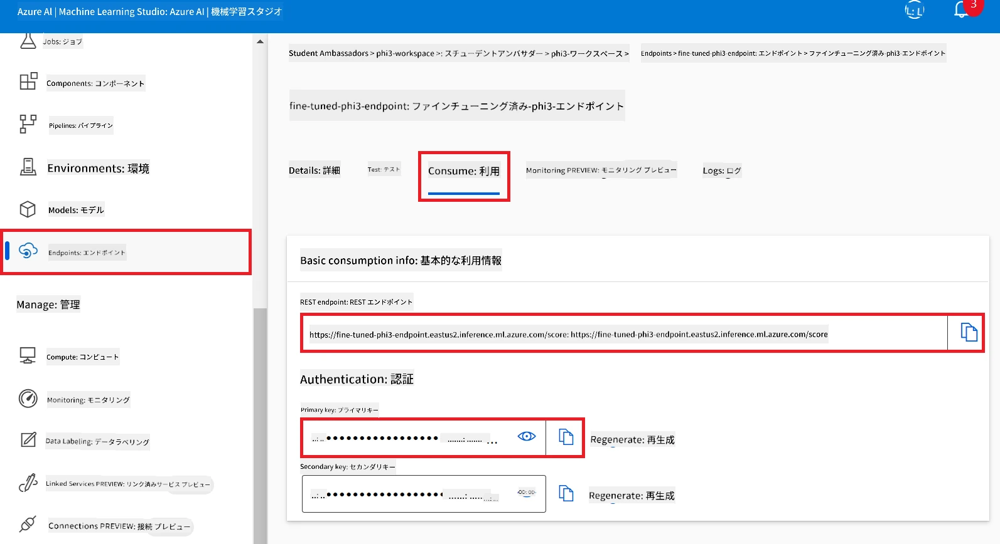

#### カスタム接続を追加する

1. [Azure AI Foundry](https://ai.azure.com/?WT.mc_id=aiml-137032-kinfeylo) にアクセスします。

1. 作成した Azure AI Foundry プロジェクトに移動します。

1. 作成したプロジェクトで、左側のタブから **設定** を選択します。

1. **+ 新しい接続** を選択します。

    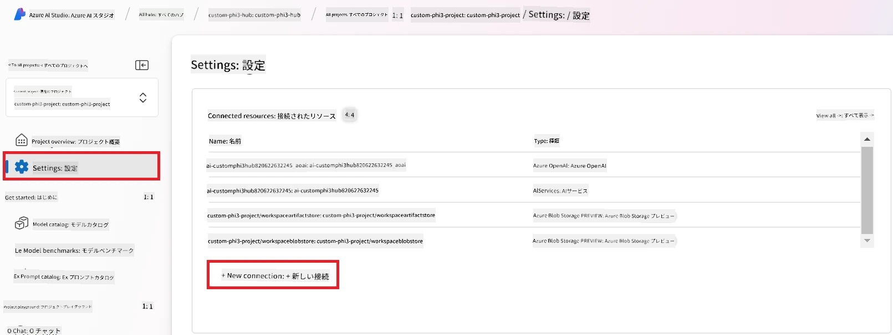

1. ナビゲーションメニューから **カスタムキー** を選択します。

    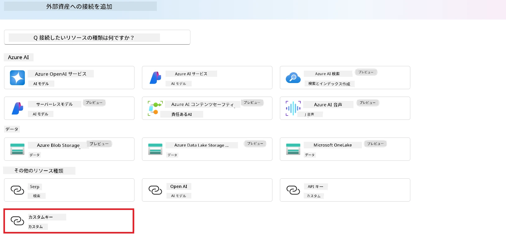

1. 以下の操作を行います：

    - **+ キーと値のペアを追加** を選択します。
    - キー名に **endpoint** と入力し、Azure ML Studio からコピーしたエンドポイントを値フィールドに貼り付けます。
    - 再度 **+ キーと値のペアを追加** を選択します。
    - キー名に **key** と入力し、Azure ML Studio からコピーしたキーを値フィールドに貼り付けます。
    - キーを追加した後、キーが露出しないように **シークレットとして扱う** を選択します。

    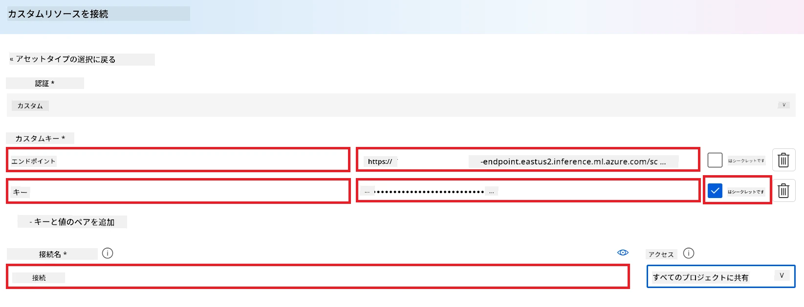

1. **接続を追加** を選択します。

#### Prompt flow を作成する

Azure AI Foundry にカスタム接続を追加しました。次に、以下の手順で Prompt flow を作成します。その後、カスタム接続にこの Prompt flow を接続し、ファインチューニングしたモデルを Prompt flow 内で使用できるようにします。

1. 作成した Azure AI Foundry プロジェクトに移動します。

1. 左側のタブから **Prompt flow** を選択します。

1. ナビゲーションメニューから **+ 作成** を選択します。

    

1. ナビゲーションメニューから **チャットフロー** を選択します。

    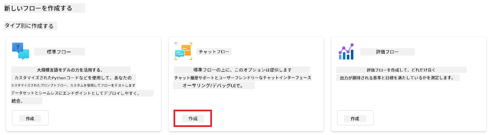

1. 使用する **フォルダー名** を入力します。

    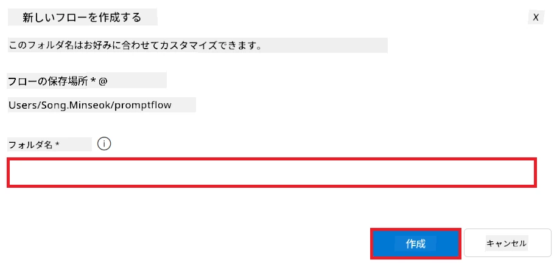

2. **作成** を選択します。

#### Prompt flow を設定してカスタム Phi-3 モデルとチャットする

ファインチューニングした Phi-3 モデルを Prompt flow に統合する必要があります。ただし、提供されている既存の Prompt flow はこの目的に対応していません。したがって、カスタムモデル統合が可能なように Prompt flow を再設計する必要があります。

1. Prompt flow で以下の操作を行い、既存のフローを再構築します：

    - **生ファイルモード** を選択します。
    - *flow.dag.yml* ファイル内の既存コードをすべて削除します。
    - *flow.dag.yml* ファイルに以下のコードを追加します。

        ```yml
        inputs:
          input_data:
            type: string
            default: "Who founded Microsoft?"

        outputs:
          answer:
            type: string
            reference: ${integrate_with_promptflow.output}

        nodes:
        - name: integrate_with_promptflow
          type: python
          source:
            type: code
            path: integrate_with_promptflow.py
          inputs:
            input_data: ${inputs.input_data}
        ```

    - **保存** を選択します。

    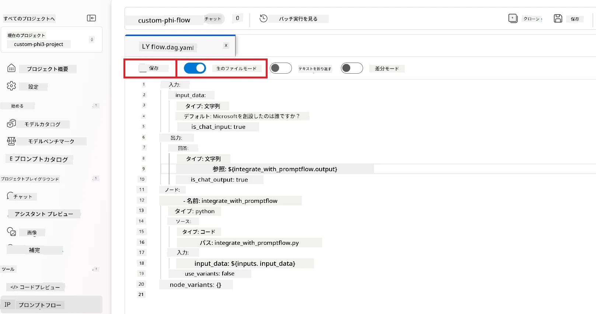

1. *integrate_with_promptflow.py* ファイルに以下のコードを追加し、Prompt flow でカスタム Phi-3 モデルを使用します。

    ```python
    import logging
    import requests
    from promptflow import tool
    from promptflow.connections import CustomConnection

    # ロギング設定
    logging.basicConfig(
        format="%(asctime)s - %(levelname)s - %(name)s - %(message)s",
        datefmt="%Y-%m-%d %H:%M:%S",
        level=logging.DEBUG
    )
    logger = logging.getLogger(__name__)

    def query_phi3_model(input_data: str, connection: CustomConnection) -> str:
        """
        Send a request to the Phi-3 model endpoint with the given input data using Custom Connection.
        """

        # 「connection」はカスタム接続の名前で、「endpoint」「key」はカスタム接続内のキーです
        endpoint_url = connection.endpoint
        api_key = connection.key

        headers = {
            "Content-Type": "application/json",
            "Authorization": f"Bearer {api_key}"
        }
        data = {
            "input_data": {
                "input_string": [
                    {"role": "user", "content": input_data}
                ],
                "parameters": {
                    "temperature": 0.7,
                    "max_new_tokens": 128
                }
            }
        }
        try:
            response = requests.post(endpoint_url, json=data, headers=headers)
            response.raise_for_status()
            
            # 完全なJSONレスポンスをログに記録する
            logger.debug(f"Full JSON response: {response.json()}")

            result = response.json()["output"]
            logger.info("Successfully received response from Azure ML Endpoint.")
            return result
        except requests.exceptions.RequestException as e:
            logger.error(f"Error querying Azure ML Endpoint: {e}")
            raise

    @tool
    def my_python_tool(input_data: str, connection: CustomConnection) -> str:
        """
        Tool function to process input data and query the Phi-3 model.
        """
        return query_phi3_model(input_data, connection)

    ```

    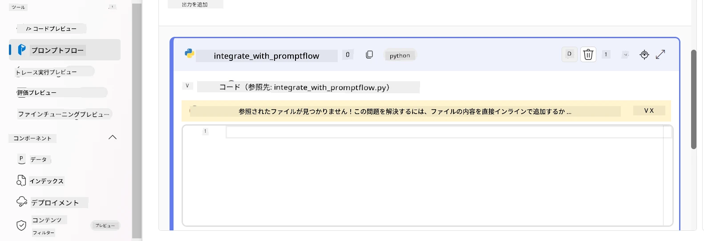

> [!NOTE]
> Azure AI Foundry で Prompt flow を使用する詳細については、[Azure AI Foundry の Prompt flow](https://learn.microsoft.com/azure/ai-studio/how-to/prompt-flow) を参照してください。

1. **チャット入力**、**チャット出力** を選択して、モデルとのチャットを有効にします。

    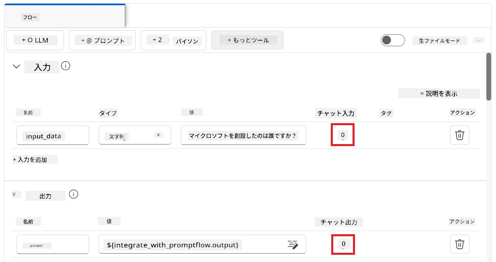

1. これでカスタム Phi-3 モデルとのチャットが準備できました。次の演習では、Prompt flow を起動し、ファインチューニング済みの Phi-3 モデルとチャットする方法を学びます。

> [!NOTE]
>
> 再構築したフローは以下の画像のようになります：
>
> 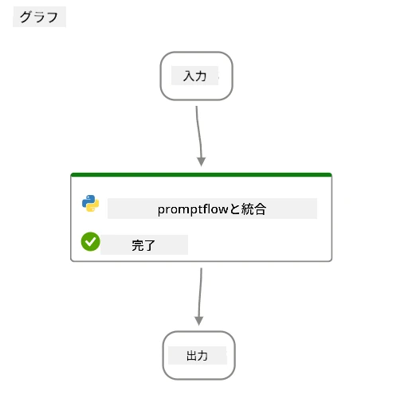
>

### カスタム Phi-3 モデルとのチャット

ファインチューニングしたカスタム Phi-3 モデルを Prompt flow と統合したので、対話を開始する準備ができました。この演習では、Prompt flow を使ってモデルとのチャットを設定し開始する手順を案内します。これらのステップに従うことで、ファインチューニング済みの Phi-3 モデルの能力を様々なタスクや会話に活用できます。

- Prompt flow を使ってカスタム Phi-3 モデルとチャットします。

#### Prompt flow を起動する

1. **コンピュート セッションを開始** を選択して Prompt flow を開始します。

    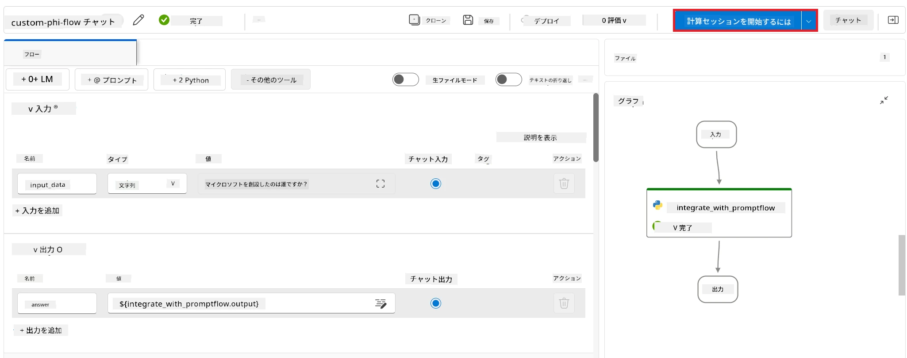

1. **入力の検証と解析** を選択してパラメーターを更新します。

    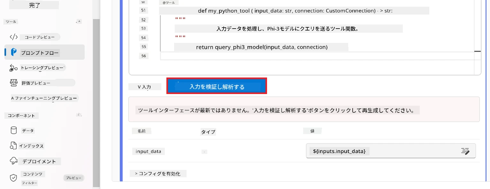

1. 作成したカスタム接続の **connection** の **値** を選択します。例として *connection*。

    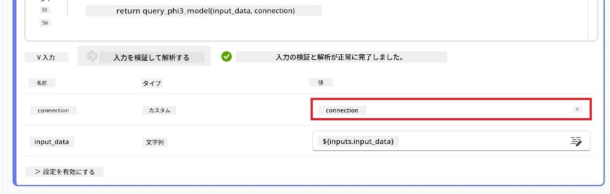

#### カスタムモデルとチャットする

1. **チャット** を選択します。

    

1. 結果例です：これでカスタム Phi-3 モデルとチャットできます。ファインチューニングに使用したデータに基づく質問をすることを推奨します。

    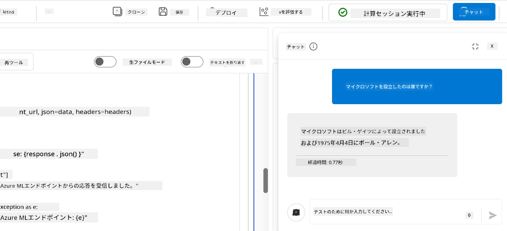

---

<!-- CO-OP TRANSLATOR DISCLAIMER START -->
**免責事項**：  
本書類はAI翻訳サービス「[Co-op Translator](https://github.com/Azure/co-op-translator)」を使用して翻訳されました。正確性の向上に努めておりますが、自動翻訳には誤りや不正確な部分が含まれる可能性があります。原文の言語で記載された文書が正式な情報源とみなされます。重要な情報については、専門の人間翻訳をご利用いただくことをお勧めします。本翻訳の利用により生じた誤解や誤訳について、当社は一切の責任を負いかねますのでご了承ください。
<!-- CO-OP TRANSLATOR DISCLAIMER END -->
