<!--
CO_OP_TRANSLATOR_METADATA:
{
  "original_hash": "ed86d361ac6d4cc8bfb47428e6a2a247",
  "translation_date": "2025-04-04T12:38:48+00:00",
  "source_file": "md\\02.Application\\01.TextAndChat\\Phi3\\E2E_Phi-3-FineTuning_PromptFlow_Integration_AIFoundry.md",
  "language_code": "ja"
}
-->
# Phi-3モデルをAzure AI FoundryのPrompt flowでカスタマイズ・統合する方法

このエンドツーエンド（E2E）サンプルは、Microsoft Tech Communityのガイド「[Fine-Tune and Integrate Custom Phi-3 Models with Prompt Flow in Azure AI Foundry](https://techcommunity.microsoft.com/t5/educator-developer-blog/fine-tune-and-integrate-custom-phi-3-models-with-prompt-flow-in/ba-p/4191726?WT.mc_id=aiml-137032-kinfeylo)」に基づいています。Azure AI FoundryでPrompt flowを活用し、カスタムPhi-3モデルを微調整、デプロイ、統合するプロセスを紹介します。ローカル環境でコードを実行するE2Eサンプル「[Fine-Tune and Integrate Custom Phi-3 Models with Prompt Flow](./E2E_Phi-3-FineTuning_PromptFlow_Integration.md)」とは異なり、このチュートリアルではAzure AI / ML Studio内でモデルを完全に微調整・統合することに焦点を当てています。

## 概要

このE2Eサンプルでは、Phi-3モデルを微調整し、Azure AI FoundryのPrompt flowに統合する方法を学びます。Azure AI / ML Studioを活用して、カスタムAIモデルをデプロイ・利用するワークフローを確立します。このE2Eサンプルは以下の3つのシナリオに分かれています：

**シナリオ1: Azureリソースのセットアップと微調整準備**

**シナリオ2: Phi-3モデルを微調整し、Azure Machine Learning Studioでデプロイ**

**シナリオ3: Prompt flowに統合し、Azure AI Foundryでカスタムモデルとチャット**

以下はこのE2Eサンプルの概要です。

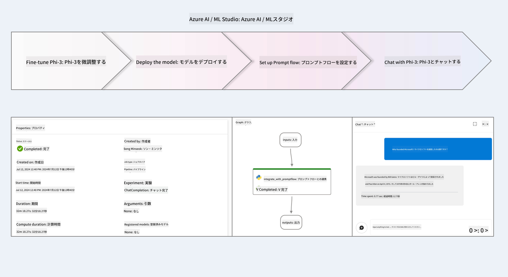

### 目次

1. **[シナリオ1: Azureリソースのセットアップと微調整準備](../../../../../../md/02.Application/01.TextAndChat/Phi3)**
    - [Azure Machine Learning Workspaceを作成](../../../../../../md/02.Application/01.TextAndChat/Phi3)
    - [AzureサブスクリプションでGPUクォータをリクエスト](../../../../../../md/02.Application/01.TextAndChat/Phi3)
    - [ロール割り当てを追加](../../../../../../md/02.Application/01.TextAndChat/Phi3)
    - [プロジェクトをセットアップ](../../../../../../md/02.Application/01.TextAndChat/Phi3)
    - [微調整用データセットの準備](../../../../../../md/02.Application/01.TextAndChat/Phi3)

1. **[シナリオ2: Phi-3モデルを微調整し、Azure Machine Learning Studioでデプロイ](../../../../../../md/02.Application/01.TextAndChat/Phi3)**
    - [Phi-3モデルを微調整](../../../../../../md/02.Application/01.TextAndChat/Phi3)
    - [微調整したPhi-3モデルをデプロイ](../../../../../../md/02.Application/01.TextAndChat/Phi3)

1. **[シナリオ3: Prompt flowに統合し、Azure AI Foundryでカスタムモデルとチャット](../../../../../../md/02.Application/01.TextAndChat/Phi3)**
    - [カスタムPhi-3モデルをPrompt flowに統合](../../../../../../md/02.Application/01.TextAndChat/Phi3)
    - [カスタムPhi-3モデルとチャット](../../../../../../md/02.Application/01.TextAndChat/Phi3)

## シナリオ1: Azureリソースのセットアップと微調整準備

### Azure Machine Learning Workspaceを作成

1. ポータルページ上部の**検索バー**に「*azure machine learning*」と入力し、表示されたオプションから**Azure Machine Learning**を選択します。

    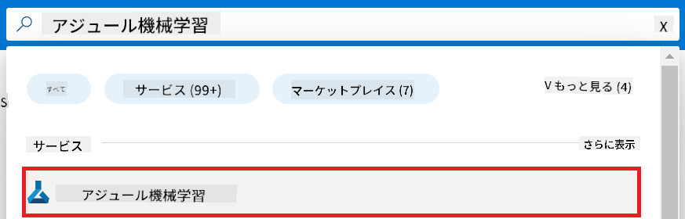

2. ナビゲーションメニューから**+ Create**を選択します。

3. ナビゲーションメニューから**New workspace**を選択します。

    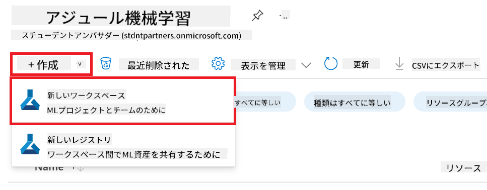

4. 以下のタスクを実行します：

    - Azure **Subscription**を選択。
    - 使用する**Resource group**を選択（必要に応じて新規作成）。
    - **Workspace Name**を入力（一意の値である必要があります）。
    - 使用する**Region**を選択。
    - 使用する**Storage account**を選択（必要に応じて新規作成）。
    - 使用する**Key vault**を選択（必要に応じて新規作成）。
    - 使用する**Application insights**を選択（必要に応じて新規作成）。
    - 使用する**Container registry**を選択（必要に応じて新規作成）。

    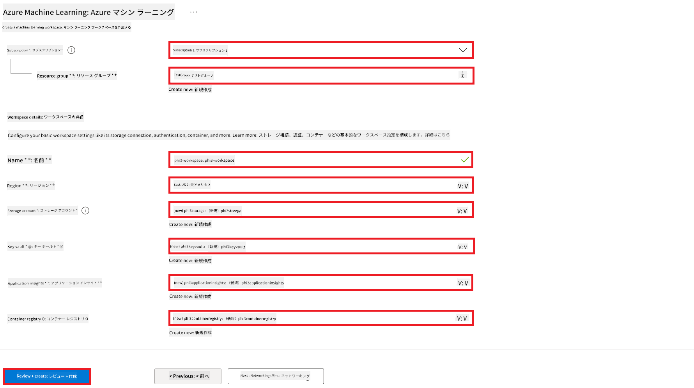

5. **Review + Create**を選択します。

6. **Create**を選択します。

### AzureサブスクリプションでGPUクォータをリクエスト

このチュートリアルでは、GPUを使用してPhi-3モデルを微調整およびデプロイします。微調整には*Standard_NC24ads_A100_v4* GPUを使用し、デプロイには*Standard_NC6s_v3* GPUを使用します。これらのGPUにはクォータリクエストが必要です。

> [!NOTE]
>
> GPU割り当てが可能なのはPay-As-You-Goサブスクリプション（標準的なサブスクリプションタイプ）のみです。特典付きサブスクリプションは現在サポートされていません。
>

1. [Azure ML Studio](https://ml.azure.com/home?wt.mc_id=studentamb_279723)を訪問します。

1. 以下のタスクを実行して*Standard NCADSA100v4 Family*のクォータをリクエストします：

    - 左側のタブから**Quota**を選択。
    - 使用する**Virtual machine family**を選択。例えば、**Standard NCADSA100v4 Family Cluster Dedicated vCPUs**を選択し、*Standard_NC24ads_A100_v4* GPUを含めます。
    - ナビゲーションメニューから**Request quota**を選択。

        

    - Request quotaページ内で、使用したい**New cores limit**を入力。例えば、24。
    - Request quotaページ内で**Submit**を選択してGPUクォータをリクエスト。

1. 以下のタスクを実行して*Standard NCSv3 Family*のクォータをリクエストします：

    - 左側のタブから**Quota**を選択。
    - 使用する**Virtual machine family**を選択。例えば、**Standard NCSv3 Family Cluster Dedicated vCPUs**を選択し、*Standard_NC6s_v3* GPUを含めます。
    - ナビゲーションメニューから**Request quota**を選択。
    - Request quotaページ内で、使用したい**New cores limit**を入力。例えば、24。
    - Request quotaページ内で**Submit**を選択してGPUクォータをリクエスト。

### ロール割り当てを追加

モデルの微調整とデプロイを行うには、まずUser Assigned Managed Identity（UAI）を作成し、適切な権限を割り当てる必要があります。このUAIはデプロイ中の認証に使用されます。

#### User Assigned Managed Identity(UAI)を作成

1. ポータルページ上部の**検索バー**に「*managed identities*」と入力し、表示されたオプションから**Managed Identities**を選択します。

    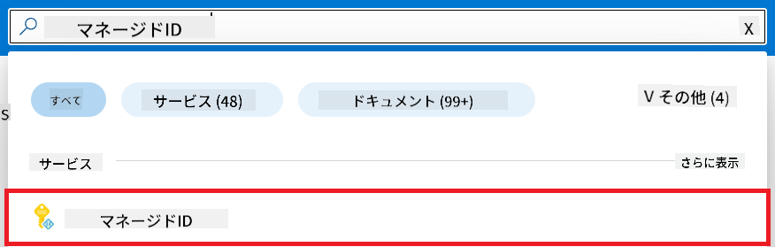

1. **+ Create**を選択します。

    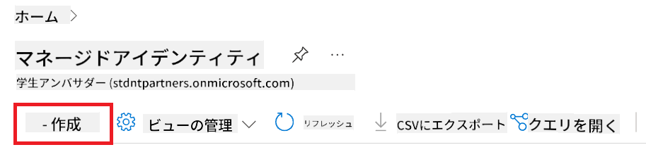

1. 以下のタスクを実行します：

    - Azure **Subscription**を選択。
    - 使用する**Resource group**を選択（必要に応じて新規作成）。
    - 使用する**Region**を選択。
    - **Name**を入力（一意の値である必要があります）。

    

1. **Review + create**を選択します。

1. **+ Create**を選択します。

#### Managed IdentityにContributorロール割り当てを追加

1. 作成したManaged Identityリソースに移動します。

1. 左側のタブから**Azure role assignments**を選択します。

1. ナビゲーションメニューから**+Add role assignment**を選択します。

1. Add role assignmentページ内で以下のタスクを実行します：
    - **Scope**を**Resource group**に設定。
    - Azure **Subscription**を選択。
    - 使用する**Resource group**を選択。
    - **Role**を**Contributor**に設定。

    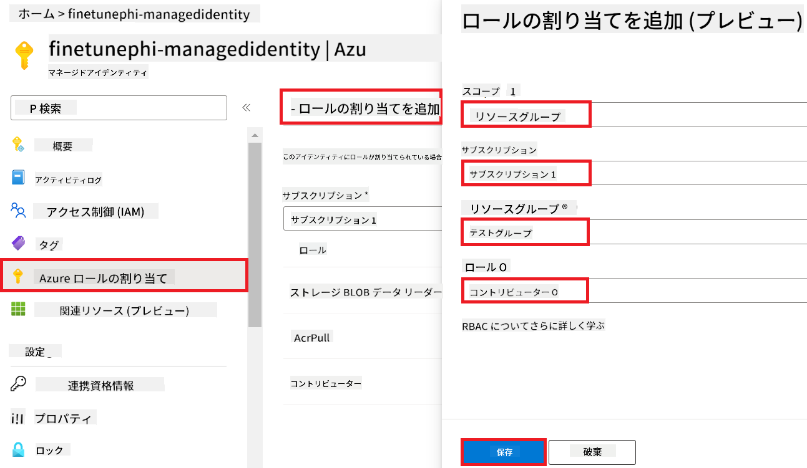

2. **Save**を選択します。

#### Managed IdentityにStorage Blob Data Readerロール割り当てを追加

1. ポータルページ上部の**検索バー**に「*storage accounts*」と入力し、表示されたオプションから**Storage accounts**を選択します。

    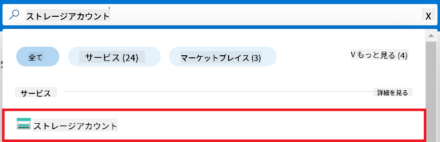

1. 作成したAzure Machine Learning Workspaceに関連付けられたストレージアカウントを選択します。例えば、*finetunephistorage*。

1. Add role assignmentページに移動するため、以下のタスクを実行します：

    - 作成したAzureストレージアカウントに移動。
    - 左側のタブから**Access Control (IAM)**を選択。
    - ナビゲーションメニューから**+ Add**を選択。
    - ナビゲーションメニューから**Add role assignment**を選択。

    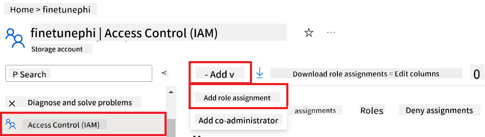

1. Add role assignmentページ内で以下のタスクを実行します：

    - Roleページ内で**Storage Blob Data Reader**を検索バーに入力し、表示されたオプションから**Storage Blob Data Reader**を選択。
    - Roleページ内で**Next**を選択。
    - Membersページ内で**Assign access to**を**Managed identity**に設定。
    - Membersページ内で**+ Select members**を選択。
    - Select managed identitiesページ内でAzure **Subscription**を選択。
    - Select managed identitiesページ内で**Managed identity**を**Manage Identity**に設定。
    - Select managed identitiesページ内で作成したManaged Identityを選択。例えば、*finetunephi-managedidentity*。
    - Select managed identitiesページ内で**Select**を選択。

    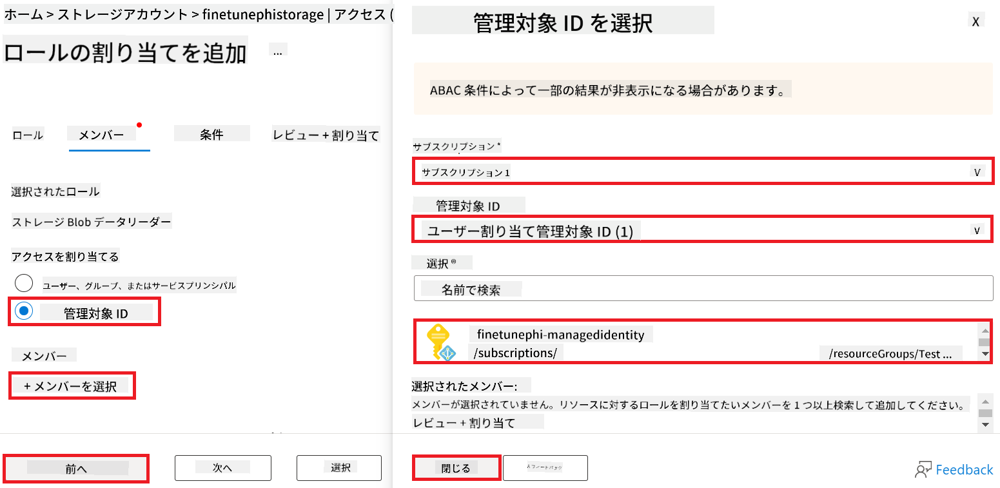

1. **Review + assign**を選択します。

#### Managed IdentityにAcrPullロール割り当てを追加

1. ポータルページ上部の**検索バー**に「*container registries*」と入力し、表示されたオプションから**Container registries**を選択します。

    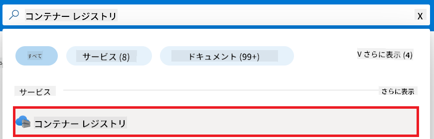

1. 作成したAzure Machine Learning Workspaceに関連付けられたコンテナレジストリを選択します。例えば、*finetunephicontainerregistry*

1. Add role assignmentページに移動するため、以下のタスクを実行します：

    - 左側のタブから**Access Control (IAM)**を選択。
    - ナビゲーションメニューから**+ Add**を選択。
    - ナビゲーションメニューから**Add role assignment**を選択。

1. Add role assignmentページ内で以下のタスクを実行します：

    - Roleページ内で**AcrPull**を検索バーに入力し、表示されたオプションから**AcrPull**を選択。
    - Roleページ内で**Next**を選択。
    - Membersページ内で**Assign access to**を**Managed identity**に設定。
    - Membersページ内で**+ Select members**を選択。
    - Select managed identitiesページ内でAzure **Subscription**を選択。
    - Select managed identitiesページ内で**Managed identity**を**Manage Identity**に設定。
    - Select managed identitiesページ内で作成したManaged Identityを選択。例えば、*finetunephi-managedidentity*。
    - Select managed identitiesページ内で**Select**を選択。
    - **Review + assign**を選択。

### プロジェクトをセットアップ

微調整に必要なデータセットをダウンロードするため、ローカル環境をセットアップします。

この演習では以下を行います：

- 作業フォルダーを作成。
- 仮想環境を作成。
- 必要なパッケージをインストール。
- データセットをダウンロードする*download_dataset.py*ファイルを作成。

#### 作業フォルダーを作成

1. ターミナルウィンドウを開き、以下のコマンドを入力して、デフォルトのパスに*finetune-phi*という名前のフォルダーを作成します。

    ```console
    mkdir finetune-phi
    ```

2. 作成した*finetune-phi*フォルダーに移動するため、以下のコマンドをターミナルで入力します。

    ```console
    cd finetune-phi
    ```

#### 仮想環境を作成

1. 以下のコマンドをターミナルで入力して*.venv*という名前の仮想環境を作成します。

    ```console
    python -m venv .venv
    ```

2. 仮想環境を有効化するため、以下のコマンドをターミナルで入力します。

    ```console
    .venv\Scripts\activate.bat
    ```

> [!NOTE]
> 仮想環境が有効化されている場合、コマンドプロンプトの前に*（.venv）*が表示されます。

#### 必要なパッケージをインストール

1. 以下のコマンドをターミナルで入力して、必要なパッケージをインストールします。

    ```console
    pip install datasets==2.19.1
    ```

#### `download_dataset.py`を作成

> [!NOTE]
> 完全なフォルダー構造：
>
> ```text
> └── YourUserName
> .    └── finetune-phi
> .        └── download_dataset.py
> ```

1. **Visual Studio Code**を開きます。

1. メニューバーから**File**を選択します。

1. **Open Folder**を選択します。

1. 作成した*finetune-phi*フォルダーを選択します（例：*C:\Users\yourUserName\finetune-phi*）。

    

1. Visual Studio Codeの左ペインで右クリックし、**New File**を選択して*download_dataset.py*という名前の新しいファイルを作成します。

    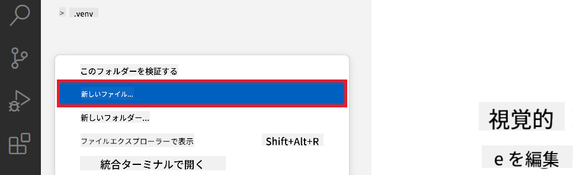

### 微調整用データセットの準備

この演習では、*download_dataset.py*ファイルを実行して*ultrachat_200k*データセットをローカル環境にダウンロードします。このデータセットを使用して、Azure Machine LearningでPhi-3モデルを微調整します。

この演習では以下を行います：

- *download_dataset.py*ファイルにデータセットをダウンロードするコードを追加。
- *download_dataset.py*ファイルを実行してローカル環境にデータセットをダウンロード。

#### *download_dataset.py*を使用してデータセットをダウンロード

1. Visual Studio Codeで*download_dataset.py*ファイルを開きます。

1. *download_dataset.py*ファイルに以下のコードを追加します。

    ```python
    import json
    import os
    from datasets import load_dataset

    def load_and_split_dataset(dataset_name, config_name, split_ratio):
        """
        Load and split a dataset.
        """
        # Load the dataset with the specified name, configuration, and split ratio
        dataset = load_dataset(dataset_name, config_name, split=split_ratio)
        print(f"Original dataset size: {len(dataset)}")
        
        # Split the dataset into train and test sets (80% train, 20% test)
        split_dataset = dataset.train_test_split(test_size=0.2)
        print(f"Train dataset size: {len(split_dataset['train'])}")
        print(f"Test dataset size: {len(split_dataset['test'])}")
        
        return split_dataset

    def save_dataset_to_jsonl(dataset, filepath):
        """
        Save a dataset to a JSONL file.
        """
        # Create the directory if it does not exist
        os.makedirs(os.path.dirname(filepath), exist_ok=True)
        
        # Open the file in write mode
        with open(filepath, 'w', encoding='utf-8') as f:
            # Iterate over each record in the dataset
            for record in dataset:
                # Dump the record as a JSON object and write it to the file
                json.dump(record, f)
                # Write a newline character to separate records
                f.write('\n')
        
        print(f"Dataset saved to {filepath}")

    def main():
        """
        Main function to load, split, and save the dataset.
        """
        # Load and split the ULTRACHAT_200k dataset with a specific configuration and split ratio
        dataset = load_and_split_dataset("HuggingFaceH4/ultrachat_200k", 'default', 'train_sft[:1%]')
        
        # Extract the train and test datasets from the split
        train_dataset = dataset['train']
        test_dataset = dataset['test']

        # Save the train dataset to a JSONL file
        save_dataset_to_jsonl(train_dataset, "data/train_data.jsonl")
        
        # Save the test dataset to a separate JSONL file
        save_dataset_to_jsonl(test_dataset, "data/test_data.jsonl")

    if __name__ == "__main__":
        main()

    ```

1. ターミナルで以下のコマンドを入力してスクリプトを実行し、データセットをローカル環境にダウンロードします。

    ```console
    python download_dataset.py
    ```

1. データセットがローカルの*finetune-phi/data*ディレクトリに正常に保存されていることを確認します。

> [!NOTE]
>
> #### データセットサイズと微調整時間に関する注意
>
> このチュートリアルでは、データセットの1％のみ（`split='train[:1%]'`）を使用します。これにより、データ量が
1. [Azure ML Studio](https://ml.azure.com/home?wt.mc_id=studentamb_279723) にアクセスします。

1. 左側のタブから **Compute** を選択します。

1. ナビゲーションメニューから **Compute clusters** を選択します。

1. **+ New** を選択します。

    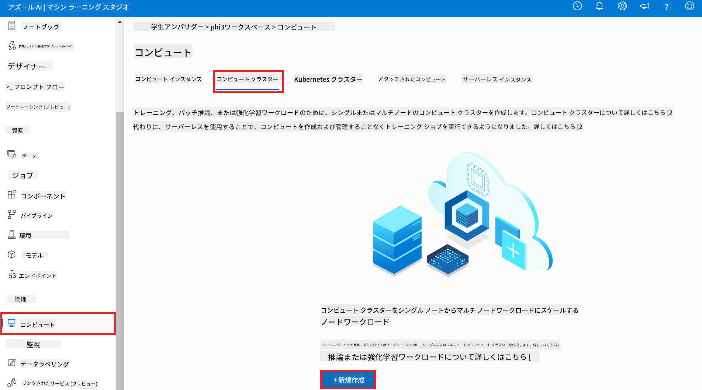

1. 以下のタスクを実行します：

    - 使用する **Region** を選択します。
    - **Virtual machine tier** を **Dedicated** に設定します。
    - **Virtual machine type** を **GPU** に設定します。
    - **Virtual machine size** のフィルターを **Select from all options** に設定します。
    - **Virtual machine size** を **Standard_NC24ads_A100_v4** に設定します。

    

1. **Next** を選択します。

1. 以下のタスクを実行します：

    - **Compute name** を入力します。これは一意の値である必要があります。
    - **Minimum number of nodes** を **0** に設定します。
    - **Maximum number of nodes** を **1** に設定します。
    - **Idle seconds before scale down** を **120** に設定します。

    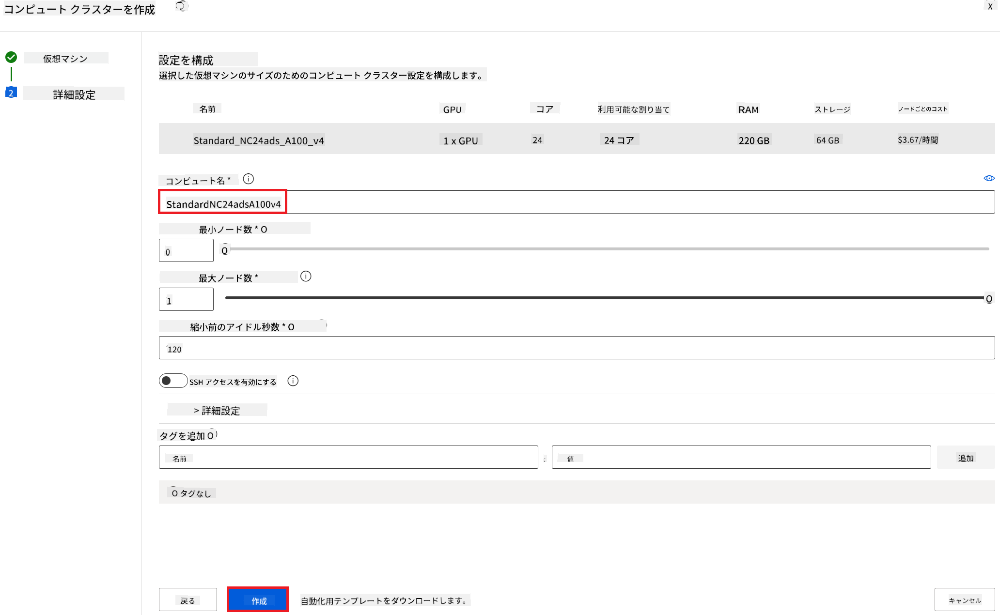

1. **Create** を選択します。

#### Phi-3 モデルのファインチューニング

1. [Azure ML Studio](https://ml.azure.com/home?wt.mc_id=studentamb_279723) にアクセスします。

1. 作成した Azure Machine Learning ワークスペースを選択します。

    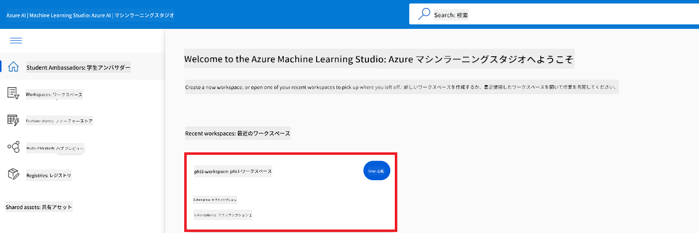

1. 以下のタスクを実行します：

    - 左側のタブから **Model catalog** を選択します。
    - **検索バー**に *phi-3-mini-4k* と入力し、表示されるオプションから **Phi-3-mini-4k-instruct** を選択します。

    

1. ナビゲーションメニューから **Fine-tune** を選択します。

    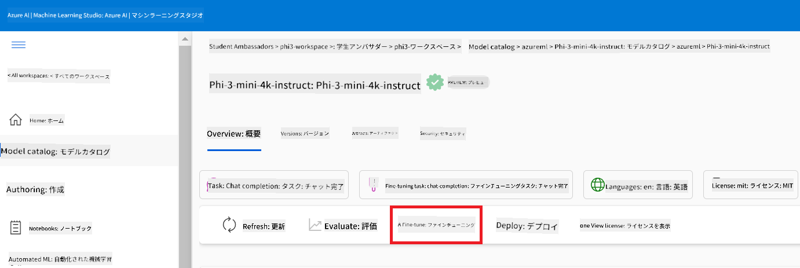

1. 以下のタスクを実行します：

    - **Select task type** を **Chat completion** に設定します。
    - **+ Select data** を選択して **Training data** をアップロードします。
    - Validation data のアップロードタイプを **Provide different validation data** に設定します。
    - **+ Select data** を選択して **Validation data** をアップロードします。

    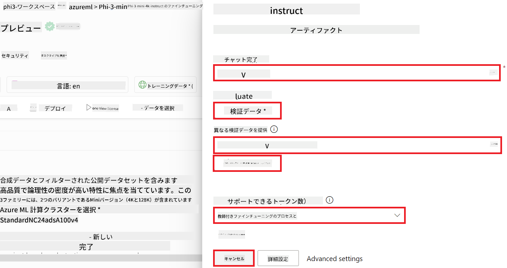

    > [!TIP]
    >
    > **Advanced settings** を選択すると、**learning_rate** や **lr_scheduler_type** などの設定をカスタマイズして、ファインチューニングプロセスを最適化することができます。

1. **Finish** を選択します。

1. この演習では、Azure Machine Learning を使用して Phi-3 モデルのファインチューニングに成功しました。ファインチューニングプロセスはかなりの時間がかかる場合があります。ジョブを実行した後は、完了するまで待つ必要があります。Azure Machine Learning ワークスペースの左側の **Jobs** タブに移動して、ファインチューニングジョブのステータスを確認できます。次のシリーズでは、ファインチューニング済みモデルをデプロイし、Prompt flow と統合します。

    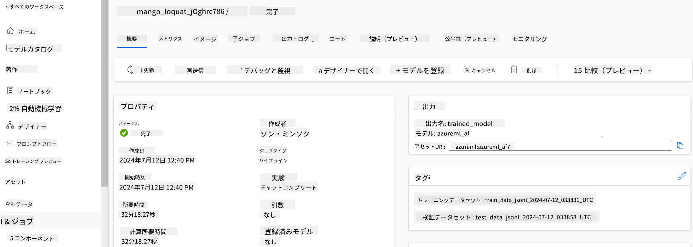

### ファインチューニング済み Phi-3 モデルのデプロイ

ファインチューニング済み Phi-3 モデルを Prompt flow と統合するには、モデルをデプロイしてリアルタイム推論にアクセスできるようにする必要があります。このプロセスには、モデルの登録、オンラインエンドポイントの作成、モデルのデプロイが含まれます。

この演習では以下を行います：

- Azure Machine Learning ワークスペースにファインチューニング済みモデルを登録する
- オンラインエンドポイントを作成する
- 登録したファインチューニング済み Phi-3 モデルをデプロイする

#### ファインチューニング済みモデルの登録

1. [Azure ML Studio](https://ml.azure.com/home?wt.mc_id=studentamb_279723) にアクセスします。

1. 作成した Azure Machine Learning ワークスペースを選択します。

    

1. 左側のタブから **Models** を選択します。
1. **+ Register** を選択します。
1. **From a job output** を選択します。

    

1. 作成したジョブを選択します。

    

1. **Next** を選択します。

1. **Model type** を **MLflow** に設定します。

1. **Job output** が選択されていることを確認します。これは自動的に選択されるはずです。

    

2. **Next** を選択します。

3. **Register** を選択します。

    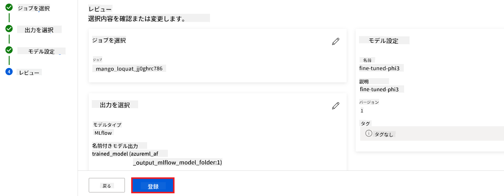

4. 左側のタブから **Models** メニューに移動すると、登録済みモデルを確認できます。

    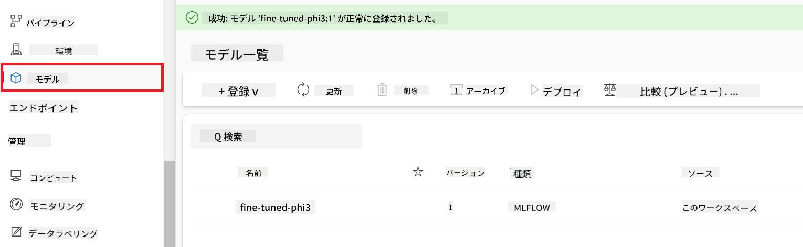

#### ファインチューニング済みモデルのデプロイ

1. 作成した Azure Machine Learning ワークスペースに移動します。

1. 左側のタブから **Endpoints** を選択します。

1. ナビゲーションメニューから **Real-time endpoints** を選択します。

    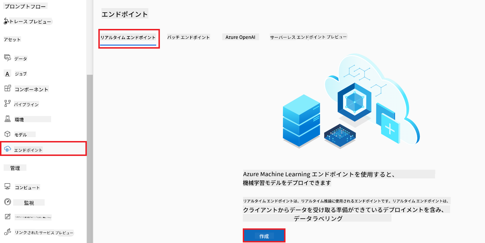

1. **Create** を選択します。

1. 作成した登録済みモデルを選択します。

    

1. **Select** を選択します。

1. 以下のタスクを実行します：

    - **Virtual machine** を *Standard_NC6s_v3* に設定します。
    - 使用する **Instance count** を選択します（例：*1*）。
    - **Endpoint** を **New** に設定してエンドポイントを作成します。
    - **Endpoint name** を入力します。一意の値である必要があります。
    - **Deployment name** を入力します。一意の値である必要があります。

    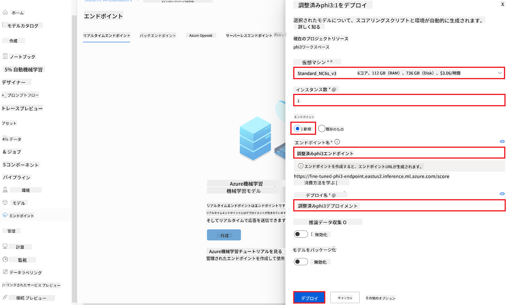

1. **Deploy** を選択します。

> [!WARNING]
> アカウントに追加料金が発生しないようにするために、Azure Machine Learning ワークスペースで作成したエンドポイントを削除してください。
>

#### Azure Machine Learning ワークスペースでデプロイ状況を確認

1. 作成した Azure Machine Learning ワークスペースに移動します。

1. 左側のタブから **Endpoints** を選択します。

1. 作成したエンドポイントを選択します。

    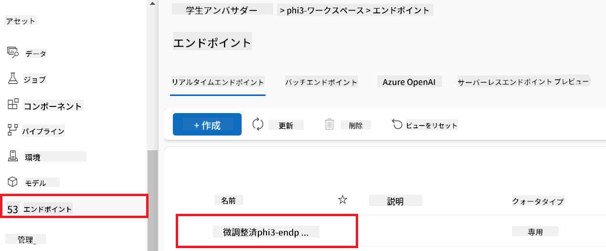

1. このページでは、デプロイプロセス中にエンドポイントを管理できます。

> [!NOTE]
> デプロイが完了したら、**Live traffic** が **100%** に設定されていることを確認してください。設定されていない場合は、**Update traffic** を選択してトラフィック設定を調整してください。トラフィックが 0% に設定されている場合、モデルをテストすることはできません。
>
> 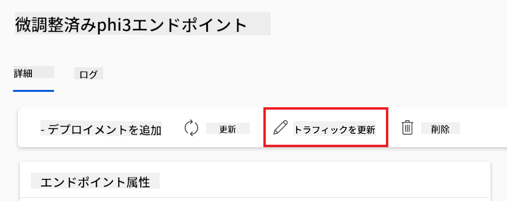
>

## シナリオ 3: Prompt flow を統合し、Azure AI Foundry でカスタムモデルとチャットする

### Prompt flow を使ってカスタム Phi-3 モデルを統合する

ファインチューニング済みモデルを正常にデプロイした後は、Prompt Flow と統合してリアルタイムアプリケーションでモデルを使用できるようにします。これにより、カスタム Phi-3 モデルを使用したさまざまな対話型タスクが可能になります。

この演習では以下を行います：

- Azure AI Foundry Hub を作成する
- Azure AI Foundry Project を作成する
- Prompt flow を作成する
- ファインチューニング済み Phi-3 モデルのカスタム接続を追加する
- Prompt flow を設定してカスタム Phi-3 モデルとチャットする

> [!NOTE]
> Promptflow は Azure ML Studio を使用して統合することもできます。同じ統合プロセスを Azure ML Studio に適用できます。

#### Azure AI Foundry Hub を作成する

Project を作成する前に Hub を作成する必要があります。Hub はリソースグループのように機能し、Azure AI Foundry 内で複数の Project を整理および管理できます。

1. [Azure AI Foundry](https://ai.azure.com/?WT.mc_id=aiml-137032-kinfeylo) にアクセスします。

1. 左側のタブから **All hubs** を選択します。

1. ナビゲーションメニューから **+ New hub** を選択します。

    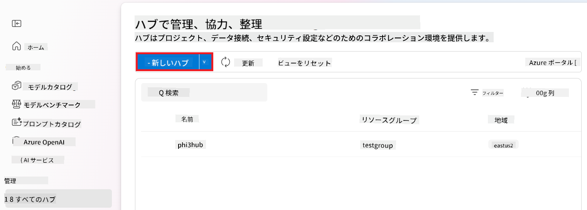

1. 以下のタスクを実行します：

    - **Hub name** を入力します。一意の値である必要があります。
    - Azure **Subscription** を選択します。
    - 使用する **Resource group** を選択します（必要に応じて新しいものを作成します）。
    - 使用する **Location** を選択します。
    - 使用する **Connect Azure AI Services** を選択します（必要に応じて新しいものを作成します）。
    - **Connect Azure AI Search** を **Skip connecting** に設定します。

    

1. **Next** を選択します。

#### Azure AI Foundry Project を作成する

1. 作成した Hub で、左側のタブから **All projects** を選択します。

1. ナビゲーションメニューから **+ New project** を選択します。

    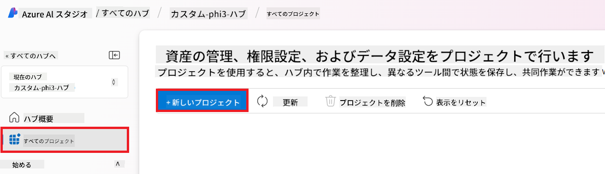

1. **Project name** を入力します。一意の値である必要があります。

    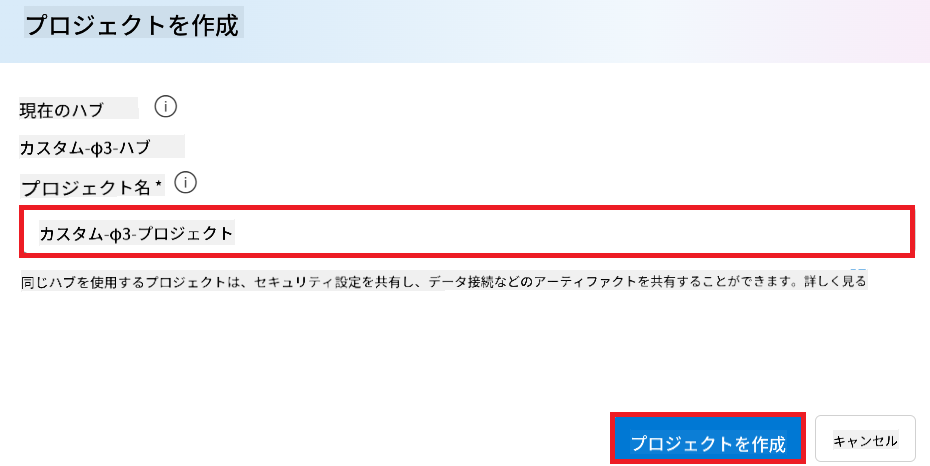

1. **Create a project** を選択します。

#### ファインチューニング済み Phi-3 モデルのカスタム接続を追加する

カスタム Phi-3 モデルを Prompt flow と統合するには、モデルのエンドポイントとキーをカスタム接続に保存する必要があります。この設定により、Prompt flow 内でカスタム Phi-3 モデルにアクセスできるようになります。

#### ファインチューニング済み Phi-3 モデルの API キーとエンドポイント URI を設定する

1. [Azure ML Studio](https://ml.azure.com/home?WT.mc_id=aiml-137032-kinfeylo) にアクセスします。

1. 作成した Azure Machine Learning ワークスペースに移動します。

1. 左側のタブから **Endpoints** を選択します。

    

1. 作成したエンドポイントを選択します。

    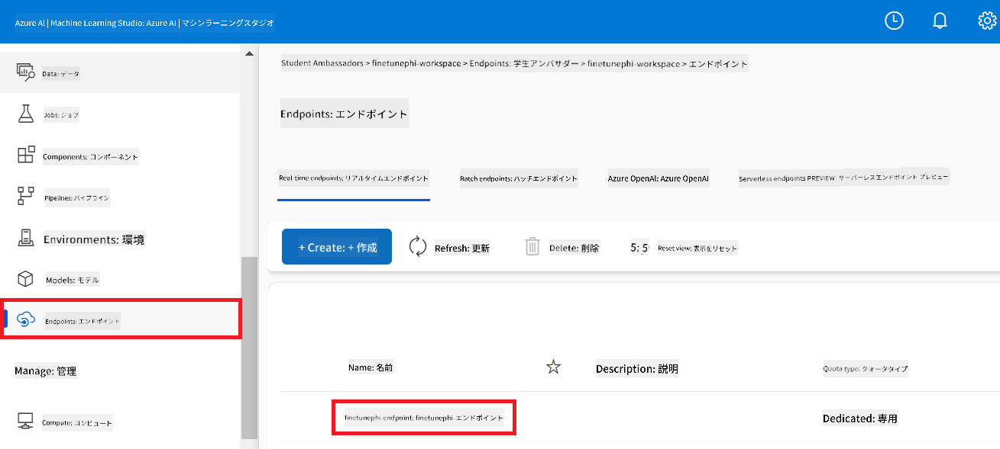

1. ナビゲーションメニューから **Consume** を選択します。

1. **REST endpoint** と **Primary key** をコピーします。
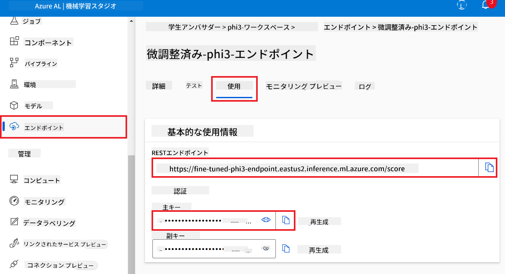

#### カスタム接続を追加する

1. [Azure AI Foundry](https://ai.azure.com/?WT.mc_id=aiml-137032-kinfeylo)にアクセスします。

1. 作成したAzure AI Foundryプロジェクトに移動します。

1. 作成したプロジェクト内で、左側のタブから**設定**を選択します。

1. **+ 新しい接続**を選択します。

    

1. ナビゲーションメニューから**カスタムキー**を選択します。

    

1. 以下のタスクを実行します：

    - **+ キーと値のペアを追加**を選択します。
    - キー名には**endpoint**を入力し、Azure ML Studioからコピーしたエンドポイントを値フィールドに貼り付けます。
    - 再度**+ キーと値のペアを追加**を選択します。
    - キー名には**key**を入力し、Azure ML Studioからコピーしたキーを値フィールドに貼り付けます。
    - キーを追加した後、**is secret**を選択してキーが公開されないようにします。

    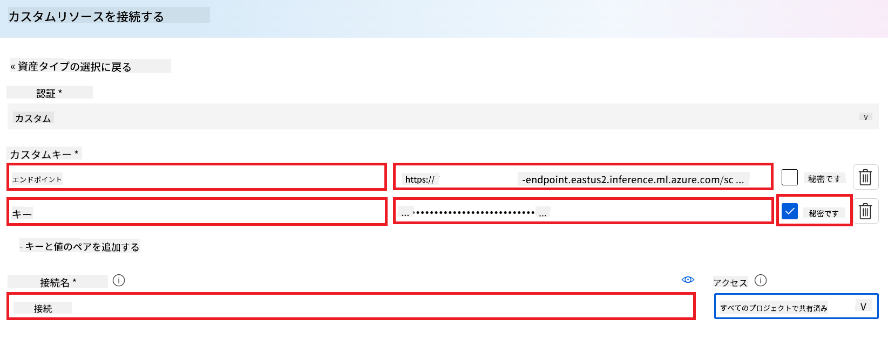

1. **接続を追加**を選択します。

#### プロンプトフローを作成する

Azure AI Foundryにカスタム接続を追加しました。次に、以下の手順を使用してプロンプトフローを作成します。その後、このプロンプトフローをカスタム接続に接続し、プロンプトフロー内で微調整されたモデルを使用できるようにします。

1. 作成したAzure AI Foundryプロジェクトに移動します。

1. 左側のタブから**プロンプトフロー**を選択します。

1. ナビゲーションメニューから**+ 作成**を選択します。

    

1. ナビゲーションメニューから**チャットフロー**を選択します。

    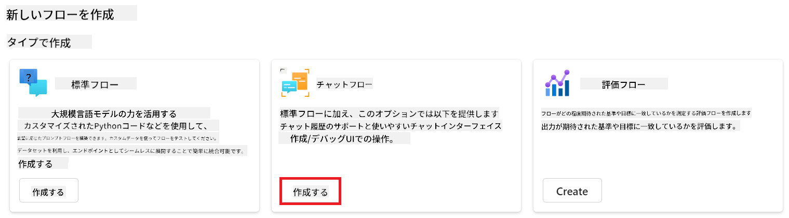

1. 使用する**フォルダ名**を入力します。

    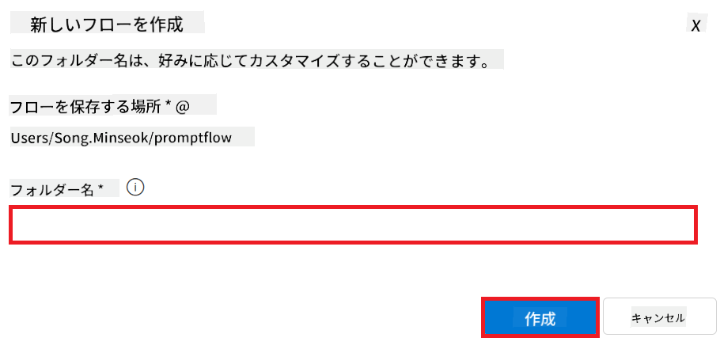

2. **作成**を選択します。

#### カスタムPhi-3モデルとチャットできるプロンプトフローのセットアップ

微調整されたPhi-3モデルをプロンプトフローに統合する必要があります。ただし、既存のプロンプトフローはこの目的に適していません。そのため、カスタムモデルの統合を可能にするようにプロンプトフローを再設計する必要があります。

1. プロンプトフロー内で以下のタスクを実行して既存のフローを再構築します：

    - **Raw file mode**を選択します。
    - *flow.dag.yml*ファイル内の既存のコードをすべて削除します。
    - 以下のコードを*flow.dag.yml*ファイルに追加します。

        ```yml
        inputs:
          input_data:
            type: string
            default: "Who founded Microsoft?"

        outputs:
          answer:
            type: string
            reference: ${integrate_with_promptflow.output}

        nodes:
        - name: integrate_with_promptflow
          type: python
          source:
            type: code
            path: integrate_with_promptflow.py
          inputs:
            input_data: ${inputs.input_data}
        ```

    - **保存**を選択します。

    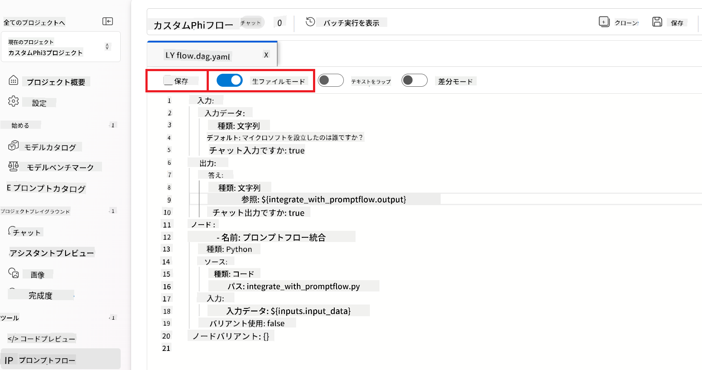

1. カスタムPhi-3モデルをプロンプトフローで使用するために、以下のコードを*integrate_with_promptflow.py*ファイルに追加します。

    ```python
    import logging
    import requests
    from promptflow import tool
    from promptflow.connections import CustomConnection

    # Logging setup
    logging.basicConfig(
        format="%(asctime)s - %(levelname)s - %(name)s - %(message)s",
        datefmt="%Y-%m-%d %H:%M:%S",
        level=logging.DEBUG
    )
    logger = logging.getLogger(__name__)

    def query_phi3_model(input_data: str, connection: CustomConnection) -> str:
        """
        Send a request to the Phi-3 model endpoint with the given input data using Custom Connection.
        """

        # "connection" is the name of the Custom Connection, "endpoint", "key" are the keys in the Custom Connection
        endpoint_url = connection.endpoint
        api_key = connection.key

        headers = {
            "Content-Type": "application/json",
            "Authorization": f"Bearer {api_key}"
        }
        data = {
            "input_data": {
                "input_string": [
                    {"role": "user", "content": input_data}
                ],
                "parameters": {
                    "temperature": 0.7,
                    "max_new_tokens": 128
                }
            }
        }
        try:
            response = requests.post(endpoint_url, json=data, headers=headers)
            response.raise_for_status()
            
            # Log the full JSON response
            logger.debug(f"Full JSON response: {response.json()}")

            result = response.json()["output"]
            logger.info("Successfully received response from Azure ML Endpoint.")
            return result
        except requests.exceptions.RequestException as e:
            logger.error(f"Error querying Azure ML Endpoint: {e}")
            raise

    @tool
    def my_python_tool(input_data: str, connection: CustomConnection) -> str:
        """
        Tool function to process input data and query the Phi-3 model.
        """
        return query_phi3_model(input_data, connection)

    ```

    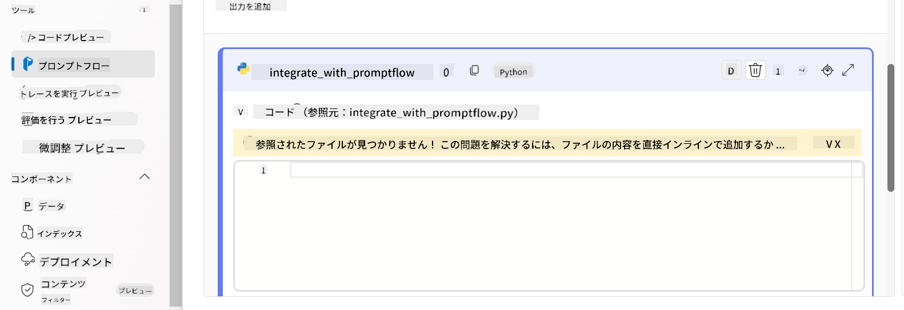

> [!NOTE]
> Azure AI Foundryでプロンプトフローを使用する詳細情報については、[Prompt flow in Azure AI Foundry](https://learn.microsoft.com/azure/ai-studio/how-to/prompt-flow)を参照してください。

1. **チャット入力**、**チャット出力**を選択してモデルとのチャットを有効にします。

    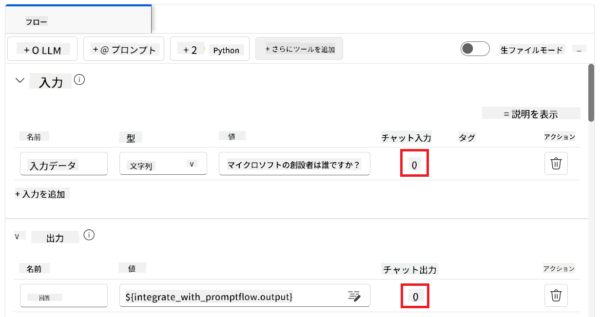

1. これでカスタムPhi-3モデルとのチャットの準備が整いました。次の演習では、プロンプトフローを開始し、微調整されたPhi-3モデルとチャットする方法を学びます。

> [!NOTE]
>
> 再構築されたフローは以下の画像のようになります：
>
> 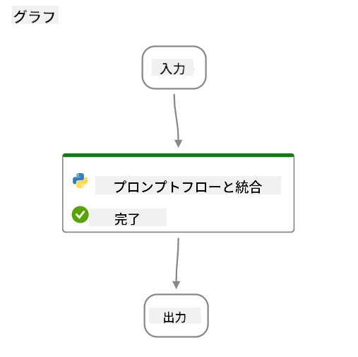
>

### カスタムPhi-3モデルとチャットする

微調整されたカスタムPhi-3モデルをプロンプトフローに統合したので、モデルとの対話を開始する準備が整いました。この演習では、プロンプトフローを設定し、モデルとのチャットを開始する手順を案内します。これらのステップを実行することで、微調整されたPhi-3モデルの能力を最大限に活用し、さまざまなタスクや会話を行うことができます。

- プロンプトフローを使用してカスタムPhi-3モデルとチャットします。

#### プロンプトフローを開始する

1. **計算セッションを開始**を選択してプロンプトフローを開始します。

    

1. **入力を検証して解析**を選択してパラメーターを更新します。

    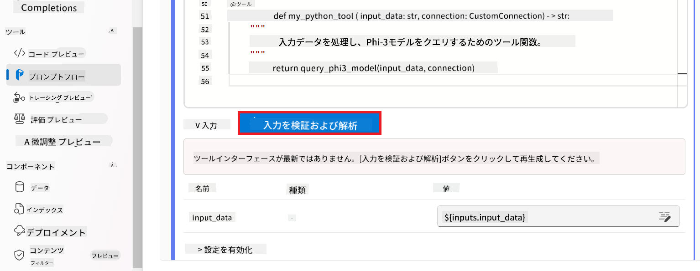

1. 作成したカスタム接続の**接続**の**値**を選択します。例：*connection*。

    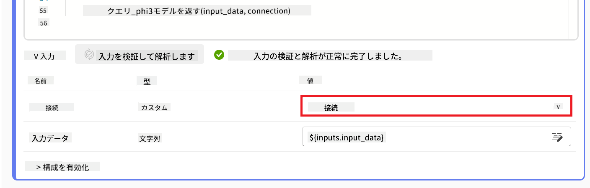

#### カスタムモデルとチャットする

1. **チャット**を選択します。

    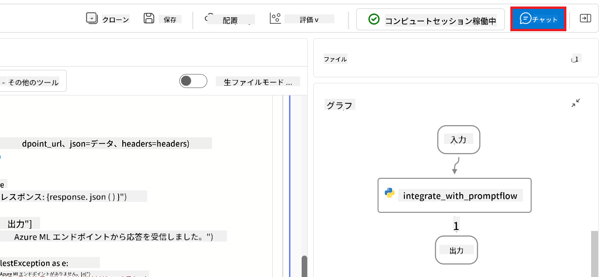

1. 以下は結果の例です：これでカスタムPhi-3モデルとチャットできます。微調整に使用したデータに基づいた質問をすることをお勧めします。

    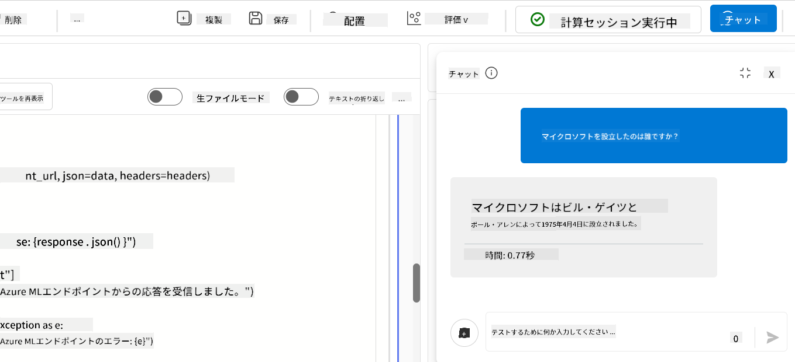

**免責事項**:  
この文書はAI翻訳サービス[Co-op Translator](https://github.com/Azure/co-op-translator)を使用して翻訳されています。正確性を追求していますが、自動翻訳には誤りや不正確さが含まれる可能性があることをご承知おきください。元の言語で作成された原文を信頼できる情報源としてください。重要な情報については、専門の人間による翻訳を推奨します。この翻訳の利用に起因する誤解や誤解釈について、当方は一切責任を負いません。