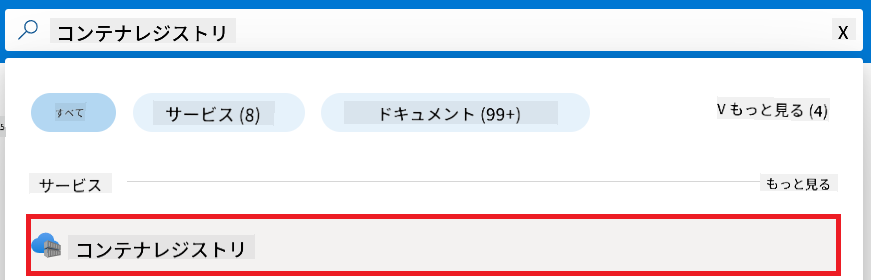
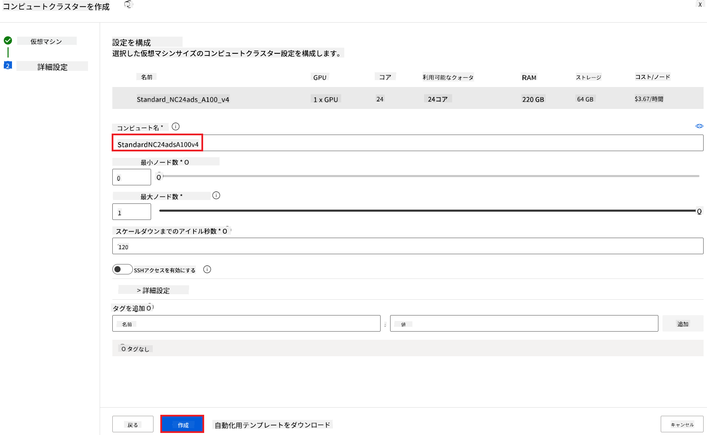
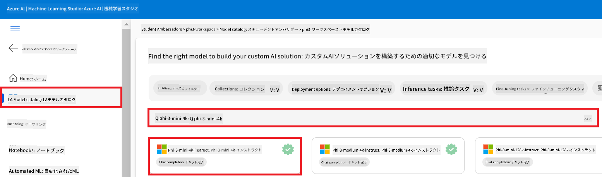
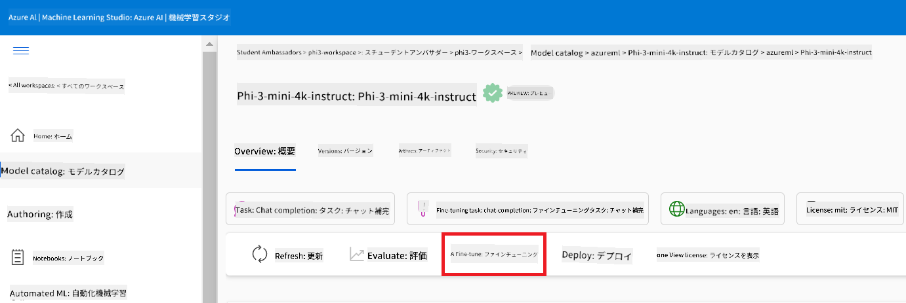
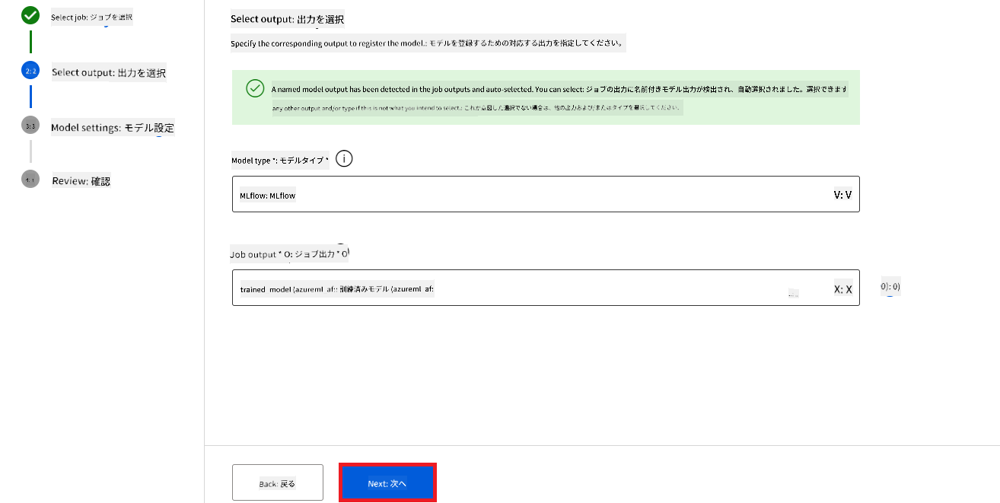
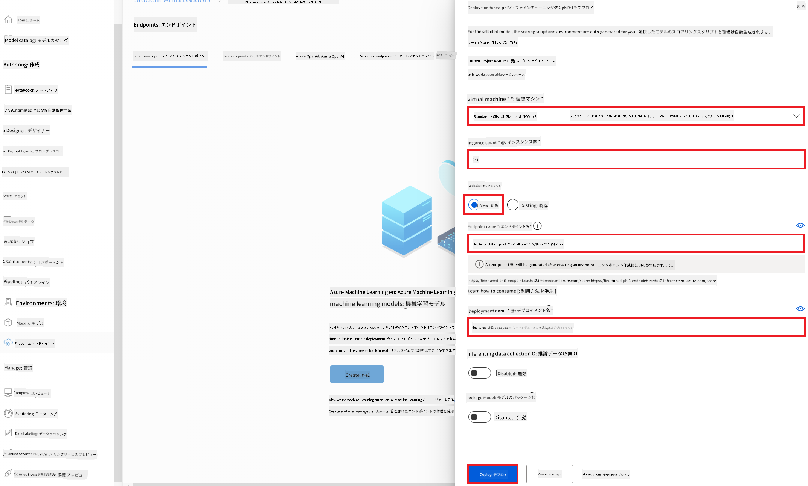
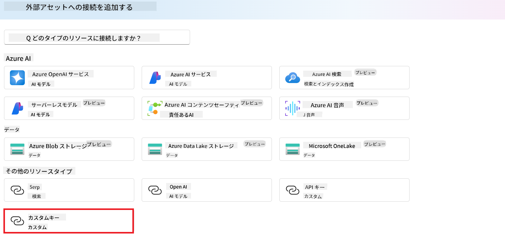
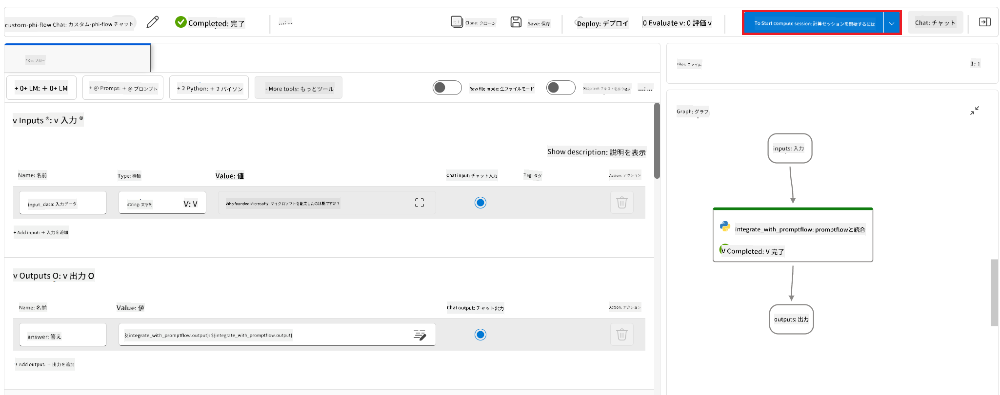
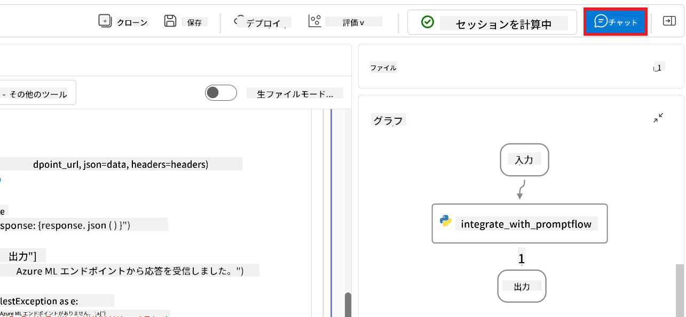
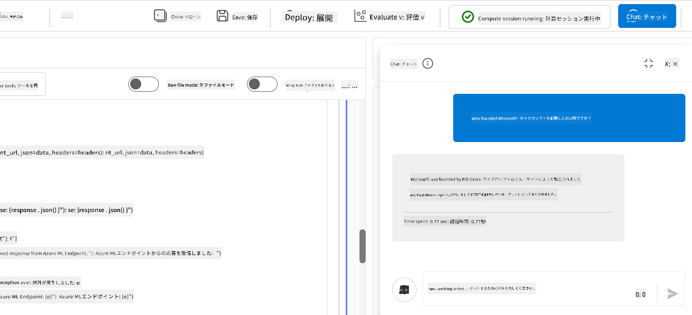

<!--
CO_OP_TRANSLATOR_METADATA:
{
  "original_hash": "ecbd9179a21edbaafaf114d47f09f3e3",
  "translation_date": "2025-07-17T01:11:11+00:00",
  "source_file": "md/02.Application/01.TextAndChat/Phi3/E2E_Phi-3-FineTuning_PromptFlow_Integration_AIFoundry.md",
  "language_code": "ja"
}
-->
# Azure AI FoundryのPrompt flowでカスタムPhi-3モデルをファインチューニングして統合する

このエンドツーエンド（E2E）サンプルは、Microsoft Tech Communityのガイド「[Fine-Tune and Integrate Custom Phi-3 Models with Prompt Flow in Azure AI Foundry](https://techcommunity.microsoft.com/t5/educator-developer-blog/fine-tune-and-integrate-custom-phi-3-models-with-prompt-flow-in/ba-p/4191726?WT.mc_id=aiml-137032-kinfeylo)」に基づいています。Azure AI FoundryのPrompt flowでカスタムPhi-3モデルをファインチューニング、デプロイ、統合する手順を紹介します。  
ローカルでコードを実行するE2Eサンプル「[Fine-Tune and Integrate Custom Phi-3 Models with Prompt Flow](./E2E_Phi-3-FineTuning_PromptFlow_Integration.md)」とは異なり、本チュートリアルはAzure AI / ML Studio内でのファインチューニングと統合に完全にフォーカスしています。

## 概要

このE2Eサンプルでは、Phi-3モデルのファインチューニングとAzure AI FoundryのPrompt flowとの統合方法を学びます。Azure AI / ML Studioを活用して、カスタムAIモデルのデプロイと利用のワークフローを構築します。サンプルは以下の3つのシナリオに分かれています。

**シナリオ1：Azureリソースのセットアップとファインチューニング準備**

**シナリオ2：Phi-3モデルのファインチューニングとAzure Machine Learning Studioでのデプロイ**

**シナリオ3：Prompt flowとの統合とAzure AI Foundryでのカスタムモデルとのチャット**

以下はこのE2Eサンプルの全体像です。


### 目次

1. **[シナリオ1：Azureリソースのセットアップとファインチューニング準備](../../../../../../md/02.Application/01.TextAndChat/Phi3)**
    - [Azure Machine Learning ワークスペースの作成](../../../../../../md/02.Application/01.TextAndChat/Phi3)
    - [AzureサブスクリプションでGPUクォータのリクエスト](../../../../../../md/02.Application/01.TextAndChat/Phi3)
    - [ロール割り当ての追加](../../../../../../md/02.Application/01.TextAndChat/Phi3)
    - [プロジェクトのセットアップ](../../../../../../md/02.Application/01.TextAndChat/Phi3)
    - [ファインチューニング用データセットの準備](../../../../../../md/02.Application/01.TextAndChat/Phi3)

1. **[シナリオ2：Phi-3モデルのファインチューニングとAzure Machine Learning Studioでのデプロイ](../../../../../../md/02.Application/01.TextAndChat/Phi3)**
    - [Phi-3モデルのファインチューニング](../../../../../../md/02.Application/01.TextAndChat/Phi3)
    - [ファインチューニング済みPhi-3モデルのデプロイ](../../../../../../md/02.Application/01.TextAndChat/Phi3)

1. **[シナリオ3：Prompt flowとの統合とAzure AI Foundryでのカスタムモデルとのチャット](../../../../../../md/02.Application/01.TextAndChat/Phi3)**
    - [カスタムPhi-3モデルのPrompt flowへの統合](../../../../../../md/02.Application/01.TextAndChat/Phi3)
    - [カスタムPhi-3モデルとのチャット](../../../../../../md/02.Application/01.TextAndChat/Phi3)

## シナリオ1：Azureリソースのセットアップとファインチューニング準備

### Azure Machine Learning ワークスペースの作成

1. ポータルページ上部の**検索バー**に「azure machine learning」と入力し、表示されたオプションから**Azure Machine Learning**を選択します。

    

2. ナビゲーションメニューから **+ 作成** を選択します。

3. ナビゲーションメニューから**新しいワークスペース**を選択します。

    

4. 以下の項目を設定します：

    - Azureの**サブスクリプション**を選択。
    - 使用する**リソースグループ**を選択（必要に応じて新規作成）。
    - **ワークスペース名**を入力。ユニークな名前である必要があります。
    - 使用する**リージョン**を選択。
    - 使用する**ストレージアカウント**を選択（必要に応じて新規作成）。
    - 使用する**キーコンテナー**を選択（必要に応じて新規作成）。
    - 使用する**Application Insights**を選択（必要に応じて新規作成）。
    - 使用する**コンテナレジストリ**を選択（必要に応じて新規作成）。

    

5. **確認および作成**を選択。

6. **作成**を選択。

### AzureサブスクリプションでGPUクォータのリクエスト

このチュートリアルでは、GPUを使ってPhi-3モデルのファインチューニングとデプロイを行います。ファインチューニングには*Standard_NC24ads_A100_v4* GPUを使用し、クォータリクエストが必要です。デプロイには*Standard_NC6s_v3* GPUを使用し、こちらもクォータリクエストが必要です。

> [!NOTE]
>
> GPU割り当てはPay-As-You-Goサブスクリプション（標準サブスクリプションタイプ）のみ対象であり、特典サブスクリプションは現在サポートされていません。
>

1. [Azure ML Studio](https://ml.azure.com/home?wt.mc_id=studentamb_279723)にアクセスします。

1. *Standard NCADSA100v4 Family*クォータをリクエストするには、以下を実施します：

    - 左側のタブから**Quota**を選択。
    - 使用する**仮想マシンファミリー**を選択。例として*Standard NCADSA100v4 Family Cluster Dedicated vCPUs*（*Standard_NC24ads_A100_v4* GPUを含む）を選択。
    - ナビゲーションメニューから**Request quota**を選択。

        

    - Request quotaページで、使用したい**新しいコア数の上限**を入力。例：24。
    - **Submit**を選択してGPUクォータをリクエスト。

1. *Standard NCSv3 Family*クォータをリクエストするには、以下を実施します：

    - 左側のタブから**Quota**を選択。
    - 使用する**仮想マシンファミリー**を選択。例として*Standard NCSv3 Family Cluster Dedicated vCPUs*（*Standard_NC6s_v3* GPUを含む）を選択。
    - ナビゲーションメニューから**Request quota**を選択。
    - Request quotaページで、使用したい**新しいコア数の上限**を入力。例：24。
    - **Submit**を選択してGPUクォータをリクエスト。

### ロール割り当ての追加

モデルのファインチューニングとデプロイを行うには、まずUser Assigned Managed Identity（UAI）を作成し、適切な権限を割り当てる必要があります。このUAIはデプロイ時の認証に使用されます。

#### User Assigned Managed Identity（UAI）の作成

1. ポータルページ上部の**検索バー**に「managed identities」と入力し、表示されたオプションから**Managed Identities**を選択します。

    

1. **+ 作成**を選択。

    

1. 以下の項目を設定します：

    - Azureの**サブスクリプション**を選択。
    - 使用する**リソースグループ**を選択（必要に応じて新規作成）。
    - 使用する**リージョン**を選択。
    - **名前**を入力。ユニークな名前である必要があります。

    

1. **確認および作成**を選択。

1. **+ 作成**を選択。

#### Managed IdentityにContributorロールを割り当てる

1. 作成したManaged Identityリソースに移動。

1. 左側のタブから**Azure role assignments**を選択。

1. ナビゲーションメニューから **+ ロール割り当ての追加** を選択。

1. ロール割り当て追加ページで以下を設定：

    - **スコープ**を**リソースグループ**に設定。
    - Azureの**サブスクリプション**を選択。
    - 使用する**リソースグループ**を選択。
    - **ロール**を**Contributor**に設定。

    

2. **保存**を選択。

#### Managed IdentityにStorage Blob Data Readerロールを割り当てる

1. ポータルページ上部の**検索バー**に「storage accounts」と入力し、表示されたオプションから**Storage accounts**を選択します。

    

1. 作成したAzure Machine Learningワークスペースに関連付けられたストレージアカウントを選択。例：*finetunephistorage*。

1. ロール割り当て追加ページに移動するため、以下を実施：

    - 作成したAzure Storageアカウントに移動。
    - 左側のタブから**アクセス制御 (IAM)** を選択。
    - ナビゲーションメニューから **+ 追加** を選択。
    - **ロール割り当ての追加**を選択。

    

1. ロール割り当て追加ページで以下を実施：

    - ロールページの**検索バー**に「Storage Blob Data Reader」と入力し、表示された**Storage Blob Data Reader**を選択。
    - **次へ**を選択。
    - メンバーのページで**アクセスを割り当てる対象**を**Managed identity**に設定。
    - **+ メンバーの選択**を選択。
    - Managed identity選択ページでAzureの**サブスクリプション**を選択。
    - **Managed identity**を選択。
    - 作成したManaged Identityを選択。例：*finetunephi-managedidentity*。
    - **選択**を選択。

    

1. **確認および割り当て**を選択。

#### Managed IdentityにAcrPullロールを割り当てる

1. ポータルページ上部の**検索バー**に「container registries」と入力し、表示されたオプションから**Container registries**を選択します。

    

1. Azure Machine Learningワークスペースに関連付けられたコンテナレジストリを選択。例：*finetunephicontainerregistry*

1. ロール割り当て追加ページに移動するため、以下を実施：

    - 左側のタブから**アクセス制御 (IAM)** を選択。
    - ナビゲーションメニューから **+ 追加** を選択。
    - **ロール割り当ての追加**を選択。

1. ロール割り当て追加ページで以下を実施：

    - ロールページの**検索バー**に「AcrPull」と入力し、表示された**AcrPull**を選択。
    - **次へ**を選択。
    - メンバーのページで**アクセスを割り当てる対象**を**Managed identity**に設定。
    - **+ メンバーの選択**を選択。
    - Managed identity選択ページでAzureの**サブスクリプション**を選択。
    - **Managed identity**を選択。
    - 作成したManaged Identityを選択。例：*finetunephi-managedidentity*。
    - **選択**を選択。
    - **確認および割り当て**を選択。

### プロジェクトのセットアップ

ファインチューニングに必要なデータセットをダウンロードするために、ローカル環境をセットアップします。

この演習では以下を行います：

- 作業用フォルダーの作成
- 仮想環境の作成
- 必要なパッケージのインストール
- データセットをダウンロードする*download_dataset.py*ファイルの作成

#### 作業用フォルダーの作成

1. ターミナルを開き、デフォルトのパスに*finetune-phi*という名前のフォルダーを作成するために以下のコマンドを入力します。

    ```console
    mkdir finetune-phi
    ```

2. ターミナルで以下のコマンドを入力し、作成した*finetune-phi*フォルダーに移動します。
#### 仮想環境の作成

1. ターミナルで以下のコマンドを入力し、*.venv*という名前の仮想環境を作成します。

    ```console
    python -m venv .venv
    ```

2. ターミナルで以下のコマンドを入力し、仮想環境を有効化します。

    ```console
    .venv\Scripts\activate.bat
    ```


> [!NOTE]
> 正しく動作していれば、コマンドプロンプトの前に *(.venv)* が表示されます。

#### 必要なパッケージのインストール

1. ターミナルで以下のコマンドを入力し、必要なパッケージをインストールします。

    ```console
    pip install datasets==2.19.1
    ```

#### `donload_dataset.py` の作成

> [!NOTE]
> 完成したフォルダ構成：
>
> ```text
> └── YourUserName
> .    └── finetune-phi
> .        └── download_dataset.py
> ```

1. **Visual Studio Code** を開きます。

1. メニューバーから **File** を選択します。

1. **Open Folder** を選択します。

1. 作成した *finetune-phi* フォルダを選択します。場所は *C:\Users\yourUserName\finetune-phi* です。

    

1. Visual Studio Code の左ペインで右クリックし、**New File** を選択して *download_dataset.py* という新しいファイルを作成します。

    

### ファインチューニング用データセットの準備

この演習では、*download_dataset.py* ファイルを実行して *ultrachat_200k* データセットをローカル環境にダウンロードします。その後、このデータセットを使って Azure Machine Learning 上で Phi-3 モデルのファインチューニングを行います。

この演習で行うこと：

- *download_dataset.py* ファイルにデータセットをダウンロードするコードを追加する。
- *download_dataset.py* ファイルを実行してデータセットをローカル環境にダウンロードする。

#### *download_dataset.py* を使ってデータセットをダウンロードする

1. Visual Studio Code で *download_dataset.py* ファイルを開きます。

1. 以下のコードを *download_dataset.py* ファイルに追加します。

    ```python
    import json
    import os
    from datasets import load_dataset

    def load_and_split_dataset(dataset_name, config_name, split_ratio):
        """
        Load and split a dataset.
        """
        # Load the dataset with the specified name, configuration, and split ratio
        dataset = load_dataset(dataset_name, config_name, split=split_ratio)
        print(f"Original dataset size: {len(dataset)}")
        
        # Split the dataset into train and test sets (80% train, 20% test)
        split_dataset = dataset.train_test_split(test_size=0.2)
        print(f"Train dataset size: {len(split_dataset['train'])}")
        print(f"Test dataset size: {len(split_dataset['test'])}")
        
        return split_dataset

    def save_dataset_to_jsonl(dataset, filepath):
        """
        Save a dataset to a JSONL file.
        """
        # Create the directory if it does not exist
        os.makedirs(os.path.dirname(filepath), exist_ok=True)
        
        # Open the file in write mode
        with open(filepath, 'w', encoding='utf-8') as f:
            # Iterate over each record in the dataset
            for record in dataset:
                # Dump the record as a JSON object and write it to the file
                json.dump(record, f)
                # Write a newline character to separate records
                f.write('\n')
        
        print(f"Dataset saved to {filepath}")

    def main():
        """
        Main function to load, split, and save the dataset.
        """
        # Load and split the ULTRACHAT_200k dataset with a specific configuration and split ratio
        dataset = load_and_split_dataset("HuggingFaceH4/ultrachat_200k", 'default', 'train_sft[:1%]')
        
        # Extract the train and test datasets from the split
        train_dataset = dataset['train']
        test_dataset = dataset['test']

        # Save the train dataset to a JSONL file
        save_dataset_to_jsonl(train_dataset, "data/train_data.jsonl")
        
        # Save the test dataset to a separate JSONL file
        save_dataset_to_jsonl(test_dataset, "data/test_data.jsonl")

    if __name__ == "__main__":
        main()

    ```

1. ターミナルで以下のコマンドを入力し、スクリプトを実行してデータセットをローカル環境にダウンロードします。

    ```console
    python download_dataset.py
    ```

1. データセットがローカルの *finetune-phi/data* ディレクトリに正常に保存されていることを確認します。

> [!NOTE]
>
> #### データセットのサイズとファインチューニング時間について
>
> このチュートリアルでは、データセットの1%のみ（`split='train[:1%]'`）を使用しています。これによりデータ量が大幅に減り、アップロードやファインチューニングの時間が短縮されます。トレーニング時間とモデル性能のバランスを見ながら、パーセンテージを調整してください。小さなサブセットを使うことで、ファインチューニングにかかる時間を短縮し、チュートリアルとして扱いやすくしています。

## シナリオ2：Phi-3モデルのファインチューニングとAzure Machine Learning Studioでのデプロイ

### Phi-3モデルのファインチューニング

この演習では、Azure Machine Learning Studio 上で Phi-3 モデルのファインチューニングを行います。

この演習で行うこと：

- ファインチューニング用のコンピュータークラスターを作成する。
- Azure Machine Learning Studio で Phi-3 モデルをファインチューニングする。

#### ファインチューニング用のコンピュータークラスターを作成する

1. [Azure ML Studio](https://ml.azure.com/home?wt.mc_id=studentamb_279723) にアクセスします。

1. 左側のタブから **Compute** を選択します。

1. ナビゲーションメニューから **Compute clusters** を選択します。

1. **+ New** を選択します。

    

1. 以下の設定を行います：

    - 使用したい **Region** を選択します。
    - **Virtual machine tier** を **Dedicated** に設定します。
    - **Virtual machine type** を **GPU** に設定します。
    - **Virtual machine size** フィルターを **Select from all options** に設定します。
    - **Virtual machine size** を **Standard_NC24ads_A100_v4** に設定します。

    

1. **Next** を選択します。

1. 以下の設定を行います：

    - **Compute name** を入力します。ユニークな名前である必要があります。
    - **Minimum number of nodes** を **0** に設定します。
    - **Maximum number of nodes** を **1** に設定します。
    - **Idle seconds before scale down** を **120** に設定します。

    

1. **Create** を選択します。

#### Phi-3モデルのファインチューニング

1. [Azure ML Studio](https://ml.azure.com/home?wt.mc_id=studentamb_279723) にアクセスします。

1. 作成した Azure Machine Learning ワークスペースを選択します。

    

1. 以下の操作を行います：

    - 左側のタブから **Model catalog** を選択します。
    - 検索バーに *phi-3-mini-4k* と入力し、表示されたオプションから **Phi-3-mini-4k-instruct** を選択します。

    

1. ナビゲーションメニューから **Fine-tune** を選択します。

    

1. 以下の設定を行います：

    - **Select task type** を **Chat completion** に設定します。
    - **+ Select data** を選択して **Training data** をアップロードします。
    - バリデーションデータのアップロードタイプを **Provide different validation data** に設定します。
    - **+ Select data** を選択して **Validation data** をアップロードします。

    

    > [!TIP]
    >
    > **Advanced settings** を選択すると、**learning_rate** や **lr_scheduler_type** などの設定をカスタマイズでき、ファインチューニングを最適化できます。

1. **Finish** を選択します。

1. この演習では、Azure Machine Learning を使って Phi-3 モデルのファインチューニングに成功しました。ファインチューニングにはかなりの時間がかかる場合があります。ジョブを実行した後は完了まで待つ必要があります。ファインチューニングジョブの状況は、Azure Machine Learning ワークスペースの左側タブにある Jobs タブで確認できます。次のシリーズでは、ファインチューニング済みモデルをデプロイし、Prompt flow と統合します。

    

### ファインチューニング済み Phi-3 モデルのデプロイ

ファインチューニング済みの Phi-3 モデルを Prompt flow と連携させるには、リアルタイム推論ができるようにモデルをデプロイする必要があります。このプロセスでは、モデルの登録、オンラインエンドポイントの作成、モデルのデプロイを行います。

この演習で行うこと：

- Azure Machine Learning ワークスペースにファインチューニング済みモデルを登録する。
- オンラインエンドポイントを作成する。
- 登録済みのファインチューニング済み Phi-3 モデルをデプロイする。

#### ファインチューニング済みモデルの登録

1. [Azure ML Studio](https://ml.azure.com/home?wt.mc_id=studentamb_279723) にアクセスします。

1. 作成した Azure Machine Learning ワークスペースを選択します。

    

1. 左側のタブから **Models** を選択します。

1. **+ Register** を選択します。

1. **From a job output** を選択します。

    

1. 作成したジョブを選択します。

    

1. **Next** を選択します。

1. **Model type** を **MLflow** に設定します。

1. **Job output** が選択されていることを確認します。通常は自動で選択されています。

    

2. **Next** を選択します。

3. **Register** を選択します。

    

4. 左側のタブの **Models** メニューから登録済みモデルを確認できます。

    

#### ファインチューニング済みモデルのデプロイ

1. 作成した Azure Machine Learning ワークスペースに移動します。

1. 左側のタブから **Endpoints** を選択します。

1. ナビゲーションメニューから **Real-time endpoints** を選択します。

    

1. **Create** を選択します。

1. 登録済みモデルを選択します。

    

1. **Select** を選択します。

1. 以下の設定を行います：

    - **Virtual machine** を *Standard_NC6s_v3* に設定します。
    - 使用したい **Instance count** を設定します。例：*1*。
    - **Endpoint** を **New** に設定し、新しいエンドポイントを作成します。
    - **Endpoint name** を入力します。ユニークな名前である必要があります。
    - **Deployment name** を入力します。ユニークな名前である必要があります。

    

1. **Deploy** を選択します。

> [!WARNING]
> 追加料金を避けるため、Azure Machine Learning ワークスペースで作成したエンドポイントは不要になったら必ず削除してください。
>

#### Azure Machine Learning ワークスペースでのデプロイ状況の確認

1. 作成した Azure Machine Learning ワークスペースに移動します。

1. 左側のタブから **Endpoints** を選択します。

1. 作成したエンドポイントを選択します。

    

1. このページで、デプロイ中のエンドポイントを管理できます。

> [!NOTE]
> デプロイが完了したら、**Live traffic** が **100%** に設定されていることを確認してください。設定されていない場合は、**Update traffic** を選択してトラフィック設定を調整してください。トラフィックが0%の場合はモデルのテストができません。
>
> 
>

## シナリオ3：Prompt flow と統合し、Azure AI Foundry でカスタムモデルとチャットする

### カスタム Phi-3 モデルを Prompt flow と統合する

ファインチューニング済みモデルのデプロイに成功したら、Prompt Flow と統合してリアルタイムアプリケーションでモデルを活用できます。これにより、カスタム Phi-3 モデルを使ったさまざまなインタラクティブなタスクが可能になります。

この演習で行うこと：

- Azure AI Foundry Hub を作成する。
- Azure AI Foundry Project を作成する。
- Prompt flow を作成する。
- ファインチューニング済み Phi-3 モデル用のカスタム接続を追加する。
- カスタム Phi-3 モデルとチャットできるように Prompt flow を設定する。
> [!NOTE]
> Azure ML Studioを使ってPromptflowと連携することも可能です。同じ連携手順がAzure ML Studioにも適用できます。
#### Azure AI Foundry Hub の作成

プロジェクトを作成する前に、Hub を作成する必要があります。Hub はリソースグループのような役割を果たし、Azure AI Foundry 内で複数のプロジェクトを整理・管理できます。

1. [Azure AI Foundry](https://ai.azure.com/?WT.mc_id=aiml-137032-kinfeylo) にアクセスします。

1. 左側のタブから **All hubs** を選択します。

1. ナビゲーションメニューから **+ New hub** を選択します。

    

1. 以下の項目を入力・選択します：

    - **Hub name** を入力します。ユニークな値である必要があります。
    - Azure の **Subscription** を選択します。
    - 使用する **Resource group** を選択します（必要に応じて新規作成してください）。
    - 使用したい **Location** を選択します。
    - 使用する **Connect Azure AI Services** を選択します（必要に応じて新規作成してください）。
    - **Connect Azure AI Search** は **Skip connecting** を選択します。

    

1. **Next** を選択します。

#### Azure AI Foundry プロジェクトの作成

1. 作成した Hub 内で、左側のタブから **All projects** を選択します。

1. ナビゲーションメニューから **+ New project** を選択します。

    

1. **Project name** を入力します。ユニークな値である必要があります。

    

1. **Create a project** を選択します。

#### ファインチューニング済み Phi-3 モデル用のカスタム接続を追加する

カスタム Phi-3 モデルを Prompt flow と連携させるには、モデルのエンドポイントとキーをカスタム接続に保存する必要があります。これにより、Prompt flow でカスタム Phi-3 モデルにアクセスできるようになります。

#### ファインチューニング済み Phi-3 モデルの api key と endpoint uri を設定する

1. [Azure ML Studio](https://ml.azure.com/home?WT.mc_id=aiml-137032-kinfeylo) にアクセスします。

1. 作成した Azure Machine learning ワークスペースに移動します。

1. 左側のタブから **Endpoints** を選択します。

    

1. 作成したエンドポイントを選択します。

    

1. ナビゲーションメニューから **Consume** を選択します。

1. **REST endpoint** と **Primary key** をコピーします。

    

#### カスタム接続を追加する

1. [Azure AI Foundry](https://ai.azure.com/?WT.mc_id=aiml-137032-kinfeylo) にアクセスします。

1. 作成した Azure AI Foundry プロジェクトに移動します。

1. 作成したプロジェクト内で、左側のタブから **Settings** を選択します。

1. **+ New connection** を選択します。

    

1. ナビゲーションメニューから **Custom keys** を選択します。

    

1. 以下の操作を行います：

    - **+ Add key value pairs** を選択します。
    - キー名に **endpoint** を入力し、Azure ML Studio からコピーしたエンドポイントを値の欄に貼り付けます。
    - 再度 **+ Add key value pairs** を選択します。
    - キー名に **key** を入力し、Azure ML Studio からコピーしたキーを値の欄に貼り付けます。
    - キーを追加した後、キーが漏洩しないように **is secret** を選択します。

    

1. **Add connection** を選択します。

#### Prompt flow の作成

Azure AI Foundry にカスタム接続を追加しました。次に、以下の手順で Prompt flow を作成します。その後、この Prompt flow をカスタム接続に接続し、ファインチューニング済みモデルを Prompt flow 内で使用できるようにします。

1. 作成した Azure AI Foundry プロジェクトに移動します。

1. 左側のタブから **Prompt flow** を選択します。

1. ナビゲーションメニューから **+ Create** を選択します。

    

1. ナビゲーションメニューから **Chat flow** を選択します。

    

1. 使用する **Folder name** を入力します。

    

2. **Create** を選択します。

#### カスタム Phi-3 モデルとチャットするための Prompt flow の設定

ファインチューニング済み Phi-3 モデルを Prompt flow に統合する必要があります。ただし、既存の Prompt flow はこの目的に対応していないため、カスタムモデルを統合できるように Prompt flow を再設計する必要があります。

1. Prompt flow 内で、既存のフローを再構築するために以下の操作を行います：

    - **Raw file mode** を選択します。
    - *flow.dag.yml* ファイル内の既存コードをすべて削除します。
    - 以下のコードを *flow.dag.yml* ファイルに追加します。

        ```yml
        inputs:
          input_data:
            type: string
            default: "Who founded Microsoft?"

        outputs:
          answer:
            type: string
            reference: ${integrate_with_promptflow.output}

        nodes:
        - name: integrate_with_promptflow
          type: python
          source:
            type: code
            path: integrate_with_promptflow.py
          inputs:
            input_data: ${inputs.input_data}
        ```

    - **Save** を選択します。

    

1. *integrate_with_promptflow.py* ファイルに以下のコードを追加し、Prompt flow でカスタム Phi-3 モデルを使用できるようにします。

    ```python
    import logging
    import requests
    from promptflow import tool
    from promptflow.connections import CustomConnection

    # Logging setup
    logging.basicConfig(
        format="%(asctime)s - %(levelname)s - %(name)s - %(message)s",
        datefmt="%Y-%m-%d %H:%M:%S",
        level=logging.DEBUG
    )
    logger = logging.getLogger(__name__)

    def query_phi3_model(input_data: str, connection: CustomConnection) -> str:
        """
        Send a request to the Phi-3 model endpoint with the given input data using Custom Connection.
        """

        # "connection" is the name of the Custom Connection, "endpoint", "key" are the keys in the Custom Connection
        endpoint_url = connection.endpoint
        api_key = connection.key

        headers = {
            "Content-Type": "application/json",
            "Authorization": f"Bearer {api_key}"
        }
        data = {
            "input_data": {
                "input_string": [
                    {"role": "user", "content": input_data}
                ],
                "parameters": {
                    "temperature": 0.7,
                    "max_new_tokens": 128
                }
            }
        }
        try:
            response = requests.post(endpoint_url, json=data, headers=headers)
            response.raise_for_status()
            
            # Log the full JSON response
            logger.debug(f"Full JSON response: {response.json()}")

            result = response.json()["output"]
            logger.info("Successfully received response from Azure ML Endpoint.")
            return result
        except requests.exceptions.RequestException as e:
            logger.error(f"Error querying Azure ML Endpoint: {e}")
            raise

    @tool
    def my_python_tool(input_data: str, connection: CustomConnection) -> str:
        """
        Tool function to process input data and query the Phi-3 model.
        """
        return query_phi3_model(input_data, connection)

    ```

    

> [!NOTE]
> Azure AI Foundry での Prompt flow の詳細な使い方については、[Prompt flow in Azure AI Foundry](https://learn.microsoft.com/azure/ai-studio/how-to/prompt-flow) を参照してください。

1. **Chat input** と **Chat output** を選択して、モデルとのチャットを有効にします。

    

1. これでカスタム Phi-3 モデルとのチャット準備が整いました。次の演習では、Prompt flow を起動し、ファインチューニング済み Phi-3 モデルとチャットする方法を学びます。

> [!NOTE]
>
> 再構築したフローは以下の画像のようになっているはずです：
>
> 
>

### カスタム Phi-3 モデルとチャットする

ファインチューニング済みのカスタム Phi-3 モデルを Prompt flow に統合したので、いよいよ対話を開始できます。この演習では、Prompt flow を使ってモデルとのチャットを設定し、開始する手順を案内します。これにより、ファインチューニング済み Phi-3 モデルの機能をさまざまなタスクや会話に活用できるようになります。

- Prompt flow を使ってカスタム Phi-3 モデルとチャットします。

#### Prompt flow の開始

1. **Start compute sessions** を選択して Prompt flow を開始します。

    

1. **Validate and parse input** を選択してパラメーターを更新します。

    

1. **connection** の **Value** に、作成したカスタム接続を選択します。例：*connection*。

    

#### カスタムモデルとチャットする

1. **Chat** を選択します。

    

1. 以下は結果の例です：これでカスタム Phi-3 モデルとチャットできます。ファインチューニングに使用したデータに基づいた質問をすることをおすすめします。

    

**免責事項**：  
本書類はAI翻訳サービス「[Co-op Translator](https://github.com/Azure/co-op-translator)」を使用して翻訳されました。正確性を期しておりますが、自動翻訳には誤りや不正確な部分が含まれる可能性があります。原文の言語によるオリジナル文書が正式な情報源とみなされるべきです。重要な情報については、専門の人間による翻訳を推奨します。本翻訳の利用により生じた誤解や誤訳について、当方は一切の責任を負いかねます。
