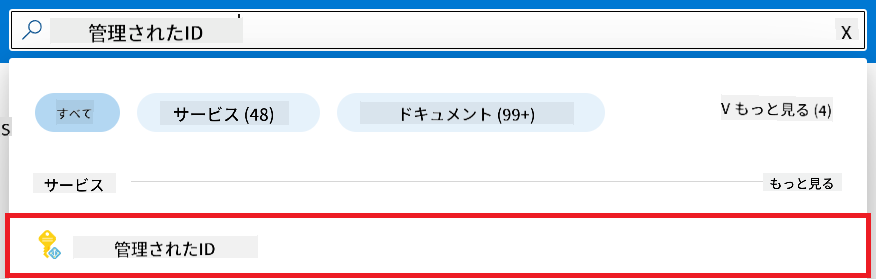
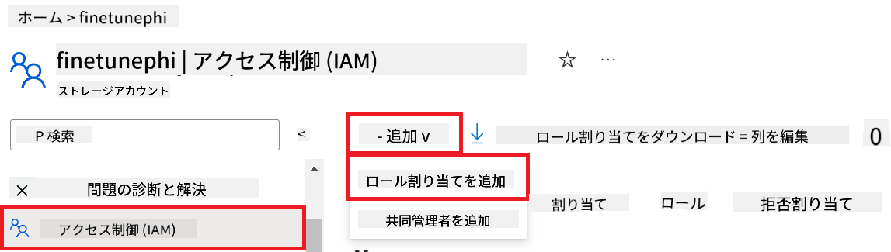
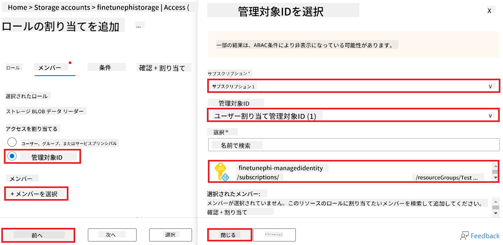
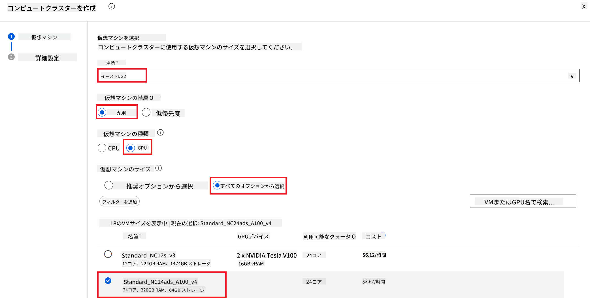
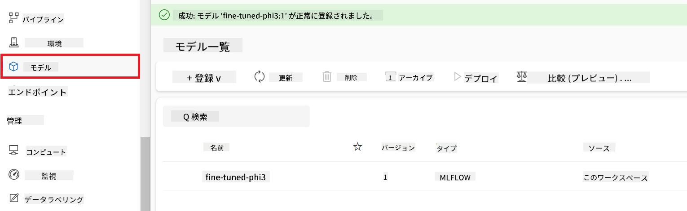
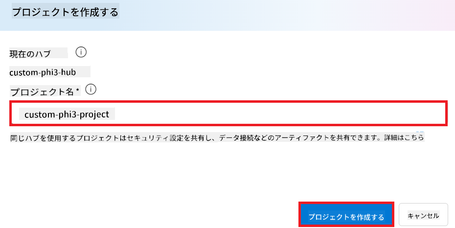
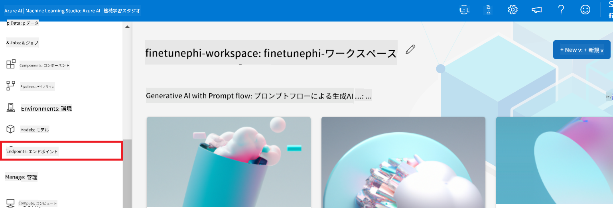
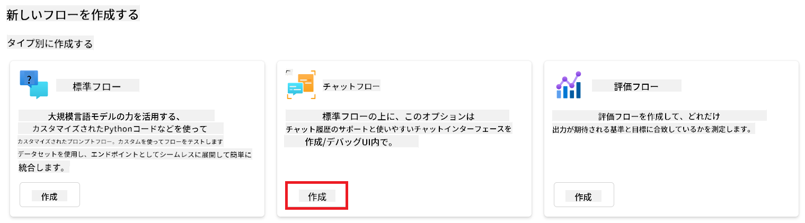
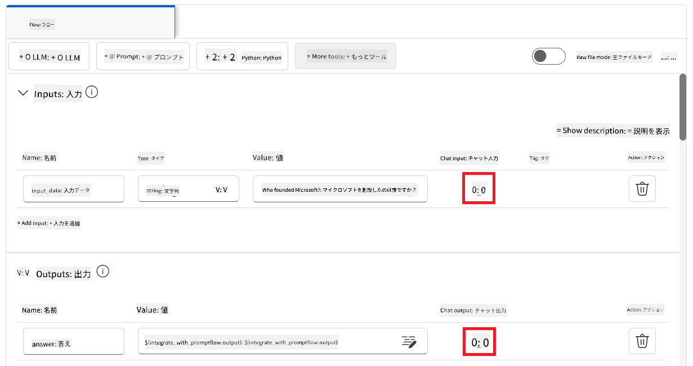
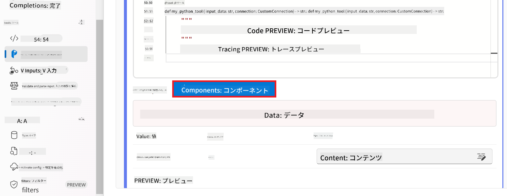

<!--
CO_OP_TRANSLATOR_METADATA:
{
  "original_hash": "ecbd9179a21edbaafaf114d47f09f3e3",
  "translation_date": "2025-05-08T05:45:40+00:00",
  "source_file": "md/02.Application/01.TextAndChat/Phi3/E2E_Phi-3-FineTuning_PromptFlow_Integration_AIFoundry.md",
  "language_code": "ja"
}
-->
# Fine-tune and Integrate custom Phi-3 models with Prompt flow in Azure AI Foundry

このエンドツーエンド（E2E）サンプルは、Microsoft Tech Communityのガイド「[Fine-Tune and Integrate Custom Phi-3 Models with Prompt Flow in Azure AI Foundry](https://techcommunity.microsoft.com/t5/educator-developer-blog/fine-tune-and-integrate-custom-phi-3-models-with-prompt-flow-in/ba-p/4191726?WT.mc_id=aiml-137032-kinfeylo)」に基づいています。Azure AI FoundryでカスタムPhi-3モデルをファインチューニング、デプロイ、Prompt flowと統合するプロセスを紹介します。ローカルでコードを実行するE2Eサンプル「[Fine-Tune and Integrate Custom Phi-3 Models with Prompt Flow](./E2E_Phi-3-FineTuning_PromptFlow_Integration.md)」とは異なり、このチュートリアルはAzure AI / ML Studio内でのファインチューニングと統合に完全にフォーカスしています。

## 概要

このE2Eサンプルでは、Phi-3モデルのファインチューニングとAzure AI FoundryのPrompt flowとの統合方法を学びます。Azure AI / ML Studioを活用して、カスタムAIモデルのデプロイと利用のワークフローを構築します。このE2Eサンプルは3つのシナリオに分かれています。

**シナリオ1：Azureリソースのセットアップとファインチューニングの準備**

**シナリオ2：Phi-3モデルのファインチューニングとAzure Machine Learning Studioでのデプロイ**

**シナリオ3：Prompt flowとの統合とAzure AI Foundryでのカスタムモデルとのチャット**

以下はこのE2Eサンプルの概要です。


### 目次

1. **[シナリオ1：Azureリソースのセットアップとファインチューニングの準備](../../../../../../md/02.Application/01.TextAndChat/Phi3)**
    - [Azure Machine Learning ワークスペースの作成](../../../../../../md/02.Application/01.TextAndChat/Phi3)
    - [AzureサブスクリプションでのGPUクォータのリクエスト](../../../../../../md/02.Application/01.TextAndChat/Phi3)
    - [ロール割り当ての追加](../../../../../../md/02.Application/01.TextAndChat/Phi3)
    - [プロジェクトのセットアップ](../../../../../../md/02.Application/01.TextAndChat/Phi3)
    - [ファインチューニング用データセットの準備](../../../../../../md/02.Application/01.TextAndChat/Phi3)

1. **[シナリオ2：Phi-3モデルのファインチューニングとAzure Machine Learning Studioでのデプロイ](../../../../../../md/02.Application/01.TextAndChat/Phi3)**
    - [Phi-3モデルのファインチューニング](../../../../../../md/02.Application/01.TextAndChat/Phi3)
    - [ファインチューニング済みPhi-3モデルのデプロイ](../../../../../../md/02.Application/01.TextAndChat/Phi3)

1. **[シナリオ3：Prompt flowとの統合とAzure AI Foundryでのカスタムモデルとのチャット](../../../../../../md/02.Application/01.TextAndChat/Phi3)**
    - [カスタムPhi-3モデルのPrompt flowとの統合](../../../../../../md/02.Application/01.TextAndChat/Phi3)
    - [カスタムPhi-3モデルとのチャット](../../../../../../md/02.Application/01.TextAndChat/Phi3)

## シナリオ1：Azureリソースのセットアップとファインチューニングの準備

### Azure Machine Learning ワークスペースの作成

1. ポータルページ上部の**検索バー**に「azure machine learning」と入力し、表示されたオプションから**Azure Machine Learning**を選択します。

    

2. ナビゲーションメニューから**+ 作成**を選択します。

3. ナビゲーションメニューから**新しいワークスペース**を選択します。

    

4. 以下の項目を設定します：

    - Azureの**サブスクリプション**を選択。
    - 使用する**リソースグループ**を選択（必要に応じて新規作成）。
    - **ワークスペース名**を入力。ユニークな値である必要があります。
    - 使用する**リージョン**を選択。
    - 使用する**ストレージアカウント**を選択（必要に応じて新規作成）。
    - 使用する**キーコンテナー**を選択（必要に応じて新規作成）。
    - 使用する**アプリケーションインサイト**を選択（必要に応じて新規作成）。
    - 使用する**コンテナレジストリ**を選択（必要に応じて新規作成）。

    

5. **確認および作成**を選択。

6. **作成**を選択。

### AzureサブスクリプションでのGPUクォータのリクエスト

このチュートリアルでは、Phi-3モデルのファインチューニングとデプロイにGPUを使用します。ファインチューニングには*Standard_NC24ads_A100_v4* GPUを使用し、これはクォータリクエストが必要です。デプロイには*Standard_NC6s_v3* GPUを使用し、こちらもクォータリクエストが必要です。

> [!NOTE]
>
> Pay-As-You-Goサブスクリプション（標準サブスクリプションタイプ）のみがGPU割り当ての対象であり、ベネフィットサブスクリプションは現在サポートされていません。
>

1. [Azure ML Studio](https://ml.azure.com/home?wt.mc_id=studentamb_279723)にアクセスします。

1. *Standard NCADSA100v4 Family*のクォータをリクエストするために、以下を実施します：

    - 左側のタブから**Quota**を選択。
    - 使用する**仮想マシンファミリー**を選択。例として、*Standard_NC24ads_A100_v4* GPUを含む**Standard NCADSA100v4 Family Cluster Dedicated vCPUs**を選択。
    - ナビゲーションメニューから**Request quota**を選択。

        

    - Request quotaページで使用したい**New cores limit**を入力。例：24。
    - **Submit**を選択してGPUクォータをリクエスト。

1. *Standard NCSv3 Family*のクォータをリクエストするために、以下を実施します：

    - 左側のタブから**Quota**を選択。
    - 使用する**仮想マシンファミリー**を選択。例として、*Standard_NC6s_v3* GPUを含む**Standard NCSv3 Family Cluster Dedicated vCPUs**を選択。
    - ナビゲーションメニューから**Request quota**を選択。
    - Request quotaページで使用したい**New cores limit**を入力。例：24。
    - **Submit**を選択してGPUクォータをリクエスト。

### ロール割り当ての追加

モデルのファインチューニングとデプロイを行うためには、まずUser Assigned Managed Identity（UAI）を作成し、適切な権限を割り当てる必要があります。このUAIはデプロイ時の認証に使用されます。

#### User Assigned Managed Identity (UAI)の作成

1. ポータルページ上部の**検索バー**に「managed identities」と入力し、表示されたオプションから**Managed Identities**を選択します。

    

1. **+ 作成**を選択。

    

1. 以下を設定します：

    - Azureの**サブスクリプション**を選択。
    - 使用する**リソースグループ**を選択（必要に応じて新規作成）。
    - 使用する**リージョン**を選択。
    - **名前**を入力。ユニークな値である必要があります。

    

1. **確認および作成**を選択。

1. **作成**を選択。

#### Managed IdentityにContributorロール割り当てを追加

1. 作成したManaged Identityリソースに移動。

1. 左側のタブから**Azure role assignments**を選択。

1. ナビゲーションメニューから**+ ロール割り当ての追加**を選択。

1. ロール割り当て追加ページで以下を実施：

    - **スコープ**を**リソースグループ**に設定。
    - Azureの**サブスクリプション**を選択。
    - 使用する**リソースグループ**を選択。
    - **ロール**を**Contributor**に設定。

    

2. **保存**を選択。

#### Managed IdentityにStorage Blob Data Readerロール割り当てを追加

1. ポータルページ上部の**検索バー**に「storage accounts」と入力し、表示されたオプションから**Storage accounts**を選択。

    

1. Azure Machine Learningワークスペースに関連付けられたストレージアカウントを選択。例：*finetunephistorage*。

1. ロール割り当て追加ページに移動するために以下を実施：

    - 作成したAzure Storageアカウントに移動。
    - 左側のタブから**アクセス制御 (IAM)**を選択。
    - ナビゲーションメニューから**+ 追加**を選択。
    - **ロール割り当ての追加**を選択。

    

1. ロール割り当て追加ページで以下を実施：

    - ロールページの検索バーに「Storage Blob Data Reader」と入力し、表示された**Storage Blob Data Reader**を選択。
    - **次へ**を選択。
    - メンバーのページで**アクセスを割り当てる先**を**Managed identity**に設定。
    - **+ メンバーの選択**を選択。
    - Managed identities選択ページでAzureの**サブスクリプション**を選択。
    - **Managed identity**の種類を**Manage Identity**に設定。
    - 作成したManaged Identity（例：*finetunephi-managedidentity*）を選択。
    - **選択**をクリック。

    

1. **確認および割り当て**を選択。

#### Managed IdentityにAcrPullロール割り当てを追加

1. ポータルページ上部の**検索バー**に「container registries」と入力し、表示されたオプションから**Container registries**を選択。

    

1. Azure Machine Learningワークスペースに関連付けられたコンテナレジストリを選択。例：*finetunephicontainerregistry*

1. ロール割り当て追加ページに移動するために以下を実施：

    - 左側のタブから**アクセス制御 (IAM)**を選択。
    - ナビゲーションメニューから**+ 追加**を選択。
    - **ロール割り当ての追加**を選択。

1. ロール割り当て追加ページで以下を実施：

    - ロールページの検索バーに「AcrPull」と入力し、表示された**AcrPull**を選択。
    - **次へ**を選択。
    - メンバーのページで**アクセスを割り当てる先**を**Managed identity**に設定。
    - **+ メンバーの選択**を選択。
    - Managed identities選択ページでAzureの**サブスクリプション**を選択。
    - **Managed identity**の種類を**Manage Identity**に設定。
    - 作成したManaged Identity（例：*finetunephi-managedidentity*）を選択。
    - **選択**をクリック。
    - **確認および割り当て**を選択。

### プロジェクトのセットアップ

ファインチューニングに必要なデータセットをダウンロードするため、ローカル環境をセットアップします。

この演習では、

- 作業用フォルダーを作成します。
- 仮想環境を作成します。
- 必要なパッケージをインストールします。
- データセットをダウンロードするための*download_dataset.py*ファイルを作成します。

#### 作業用フォルダーの作成

1. ターミナルを開き、以下のコマンドを入力してデフォルトパスに*finetune-phi*という名前のフォルダーを作成します。

    ```console
    mkdir finetune-phi
    ```

2. ターミナルで以下のコマンドを入力し、作成した*finetune-phi*フォルダーに移動します。

    ```console
    cd finetune-phi
    ```

#### 仮想環境の作成

1. ターミナルで以下のコマンドを入力し、*.venv*という名前の仮想環境を作成します。

    ```console
    python -m venv .venv
    ```

2. ターミナルで以下のコマンドを入力し、仮想環境をアクティブにします。

    ```console
    .venv\Scripts\activate.bat
    ```

> [!NOTE]
> 正しく動作していれば、コマンドプロンプトの前に*（.venv）*と表示されます。

#### 必要なパッケージのインストール

1. ターミナルで以下のコマンドを入力し、必要なパッケージをインストールします。

    ```console
    pip install datasets==2.19.1
    ```

#### `download_dataset.py`の作成

> [!NOTE]
> フォルダー構成の例：
>
> ```text
> └── YourUserName
> .    └── finetune-phi
> .        └── download_dataset.py
> ```

1. **Visual Studio Code**を開きます。

1. メニューバーから**ファイル**を選択。

1. **フォルダーを開く**を選択。

1. 作成した*finetune-phi*フォルダー（例：*C:\Users\yourUserName\finetune-phi*）を選択。

    

1. Visual Studio Codeの左ペインで右クリックし、**新しいファイル**を選択して*download_dataset.py*ファイルを作成。

    

### ファインチューニング用データセットの準備

この演習では、*download_dataset.py*ファイルを実行して*ultrachat_200k*データセットをローカル環境にダウンロードします。その後、このデータセットを使ってAzure Machine LearningでPhi-3モデルをファインチューニングします。

この演習で行うこと：

- *download_dataset.py*ファイルにデータセットをダウンロードするコードを追加。
- *download_dataset.py*ファイルを実行し、データセットをローカル環境にダウンロード。

#### *download_dataset.py*を使ってデータセットをダウンロード

1. Visual Studio Codeで*download_dataset.py*ファイルを開く。

1. 以下のコードを*download_dataset.py*ファイルに追加。

    ```python
    import json
    import os
    from datasets import load_dataset

    def load_and_split_dataset(dataset_name, config_name, split_ratio):
        """
        Load and split a dataset.
        """
        # Load the dataset with the specified name, configuration, and split ratio
        dataset = load_dataset(dataset_name, config_name, split=split_ratio)
        print(f"Original dataset size: {len(dataset)}")
        
        # Split the dataset into train and test sets (80% train, 20% test)
        split_dataset = dataset.train_test_split(test_size=0.2)
        print(f"Train dataset size: {len(split_dataset['train'])}")
        print(f"Test dataset size: {len(split_dataset['test'])}")
        
        return split_dataset

    def save_dataset_to_jsonl(dataset, filepath):
        """
        Save a dataset to a JSONL file.
        """
        # Create the directory if it does not exist
        os.makedirs(os.path.dirname(filepath), exist_ok=True)
        
        # Open the file in write mode
        with open(filepath, 'w', encoding='utf-8') as f:
            # Iterate over each record in the dataset
            for record in dataset:
                # Dump the record as a JSON object and write it to the file
                json.dump(record, f)
                # Write a newline character to separate records
                f.write('\n')
        
        print(f"Dataset saved to {filepath}")

    def main():
        """
        Main function to load, split, and save the dataset.
        """
        # Load and split the ULTRACHAT_200k dataset with a specific configuration and split ratio
        dataset = load_and_split_dataset("HuggingFaceH4/ultrachat_200k", 'default', 'train_sft[:1%]')
        
        # Extract the train and test datasets from the split
        train_dataset = dataset['train']
        test_dataset = dataset['test']

        # Save the train dataset to a JSONL file
        save_dataset_to_jsonl(train_dataset, "data/train_data.jsonl")
        
        # Save the test dataset to a separate JSONL file
        save_dataset_to_jsonl(test_dataset, "data/test_data.jsonl")

    if __name__ == "__main__":
        main()

    ```

1. ターミナルで以下のコマンドを入力し、スクリプトを実行してデータセットをローカル環境にダウンロード。

    ```console
    python download_dataset.py
    ```

1. データセットがローカルの*finetune-phi/data*ディレクトリに正常に
1. [Azure ML Studio](https://ml.azure.com/home?wt.mc_id=studentamb_279723) にアクセスします。

1. 左側のタブから **Compute** を選択します。

1. ナビゲーションメニューから **Compute clusters** を選択します。

1. **+ New** を選択します。

    

1. 以下の作業を行います：

    - 使用したい **Region** を選択します。
    - **Virtual machine tier** を **Dedicated** に設定します。
    - **Virtual machine type** を **GPU** に設定します。
    - **Virtual machine size** のフィルターを **Select from all options** に設定します。
    - **Virtual machine size** を **Standard_NC24ads_A100_v4** に選択します。

    

1. **Next** を選択します。

1. 以下の作業を行います：

    - **Compute name** を入力します。ユニークな値である必要があります。
    - **Minimum number of nodes** を **0** に設定します。
    - **Maximum number of nodes** を **1** に設定します。
    - **Idle seconds before scale down** を **120** に設定します。

    

1. **Create** を選択します。

#### Phi-3モデルのファインチューニング

1. [Azure ML Studio](https://ml.azure.com/home?wt.mc_id=studentamb_279723) にアクセスします。

1. 作成した Azure Machine Learning ワークスペースを選択します。

    

1. 以下の作業を行います：

    - 左側のタブから **Model catalog** を選択します。
    - **検索バー** に *phi-3-mini-4k* と入力し、表示されたオプションから **Phi-3-mini-4k-instruct** を選択します。

    

1. ナビゲーションメニューから **Fine-tune** を選択します。

    

1. 以下の作業を行います：

    - **Select task type** を **Chat completion** に設定します。
    - **+ Select data** を選択して **Training data** をアップロードします。
    - Validation データのアップロードタイプを **Provide different validation data** に設定します。
    - **+ Select data** を選択して **Validation data** をアップロードします。

    

    > [!TIP]
    >
    > **Advanced settings** を選択すると、**learning_rate** や **lr_scheduler_type** などの設定をカスタマイズでき、ファインチューニングをより最適化できます。

1. **Finish** を選択します。

1. この演習では、Azure Machine Learning を使って Phi-3 モデルのファインチューニングに成功しました。ファインチューニングにはかなりの時間がかかる場合があります。ジョブを実行した後は完了するまで待つ必要があります。ファインチューニングジョブの状況は、Azure Machine Learning ワークスペースの左側にある Jobs タブで確認できます。次のシリーズでは、ファインチューニングしたモデルをデプロイし、Prompt flow と統合します。

    

### ファインチューニングした Phi-3 モデルのデプロイ

ファインチューニングした Phi-3 モデルを Prompt flow と連携させるには、モデルをデプロイしてリアルタイム推論ができるようにする必要があります。このプロセスでは、モデルの登録、オンラインエンドポイントの作成、モデルのデプロイが含まれます。

この演習では以下を行います：

- ファインチューニングしたモデルを Azure Machine Learning ワークスペースに登録する。
- オンラインエンドポイントを作成する。
- 登録済みのファインチューニングした Phi-3 モデルをデプロイする。

#### ファインチューニングしたモデルの登録

1. [Azure ML Studio](https://ml.azure.com/home?wt.mc_id=studentamb_279723) にアクセスします。

1. 作成した Azure Machine Learning ワークスペースを選択します。

    

1. 左側のタブから **Models** を選択します。
1. **+ Register** を選択します。
1. **From a job output** を選択します。

    

1. 作成したジョブを選択します。

    

1. **Next** を選択します。

1. **Model type** を **MLflow** に設定します。

1. **Job output** が選択されていることを確認します（通常は自動選択されます）。

    

2. **Next** を選択します。

3. **Register** を選択します。

    

4. 登録したモデルは、左側のタブの **Models** メニューから確認できます。

    

#### ファインチューニングしたモデルのデプロイ

1. 作成した Azure Machine Learning ワークスペースに移動します。

1. 左側のタブから **Endpoints** を選択します。

1. ナビゲーションメニューから **Real-time endpoints** を選択します。

    

1. **Create** を選択します。

1. 登録したモデルを選択します。

    

1. **Select** を選択します。

1. 以下の作業を行います：

    - **Virtual machine** を *Standard_NC6s_v3* に設定します。
    - 使用したい **Instance count** を選択します（例：*1*）。
    - **Endpoint** を **New** に設定し、新しいエンドポイントを作成します。
    - **Endpoint name** を入力します。ユニークな値である必要があります。
    - **Deployment name** を入力します。ユニークな値である必要があります。

    

1. **Deploy** を選択します。

> [!WARNING]
> アカウントへの追加料金を防ぐため、Azure Machine Learning ワークスペースで作成したエンドポイントは不要になったら必ず削除してください。
>

#### Azure Machine Learning ワークスペースでデプロイ状況を確認する

1. 作成した Azure Machine Learning ワークスペースに移動します。

1. 左側のタブから **Endpoints** を選択します。

1. 作成したエンドポイントを選択します。

    

1. このページで、デプロイ中のエンドポイントを管理できます。

> [!NOTE]
> デプロイが完了したら、**Live traffic** が **100%** に設定されていることを確認してください。もし設定されていなければ、**Update traffic** を選択してトラフィック設定を調整してください。トラフィックが 0% の場合、モデルのテストはできません。
>
> 
>

## シナリオ3: Prompt flow と統合し、Azure AI Foundry でカスタムモデルとチャットする

### カスタム Phi-3 モデルを Prompt flow と統合する

ファインチューニングしたモデルをデプロイした後、Prompt Flow と統合してリアルタイムアプリケーションでモデルを利用できます。これにより、カスタム Phi-3 モデルを使ったさまざまな対話型タスクが可能になります。

この演習では以下を行います：

- Azure AI Foundry Hub の作成
- Azure AI Foundry Project の作成
- Prompt flow の作成
- ファインチューニングした Phi-3 モデル用のカスタム接続の追加
- カスタム Phi-3 モデルとチャットできるように Prompt flow の設定

> [!NOTE]
> Azure ML Studio を使っても Promptflow と統合できます。同様の統合手順が適用可能です。

#### Azure AI Foundry Hub の作成

Project を作成する前に Hub を作成する必要があります。Hub はリソースグループのような役割を果たし、Azure AI Foundry 内で複数の Project を整理・管理できます。

1. [Azure AI Foundry](https://ai.azure.com/?WT.mc_id=aiml-137032-kinfeylo) にアクセスします。

1. 左側のタブから **All hubs** を選択します。

1. ナビゲーションメニューから **+ New hub** を選択します。

    

1. 以下の作業を行います：

    - **Hub name** を入力します。ユニークな値である必要があります。
    - Azure の **Subscription** を選択します。
    - 使用する **Resource group** を選択します（必要に応じて新規作成）。
    - 使用したい **Location** を選択します。
    - 使用する **Connect Azure AI Services** を選択します（必要に応じて新規作成）。
    - **Connect Azure AI Search** は **Skip connecting** に設定します。

    

1. **Next** を選択します。

#### Azure AI Foundry Project の作成

1. 作成した Hub 内で、左側のタブから **All projects** を選択します。

1. ナビゲーションメニューから **+ New project** を選択します。

    

1. **Project name** を入力します。ユニークな値である必要があります。

    

1. **Create a project** を選択します。

#### ファインチューニングした Phi-3 モデル用のカスタム接続を追加

カスタム Phi-3 モデルを Prompt flow と統合するには、モデルのエンドポイントとキーをカスタム接続に保存する必要があります。これにより、Prompt flow からカスタム Phi-3 モデルにアクセスできるようになります。

#### ファインチューニングした Phi-3 モデルの api key と endpoint uri を設定

1. [Azure ML Studio](https://ml.azure.com/home?WT.mc_id=aiml-137032-kinfeylo) にアクセスします。

1. 作成した Azure Machine Learning ワークスペースに移動します。

1. 左側のタブから **Endpoints** を選択します。

    

1. 作成したエンドポイントを選択します。

    

1. ナビゲーションメニューから **Consume** を選択します。

1. **REST endpoint** と **Primary key** をコピーします。


#### カスタム接続を追加する

1. [Azure AI Foundry](https://ai.azure.com/?WT.mc_id=aiml-137032-kinfeylo) にアクセスします。

1. 作成した Azure AI Foundry プロジェクトに移動します。

1. 作成したプロジェクトで、左側のタブから **Settings** を選択します。

1. **+ New connection** を選択します。

    

1. ナビゲーションメニューから **Custom keys** を選択します。

    

1. 以下の操作を行います：

    - **+ Add key value pairs** を選択します。
    - キー名に **endpoint** を入力し、Azure ML Studio からコピーしたエンドポイントを値のフィールドに貼り付けます。
    - 再度 **+ Add key value pairs** を選択します。
    - キー名に **key** を入力し、Azure ML Studio からコピーしたキーを値のフィールドに貼り付けます。
    - キーを追加したら、キーの露出を防ぐために **is secret** を選択します。

    

1. **Add connection** を選択します。

#### Prompt flow を作成する

Azure AI Foundry にカスタム接続を追加しました。次に、以下の手順で Prompt flow を作成します。その後、この Prompt flow をカスタム接続に接続し、ファインチューニングしたモデルを Prompt flow 内で使用できるようにします。

1. 作成した Azure AI Foundry プロジェクトに移動します。

1. 左側のタブから **Prompt flow** を選択します。

1. ナビゲーションメニューから **+ Create** を選択します。

    

1. ナビゲーションメニューから **Chat flow** を選択します。

    

1. 使用する **Folder name** を入力します。

    

2. **Create** を選択します。

#### カスタム Phi-3 モデルとチャットできるように Prompt flow を設定する

ファインチューニングした Phi-3 モデルを Prompt flow に統合する必要があります。ただし、既存の Prompt flow はこの目的に対応していないため、カスタムモデルの統合が可能なように Prompt flow を再設計する必要があります。

1. Prompt flow で、既存のフローを再構築するために以下の操作を行います：

    - **Raw file mode** を選択します。
    - *flow.dag.yml* ファイル内の既存のコードをすべて削除します。
    - 以下のコードを *flow.dag.yml* ファイルに追加します。

        ```yml
        inputs:
          input_data:
            type: string
            default: "Who founded Microsoft?"

        outputs:
          answer:
            type: string
            reference: ${integrate_with_promptflow.output}

        nodes:
        - name: integrate_with_promptflow
          type: python
          source:
            type: code
            path: integrate_with_promptflow.py
          inputs:
            input_data: ${inputs.input_data}
        ```

    - **Save** を選択します。

    

1. *integrate_with_promptflow.py* ファイルに以下のコードを追加し、Prompt flow でカスタム Phi-3 モデルを使用できるようにします。

    ```python
    import logging
    import requests
    from promptflow import tool
    from promptflow.connections import CustomConnection

    # Logging setup
    logging.basicConfig(
        format="%(asctime)s - %(levelname)s - %(name)s - %(message)s",
        datefmt="%Y-%m-%d %H:%M:%S",
        level=logging.DEBUG
    )
    logger = logging.getLogger(__name__)

    def query_phi3_model(input_data: str, connection: CustomConnection) -> str:
        """
        Send a request to the Phi-3 model endpoint with the given input data using Custom Connection.
        """

        # "connection" is the name of the Custom Connection, "endpoint", "key" are the keys in the Custom Connection
        endpoint_url = connection.endpoint
        api_key = connection.key

        headers = {
            "Content-Type": "application/json",
            "Authorization": f"Bearer {api_key}"
        }
        data = {
            "input_data": {
                "input_string": [
                    {"role": "user", "content": input_data}
                ],
                "parameters": {
                    "temperature": 0.7,
                    "max_new_tokens": 128
                }
            }
        }
        try:
            response = requests.post(endpoint_url, json=data, headers=headers)
            response.raise_for_status()
            
            # Log the full JSON response
            logger.debug(f"Full JSON response: {response.json()}")

            result = response.json()["output"]
            logger.info("Successfully received response from Azure ML Endpoint.")
            return result
        except requests.exceptions.RequestException as e:
            logger.error(f"Error querying Azure ML Endpoint: {e}")
            raise

    @tool
    def my_python_tool(input_data: str, connection: CustomConnection) -> str:
        """
        Tool function to process input data and query the Phi-3 model.
        """
        return query_phi3_model(input_data, connection)

    ```

    

> [!NOTE]
> Azure AI Foundry での Prompt flow の詳細な使い方については、[Prompt flow in Azure AI Foundry](https://learn.microsoft.com/azure/ai-studio/how-to/prompt-flow) を参照してください。

1. **Chat input**、**Chat output** を選択して、モデルとのチャットを有効にします。

    

1. これでカスタム Phi-3 モデルとチャットできる準備が整いました。次の演習では、Prompt flow の起動方法と、ファインチューニングした Phi-3 モデルとチャットする方法を学びます。

> [!NOTE]
>
> 再構築したフローは以下の画像のようになります：
>
> 
>

### カスタム Phi-3 モデルとチャットする

ファインチューニングしたカスタム Phi-3 モデルを Prompt flow と統合したので、いよいよ対話を開始できます。この演習では、Prompt flow を使ってモデルとチャットする設定と開始方法を案内します。これらの手順に従うことで、ファインチューニングした Phi-3 モデルの能力をさまざまなタスクや会話で最大限に活用できます。

- Prompt flow を使ってカスタム Phi-3 モデルとチャットします。

#### Prompt flow を開始する

1. **Start compute sessions** を選択して Prompt flow を開始します。

    

1. **Validate and parse input** を選択してパラメーターを更新します。

    

1. 作成したカスタム接続の **connection** の **Value** を選択します。例：*connection*。

    

#### カスタムモデルとチャットする

1. **Chat** を選択します。

    

1. 結果の例を示します：これでカスタム Phi-3 モデルとチャットできます。ファインチューニングに使ったデータに基づいた質問をすることをおすすめします。

    

**免責事項**：  
本書類はAI翻訳サービス[Co-op Translator](https://github.com/Azure/co-op-translator)を使用して翻訳されています。正確性を期しておりますが、自動翻訳には誤りや不正確な箇所が含まれる可能性があることをご承知おきください。原文の言語で記載された文書が正式な情報源とみなされます。重要な情報については、専門の人間による翻訳を推奨します。本翻訳の使用により生じた誤解や誤訳について、一切の責任を負いかねます。