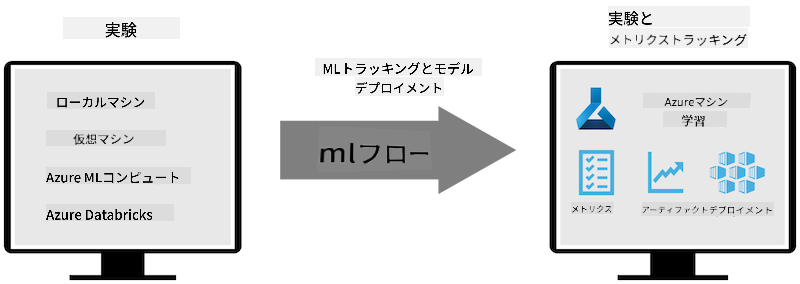
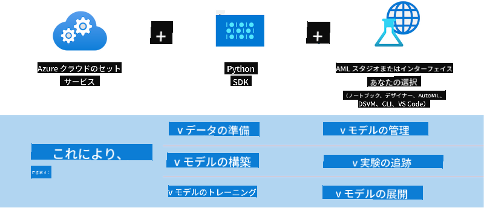

<!--
CO_OP_TRANSLATOR_METADATA:
{
  "original_hash": "f61c383bbf0c3dac97e43f833c258731",
  "translation_date": "2025-05-08T05:35:35+00:00",
  "source_file": "md/02.Application/01.TextAndChat/Phi3/E2E_Phi-3-MLflow.md",
  "language_code": "ja"
}
-->
# MLflow

[MLflow](https://mlflow.org/) は、機械学習のライフサイクル全体を管理するために設計されたオープンソースプラットフォームです。


MLFlowは、実験、再現性、デプロイ、中央モデルレジストリを含むMLライフサイクルの管理に使用されます。現在、MLFlowは4つのコンポーネントを提供しています。

- **MLflow Tracking:** 実験、コード、データ設定、結果を記録および照会します。
- **MLflow Projects:** どのプラットフォームでも再現可能な実行を行うために、データサイエンスコードをパッケージ化します。
- **Mlflow Models:** 多様なサービング環境で機械学習モデルをデプロイします。
- **Model Registry:** モデルを中央リポジトリに保存、注釈付け、管理します。

実験の追跡、コードの再現可能な実行へのパッケージ化、モデルの共有およびデプロイの機能を備えています。MLFlowはDatabricksに統合されており、さまざまなMLライブラリをサポートしているため、特定のライブラリに依存しません。REST APIやCLIを提供しているため、任意の機械学習ライブラリやプログラミング言語で利用可能です。



MLFlowの主な特徴は以下の通りです：

- **Experiment Tracking:** パラメータや結果を記録・比較します。
- **Model Management:** 様々なサービングや推論プラットフォームにモデルをデプロイします。
- **Model Registry:** バージョニングや注釈付けを含め、MLflow Modelsのライフサイクルを共同で管理します。
- **Projects:** MLコードを共有や本番利用のためにパッケージ化します。

MLFlowは、データ準備、モデルの登録・管理、モデルの実行用パッケージ化、サービスのデプロイ、モデルの監視を含むMLOpsループもサポートしています。特にクラウドやエッジ環境で、プロトタイプから本番ワークフローへの移行を簡素化することを目的としています。

## E2Eシナリオ - ラッパーの作成とPhi-3をMLFlowモデルとして使用する

このE2Eサンプルでは、Phi-3小型言語モデル（SLM）をラップする2つの異なるアプローチを示し、その後ローカルまたはクラウド（例：Azure Machine Learningワークスペース）でMLFlowモデルとして実行する方法を紹介します。



| プロジェクト | 説明 | 場所 |
| ------------ | ----------- | -------- |
| Transformer Pipeline | HuggingFaceモデルをMLFlowの実験的transformersフレーバーで使用したい場合に、ラッパーを作成する最も簡単な方法です。 | [**TransformerPipeline.ipynb**](../../../../../../code/06.E2E/E2E_Phi-3-MLflow_TransformerPipeline.ipynb) |
| Custom Python Wrapper | 執筆時点では、transformer pipelineはONNX形式のHuggingFaceモデルに対するMLFlowラッパー生成を実験的optimum Pythonパッケージを使ってもサポートしていません。このような場合は、カスタムPythonラッパーを作成してMLFlowモデルを構築できます。 | [**CustomPythonWrapper.ipynb**](../../../../../../code/06.E2E/E2E_Phi-3-MLflow_CustomPythonWrapper.ipynb) |

## プロジェクト: Transformer Pipeline

1. MLFlowとHuggingFaceの関連Pythonパッケージが必要です：

    ``` Python
    import mlflow
    import transformers
    ```

2. 次に、HuggingFaceレジストリの対象Phi-3モデルを参照してtransformer pipelineを初期化します。_Phi-3-mini-4k-instruct_のモデルカードからもわかるように、このモデルのタスクは「Text Generation」タイプです：

    ``` Python
    pipeline = transformers.pipeline(
        task = "text-generation",
        model = "microsoft/Phi-3-mini-4k-instruct"
    )
    ```

3. これで、Phi-3モデルのtransformer pipelineをMLFlow形式で保存し、対象のアーティファクトパスや特定のモデル設定、推論APIタイプなどの追加情報を指定できます：

    ``` Python
    model_info = mlflow.transformers.log_model(
        transformers_model = pipeline,
        artifact_path = "phi3-mlflow-model",
        model_config = model_config,
        task = "llm/v1/chat"
    )
    ```

## プロジェクト: Custom Python Wrapper

1. ここではMicrosoftの[ONNX Runtime generate() API](https://github.com/microsoft/onnxruntime-genai)を使用して、ONNXモデルの推論とトークンのエンコード/デコードを行います。ターゲットの計算環境に応じて_onnxruntime_genai_パッケージを選択してください。以下の例はCPU向けです：

    ``` Python
    import mlflow
    from mlflow.models import infer_signature
    import onnxruntime_genai as og
    ```

1. カスタムクラスは、Phi-3 Mini 4K Instructの**ONNXモデル**、**ジェネレーターのパラメータ**、**トークナイザー**を初期化する_load_context()_メソッドと、与えられたプロンプトに対して出力トークンを生成する_predict()_メソッドの2つを実装しています：

    ``` Python
    class Phi3Model(mlflow.pyfunc.PythonModel):
        def load_context(self, context):
            # Retrieving model from the artifacts
            model_path = context.artifacts["phi3-mini-onnx"]
            model_options = {
                 "max_length": 300,
                 "temperature": 0.2,         
            }
        
            # Defining the model
            self.phi3_model = og.Model(model_path)
            self.params = og.GeneratorParams(self.phi3_model)
            self.params.set_search_options(**model_options)
            
            # Defining the tokenizer
            self.tokenizer = og.Tokenizer(self.phi3_model)
    
        def predict(self, context, model_input):
            # Retrieving prompt from the input
            prompt = model_input["prompt"][0]
            self.params.input_ids = self.tokenizer.encode(prompt)
    
            # Generating the model's response
            response = self.phi3_model.generate(self.params)
    
            return self.tokenizer.decode(response[0][len(self.params.input_ids):])
    ```

1. _mlflow.pyfunc.log_model()_関数を使って、Phi-3モデルのカスタムPythonラッパー（pickle形式）を、元のONNXモデルや必要な依存関係とともに生成できます：

    ``` Python
    model_info = mlflow.pyfunc.log_model(
        artifact_path = artifact_path,
        python_model = Phi3Model(),
        artifacts = {
            "phi3-mini-onnx": "cpu_and_mobile/cpu-int4-rtn-block-32-acc-level-4",
        },
        input_example = input_example,
        signature = infer_signature(input_example, ["Run"]),
        extra_pip_requirements = ["torch", "onnxruntime_genai", "numpy"],
    )
    ```

## 生成されたMLFlowモデルのシグネチャ

1. 上記Transformer Pipelineプロジェクトのステップ3で、MLFlowモデルのタスクを「_llm/v1/chat_」に設定しました。この指示により、OpenAIのChat APIと互換性のあるモデルAPIラッパーが生成されます。以下のようになります：

    ``` Python
    {inputs: 
      ['messages': Array({content: string (required), name: string (optional), role: string (required)}) (required), 'temperature': double (optional), 'max_tokens': long (optional), 'stop': Array(string) (optional), 'n': long (optional), 'stream': boolean (optional)],
    outputs: 
      ['id': string (required), 'object': string (required), 'created': long (required), 'model': string (required), 'choices': Array({finish_reason: string (required), index: long (required), message: {content: string (required), name: string (optional), role: string (required)} (required)}) (required), 'usage': {completion_tokens: long (required), prompt_tokens: long (required), total_tokens: long (required)} (required)],
    params: 
      None}
    ```

1. 結果として、以下の形式でプロンプトを送信できます：

    ``` Python
    messages = [{"role": "user", "content": "What is the capital of Spain?"}]
    ```

1. その後、OpenAI API互換の後処理（例：_response[0][‘choices’][0][‘message’][‘content’]_）を使って、出力を次のように整形できます：

    ``` JSON
    Question: What is the capital of Spain?
    
    Answer: The capital of Spain is Madrid. It is the largest city in Spain and serves as the political, economic, and cultural center of the country. Madrid is located in the center of the Iberian Peninsula and is known for its rich history, art, and architecture, including the Royal Palace, the Prado Museum, and the Plaza Mayor.
    
    Usage: {'prompt_tokens': 11, 'completion_tokens': 73, 'total_tokens': 84}
    ```

1. 上記Custom Python Wrapperプロジェクトのステップ3では、MLFlowパッケージに入力例からモデルのシグネチャを生成させています。MLFlowラッパーのシグネチャは以下のようになります：

    ``` Python
    {inputs: 
      ['prompt': string (required)],
    outputs: 
      [string (required)],
    params: 
      None}
    ```

1. したがって、プロンプトには以下のように"prompt"辞書キーを含める必要があります：

    ``` Python
    {"prompt": "<|system|>You are a stand-up comedian.<|end|><|user|>Tell me a joke about atom<|end|><|assistant|>",}
    ```

1. モデルの出力は文字列形式で提供されます：

    ``` JSON
    Alright, here's a little atom-related joke for you!
    
    Why don't electrons ever play hide and seek with protons?
    
    Because good luck finding them when they're always "sharing" their electrons!
    
    Remember, this is all in good fun, and we're just having a little atomic-level humor!
    ```

**免責事項**：  
本書類はAI翻訳サービス[Co-op Translator](https://github.com/Azure/co-op-translator)を使用して翻訳されました。正確性を期しておりますが、自動翻訳には誤りや不正確な箇所が含まれる可能性があることをご了承ください。原文の言語で記載された文書が正式な情報源とみなされます。重要な情報については、専門の人間による翻訳を推奨します。本翻訳の使用により生じたいかなる誤解や誤訳についても責任を負いかねます。