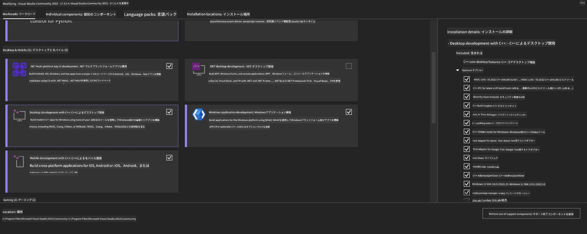
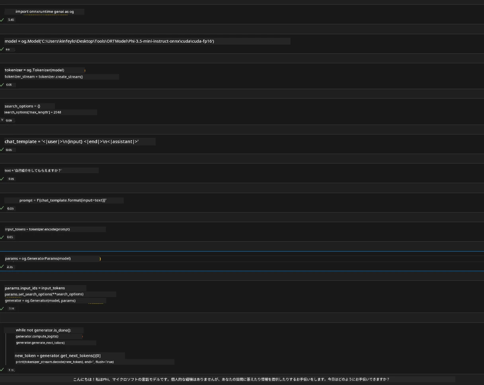
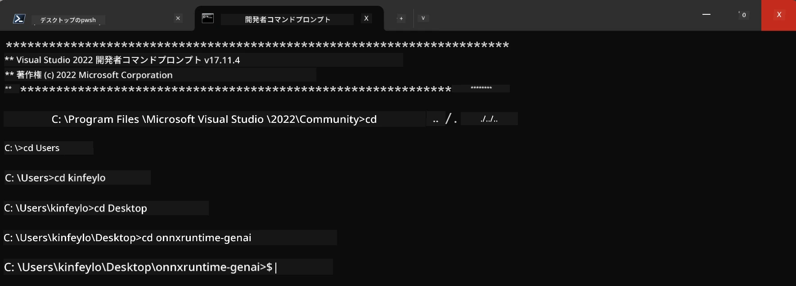

# **OnnxRuntime GenAI Windows GPU ガイドライン**

このガイドラインは、Windows上でGPUを使用してONNX Runtime（ORT）を設定および利用する手順を提供します。モデルのGPUアクセラレーションを活用し、パフォーマンスと効率を向上させることを目的としています。

本書類は以下のガイダンスを提供します：

- 環境設定: CUDA、cuDNN、ONNX Runtimeなど必要な依存関係のインストール手順。
- 設定: GPUリソースを効果的に活用するための環境とONNX Runtimeの設定方法。
- 最適化のヒント: 最適なパフォーマンスのためのGPU設定の調整方法。

### **1. Python 3.10.x /3.11.8**

   <strong><em>注意</em></strong> Python環境には [miniforge](https://github.com/conda-forge/miniforge/releases/latest/download/Miniforge3-Windows-x86_64.exe) の使用を推奨します

   ```bash

   conda create -n pydev python==3.11.8

   conda activate pydev

   ```

   <strong><em>リマインダー</em></strong> PythonのONNXライブラリをインストールしている場合は、必ずアンインストールしてください

### **2. wingetでCMakeをインストール**


   ```bash

   winget install -e --id Kitware.CMake

   ```

### **3. Visual Studio 2022 - C++によるデスクトップ開発のインストール**

   <strong><em>注意</em></strong> コンパイルしたくない場合は、このステップをスキップできます




### **4. NVIDIAドライバーのインストール**

1. **NVIDIA GPUドライバー**  [https://www.nvidia.com/en-us/drivers/](https://www.nvidia.com/en-us/drivers/)

2. **NVIDIA CUDA 12.4** [https://developer.nvidia.com/cuda-12-4-0-download-archive](https://developer.nvidia.com/cuda-12-4-0-download-archive)

3. **NVIDIA CUDNN 9.4**  [https://developer.nvidia.com/cudnn-downloads](https://developer.nvidia.com/cudnn-downloads)

<strong><em>リマインダー</em></strong> インストール時はデフォルト設定を使用してください

### **5. NVIDIA環境設定**

NVIDIA CUDNN 9.4 の lib、bin、include を NVIDIA CUDA 12.4 の lib、bin、include にコピーしてください

- *'C:\Program Files\NVIDIA\CUDNN\v9.4\bin\12.6'* 内のファイルを *'C:\Program Files\NVIDIA GPU Computing Toolkit\CUDA\v12.4\bin'* にコピー

- *'C:\Program Files\NVIDIA\CUDNN\v9.4\include\12.6'* 内のファイルを *'C:\Program Files\NVIDIA GPU Computing Toolkit\CUDA\v12.4\include'* にコピー

- *'C:\Program Files\NVIDIA\CUDNN\v9.4\lib\12.6'* 内のファイルを *'C:\Program Files\NVIDIA GPU Computing Toolkit\CUDA\v12.4\lib\x64'* にコピー


### **6. Phi-3.5-mini-instruct-onnxのダウンロード**


   ```bash

   winget install -e --id Git.Git

   winget install -e --id GitHub.GitLFS

   git lfs install

   git clone https://huggingface.co/microsoft/Phi-3.5-mini-instruct-onnx

   ```

### **7. InferencePhi35Instruct.ipynbの実行**

   [Notebook](../../../../code/09.UpdateSamples/Aug/ortgpu-phi35-instruct.ipynb)を開き、実行してください





### **8. ORT GenAI GPUのコンパイル**


   <strong><em>注意</em></strong> 
   
   1. まず、onnx、onnxruntime、onnxruntime-genaiに関わるものはすべてアンインストールしてください

   
   ```bash

   pip list 
   
   ```

   その後、すべてのonnxruntimeライブラリをアンインストールします


   ```bash

   pip uninstall onnxruntime

   pip uninstall onnxruntime-genai

   pip uninstall onnxruntume-genai-cuda
   
   ```

   2. Visual Studio拡張機能のサポートを確認

   C:\Program Files\NVIDIA GPU Computing Toolkit\CUDA\v12.4\extras に、C:\Program Files\NVIDIA GPU Computing Toolkit\CUDA\v12.4\extras\visual_studio_integration が存在することを確認してください。
   
   見つからない場合は、他のCudaツールキットドライバーフォルダを確認し、 visual_studio_integration フォルダとその内容を C:\Program Files\NVIDIA GPU Computing Toolkit\CUDA\v12.4\extras\visual_studio_integration にコピーしてください。


   - コンパイルしたくない場合はこのステップをスキップできます


   ```bash

   git clone https://github.com/microsoft/onnxruntime-genai

   ```

   - [https://github.com/microsoft/onnxruntime/releases/download/v1.19.2/onnxruntime-win-x64-gpu-1.19.2.zip](https://github.com/microsoft/onnxruntime/releases/download/v1.19.2/onnxruntime-win-x64-gpu-1.19.2.zip) をダウンロード

   - onnxruntime-win-x64-gpu-1.19.2.zip を解凍し、**ort** に名前を変更して、onnxruntime-genaiにコピー

   - Windowsターミナルを使用し、VS 2022のDeveloper Command Promptに移動し、onnxruntime-genaiに移動



   - Python環境でコンパイルを行う

   
   ```bash

   cd onnxruntime-genai

   python build.py --use_cuda  --cuda_home "C:\Program Files\NVIDIA GPU Computing Toolkit\CUDA\v12.4" --config Release
 

   cd build/Windows/Release/Wheel

   pip install .whl

   ```

---

<!-- CO-OP TRANSLATOR DISCLAIMER START -->
**免責事項**：
本書類は AI 翻訳サービス [Co-op Translator](https://github.com/Azure/co-op-translator) を使用して翻訳されています。正確性を期していますが、自動翻訳には誤りや不正確な部分が含まれる可能性があることをご承知おきください。原文の原語版が正式な情報源とみなされるべきです。重要な情報については、専門の人間による翻訳を推奨します。本翻訳の利用により生じたいかなる誤解や解釈違いについても、当方は責任を負いかねます。
<!-- CO-OP TRANSLATOR DISCLAIMER END -->