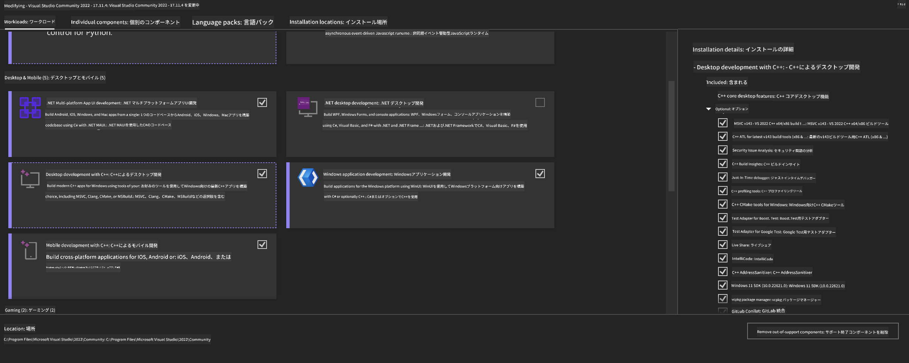
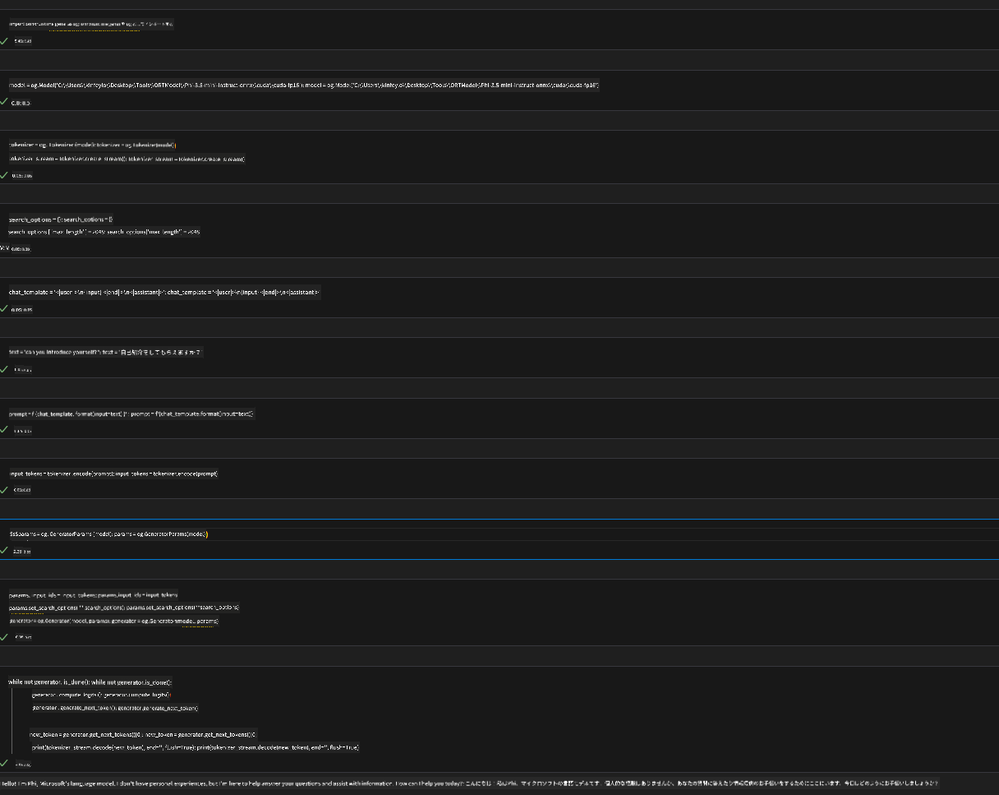
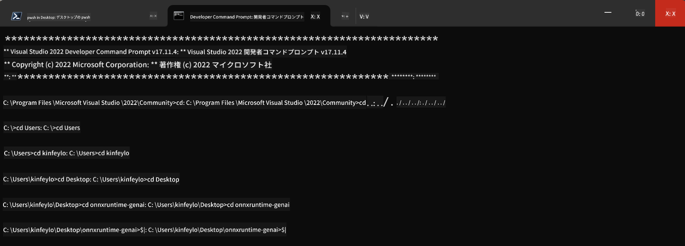

<!--
CO_OP_TRANSLATOR_METADATA:
{
  "original_hash": "b066fc29c1b2129df84e027cb75119ce",
  "translation_date": "2025-05-08T05:49:31+00:00",
  "source_file": "md/02.Application/01.TextAndChat/Phi3/ORTWindowGPUGuideline.md",
  "language_code": "ja"
}
-->
# **OnnxRuntime GenAI Windows GPU ガイドライン**

このガイドラインは、Windows上でGPUを使用してONNX Runtime (ORT) をセットアップし利用する手順を提供します。GPUアクセラレーションを活用してモデルのパフォーマンスと効率を向上させるためのものです。

本書では以下について説明しています：

- 環境設定：CUDA、cuDNN、ONNX Runtimeなど必要な依存関係のインストール手順
- 設定方法：GPUリソースを効果的に活用するための環境とONNX Runtimeの設定方法
- 最適化のヒント：GPU設定を微調整し最適なパフォーマンスを得るためのアドバイス

### **1. Python 3.10.x /3.11.8**

   ***Note*** Python環境には[miniforge](https://github.com/conda-forge/miniforge/releases/latest/download/Miniforge3-Windows-x86_64.exe)の使用を推奨します

   ```bash

   conda create -n pydev python==3.11.8

   conda activate pydev

   ```

   ***Reminder*** もしPythonのONNX関連ライブラリをインストールしている場合は、アンインストールしてください

### **2. wingetでCMakeをインストール**

   ```bash

   winget install -e --id Kitware.CMake

   ```

### **3. Visual Studio 2022 - C++によるデスクトップ開発をインストール**

   ***Note*** コンパイルしない場合はこのステップをスキップできます




### **4. NVIDIAドライバーのインストール**

1. **NVIDIA GPU Driver**  [https://www.nvidia.com/en-us/drivers/](https://www.nvidia.com/en-us/drivers/)

2. **NVIDIA CUDA 12.4** [https://developer.nvidia.com/cuda-12-4-0-download-archive](https://developer.nvidia.com/cuda-12-4-0-download-archive)

3. **NVIDIA CUDNN 9.4**  [https://developer.nvidia.com/cudnn-downloads](https://developer.nvidia.com/cudnn-downloads)

***Reminder*** インストール時はデフォルト設定を使用してください

### **5. NVIDIA環境の設定**

NVIDIA CUDNN 9.4のlib、bin、includeフォルダの内容をNVIDIA CUDA 12.4の対応するlib、bin、includeフォルダにコピーします

- *'C:\Program Files\NVIDIA\CUDNN\v9.4\bin\12.6'* のファイルを *'C:\Program Files\NVIDIA GPU Computing Toolkit\CUDA\v12.4\bin'* にコピー

- *'C:\Program Files\NVIDIA\CUDNN\v9.4\include\12.6'* のファイルを *'C:\Program Files\NVIDIA GPU Computing Toolkit\CUDA\v12.4\include'* にコピー

- *'C:\Program Files\NVIDIA\CUDNN\v9.4\lib\12.6'* のファイルを *'C:\Program Files\NVIDIA GPU Computing Toolkit\CUDA\v12.4\lib\x64'* にコピー


### **6. Phi-3.5-mini-instruct-onnx をダウンロード**

   ```bash

   winget install -e --id Git.Git

   winget install -e --id GitHub.GitLFS

   git lfs install

   git clone https://huggingface.co/microsoft/Phi-3.5-mini-instruct-onnx

   ```

### **7. InferencePhi35Instruct.ipynbの実行**

   [Notebook](../../../../../../code/09.UpdateSamples/Aug/ortgpu-phi35-instruct.ipynb) を開いて実行してください





### **8. ORT GenAI GPUのコンパイル**

   ***Note*** 
   
   1. まずはonnx、onnxruntime、onnxruntime-genaiに関するすべてをアンインストールしてください

   
   ```bash

   pip list 
   
   ```

   その後、onnxruntimeライブラリをすべてアンインストールします


   ```bash

   pip uninstall onnxruntime

   pip uninstall onnxruntime-genai

   pip uninstall onnxruntume-genai-cuda
   
   ```

   2. Visual Studio拡張機能のサポートを確認

   C:\Program Files\NVIDIA GPU Computing Toolkit\CUDA\v12.4\extras フォルダ内に C:\Program Files\NVIDIA GPU Computing Toolkit\CUDA\v12.4\extras\visual_studio_integration があるか確認してください。
   
   見つからない場合は、他のCuda toolkitドライバーフォルダを確認し、visual_studio_integrationフォルダとその内容をC:\Program Files\NVIDIA GPU Computing Toolkit\CUDA\v12.4\extras\visual_studio_integration にコピーしてください


   - コンパイルしない場合はこのステップをスキップできます


   ```bash

   git clone https://github.com/microsoft/onnxruntime-genai

   ```

   - [https://github.com/microsoft/onnxruntime/releases/download/v1.19.2/onnxruntime-win-x64-gpu-1.19.2.zip](https://github.com/microsoft/onnxruntime/releases/download/v1.19.2/onnxruntime-win-x64-gpu-1.19.2.zip) をダウンロード

   - onnxruntime-win-x64-gpu-1.19.2.zip を解凍し、**ort** に名前を変更して onnxruntime-genai にコピー

   - Windows Terminalで、VS 2022のDeveloper Command Promptを起動し、onnxruntime-genai に移動



   - ご自身のPython環境でコンパイルしてください

   
   ```bash

   cd onnxruntime-genai

   python build.py --use_cuda  --cuda_home "C:\Program Files\NVIDIA GPU Computing Toolkit\CUDA\v12.4" --config Release
 

   cd build/Windows/Release/Wheel

   pip install .whl

   ```

**免責事項**：  
本書類はAI翻訳サービス「[Co-op Translator](https://github.com/Azure/co-op-translator)」を使用して翻訳されています。正確性には努めておりますが、自動翻訳には誤りや不正確な部分が含まれる可能性があることをご了承ください。原文の言語による文書が正式な情報源とみなされます。重要な情報については、専門の人間による翻訳を推奨します。本翻訳の利用により生じたいかなる誤解や誤訳についても責任を負いかねます。