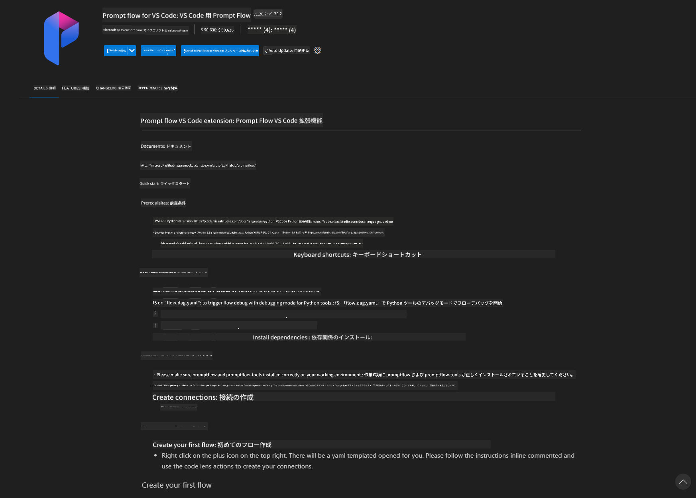
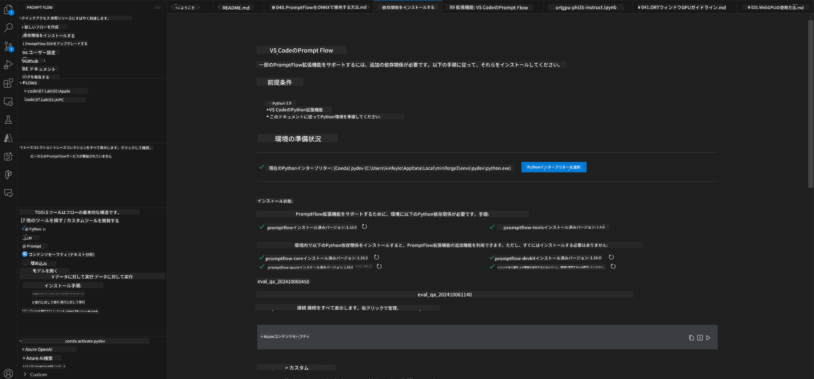
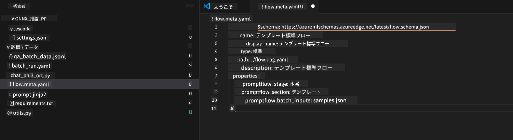
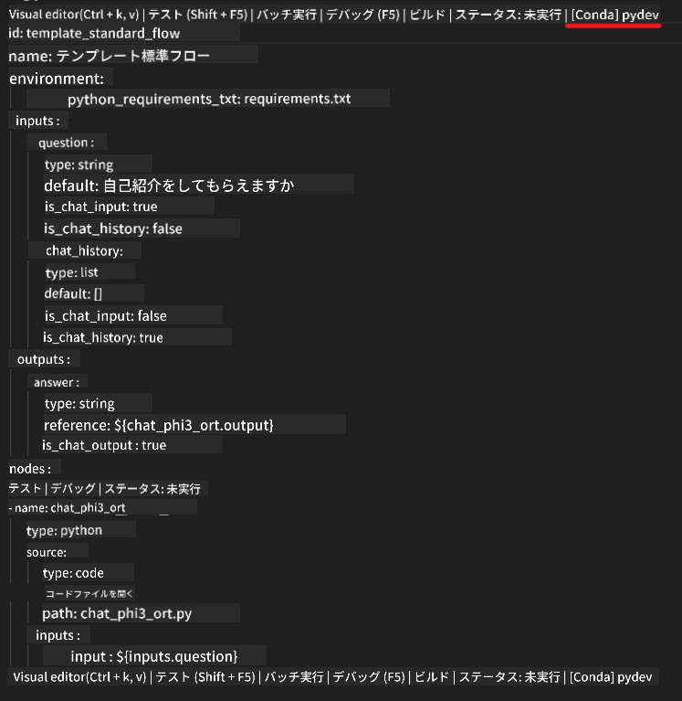
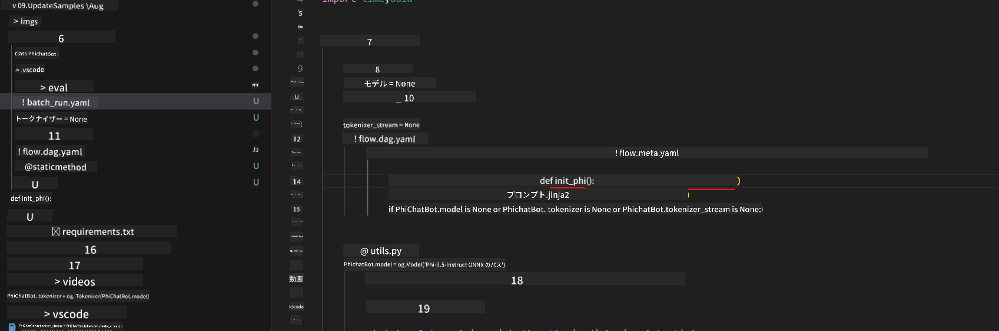
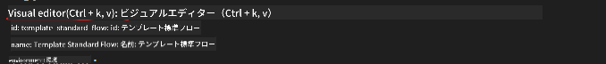
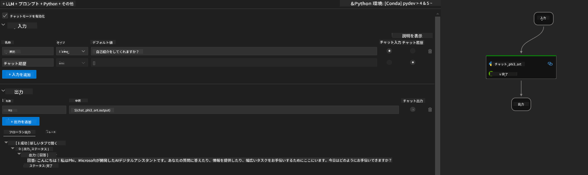
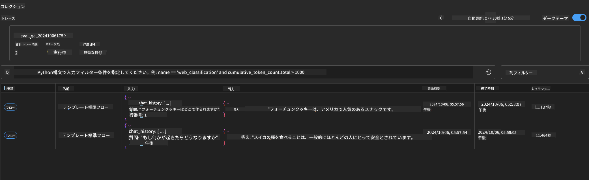

<!--
CO_OP_TRANSLATOR_METADATA:
{
  "original_hash": "20c7e34651318736a2606d351fcc37d0",
  "translation_date": "2025-04-04T12:45:26+00:00",
  "source_file": "md\\02.Application\\01.TextAndChat\\Phi3\\UsingPromptFlowWithONNX.md",
  "language_code": "ja"
}
-->
# Windows GPUを使用してPhi-3.5-Instruct ONNXでPrompt Flowソリューションを作成する

このドキュメントは、Phi-3モデルを基にしたAIアプリケーションを開発するために、PromptFlowとONNX（Open Neural Network Exchange）を使用する方法の例を示しています。

PromptFlowは、LLM（Large Language Model）ベースのAIアプリケーションのアイデア出しからプロトタイピング、テスト、評価まで、開発サイクル全体を効率化するための開発ツール群です。

PromptFlowをONNXと統合することで、開発者は以下を実現できます：

- **モデルパフォーマンスの最適化**：ONNXを活用して効率的なモデル推論とデプロイを実現。
- **開発の簡素化**：PromptFlowを使用してワークフローを管理し、繰り返し作業を自動化。
- **コラボレーションの強化**：統一された開発環境を提供することで、チームメンバー間のコラボレーションを促進。

**Prompt flow**は、LLMベースのAIアプリケーションのアイデア出し、プロトタイピング、テスト、評価から本番環境へのデプロイと監視まで、開発サイクル全体を効率化するための開発ツール群です。これにより、プロンプトエンジニアリングが容易になり、プロダクション品質のLLMアプリを構築することが可能になります。

Prompt flowは、OpenAI、Azure OpenAI Service、カスタマイズ可能なモデル（Huggingface、ローカルのLLM/SLM）に接続できます。私たちはPhi-3.5の量子化ONNXモデルをローカルアプリケーションにデプロイすることを目指しています。Prompt flowを使用することで、ビジネスをより良く計画し、Phi-3.5を基にしたローカルソリューションを完成させることができます。この例では、ONNX Runtime GenAI Libraryを組み合わせて、Windows GPUを基にしたPrompt flowソリューションを完成させます。

## **インストール**

### **Windows GPU用ONNX Runtime GenAI**

Windows GPU用ONNX Runtime GenAIの設定方法については、こちらのガイドラインをご覧ください [click here](./ORTWindowGPUGuideline.md)

### **VSCodeでPrompt flowをセットアップ**

1. Prompt flow VS Code Extensionをインストール



2. Prompt flow VS Code Extensionをインストールした後、拡張機能をクリックし、**Installation dependencies**を選択して、このガイドラインに従い環境にPrompt flow SDKをインストールします。



3. [サンプルコード](../../../../../../code/09.UpdateSamples/Aug/pf/onnx_inference_pf)をダウンロードし、VS Codeでこのサンプルを開きます。



4. **flow.dag.yaml**を開き、Python環境を選択します。



   **chat_phi3_ort.py**を開いて、Phi-3.5-Instruct ONNXモデルの場所を変更します。



5. Prompt flowを実行してテストします。

**flow.dag.yaml**を開き、ビジュアルエディタをクリックします。



クリック後、実行してテストします。



1. ターミナルでバッチを実行し、さらに多くの結果を確認できます。

```bash

pf run create --file batch_run.yaml --stream --name 'Your eval qa name'    

```

デフォルトのブラウザで結果を確認できます。



**免責事項**:  
本書類は、AI翻訳サービス[Co-op Translator](https://github.com/Azure/co-op-translator)を使用して翻訳されています。正確性を期すよう努めておりますが、自動翻訳には誤りや不正確さが含まれる可能性があります。原文の母国語による書類を公式な情報源としてご参照ください。重要な情報については、専門の人間による翻訳を推奨します。本翻訳の使用により生じた誤解や誤認について、当方は一切の責任を負いません。