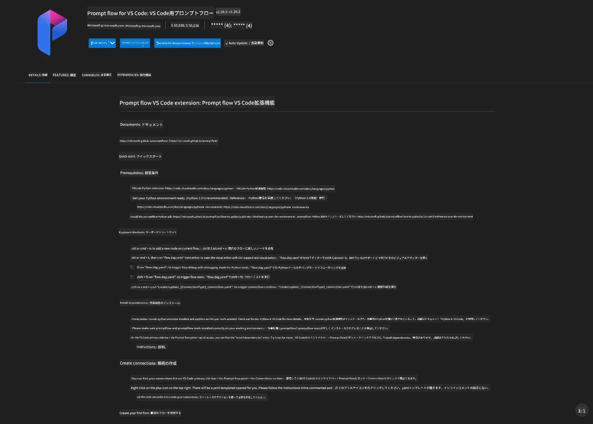
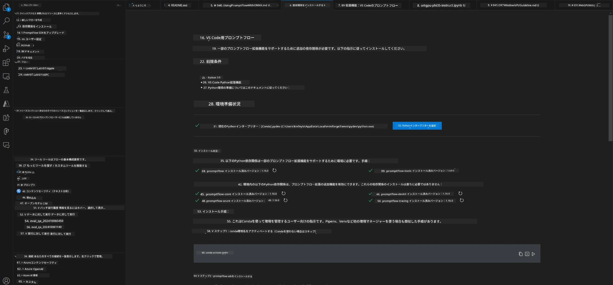
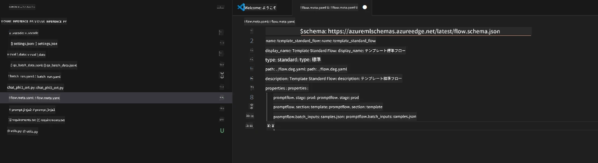
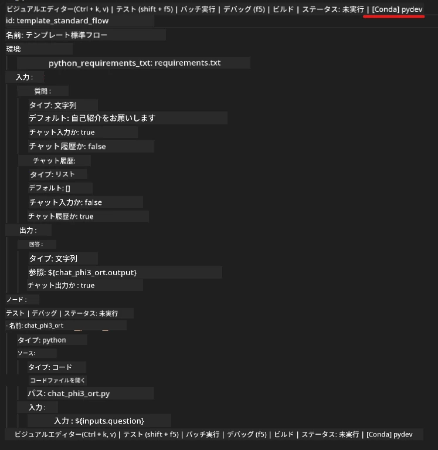
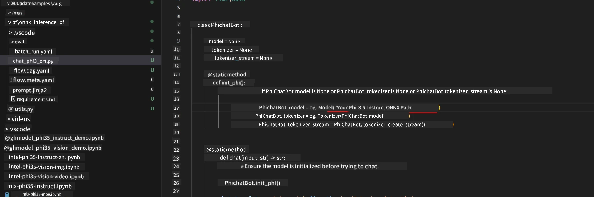
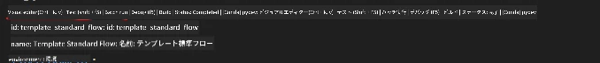
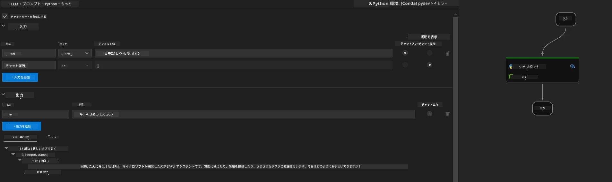
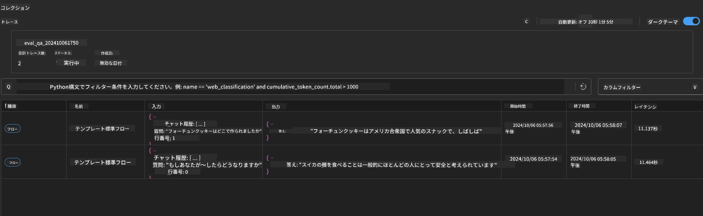

# Windows GPUを使ってPhi-3.5-Instruct ONNXでPrompt flowソリューションを作成する方法

以下のドキュメントは、Phi-3モデルをベースにしたAIアプリケーション開発のために、ONNX（Open Neural Network Exchange）とPromptFlowを使う方法の例です。

PromptFlowは、LLM（大規模言語モデル）ベースのAIアプリケーションのアイデア出しやプロトタイピングからテスト、評価までの開発サイクルを効率化するための開発ツール群です。

PromptFlowとONNXを組み合わせることで、開発者は以下のことが可能になります：

- モデルパフォーマンスの最適化：ONNXを活用して効率的なモデル推論とデプロイを実現。
- 開発の簡素化：PromptFlowでワークフローを管理し、繰り返し作業を自動化。
- コラボレーションの強化：統一された開発環境を提供し、チーム内の連携を促進。

**Prompt flow**は、LLMベースのAIアプリケーションのアイデア出し、プロトタイピング、テスト、評価から本番展開や監視までの開発サイクルを効率化する開発ツール群です。プロンプトエンジニアリングを格段に簡単にし、プロダクション品質のLLMアプリを構築できるようにします。

Prompt flowはOpenAI、Azure OpenAI Service、カスタマイズ可能なモデル（Huggingface、ローカルのLLM/SLM）に接続可能です。Phi-3.5の量子化されたONNXモデルをローカルアプリケーションに展開することを目指しています。Prompt flowはビジネスの計画やPhi-3.5をベースにしたローカルソリューションの完成に役立ちます。この例では、ONNX Runtime GenAIライブラリを組み合わせて、Windows GPU上でPrompt flowソリューションを完成させます。

## **インストール**

### **Windows GPU用ONNX Runtime GenAI**

Windows GPU用ONNX Runtime GenAIの設定方法はこのガイドを参照してください [こちらをクリック](./ORTWindowGPUGuideline.md)

### **VSCodeでPrompt flowをセットアップする**

1. Prompt flowのVS Code拡張機能をインストールします



2. Prompt flowのVS Code拡張機能をインストール後、拡張機能をクリックし、**Installation dependencies**を選択して、このガイドに従い環境にPrompt flow SDKをインストールします



3. [サンプルコード](../../../../../../code/09.UpdateSamples/Aug/pf/onnx_inference_pf)をダウンロードし、VS Codeで開きます



4. **flow.dag.yaml**を開いてPython環境を選択します



   **chat_phi3_ort.py**を開いてPhi-3.5-instruct ONNXモデルの場所を変更します



5. Prompt flowを実行してテストします

**flow.dag.yaml**を開き、ビジュアルエディターをクリックします



クリック後、実行してテストします



1. ターミナルでバッチ実行してさらに結果を確認できます


```bash

pf run create --file batch_run.yaml --stream --name 'Your eval qa name'    

```

結果はデフォルトのブラウザで確認可能です




**免責事項**：  
本書類はAI翻訳サービス「[Co-op Translator](https://github.com/Azure/co-op-translator)」を使用して翻訳されました。正確性には努めておりますが、自動翻訳には誤りや不正確な部分が含まれる可能性があります。原文の言語によるオリジナル文書が正式な情報源とみなされるべきです。重要な情報については、専門の人間による翻訳を推奨します。本翻訳の利用により生じたいかなる誤解や誤訳についても、当方は一切の責任を負いかねます。