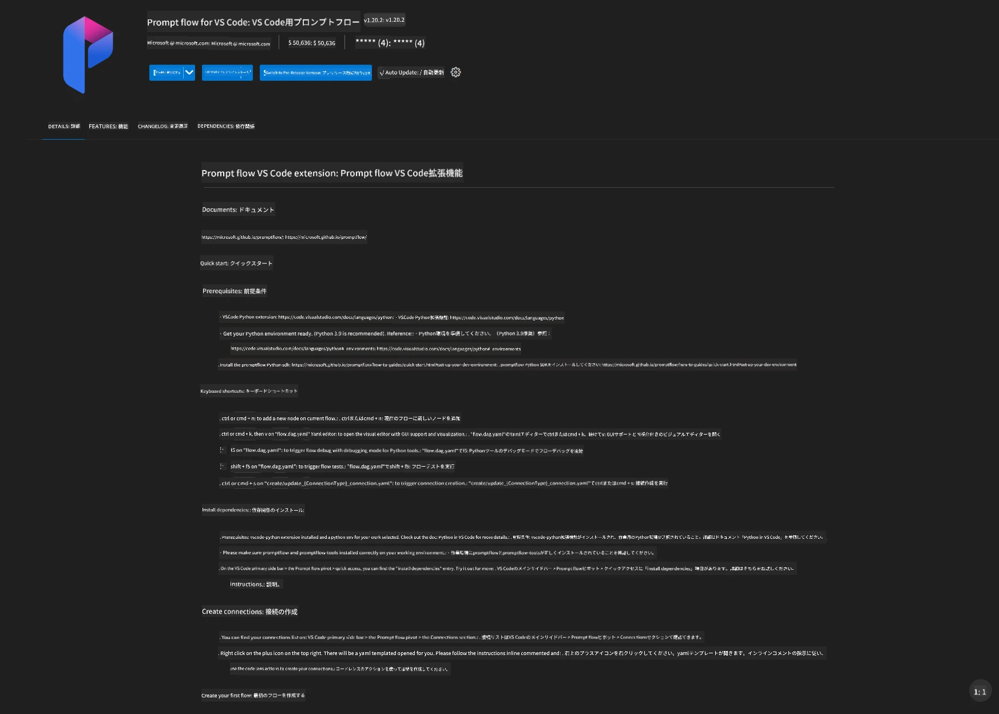
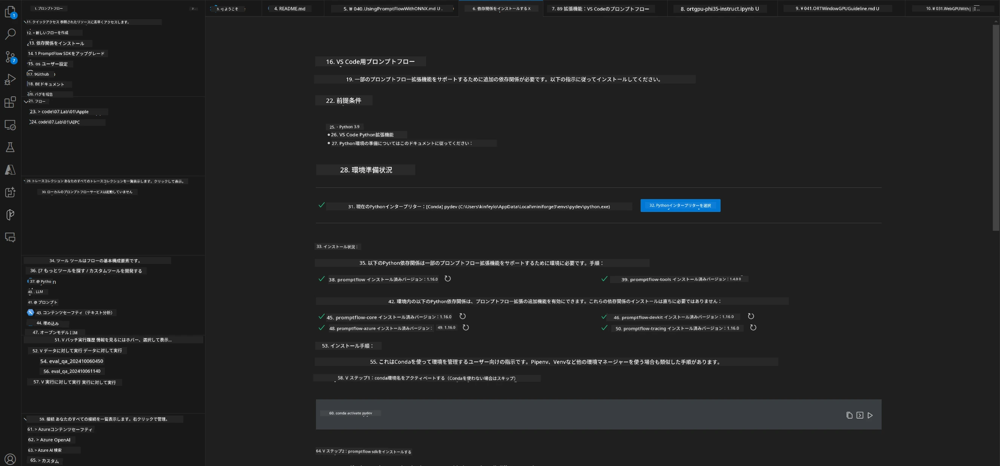
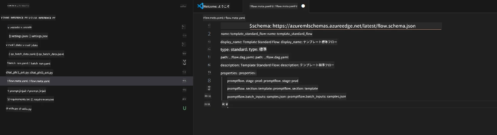
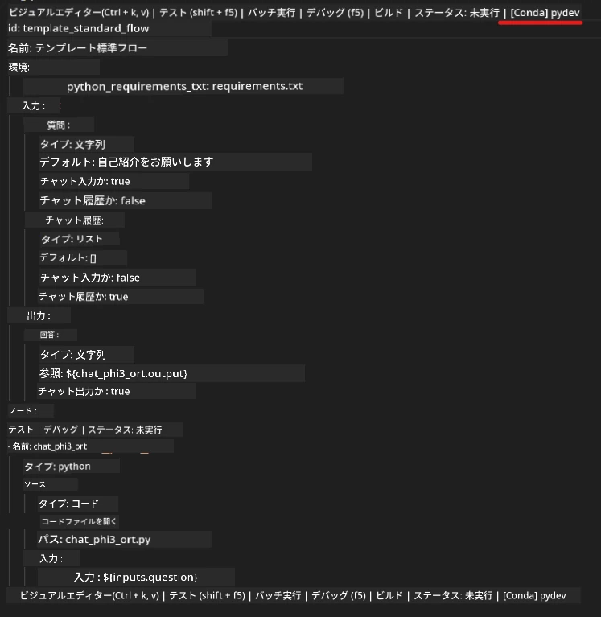
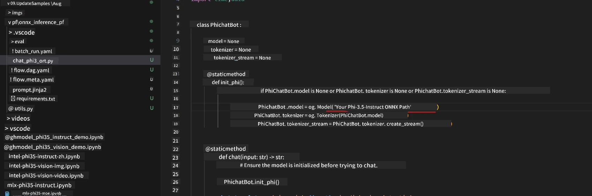
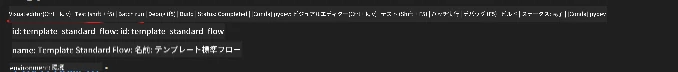
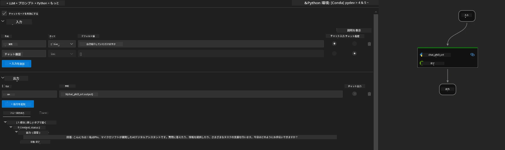
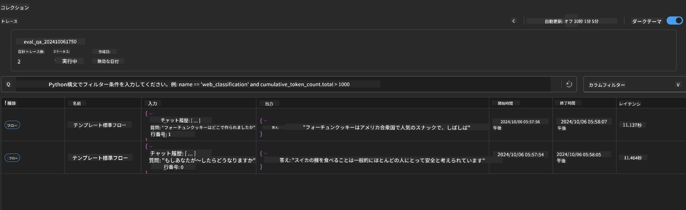

# Phi-3.5-Instruct ONNXを使ったWindows GPUでのPrompt flowソリューション作成 

以下のドキュメントは、Phi-3モデルに基づくAIアプリケーション開発のためにPromptFlowをONNX（Open Neural Network Exchange）と連携して使用する例です。

PromptFlowは、発想やプロトタイピングからテスト・評価まで、LLM（大規模言語モデル）ベースのAIアプリケーションのエンドツーエンド開発サイクルを効率化する開発ツール群です。

PromptFlowとONNXを統合することで、開発者は以下を実現できます:

- モデル性能の最適化: ONNXを活用して効率的なモデル推論と展開を実現。
- 開発の簡素化: PromptFlowを使ってワークフローを管理し、反復作業を自動化。
- 協業の促進: 統一された開発環境によりチームメンバー間の協業を支援。

**Prompt flow** は、アイデア出し、プロトタイピング、テスト、評価から本番展開や監視まで、LLMベースAIアプリ開発のエンドツーエンドサイクルを効率化する開発ツール群です。プロンプトエンジニアリングをより簡単にし、品質の高いLLMアプリの構築を可能にします。

Prompt flowはOpenAI、Azure OpenAI Service、カスタマイズ可能なモデル（HuggingfaceやローカルのLLM/SLM）に接続できます。私たちはPhi-3.5の量子化ONNXモデルをローカルアプリに展開することを目指しています。Prompt flowはビジネスの計画を支援し、Phi-3.5をベースにしたローカルソリューションの完成をサポートします。本例では、Windows GPU上でONNX Runtime GenAIライブラリを組み合わせてPrompt flowソリューションを完成させます。

## <strong>インストール</strong>

### **Windows GPU用ONNX Runtime GenAI**

Windows GPU用ONNX Runtime GenAIの設定方法は、[こちらをクリック](./ORTWindowGPUGuideline.md)してください。

### **VSCodeでのPrompt flowセットアップ**

1. Prompt flow VS Code拡張機能をインストール



2. Prompt flow VS Code拡張機能をインストールした後、拡張機能をクリックし、<strong>インストール依存関係</strong>を選択して、このガイドに従い環境にPrompt flow SDKをインストールしてください。



3. [サンプルコード](../../../../../../code/09.UpdateSamples/Aug/pf/onnx_inference_pf)をダウンロードし、VS Codeでこのサンプルを開きます。



4. <strong>flow.dag.yaml</strong>を開きPython環境を選択



   <strong>chat_phi3_ort.py</strong>を開き、Phi-3.5-instruct ONNXモデルの場所を変更



5. Prompt flowを実行してテスト

<strong>flow.dag.yaml</strong>を開きビジュアルエディタをクリック



これをクリックして実行しテスト



1. ターミナルでバッチを実行し、さらに結果を確認可能


```bash

pf run create --file batch_run.yaml --stream --name 'Your eval qa name'    

```

デフォルトブラウザで結果を確認できます




---

<!-- CO-OP TRANSLATOR DISCLAIMER START -->
**免責事項**：
本書類は AI 翻訳サービス [Co-op Translator](https://github.com/Azure/co-op-translator) を使用して翻訳されています。正確性を期していますが、自動翻訳には誤りや不正確な部分が含まれる可能性があることをご承知おきください。原文の原語版が正式な情報源とみなされるべきです。重要な情報については、専門の人間による翻訳を推奨します。本翻訳の利用により生じたいかなる誤解や解釈違いについても、当方は責任を負いかねます。
<!-- CO-OP TRANSLATOR DISCLAIMER END -->