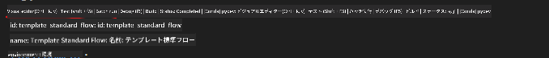

<!--
CO_OP_TRANSLATOR_METADATA:
{
  "original_hash": "92e7dac1e5af0dd7c94170fdaf6860fe",
  "translation_date": "2025-05-08T05:36:36+00:00",
  "source_file": "md/02.Application/01.TextAndChat/Phi3/UsingPromptFlowWithONNX.md",
  "language_code": "ja"
}
-->
# Windows GPUを使ってPhi-3.5-Instruct ONNXでPrompt flowソリューションを作成する方法

以下のドキュメントは、Phi-3モデルに基づくAIアプリケーション開発のためにPromptFlowをONNX（Open Neural Network Exchange）と組み合わせて使う例です。

PromptFlowは、LLM（大規模言語モデル）ベースのAIアプリケーションのアイデア出しやプロトタイピングからテスト、評価までの一連の開発サイクルを効率化するための開発ツール群です。

PromptFlowとONNXを統合することで、開発者は以下を実現できます：

- モデルパフォーマンスの最適化：ONNXを活用して効率的なモデル推論とデプロイを実現
- 開発の簡素化：PromptFlowでワークフローを管理し、繰り返し作業を自動化
- コラボレーションの強化：統一された開発環境を提供し、チーム間の連携を促進

**Prompt flow**は、LLMベースのAIアプリケーションのアイデア出し、プロトタイピング、テスト、評価から本番環境へのデプロイやモニタリングまでの開発サイクルを効率化する開発ツール群です。プロンプトエンジニアリングを格段に簡単にし、プロダクション品質のLLMアプリ構築を可能にします。

Prompt flowはOpenAI、Azure OpenAI Service、カスタマイズ可能なモデル（Huggingface、ローカルLLM/SLM）に接続可能です。Phi-3.5の量子化されたONNXモデルをローカルアプリに展開することを目指しています。Prompt flowはビジネス計画の策定やPhi-3.5に基づくローカルソリューションの完成を支援します。この例では、ONNX Runtime GenAIライブラリを組み合わせてWindows GPU上でPrompt flowソリューションを完成させます。

## **インストール**

### **Windows GPU向けONNX Runtime GenAI**

Windows GPU向けONNX Runtime GenAIの設定方法はこちらのガイドを参照してください [click here](./ORTWindowGPUGuideline.md)

### **VSCodeでPrompt flowをセットアップ**

1. Prompt flowのVS Code拡張機能をインストールします


2. Prompt flow VS Code拡張機能をインストール後、拡張機能をクリックし、**Installation dependencies**を選択して、このガイドに従いPrompt flow SDKを環境にインストールします


3. [サンプルコード](../../../../../../code/09.UpdateSamples/Aug/pf/onnx_inference_pf)をダウンロードし、VS Codeで開きます


4. **flow.dag.yaml**を開いてPython環境を選択します


   **chat_phi3_ort.py**を開いてPhi-3.5-instruct ONNXモデルの場所を変更します


5. Prompt flowを実行してテストします

**flow.dag.yaml**を開き、ビジュアルエディタをクリックします



クリック後、実行してテストします


1. ターミナルでバッチ実行してさらに結果を確認することも可能です


```bash

pf run create --file batch_run.yaml --stream --name 'Your eval qa name'    

```

結果はデフォルトのブラウザで確認できます


**免責事項**:  
本書類はAI翻訳サービス「[Co-op Translator](https://github.com/Azure/co-op-translator)」を使用して翻訳されました。正確性の向上に努めておりますが、自動翻訳には誤りや不正確な部分が含まれる可能性があることをご理解ください。原文の言語による文書が正式な情報源とみなされます。重要な情報については、専門の人間による翻訳を推奨します。本翻訳の利用により生じたいかなる誤解や誤訳についても、当方は一切責任を負いかねます。