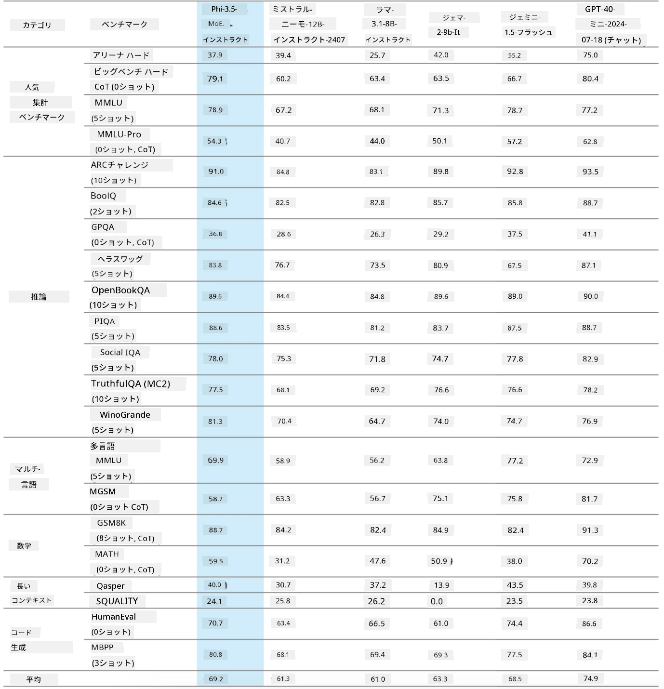
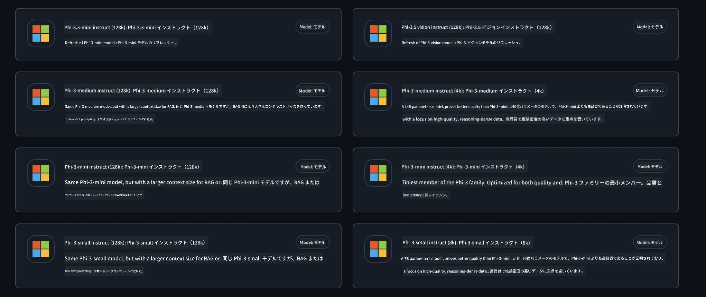
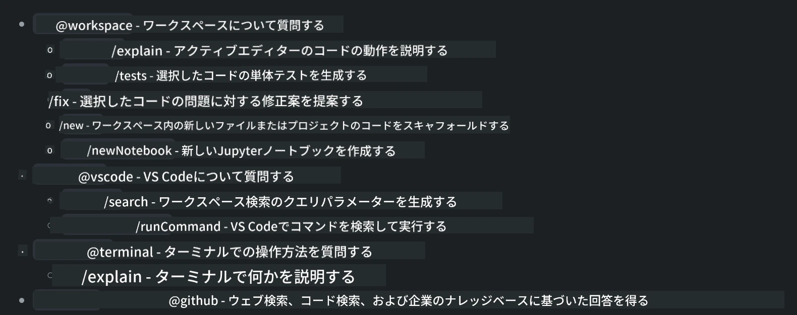
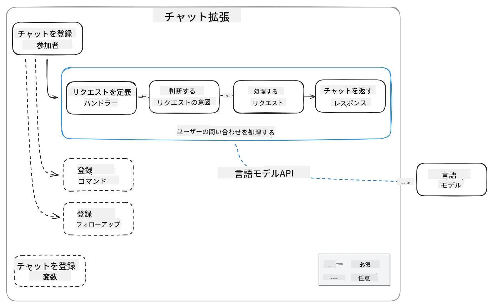
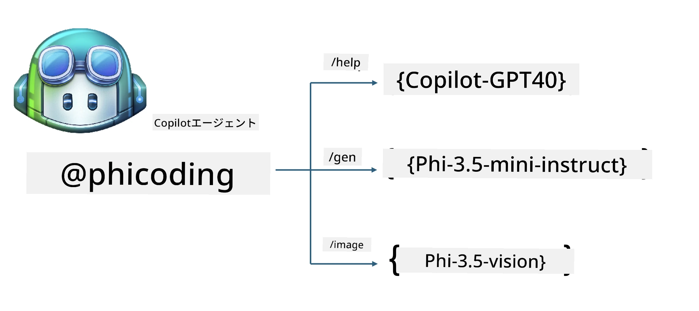
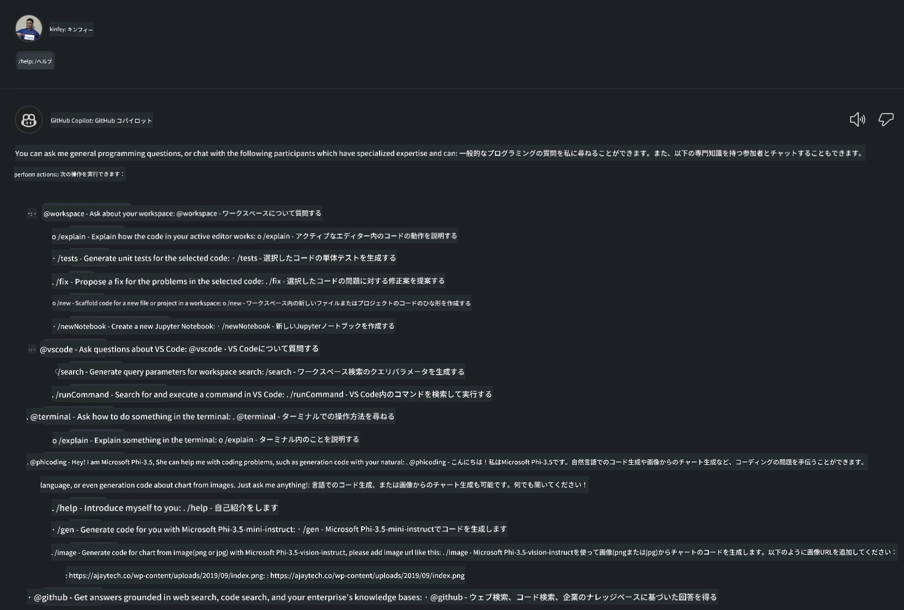
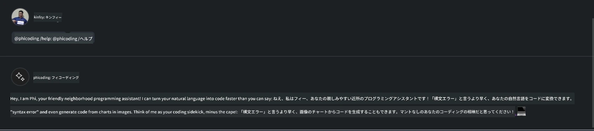
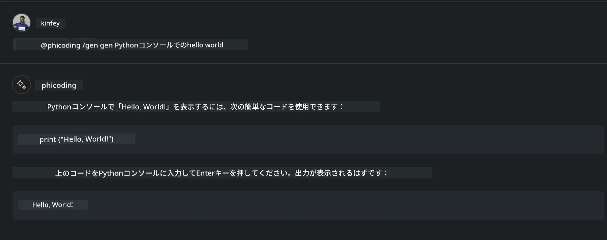
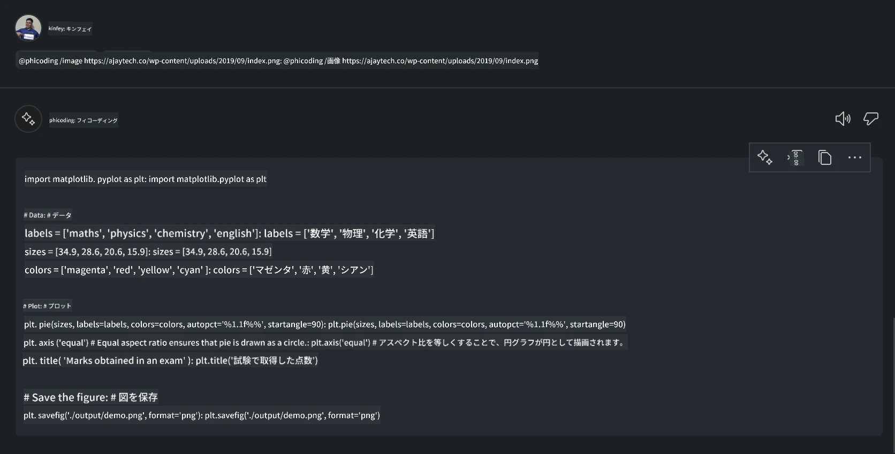

<!--
CO_OP_TRANSLATOR_METADATA:
{
  "original_hash": "35bf81388ac6917277b8d9a0c39bdc70",
  "translation_date": "2025-07-17T03:23:05+00:00",
  "source_file": "md/02.Application/02.Code/Phi3/CreateVSCodeChatAgentWithGitHubModels.md",
  "language_code": "ja"
}
-->
# **GitHub ModelsのPhi-3.5で自分だけのVisual Studio Code Chat Copilotエージェントを作成しよう**

Visual Studio Code Copilotを使っていますか？特にChatでは、さまざまなエージェントを利用して、Visual Studio Codeでのプロジェクト作成、執筆、保守の能力を向上させることができます。Visual Studio Codeは、企業や個人が自社のビジネスに基づいて異なるエージェントを作成し、独自の分野での機能を拡張できるAPIを提供しています。この記事では、GitHub Modelsの**Phi-3.5-mini-instruct (128k)** と**Phi-3.5-vision-instruct (128k)** に焦点を当てて、自分だけのVisual Studio Codeエージェントを作成する方法を紹介します。

## **GitHub ModelsのPhi-3.5について**

Phi-3/3.5ファミリーのPhi-3/3.5-mini-instructは、強力なコード理解と生成能力を持ち、Gemma-2-9bやMistral-Nemo-12B-instruct-2407よりも優れた点があります。



最新のGitHub Modelsでは、すでにPhi-3.5-mini-instruct (128k)とPhi-3.5-vision-instruct (128k)モデルへのアクセスが可能です。開発者はOpenAI SDK、Azure AI Inference SDK、REST APIを通じてこれらにアクセスできます。



***注記:*** ここではAzure AI Inference SDKの使用を推奨します。なぜなら、本番環境でAzure Model Catalogとの切り替えがよりスムーズに行えるためです。

以下は、GitHub Modelsと連携した後のコード生成シナリオにおける**Phi-3.5-mini-instruct (128k)** と**Phi-3.5-vision-instruct (128k)** の結果で、以降の例の準備にもなっています。

**デモ：GitHub Models Phi-3.5-mini-instruct (128k)によるプロンプトからのコード生成**（[こちらをクリック](../../../../../../code/09.UpdateSamples/Aug/ghmodel_phi35_instruct_demo.ipynb)）

**デモ：GitHub Models Phi-3.5-vision-instruct (128k)による画像からのコード生成**（[こちらをクリック](../../../../../../code/09.UpdateSamples/Aug/ghmodel_phi35_vision_demo.ipynb)）

## **GitHub Copilot Chat Agentについて**

GitHub Copilot Chat Agentは、コードに基づいてさまざまなプロジェクトシナリオで異なるタスクを完了できます。システムにはworkspace、github、terminal、vscodeの4つのエージェントがあります。



エージェント名の前に「@」を付けることで、対応する作業を素早く完了できます。企業向けには、要件、コーディング、テスト仕様、リリースなどの自社ビジネス関連の内容を追加することで、GitHub Copilotをベースにしたより強力な企業向けプライベート機能を持つことが可能です。

Visual Studio Code Chat Agentは現在、公式にAPIを公開しており、企業や企業の開発者が異なるソフトウェアビジネスエコシステムに基づいてエージェントを開発できます。Visual Studio Code Extension開発の手法に基づき、Visual Studio Code Chat Agent APIのインターフェースに簡単にアクセス可能です。このプロセスに基づいて開発が行えます。



開発シナリオは、GitHub Models、Azure Model Catalog、オープンソースモデルをベースにした自社構築サービスなどのサードパーティモデルAPIへのアクセスをサポートし、GitHub Copilotが提供するgpt-35-turbo、gpt-4、gpt-4oモデルも利用可能です。

## **Phi-3.5をベースにしたエージェント@phicodingの追加**

Phi-3.5のプログラミング能力を統合し、コード作成や画像生成コードなどのタスクを完了するエージェント@PHIを作成します。以下は主な機能です。

1. GitHub Copilotが提供するGPT-4oを使い、**@phicoding /help**コマンドで自己紹介を生成

2. **Phi-3.5-mini-instruct (128k)**を使い、**@phicoding /gen**コマンドでさまざまなプログラミング言語のコードを生成

3. **Phi-3.5-vision-instruct (128k)**を使い、**@phicoding /image**コマンドで画像に基づくコード生成と補完を実行



## **関連手順**

1. npmを使ってVisual Studio Code Extension開発サポートをインストール

```bash

npm install --global yo generator-code 

```

2. Visual Studio Code Extensionプラグインを作成（Typescript開発モード、名前はphiext）

```bash

yo code 

```

3. 作成したプロジェクトを開き、package.jsonを修正。関連する指示や設定、GitHub Modelsの設定も含みます。ここでGitHub Modelsのトークンを追加する必要があります。

```json

{
  "name": "phiext",
  "displayName": "phiext",
  "description": "",
  "version": "0.0.1",
  "engines": {
    "vscode": "^1.93.0"
  },
  "categories": [
    "AI",
    "Chat"
  ],
  "activationEvents": [],
  "enabledApiProposals": [
      "chatVariableResolver"
  ],
  "main": "./dist/extension.js",
  "contributes": {
    "chatParticipants": [
        {
            "id": "chat.phicoding",
            "name": "phicoding",
            "description": "Hey! I am Microsoft Phi-3.5, She can help me with coding problems, such as generation code with your natural language, or even generation code about chart from images. Just ask me anything!",
            "isSticky": true,
            "commands": [
                {
                    "name": "help",
                    "description": "Introduce myself to you"
                },
                {
                    "name": "gen",
                    "description": "Generate code for you with Microsoft Phi-3.5-mini-instruct"
                },
                {
                    "name": "image",
                    "description": "Generate code for chart from image(png or jpg) with Microsoft Phi-3.5-vision-instruct, please add image url like this : https://ajaytech.co/wp-content/uploads/2019/09/index.png"
                }
            ]
        }
    ],
    "commands": [
        {
            "command": "phicoding.namesInEditor",
            "title": "Use Microsoft Phi 3.5 in Editor"
        }
    ],
    "configuration": {
      "type": "object",
      "title": "githubmodels",
      "properties": {
        "githubmodels.endpoint": {
          "type": "string",
          "default": "https://models.inference.ai.azure.com",
          "description": "Your GitHub Models Endpoint",
          "order": 0
        },
        "githubmodels.api_key": {
          "type": "string",
          "default": "Your GitHub Models Token",
          "description": "Your GitHub Models Token",
          "order": 1
        },
        "githubmodels.phi35instruct": {
          "type": "string",
          "default": "Phi-3.5-mini-instruct",
          "description": "Your Phi-35-Instruct Model",
          "order": 2
        },
        "githubmodels.phi35vision": {
          "type": "string",
          "default": "Phi-3.5-vision-instruct",
          "description": "Your Phi-35-Vision Model",
          "order": 3
        }
      }
    }
  },
  "scripts": {
    "vscode:prepublish": "npm run package",
    "compile": "webpack",
    "watch": "webpack --watch",
    "package": "webpack --mode production --devtool hidden-source-map",
    "compile-tests": "tsc -p . --outDir out",
    "watch-tests": "tsc -p . -w --outDir out",
    "pretest": "npm run compile-tests && npm run compile && npm run lint",
    "lint": "eslint src",
    "test": "vscode-test"
  },
  "devDependencies": {
    "@types/vscode": "^1.93.0",
    "@types/mocha": "^10.0.7",
    "@types/node": "20.x",
    "@typescript-eslint/eslint-plugin": "^8.3.0",
    "@typescript-eslint/parser": "^8.3.0",
    "eslint": "^9.9.1",
    "typescript": "^5.5.4",
    "ts-loader": "^9.5.1",
    "webpack": "^5.94.0",
    "webpack-cli": "^5.1.4",
    "@vscode/test-cli": "^0.0.10",
    "@vscode/test-electron": "^2.4.1"
  },
  "dependencies": {
    "@types/node-fetch": "^2.6.11",
    "node-fetch": "^3.3.2",
    "@azure-rest/ai-inference": "latest",
    "@azure/core-auth": "latest",
    "@azure/core-sse": "latest"
  }
}


```

4. src/extension.tsを修正

```typescript

// The module 'vscode' contains the VS Code extensibility API
// Import the module and reference it with the alias vscode in your code below
import * as vscode from 'vscode';
import ModelClient from "@azure-rest/ai-inference";
import { AzureKeyCredential } from "@azure/core-auth";


interface IPhiChatResult extends vscode.ChatResult {
    metadata: {
        command: string;
    };
}


const MODEL_SELECTOR: vscode.LanguageModelChatSelector = { vendor: 'copilot', family: 'gpt-4o' };

function isValidImageUrl(url: string): boolean {
    const regex = /^(https?:\/\/.*\.(?:png|jpg))$/i;
    return regex.test(url);
}
  

// This method is called when your extension is activated
// Your extension is activated the very first time the command is executed
export function activate(context: vscode.ExtensionContext) {

    const codinghandler: vscode.ChatRequestHandler = async (request: vscode.ChatRequest, context: vscode.ChatContext, stream: vscode.ChatResponseStream, token: vscode.CancellationToken): Promise<IPhiChatResult> => {


        const config : any = vscode.workspace.getConfiguration('githubmodels');
        const endPoint: string = config.get('endpoint');
        const apiKey: string = config.get('api_key');
        const phi35instruct: string = config.get('phi35instruct');
        const phi35vision: string = config.get('phi35vision');
        
        if (request.command === 'help') {

            const content = "Welcome to Coding assistant with Microsoft Phi-3.5"; 
            stream.progress(content);


            try {
                const [model] = await vscode.lm.selectChatModels(MODEL_SELECTOR);
                if (model) {
                    const messages = [
                        vscode.LanguageModelChatMessage.User("Please help me express this content in a humorous way: I am a programming assistant who can help you convert natural language into code and generate code based on the charts in the images. output format like this : Hey I am Phi ......")
                    ];
                    const chatResponse = await model.sendRequest(messages, {}, token);
                    for await (const fragment of chatResponse.text) {
                        stream.markdown(fragment);
                    }
                }
            } catch(err) {
                console.log(err);
            }


            return { metadata: { command: 'help' } };

        }

        
        if (request.command === 'gen') {

            const content = "Welcome to use phi-3.5 to generate code";

            stream.progress(content);

            const client = new ModelClient(endPoint, new AzureKeyCredential(apiKey));

            const response = await client.path("/chat/completions").post({
              body: {
                messages: [
                  { role:"system", content: "You are a coding assistant.Help answer all code generation questions." },
                  { role:"user", content: request.prompt }
                ],
                model: phi35instruct,
                temperature: 0.4,
                max_tokens: 1000,
                top_p: 1.
              }
            });

            stream.markdown(response.body.choices[0].message.content);

            return { metadata: { command: 'gen' } };

        }


        
        if (request.command === 'image') {


            const content = "Welcome to use phi-3.5 to generate code from image(png or jpg),image url like this:https://ajaytech.co/wp-content/uploads/2019/09/index.png";

            stream.progress(content);

            if (!isValidImageUrl(request.prompt)) {
                stream.markdown('Please provide a valid image URL');
                return { metadata: { command: 'image' } };
            }
            else
            {

                const client = new ModelClient(endPoint, new AzureKeyCredential(apiKey));
    
                const response = await client.path("/chat/completions").post({
                    body: {
                      messages: [
                        { role: "system", content: "You are a helpful assistant that describes images in details." },
                        { role: "user", content: [
                            { type: "text", text: "Please generate code according to the chart in the picture according to the following requirements\n1. Keep all information in the chart, including data and text\n2. Do not generate additional information that is not included in the chart\n3. Please extract data from the picture, do not generate it from csv\n4. Please save the regenerated chart as a chart and save it to ./output/demo.png"},
                            { type: "image_url", image_url: {url: request.prompt}
                            }
                          ]
                        }
                      ],
                      model: phi35vision,
                      temperature: 0.4,
                      max_tokens: 2048,
                      top_p: 1.
                    }
                  });
    
                
                stream.markdown(response.body.choices[0].message.content);
    
                return { metadata: { command: 'image' } };
            }


        }


        return { metadata: { command: '' } };
    };


    const phi_ext = vscode.chat.createChatParticipant("chat.phicoding", codinghandler);

    phi_ext.iconPath = new vscode.ThemeIcon('sparkle');


    phi_ext.followupProvider = {
        provideFollowups(result: IPhiChatResult, context: vscode.ChatContext, token: vscode.CancellationToken) {
            return [{
                prompt: 'Let us coding with Phi-3.5 😋😋😋😋',
                label: vscode.l10n.t('Enjoy coding with Phi-3.5'),
                command: 'help'
            } satisfies vscode.ChatFollowup];
        }
    };

    context.subscriptions.push(phi_ext);
}

// This method is called when your extension is deactivated
export function deactivate() {}


```

6. 実行

***/help***



***@phicoding /help***



***@phicoding /gen***



***@phicoding /image***



サンプルコードのダウンロードはこちら：[click](../../../../../../code/09.UpdateSamples/Aug/vscode)

## **リソース**

1. GitHub Modelsにサインアップ [https://gh.io/models](https://gh.io/models)

2. Visual Studio Code Extension開発を学ぶ [https://code.visualstudio.com/api/get-started/your-first-extension](https://code.visualstudio.com/api/get-started/your-first-extension)

3. Visual Studio Code Copilot Chat APIについて学ぶ [https://code.visualstudio.com/api/extension-guides/chat](https://code.visualstudio.com/api/extension-guides/chat)

**免責事項**：  
本書類はAI翻訳サービス「[Co-op Translator](https://github.com/Azure/co-op-translator)」を使用して翻訳されました。正確性を期しておりますが、自動翻訳には誤りや不正確な部分が含まれる可能性があります。原文の言語によるオリジナル文書が正式な情報源とみなされるべきです。重要な情報については、専門の人間による翻訳を推奨します。本翻訳の利用により生じたいかなる誤解や誤訳についても、当方は責任を負いかねます。
