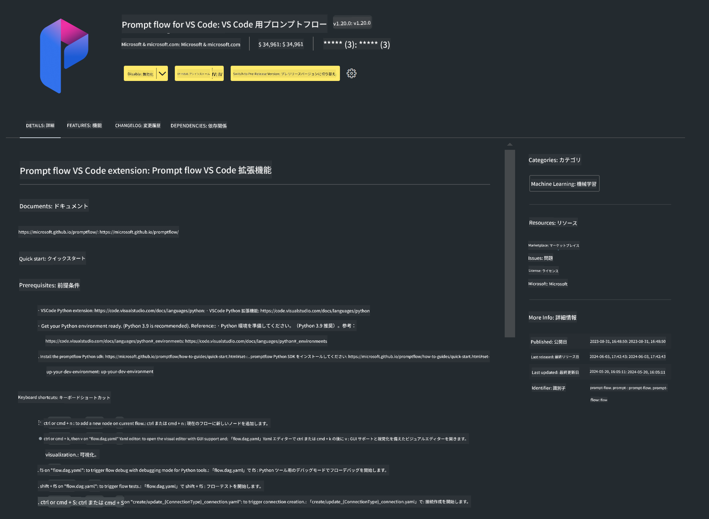

<!--
CO_OP_TRANSLATOR_METADATA:
{
  "original_hash": "a4ef39027902e82f2c33d568d2a2259a",
  "translation_date": "2025-05-08T05:31:35+00:00",
  "source_file": "md/02.Application/02.Code/Phi3/VSCodeExt/HOL/AIPC/01.Installations.md",
  "language_code": "ja"
}
-->
# **ラボ 0 - インストール**

ラボに入ると、関連する環境を設定する必要があります：


### **1. Python 3.11+**

Python環境の設定にはminiforgeの使用を推奨します。

miniforgeの設定については、[https://github.com/conda-forge/miniforge](https://github.com/conda-forge/miniforge) を参照してください。

miniforgeを設定したら、Power Shellで以下のコマンドを実行してください。

```bash

conda create -n pyenv python==3.11.8 -y

conda activate pyenv

```


### **2. Prompt flow SDKのインストール**

ラボ1ではPrompt flowを使用するため、Prompt flow SDKを設定する必要があります。

```bash

pip install promptflow --upgrade

```

このコマンドでpromptflow sdkが確認できます。

```bash

pf --version

```

### **3. Visual Studio Code Prompt flow拡張機能のインストール**




### **4. Intel NPUアクセラレーションライブラリ**

Intelの新世代プロセッサはNPUをサポートしています。ローカルでLLMやSLMをNPUで実行したい場合は、***Intel NPU Acceleration Library*** を利用できます。詳細は[https://github.com/microsoft/PhiCookBook/blob/main/md/01.Introduction/03/AIPC_Inference.md](https://github.com/microsoft/PhiCookBook/blob/main/md/01.Introduction/03/AIPC_Inference.md) をご覧ください。

bashでIntel NPU Acceleration Libraryをインストールします。

```bash

pip install intel-npu-acceleration-library

```

***Note***: このライブラリはtransformers ***4.40.2*** をサポートしているため、バージョンを確認してください。


### **5. その他のPythonライブラリ**

requirements.txtを作成し、以下の内容を追加してください。

```txt

notebook
numpy 
scipy 
scikit-learn 
matplotlib 
pandas 
pillow 
graphviz

```


### **6. NVMのインストール**

Powershellでnvmをインストールします。

```bash

winget install -e --id CoreyButler.NVMforWindows

```

nodejs 18.20をインストールします。

```bash

nvm install 18.20.0

nvm use 18.20.0

```

### **7. Visual Studio Code 開発サポートのインストール**

```bash

npm install --global yo generator-code

```

おめでとうございます！SDKの設定が正常に完了しました。次はハンズオンのステップに進んでください。

**免責事項**：  
本書類はAI翻訳サービス[Co-op Translator](https://github.com/Azure/co-op-translator)を使用して翻訳されています。正確性を期していますが、自動翻訳には誤りや不正確な部分が含まれる可能性があることをご承知ください。原文の言語による文書が正式な情報源とみなされます。重要な情報については、専門の人間による翻訳を推奨します。本翻訳の利用により生じた誤解や解釈の違いについて、当方は一切の責任を負いかねます。