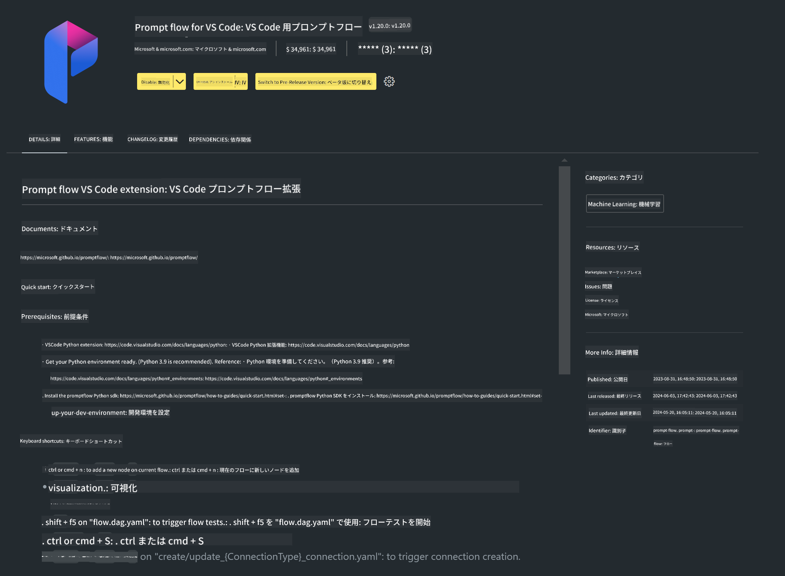

<!--
CO_OP_TRANSLATOR_METADATA:
{
  "original_hash": "e354f9cd277d8c4db97c6cc64730b8f1",
  "translation_date": "2025-04-04T12:51:03+00:00",
  "source_file": "md\\02.Application\\02.Code\\Phi3\\VSCodeExt\\HOL\\AIPC\\01.Installations.md",
  "language_code": "ja"
}
-->
# **Lab 0 - インストール**

Labに入る際には、関連する環境を設定する必要があります。

### **1. Python 3.11+**

Python環境を設定するには、miniforgeを使用することを推奨します。

miniforgeの設定については、[https://github.com/conda-forge/miniforge](https://github.com/conda-forge/miniforge)を参照してください。

miniforgeを設定した後、PowerShellで以下のコマンドを実行してください。

```bash

conda create -n pyenv python==3.11.8 -y

conda activate pyenv

```

### **2. Prompt flow SDKのインストール**

Lab 1ではPrompt flowを使用するため、Prompt flow SDKを設定する必要があります。

```bash

pip install promptflow --upgrade

```

以下のコマンドでPrompt flow SDKを確認できます。

```bash

pf --version

```

### **3. Visual Studio Code Prompt flow拡張機能のインストール**



### **4. Intel NPUアクセラレーションライブラリ**

Intelの新世代プロセッサはNPUをサポートしています。NPUを使用してLLMやSLMをローカルで実行したい場合は、***Intel NPUアクセラレーションライブラリ***を使用できます。詳細については、[https://github.com/microsoft/PhiCookBook/blob/main/md/01.Introduction/03/AIPC_Inference.md](https://github.com/microsoft/PhiCookBook/blob/main/md/01.Introduction/03/AIPC_Inference.md)を参照してください。

bashでIntel NPUアクセラレーションライブラリをインストールします。

```bash

pip install intel-npu-acceleration-library

```

***Note***: このライブラリはtransformers ***4.40.2***をサポートしていることに注意してください。バージョンを確認してください。

### **5. その他のPythonライブラリ**

requirements.txtを作成し、以下の内容を追加します。

```txt

notebook
numpy 
scipy 
scikit-learn 
matplotlib 
pandas 
pillow 
graphviz

```

### **6. NVMのインストール**

Powershellでnvmをインストールします。

```bash

winget install -e --id CoreyButler.NVMforWindows

```

Node.js 18.20をインストールします。

```bash

nvm install 18.20.0

nvm use 18.20.0

```

### **7. Visual Studio Code開発サポートのインストール**

```bash

npm install --global yo generator-code

```

おめでとうございます！SDKの設定が完了しました。次は実践的なステップに進みましょう。

**免責事項**:  
この文書はAI翻訳サービス[Co-op Translator](https://github.com/Azure/co-op-translator)を使用して翻訳されています。正確性を追求しておりますが、自動翻訳には誤りや不正確な箇所が含まれる可能性があります。原文（元の言語の文書）が信頼できる情報源とみなされるべきです。重要な情報については、専門の人間による翻訳をお勧めします。この翻訳の利用に起因する誤解や誤解釈について、当社は一切の責任を負いません。