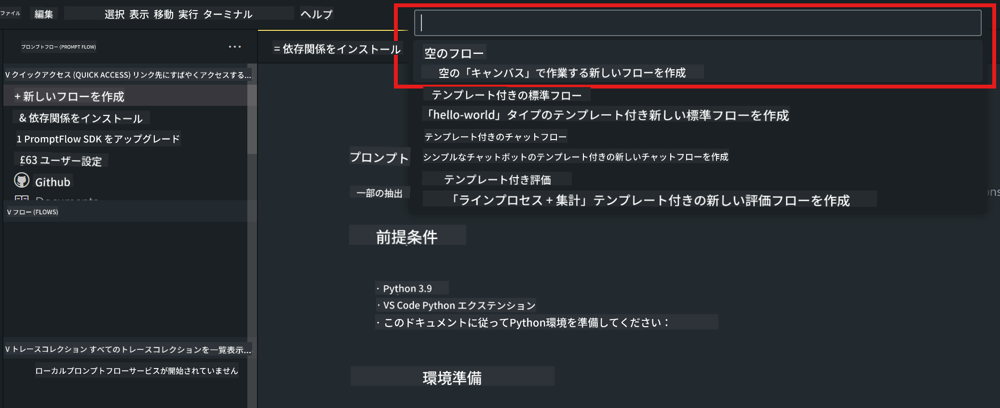
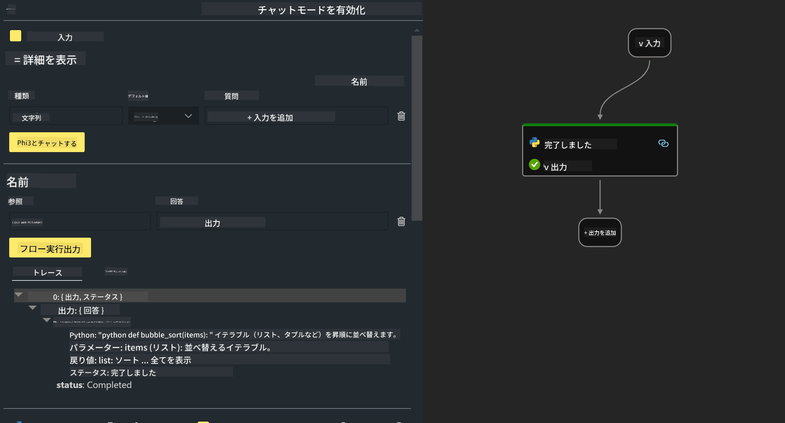

<!--
CO_OP_TRANSLATOR_METADATA:
{
  "original_hash": "b65fb1164cd818b78a83ac6b8021e4b4",
  "translation_date": "2025-04-04T12:52:04+00:00",
  "source_file": "md\\02.Application\\02.Code\\Phi3\\VSCodeExt\\HOL\\AIPC\\02.PromptflowWithNPU.md",
  "language_code": "ja"
}
-->
# **Lab 2 - Phi-3-miniを使用したAIPCでのPrompt flow実行**

## **Prompt flowとは**

Prompt flowは、LLMベースのAIアプリケーションのアイデア出しからプロトタイピング、テスト、評価、プロダクション展開、監視までの開発サイクルを簡素化するための開発ツール群です。これにより、プロンプトエンジニアリングが容易になり、プロダクション品質のLLMアプリを構築できるようになります。

Prompt flowを使用することで、以下のことが可能になります：

- LLM、プロンプト、Pythonコード、その他のツールをリンクさせた実行可能なワークフローを作成できます。

- 特にLLMとのやり取りを簡単にデバッグし、フローを繰り返し改善できます。

- フローを評価し、より大規模なデータセットを使用して品質とパフォーマンス指標を計算できます。

- テストと評価をCI/CDシステムに統合し、フローの品質を確保できます。

- 選択した提供プラットフォームにフローをデプロイしたり、アプリのコードベースに簡単に統合できます。

- （オプションですが推奨）Azure AIのクラウド版Prompt flowを活用してチームと共同作業が可能です。

## **AIPCとは**

AI PCには、CPU、GPU、NPUが搭載されており、それぞれが特定のAIアクセラレーション機能を持っています。NPU（ニューラルプロセッシングユニット）は、人工知能（AI）や機械学習（ML）のタスクをクラウドに送信せず、PC上で直接処理するための専用アクセラレータです。GPUやCPUもこれらのタスクを処理できますが、NPUは特に低電力のAI計算に優れています。AI PCは、コンピュータの動作方法において根本的な変化をもたらします。これは以前存在しなかった問題の解決策ではなく、日常のPC利用における大きな改善を約束するものです。

では、具体的にどのように機能するのでしょうか？生成AIや大量の公開データで訓練された大規模なLLMと比較して、PC上で実行されるAIはほぼすべての面でより身近なものです。この概念は理解しやすく、クラウドにアクセスする必要がなく、自分のデータで訓練されるため、その利点はより広い層にとって即座に魅力的なものとなります。

近い将来、AI PCの世界では、個人アシスタントや小規模なAIモデルがPC上で直接動作し、日々の活動を個人的でプライベートかつ安全に強化する役割を果たします。例えば、会議の議事録を取る、ファンタジーフットボールリーグを整理する、写真や動画編集の自動化、家族の到着・出発時間に基づいた完璧な旅行計画を作成する、といったことが可能になります。

## **AIPC上での生成コードフローの構築**

***Note*** ：環境インストールをまだ完了していない場合は、[Lab 0 -Installations](./01.Installations.md)をご覧ください。

1. Visual Studio CodeでPrompt flow Extensionを開き、空のフロープロジェクトを作成します。



2. 入力と出力のパラメータを追加し、新しいフローとしてPythonコードを追加します。



以下の構造（flow.dag.yaml）を参考にしてフローを構築してください。

```yaml

inputs:
  question:
    type: string
    default: how to write Bubble Algorithm
outputs:
  answer:
    type: string
    reference: ${Chat_With_Phi3.output}
nodes:
- name: Chat_With_Phi3
  type: python
  source:
    type: code
    path: Chat_With_Phi3.py
  inputs:
    question: ${inputs.question}


```

3. ***Chat_With_Phi3.py*** にコードを追加します。

```python


from promptflow.core import tool

# import torch
from transformers import AutoTokenizer, pipeline,TextStreamer
import intel_npu_acceleration_library as npu_lib

import warnings

import asyncio
import platform

class Phi3CodeAgent:
    
    model = None
    tokenizer = None
    text_streamer = None
    
    model_id = "microsoft/Phi-3-mini-4k-instruct"

    @staticmethod
    def init_phi3():
        
        if Phi3CodeAgent.model is None or Phi3CodeAgent.tokenizer is None or Phi3CodeAgent.text_streamer is None:
            Phi3CodeAgent.model = npu_lib.NPUModelForCausalLM.from_pretrained(
                                    Phi3CodeAgent.model_id,
                                    torch_dtype="auto",
                                    dtype=npu_lib.int4,
                                    trust_remote_code=True
                                )
            Phi3CodeAgent.tokenizer = AutoTokenizer.from_pretrained(Phi3CodeAgent.model_id)
            Phi3CodeAgent.text_streamer = TextStreamer(Phi3CodeAgent.tokenizer, skip_prompt=True)

    

    @staticmethod
    def chat_with_phi3(prompt):
        
        Phi3CodeAgent.init_phi3()

        messages = "<|system|>You are a AI Python coding assistant. Please help me to generate code in Python.The answer only genertated Python code, but any comments and instructions do not need to be generated<|end|><|user|>" + prompt +"<|end|><|assistant|>"


        generation_args = {
            "max_new_tokens": 1024,
            "return_full_text": False,
            "temperature": 0.3,
            "do_sample": False,
            "streamer": Phi3CodeAgent.text_streamer,
        }

        pipe = pipeline(
            "text-generation",
            model=Phi3CodeAgent.model,
            tokenizer=Phi3CodeAgent.tokenizer,
            # **generation_args
        )

        result = ''

        with warnings.catch_warnings():
            warnings.simplefilter("ignore")
            response = pipe(messages, **generation_args)
            result =response[0]['generated_text']
            return result


@tool
def my_python_tool(question: str) -> str:
    if platform.system() == 'Windows':
        asyncio.set_event_loop_policy(asyncio.WindowsSelectorEventLoopPolicy())
    return Phi3CodeAgent.chat_with_phi3(question)


```

4. デバッグまたは実行でフローをテストし、生成コードが正しいか確認します。


5. ターミナルで開発APIとしてフローを実行します。

```

pf flow serve --source ./ --port 8080 --host localhost   

```

PostmanやThunder Clientでテストすることができます。

### **注意事項**

1. 初回実行には時間がかかります。Hugging face CLIからphi-3モデルをダウンロードすることをお勧めします。

2. Intel NPUの計算能力を考慮して、Phi-3-mini-4k-instructを使用することを推奨します。

3. Intel NPU Accelerationを使用してINT4変換を量子化していますが、サービスを再実行する場合はキャッシュとnc_workshopフォルダを削除する必要があります。

## **リソース**

1. Promptflowの学習 [https://microsoft.github.io/promptflow/](https://microsoft.github.io/promptflow/)

2. Intel NPU Accelerationの学習 [https://github.com/intel/intel-npu-acceleration-library](https://github.com/intel/intel-npu-acceleration-library)

3. サンプルコードのダウンロード [Local NPU Agent Sample Code](../../../../../../../../../code/07.Lab/01/AIPC)

**免責事項**:  
この文書はAI翻訳サービス[Co-op Translator](https://github.com/Azure/co-op-translator)を使用して翻訳されています。正確さを期すよう努めておりますが、自動翻訳には誤りや不正確な表現が含まれる可能性があることをご承知おきください。原文（元の言語で記載された文書）が信頼できる唯一の情報源と見なされるべきです。重要な情報については、専門の人間による翻訳を推奨します。この翻訳の利用により生じる誤解や誤認について、当方は一切の責任を負いかねます。