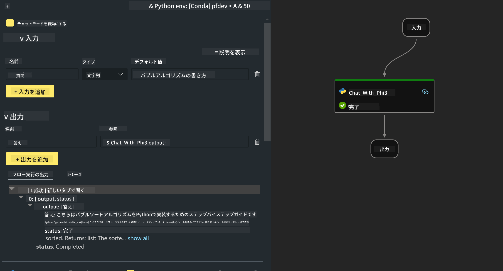

<!--
CO_OP_TRANSLATOR_METADATA:
{
  "original_hash": "bc29f7fe7fc16bed6932733eac8c81b8",
  "translation_date": "2025-05-08T05:30:48+00:00",
  "source_file": "md/02.Application/02.Code/Phi3/VSCodeExt/HOL/AIPC/02.PromptflowWithNPU.md",
  "language_code": "ja"
}
-->
# **ラボ 2 - AIPCでPhi-3-miniを使ったPrompt flowの実行**

## **Prompt flowとは**

Prompt flowは、LLMベースのAIアプリケーションのアイデア出し、プロトタイピング、テスト、評価から本番展開や監視まで、エンドツーエンドの開発サイクルを効率化するための開発ツール群です。プロンプトエンジニアリングを格段に簡単にし、実用レベルのLLMアプリを構築できるようにします。

Prompt flowを使うと、以下が可能になります：

- LLM、プロンプト、Pythonコード、その他のツールをつなげて実行可能なワークフローを作成できる。

- 特にLLMとのやり取りを簡単にデバッグ・反復できる。

- 大規模データセットでワークフローを評価し、品質やパフォーマンス指標を算出できる。

- テストや評価をCI/CDシステムに組み込んでワークフローの品質を確保できる。

- 選択したサービングプラットフォームにワークフローを展開したり、アプリのコードベースに簡単に統合できる。

- （任意だが強く推奨）Azure AIのクラウド版Prompt flowを活用してチームで協働できる。

## **AIPCとは**

AI PCはCPU、GPU、NPUを搭載しており、それぞれ特有のAIアクセラレーション機能を持っています。NPU（ニューラルプロセッシングユニット）は、AIや機械学習の処理をクラウドに送るのではなく、PC上で直接処理する専用アクセラレータです。GPUやCPUでも処理可能ですが、NPUは特に低消費電力でのAI計算に優れています。AI PCは、コンピューターの使い方に根本的な変化をもたらすもので、これまで存在しなかった問題の解決策ではなく、日常のPC利用を大幅に向上させることを約束します。

具体的にはどう動くのか？大量の公開データで学習した巨大な大規模言語モデル（LLM）や生成AIと比べて、PC上で動くAIはより手軽で身近なものになります。クラウドにアクセスする必要がなく、自分のデータで学習されるため、より広い層にとって即効性のあるメリットが得られます。

近い将来、AI PCの世界ではパーソナルアシスタントや小規模AIモデルがPC上で直接動作し、会議の議事録作成、ファンタジーフットボールリーグの管理、写真・動画編集の自動化、家族の集まりの到着・出発時間に合わせた完璧な旅程作成など、日常の作業にプライベートで安全なAIの強化機能を提供します。

## **AIPCでの生成コードフローの構築**

***Note*** ：環境構築がまだの場合は、[Lab 0 -Installations](./01.Installations.md)をご参照ください。

1. Visual Studio CodeのPrompt flow拡張機能を開き、空のフロープロジェクトを作成します。


2. 入力と出力パラメータを追加し、新しいフローとしてPythonコードを追加します。



この構造（flow.dag.yaml）を参考にフローを構築できます。

```yaml

inputs:
  question:
    type: string
    default: how to write Bubble Algorithm
outputs:
  answer:
    type: string
    reference: ${Chat_With_Phi3.output}
nodes:
- name: Chat_With_Phi3
  type: python
  source:
    type: code
    path: Chat_With_Phi3.py
  inputs:
    question: ${inputs.question}


```

3. ***Chat_With_Phi3.py***にコードを追加します。

```python


from promptflow.core import tool

# import torch
from transformers import AutoTokenizer, pipeline,TextStreamer
import intel_npu_acceleration_library as npu_lib

import warnings

import asyncio
import platform

class Phi3CodeAgent:
    
    model = None
    tokenizer = None
    text_streamer = None
    
    model_id = "microsoft/Phi-3-mini-4k-instruct"

    @staticmethod
    def init_phi3():
        
        if Phi3CodeAgent.model is None or Phi3CodeAgent.tokenizer is None or Phi3CodeAgent.text_streamer is None:
            Phi3CodeAgent.model = npu_lib.NPUModelForCausalLM.from_pretrained(
                                    Phi3CodeAgent.model_id,
                                    torch_dtype="auto",
                                    dtype=npu_lib.int4,
                                    trust_remote_code=True
                                )
            Phi3CodeAgent.tokenizer = AutoTokenizer.from_pretrained(Phi3CodeAgent.model_id)
            Phi3CodeAgent.text_streamer = TextStreamer(Phi3CodeAgent.tokenizer, skip_prompt=True)

    

    @staticmethod
    def chat_with_phi3(prompt):
        
        Phi3CodeAgent.init_phi3()

        messages = "<|system|>You are a AI Python coding assistant. Please help me to generate code in Python.The answer only genertated Python code, but any comments and instructions do not need to be generated<|end|><|user|>" + prompt +"<|end|><|assistant|>"


        generation_args = {
            "max_new_tokens": 1024,
            "return_full_text": False,
            "temperature": 0.3,
            "do_sample": False,
            "streamer": Phi3CodeAgent.text_streamer,
        }

        pipe = pipeline(
            "text-generation",
            model=Phi3CodeAgent.model,
            tokenizer=Phi3CodeAgent.tokenizer,
            # **generation_args
        )

        result = ''

        with warnings.catch_warnings():
            warnings.simplefilter("ignore")
            response = pipe(messages, **generation_args)
            result =response[0]['generated_text']
            return result


@tool
def my_python_tool(question: str) -> str:
    if platform.system() == 'Windows':
        asyncio.set_event_loop_policy(asyncio.WindowsSelectorEventLoopPolicy())
    return Phi3CodeAgent.chat_with_phi3(question)


```

4. デバッグまたは実行からフローをテストして、生成コードが正常に動作するか確認します。


5. ターミナルで開発APIとしてフローを実行します。

```

pf flow serve --source ./ --port 8080 --host localhost   

```

PostmanやThunder Clientでテスト可能です。

### **Note**

1. 初回の実行は時間がかかります。Hugging face CLIからphi-3モデルをダウンロードすることを推奨します。

2. Intel NPUの計算能力が限られているため、Phi-3-mini-4k-instructの使用を推奨します。

3. Intel NPU AccelerationでINT4量子化変換を行っていますが、サービスを再実行する場合はキャッシュとnc_workshopフォルダを削除する必要があります。

## **リソース**

1. Promptflowの学習 [https://microsoft.github.io/promptflow/](https://microsoft.github.io/promptflow/)

2. Intel NPU Accelerationの学習 [https://github.com/intel/intel-npu-acceleration-library](https://github.com/intel/intel-npu-acceleration-library)

3. サンプルコードのダウンロード [Local NPU Agent Sample Code](../../../../../../../../../code/07.Lab/01/AIPC)

**免責事項**:  
本書類はAI翻訳サービス「[Co-op Translator](https://github.com/Azure/co-op-translator)」を使用して翻訳されています。正確性の確保に努めておりますが、自動翻訳には誤りや不正確な箇所が含まれる可能性があります。原文の言語による文書が正式な情報源とみなされるべきです。重要な情報については、専門の人間による翻訳を推奨します。本翻訳の利用により生じた誤解や解釈の相違について、当方は一切責任を負いません。