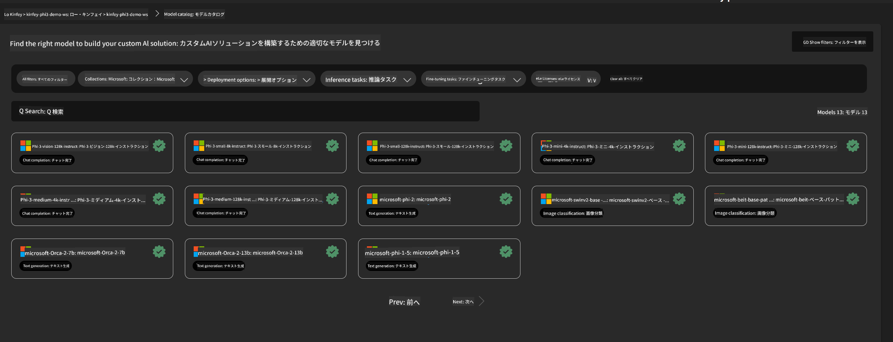
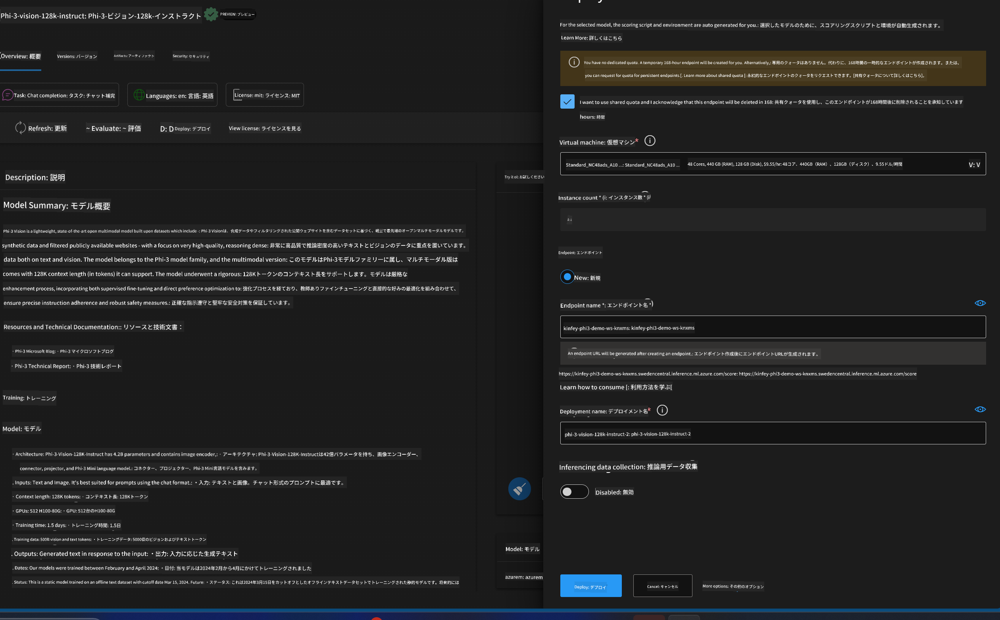
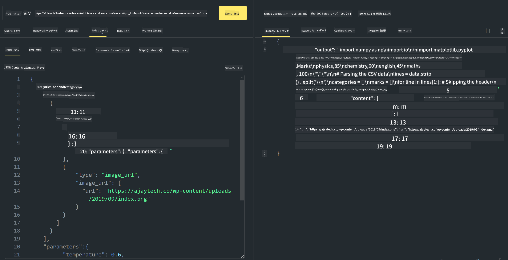

<!--
CO_OP_TRANSLATOR_METADATA:
{
  "original_hash": "20cb4e6ac1686248e8be913ccf6c2bc2",
  "translation_date": "2025-05-08T05:32:09+00:00",
  "source_file": "md/02.Application/02.Code/Phi3/VSCodeExt/HOL/AIPC/03.DeployPhi3VisionOnAzure.md",
  "language_code": "ja"
}
-->
# **ラボ3 - Azure Machine Learning Service上でのPhi-3-visionのデプロイ**

ローカルコードの本番環境へのデプロイにはNPUを使用し、そこからPHI-3-VISIONを導入して、画像からコードを生成する機能を実現します。

この紹介では、Azure Machine Learning Service上でModel As ServiceとしてPhi-3 Visionサービスを素早く構築する方法を説明します。

***Note***：Phi-3 Visionは高速でコンテンツを生成するために高い計算能力を必要とします。これを実現するためにクラウドの計算資源を活用します。


### **1. Azure Machine Learning Serviceの作成**

AzureポータルでAzure Machine Learning Serviceを作成する必要があります。作成方法については、こちらのリンクをご覧ください [https://learn.microsoft.com/azure/machine-learning/quickstart-create-resources?view=azureml-api-2](https://learn.microsoft.com/azure/machine-learning/quickstart-create-resources?view=azureml-api-2)


### **2. Azure Machine Learning ServiceでPhi-3 Visionを選択**




### **3. Azure上でPhi-3-Visionをデプロイ**





### **4. Postmanでエンドポイントをテスト**





***Note***

1. 送信するパラメータにはAuthorization、azureml-model-deployment、Content-Typeを含める必要があります。これらはデプロイ情報から確認してください。

2. パラメータ送信にはPhi-3-Visionが画像リンクを受け取る必要があります。パラメータの送信方法はGPT-4-Visionの方法を参照してください。例えば、

```json

{
  "input_data":{
    "input_string":[
      {
        "role":"user",
        "content":[ 
          {
            "type": "text",
            "text": "You are a Python coding assistant.Please create Python code for image "
          },
          {
              "type": "image_url",
              "image_url": {
                "url": "https://ajaytech.co/wp-content/uploads/2019/09/index.png"
              }
          }
        ]
      }
    ],
    "parameters":{
          "temperature": 0.6,
          "top_p": 0.9,
          "do_sample": false,
          "max_new_tokens": 2048
    }
  }
}

```

3. Postメソッドで**/score**を呼び出します

**おめでとうございます**！これでPHI-3-VISIONの高速デプロイが完了し、画像からコードを生成する方法を試せました。次はNPUとクラウドを組み合わせてアプリケーションを構築しましょう。

**免責事項**：  
本書類はAI翻訳サービス「Co-op Translator」（https://github.com/Azure/co-op-translator）を使用して翻訳されました。正確性の向上に努めておりますが、自動翻訳には誤りや不正確な部分が含まれる可能性があることをご理解ください。原文の言語によるオリジナル文書が正式な情報源とみなされます。重要な情報については、専門の人間による翻訳を推奨いたします。本翻訳の利用により生じたいかなる誤解や誤訳についても、当方は一切の責任を負いかねます。