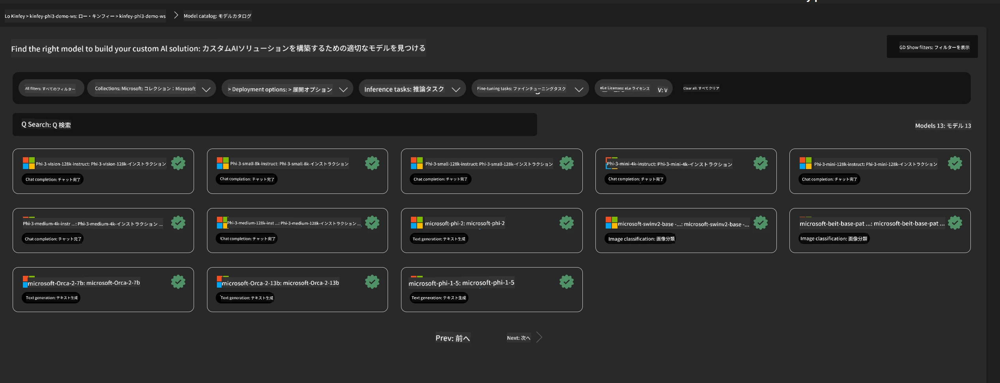
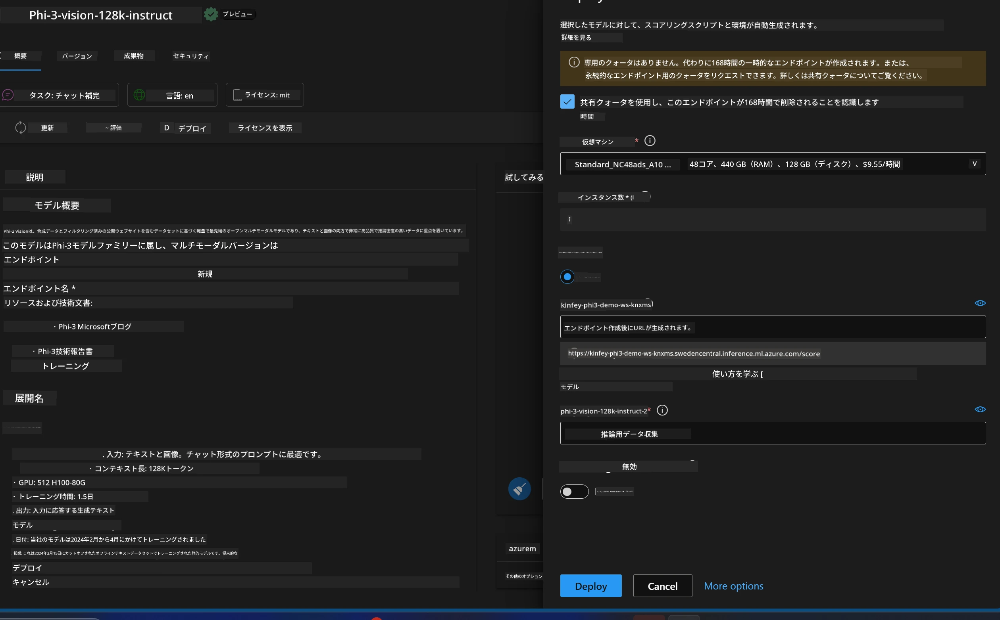
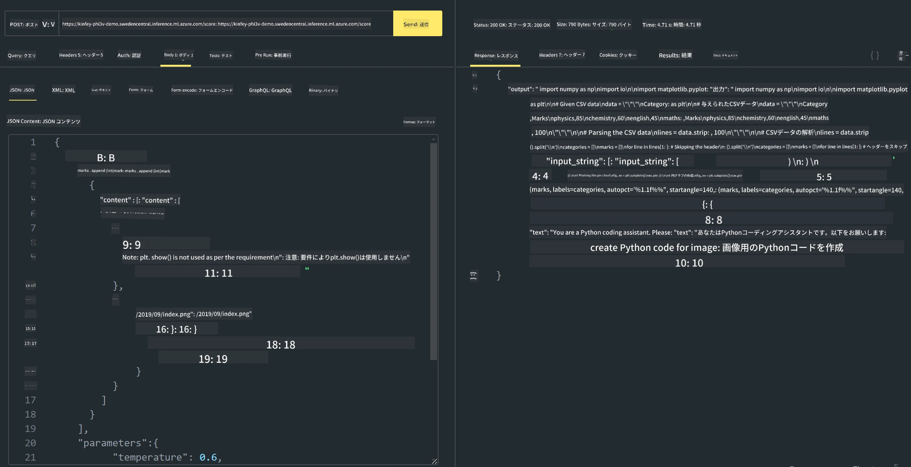

<!--
CO_OP_TRANSLATOR_METADATA:
{
  "original_hash": "20cb4e6ac1686248e8be913ccf6c2bc2",
  "translation_date": "2025-07-17T04:04:55+00:00",
  "source_file": "md/02.Application/02.Code/Phi3/VSCodeExt/HOL/AIPC/03.DeployPhi3VisionOnAzure.md",
  "language_code": "ja"
}
-->
# **ラボ 3 - Azure Machine Learning Service 上での Phi-3-vision のデプロイ**

ローカルコードの本番展開を NPU を使って完了し、そこに PHI-3-VISION の機能を導入して、画像からコードを生成する仕組みを実現します。

この紹介では、Azure Machine Learning Service 上で Model As Service として Phi-3 Vision サービスを素早く構築する方法を説明します。

***注記***：Phi-3 Vision は高速にコンテンツを生成するために計算リソースが必要です。これを実現するためにクラウドの計算力を活用します。


### **1. Azure Machine Learning Service の作成**

Azure ポータルで Azure Machine Learning Service を作成する必要があります。作成方法については、こちらのリンクをご参照ください [https://learn.microsoft.com/azure/machine-learning/quickstart-create-resources?view=azureml-api-2](https://learn.microsoft.com/azure/machine-learning/quickstart-create-resources?view=azureml-api-2)


### **2. Azure Machine Learning Service で Phi-3 Vision を選択**




### **3. Azure 上で Phi-3-Vision をデプロイ**





### **4. Postman でエンドポイントをテスト**





***注記***

1. 送信するパラメーターには Authorization、azureml-model-deployment、Content-Type を必ず含める必要があります。これらはデプロイ情報から確認してください。

2. パラメーターを送信する際、Phi-3-Vision は画像のリンクを送る必要があります。パラメーターの送信方法は GPT-4-Vision の方法を参照してください。例えば、

```json

{
  "input_data":{
    "input_string":[
      {
        "role":"user",
        "content":[ 
          {
            "type": "text",
            "text": "You are a Python coding assistant.Please create Python code for image "
          },
          {
              "type": "image_url",
              "image_url": {
                "url": "https://ajaytech.co/wp-content/uploads/2019/09/index.png"
              }
          }
        ]
      }
    ],
    "parameters":{
          "temperature": 0.6,
          "top_p": 0.9,
          "do_sample": false,
          "max_new_tokens": 2048
    }
  }
}

```

3. Post メソッドで **/score** を呼び出します

**おめでとうございます**！これで PHI-3-VISION の高速デプロイが完了し、画像からコードを生成する使い方を試せました。次は NPU とクラウドを組み合わせてアプリケーションを構築していきましょう。

**免責事項**：  
本書類はAI翻訳サービス「[Co-op Translator](https://github.com/Azure/co-op-translator)」を使用して翻訳されました。正確性を期しておりますが、自動翻訳には誤りや不正確な部分が含まれる可能性があります。原文の言語による文書が正式な情報源とみなされるべきです。重要な情報については、専門の人間による翻訳を推奨します。本翻訳の利用により生じた誤解や誤訳について、当方は一切の責任を負いかねます。
