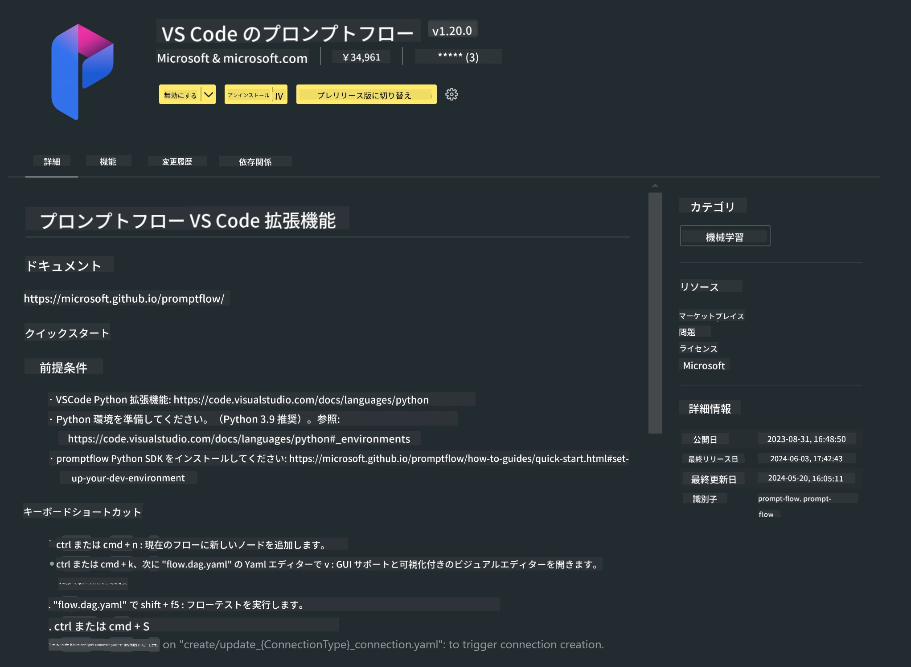

# **ラボ 0 - インストール**

ラボに入ると、関連する環境を設定する必要があります：


### **1. Python 3.11+**

Python環境の設定にはminiforgeの使用を推奨します。

miniforgeの設定方法については、[https://github.com/conda-forge/miniforge](https://github.com/conda-forge/miniforge) を参照してください。

miniforgeを設定したら、Power Shellで以下のコマンドを実行します。

```bash

conda create -n pyenv python==3.11.8 -y

conda activate pyenv

```


### **2. Prompt flow SDKのインストール**

ラボ1ではPrompt flowを使用するため、Prompt flow SDKを設定する必要があります。

```bash

pip install promptflow --upgrade

```

このコマンドでpromptflow sdkがインストールされているか確認できます。


```bash

pf --version

```

### **3. Visual Studio CodeのPrompt flow拡張機能のインストール**



### **4. AppleのMLXフレームワーク**

MLXはAppleシリコン上での機械学習研究向けの配列フレームワークで、Appleの機械学習研究チームによって提供されています。**Apple MLXフレームワーク**を使うことで、Apple Silicon上でLLM / SLMの高速化が可能です。詳細を知りたい場合は、[https://github.com/microsoft/PhiCookBook/blob/main/md/01.Introduction/03/MLX_Inference.md](https://github.com/microsoft/PhiCookBook/blob/main/md/01.Introduction/03/MLX_Inference.md) をご覧ください。

bashでMLXフレームワークライブラリをインストールします。


```bash

pip install mlx-lm

```


### **5. その他のPythonライブラリ**


requirements.txtを作成し、以下の内容を追加してください。

```txt

notebook
numpy 
scipy 
scikit-learn 
matplotlib 
pandas 
pillow 
graphviz

```


### **6. NVMのインストール**

Powershellでnvmをインストールします。


```bash

brew install nvm

```

nodejs 18.20をインストールします。


```bash

nvm install 18.20.0

nvm use 18.20.0

```

### **7. Visual Studio Codeの開発サポートのインストール**


```bash

npm install --global yo generator-code

```

おめでとうございます！SDKの設定が正常に完了しました。次にハンズオンのステップに進んでください。

**免責事項**：  
本書類はAI翻訳サービス「[Co-op Translator](https://github.com/Azure/co-op-translator)」を使用して翻訳されました。正確性を期しておりますが、自動翻訳には誤りや不正確な部分が含まれる可能性があります。原文の言語によるオリジナル文書が正式な情報源とみなされるべきです。重要な情報については、専門の人間による翻訳を推奨します。本翻訳の利用により生じた誤解や誤訳について、当方は一切の責任を負いかねます。