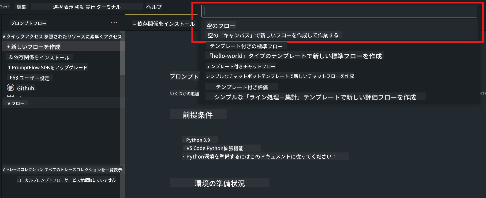
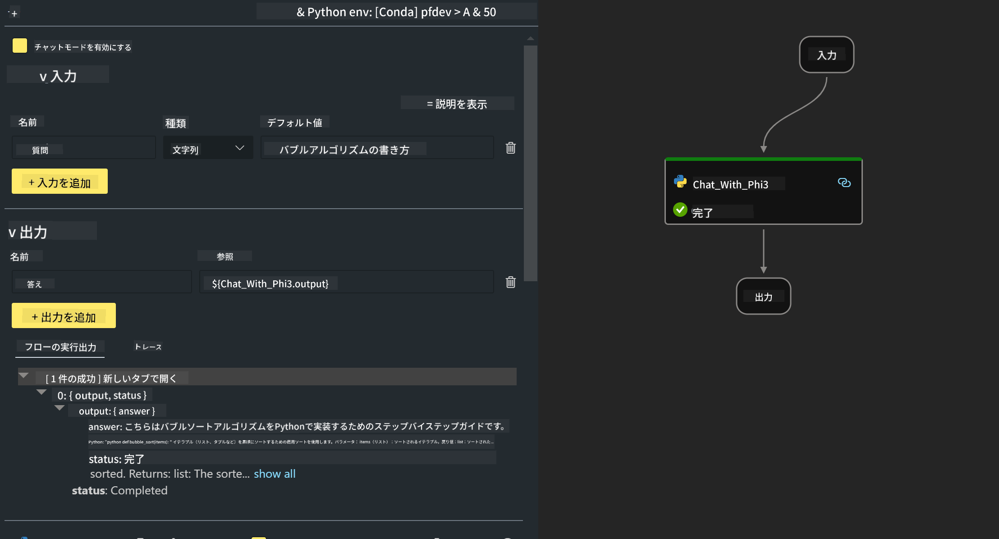
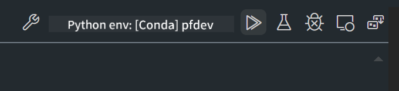

<!--
CO_OP_TRANSLATOR_METADATA:
{
  "original_hash": "3dbbf568625b1ee04b354c2dc81d3248",
  "translation_date": "2025-05-08T05:32:43+00:00",
  "source_file": "md/02.Application/02.Code/Phi3/VSCodeExt/HOL/Apple/02.PromptflowWithMLX.md",
  "language_code": "ja"
}
-->
# **Lab 2 - AIPCでPhi-3-miniを使ったPrompt flowの実行**

## **Prompt flowとは**

Prompt flowは、LLMベースのAIアプリケーションの企画、プロトタイピング、テスト、評価から本番展開・監視までの一連の開発サイクルを効率化するための開発ツール群です。プロンプトエンジニアリングを格段に簡単にし、プロダクション品質のLLMアプリを構築できるようにします。

Prompt flowを使うことで、以下が可能になります：

- LLM、プロンプト、Pythonコード、その他のツールを連携させて実行可能なワークフローを作成する。

- 特にLLMとのやり取りを簡単にデバッグ・反復できる。

- 大規模データセットを使ってフローの評価や品質・パフォーマンス指標の算出ができる。

- CI/CDシステムにテストや評価を組み込み、フローの品質を保証できる。

- 選んだサービングプラットフォームにフローをデプロイしたり、アプリのコードベースに簡単に統合できる。

- （任意だが強く推奨）Azure AI上のPrompt flowクラウド版を活用し、チームでの共同作業が可能。


## **Apple Silicon上での生成コードフロー構築**

***Note*** ：環境構築がまだの場合は、[Lab 0 -Installations](./01.Installations.md)をご覧ください。

1. Visual Studio CodeのPrompt flow拡張機能を開き、空のフロープロジェクトを作成する



2. 入力・出力パラメータを追加し、新しいフローとしてPythonコードを追加する




この構造（flow.dag.yaml）を参考にフローを構築できます

```yaml

inputs:
  prompt:
    type: string
    default: Write python code for Fibonacci serie. Please use markdown as output
outputs:
  result:
    type: string
    reference: ${gen_code_by_phi3.output}
nodes:
- name: gen_code_by_phi3
  type: python
  source:
    type: code
    path: gen_code_by_phi3.py
  inputs:
    prompt: ${inputs.prompt}


```

3. phi-3-miniの量子化

ローカルデバイスでSLMをより良く動かすため、一般的にモデルを量子化します（INT4、FP16、FP32）


```bash

python -m mlx_lm.convert --hf-path microsoft/Phi-3-mini-4k-instruct

```

**Note:** デフォルトフォルダはmlx_modelです

4. ***Chat_With_Phi3.py*** にコードを追加する


```python


from promptflow import tool

from mlx_lm import load, generate


# The inputs section will change based on the arguments of the tool function, after you save the code
# Adding type to arguments and return value will help the system show the types properly
# Please update the function name/signature per need
@tool
def my_python_tool(prompt: str) -> str:

    model_id = './mlx_model_phi3_mini'

    model, tokenizer = load(model_id)

    # <|user|>\nWrite python code for Fibonacci serie. Please use markdown as output<|end|>\n<|assistant|>

    response = generate(model, tokenizer, prompt="<|user|>\n" + prompt  + "<|end|>\n<|assistant|>", max_tokens=2048, verbose=True)

    return response


```

4. DebugまたはRunからフローをテストし、生成コードが正常に動作するか確認できます



5. ターミナルで開発用APIとしてフローを実行する

```

pf flow serve --source ./ --port 8080 --host localhost   

```

PostmanやThunder Clientでテスト可能です


### **Note**

1. 初回の実行は時間がかかります。Hugging face CLIからphi-3モデルをダウンロードすることを推奨します。

2. Intel NPUの計算能力が限られているため、Phi-3-mini-4k-instructの使用を推奨します。

3. Intel NPUアクセラレーションを使ってINT4変換の量子化を行いますが、サービスを再実行する場合はキャッシュとnc_workshopフォルダを削除する必要があります。


## **リソース**

1. Promptflowの学習 [https://microsoft.github.io/promptflow/](https://microsoft.github.io/promptflow/)

2. Intel NPU Accelerationの学習 [https://github.com/intel/intel-npu-acceleration-library](https://github.com/intel/intel-npu-acceleration-library)

3. サンプルコードのダウンロード [Local NPU Agent Sample Code](../../../../../../../../../code/07.Lab/01/AIPC/local-npu-agent)

**免責事項**：  
本書類はAI翻訳サービス「[Co-op Translator](https://github.com/Azure/co-op-translator)」を使用して翻訳されています。正確性を期しておりますが、自動翻訳には誤りや不正確な部分が含まれる可能性があることをご承知ください。原文の言語によるオリジナル文書が正式な情報源とみなされます。重要な情報については、専門の人間による翻訳を推奨します。本翻訳の利用により生じたいかなる誤解や誤訳についても責任を負いかねます。