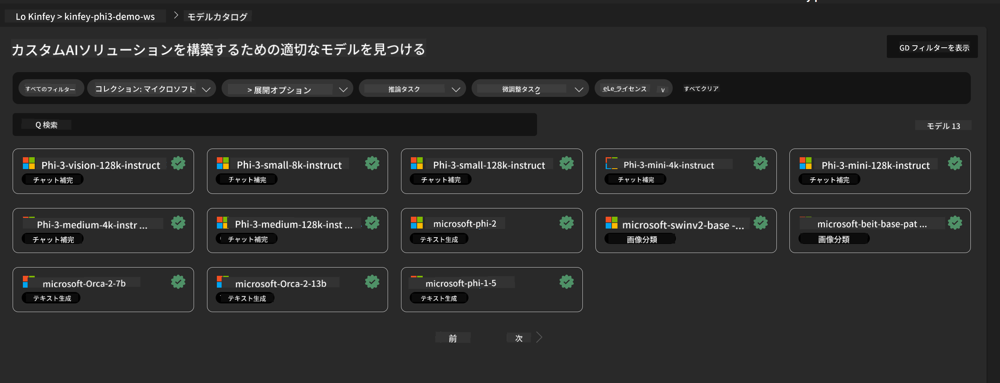
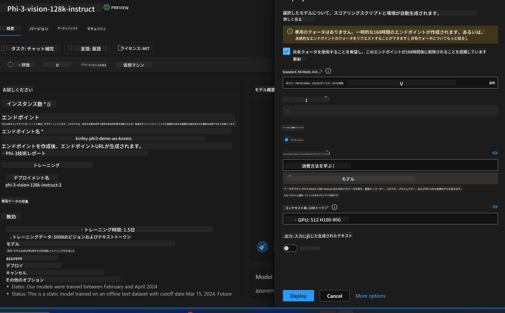
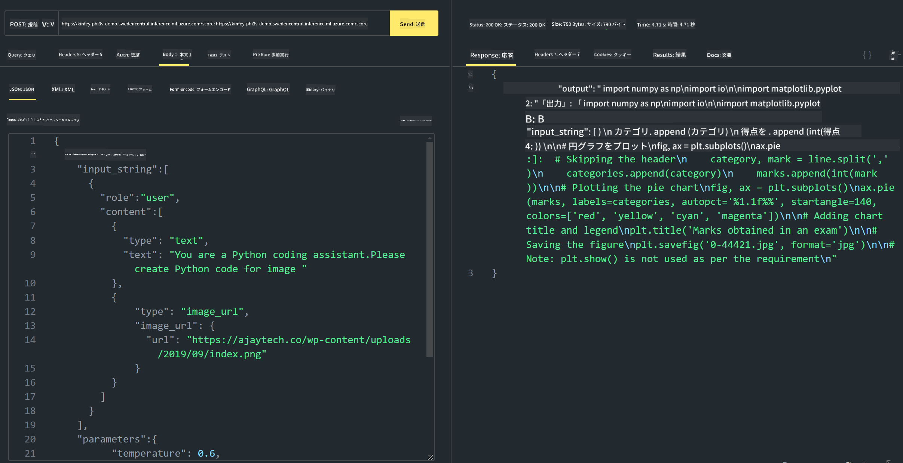

<!--
CO_OP_TRANSLATOR_METADATA:
{
  "original_hash": "594a3b553655c2ebbc0efdeb0b5040c9",
  "translation_date": "2025-04-04T12:57:08+00:00",
  "source_file": "md\\02.Application\\02.Code\\Phi3\\VSCodeExt\\HOL\\Apple\\03.DeployPhi3VisionOnAzure.md",
  "language_code": "ja"
}
-->
# **Lab 3 - Azure Machine Learning ServiceでPhi-3-Visionをデプロイする**

NPUを使ってローカルコードの本番環境へのデプロイを完了した後、PHI-3-VISIONの機能を導入し、画像からコードを生成する仕組みを実現したいと考えています。

この導入では、Azure Machine Learning Serviceを使用して、迅速にModel As ServiceとしてのPhi-3 Visionサービスを構築する方法を説明します。

***Note***： Phi-3 Visionは、高速でコンテンツを生成するために計算能力を必要とします。クラウドコンピューティングの力を借りて、これを実現する必要があります。

### **1. Azure Machine Learning Serviceを作成する**

Azure PortalでAzure Machine Learning Serviceを作成する必要があります。方法について学びたい場合は、こちらのリンクをご覧ください：
[https://learn.microsoft.com/azure/machine-learning/quickstart-create-resources?view=azureml-api-2](https://learn.microsoft.com/azure/machine-learning/quickstart-create-resources?view=azureml-api-2)

### **2. Azure Machine Learning ServiceでPhi-3 Visionを選択する**



### **3. AzureにPhi-3-Visionをデプロイする**



### **4. Postmanでエンドポイントをテストする**



***Note***

1. 送信するパラメータには、Authorization、azureml-model-deployment、Content-Typeを含める必要があります。デプロイ情報を確認して取得してください。

2. パラメータを送信する際、Phi-3-Visionには画像リンクを送信する必要があります。GPT-4-Visionの方法を参考にしてパラメータを送信してください。例えば：

```json

{
  "input_data":{
    "input_string":[
      {
        "role":"user",
        "content":[ 
          {
            "type": "text",
            "text": "You are a Python coding assistant.Please create Python code for image "
          },
          {
              "type": "image_url",
              "image_url": {
                "url": "https://ajaytech.co/wp-content/uploads/2019/09/index.png"
              }
          }
        ]
      }
    ],
    "parameters":{
          "temperature": 0.6,
          "top_p": 0.9,
          "do_sample": false,
          "max_new_tokens": 2048
    }
  }
}

```

3. Postメソッドを使用して**/score**を呼び出します。

**おめでとうございます**！迅速なPHI-3-VISIONのデプロイを完了し、画像からコードを生成する方法を試しました。次は、NPUとクラウドを組み合わせてアプリケーションを構築していきましょう。

**免責事項**:  
この文書はAI翻訳サービス[Co-op Translator](https://github.com/Azure/co-op-translator)を使用して翻訳されています。正確性を追求していますが、自動翻訳には誤りや不正確さが含まれる場合がありますのでご注意ください。元の言語で作成された原文を信頼できる情報源としてご利用ください。重要な情報については、専門的な人間による翻訳を推奨します。この翻訳の利用に起因する誤解や誤解釈について、当社は一切の責任を負いません。