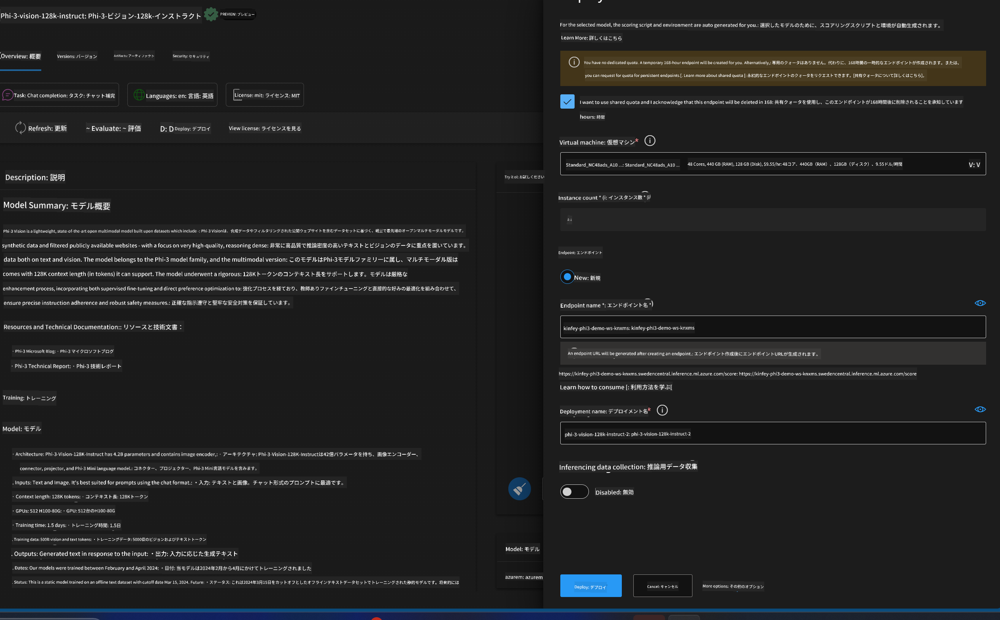
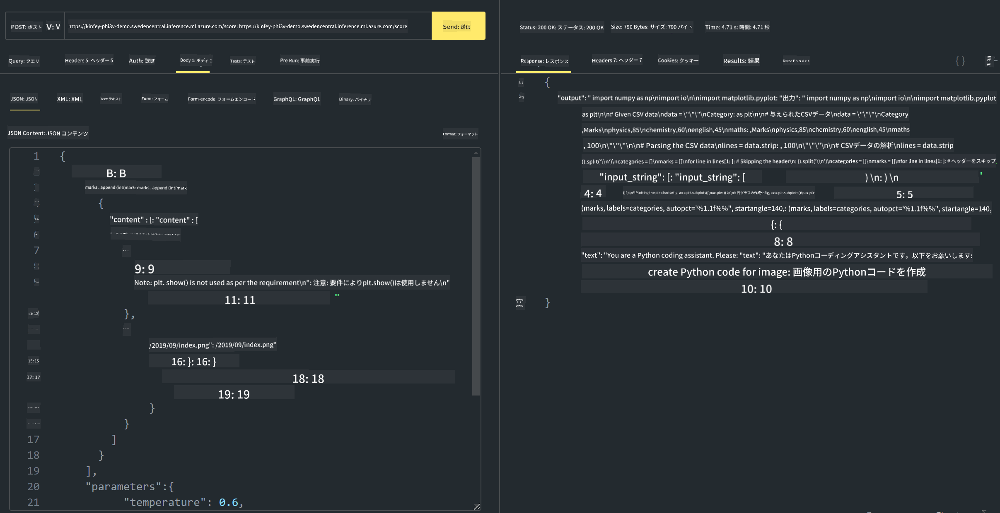

<!--
CO_OP_TRANSLATOR_METADATA:
{
  "original_hash": "20cb4e6ac1686248e8be913ccf6c2bc2",
  "translation_date": "2025-05-08T05:34:31+00:00",
  "source_file": "md/02.Application/02.Code/Phi3/VSCodeExt/HOL/Apple/03.DeployPhi3VisionOnAzure.md",
  "language_code": "ja"
}
-->
# **ラボ 3 - Azure Machine Learning ServiceでPhi-3-visionをデプロイする**

ローカルコードの本番展開をNPUで完了した後、PHI-3-VISIONを導入して、画像からコードを生成する機能を実現したいと考えています。

この紹介では、Azure Machine Learning ServiceでModel As ServiceとしてPhi-3 Visionサービスを素早く構築する方法を説明します。

***Note***： Phi-3 Visionは高速でコンテンツを生成するために計算能力が必要です。そのため、クラウドの計算リソースを活用する必要があります。


### **1. Azure Machine Learning Serviceの作成**

AzureポータルでAzure Machine Learning Serviceを作成する必要があります。作成方法を知りたい場合は、こちらのリンクをご覧ください。[https://learn.microsoft.com/azure/machine-learning/quickstart-create-resources?view=azureml-api-2](https://learn.microsoft.com/azure/machine-learning/quickstart-create-resources?view=azureml-api-2)


### **2. Azure Machine Learning ServiceでPhi-3 Visionを選択する**


### **3. AzureでPhi-3-Visionをデプロイする**





### **4. Postmanでエンドポイントをテストする**





***Note***

1. 送信するパラメータにはAuthorization、azureml-model-deployment、Content-Typeが含まれている必要があります。デプロイ情報を確認して取得してください。

2. パラメータを送信する際、Phi-3-Visionは画像リンクを送る必要があります。パラメータ送信方法はGPT-4-Visionの方法を参照してください。例えば、

```json

{
  "input_data":{
    "input_string":[
      {
        "role":"user",
        "content":[ 
          {
            "type": "text",
            "text": "You are a Python coding assistant.Please create Python code for image "
          },
          {
              "type": "image_url",
              "image_url": {
                "url": "https://ajaytech.co/wp-content/uploads/2019/09/index.png"
              }
          }
        ]
      }
    ],
    "parameters":{
          "temperature": 0.6,
          "top_p": 0.9,
          "do_sample": false,
          "max_new_tokens": 2048
    }
  }
}

```

3. Postメソッドで**/score**を呼び出します

**おめでとうございます**！これでPHI-3-VISIONの高速デプロイが完了し、画像からコードを生成する使い方を試せました。次はNPUとクラウドを組み合わせてアプリケーションを構築していきましょう。

**免責事項**：  
本書類はAI翻訳サービス[Co-op Translator](https://github.com/Azure/co-op-translator)を使用して翻訳されています。正確性には努めておりますが、自動翻訳には誤りや不正確な部分が含まれる可能性があることをご承知おきください。原文の言語によるオリジナル文書が権威ある情報源とみなされます。重要な情報については、専門の人間による翻訳を推奨します。本翻訳の使用により生じたいかなる誤解や誤訳についても、当方は責任を負いかねます。