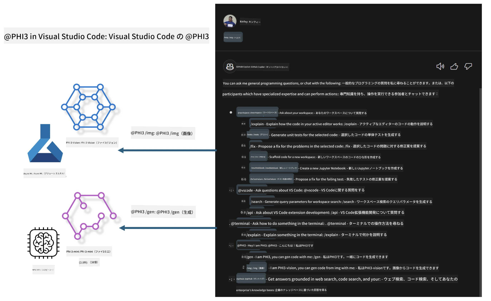

# **Microsoft Phi-3ファミリーで自分だけのVisual Studio Code GitHub Copilot Chatを構築しよう**

GitHub Copilot Chatのworkspace agentを使ったことはありますか？自分のチーム専用のコードエージェントを作りたいと思いませんか？このハンズオンラボでは、オープンソースモデルを組み合わせて、企業向けのコードビジネスエージェントを構築することを目指しています。

## **基礎知識**

### **なぜMicrosoft Phi-3を選ぶのか**

Phi-3はファミリーシリーズで、phi-3-mini、phi-3-small、phi-3-mediumがあり、それぞれ異なるトレーニングパラメータに基づいてテキスト生成、対話完結、コード生成に対応しています。また、Visionベースのphi-3-visionもあります。企業やチームごとにオフラインの生成AIソリューションを作るのに適しています。

こちらのリンクの閲覧をおすすめします [https://github.com/microsoft/PhiCookBook/blob/main/md/01.Introduction/01/01.PhiFamily.md](https://github.com/microsoft/PhiCookBook/blob/main/md/01.Introduction/01/01.PhiFamily.md)

### **Microsoft GitHub Copilot Chat**

GitHub Copilot Chat拡張機能は、VS Code内でGitHub Copilotと対話し、コーディングに関する質問に直接回答を得られるチャットインターフェースを提供します。ドキュメントを探したりオンラインフォーラムを検索したりする必要はありません。

Copilot Chatは、生成された回答に対して構文ハイライトやインデントなどのフォーマット機能を使い、わかりやすく表示します。ユーザーの質問の種類によっては、Copilotが回答を生成する際に参照したソースコードファイルやドキュメントへのリンク、またはVS Codeの機能にアクセスするためのボタンが含まれることもあります。

- Copilot Chatは開発者のワークフローに統合され、必要なときにサポートを提供します：

- エディターやターミナルから直接インラインチャットを開始し、コーディング中に助けを得る

- Chatビューを使って、いつでもそばにAIアシスタントを配置する

- Quick Chatを起動して素早く質問し、すぐに作業に戻る

GitHub Copilot Chatは以下のようなシナリオで利用できます：

- 問題解決のための最適なコーディング方法の質問に回答

- 他人のコードの説明や改善提案

- コード修正の提案

- ユニットテストケースの生成

- コードドキュメントの生成

こちらのリンクの閲覧をおすすめします [https://code.visualstudio.com/docs/copilot/copilot-chat](https://code.visualstudio.com/docs/copilot/copilot-chat?WT.mc_id=aiml-137032-kinfeylo)

###  **Microsoft GitHub Copilot Chat @workspace**

Copilot Chatで **@workspace**を参照すると、コードベース全体に関する質問が可能です。質問に基づき、Copilotは関連するファイルやシンボルを賢く検索し、それらをリンクやコード例として回答に含めます。

質問に答えるために、**@workspace**は開発者がVS Codeでコードベースをナビゲートする際に使うのと同じ情報源を検索します：

- .gitignoreで無視されていないワークスペース内のすべてのファイル

- ネストされたフォルダーやファイル名を含むディレクトリ構造

- ワークスペースがGitHubリポジトリでコード検索にインデックスされている場合はGitHubのコード検索インデックス

- ワークスペース内のシンボルや定義

- アクティブなエディターで選択中のテキストや表示されているテキスト

注意：無視されているファイルを開いているか、その中のテキストを選択している場合は.gitignoreは無視されます。

こちらのリンクの閲覧をおすすめします [[https://code.visualstudio.com/docs/copilot/copilot-chat](https://code.visualstudio.com/docs/copilot/workspace-context?WT.mc_id=aiml-137032-kinfeylo)]

## **このラボについてもっと知る**

GitHub Copilotは企業のプログラミング効率を大幅に向上させており、各企業はGitHub Copilotの機能をカスタマイズしたいと考えています。多くの企業は自社のビジネスシナリオやオープンソースモデルに基づき、GitHub Copilotに似たカスタマイズされた拡張機能を作成しています。企業にとってカスタマイズされた拡張機能は管理しやすい反面、ユーザー体験に影響を与えることもあります。GitHub Copilotは一般的なシナリオや専門性の高い対応に強力な機能を持っているため、体験を一貫させられれば、自社専用の拡張機能をカスタマイズする方が望ましいです。GitHub Copilot Chatは企業がチャット体験を拡張できるAPIを提供しており、一貫した体験を維持しつつカスタマイズ機能を持つことがより良いユーザー体験となります。

このラボでは主にPhi-3モデルを使い、ローカルNPUとAzureのハイブリッドを組み合わせて、GitHub Copilot Chat内にカスタムエージェント ***@PHI3***を構築し、企業の開発者がコード生成 ***(@PHI3 /gen)*** や画像に基づくコード生成 ***(@PHI3 /img)*** を支援します。

### ***Note:*** 

このラボは現在Intel CPUとApple SiliconのAIPCで実装されています。今後Qualcomm版NPUの対応も継続して更新予定です。

## **ラボ**

| 名前 | 説明 | AIPC | Apple |
| ------------ | ----------- | -------- |-------- |
| Lab0 - インストール(✅) | 関連環境とインストールツールの設定とインストール | [Go](./HOL/AIPC/01.Installations.md) |[Go](./HOL/Apple/01.Installations.md) |
| Lab1 - Phi-3-miniでのPrompt flow実行(✅) | AIPC / Apple Siliconと連携し、ローカルNPUを使ってPhi-3-miniによるコード生成を作成 | [Go](./HOL/AIPC/02.PromptflowWithNPU.md) |  [Go](./HOL/Apple/02.PromptflowWithMLX.md) |
| Lab2 - Azure Machine Learning ServiceでPhi-3-visionをデプロイ(✅) | Azure Machine Learning Serviceのモデルカタログ - Phi-3-vision imageをデプロイしてコード生成 | [Go](./HOL/AIPC/03.DeployPhi3VisionOnAzure.md) |[Go](./HOL/Apple/03.DeployPhi3VisionOnAzure.md) |
| Lab3 - GitHub Copilot Chatで@phi-3エージェントを作成(✅)  | GitHub Copilot ChatにカスタムPhi-3エージェントを作成し、コード生成、グラフ生成コード、RAGなどを実現 | [Go](./HOL/AIPC/04.CreatePhi3AgentInVSCode.md) | [Go](./HOL/Apple/04.CreatePhi3AgentInVSCode.md) |
| サンプルコード (✅)  | サンプルコードのダウンロード | [Go](../../../../../../../code/07.Lab/01/AIPC) | [Go](../../../../../../../code/07.Lab/01/Apple) |

## **リソース**

1. Phi-3 Cookbook [https://github.com/microsoft/Phi-3CookBook](https://github.com/microsoft/Phi-3CookBook)

2. GitHub Copilotについて詳しくはこちら [https://learn.microsoft.com/training/paths/copilot/](https://learn.microsoft.com/training/paths/copilot/?WT.mc_id=aiml-137032-kinfeylo)

3. GitHub Copilot Chatについて詳しくはこちら [https://learn.microsoft.com/training/paths/accelerate-app-development-using-github-copilot/](https://learn.microsoft.com/training/paths/accelerate-app-development-using-github-copilot/?WT.mc_id=aiml-137032-kinfeylo)

4. GitHub Copilot Chat APIについて詳しくはこちら [https://code.visualstudio.com/api/extension-guides/chat](https://code.visualstudio.com/api/extension-guides/chat?WT.mc_id=aiml-137032-kinfeylo)

5. Azure AI Foundryについて詳しくはこちら [https://learn.microsoft.com/training/paths/create-custom-copilots-ai-studio/](https://learn.microsoft.com/training/paths/create-custom-copilots-ai-studio/?WT.mc_id=aiml-137032-kinfeylo)

6. Azure AI Foundryのモデルカタログについて詳しくはこちら [https://learn.microsoft.com/azure/ai-studio/how-to/model-catalog-overview](https://learn.microsoft.com/azure/ai-studio/how-to/model-catalog-overview)

**免責事項**：  
本書類はAI翻訳サービス「[Co-op Translator](https://github.com/Azure/co-op-translator)」を使用して翻訳されました。正確性を期しておりますが、自動翻訳には誤りや不正確な部分が含まれる可能性があります。原文の言語によるオリジナル文書が正式な情報源とみなされるべきです。重要な情報については、専門の人間による翻訳を推奨します。本翻訳の利用により生じた誤解や誤訳について、当方は一切の責任を負いかねます。
