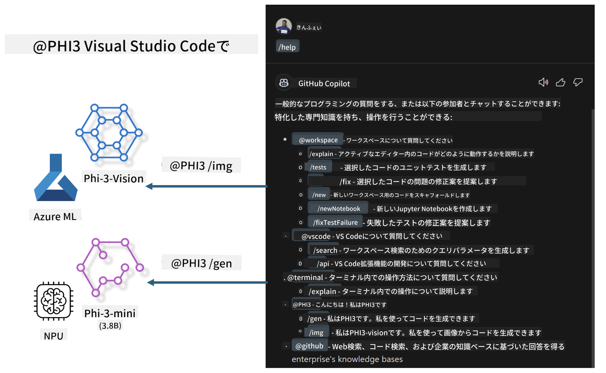

<!--
CO_OP_TRANSLATOR_METADATA:
{
  "original_hash": "7302d85639441c7cedbae09795e6b9a6",
  "translation_date": "2025-04-04T12:50:02+00:00",
  "source_file": "md\\02.Application\\02.Code\\Phi3\\VSCodeExt\\README.md",
  "language_code": "ja"
}
-->
# **Microsoft Phi-3ファミリーを使ってVisual Studio Code GitHub Copilot Chatを構築しよう**

GitHub Copilot Chatのワークスペースエージェントを使ったことはありますか？自分のチーム専用のコードエージェントを構築してみたいですか？このハンズオンラボでは、オープンソースモデルを活用して、企業向けのコードビジネスエージェントを構築することを目指しています。

## **基礎知識**

### **Microsoft Phi-3を選ぶ理由**

Phi-3はファミリーシリーズであり、phi-3-mini、phi-3-small、phi-3-mediumなど、異なるトレーニングパラメータに基づくテキスト生成、対話完了、コード生成を行うモデルが含まれています。また、Visionに基づいたphi-3-visionもあります。これらは企業や異なるチームがオフラインの生成AIソリューションを作成するのに適しています。

以下のリンクを読むことをお勧めします: [https://github.com/microsoft/PhiCookBook/blob/main/md/01.Introduction/01/01.PhiFamily.md](https://github.com/microsoft/PhiCookBook/blob/main/md/01.Introduction/01/01.PhiFamily.md)

### **Microsoft GitHub Copilot Chat**

GitHub Copilot Chat拡張機能は、チャットインターフェイスを提供し、VS Code内で直接GitHub Copilotと対話してコーディングに関する質問への回答を得ることができます。これにより、ドキュメントを検索したり、オンラインフォーラムを探したりする必要がなくなります。

Copilot Chatは、構文のハイライトやインデント、その他のフォーマット機能を活用して、生成された回答をわかりやすくします。ユーザーの質問内容によっては、回答にリンクやソースコードファイル、ドキュメントへのコンテキストを含めたり、VS Codeの機能にアクセスするためのボタンを表示する場合もあります。

- Copilot Chatは開発者のワークフローに統合され、必要な場面で支援を提供します:

- エディターやターミナルから直接インラインチャットを開始し、コーディング中に支援を受ける

- チャットビューを使用して、いつでもサイドにAIアシスタントを配置

- クイックチャットを起動して簡単な質問をし、作業に戻る

GitHub Copilot Chatは以下のようなシナリオで使用できます:

- 問題解決のための最適な方法を質問する

- 他人のコードを説明し、改善案を提案する

- コード修正を提案する

- ユニットテストケースを生成する

- コードドキュメントを生成する

以下のリンクを読むことをお勧めします: [https://code.visualstudio.com/docs/copilot/copilot-chat](https://code.visualstudio.com/docs/copilot/copilot-chat?WT.mc_id=aiml-137032-kinfeylo)

### **Microsoft GitHub Copilot Chat @workspace**

Copilot Chatで**@workspace**を参照すると、コードベース全体について質問することができます。Copilotは質問に基づいて関連するファイルやシンボルをインテリジェントに取得し、それを回答のリンクやコード例として提示します。

**@workspace**は、VS Code内で開発者がコードベースをナビゲートするときに使用する情報源を検索して質問に答えます:

- .gitignoreファイルで無視されていないワークスペース内のすべてのファイル

- ネストされたフォルダーやファイル名を含むディレクトリ構造

- ワークスペースがGitHubリポジトリであり、コード検索でインデックスされている場合のGitHubのコード検索インデックス

- ワークスペース内のシンボルや定義

- アクティブなエディター内で現在選択されているテキストや表示されているテキスト

注意: .gitignoreで無視されているファイルを開いている場合や、無視されたファイル内のテキストを選択している場合は、.gitignoreが無視されます。

以下のリンクを読むことをお勧めします: [[https://code.visualstudio.com/docs/copilot/copilot-chat](https://code.visualstudio.com/docs/copilot/workspace-context?WT.mc_id=aiml-137032-kinfeylo)]

## **このラボについて詳しく知る**

GitHub Copilotは企業のプログラミング効率を大幅に向上させました。すべての企業がGitHub Copilotの関連機能をカスタマイズしたいと考えています。多くの企業が自社のビジネスシナリオやオープンソースモデルに基づいて、GitHub Copilotに似た拡張機能をカスタマイズしています。企業にとって、カスタマイズされた拡張機能は制御しやすいですが、ユーザー体験に影響を及ぼす可能性があります。結局のところ、GitHub Copilotは一般的なシナリオや専門性においてより強力な機能を持っています。体験が一貫していれば、企業独自の拡張機能をカスタマイズする方が良いでしょう。GitHub Copilot Chatは、企業がチャット体験を拡張するための関連APIを提供しています。一貫した体験を維持しながらカスタマイズ機能を持つことは、より良いユーザー体験となります。

このラボでは主にPhi-3モデルを使用し、ローカルNPUとAzureのハイブリッドを組み合わせてGitHub Copilot Chatのカスタムエージェント***@PHI3***を構築します。これにより、企業の開発者がコード生成***(@PHI3 /gen)***や画像に基づくコード生成***(@PHI3 /img)***を効率的に行えるように支援します。

### ***注意:***

このラボは現在、Intel CPUのAIPCとApple Siliconで実装されています。Qualcomm版のNPUについても継続的に更新を行います。

## **ラボ**

| 名前 | 説明 | AIPC | Apple |
| ------------ | ----------- | -------- |-------- |
| Lab0 - インストール(✅) | 関連環境とインストールツールを構成・インストール | [Go](./HOL/AIPC/01.Installations.md) |[Go](./HOL/Apple/01.Installations.md) |
| Lab1 - Phi-3-miniでプロンプトフローを実行(✅) | AIPC / Apple Siliconを組み合わせ、ローカルNPUを使用してPhi-3-miniを通じてコード生成を作成 | [Go](./HOL/AIPC/02.PromptflowWithNPU.md) |  [Go](./HOL/Apple/02.PromptflowWithMLX.md) |
| Lab2 - Azure Machine Learning ServiceでPhi-3-visionをデプロイ(✅) | Azure Machine Learning ServiceのModel Catalog - Phi-3-vision画像をデプロイしてコード生成 | [Go](./HOL/AIPC/03.DeployPhi3VisionOnAzure.md) |[Go](./HOL/Apple/03.DeployPhi3VisionOnAzure.md) |
| Lab3 - GitHub Copilot Chatで@phi-3エージェントを作成(✅)  | GitHub Copilot ChatでカスタムPhi-3エージェントを作成し、コード生成、グラフ生成コード、RAGなどを完了 | [Go](./HOL/AIPC/04.CreatePhi3AgentInVSCode.md) | [Go](./HOL/Apple/04.CreatePhi3AgentInVSCode.md) |
| サンプルコード (✅)  | サンプルコードをダウンロード | [Go](../../../../../../../code/07.Lab/01/AIPC) | [Go](../../../../../../../code/07.Lab/01/Apple) |

## **リソース**

1. Phi-3 Cookbook [https://github.com/microsoft/Phi-3CookBook](https://github.com/microsoft/Phi-3CookBook)

2. GitHub Copilotについて学ぶ [https://learn.microsoft.com/training/paths/copilot/](https://learn.microsoft.com/training/paths/copilot/?WT.mc_id=aiml-137032-kinfeylo)

3. GitHub Copilot Chatについて学ぶ [https://learn.microsoft.com/training/paths/accelerate-app-development-using-github-copilot/](https://learn.microsoft.com/training/paths/accelerate-app-development-using-github-copilot/?WT.mc_id=aiml-137032-kinfeylo)

4. GitHub Copilot Chat APIについて学ぶ [https://code.visualstudio.com/api/extension-guides/chat](https://code.visualstudio.com/api/extension-guides/chat?WT.mc_id=aiml-137032-kinfeylo)

5. Azure AI Foundryについて学ぶ [https://learn.microsoft.com/training/paths/create-custom-copilots-ai-studio/](https://learn.microsoft.com/training/paths/create-custom-copilots-ai-studio/?WT.mc_id=aiml-137032-kinfeylo)

6. Azure AI FoundryのModel Catalogについて学ぶ [https://learn.microsoft.com/azure/ai-studio/how-to/model-catalog-overview](https://learn.microsoft.com/azure/ai-studio/how-to/model-catalog-overview)

**免責事項**:  
この文書はAI翻訳サービス[Co-op Translator](https://github.com/Azure/co-op-translator)を使用して翻訳されています。正確性を追求していますが、自動翻訳には誤りや不正確な部分が含まれる可能性があることをご承知ください。元の言語で書かれた原文が公式の情報源として優先されるべきです。重要な情報については、専門の人間による翻訳を推奨します。この翻訳の利用によって生じる誤解や解釈の誤りについて、当方は一切責任を負いません。