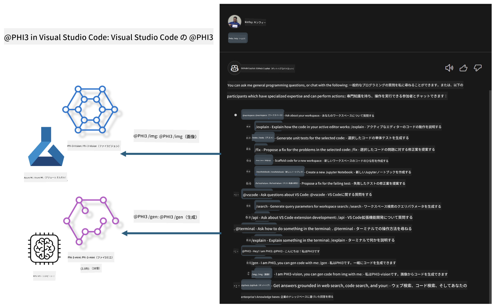

<!--
CO_OP_TRANSLATOR_METADATA:
{
  "original_hash": "00b7a699de8ac405fa821f4c0f7fc0ab",
  "translation_date": "2025-05-08T05:28:59+00:00",
  "source_file": "md/02.Application/02.Code/Phi3/VSCodeExt/README.md",
  "language_code": "ja"
}
-->
# **Microsoft Phi-3 ファミリーで自分だけの Visual Studio Code GitHub Copilot Chat を作ろう**

GitHub Copilot Chat の workspace agent を使ったことはありますか？チーム専用のコードエージェントを作りたいと思いませんか？このハンズオンラボでは、オープンソースモデルを活用して、企業向けのコード業務エージェントを構築することを目指します。

## **基礎**

### **なぜ Microsoft Phi-3 を選ぶのか**

Phi-3 はファミリーシリーズで、phi-3-mini、phi-3-small、phi-3-medium の各モデルが異なるトレーニングパラメータに基づき、テキスト生成、対話完結、コード生成に対応しています。また、Vision ベースの phi-3-vision もあります。企業やチームごとにオフラインの生成AIソリューションを作成するのに適しています。

こちらのリンクの閲覧を推奨します [https://github.com/microsoft/PhiCookBook/blob/main/md/01.Introduction/01/01.PhiFamily.md](https://github.com/microsoft/PhiCookBook/blob/main/md/01.Introduction/01/01.PhiFamily.md)

### **Microsoft GitHub Copilot Chat**

GitHub Copilot Chat 拡張機能は、VS Code 内で直接 GitHub Copilot と対話し、コーディング関連の質問に答えを得られるチャットインターフェースを提供します。ドキュメントを探したりオンラインフォーラムを検索したりする必要はありません。

Copilot Chat は生成した回答に対して、構文のハイライトやインデントなどのフォーマットを使い、分かりやすさを向上させます。ユーザーの質問内容に応じて、Copilot が回答を生成する際に参照したソースコードファイルやドキュメントへのリンク、または VS Code の機能にアクセスするためのボタンが含まれることもあります。

- Copilot Chat は開発者の作業フローに統合され、必要な時にサポートを提供します：

- エディターやターミナルから直接インラインチャットを開始し、コーディング中に助けを得られます

- Chat ビューを使って、いつでもそばに AI アシスタントを配置できます

- クイックチャットを起動して、すばやく質問し作業に戻れます

GitHub Copilot Chat は以下のようなシーンで活用できます：

- 問題解決の最適な方法についてのコーディング質問への回答

- 他者のコードの説明や改善提案

- コード修正の提案

- ユニットテストケースの生成

- コードドキュメントの生成

こちらのリンクの閲覧を推奨します [https://code.visualstudio.com/docs/copilot/copilot-chat](https://code.visualstudio.com/docs/copilot/copilot-chat?WT.mc_id=aiml-137032-kinfeylo)

### **Microsoft GitHub Copilot Chat @workspace**

Copilot Chat で **@workspace** を使うと、コードベース全体に関する質問が可能です。質問に基づき、Copilot は関連ファイルやシンボルを賢く検索し、回答にリンクやコード例として参照します。

質問に答えるために、**@workspace** は開発者が VS Code でコードベースをナビゲートするときに使う情報源を検索します：

- .gitignore によって無視されていないワークスペース内のすべてのファイル

- ネストされたフォルダやファイル名を含むディレクトリ構造

- ワークスペースが GitHub リポジトリでコード検索にインデックスされている場合の GitHub のコード検索インデックス

- ワークスペース内のシンボルや定義

- アクティブエディターで選択されているテキストや表示されているテキスト

注意：無視されているファイルを開いているか、その中でテキストを選択している場合は .gitignore は無視されます。

こちらのリンクの閲覧を推奨します [[https://code.visualstudio.com/docs/copilot/copilot-chat](https://code.visualstudio.com/docs/copilot/workspace-context?WT.mc_id=aiml-137032-kinfeylo)]

## **このラボについてさらに知る**

GitHub Copilot は企業のプログラミング効率を大幅に向上させており、多くの企業が GitHub Copilot の機能をカスタマイズしたいと考えています。多くの企業は、自社のビジネスシナリオやオープンソースモデルをベースに、GitHub Copilot に似た拡張機能をカスタマイズしています。企業にとってカスタマイズされた拡張機能は管理がしやすい一方で、ユーザー体験に影響を与えることもあります。GitHub Copilot は一般的なシナリオや専門性の高い対応に優れています。体験を一貫させつつ、企業独自の拡張機能をカスタマイズできれば、より良いユーザー体験になります。GitHub Copilot Chat は企業がチャット体験を拡張するための関連 API を提供しています。一貫した体験とカスタマイズ機能の両立が、より良いユーザー体験を実現します。

このラボでは主に Phi-3 モデルを、ローカル NPU と Azure ハイブリッドと組み合わせて、GitHub Copilot Chat のカスタムエージェント ***@PHI3*** を構築し、企業の開発者がコード生成***(@PHI3 /gen)***や画像に基づくコード生成***(@PHI3 /img)***を支援します。

### ***注意:*** 

このラボは現在、Intel CPU と Apple Silicon の AIPC で実装されています。今後 Qualcomm 版の NPU も更新予定です。

## **ラボ**

| 名前 | 説明 | AIPC | Apple |
| ------------ | ----------- | -------- |-------- |
| Lab0 - インストール(✅) | 関連環境とインストールツールの設定およびインストール | [Go](./HOL/AIPC/01.Installations.md) |[Go](./HOL/Apple/01.Installations.md) |
| Lab1 - Phi-3-mini での Prompt flow 実行(✅) | AIPC / Apple Silicon と連携し、ローカル NPU を使って Phi-3-mini によるコード生成を作成 | [Go](./HOL/AIPC/02.PromptflowWithNPU.md) |  [Go](./HOL/Apple/02.PromptflowWithMLX.md) |
| Lab2 - Azure Machine Learning Service に Phi-3-vision をデプロイ(✅) | Azure Machine Learning Service の Model Catalog - Phi-3-vision image をデプロイしてコード生成 | [Go](./HOL/AIPC/03.DeployPhi3VisionOnAzure.md) |[Go](./HOL/Apple/03.DeployPhi3VisionOnAzure.md) |
| Lab3 - GitHub Copilot Chat に @phi-3 エージェントを作成(✅)  | GitHub Copilot Chat にカスタム Phi-3 エージェントを作成し、コード生成やグラフ生成コード、RAG などを実現 | [Go](./HOL/AIPC/04.CreatePhi3AgentInVSCode.md) | [Go](./HOL/Apple/04.CreatePhi3AgentInVSCode.md) |
| サンプルコード (✅)  | サンプルコードをダウンロード | [Go](../../../../../../../code/07.Lab/01/AIPC) | [Go](../../../../../../../code/07.Lab/01/Apple) |

## **リソース**

1. Phi-3 Cookbook [https://github.com/microsoft/Phi-3CookBook](https://github.com/microsoft/Phi-3CookBook)

2. GitHub Copilot について詳しくはこちら [https://learn.microsoft.com/training/paths/copilot/](https://learn.microsoft.com/training/paths/copilot/?WT.mc_id=aiml-137032-kinfeylo)

3. GitHub Copilot Chat について詳しくはこちら [https://learn.microsoft.com/training/paths/accelerate-app-development-using-github-copilot/](https://learn.microsoft.com/training/paths/accelerate-app-development-using-github-copilot/?WT.mc_id=aiml-137032-kinfeylo)

4. GitHub Copilot Chat API について詳しくはこちら [https://code.visualstudio.com/api/extension-guides/chat](https://code.visualstudio.com/api/extension-guides/chat?WT.mc_id=aiml-137032-kinfeylo)

5. Azure AI Foundry について詳しくはこちら [https://learn.microsoft.com/training/paths/create-custom-copilots-ai-studio/](https://learn.microsoft.com/training/paths/create-custom-copilots-ai-studio/?WT.mc_id=aiml-137032-kinfeylo)

6. Azure AI Foundry の Model Catalog について詳しくはこちら [https://learn.microsoft.com/azure/ai-studio/how-to/model-catalog-overview](https://learn.microsoft.com/azure/ai-studio/how-to/model-catalog-overview)

**免責事項**：  
本書類はAI翻訳サービス「Co-op Translator」（https://github.com/Azure/co-op-translator）を使用して翻訳されています。正確性を期しておりますが、自動翻訳には誤りや不正確な部分が含まれる可能性があることをご承知ください。原文の言語による文書が正式な情報源とみなされます。重要な情報については、専門の人間による翻訳を推奨します。本翻訳の利用により生じたいかなる誤解や誤訳についても、一切の責任を負いかねます。