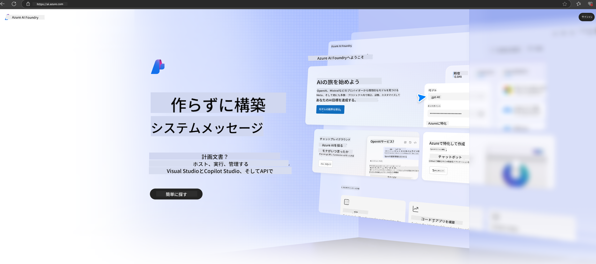

<!--
CO_OP_TRANSLATOR_METADATA:
{
  "original_hash": "6525689374197af33b41a93811e473a2",
  "translation_date": "2025-04-04T13:06:18+00:00",
  "source_file": "md\\02.QuickStart\\AzureAIFoundry_QuickStart.md",
  "language_code": "ja"
}
-->
# **Azure AI FoundryでPhi-3を使用する**

生成AIの発展に伴い、異なるLLMやSLM、企業データの統合、微調整/RAG操作、LLMやSLMを統合した後の企業ビジネスの評価などを管理するための統一プラットフォームを使用し、生成AIのスマートな応用をより良く実現したいと考えています。[Azure AI Foundry](https://ai.azure.com)は、企業向けの生成AIアプリケーションプラットフォームです。

Azure AI Foundryを使用すると、大規模言語モデル（LLM）の応答を評価し、プロンプトフローを活用してプロンプトアプリケーションコンポーネントを調整し、性能を向上させることができます。このプラットフォームは、概念実証から本格的な運用への移行を容易にし、スケーラビリティを提供します。継続的な監視と改善により、長期的な成功をサポートします。

簡単な手順を通じてPhi-3モデルをAzure AI Foundryに迅速にデプロイし、その後、Azure AI Foundryを使用してPhi-3関連のPlayground/Chat、微調整、評価などの関連作業を完了することができます。

## **1. 準備**

もしすでに[Azure Developer CLI](https://learn.microsoft.com/azure/developer/azure-developer-cli/overview?WT.mc_id=aiml-138114-kinfeylo)がマシンにインストールされている場合、このテンプレートを使用するのは新しいディレクトリでコマンドを実行するだけで簡単です。

## 手動作成

Microsoft Azure AI Foundryプロジェクトとハブを作成することで、AIの作業を整理し管理する良い方法になります。以下はその開始手順のガイドです。

### Azure AI Foundryでプロジェクトを作成する

1. **Azure AI Foundryにアクセス**: Azure AI Foundryポータルにサインインします。
2. **プロジェクトを作成**:
   - プロジェクト内にいる場合は、ページ左上の「Azure AI Foundry」を選択してホームページに移動します。
   - 「+ Create project」を選択します。
   - プロジェクト名を入力します。
   - ハブがある場合はデフォルトで選択されます。複数のハブにアクセスできる場合は、ドロップダウンから別のハブを選択できます。新しいハブを作成したい場合は、「Create new hub」を選択して名前を入力します。
   - 「Create」を選択します。

### Azure AI Foundryでハブを作成する

1. **Azure AI Foundryにアクセス**: Azureアカウントでサインインします。
2. **ハブを作成**:
   - 左メニューの管理センターを選択します。
   - 「All resources」を選択し、「+ New project」の下矢印をクリックして「+ New hub」を選択します。
   - 「Create a new hub」ダイアログで、ハブ名（例: contoso-hub）を入力し、必要に応じて他のフィールドを変更します。
   - 「Next」を選択し、情報を確認した後「Create」を選択します。

詳細な手順については、公式の[Microsoftドキュメント](https://learn.microsoft.com/azure/ai-studio/how-to/create-projects)を参照してください。

作成が成功すると、[ai.azure.com](https://ai.azure.com/)を通じて作成したスタジオにアクセスできます。

1つのAI Foundryに複数のプロジェクトを作成することができます。AI Foundryでプロジェクトを作成して準備してください。

Azure AI Foundryの[QuickStarts](https://learn.microsoft.com/azure/ai-studio/quickstarts/get-started-code)を参照してください。

## **2. Azure AI FoundryでPhiモデルをデプロイする**

プロジェクトのExploreオプションをクリックしてモデルカタログに入り、Phi-3を選択します。

Phi-3-mini-4k-instructを選択します。

「Deploy」をクリックしてPhi-3-mini-4k-instructモデルをデプロイします。

> [!NOTE]
>
> デプロイ時にコンピューティングパワーを選択できます。

## **3. Azure AI FoundryでPhiのPlayground Chatを使用する**

デプロイページに移動し、Playgroundを選択してAzure AI FoundryのPhi-3とチャットします。

## **4. Azure AI Foundryからモデルをデプロイする**

Azure Model Catalogからモデルをデプロイするには、以下の手順を実行します。

- Azure AI Foundryにサインインします。
- Azure AI Foundryモデルカタログからデプロイしたいモデルを選択します。
- モデルの詳細ページで「Deploy」を選択し、「Serverless API with Azure AI Content Safety」を選択します。
- モデルをデプロイするプロジェクトを選択します。Serverless APIオファリングを使用するには、ワークスペースがEast US 2またはSweden Centralリージョンに属している必要があります。デプロイメント名をカスタマイズできます。
- デプロイメントウィザードで「Pricing and terms」を選択して価格と利用条件を確認します。
- 「Deploy」を選択します。デプロイメントが完了するまで待機し、デプロイメントページにリダイレクトされます。
- 「Open in playground」を選択してモデルとの対話を開始します。
- デプロイメントページに戻り、デプロイメントを選択してエンドポイントのターゲットURLとシークレットキーを確認します。この情報を使用してデプロイメントを呼び出し、生成を行うことができます。
- 「Build」タブに移動し、コンポーネントセクションの「Deployments」を選択することで、エンドポイントの詳細、URL、およびアクセスキーをいつでも確認できます。

> [!NOTE]
> これらの手順を実行するには、リソースグループに対するAzure AI Developerロールの権限がアカウントに付与されている必要があります。

## **5. Azure AI FoundryでPhi APIを使用する**

PostmanでGETを使用してhttps://{Your project name}.region.inference.ml.azure.com/swagger.jsonにアクセスし、Keyと組み合わせて提供されているインターフェースを確認できます。

リクエストパラメータやレスポンスパラメータを非常に簡単に取得できます。

**免責事項**:  
この文書はAI翻訳サービス[Co-op Translator](https://github.com/Azure/co-op-translator)を使用して翻訳されています。正確性を追求しておりますが、自動翻訳には誤りや不正確な部分が含まれる可能性があります。元の言語で記載された原文を正式な情報源としてご参照ください。重要な情報については、専門の人間による翻訳を推奨します。この翻訳の使用に起因する誤解や誤解釈について、当社は一切責任を負いません。