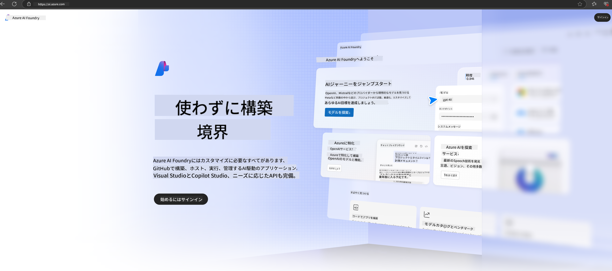

<!--
CO_OP_TRANSLATOR_METADATA:
{
  "original_hash": "3a1e48b628022485aac989c9f733e792",
  "translation_date": "2025-05-08T04:59:49+00:00",
  "source_file": "md/02.QuickStart/AzureAIFoundry_QuickStart.md",
  "language_code": "ja"
}
-->
# **Azure AI FoundryでのPhi-3の利用**

生成AIの発展に伴い、異なるLLMやSLMの管理、企業データ統合、ファインチューニングやRAG操作、さらにLLMやSLM統合後の各企業ビジネスの評価などを一元的に行えるプラットフォームの活用が期待されています。これにより、生成AIを活用したスマートアプリケーションの実現がより効果的になります。[Azure AI Foundry](https://ai.azure.com)は企業向けの生成AIアプリケーションプラットフォームです。

Azure AI Foundryを使うことで、大規模言語モデル（LLM）の応答評価や、より良いパフォーマンスを目指したプロンプトフローによるプロンプトアプリケーションコンポーネントのオーケストレーションが可能です。このプラットフォームは、PoC（概念実証）から本格的なプロダクションへのスケーラビリティを容易にし、継続的なモニタリングと改善によって長期的な成功を支援します。

簡単な手順でAzure AI Foundry上にPhi-3モデルを迅速にデプロイし、その後、Playground/Chat、ファインチューニング、評価などPhi-3関連の作業をAzure AI Foundry上で行うことができます。

## **1. 準備**

すでに[Azure Developer CLI](https://learn.microsoft.com/azure/developer/azure-developer-cli/overview?WT.mc_id=aiml-138114-kinfeylo)をマシンにインストールしている場合は、新しいディレクトリで以下のコマンドを実行するだけでこのテンプレートを利用できます。

## 手動での作成

Microsoft Azure AI Foundryのプロジェクトとハブを作成することは、AI作業を整理・管理するうえで非常に有効です。以下にステップバイステップの手順を示します。

### Azure AI Foundryでのプロジェクト作成

1. **Azure AI Foundryにアクセス**：Azure AI Foundryポータルにサインインします。
2. **プロジェクトを作成**：
   - すでにプロジェクト内にいる場合は、ページ左上の「Azure AI Foundry」を選択してホームページに戻ります。
   - 「+ Create project」を選択します。
   - プロジェクト名を入力します。
   - ハブをお持ちの場合はデフォルトで選択されます。複数のハブにアクセス可能な場合は、ドロップダウンから別のハブを選択できます。新しいハブを作成したい場合は「Create new hub」を選択し、名前を入力してください。
   - 「Create」を選択します。

### Azure AI Foundryでのハブ作成

1. **Azure AI Foundryにアクセス**：Azureアカウントでサインインします。
2. **ハブを作成**：
   - 左メニューから「Management center」を選択します。
   - 「All resources」を選び、「+ New project」の横の下向き矢印をクリックし、「+ New hub」を選択します。
   - 「Create a new hub」ダイアログでハブ名（例：contoso-hub）を入力し、その他必要に応じて設定を変更します。
   - 「Next」を選択し、内容を確認後「Create」を選択します。

詳細な手順は公式の[Microsoftドキュメント](https://learn.microsoft.com/azure/ai-studio/how-to/create-projects)をご参照ください。

作成が完了すると、[ai.azure.com](https://ai.azure.com/)から作成したスタジオにアクセスできます。

1つのAI Foundryには複数のプロジェクトを作成可能です。まずはAI Foundry上にプロジェクトを作成して準備を整えましょう。

Azure AI Foundryの[QuickStarts](https://learn.microsoft.com/azure/ai-studio/quickstarts/get-started-code)もご活用ください。

## **2. Azure AI FoundryでのPhiモデルのデプロイ**

プロジェクトの「Explore」オプションをクリックしてモデルカタログに入り、Phi-3を選択します。

Phi-3-mini-4k-instructを選択します。

「Deploy」をクリックしてPhi-3-mini-4k-instructモデルをデプロイします。

> [!NOTE]
>
> デプロイ時に計算リソースを選択できます

## **3. Azure AI FoundryでのPlayground Chat Phi**

デプロイメントページに移動し、Playgroundを選択してAzure AI FoundryのPhi-3とチャットを開始します。

## **4. Azure AI Foundryからのモデルデプロイ**

Azure Model Catalogからモデルをデプロイするには、以下の手順に従います：

- Azure AI Foundryにサインインします。
- Azure AI Foundryのモデルカタログからデプロイしたいモデルを選択します。
- モデルの詳細ページで「Deploy」を選び、「Serverless API with Azure AI Content Safety」を選択します。
- モデルをデプロイするプロジェクトを選択します。Serverless APIを利用するには、ワークスペースがEast US 2またはSweden Centralリージョンに属している必要があります。デプロイメント名はカスタマイズ可能です。
- デプロイメントウィザードで料金と利用規約を確認します。
- 「Deploy」を選択し、デプロイが完了してDeploymentsページにリダイレクトされるまで待ちます。
- 「Open in playground」を選択してモデルとの対話を開始します。
- Deploymentsページに戻り、デプロイメントを選択すると、呼び出しに使うエンドポイントのTarget URLやSecret Keyを確認できます。
- エンドポイントの詳細、URL、アクセスキーはいつでもBuildタブのComponentsセクション内のDeploymentsから確認可能です。

> [!NOTE]
> これらの操作を行うには、リソースグループに対してAzure AI Developerロールの権限がアカウントに必要です。

## **5. Azure AI FoundryでのPhi APIの利用**

PostmanのGETリクエストで https://{Your project name}.region.inference.ml.azure.com/swagger.json にアクセスし、Keyと組み合わせて提供されているインターフェースを確認できます。

リクエストパラメータやレスポンスパラメータを非常に簡単に取得可能です。

**免責事項**：  
本書類はAI翻訳サービス[Co-op Translator](https://github.com/Azure/co-op-translator)を使用して翻訳されました。正確性を期しておりますが、自動翻訳には誤りや不正確な箇所が含まれる可能性があることをご了承ください。原文の言語による文書が正式な情報源とみなされます。重要な情報については、専門の人間による翻訳を推奨します。本翻訳の利用により生じた誤解や誤訳について、一切の責任を負いかねます。