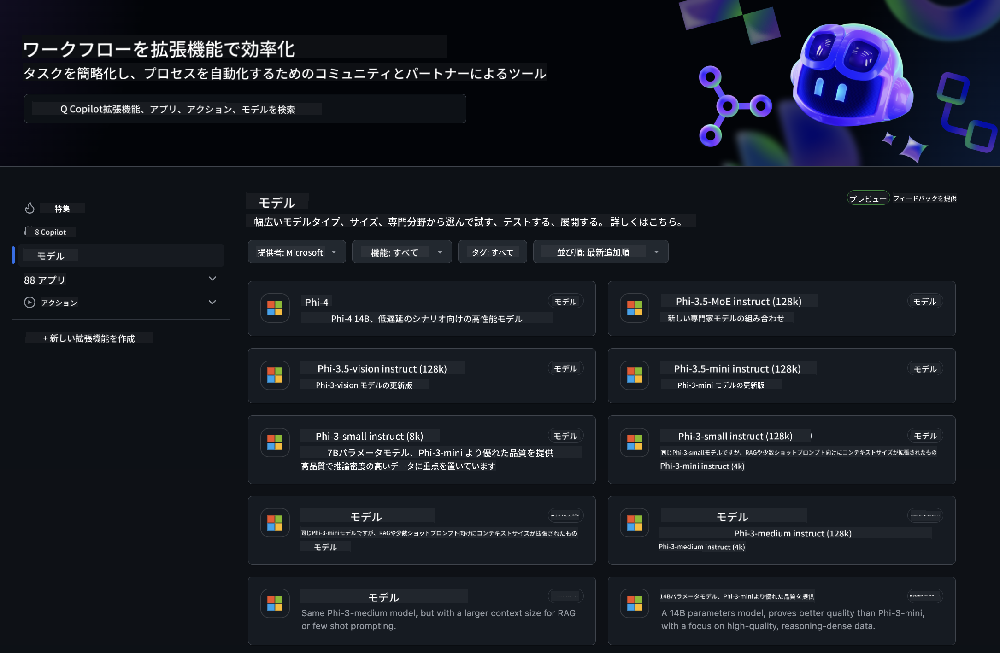
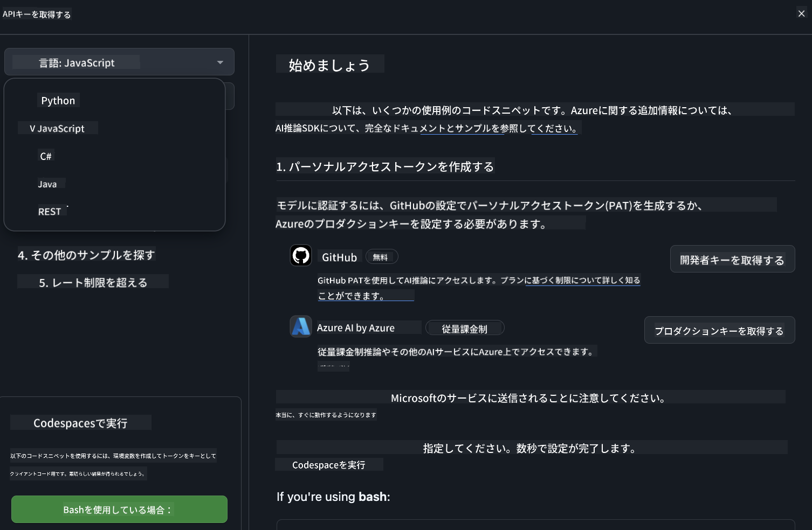
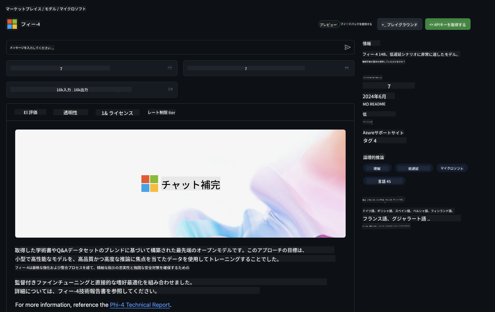

<!--
CO_OP_TRANSLATOR_METADATA:
{
  "original_hash": "3f37da1518bfb2cc9a8faa427fb0c916",
  "translation_date": "2025-04-04T13:07:23+00:00",
  "source_file": "md\\02.QuickStart\\GitHubModel_QuickStart.md",
  "language_code": "ja"
}
-->
## GitHub Models - 限定公開ベータ版

[GitHub Models](https://github.com/marketplace/models)へようこそ！Azure AI上でホストされているAIモデルを探索する準備が整いました。



GitHub Modelsで利用可能なモデルについて詳しくは、[GitHub Model Marketplace](https://github.com/marketplace/models)をご覧ください。

## 利用可能なモデル

各モデルには専用のプレイグラウンドとサンプルコードが用意されています。


### GitHub Model CatalogのPhi-3モデル

[Phi-3-Medium-128k-Instruct](https://github.com/marketplace/models/azureml/Phi-3-medium-128k-instruct)

[Phi-3-medium-4k-instruct](https://github.com/marketplace/models/azureml/Phi-3-medium-4k-instruct)

[Phi-3-mini-128k-instruct](https://github.com/marketplace/models/azureml/Phi-3-mini-128k-instruct)

[Phi-3-mini-4k-instruct](https://github.com/marketplace/models/azureml/Phi-3-mini-4k-instruct)

[Phi-3-small-128k-instruct](https://github.com/marketplace/models/azureml/Phi-3-small-128k-instruct)

[Phi-3-small-8k-instruct](https://github.com/marketplace/models/azureml/Phi-3-small-8k-instruct)

## 始め方

すぐに実行可能な基本的な例がいくつか用意されています。これらはサンプルディレクトリにあります。特定の言語を使いたい場合は、以下の言語別の例を参照してください：

- Python
- JavaScript
- cURL

サンプルやモデルを実行する専用のCodespaces環境も用意されています。



## サンプルコード

以下は、いくつかのユースケースに対応したサンプルコードスニペットです。Azure AI Inference SDKの詳細については、完全なドキュメントとサンプルをご覧ください。

## セットアップ

1. 個人アクセストークンを作成する  
トークンに特別な権限を付与する必要はありません。このトークンはMicrosoftのサービスに送信されることに注意してください。

以下のコードスニペットを使用するためには、環境変数を作成してトークンをクライアントコードのキーとして設定してください。

bashを使用している場合：  
```
export GITHUB_TOKEN="<your-github-token-goes-here>"
```  
powershellを使用している場合：  
```
$Env:GITHUB_TOKEN="<your-github-token-goes-here>"
```  

Windowsコマンドプロンプトを使用している場合：  
```
set GITHUB_TOKEN=<your-github-token-goes-here>
```  

## Pythonサンプル

### 依存関係のインストール
pipを使用してAzure AI Inference SDKをインストールします（必要条件：Python >=3.8）。

```
pip install azure-ai-inference
```  

### 基本的なコードサンプルを実行する

このサンプルは、チャット補完APIへの基本的な呼び出しを示しています。GitHub AIモデル推論エンドポイントとGitHubトークンを利用しています。この呼び出しは同期的です。

```
import os
from azure.ai.inference import ChatCompletionsClient
from azure.ai.inference.models import SystemMessage, UserMessage
from azure.core.credentials import AzureKeyCredential

endpoint = "https://models.inference.ai.azure.com"
# Replace Model_Name 
model_name = "Phi-3-small-8k-instruct"
token = os.environ["GITHUB_TOKEN"]

client = ChatCompletionsClient(
    endpoint=endpoint,
    credential=AzureKeyCredential(token),
)

response = client.complete(
    messages=[
        SystemMessage(content="You are a helpful assistant."),
        UserMessage(content="What is the capital of France?"),
    ],
    model=model_name,
    temperature=1.,
    max_tokens=1000,
    top_p=1.
)

print(response.choices[0].message.content)
```  

### マルチターン会話を実行する

このサンプルは、チャット補完APIを使用したマルチターン会話を示しています。チャットアプリケーションでモデルを使用する際には、会話の履歴を管理し、最新のメッセージをモデルに送信する必要があります。

```
import os
from azure.ai.inference import ChatCompletionsClient
from azure.ai.inference.models import AssistantMessage, SystemMessage, UserMessage
from azure.core.credentials import AzureKeyCredential

token = os.environ["GITHUB_TOKEN"]
endpoint = "https://models.inference.ai.azure.com"
# Replace Model_Name
model_name = "Phi-3-small-8k-instruct"

client = ChatCompletionsClient(
    endpoint=endpoint,
    credential=AzureKeyCredential(token),
)

messages = [
    SystemMessage(content="You are a helpful assistant."),
    UserMessage(content="What is the capital of France?"),
    AssistantMessage(content="The capital of France is Paris."),
    UserMessage(content="What about Spain?"),
]

response = client.complete(messages=messages, model=model_name)

print(response.choices[0].message.content)
```  

### 出力をストリームする

より良いユーザー体験のためには、モデルの応答をストリームして最初のトークンを早く表示し、長い応答を待つことを避けることが推奨されます。

```
import os
from azure.ai.inference import ChatCompletionsClient
from azure.ai.inference.models import SystemMessage, UserMessage
from azure.core.credentials import AzureKeyCredential

token = os.environ["GITHUB_TOKEN"]
endpoint = "https://models.inference.ai.azure.com"
# Replace Model_Name
model_name = "Phi-3-small-8k-instruct"

client = ChatCompletionsClient(
    endpoint=endpoint,
    credential=AzureKeyCredential(token),
)

response = client.complete(
    stream=True,
    messages=[
        SystemMessage(content="You are a helpful assistant."),
        UserMessage(content="Give me 5 good reasons why I should exercise every day."),
    ],
    model=model_name,
)

for update in response:
    if update.choices:
        print(update.choices[0].delta.content or "", end="")

client.close()
```  

## JavaScript

### 依存関係のインストール

Node.jsをインストールします。

以下のテキストをコピーして、フォルダー内にpackage.jsonという名前で保存してください。

```
{
  "type": "module",
  "dependencies": {
    "@azure-rest/ai-inference": "latest",
    "@azure/core-auth": "latest",
    "@azure/core-sse": "latest"
  }
}
```  

注: @azure/core-sseは、チャット補完応答をストリームする場合にのみ必要です。

このフォルダーでターミナルウィンドウを開き、npm installを実行してください。

以下のコードスニペットをそれぞれコピーして、sample.jsというファイルに保存し、node sample.jsで実行してください。

### 基本的なコードサンプルを実行する

このサンプルは、チャット補完APIへの基本的な呼び出しを示しています。GitHub AIモデル推論エンドポイントとGitHubトークンを利用しています。この呼び出しは同期的です。

```
import ModelClient from "@azure-rest/ai-inference";
import { AzureKeyCredential } from "@azure/core-auth";

const token = process.env["GITHUB_TOKEN"];
const endpoint = "https://models.inference.ai.azure.com";
// Update your modelname
const modelName = "Phi-3-small-8k-instruct";

export async function main() {

  const client = new ModelClient(endpoint, new AzureKeyCredential(token));

  const response = await client.path("/chat/completions").post({
    body: {
      messages: [
        { role:"system", content: "You are a helpful assistant." },
        { role:"user", content: "What is the capital of France?" }
      ],
      model: modelName,
      temperature: 1.,
      max_tokens: 1000,
      top_p: 1.
    }
  });

  if (response.status !== "200") {
    throw response.body.error;
  }
  console.log(response.body.choices[0].message.content);
}

main().catch((err) => {
  console.error("The sample encountered an error:", err);
});
```  

### マルチターン会話を実行する

このサンプルは、チャット補完APIを使用したマルチターン会話を示しています。チャットアプリケーションでモデルを使用する際には、会話の履歴を管理し、最新のメッセージをモデルに送信する必要があります。

```
import ModelClient from "@azure-rest/ai-inference";
import { AzureKeyCredential } from "@azure/core-auth";

const token = process.env["GITHUB_TOKEN"];
const endpoint = "https://models.inference.ai.azure.com";
// Update your modelname
const modelName = "Phi-3-small-8k-instruct";

export async function main() {

  const client = new ModelClient(endpoint, new AzureKeyCredential(token));

  const response = await client.path("/chat/completions").post({
    body: {
      messages: [
        { role: "system", content: "You are a helpful assistant." },
        { role: "user", content: "What is the capital of France?" },
        { role: "assistant", content: "The capital of France is Paris." },
        { role: "user", content: "What about Spain?" },
      ],
      model: modelName,
    }
  });

  if (response.status !== "200") {
    throw response.body.error;
  }

  for (const choice of response.body.choices) {
    console.log(choice.message.content);
  }
}

main().catch((err) => {
  console.error("The sample encountered an error:", err);
});
```  

### 出力をストリームする

より良いユーザー体験のためには、モデルの応答をストリームして最初のトークンを早く表示し、長い応答を待つことを避けることが推奨されます。

```
import ModelClient from "@azure-rest/ai-inference";
import { AzureKeyCredential } from "@azure/core-auth";
import { createSseStream } from "@azure/core-sse";

const token = process.env["GITHUB_TOKEN"];
const endpoint = "https://models.inference.ai.azure.com";
// Update your modelname
const modelName = "Phi-3-small-8k-instruct";

export async function main() {

  const client = new ModelClient(endpoint, new AzureKeyCredential(token));

  const response = await client.path("/chat/completions").post({
    body: {
      messages: [
        { role: "system", content: "You are a helpful assistant." },
        { role: "user", content: "Give me 5 good reasons why I should exercise every day." },
      ],
      model: modelName,
      stream: true
    }
  }).asNodeStream();

  const stream = response.body;
  if (!stream) {
    throw new Error("The response stream is undefined");
  }

  if (response.status !== "200") {
    stream.destroy();
    throw new Error(`Failed to get chat completions, http operation failed with ${response.status} code`);
  }

  const sseStream = createSseStream(stream);

  for await (const event of sseStream) {
    if (event.data === "[DONE]") {
      return;
    }
    for (const choice of (JSON.parse(event.data)).choices) {
        process.stdout.write(choice.delta?.content ?? ``);
    }
  }
}

main().catch((err) => {
  console.error("The sample encountered an error:", err);
});
```  

## REST

### 基本的なコードサンプルを実行する

以下をシェルに貼り付けてください：

```
curl -X POST "https://models.inference.ai.azure.com/chat/completions" \
    -H "Content-Type: application/json" \
    -H "Authorization: Bearer $GITHUB_TOKEN" \
    -d '{
        "messages": [
            {
                "role": "system",
                "content": "You are a helpful assistant."
            },
            {
                "role": "user",
                "content": "What is the capital of France?"
            }
        ],
        "model": "Phi-3-small-8k-instruct"
    }'
```  

### マルチターン会話を実行する

チャット履歴を渡してチャット補完APIを呼び出してください：

```
curl -X POST "https://models.inference.ai.azure.com/chat/completions" \
    -H "Content-Type: application/json" \
    -H "Authorization: Bearer $GITHUB_TOKEN" \
    -d '{
        "messages": [
            {
                "role": "system",
                "content": "You are a helpful assistant."
            },
            {
                "role": "user",
                "content": "What is the capital of France?"
            },
            {
                "role": "assistant",
                "content": "The capital of France is Paris."
            },
            {
                "role": "user",
                "content": "What about Spain?"
            }
        ],
        "model": "Phi-3-small-8k-instruct"
    }'
```  

### 出力をストリームする

エンドポイントを呼び出し、応答をストリームする例です。

```
curl -X POST "https://models.inference.ai.azure.com/chat/completions" \
    -H "Content-Type: application/json" \
    -H "Authorization: Bearer $GITHUB_TOKEN" \
    -d '{
        "messages": [
            {
                "role": "system",
                "content": "You are a helpful assistant."
            },
            {
                "role": "user",
                "content": "Give me 5 good reasons why I should exercise every day."
            }
        ],
        "stream": true,
        "model": "Phi-3-small-8k-instruct"
    }'
```  

## GitHub Modelsの無料利用とレート制限



プレイグラウンドと無料API利用の[レート制限](https://docs.github.com/en/github-models/prototyping-with-ai-models#rate-limits)は、モデルを試してAIアプリケーションをプロトタイプするためのものです。これらの制限を超えて利用する場合や、アプリケーションをスケールさせたい場合は、Azureアカウントからリソースをプロビジョニングし、そこから認証する必要があります。コードの他の部分を変更する必要はありません。Azure AIで無料利用枠を超える方法については、こちらのリンクをご覧ください。

### 注意事項

モデルを操作する際には、AIを試していることを念頭に置いてください。そのため、コンテンツに誤りが含まれる可能性があります。

この機能には様々な制限（1分あたりのリクエスト数、1日あたりのリクエスト数、リクエストごとのトークン数、同時リクエスト数など）があり、プロダクション用途には設計されていません。

GitHub ModelsはAzure AIコンテンツセーフティを使用しています。これらのフィルターはGitHub Modelsの利用体験の一部としてオフにすることはできません。有料サービスを通じてモデルを使用する場合は、コンテンツフィルターをニーズに合わせて設定してください。

このサービスはGitHubのプレリリース規約の対象となります。

**免責事項**:  
この文書はAI翻訳サービス [Co-op Translator](https://github.com/Azure/co-op-translator) を使用して翻訳されています。正確性を追求していますが、自動翻訳には誤りや不正確な部分が含まれる可能性があることをご承知おきください。元の言語で記載された原文が正式な情報源とみなされるべきです。重要な情報については、専門の人間による翻訳を推奨します。この翻訳の使用に起因する誤解や解釈の誤りについて、当方は責任を負いません。