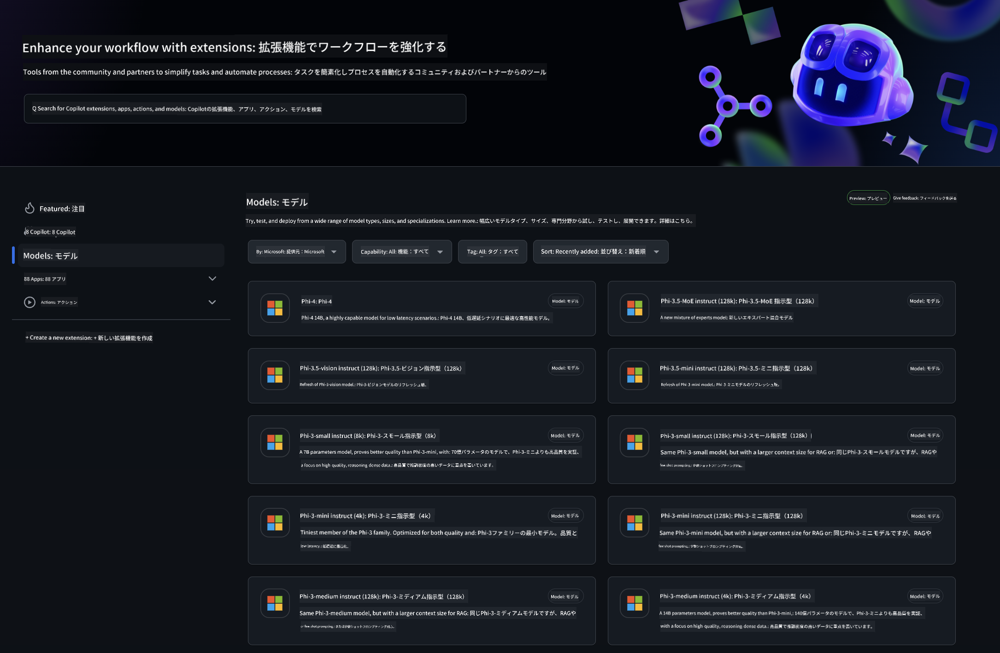

<!--
CO_OP_TRANSLATOR_METADATA:
{
  "original_hash": "5113634b77370af6790f9697d5d7de90",
  "translation_date": "2025-05-08T05:00:49+00:00",
  "source_file": "md/02.QuickStart/GitHubModel_QuickStart.md",
  "language_code": "ja"
}
-->
## GitHub Models - 限定パブリックベータ

[GitHub Models](https://github.com/marketplace/models)へようこそ！Azure AI上でホストされているAIモデルを探索できる環境が整っています。



GitHub Modelsで利用可能なモデルの詳細については、[GitHub Model Marketplace](https://github.com/marketplace/models)をご覧ください。

## 利用可能なモデル

各モデルには専用のプレイグラウンドとサンプルコードがあります。


### GitHub Model CatalogのPhi-3モデル

[Phi-3-Medium-128k-Instruct](https://github.com/marketplace/models/azureml/Phi-3-medium-128k-instruct)

[Phi-3-medium-4k-instruct](https://github.com/marketplace/models/azureml/Phi-3-medium-4k-instruct)

[Phi-3-mini-128k-instruct](https://github.com/marketplace/models/azureml/Phi-3-mini-128k-instruct)

[Phi-3-mini-4k-instruct](https://github.com/marketplace/models/azureml/Phi-3-mini-4k-instruct)

[Phi-3-small-128k-instruct](https://github.com/marketplace/models/azureml/Phi-3-small-128k-instruct)

[Phi-3-small-8k-instruct](https://github.com/marketplace/models/azureml/Phi-3-small-8k-instruct)

## はじめに

すぐに実行できる基本的な例がいくつか用意されています。samplesディレクトリで見つけることができます。お好みの言語に直接ジャンプしたい場合は、以下の言語の例をご覧ください。

- Python
- JavaScript
- cURL

また、サンプルやモデルを実行するための専用のCodespaces環境も用意されています。


## サンプルコード

以下は、いくつかのユースケースの例コードスニペットです。Azure AI Inference SDKの詳細については、公式ドキュメントとサンプルをご参照ください。

## セットアップ

1. パーソナルアクセストークンを作成します  
トークンに特別な権限を付与する必要はありません。トークンはMicrosoftのサービスに送信されることに注意してください。

以下のコードスニペットを使うには、環境変数としてトークンをクライアントコードのキーに設定してください。

bashを使っている場合：  
```
export GITHUB_TOKEN="<your-github-token-goes-here>"
```  
powershellの場合：  
```
$Env:GITHUB_TOKEN="<your-github-token-goes-here>"
```  
Windowsコマンドプロンプトの場合：  
```
set GITHUB_TOKEN=<your-github-token-goes-here>
```

## Pythonサンプル

### 依存関係のインストール  
pipを使ってAzure AI Inference SDKをインストールします（Python 3.8以上が必要）：

```
pip install azure-ai-inference
```

### 基本的なコードサンプルの実行

このサンプルはchat completion APIへの基本的な呼び出しを示しています。GitHub AIモデルの推論エンドポイントとGitHubトークンを利用しています。呼び出しは同期的です。

```
import os
from azure.ai.inference import ChatCompletionsClient
from azure.ai.inference.models import SystemMessage, UserMessage
from azure.core.credentials import AzureKeyCredential

endpoint = "https://models.inference.ai.azure.com"
# Replace Model_Name 
model_name = "Phi-3-small-8k-instruct"
token = os.environ["GITHUB_TOKEN"]

client = ChatCompletionsClient(
    endpoint=endpoint,
    credential=AzureKeyCredential(token),
)

response = client.complete(
    messages=[
        SystemMessage(content="You are a helpful assistant."),
        UserMessage(content="What is the capital of France?"),
    ],
    model=model_name,
    temperature=1.,
    max_tokens=1000,
    top_p=1.
)

print(response.choices[0].message.content)
```

### マルチターン会話の実行

このサンプルはchat completion APIを使ったマルチターン会話を示しています。チャットアプリケーションでモデルを使う場合は、会話履歴を管理し最新のメッセージをモデルに送る必要があります。

```
import os
from azure.ai.inference import ChatCompletionsClient
from azure.ai.inference.models import AssistantMessage, SystemMessage, UserMessage
from azure.core.credentials import AzureKeyCredential

token = os.environ["GITHUB_TOKEN"]
endpoint = "https://models.inference.ai.azure.com"
# Replace Model_Name
model_name = "Phi-3-small-8k-instruct"

client = ChatCompletionsClient(
    endpoint=endpoint,
    credential=AzureKeyCredential(token),
)

messages = [
    SystemMessage(content="You are a helpful assistant."),
    UserMessage(content="What is the capital of France?"),
    AssistantMessage(content="The capital of France is Paris."),
    UserMessage(content="What about Spain?"),
]

response = client.complete(messages=messages, model=model_name)

print(response.choices[0].message.content)
```

### 出力のストリーミング

より良いユーザー体験のために、モデルの応答をストリーミングし、最初のトークンが早く表示されるようにして、長い応答を待つのを避けましょう。

```
import os
from azure.ai.inference import ChatCompletionsClient
from azure.ai.inference.models import SystemMessage, UserMessage
from azure.core.credentials import AzureKeyCredential

token = os.environ["GITHUB_TOKEN"]
endpoint = "https://models.inference.ai.azure.com"
# Replace Model_Name
model_name = "Phi-3-small-8k-instruct"

client = ChatCompletionsClient(
    endpoint=endpoint,
    credential=AzureKeyCredential(token),
)

response = client.complete(
    stream=True,
    messages=[
        SystemMessage(content="You are a helpful assistant."),
        UserMessage(content="Give me 5 good reasons why I should exercise every day."),
    ],
    model=model_name,
)

for update in response:
    if update.choices:
        print(update.choices[0].delta.content or "", end="")

client.close()
```

## JavaScript

### 依存関係のインストール

Node.jsをインストールしてください。

以下のテキストをコピーして、フォルダ内にpackage.jsonとして保存してください。

```
{
  "type": "module",
  "dependencies": {
    "@azure-rest/ai-inference": "latest",
    "@azure/core-auth": "latest",
    "@azure/core-sse": "latest"
  }
}
```

注意：@azure/core-sseはチャット完了のレスポンスをストリーミングする場合のみ必要です。

このフォルダでターミナルを開き、npm installを実行してください。

以下のコードスニペットはそれぞれsample.jsにコピーし、node sample.jsで実行します。

### 基本的なコードサンプルの実行

このサンプルはchat completion APIへの基本的な呼び出しを示しています。GitHub AIモデルの推論エンドポイントとGitHubトークンを利用しています。呼び出しは同期的です。

```
import ModelClient from "@azure-rest/ai-inference";
import { AzureKeyCredential } from "@azure/core-auth";

const token = process.env["GITHUB_TOKEN"];
const endpoint = "https://models.inference.ai.azure.com";
// Update your modelname
const modelName = "Phi-3-small-8k-instruct";

export async function main() {

  const client = new ModelClient(endpoint, new AzureKeyCredential(token));

  const response = await client.path("/chat/completions").post({
    body: {
      messages: [
        { role:"system", content: "You are a helpful assistant." },
        { role:"user", content: "What is the capital of France?" }
      ],
      model: modelName,
      temperature: 1.,
      max_tokens: 1000,
      top_p: 1.
    }
  });

  if (response.status !== "200") {
    throw response.body.error;
  }
  console.log(response.body.choices[0].message.content);
}

main().catch((err) => {
  console.error("The sample encountered an error:", err);
});
```

### マルチターン会話の実行

このサンプルはchat completion APIを使ったマルチターン会話を示しています。チャットアプリケーションでモデルを使う場合は、会話履歴を管理し最新のメッセージをモデルに送る必要があります。

```
import ModelClient from "@azure-rest/ai-inference";
import { AzureKeyCredential } from "@azure/core-auth";

const token = process.env["GITHUB_TOKEN"];
const endpoint = "https://models.inference.ai.azure.com";
// Update your modelname
const modelName = "Phi-3-small-8k-instruct";

export async function main() {

  const client = new ModelClient(endpoint, new AzureKeyCredential(token));

  const response = await client.path("/chat/completions").post({
    body: {
      messages: [
        { role: "system", content: "You are a helpful assistant." },
        { role: "user", content: "What is the capital of France?" },
        { role: "assistant", content: "The capital of France is Paris." },
        { role: "user", content: "What about Spain?" },
      ],
      model: modelName,
    }
  });

  if (response.status !== "200") {
    throw response.body.error;
  }

  for (const choice of response.body.choices) {
    console.log(choice.message.content);
  }
}

main().catch((err) => {
  console.error("The sample encountered an error:", err);
});
```

### 出力のストリーミング

より良いユーザー体験のために、モデルの応答をストリーミングし、最初のトークンが早く表示されるようにして、長い応答を待つのを避けましょう。

```
import ModelClient from "@azure-rest/ai-inference";
import { AzureKeyCredential } from "@azure/core-auth";
import { createSseStream } from "@azure/core-sse";

const token = process.env["GITHUB_TOKEN"];
const endpoint = "https://models.inference.ai.azure.com";
// Update your modelname
const modelName = "Phi-3-small-8k-instruct";

export async function main() {

  const client = new ModelClient(endpoint, new AzureKeyCredential(token));

  const response = await client.path("/chat/completions").post({
    body: {
      messages: [
        { role: "system", content: "You are a helpful assistant." },
        { role: "user", content: "Give me 5 good reasons why I should exercise every day." },
      ],
      model: modelName,
      stream: true
    }
  }).asNodeStream();

  const stream = response.body;
  if (!stream) {
    throw new Error("The response stream is undefined");
  }

  if (response.status !== "200") {
    stream.destroy();
    throw new Error(`Failed to get chat completions, http operation failed with ${response.status} code`);
  }

  const sseStream = createSseStream(stream);

  for await (const event of sseStream) {
    if (event.data === "[DONE]") {
      return;
    }
    for (const choice of (JSON.parse(event.data)).choices) {
        process.stdout.write(choice.delta?.content ?? ``);
    }
  }
}

main().catch((err) => {
  console.error("The sample encountered an error:", err);
});
```

## REST

### 基本的なコードサンプルの実行

以下をシェルに貼り付けてください：

```
curl -X POST "https://models.inference.ai.azure.com/chat/completions" \
    -H "Content-Type: application/json" \
    -H "Authorization: Bearer $GITHUB_TOKEN" \
    -d '{
        "messages": [
            {
                "role": "system",
                "content": "You are a helpful assistant."
            },
            {
                "role": "user",
                "content": "What is the capital of France?"
            }
        ],
        "model": "Phi-3-small-8k-instruct"
    }'
```

### マルチターン会話の実行

chat completion APIを呼び出し、チャット履歴を渡します：

```
curl -X POST "https://models.inference.ai.azure.com/chat/completions" \
    -H "Content-Type: application/json" \
    -H "Authorization: Bearer $GITHUB_TOKEN" \
    -d '{
        "messages": [
            {
                "role": "system",
                "content": "You are a helpful assistant."
            },
            {
                "role": "user",
                "content": "What is the capital of France?"
            },
            {
                "role": "assistant",
                "content": "The capital of France is Paris."
            },
            {
                "role": "user",
                "content": "What about Spain?"
            }
        ],
        "model": "Phi-3-small-8k-instruct"
    }'
```

### 出力のストリーミング

エンドポイントを呼び出し、レスポンスをストリーミングする例です。

```
curl -X POST "https://models.inference.ai.azure.com/chat/completions" \
    -H "Content-Type: application/json" \
    -H "Authorization: Bearer $GITHUB_TOKEN" \
    -d '{
        "messages": [
            {
                "role": "system",
                "content": "You are a helpful assistant."
            },
            {
                "role": "user",
                "content": "Give me 5 good reasons why I should exercise every day."
            }
        ],
        "stream": true,
        "model": "Phi-3-small-8k-instruct"
    }'
```

## GitHub Modelsの無料利用とレート制限


[プレイグラウンドおよび無料API利用のレート制限](https://docs.github.com/en/github-models/prototyping-with-ai-models#rate-limits)は、モデルの実験やAIアプリケーションのプロトタイプ作成を支援するためのものです。これらの制限を超えて利用し、アプリケーションを本格運用するには、Azureアカウントでリソースをプロビジョニングし、GitHubのパーソナルアクセストークンではなくそちらから認証を行う必要があります。コードの他の部分を変更する必要はありません。Azure AIの無料枠を超える方法については、こちらのリンクをご参照ください。

### 注意事項

モデルと対話するときは、AIを実験していることを念頭に置いてください。内容に誤りが含まれる可能性があります。

この機能はさまざまな制限（1分あたりのリクエスト数、1日あたりのリクエスト数、リクエストごとのトークン数、同時リクエスト数など）があり、本番用途向けではありません。

GitHub ModelsはAzure AI Content Safetyを使用しています。これらのフィルターはGitHub Modelsの利用時にオフにできません。有料サービスでモデルを利用する場合は、要件に応じてコンテンツフィルターを設定してください。

このサービスはGitHubのプレリリース利用規約の対象です。

**免責事項**：  
本書類はAI翻訳サービス[Co-op Translator](https://github.com/Azure/co-op-translator)を使用して翻訳されました。正確性を期しておりますが、自動翻訳には誤りや不正確な部分が含まれる可能性があることをご承知おきください。原文の言語による文書が正式な情報源とみなされます。重要な情報については、専門の人間による翻訳を推奨いたします。本翻訳の利用により生じたいかなる誤解や誤訳についても責任を負いかねます。