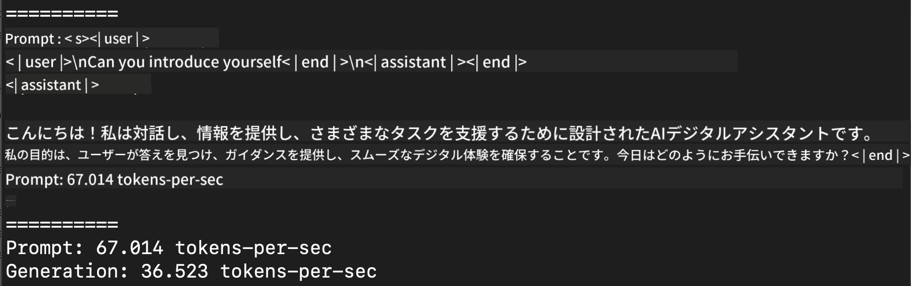

<!--
CO_OP_TRANSLATOR_METADATA:
{
  "original_hash": "dcb656f3d206fc4968e236deec5d4384",
  "translation_date": "2025-07-17T10:04:46+00:00",
  "source_file": "md/03.FineTuning/03.Inference/MLX_Inference.md",
  "language_code": "ja"
}
-->
# **Apple MLXフレームワークでのPhi-3推論**

## **MLXフレームワークとは**

MLXはAppleシリコン上での機械学習研究のための配列フレームワークで、Appleの機械学習研究チームによって開発されました。

MLXは機械学習研究者による機械学習研究者のための設計です。ユーザーフレンドリーでありながら、モデルのトレーニングやデプロイが効率的に行えるように作られています。フレームワーク自体の設計も概念的にシンプルです。研究者がMLXを拡張・改善しやすくし、新しいアイデアを素早く試せることを目指しています。

Appleシリコン搭載デバイス上でMLXを使うことでLLMの高速化が可能で、モデルをローカルで手軽に実行できます。

## **MLXを使ったPhi-3-miniの推論**

### **1. MLX環境のセットアップ**

1. Python 3.11.x
2. MLXライブラリのインストール


```bash

pip install mlx-lm

```

### **2. ターミナルでMLXを使ってPhi-3-miniを実行**


```bash

python -m mlx_lm.generate --model microsoft/Phi-3-mini-4k-instruct --max-token 2048 --prompt  "<|user|>\nCan you introduce yourself<|end|>\n<|assistant|>"

```

結果（私の環境はApple M1 Max、64GB）は以下の通りです。



### **3. ターミナルでMLXを使ってPhi-3-miniを量子化**


```bash

python -m mlx_lm.convert --hf-path microsoft/Phi-3-mini-4k-instruct

```

***Note：*** モデルはmlx_lm.convertを使って量子化でき、デフォルトの量子化はINT4です。この例ではPhi-3-miniをINT4に量子化しています。

モデルはmlx_lm.convertで量子化可能で、デフォルトはINT4です。この例ではPhi-3-miniをINT4に量子化し、量子化後のモデルはデフォルトのディレクトリ ./mlx_model に保存されます。

ターミナルからMLXで量子化したモデルをテストできます。


```bash

python -m mlx_lm.generate --model ./mlx_model/ --max-token 2048 --prompt  "<|user|>\nCan you introduce yourself<|end|>\n<|assistant|>"

```

結果は以下の通りです。


### **4. Jupyter NotebookでMLXを使ってPhi-3-miniを実行**


***Note:*** このサンプルは[こちらのリンク](../../../../../code/03.Inference/MLX/MLX_DEMO.ipynb)からご覧ください。


## **リソース**

1. Apple MLXフレームワークについて学ぶ [https://ml-explore.github.io](https://ml-explore.github.io/mlx/build/html/index.html)

2. Apple MLX GitHubリポジトリ [https://github.com/ml-explore](https://github.com/ml-explore)

**免責事項**：  
本書類はAI翻訳サービス「[Co-op Translator](https://github.com/Azure/co-op-translator)」を使用して翻訳されました。正確性の向上に努めておりますが、自動翻訳には誤りや不正確な部分が含まれる可能性があります。原文の言語によるオリジナル文書が正式な情報源とみなされるべきです。重要な情報については、専門の人間による翻訳を推奨します。本翻訳の利用により生じたいかなる誤解や誤訳についても、当方は一切の責任を負いかねます。