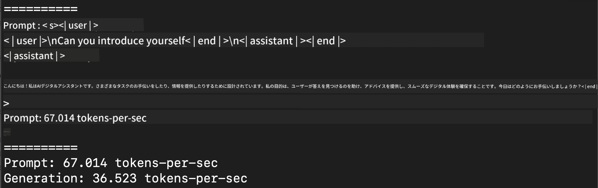
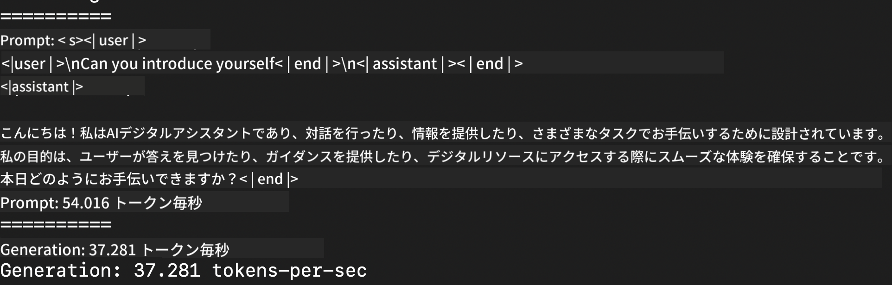
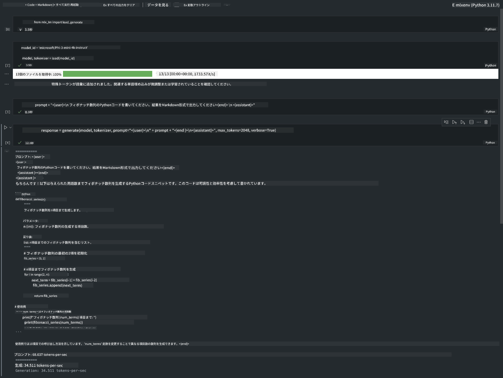

<!--
CO_OP_TRANSLATOR_METADATA:
{
  "original_hash": "700b9a537ce4426de5a7ccfa8e96e581",
  "translation_date": "2025-04-04T13:36:16+00:00",
  "source_file": "md\\03.FineTuning\\03.Inference\\MLX_Inference.md",
  "language_code": "ja"
}
-->
# **Apple MLXフレームワークでPhi-3を推論**

## **MLXフレームワークとは**

MLXはAppleシリコン上で機械学習研究を行うための配列フレームワークで、Appleの機械学習研究チームによって提供されています。

MLXは機械学習研究者のために設計されており、使いやすさを追求しつつ、モデルの効率的なトレーニングとデプロイを可能にします。このフレームワーク自体の設計も概念的にシンプルであり、研究者がMLXを簡単に拡張・改善し、新しいアイデアを迅速に探求できるようにすることを目指しています。

LLMはMLXを利用することでAppleシリコンデバイス上で加速され、ローカル環境で非常に便利に実行できます。

## **MLXでPhi-3-miniを推論する**

### **1. MLX環境をセットアップする**

1. Python 3.11.x
2. MLXライブラリをインストール


```bash

pip install mlx-lm

```

### **2. ターミナルでPhi-3-miniをMLXで実行する**


```bash

python -m mlx_lm.generate --model microsoft/Phi-3-mini-4k-instruct --max-token 2048 --prompt  "<|user|>\nCan you introduce yourself<|end|>\n<|assistant|>"

```

結果（私の環境はApple M1 Max, 64GB）は以下の通りです。



### **3. ターミナルでPhi-3-miniをMLXで量子化する**


```bash

python -m mlx_lm.convert --hf-path microsoft/Phi-3-mini-4k-instruct

```

***注意：*** モデルはmlx_lm.convertを使用して量子化できます。デフォルトの量子化形式はINT4です。この例ではPhi-3-miniをINT4に量子化しています。

モデルはmlx_lm.convertを使用して量子化でき、デフォルトの量子化形式はINT4です。この例ではPhi-3-miniをINT4に量子化します。量子化後、モデルはデフォルトディレクトリ ./mlx_model に保存されます。

量子化されたモデルをターミナルでMLXを使用してテストできます。


```bash

python -m mlx_lm.generate --model ./mlx_model/ --max-token 2048 --prompt  "<|user|>\nCan you introduce yourself<|end|>\n<|assistant|>"

```

結果は以下の通りです。




### **4. Jupyter NotebookでPhi-3-miniをMLXで実行する**




***注意：*** このサンプルを読むには [こちらのリンクをクリック](../../../../../code/03.Inference/MLX/MLX_DEMO.ipynb)してください。


## **リソース**

1. Apple MLXフレームワークについて学ぶ [https://ml-explore.github.io](https://ml-explore.github.io/mlx/build/html/index.html)

2. Apple MLX GitHubリポジトリ [https://github.com/ml-explore](https://github.com/ml-explore)

**免責事項**:  
この文書は、AI翻訳サービス [Co-op Translator](https://github.com/Azure/co-op-translator) を使用して翻訳されています。正確性を追求していますが、自動翻訳には誤りや不正確な表現が含まれる場合があります。原文（原言語で記載された文書）を公式な情報源としてお考えください。重要な情報については、専門の人間による翻訳をお勧めします。本翻訳の使用に起因する誤解や誤認について、当方は一切の責任を負いません。