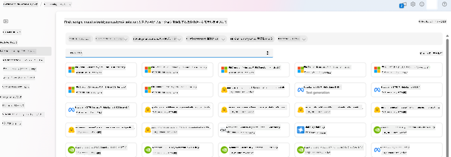
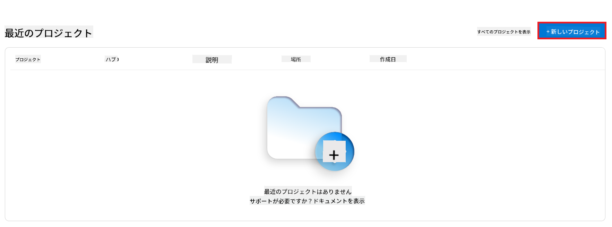
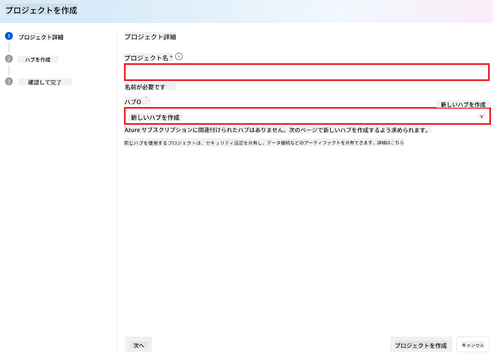
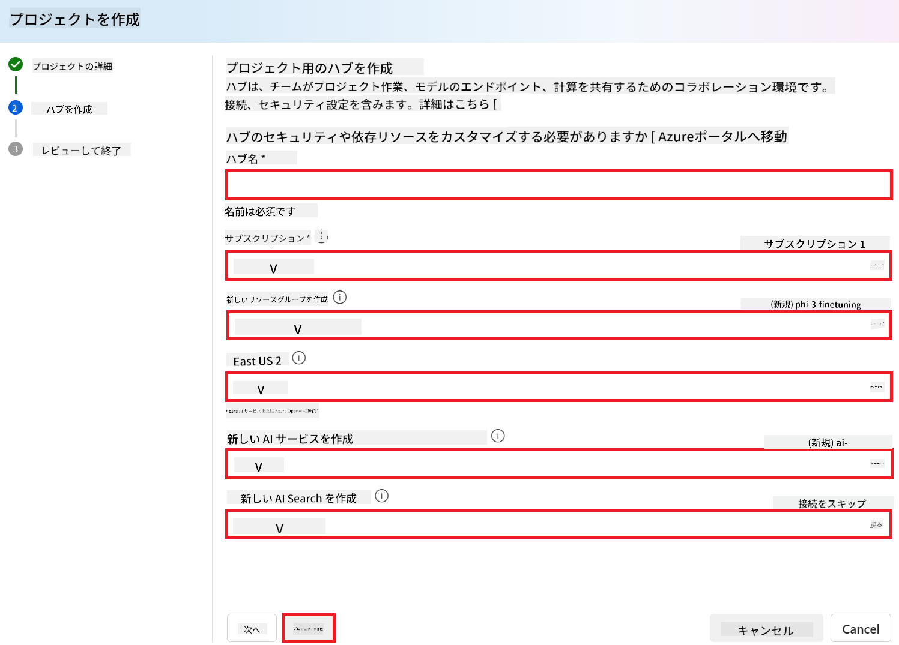
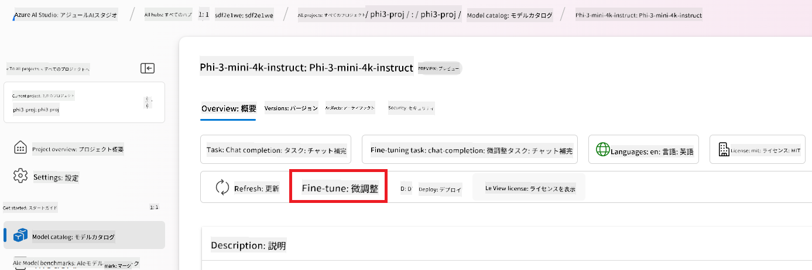
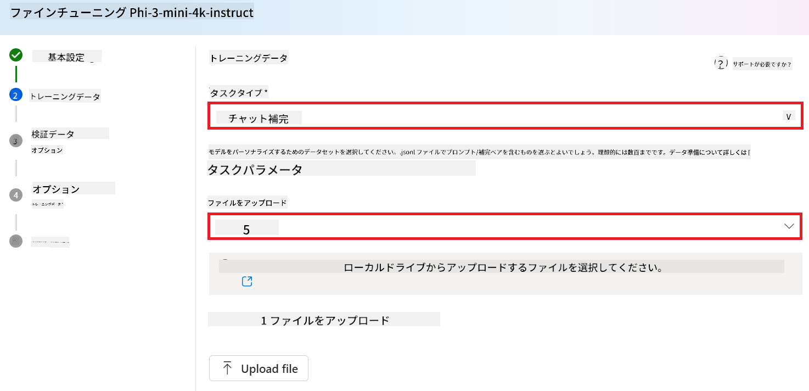
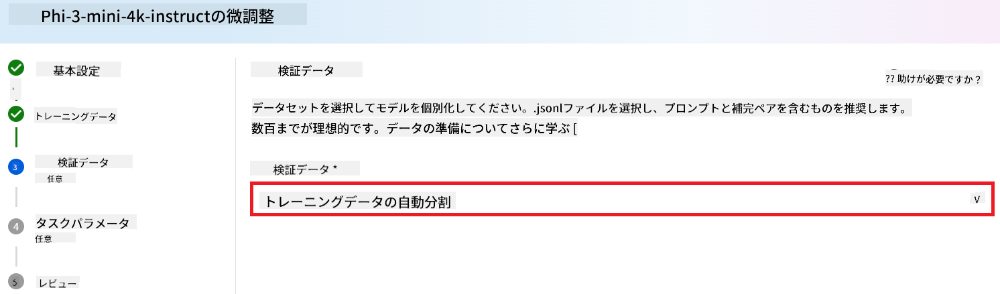
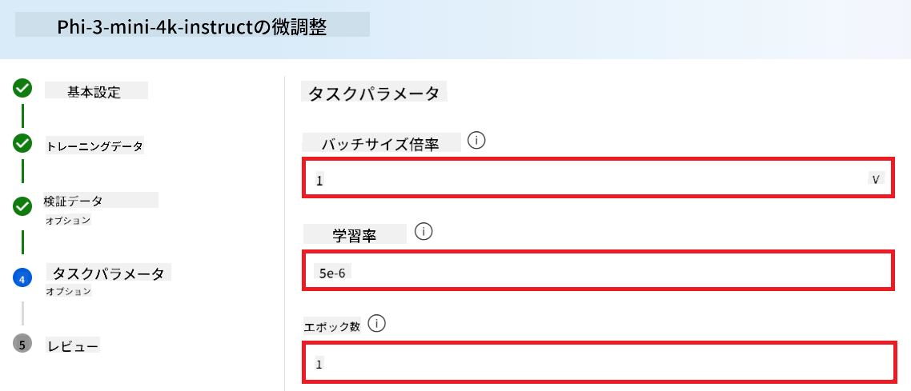
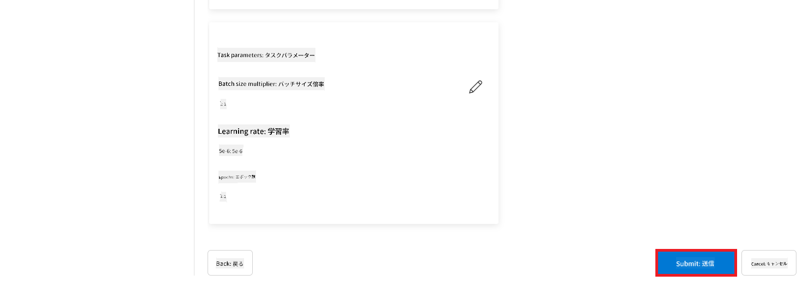
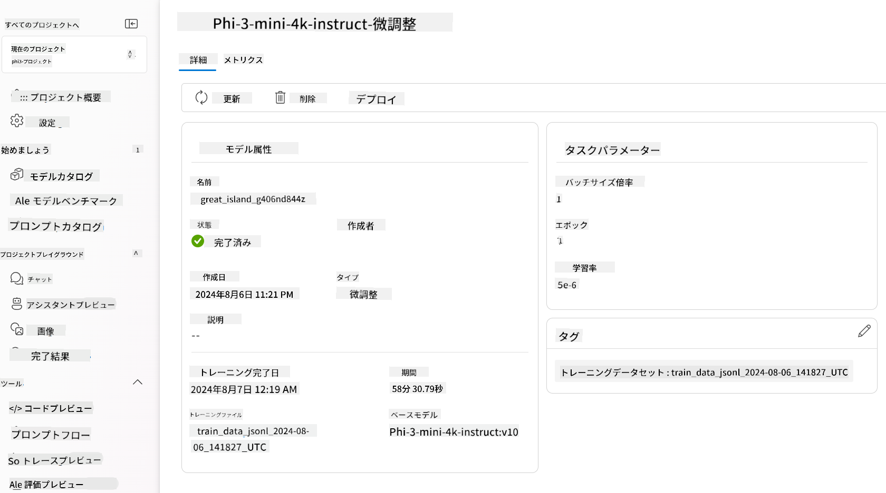

<!--
CO_OP_TRANSLATOR_METADATA:
{
  "original_hash": "94e7d7ab455720bab75ead5c28521c97",
  "translation_date": "2025-04-04T13:10:25+00:00",
  "source_file": "md\\03.FineTuning\\FineTuning_AIFoundry.md",
  "language_code": "ja"
}
-->
# Phi-3のAzure AI Foundryによる微調整

MicrosoftのPhi-3 Mini言語モデルをAzure AI Foundryを使用して微調整する方法を探ってみましょう。微調整を行うことで、Phi-3 Miniを特定のタスクに適応させ、さらに強力で文脈を理解する能力を向上させることができます。

## 考慮事項

- **能力:** 微調整可能なモデルはどれか？ベースモデルを微調整することで何ができるか？
- **コスト:** 微調整の価格体系はどうなっているか？
- **カスタマイズ性:** ベースモデルをどの程度変更できるか？どのような方法で変更できるか？
- **利便性:** 微調整はどのように行われるか？カスタムコードを書く必要があるか？自分でコンピュートリソースを用意する必要があるか？
- **安全性:** 微調整されたモデルには安全性のリスクがあることが知られていますが、意図しない危害を防ぐためのガードレールはあるか？



## 微調整の準備

### 前提条件

> [!NOTE]  
> Phi-3ファミリーモデルの場合、従量課金制の微調整サービスは**East US 2**リージョンで作成されたハブでのみ利用可能です。

- Azureサブスクリプション。Azureサブスクリプションをお持ちでない場合は、[有料Azureアカウント](https://azure.microsoft.com/pricing/purchase-options/pay-as-you-go)を作成してください。

- [AI Foundryプロジェクト](https://ai.azure.com?WT.mc_id=aiml-138114-kinfeylo)。  
- Azureのロールベースアクセス制御（Azure RBAC）は、Azure AI Foundryでの操作へのアクセスを許可するために使用されます。この手順を実行するには、ユーザーアカウントにリソースグループでの__Azure AI Developer role__が割り当てられている必要があります。

### サブスクリプションプロバイダーの登録

`Microsoft.Network`リソースプロバイダーがサブスクリプションに登録されていることを確認してください。

1. [Azureポータル](https://portal.azure.com)にサインインします。  
1. 左メニューから**サブスクリプション**を選択します。  
1. 使用するサブスクリプションを選択します。  
1. 左メニューから**AIプロジェクト設定** > **リソースプロバイダー**を選択します。  
1. **Microsoft.Network**がリソースプロバイダーのリストにあることを確認します。リストにない場合は追加してください。

### データ準備

モデルを微調整するためのトレーニングデータと検証データを準備します。トレーニングデータと検証データセットには、モデルに期待する動作を示す入力と出力の例が含まれます。

すべてのトレーニング例が推論に必要な形式に従っていることを確認してください。モデルを効果的に微調整するには、バランスが取れた多様なデータセットを確保する必要があります。

これには、データのバランスを維持し、さまざまなシナリオを含めること、トレーニングデータを定期的に更新して実際の期待に沿うようにすることが含まれます。これにより、より正確でバランスの取れたモデル応答が得られます。

異なるモデルタイプでは、トレーニングデータの形式が異なる場合があります。

### チャット完了

使用するトレーニングデータと検証データは、**JSON Lines (JSONL)** ドキュメントとしてフォーマットされている必要があります。`Phi-3-mini-128k-instruct`の微調整データセットは、Chat completions APIで使用される会話形式に従ってフォーマットされている必要があります。

### ファイル形式の例

```json
    {"messages": [{"role": "system", "content": "You are an Xbox customer support agent whose primary goal is to help users with issues they are experiencing with their Xbox devices. You are friendly and concise. You only provide factual answers to queries, and do not provide answers that are not related to Xbox."}, {"role": "user", "content": "Is Xbox better than PlayStation?"}, {"role": "assistant", "content": "I apologize, but I cannot provide personal opinions. My primary job is to assist you with any issues related to your Xbox device. Do you have any Xbox-related issues that need addressing?"}]}
    {"messages": [{"role": "system", "content": "You are an Xbox customer support agent whose primary goal is to help users with issues they are experiencing with their Xbox devices. You are friendly and concise. You only provide factual answers to queries, and do not provide answers that are not related to Xbox."}, {"role": "user", "content": "Can I play PC games on my Xbox?"}, {"role": "assistant", "content": "While Xbox consoles don't natively support PC games, they can play an array of Xbox games, many of which are also available on PC. Can I assist you with finding games compatible with your Xbox device?"}]}
    {"messages": [{"role": "system", "content": "You are an Xbox customer support agent whose primary goal is to help users with issues they are experiencing with their Xbox devices. You are friendly and concise. You only provide factual answers to queries, and do not provide answers that are not related to Xbox."}, {"role": "user", "content": "I'm having trouble connecting my Xbox to the Wi-Fi."}, {"role": "assistant", "content": "No worries, let's go through the network settings on your Xbox. Can you please tell me what happens when you try to connect it to the Wi-Fi?"}]}
```

サポートされているファイルタイプはJSON Linesです。ファイルはデフォルトのデータストアにアップロードされ、プロジェクト内で利用可能になります。

## Azure AI FoundryでPhi-3を微調整

Azure AI Foundryでは、微調整と呼ばれるプロセスを使用して、大規模言語モデルを独自のデータセットに合わせることができます。微調整は、特定のタスクやアプリケーションに合わせてカスタマイズと最適化を行うことで、性能向上、コスト効率化、レイテンシー削減、カスタマイズされた出力を実現します。


### 新しいプロジェクトを作成

1. [Azure AI Foundry](https://ai.azure.com)にサインインします。  

1. **+新しいプロジェクト**を選択して、Azure AI Foundryで新しいプロジェクトを作成します。

    

1. 以下のタスクを実行します：

    - プロジェクトの**ハブ名**を入力します。一意の値である必要があります。
    - 使用する**ハブ**を選択します（必要に応じて新しいものを作成します）。

    

1. 新しいハブを作成するために以下のタスクを実行します：

    - **ハブ名**を入力します。一意の値である必要があります。
    - Azureの**サブスクリプション**を選択します。
    - 使用する**リソースグループ**を選択します（必要に応じて新しいものを作成します）。
    - 使用したい**場所**を選択します。
    - 使用する**Azure AIサービスの接続**を選択します（必要に応じて新しいものを作成します）。
    - **Azure AI Searchの接続**を**スキップ**します。

    

1. **次へ**を選択します。  
1. **プロジェクトを作成**を選択します。

### データ準備

微調整を行う前に、チャット指示や質問回答ペアなど、タスクに関連するデータセットを収集または作成します。このデータをクリーンアップし、ノイズを除去し、欠損値を処理し、テキストをトークン化します。

### Azure AI FoundryでPhi-3モデルを微調整

> [!NOTE]  
> Phi-3モデルの微調整は現在、East US 2に配置されたプロジェクトでサポートされています。

1. 左側のタブから**モデルカタログ**を選択します。

1. **検索バー**に*phi-3*と入力し、使用したいPhi-3モデルを選択します。

    

1. **微調整**を選択します。

    

1. **微調整済みモデル名**を入力します。

    

1. **次へ**を選択します。

1. 以下のタスクを実行します：

    - **タスクタイプ**を**チャット完了**に選択します。
    - 使用したい**トレーニングデータ**を選択します。Azure AI Foundryのデータまたはローカル環境からアップロードできます。

    

1. **次へ**を選択します。

1. 使用したい**検証データ**をアップロードします。または、**トレーニングデータの自動分割**を選択できます。

    

1. **次へ**を選択します。

1. 以下のタスクを実行します：

    - 使用したい**バッチサイズの倍率**を選択します。
    - 使用したい**学習率**を選択します。
    - 使用したい**エポック数**を選択します。

    

1. **送信**を選択して微調整プロセスを開始します。

    

1. モデルが微調整されると、状態が**完了**として表示されます。これでモデルをデプロイし、独自のアプリケーション、プレイグラウンド、またはプロンプトフローで使用できます。詳細については、[Phi-3ファミリーの小型言語モデルをAzure AI Foundryでデプロイする方法](https://learn.microsoft.com/azure/ai-studio/how-to/deploy-models-phi-3?tabs=phi-3-5&pivots=programming-language-python)を参照してください。

    

> [!NOTE]  
> Phi-3の微調整についての詳細情報は、[Azure AI FoundryでPhi-3モデルを微調整する方法](https://learn.microsoft.com/azure/ai-studio/how-to/fine-tune-phi-3?tabs=phi-3-mini)をご覧ください。

## 微調整されたモデルのクリーンアップ

微調整モデルは、[Azure AI Foundry](https://ai.azure.com)の微調整モデルリストまたはモデル詳細ページから削除できます。微調整ページで削除したいモデルを選択し、削除ボタンを選択してください。

> [!NOTE]  
> デプロイが存在するカスタムモデルは削除できません。カスタムモデルを削除する前にモデルデプロイを削除する必要があります。

## コストとクォータ

### サービスとして微調整されたPhi-3モデルのコストとクォータに関する考慮事項

Microsoftが提供するサービスとして微調整されたPhiモデルは、Azure AI Foundryと統合されて使用されます。モデルの[デプロイ](https://learn.microsoft.com/azure/ai-studio/how-to/deploy-models-phi-3?tabs=phi-3-5&pivots=programming-language-python)や微調整時に、デプロイメントウィザードの料金と利用規約タブで価格情報を確認できます。

## コンテンツフィルタリング

従量課金制でサービスとしてデプロイされたモデルは、Azure AI Content Safetyによって保護されています。リアルタイムエンドポイントにデプロイする際、この機能をオプトアウトすることも可能です。Azure AI Content Safetyが有効になっている場合、プロンプトと応答は有害なコンテンツの出力を検出・防止するための分類モデル群を通過します。コンテンツフィルタリングシステムは、入力プロンプトと出力応答の両方で特定の有害コンテンツカテゴリを検出し、対応を行います。[Azure AI Content Safety](https://learn.microsoft.com/azure/ai-studio/concepts/content-filtering)についてさらに詳しく学ぶことができます。

**微調整の設定**

ハイパーパラメータ: 学習率、バッチサイズ、トレーニングエポック数などを定義します。

**損失関数**

タスクに適した損失関数を選択します（例: クロスエントロピー）。

**オプティマイザ**

トレーニング中の勾配更新に使用するオプティマイザを選択します（例: Adam）。

**微調整プロセス**

- 事前学習済みモデルのロード: Phi-3 Miniのチェックポイントをロードします。
- カスタムレイヤーの追加: タスク固有のレイヤーを追加します（例: チャット指示用の分類ヘッド）。

**モデルのトレーニング**  
準備したデータセットを使用してモデルを微調整します。トレーニングの進行状況を監視し、必要に応じてハイパーパラメータを調整します。

**評価と検証**

検証セット: データをトレーニングセットと検証セットに分割します。

**性能評価**

精度、F1スコア、または困惑度などの指標を使用してモデルの性能を評価します。

## 微調整済みモデルの保存

**チェックポイント**  
微調整済みモデルのチェックポイントを保存して、将来の使用に備えます。

## デプロイ

- Webサービスとしてデプロイ: 微調整済みモデルをAzure AI FoundryでWebサービスとしてデプロイします。
- エンドポイントのテスト: デプロイされたエンドポイントにテストクエリを送信して、その機能を確認します。

## 繰り返しと改善

繰り返し: パフォーマンスが満足できない場合は、ハイパーパラメータを調整したり、データを追加したり、追加エポックで微調整を行ったりして繰り返します。

## 監視と改良

モデルの動作を継続的に監視し、必要に応じて改良します。

## カスタマイズと拡張

カスタムタスク: Phi-3 Miniはチャット指示以外のさまざまなタスクに微調整することができます。他のユースケースを探ってみましょう！  
実験: パフォーマンスを向上させるために、異なるアーキテクチャ、レイヤーの組み合わせ、技術を試してみてください。

> [!NOTE]  
> 微調整は繰り返しのプロセスです。実験、学習、そしてモデルを適応させて、特定のタスクに最適な結果を達成してください！

**免責事項**:  
この文書は、AI翻訳サービス [Co-op Translator](https://github.com/Azure/co-op-translator) を使用して翻訳されています。正確性を追求しておりますが、自動翻訳には誤りや不正確な部分が含まれる可能性があることをご承知おきください。原文の母国語での文書が公式な情報源とみなされるべきです。重要な情報については、専門の人間による翻訳をお勧めします。この翻訳の使用に起因する誤解や誤認について、当方は責任を負いません。