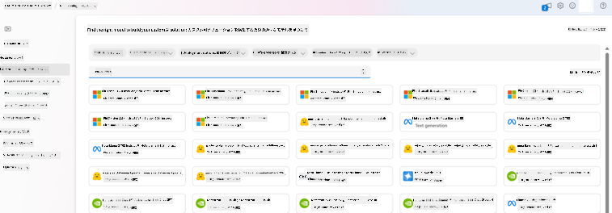
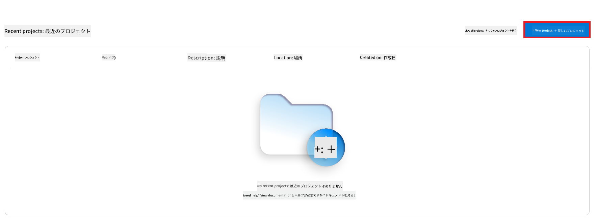
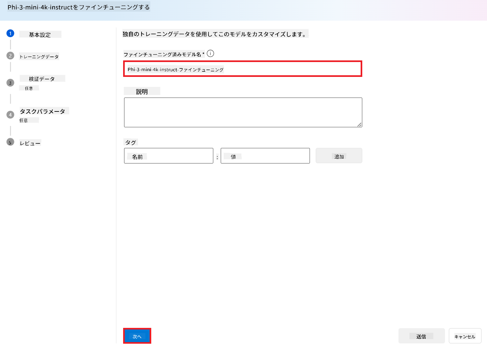

<!--
CO_OP_TRANSLATOR_METADATA:
{
  "original_hash": "c1559c5af6caccf6f623fd43a6b3a9a3",
  "translation_date": "2025-07-17T05:58:27+00:00",
  "source_file": "md/03.FineTuning/FineTuning_AIFoundry.md",
  "language_code": "ja"
}
-->
# Azure AI FoundryでのPhi-3のファインチューニング

MicrosoftのPhi-3 Mini言語モデルをAzure AI Foundryを使ってファインチューニングする方法を見ていきましょう。ファインチューニングにより、Phi-3 Miniを特定のタスクに適応させ、より強力でコンテキストに即したモデルに仕上げることができます。

## 注意点

- **機能:** どのモデルがファインチューニング可能か？ベースモデルはどのようなことにファインチューニングできるのか？
- **コスト:** ファインチューニングの料金体系はどうなっているか？
- **カスタマイズ性:** ベースモデルをどの程度、どのように変更できるか？
- **利便性:** ファインチューニングは実際にどのように行うのか？カスタムコードは必要か？自分で計算リソースを用意する必要はあるか？
- **安全性:** ファインチューニングされたモデルには安全上のリスクがあることが知られているが、意図しない害を防ぐためのガードレールはあるか？



## ファインチューニングの準備

### 前提条件

> [!NOTE]
> Phi-3ファミリーモデルのペイアズユーゴー方式のファインチューニングは、**East US 2** リージョンで作成されたハブでのみ利用可能です。

- Azureサブスクリプション。まだお持ちでない場合は、[有料のAzureアカウント](https://azure.microsoft.com/pricing/purchase-options/pay-as-you-go)を作成してください。

- [AI Foundryプロジェクト](https://ai.azure.com?WT.mc_id=aiml-138114-kinfeylo)。
- Azureのロールベースアクセス制御（Azure RBAC）を使ってAzure AI Foundryの操作権限を付与します。本記事の手順を実行するには、リソースグループに対して__Azure AI Developerロール__が割り当てられている必要があります。

### サブスクリプションプロバイダーの登録

サブスクリプションが`Microsoft.Network`リソースプロバイダーに登録されていることを確認します。

1. [Azureポータル](https://portal.azure.com)にサインインします。
1. 左メニューから**Subscriptions**を選択します。
1. 使用するサブスクリプションを選択します。
1. 左メニューから**AI project settings** > **Resource providers**を選択します。
1. **Microsoft.Network**がリソースプロバイダーの一覧にあることを確認します。なければ追加してください。

### データ準備

モデルをファインチューニングするためのトレーニングデータと検証データを用意します。これらのデータセットは、モデルに期待する動作の入力と出力の例で構成されます。

すべてのトレーニング例が推論時の期待フォーマットに従っていることを確認してください。効果的なファインチューニングのためには、バランスの取れた多様なデータセットが必要です。

これは、データのバランスを保ち、さまざまなシナリオを含め、定期的にトレーニングデータを現実の期待に合わせて調整することを意味し、より正確でバランスの取れたモデルの応答につながります。

モデルの種類によって、トレーニングデータのフォーマットは異なります。

### チャット補完

使用するトレーニングおよび検証データは、**JSON Lines (JSONL)** 形式である必要があります。`Phi-3-mini-128k-instruct`の場合、ファインチューニングデータセットはChat completions APIで使われる会話形式でフォーマットされている必要があります。

### ファイルフォーマットの例

```json
    {"messages": [{"role": "system", "content": "You are an Xbox customer support agent whose primary goal is to help users with issues they are experiencing with their Xbox devices. You are friendly and concise. You only provide factual answers to queries, and do not provide answers that are not related to Xbox."}, {"role": "user", "content": "Is Xbox better than PlayStation?"}, {"role": "assistant", "content": "I apologize, but I cannot provide personal opinions. My primary job is to assist you with any issues related to your Xbox device. Do you have any Xbox-related issues that need addressing?"}]}
    {"messages": [{"role": "system", "content": "You are an Xbox customer support agent whose primary goal is to help users with issues they are experiencing with their Xbox devices. You are friendly and concise. You only provide factual answers to queries, and do not provide answers that are not related to Xbox."}, {"role": "user", "content": "Can I play PC games on my Xbox?"}, {"role": "assistant", "content": "While Xbox consoles don't natively support PC games, they can play an array of Xbox games, many of which are also available on PC. Can I assist you with finding games compatible with your Xbox device?"}]}
    {"messages": [{"role": "system", "content": "You are an Xbox customer support agent whose primary goal is to help users with issues they are experiencing with their Xbox devices. You are friendly and concise. You only provide factual answers to queries, and do not provide answers that are not related to Xbox."}, {"role": "user", "content": "I'm having trouble connecting my Xbox to the Wi-Fi."}, {"role": "assistant", "content": "No worries, let's go through the network settings on your Xbox. Can you please tell me what happens when you try to connect it to the Wi-Fi?"}]}
```

サポートされているファイルタイプはJSON Linesです。ファイルはデフォルトのデータストアにアップロードされ、プロジェクト内で利用可能になります。

## Azure AI FoundryでのPhi-3ファインチューニング

Azure AI Foundryを使うと、ファインチューニングというプロセスで大規模言語モデルを自分のデータセットに合わせて調整できます。ファインチューニングは、特定のタスクやアプリケーションに最適化・カスタマイズすることで、性能向上、コスト効率の改善、レイテンシの低減、そして出力の最適化をもたらします。


### 新しいプロジェクトの作成

1. [Azure AI Foundry](https://ai.azure.com)にサインインします。

1. **+New project** を選択して新しいプロジェクトを作成します。

    

1. 以下の項目を設定します：

    - プロジェクトの**Hub名**。一意の値である必要があります。
    - 使用する**Hub**を選択（必要に応じて新規作成）。

    

1. 新しいハブを作成する場合は以下を設定します：

    - **Hub名**を入力。一意の値である必要があります。
    - Azureの**サブスクリプション**を選択。
    - 使用する**リソースグループ**を選択（必要に応じて新規作成）。
    - 使用する**リージョン**を選択。
    - 使用する**Connect Azure AI Services**を選択（必要に応じて新規作成）。
    - **Connect Azure AI Search**は**接続をスキップ**を選択。

    

1. **Next**を選択。
1. **Create a project**を選択。

### データ準備

ファインチューニングの前に、チャット指示、質問応答ペア、その他関連するテキストデータなど、タスクに関連したデータセットを収集または作成します。ノイズの除去、欠損値の処理、テキストのトークン化などの前処理を行ってください。

### Azure AI FoundryでのPhi-3モデルのファインチューニング

> [!NOTE]
> Phi-3モデルのファインチューニングは現在、East US 2にあるプロジェクトでのみサポートされています。

1. 左側のタブから**Model catalog**を選択。

1. **検索バー**に*phi-3*と入力し、使用したいphi-3モデルを選択。

    

1. **Fine-tune**を選択。

    

1. **Fine-tuned model name**を入力。

    

1. **Next**を選択。

1. 以下を設定：

    - **task type**を**Chat completion**に設定。
    - 使用する**Training data**を選択。Azure AI Foundryのデータから、またはローカル環境からアップロード可能。

    

1. **Next**を選択。

1. 使用する**Validation data**をアップロード、または**Automatic split of training data**を選択。

    

1. **Next**を選択。

1. 以下を設定：

    - 使用する**Batch size multiplier**を選択。
    - 使用する**Learning rate**を選択。
    - 使用する**Epochs**を選択。

    

1. **Submit**を選択してファインチューニングを開始。

    

1. モデルのファインチューニングが完了すると、ステータスが**Completed**と表示されます。これでモデルをデプロイし、自分のアプリケーションやプレイグラウンド、プロンプトフローで利用可能です。詳細は[Azure AI FoundryでのPhi-3ファミリー小型言語モデルのデプロイ方法](https://learn.microsoft.com/azure/ai-studio/how-to/deploy-models-phi-3?tabs=phi-3-5&pivots=programming-language-python)をご覧ください。

    

> [!NOTE]
> Phi-3のファインチューニングに関する詳細は、[Azure AI FoundryでのPhi-3モデルのファインチューニング](https://learn.microsoft.com/azure/ai-studio/how-to/fine-tune-phi-3?tabs=phi-3-mini)をご参照ください。

## ファインチューニング済みモデルのクリーンアップ

[Azure AI Foundry](https://ai.azure.com)のファインチューニングモデル一覧またはモデル詳細ページから、ファインチューニング済みモデルを削除できます。ファインチューニングページで削除したいモデルを選択し、削除ボタンを押してください。

> [!NOTE]
> 既にデプロイされているカスタムモデルは削除できません。カスタムモデルを削除するには、まずモデルのデプロイを削除する必要があります。

## コストとクォータ

### サービスとしてファインチューニングされたPhi-3モデルのコストとクォータ

サービスとしてファインチューニングされたPhiモデルはMicrosoftが提供し、Azure AI Foundryに統合されています。モデルの[デプロイ](https://learn.microsoft.com/azure/ai-studio/how-to/deploy-models-phi-3?tabs=phi-3-5&pivots=programming-language-python)やファインチューニング時の料金は、デプロイウィザードの「Pricing and terms」タブで確認できます。

## コンテンツフィルタリング

ペイアズユーゴー方式でサービスとしてデプロイされたモデルは、Azure AI Content Safetyによって保護されています。リアルタイムエンドポイントにデプロイする際、この機能をオプトアウトすることも可能です。Azure AI Content Safetyが有効な場合、プロンプトと補完の両方が有害コンテンツの検出・防止を目的とした複数の分類モデルのアンサンブルを通過します。コンテンツフィルタリングシステムは、入力プロンプトと出力補完の両方に含まれる潜在的に有害な特定カテゴリのコンテンツを検出し、対応します。詳細は[Azure AI Content Safety](https://learn.microsoft.com/azure/ai-studio/concepts/content-filtering)をご覧ください。

**ファインチューニングの設定**

ハイパーパラメーター：学習率、バッチサイズ、トレーニングエポック数などのハイパーパラメーターを定義します。

**損失関数**

タスクに適した損失関数を選択します（例：クロスエントロピー）。

**オプティマイザー**

トレーニング中の勾配更新に使うオプティマイザーを選択します（例：Adam）。

**ファインチューニングのプロセス**

- 事前学習済みモデルの読み込み：Phi-3 Miniのチェックポイントをロード。
- カスタムレイヤーの追加：タスク固有のレイヤー（例：チャット指示用の分類ヘッド）を追加。

**モデルのトレーニング**

用意したデータセットでモデルをファインチューニングします。トレーニングの進捗を監視し、必要に応じてハイパーパラメーターを調整してください。

**評価と検証**

検証セット：データをトレーニングセットと検証セットに分割。

**性能評価**

精度、F1スコア、パープレキシティなどの指標を使ってモデルの性能を評価。

## ファインチューニング済みモデルの保存

**チェックポイント**

将来の利用のためにファインチューニング済みモデルのチェックポイントを保存。

## デプロイ

- Webサービスとしてデプロイ：ファインチューニング済みモデルをAzure AI FoundryでWebサービスとしてデプロイ。
- エンドポイントのテスト：デプロイしたエンドポイントにテストクエリを送信し、機能を確認。

## 繰り返し改善

繰り返し：性能が満足できない場合は、ハイパーパラメーターの調整、データの追加、エポック数の増加などを行いながら繰り返し改善。

## 監視と調整

モデルの挙動を継続的に監視し、必要に応じて調整。

## カスタマイズと拡張

カスタムタスク：Phi-3 Miniはチャット指示以外のさまざまなタスクにもファインチューニング可能です。ほかのユースケースも試してみましょう！
実験：異なるアーキテクチャやレイヤーの組み合わせ、手法を試して性能向上を目指しましょう。

> [!NOTE]
> ファインチューニングは反復的なプロセスです。実験し、学び、モデルを適応させて、特定のタスクに最適な結果を目指しましょう！

**免責事項**：  
本書類はAI翻訳サービス「[Co-op Translator](https://github.com/Azure/co-op-translator)」を使用して翻訳されました。正確性には努めておりますが、自動翻訳には誤りや不正確な部分が含まれる可能性があります。原文の言語によるオリジナル文書が正式な情報源とみなされるべきです。重要な情報については、専門の人間による翻訳を推奨します。本翻訳の利用により生じたいかなる誤解や誤訳についても、当方は責任を負いかねます。