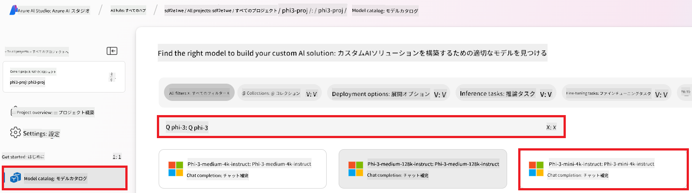
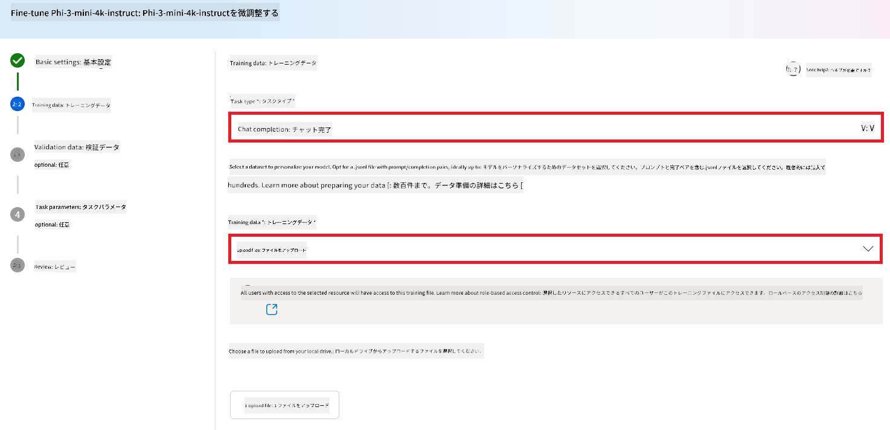
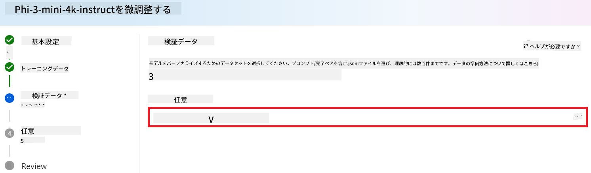
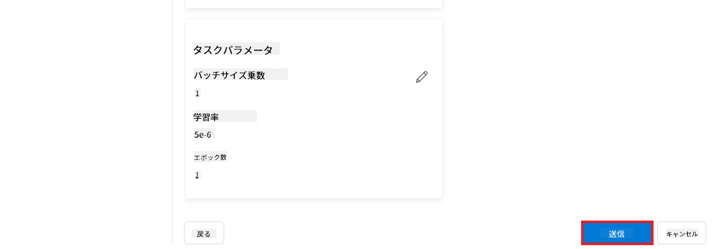

<!--
CO_OP_TRANSLATOR_METADATA:
{
  "original_hash": "c1559c5af6caccf6f623fd43a6b3a9a3",
  "translation_date": "2025-05-08T05:02:41+00:00",
  "source_file": "md/03.FineTuning/FineTuning_AIFoundry.md",
  "language_code": "ja"
}
-->
# Azure AI FoundryでPhi-3をファインチューニングする

MicrosoftのPhi-3 Mini言語モデルをAzure AI Foundryを使ってファインチューニングする方法を見ていきましょう。ファインチューニングにより、Phi-3 Miniを特定のタスクに適応させ、より強力でコンテキストに即したモデルに仕上げることができます。

## 注意点

- **機能:** どのモデルがファインチューニング可能か？ベースモデルはどんなことに対応できるのか？
- **コスト:** ファインチューニングの料金体系はどうなっているか？
- **カスタマイズ性:** ベースモデルをどの程度、どのように変更できるか？
- **利便性:** 実際のファインチューニングはどのように行うのか？カスタムコードは必要か？自分で計算資源を用意する必要はあるか？
- **安全性:** ファインチューニングされたモデルは安全リスクがあることが知られているが、意図しない害を防ぐためのガードレールはあるか？


## ファインチューニングの準備

### 前提条件

> [!NOTE]
> Phi-3ファミリーモデルの場合、従量課金制のファインチューニング提供は**East US 2**リージョンで作成されたハブのみ利用可能です。

- Azureサブスクリプション。お持ちでない場合は、[有料のAzureアカウント](https://azure.microsoft.com/pricing/purchase-options/pay-as-you-go)を作成してください。

- [AI Foundryプロジェクト](https://ai.azure.com?WT.mc_id=aiml-138114-kinfeylo)。
- Azureのロールベースアクセス制御（Azure RBAC）を使ってAzure AI Foundryの操作権限を付与します。本記事の手順を実行するには、リソースグループに対して__Azure AI Developerロール__が割り当てられている必要があります。

### サブスクリプションのプロバイダー登録

サブスクリプションが`Microsoft.Network`リソースプロバイダーに登録されていることを確認します。

1. [Azureポータル](https://portal.azure.com)にサインインします。
1. 左メニューから**Subscriptions**を選択します。
1. 使用するサブスクリプションを選択します。
1. 左メニューから**AI project settings** > **Resource providers**を選択します。
1. **Microsoft.Network**がリソースプロバイダーの一覧にあることを確認します。なければ追加してください。

### データ準備

ファインチューニング用のトレーニングデータと検証データを用意します。これらのデータセットは、モデルに期待する動作の入出力例で構成されます。

すべてのトレーニング例が推論時の期待フォーマットに沿っていることを確認してください。効果的にファインチューニングするには、バランスの良い多様なデータセットが重要です。

これは、データのバランスを保ち、様々なシナリオを含め、定期的にトレーニングデータを現実の期待に合わせて調整することを意味します。これにより、より正確でバランスの取れたモデル応答が得られます。

モデルの種類によって、トレーニングデータのフォーマットは異なります。

### チャット補完

使用するトレーニングおよび検証データは、**JSON Lines (JSONL)**形式である必要があります。`Phi-3-mini-128k-instruct`の場合は、Chat completions APIで使われる会話形式でフォーマットされたデータセットである必要があります。

### ファイルフォーマット例

```json
    {"messages": [{"role": "system", "content": "You are an Xbox customer support agent whose primary goal is to help users with issues they are experiencing with their Xbox devices. You are friendly and concise. You only provide factual answers to queries, and do not provide answers that are not related to Xbox."}, {"role": "user", "content": "Is Xbox better than PlayStation?"}, {"role": "assistant", "content": "I apologize, but I cannot provide personal opinions. My primary job is to assist you with any issues related to your Xbox device. Do you have any Xbox-related issues that need addressing?"}]}
    {"messages": [{"role": "system", "content": "You are an Xbox customer support agent whose primary goal is to help users with issues they are experiencing with their Xbox devices. You are friendly and concise. You only provide factual answers to queries, and do not provide answers that are not related to Xbox."}, {"role": "user", "content": "Can I play PC games on my Xbox?"}, {"role": "assistant", "content": "While Xbox consoles don't natively support PC games, they can play an array of Xbox games, many of which are also available on PC. Can I assist you with finding games compatible with your Xbox device?"}]}
    {"messages": [{"role": "system", "content": "You are an Xbox customer support agent whose primary goal is to help users with issues they are experiencing with their Xbox devices. You are friendly and concise. You only provide factual answers to queries, and do not provide answers that are not related to Xbox."}, {"role": "user", "content": "I'm having trouble connecting my Xbox to the Wi-Fi."}, {"role": "assistant", "content": "No worries, let's go through the network settings on your Xbox. Can you please tell me what happens when you try to connect it to the Wi-Fi?"}]}
```

対応ファイル形式はJSON Linesです。ファイルはデフォルトのデータストアにアップロードされ、プロジェクト内で利用可能になります。

## Azure AI FoundryでPhi-3をファインチューニングする

Azure AI Foundryでは、ファインチューニングという手法を使って、大規模言語モデルを自分のデータセットに合わせてカスタマイズできます。ファインチューニングは特定のタスクや用途に最適化することで、性能向上、コスト効率化、レイテンシ削減、そして出力の最適化を実現します。


### 新規プロジェクトの作成

1. [Azure AI Foundry](https://ai.azure.com)にサインインします。

1. **+New project**を選択し、新しいプロジェクトを作成します。

    

1. 以下の作業を行います：

    - プロジェクトの**Hub name**。ユニークな値である必要があります。
    - 使用する**Hub**を選択（必要に応じて新規作成）。

    

1. 新しいハブを作成するには、以下を行います：

    - **Hub name**を入力。ユニークな値である必要があります。
    - Azureの**Subscription**を選択。
    - 使用する**Resource group**を選択（必要に応じて新規作成）。
    - 使用したい**Location**を選択。
    - 使用する**Connect Azure AI Services**を選択（必要に応じて新規作成）。
    - **Connect Azure AI Search**は**Skip connecting**を選択。

    

1. **Next**を選択します。
1. **Create a project**を選択します。

### データ準備

ファインチューニング前に、チャット指示、質問応答ペア、その他関連するテキストデータなど、タスクに関連したデータセットを収集または作成します。ノイズ除去、欠損値処理、トークナイズなどの前処理を行ってください。

### Azure AI FoundryでPhi-3モデルをファインチューニングする

> [!NOTE]
> Phi-3モデルのファインチューニングは現在、East US 2にあるプロジェクトでのみサポートされています。

1. 左側のタブから**Model catalog**を選択します。

1. **検索バー**に*phi-3*と入力し、使用したいphi-3モデルを選択します。

    

1. **Fine-tune**を選択します。

    

1. **Fine-tuned model name**を入力します。

    

1. **Next**を選択します。

1. 以下の作業を行います：

    - **task type**に**Chat completion**を選択。
    - 使用する**Training data**を選択。Azure AI Foundryのデータからアップロードするか、ローカル環境からアップロード可能です。

    

1. **Next**を選択します。

1. 使用する**Validation data**をアップロードするか、**Automatic split of training data**を選択します。

    

1. **Next**を選択します。

1. 以下を設定します：

    - 使用したい**Batch size multiplier**を選択。
    - 使用したい**Learning rate**を選択。
    - 使用したい**Epochs**を選択。

    

1. **Submit**を選択してファインチューニングを開始します。

    

1. モデルのファインチューニングが完了すると、ステータスが**Completed**と表示されます。これでモデルをデプロイし、自分のアプリケーション、プレイグラウンド、またはプロンプトフローで使用可能です。詳細は[Azure AI FoundryでのPhi-3ファミリーの小型言語モデルのデプロイ方法](https://learn.microsoft.com/azure/ai-studio/how-to/deploy-models-phi-3?tabs=phi-3-5&pivots=programming-language-python)を参照してください。

    

> [!NOTE]
> Phi-3のファインチューニングに関する詳細情報は、[Azure AI FoundryでのPhi-3モデルのファインチューニング](https://learn.microsoft.com/azure/ai-studio/how-to/fine-tune-phi-3?tabs=phi-3-mini)をご覧ください。

## ファインチューニング済みモデルのクリーンアップ

[Azure AI Foundry](https://ai.azure.com)のファインチューニングモデル一覧またはモデル詳細ページから、ファインチューニング済みモデルを削除できます。ファインチューニングページで削除したいモデルを選択し、削除ボタンを押してください。

> [!NOTE]
> 既存のデプロイメントがあるカスタムモデルは削除できません。モデルのデプロイメントを先に削除する必要があります。

## コストとクォータ

### サービスとしてファインチューニングされたPhi-3モデルのコストとクォータの考慮事項

サービスとしてファインチューニングされたPhiモデルはMicrosoftが提供し、Azure AI Foundryと統合されています。モデルの[デプロイ](https://learn.microsoft.com/azure/ai-studio/how-to/deploy-models-phi-3?tabs=phi-3-5&pivots=programming-language-python)やファインチューニング時の料金は、デプロイウィザードの「Pricing and terms」タブで確認できます。

## コンテンツフィルタリング

従量課金制のサービスとしてデプロイされたモデルはAzure AI Content Safetyによって保護されています。リアルタイムエンドポイントにデプロイした際、この機能をオプトアウトすることも可能です。Azure AI Content Safetyが有効な場合、プロンプトと補完の両方が有害コンテンツの出力を検出・防止するための複数の分類モデル群に通されます。コンテンツフィルタリングシステムは、入力プロンプトと出力補完の両方に含まれる特定のカテゴリの潜在的に有害なコンテンツを検知し、適切に対処します。詳細は[Azure AI Content Safety](https://learn.microsoft.com/azure/ai-studio/concepts/content-filtering)をご覧ください。

**ファインチューニング設定**

ハイパーパラメーター：学習率、バッチサイズ、トレーニングエポック数などを定義します。

**損失関数**

タスクに適した損失関数を選択します（例：クロスエントロピー）。

**オプティマイザー**

トレーニング中の勾配更新に使用するオプティマイザーを選択します（例：Adam）。

**ファインチューニングプロセス**

- 事前学習済みモデルの読み込み：Phi-3 Miniのチェックポイントをロードします。
- カスタムレイヤーの追加：タスク固有のレイヤー（例：チャット指示用の分類ヘッド）を追加します。

**モデルのトレーニング**

用意したデータセットでモデルをファインチューニングします。トレーニングの進捗を監視し、必要に応じてハイパーパラメーターを調整します。

**評価と検証**

検証セット：データをトレーニングセットと検証セットに分割します。

**性能評価**

精度、F1スコア、パープレキシティなどの指標を用いてモデル性能を評価します。

## ファインチューニング済みモデルの保存

**チェックポイント**

将来の利用のためにファインチューニング済みモデルのチェックポイントを保存します。

## デプロイ

- Webサービスとしてデプロイ：ファインチューニング済みモデルをAzure AI FoundryでWebサービスとしてデプロイします。
- エンドポイントのテスト：デプロイしたエンドポイントにテストクエリを送り、動作を確認します。

## 繰り返し改善

パフォーマンスが満足いかない場合は、ハイパーパラメーターの調整、データの追加、エポック数の増加などを試しながら繰り返し改善します。

## モニタリングと調整

モデルの挙動を継続的に監視し、必要に応じて調整を行います。

## カスタマイズと拡張

カスタムタスク：Phi-3 Miniはチャット指示以外の様々なタスクにもファインチューニング可能です。ほかのユースケースもぜひ試してみてください！
実験：異なるアーキテクチャやレイヤーの組み合わせ、技術を試して性能向上を目指しましょう。

> [!NOTE]
> ファインチューニングは反復的なプロセスです。実験し、学び、モデルを適応させて、特定のタスクで最高の結果を目指しましょう！

**免責事項**：  
本書類はAI翻訳サービス「[Co-op Translator](https://github.com/Azure/co-op-translator)」を使用して翻訳されています。正確性の向上に努めておりますが、自動翻訳には誤りや不正確な部分が含まれる可能性があることをご理解ください。原文はその言語における正式な情報源とみなされるべきです。重要な情報については、専門の人間による翻訳を推奨します。本翻訳の利用により生じたいかなる誤解や解釈の相違についても、当方は責任を負いかねます。