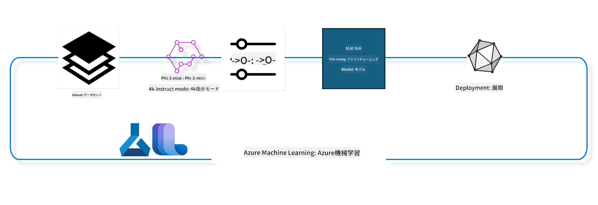

<!--
CO_OP_TRANSLATOR_METADATA:
{
  "original_hash": "944949f040e61b2ea25b3460f7394fd4",
  "translation_date": "2025-05-08T05:08:06+00:00",
  "source_file": "md/03.FineTuning/FineTuning_MLSDK.md",
  "language_code": "ja"
}
-->
## Azure MLシステムレジストリのchat-completionコンポーネントを使ってモデルをファインチューニングする方法

この例では、Phi-3-mini-4k-instructモデルを使い、ultrachat_200kデータセットを用いて2人の会話を完結させるファインチューニングを行います。



この例では、Azure ML SDKとPythonを使ってファインチューニングを実施し、その後リアルタイム推論用にファインチューニング済みモデルをオンラインエンドポイントにデプロイする方法を示します。

### トレーニングデータ

ultrachat_200kデータセットを使用します。これはUltraChatデータセットを厳選したもので、最先端の7BチャットモデルであるZephyr-7B-βのトレーニングに使用されました。

### モデル

チャット完了タスクのためにユーザーがモデルをファインチューニングする方法を示すために、Phi-3-mini-4k-instructモデルを使用します。このノートブックを特定のモデルカードから開いた場合は、該当するモデル名に置き換えてください。

### タスク

- ファインチューニングするモデルを選ぶ
- トレーニングデータを選び、確認する
- ファインチューニングジョブを設定する
- ファインチューニングジョブを実行する
- トレーニングおよび評価指標を確認する
- ファインチューニング済みモデルを登録する
- ファインチューニング済みモデルをリアルタイム推論用にデプロイする
- リソースをクリーンアップする

## 1. 前提条件のセットアップ

- 依存関係をインストールする
- AzureMLワークスペースに接続する。SDK認証のセットアップについては公式ドキュメントを参照。以下の<WORKSPACE_NAME>、<RESOURCE_GROUP>、<SUBSCRIPTION_ID>を置き換える。
- azuremlシステムレジストリに接続する
- 任意の実験名を設定する
- コンピュートを確認または作成する

> [!NOTE]
> 要件としては単一GPUノードで複数のGPUカードを搭載可能です。例えば、Standard_NC24rs_v3の1ノードには4つのNVIDIA V100 GPUが搭載されていますが、Standard_NC12s_v3では2つです。この情報はドキュメントを参照してください。ノードあたりのGPUカード数は以下のgpus_per_nodeパラメータで設定します。正しく設定することでノード内の全GPUを活用できます。推奨GPUコンピュートSKUはここやここで確認できます。

### Pythonライブラリ

以下のセルを実行して依存関係をインストールしてください。新しい環境で実行する場合は必須です。

```bash
pip install azure-ai-ml
pip install azure-identity
pip install datasets==2.9.0
pip install mlflow
pip install azureml-mlflow
```

### Azure MLとのやり取り

1. このPythonスクリプトはAzure Machine Learning (Azure ML)サービスと連携します。処理内容の概要は以下の通りです：

    - azure.ai.ml、azure.identity、azure.ai.ml.entitiesの必要なモジュールをインポート。timeモジュールもインポートしています。

    - DefaultAzureCredential()で認証を試みます。これはAzureクラウド上での開発を迅速に開始できる簡易認証方式です。失敗した場合はInteractiveBrowserCredential()でインタラクティブログインを行います。

    - from_configメソッドでMLClientインスタンスを作成し、config.jsonから設定を読み込みます。失敗した場合はsubscription_id、resource_group_name、workspace_nameを手動で指定してMLClientを作成します。

    - Azure MLのレジストリ「azureml」に対する別のMLClientインスタンスを作成します。このレジストリにはモデル、ファインチューニングパイプライン、環境が保存されています。

    - experiment_nameを"chat_completion_Phi-3-mini-4k-instruct"に設定します。

    - 現在の時間（エポック秒）を整数化して文字列に変換し、一意のタイムスタンプを生成します。これにより一意の名前やバージョンが作成可能です。

    ```python
    # Import necessary modules from Azure ML and Azure Identity
    from azure.ai.ml import MLClient
    from azure.identity import (
        DefaultAzureCredential,
        InteractiveBrowserCredential,
    )
    from azure.ai.ml.entities import AmlCompute
    import time  # Import time module
    
    # Try to authenticate using DefaultAzureCredential
    try:
        credential = DefaultAzureCredential()
        credential.get_token("https://management.azure.com/.default")
    except Exception as ex:  # If DefaultAzureCredential fails, use InteractiveBrowserCredential
        credential = InteractiveBrowserCredential()
    
    # Try to create an MLClient instance using the default config file
    try:
        workspace_ml_client = MLClient.from_config(credential=credential)
    except:  # If that fails, create an MLClient instance by manually providing the details
        workspace_ml_client = MLClient(
            credential,
            subscription_id="<SUBSCRIPTION_ID>",
            resource_group_name="<RESOURCE_GROUP>",
            workspace_name="<WORKSPACE_NAME>",
        )
    
    # Create another MLClient instance for the Azure ML registry named "azureml"
    # This registry is where models, fine-tuning pipelines, and environments are stored
    registry_ml_client = MLClient(credential, registry_name="azureml")
    
    # Set the experiment name
    experiment_name = "chat_completion_Phi-3-mini-4k-instruct"
    
    # Generate a unique timestamp that can be used for names and versions that need to be unique
    timestamp = str(int(time.time()))
    ```

## 2. ファインチューニングする基盤モデルを選ぶ

1. Phi-3-mini-4k-instructは3.8Bパラメータの軽量な最先端オープンモデルで、Phi-2のデータセットを基に構築されています。このモデルはPhi-3ファミリーに属し、Mini版は4Kと128Kの2つのコンテキスト長（トークン数）バリエーションがあります。用途に合わせてファインチューニングが必要です。AzureML Studioのモデルカタログでチャット完了タスクをフィルターし、これらのモデルを閲覧できます。この例ではPhi-3-mini-4k-instructモデルを使用します。別のモデルでこのノートブックを開いた場合は、モデル名とバージョンを適宜置き換えてください。

    > [!NOTE]
    > モデルのidプロパティはファインチューニングジョブの入力として渡されます。AzureML Studioのモデルカタログのモデル詳細ページのAsset IDフィールドでも確認可能です。

2. このPythonスクリプトはAzure Machine Learningサービスと連携します。処理内容の概要は以下の通りです：

    - model_nameを"Phi-3-mini-4k-instruct"に設定します。

    - registry_ml_clientのmodelsプロパティのgetメソッドを使い、指定した名前のモデルの最新バージョンをAzure MLレジストリから取得します。getメソッドにはモデル名と最新バージョンを取得するラベルを渡します。

    - ファインチューニングに使用するモデルの名前、バージョン、idをコンソールに出力します。文字列のformatメソッドでこれらの値を挿入しています。name、version、idはfoundation_modelオブジェクトのプロパティです。

    ```python
    # Set the model name
    model_name = "Phi-3-mini-4k-instruct"
    
    # Get the latest version of the model from the Azure ML registry
    foundation_model = registry_ml_client.models.get(model_name, label="latest")
    
    # Print the model name, version, and id
    # This information is useful for tracking and debugging
    print(
        "\n\nUsing model name: {0}, version: {1}, id: {2} for fine tuning".format(
            foundation_model.name, foundation_model.version, foundation_model.id
        )
    )
    ```

## 3. ジョブで使用するコンピュートを作成する

ファインチューニングジョブはGPUコンピュートでのみ動作します。コンピュートのサイズはモデルの大きさによって変わり、適切なコンピュートを選ぶのは難しい場合が多いです。このセルではユーザーが適切なコンピュートを選べるよう案内します。

> [!NOTE]
> 以下に示すコンピュートは最適化された構成で動作します。設定を変更するとCuda Out Of Memoryエラーが発生することがあります。その場合はより大きなサイズのコンピュートにアップグレードしてください。

> [!NOTE]
> compute_cluster_sizeを選ぶ際は、リソースグループ内でそのコンピュートが利用可能か確認してください。利用不可の場合はアクセス申請を行えます。

### ファインチューニング対応モデルの確認

1. このPythonスクリプトはAzure MLモデルと連携し、以下の処理を行います：

    - Pythonのastモジュールをインポートします。これはPythonの抽象構文木を処理する関数を提供します。

    - foundation_modelオブジェクト（Azure MLのモデルを表す）がfinetune_compute_allow_listというタグを持っているか確認します。タグはAzure MLでモデルのフィルターやソートに使えるキー・バリューのペアです。

    - finetune_compute_allow_listタグがあれば、その値（文字列）をast.literal_evalで安全にPythonリストに変換し、computes_allow_list変数に代入します。その後、リストからコンピュートを作成すべき旨のメッセージを出力します。

    - タグがなければcomputes_allow_listをNoneに設定し、タグがモデルに含まれていない旨を出力します。

    - 要約すると、このスクリプトはモデルのメタデータに特定のタグがあるか確認し、あればリスト化してユーザーに通知します。

    ```python
    # Import the ast module, which provides functions to process trees of the Python abstract syntax grammar
    import ast
    
    # Check if the 'finetune_compute_allow_list' tag is present in the model's tags
    if "finetune_compute_allow_list" in foundation_model.tags:
        # If the tag is present, use ast.literal_eval to safely parse the tag's value (a string) into a Python list
        computes_allow_list = ast.literal_eval(
            foundation_model.tags["finetune_compute_allow_list"]
        )  # convert string to python list
        # Print a message indicating that a compute should be created from the list
        print(f"Please create a compute from the above list - {computes_allow_list}")
    else:
        # If the tag is not present, set computes_allow_list to None
        computes_allow_list = None
        # Print a message indicating that the 'finetune_compute_allow_list' tag is not part of the model's tags
        print("`finetune_compute_allow_list` is not part of model tags")
    ```

### コンピュートインスタンスの確認

1. このPythonスクリプトはAzure MLサービスと連携し、コンピュートインスタンスの複数チェックを行います。処理内容は以下の通りです：

    - compute_clusterに格納された名前のコンピュートインスタンスをAzure MLワークスペースから取得し、プロビジョニング状態が"failed"ならValueErrorを発生させます。

    - computes_allow_listがNoneでなければ、そのリスト内のコンピュートサイズを小文字に変換し、現在のコンピュートインスタンスのサイズがリストに含まれているか確認します。含まれていなければValueErrorを発生させます。

    - computes_allow_listがNoneの場合は、現在のコンピュートサイズがサポート外のGPU VMサイズリストに含まれているか確認し、含まれていればValueErrorを発生させます。

    - ワークスペース内の利用可能な全コンピュートサイズを取得し、現在のコンピュートサイズと一致するものを探します。一致すれば、そのコンピュートサイズのGPU数を取得し、gpu_count_foundをTrueに設定します。

    - gpu_count_foundがTrueならコンピュートのGPU数を出力し、FalseならValueErrorを発生させます。

    - 要約すると、このスクリプトはAzure MLワークスペースのコンピュートインスタンスについて、状態、許可リストとの整合性、GPU数をチェックします。

    ```python
    # Print the exception message
    print(e)
    # Raise a ValueError if the compute size is not available in the workspace
    raise ValueError(
        f"WARNING! Compute size {compute_cluster_size} not available in workspace"
    )
    
    # Retrieve the compute instance from the Azure ML workspace
    compute = workspace_ml_client.compute.get(compute_cluster)
    # Check if the provisioning state of the compute instance is "failed"
    if compute.provisioning_state.lower() == "failed":
        # Raise a ValueError if the provisioning state is "failed"
        raise ValueError(
            f"Provisioning failed, Compute '{compute_cluster}' is in failed state. "
            f"please try creating a different compute"
        )
    
    # Check if computes_allow_list is not None
    if computes_allow_list is not None:
        # Convert all compute sizes in computes_allow_list to lowercase
        computes_allow_list_lower_case = [x.lower() for x in computes_allow_list]
        # Check if the size of the compute instance is in computes_allow_list_lower_case
        if compute.size.lower() not in computes_allow_list_lower_case:
            # Raise a ValueError if the size of the compute instance is not in computes_allow_list_lower_case
            raise ValueError(
                f"VM size {compute.size} is not in the allow-listed computes for finetuning"
            )
    else:
        # Define a list of unsupported GPU VM sizes
        unsupported_gpu_vm_list = [
            "standard_nc6",
            "standard_nc12",
            "standard_nc24",
            "standard_nc24r",
        ]
        # Check if the size of the compute instance is in unsupported_gpu_vm_list
        if compute.size.lower() in unsupported_gpu_vm_list:
            # Raise a ValueError if the size of the compute instance is in unsupported_gpu_vm_list
            raise ValueError(
                f"VM size {compute.size} is currently not supported for finetuning"
            )
    
    # Initialize a flag to check if the number of GPUs in the compute instance has been found
    gpu_count_found = False
    # Retrieve a list of all available compute sizes in the workspace
    workspace_compute_sku_list = workspace_ml_client.compute.list_sizes()
    available_sku_sizes = []
    # Iterate over the list of available compute sizes
    for compute_sku in workspace_compute_sku_list:
        available_sku_sizes.append(compute_sku.name)
        # Check if the name of the compute size matches the size of the compute instance
        if compute_sku.name.lower() == compute.size.lower():
            # If it does, retrieve the number of GPUs for that compute size and set gpu_count_found to True
            gpus_per_node = compute_sku.gpus
            gpu_count_found = True
    # If gpu_count_found is True, print the number of GPUs in the compute instance
    if gpu_count_found:
        print(f"Number of GPU's in compute {compute.size}: {gpus_per_node}")
    else:
        # If gpu_count_found is False, raise a ValueError
        raise ValueError(
            f"Number of GPU's in compute {compute.size} not found. Available skus are: {available_sku_sizes}."
            f"This should not happen. Please check the selected compute cluster: {compute_cluster} and try again."
        )
    ```

## 4. モデルのファインチューニング用データセットを選ぶ

1. ultrachat_200kデータセットを使用します。このデータセットは4つのスプリットがあり、教師ありファインチューニング（sft）に適しています。生成ランキング（gen）もあります。スプリットごとの例数は以下の通りです：

    ```bash
    train_sft test_sft  train_gen  test_gen
    207865  23110  256032  28304
    ```

1. 次のセルではファインチューニングのための基本的なデータ準備を示します：

### データの一部を可視化する

高速に動作させるため、既にトリム済みの行の5%を含むtrain_sft、test_sftファイルを保存します。これによりファインチューニング済みモデルの精度は低下するため、実運用には適しません。download-dataset.pyはultrachat_200kデータセットをダウンロードし、ファインチューニングパイプラインコンポーネントが利用可能な形式に変換します。データセットが大きいため、ここでは一部のみ扱います。

1. 以下のスクリプトはデータの5%のみをダウンロードします。dataset_split_pcパラメータを変更することで割合を調整可能です。

    > [!NOTE]
    > 一部の言語モデルは異なる言語コードを持つため、データセットのカラム名もそれに合わせる必要があります。

1. データの例は以下の通りです。チャット完了データセットはparquet形式で保存され、各エントリーは以下のスキーマを持ちます：

    - これはJSON（JavaScript Object Notation）形式のドキュメントで、データ交換に広く使われています。実行コードではなく、データの保存・転送手段です。構造は以下の通りです：

    - "prompt": AIアシスタントに対するタスクや質問を表す文字列。

    - "messages": 配列で、ユーザーとAIアシスタント間の会話メッセージを表します。各メッセージはオブジェクトで、2つのキーを持ちます：

        - "content": メッセージの内容を表す文字列。

        - "role": メッセージ送信者の役割を表す文字列。 "user"か"assistant"のいずれか。

    - "prompt_id": プロンプトの一意識別子を表す文字列。

1. このJSONドキュメントでは、ユーザーがディストピア小説の主人公を作成するようAIアシスタントに依頼し、アシスタントが応答し、さらに詳細を求める会話が記録されています。会話は特定のprompt_idに紐づいています。

    ```python
    {
        // The task or question posed to an AI assistant
        "prompt": "Create a fully-developed protagonist who is challenged to survive within a dystopian society under the rule of a tyrant. ...",
        
        // An array of objects, each representing a message in a conversation between a user and an AI assistant
        "messages":[
            {
                // The content of the user's message
                "content": "Create a fully-developed protagonist who is challenged to survive within a dystopian society under the rule of a tyrant. ...",
                // The role of the entity that sent the message
                "role": "user"
            },
            {
                // The content of the assistant's message
                "content": "Name: Ava\n\n Ava was just 16 years old when the world as she knew it came crashing down. The government had collapsed, leaving behind a chaotic and lawless society. ...",
                // The role of the entity that sent the message
                "role": "assistant"
            },
            {
                // The content of the user's message
                "content": "Wow, Ava's story is so intense and inspiring! Can you provide me with more details.  ...",
                // The role of the entity that sent the message
                "role": "user"
            }, 
            {
                // The content of the assistant's message
                "content": "Certainly! ....",
                // The role of the entity that sent the message
                "role": "assistant"
            }
        ],
        
        // A unique identifier for the prompt
        "prompt_id": "d938b65dfe31f05f80eb8572964c6673eddbd68eff3db6bd234d7f1e3b86c2af"
    }
    ```

### データのダウンロード

1. このPythonスクリプトはdownload-dataset.pyという補助スクリプトを使ってデータセットをダウンロードします。処理内容は以下の通りです：

    - osモジュールをインポートします。これはOS依存の機能を移植性高く扱うためのモジュールです。

    - os.system関数でシェル上でdownload-dataset.pyを特定のコマンドライン引数付きで実行します。引数はダウンロードするデータセット（HuggingFaceH4/ultrachat_200k）、保存先ディレクトリ（ultrachat_200k_dataset）、データセットの分割割合（5）です。os.systemは実行結果の終了ステータスを返し、exit_statusに格納します。

    - exit_statusが0でなければ（Unix系では0が成功を意味し、それ以外はエラー）、例外を発生させてダウンロードエラーを通知します。

    - 要約すると、補助スクリプトを使ってデータセットをダウンロードし、失敗したら例外を投げます。

    ```python
    # Import the os module, which provides a way of using operating system dependent functionality
    import os
    
    # Use the os.system function to run the download-dataset.py script in the shell with specific command-line arguments
    # The arguments specify the dataset to download (HuggingFaceH4/ultrachat_200k), the directory to download it to (ultrachat_200k_dataset), and the percentage of the dataset to split (5)
    # The os.system function returns the exit status of the command it executed; this status is stored in the exit_status variable
    exit_status = os.system(
        "python ./download-dataset.py --dataset HuggingFaceH4/ultrachat_200k --download_dir ultrachat_200k_dataset --dataset_split_pc 5"
    )
    
    # Check if exit_status is not 0
    # In Unix-like operating systems, an exit status of 0 usually indicates that a command has succeeded, while any other number indicates an error
    # If exit_status is not 0, raise an Exception with a message indicating that there was an error downloading the dataset
    if exit_status != 0:
        raise Exception("Error downloading dataset")
    ```

### DataFrameへのデータ読み込み

1. このPythonスクリプトはJSON LinesファイルをpandasのDataFrameに読み込み、最初の5行を表示します。処理内容は以下の通りです：

    - pandasライブラリをインポートします。これは強力なデータ操作・解析ライブラリです。

    - pandasの表示設定でカラム幅の最大値を0に設定し、DataFrameを表示する際にテキストが切れないようにします。

    - pd.read_json関数でultrachat_200k_datasetディレクトリのtrain_sft.jsonlファイルを読み込みます。lines=TrueはJSON Lines形式（1行ごとにJSONオブジェクトがある形式）であることを示します。

    - headメソッドで最初の5行を表示します。5行未満の場合は全行表示されます。

    - 要約すると、JSON LinesファイルをDataFrameに読み込み、先頭5行を全文表示しています。

    ```python
    # Import the pandas library, which is a powerful data manipulation and analysis library
    import pandas as pd
    
    # Set the maximum column width for pandas' display options to 0
    # This means that the full text of each column will be displayed without truncation when the DataFrame is printed
    pd.set_option("display.max_colwidth", 0)
    
    # Use the pd.read_json function to load the train_sft.jsonl file from the ultrachat_200k_dataset directory into a DataFrame
    # The lines=True argument indicates that the file is in JSON Lines format, where each line is a separate JSON object
    df = pd.read_json("./ultrachat_200k_dataset/train_sft.jsonl", lines=True)
    
    # Use the head method to display the first 5 rows of the DataFrame
    # If the DataFrame has less than 5 rows, it will display all of them
    df.head()
    ```

## 5. モデルとデータを入力にファインチューニングジョブを提出する

chat-completionパイプラインコンポーネントを使うジョブを作成します。ファインチューニングでサポートされる全パラメータについてはこちらを参照してください。

### ファインチューニングパラメータの定義

1. ファインチューニングパラメータは大きく2つに分類できます：トレーニングパラメータ、最適化パラメータ。

1. トレーニングパラメータは以下を定義します：

    - 使用するオプティマイザーやスケジューラー
    - ファインチューニングで最適化する指標
    - トレーニングステップ数やバッチサイズなど
    - 最適化パラメータはGPUメモリの最適化やコンピュート資源の効率的活用に役立ちます。

1. 以下は最適化パラメータの例です。モデルごとに異なり、モデルと一緒にパッケージ化されています。

    - deepspeedとLoRAの有効化
    - 混合精度トレーニングの有効化
    - マルチノードトレーニングの有効化

> [!NOTE]
> 教師ありファインチューニングはアライメントの喪失や破滅的忘却を引き起こす可能性があります。問題がないか確認し、ファインチューニング後にアライメントステージを実行することを推奨します。

### ファインチューニングパラメータ設定

1. このPythonスクリプトは機械学習モデルのファインチューニングパラメータを設定します。処理内容は以下の通りです：

    - トレーニングエポック数、トレーニング・評価バッチサイズ、学習率、学習率スケジューラーの種類などのデフォルトのトレーニングパラメータを設定します。

    - LoRaやDeepSpeedの適用有無、DeepSpeedステージなどのデフォルトの最適化パラメータを設定します。

    - トレーニングと最適化パラメータをfinetune_parametersという辞書にまとめます。

    - foundation_modelにモデル固有のデフォルトパラメータがあれば、警告メッセージを表示し、ast.literal_evalで文字列から辞書に変換
training pipelineはさまざまなパラメータに基づいて構築され、その後この表示名を出力します。```python
    # Define a function to generate a display name for the training pipeline
    def get_pipeline_display_name():
        # Calculate the total batch size by multiplying the per-device batch size, the number of gradient accumulation steps, the number of GPUs per node, and the number of nodes used for fine-tuning
        batch_size = (
            int(finetune_parameters.get("per_device_train_batch_size", 1))
            * int(finetune_parameters.get("gradient_accumulation_steps", 1))
            * int(gpus_per_node)
            * int(finetune_parameters.get("num_nodes_finetune", 1))
        )
        # Retrieve the learning rate scheduler type
        scheduler = finetune_parameters.get("lr_scheduler_type", "linear")
        # Retrieve whether DeepSpeed is applied
        deepspeed = finetune_parameters.get("apply_deepspeed", "false")
        # Retrieve the DeepSpeed stage
        ds_stage = finetune_parameters.get("deepspeed_stage", "2")
        # If DeepSpeed is applied, include "ds" followed by the DeepSpeed stage in the display name; if not, include "nods"
        if deepspeed == "true":
            ds_string = f"ds{ds_stage}"
        else:
            ds_string = "nods"
        # Retrieve whether Layer-wise Relevance Propagation (LoRa) is applied
        lora = finetune_parameters.get("apply_lora", "false")
        # If LoRa is applied, include "lora" in the display name; if not, include "nolora"
        if lora == "true":
            lora_string = "lora"
        else:
            lora_string = "nolora"
        # Retrieve the limit on the number of model checkpoints to keep
        save_limit = finetune_parameters.get("save_total_limit", -1)
        # Retrieve the maximum sequence length
        seq_len = finetune_parameters.get("max_seq_length", -1)
        # Construct the display name by concatenating all these parameters, separated by hyphens
        return (
            model_name
            + "-"
            + "ultrachat"
            + "-"
            + f"bs{batch_size}"
            + "-"
            + f"{scheduler}"
            + "-"
            + ds_string
            + "-"
            + lora_string
            + f"-save_limit{save_limit}"
            + f"-seqlen{seq_len}"
        )
    
    # Call the function to generate the display name
    pipeline_display_name = get_pipeline_display_name()
    # Print the display name
    print(f"Display name used for the run: {pipeline_display_name}")
    ```

### パイプラインの構成

このPythonスクリプトは、Azure Machine Learning SDKを使用して機械学習パイプラインを定義および構成しています。以下はその内容の概要です：

1. Azure AI ML SDKから必要なモジュールをインポートします。
1. レジストリから "chat_completion_pipeline" という名前のパイプラインコンポーネントを取得します。
1. `@pipeline` decorator and the function `create_pipeline`. The name of the pipeline is set to `pipeline_display_name`.

1. Inside the `create_pipeline` function, it initializes the fetched pipeline component with various parameters, including the model path, compute clusters for different stages, dataset splits for training and testing, the number of GPUs to use for fine-tuning, and other fine-tuning parameters.

1. It maps the output of the fine-tuning job to the output of the pipeline job. This is done so that the fine-tuned model can be easily registered, which is required to deploy the model to an online or batch endpoint.

1. It creates an instance of the pipeline by calling the `create_pipeline` function.

1. It sets the `force_rerun` setting of the pipeline to `True`, meaning that cached results from previous jobs will not be used.

1. It sets the `continue_on_step_failure` setting of the pipeline to `False` を使ってパイプラインジョブを定義します。これは、いずれかのステップが失敗した場合にパイプラインが停止することを意味します。
1. まとめると、このスクリプトはAzure Machine Learning SDKを使ってチャット完了タスク用の機械学習パイプラインを定義および構成しています。

```python
    # Import necessary modules from the Azure AI ML SDK
    from azure.ai.ml.dsl import pipeline
    from azure.ai.ml import Input
    
    # Fetch the pipeline component named "chat_completion_pipeline" from the registry
    pipeline_component_func = registry_ml_client.components.get(
        name="chat_completion_pipeline", label="latest"
    )
    
    # Define the pipeline job using the @pipeline decorator and the function create_pipeline
    # The name of the pipeline is set to pipeline_display_name
    @pipeline(name=pipeline_display_name)
    def create_pipeline():
        # Initialize the fetched pipeline component with various parameters
        # These include the model path, compute clusters for different stages, dataset splits for training and testing, the number of GPUs to use for fine-tuning, and other fine-tuning parameters
        chat_completion_pipeline = pipeline_component_func(
            mlflow_model_path=foundation_model.id,
            compute_model_import=compute_cluster,
            compute_preprocess=compute_cluster,
            compute_finetune=compute_cluster,
            compute_model_evaluation=compute_cluster,
            # Map the dataset splits to parameters
            train_file_path=Input(
                type="uri_file", path="./ultrachat_200k_dataset/train_sft.jsonl"
            ),
            test_file_path=Input(
                type="uri_file", path="./ultrachat_200k_dataset/test_sft.jsonl"
            ),
            # Training settings
            number_of_gpu_to_use_finetuning=gpus_per_node,  # Set to the number of GPUs available in the compute
            **finetune_parameters
        )
        return {
            # Map the output of the fine tuning job to the output of pipeline job
            # This is done so that we can easily register the fine tuned model
            # Registering the model is required to deploy the model to an online or batch endpoint
            "trained_model": chat_completion_pipeline.outputs.mlflow_model_folder
        }
    
    # Create an instance of the pipeline by calling the create_pipeline function
    pipeline_object = create_pipeline()
    
    # Don't use cached results from previous jobs
    pipeline_object.settings.force_rerun = True
    
    # Set continue on step failure to False
    # This means that the pipeline will stop if any step fails
    pipeline_object.settings.continue_on_step_failure = False
    ```

### ジョブの送信

1. このPythonスクリプトは、Azure Machine Learningワークスペースに機械学習パイプラインジョブを送信し、ジョブの完了を待ちます。以下はその内容の概要です：

- workspace_ml_clientのjobsオブジェクトのcreate_or_updateメソッドを呼び出してパイプラインジョブを送信します。実行するパイプラインはpipeline_objectで指定され、ジョブを実行する実験はexperiment_nameで指定されます。
- 続いて、workspace_ml_clientのjobsオブジェクトのstreamメソッドを呼び出してパイプラインジョブの完了を待ちます。待機するジョブはpipeline_jobオブジェクトのname属性で指定されます。
- まとめると、このスクリプトはAzure Machine Learningワークスペースに機械学習パイプラインジョブを送信し、その完了を待っています。

```python
    # Submit the pipeline job to the Azure Machine Learning workspace
    # The pipeline to be run is specified by pipeline_object
    # The experiment under which the job is run is specified by experiment_name
    pipeline_job = workspace_ml_client.jobs.create_or_update(
        pipeline_object, experiment_name=experiment_name
    )
    
    # Wait for the pipeline job to complete
    # The job to wait for is specified by the name attribute of the pipeline_job object
    workspace_ml_client.jobs.stream(pipeline_job.name)
    ```

## 6. ファインチューニング済みモデルのワークスペースへの登録

ファインチューニングジョブの出力からモデルを登録します。これにより、ファインチューニング済みモデルとファインチューニングジョブの間の系統を追跡できます。さらに、ファインチューニングジョブは基盤モデル、データ、トレーニングコードへの系統も追跡します。

### MLモデルの登録

1. このPythonスクリプトは、Azure Machine Learningパイプラインでトレーニングされた機械学習モデルを登録しています。以下はその内容の概要です：

- Azure AI ML SDKから必要なモジュールをインポートします。
- workspace_ml_clientのjobsオブジェクトのgetメソッドを呼び出し、そのoutputs属性にアクセスしてパイプラインジョブからtrained_model出力が利用可能か確認します。
- パイプラインジョブの名前と出力名("trained_model")を使って、トレーニング済みモデルへのパスを文字列として作成します。
- 元のモデル名に "-ultrachat-200k" を付加し、スラッシュをハイフンに置き換えた名前をファインチューニング済みモデル名として定義します。
- モデルのパス、モデルタイプ（MLflowモデル）、モデル名とバージョン、モデルの説明などのパラメータを指定してModelオブジェクトを作成し、モデルの登録準備を行います。
- workspace_ml_clientのmodelsオブジェクトのcreate_or_updateメソッドを呼び出してモデルを登録します。
- 登録されたモデルを出力します。

1. まとめると、このスクリプトはAzure Machine Learningパイプラインでトレーニングされた機械学習モデルを登録しています。

```python
    # Import necessary modules from the Azure AI ML SDK
    from azure.ai.ml.entities import Model
    from azure.ai.ml.constants import AssetTypes
    
    # Check if the `trained_model` output is available from the pipeline job
    print("pipeline job outputs: ", workspace_ml_client.jobs.get(pipeline_job.name).outputs)
    
    # Construct a path to the trained model by formatting a string with the name of the pipeline job and the name of the output ("trained_model")
    model_path_from_job = "azureml://jobs/{0}/outputs/{1}".format(
        pipeline_job.name, "trained_model"
    )
    
    # Define a name for the fine-tuned model by appending "-ultrachat-200k" to the original model name and replacing any slashes with hyphens
    finetuned_model_name = model_name + "-ultrachat-200k"
    finetuned_model_name = finetuned_model_name.replace("/", "-")
    
    print("path to register model: ", model_path_from_job)
    
    # Prepare to register the model by creating a Model object with various parameters
    # These include the path to the model, the type of the model (MLflow model), the name and version of the model, and a description of the model
    prepare_to_register_model = Model(
        path=model_path_from_job,
        type=AssetTypes.MLFLOW_MODEL,
        name=finetuned_model_name,
        version=timestamp,  # Use timestamp as version to avoid version conflict
        description=model_name + " fine tuned model for ultrachat 200k chat-completion",
    )
    
    print("prepare to register model: \n", prepare_to_register_model)
    
    # Register the model by calling the create_or_update method of the models object in the workspace_ml_client with the Model object as the argument
    registered_model = workspace_ml_client.models.create_or_update(
        prepare_to_register_model
    )
    
    # Print the registered model
    print("registered model: \n", registered_model)
    ```

## 7. ファインチューニング済みモデルのオンラインエンドポイントへのデプロイ

オンラインエンドポイントは、モデルを利用するアプリケーションと連携可能な耐久性のあるREST APIを提供します。

### エンドポイントの管理

1. このPythonスクリプトは、Azure Machine Learningで登録済みモデル用の管理されたオンラインエンドポイントを作成しています。以下はその内容の概要です：

- Azure AI ML SDKから必要なモジュールをインポートします。
- "ultrachat-completion-" にタイムスタンプを付加してオンラインエンドポイントの一意な名前を定義します。
- エンドポイントの名前、説明、認証モード("key")などのパラメータを指定してManagedOnlineEndpointオブジェクトを作成し、エンドポイント作成の準備をします。
- workspace_ml_clientのbegin_create_or_updateメソッドを呼び出してオンラインエンドポイントを作成し、waitメソッドで作成完了を待ちます。

1. まとめると、このスクリプトはAzure Machine Learningで登録済みモデル用の管理されたオンラインエンドポイントを作成しています。

```python
    # Import necessary modules from the Azure AI ML SDK
    from azure.ai.ml.entities import (
        ManagedOnlineEndpoint,
        ManagedOnlineDeployment,
        ProbeSettings,
        OnlineRequestSettings,
    )
    
    # Define a unique name for the online endpoint by appending a timestamp to the string "ultrachat-completion-"
    online_endpoint_name = "ultrachat-completion-" + timestamp
    
    # Prepare to create the online endpoint by creating a ManagedOnlineEndpoint object with various parameters
    # These include the name of the endpoint, a description of the endpoint, and the authentication mode ("key")
    endpoint = ManagedOnlineEndpoint(
        name=online_endpoint_name,
        description="Online endpoint for "
        + registered_model.name
        + ", fine tuned model for ultrachat-200k-chat-completion",
        auth_mode="key",
    )
    
    # Create the online endpoint by calling the begin_create_or_update method of the workspace_ml_client with the ManagedOnlineEndpoint object as the argument
    # Then wait for the creation operation to complete by calling the wait method
    workspace_ml_client.begin_create_or_update(endpoint).wait()
    ```

> [!NOTE]
> デプロイに対応しているSKUの一覧はここで確認できます - [Managed online endpoints SKU list](https://learn.microsoft.com/azure/machine-learning/reference-managed-online-endpoints-vm-sku-list)

### MLモデルのデプロイ

1. このPythonスクリプトは、Azure Machine Learningの管理されたオンラインエンドポイントに登録済み機械学習モデルをデプロイしています。以下はその内容の概要です：

- Pythonのastモジュールをインポートします。これはPythonの抽象構文木を処理する関数を提供します。
- デプロイに使用するインスタンスの種類を "Standard_NC6s_v3" に設定します。
- foundation modelにinference_compute_allow_listタグが存在するか確認し、存在すれば文字列をPythonのリストに変換してinference_computes_allow_listに代入します。なければNoneに設定します。
- 指定されたインスタンスの種類が許可リストにあるか確認し、なければ許可リストからインスタンスを選ぶようメッセージを表示します。
- デプロイ名、エンドポイント名、モデルID、インスタンスの種類と数、liveness probe設定、リクエスト設定などのパラメータを指定してManagedOnlineDeploymentオブジェクトを作成し、デプロイの準備をします。
- workspace_ml_clientのbegin_create_or_updateメソッドを呼び出してデプロイを作成し、waitメソッドで作成完了を待ちます。
- エンドポイントのトラフィックを "demo" デプロイに100%割り当てます。
- workspace_ml_clientのbegin_create_or_updateメソッドを呼び出してエンドポイントを更新し、resultメソッドで更新完了を待ちます。

1. まとめると、このスクリプトはAzure Machine Learningの管理されたオンラインエンドポイントに登録済み機械学習モデルをデプロイしています。

```python
    # Import the ast module, which provides functions to process trees of the Python abstract syntax grammar
    import ast
    
    # Set the instance type for the deployment
    instance_type = "Standard_NC6s_v3"
    
    # Check if the `inference_compute_allow_list` tag is present in the foundation model
    if "inference_compute_allow_list" in foundation_model.tags:
        # If it is, convert the tag value from a string to a Python list and assign it to `inference_computes_allow_list`
        inference_computes_allow_list = ast.literal_eval(
            foundation_model.tags["inference_compute_allow_list"]
        )
        print(f"Please create a compute from the above list - {computes_allow_list}")
    else:
        # If it's not, set `inference_computes_allow_list` to `None`
        inference_computes_allow_list = None
        print("`inference_compute_allow_list` is not part of model tags")
    
    # Check if the specified instance type is in the allow list
    if (
        inference_computes_allow_list is not None
        and instance_type not in inference_computes_allow_list
    ):
        print(
            f"`instance_type` is not in the allow listed compute. Please select a value from {inference_computes_allow_list}"
        )
    
    # Prepare to create the deployment by creating a `ManagedOnlineDeployment` object with various parameters
    demo_deployment = ManagedOnlineDeployment(
        name="demo",
        endpoint_name=online_endpoint_name,
        model=registered_model.id,
        instance_type=instance_type,
        instance_count=1,
        liveness_probe=ProbeSettings(initial_delay=600),
        request_settings=OnlineRequestSettings(request_timeout_ms=90000),
    )
    
    # Create the deployment by calling the `begin_create_or_update` method of the `workspace_ml_client` with the `ManagedOnlineDeployment` object as the argument
    # Then wait for the creation operation to complete by calling the `wait` method
    workspace_ml_client.online_deployments.begin_create_or_update(demo_deployment).wait()
    
    # Set the traffic of the endpoint to direct 100% of the traffic to the "demo" deployment
    endpoint.traffic = {"demo": 100}
    
    # Update the endpoint by calling the `begin_create_or_update` method of the `workspace_ml_client` with the `endpoint` object as the argument
    # Then wait for the update operation to complete by calling the `result` method
    workspace_ml_client.begin_create_or_update(endpoint).result()
    ```

## 8. サンプルデータを使ったエンドポイントのテスト

テストデータセットからサンプルデータを取得し、オンラインエンドポイントに推論を送信します。その後、スコア付けされたラベルと正解ラベルを並べて表示します。

### 結果の読み込み

1. このPythonスクリプトはJSON Lines形式のファイルをpandasのDataFrameに読み込み、ランダムサンプルを取り、インデックスをリセットしています。以下はその内容の概要です：

- ./ultrachat_200k_dataset/test_gen.jsonlファイルをpandasのread_json関数で読み込みます。lines=True引数を指定しているのは、ファイルが各行が独立したJSONオブジェクトであるJSON Lines形式だからです。
- DataFrameから1行のランダムサンプルを取得します。sample関数にn=1を指定しています。
- DataFrameのインデックスをリセットします。reset_index関数にdrop=Trueを指定して元のインデックスを破棄し、新たに整数のデフォルトインデックスを付与します。
- head関数で最初の2行を表示します。ただしサンプルが1行のみなので、実際にはその1行だけが表示されます。

1. まとめると、このスクリプトはJSON LinesファイルをpandasのDataFrameに読み込み、1行のランダムサンプルを取り、インデックスをリセットし、最初の行を表示しています。

```python
    # Import pandas library
    import pandas as pd
    
    # Read the JSON Lines file './ultrachat_200k_dataset/test_gen.jsonl' into a pandas DataFrame
    # The 'lines=True' argument indicates that the file is in JSON Lines format, where each line is a separate JSON object
    test_df = pd.read_json("./ultrachat_200k_dataset/test_gen.jsonl", lines=True)
    
    # Take a random sample of 1 row from the DataFrame
    # The 'n=1' argument specifies the number of random rows to select
    test_df = test_df.sample(n=1)
    
    # Reset the index of the DataFrame
    # The 'drop=True' argument indicates that the original index should be dropped and replaced with a new index of default integer values
    # The 'inplace=True' argument indicates that the DataFrame should be modified in place (without creating a new object)
    test_df.reset_index(drop=True, inplace=True)
    
    # Display the first 2 rows of the DataFrame
    # However, since the DataFrame only contains one row after the sampling, this will only display that one row
    test_df.head(2)
    ```

### JSONオブジェクトの作成

1. このPythonスクリプトは特定のパラメータを持つJSONオブジェクトを作成し、ファイルに保存しています。以下はその内容の概要です：

- jsonモジュールをインポートします。これはJSONデータを扱う関数を提供します。
- temperature、top_p、do_sample、max_new_tokensというキーと、それぞれ0.6、0.9、True、200という値を持つparameters辞書を作成します。
- test_json辞書を作成します。キーは "input_data" と "params" で、"input_data" の値は "input_string" と "parameters" をキーとする辞書です。"input_string" はtest_df DataFrameの最初のメッセージを含むリストで、"parameters" は先に作成したparameters辞書です。"params" の値は空の辞書です。
- sample_score.jsonというファイルを開きます。

```python
    # Import the json module, which provides functions to work with JSON data
    import json
    
    # Create a dictionary `parameters` with keys and values that represent parameters for a machine learning model
    # The keys are "temperature", "top_p", "do_sample", and "max_new_tokens", and their corresponding values are 0.6, 0.9, True, and 200 respectively
    parameters = {
        "temperature": 0.6,
        "top_p": 0.9,
        "do_sample": True,
        "max_new_tokens": 200,
    }
    
    # Create another dictionary `test_json` with two keys: "input_data" and "params"
    # The value of "input_data" is another dictionary with keys "input_string" and "parameters"
    # The value of "input_string" is a list containing the first message from the `test_df` DataFrame
    # The value of "parameters" is the `parameters` dictionary created earlier
    # The value of "params" is an empty dictionary
    test_json = {
        "input_data": {
            "input_string": [test_df["messages"][0]],
            "parameters": parameters,
        },
        "params": {},
    }
    
    # Open a file named `sample_score.json` in the `./ultrachat_200k_dataset` directory in write mode
    with open("./ultrachat_200k_dataset/sample_score.json", "w") as f:
        # Write the `test_json` dictionary to the file in JSON format using the `json.dump` function
        json.dump(test_json, f)
    ```

### エンドポイントの呼び出し

1. このPythonスクリプトはAzure Machine Learningのオンラインエンドポイントを呼び出してJSONファイルのスコアリングを行っています。以下はその内容の概要です：

- workspace_ml_clientオブジェクトのonline_endpointsプロパティのinvokeメソッドを呼び出して、オンラインエンドポイントにリクエストを送り、レスポンスを取得します。
- endpoint_nameとdeployment_name引数でエンドポイント名とデプロイ名を指定します。ここではエンドポイント名はonline_endpoint_name変数に格納され、デプロイ名は "demo" です。
- request_file引数でスコアリング対象のJSONファイルのパスを指定します。ここでは ./ultrachat_200k_dataset/sample_score.json です。
- エンドポイントからのレスポンスをresponse変数に格納します。
- 生のレスポンスを出力します。

1. まとめると、このスクリプトはAzure Machine Learningのオンラインエンドポイントを呼び出してJSONファイルのスコアリングを行い、レスポンスを表示しています。

```python
    # Invoke the online endpoint in Azure Machine Learning to score the `sample_score.json` file
    # The `invoke` method of the `online_endpoints` property of the `workspace_ml_client` object is used to send a request to an online endpoint and get a response
    # The `endpoint_name` argument specifies the name of the endpoint, which is stored in the `online_endpoint_name` variable
    # The `deployment_name` argument specifies the name of the deployment, which is "demo"
    # The `request_file` argument specifies the path to the JSON file to be scored, which is `./ultrachat_200k_dataset/sample_score.json`
    response = workspace_ml_client.online_endpoints.invoke(
        endpoint_name=online_endpoint_name,
        deployment_name="demo",
        request_file="./ultrachat_200k_dataset/sample_score.json",
    )
    
    # Print the raw response from the endpoint
    print("raw response: \n", response, "\n")
    ```

## 9. オンラインエンドポイントの削除

1. オンラインエンドポイントを削除しないと、エンドポイントで使用されたコンピュートの課金が続いてしまうので忘れずに削除しましょう。このPythonコードはAzure Machine Learningのオンラインエンドポイントを削除しています。以下はその内容の概要です：

- workspace_ml_clientオブジェクトのonline_endpointsプロパティのbegin_deleteメソッドを呼び出して、オンラインエンドポイントの削除を開始します。
- name引数で削除対象のエンドポイント名を指定します。ここではonline_endpoint_name変数に格納されています。
- waitメソッドを呼び出して削除処理が完了するまで待機します。この処理はブロッキングで、削除完了までスクリプトの続行を停止します。
- まとめると、このコードはAzure Machine Learningのオンラインエンドポイントの削除を開始し、完了まで待機しています。

```python
    # Delete the online endpoint in Azure Machine Learning
    # The `begin_delete` method of the `online_endpoints` property of the `workspace_ml_client` object is used to start the deletion of an online endpoint
    # The `name` argument specifies the name of the endpoint to be deleted, which is stored in the `online_endpoint_name` variable
    # The `wait` method is called to wait for the deletion operation to complete. This is a blocking operation, meaning that it will prevent the script from continuing until the deletion is finished
    workspace_ml_client.online_endpoints.begin_delete(name=online_endpoint_name).wait()
    ```

**免責事項**：  
本書類はAI翻訳サービス[Co-op Translator](https://github.com/Azure/co-op-translator)を使用して翻訳されました。正確性の確保に努めておりますが、自動翻訳には誤りや不正確な部分が含まれる可能性があります。原文の言語によるオリジナル文書が正式な情報源としてご参照ください。重要な情報については、専門の人間による翻訳を推奨します。本翻訳の利用により生じた誤解や解釈の相違について、当方は一切の責任を負いかねます。