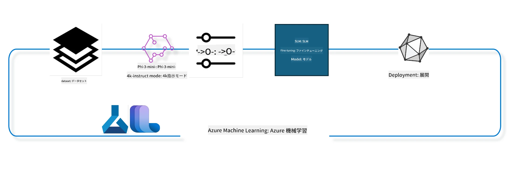

## Azure ML システムレジストリからチャット補完コンポーネントを使用してモデルをファインチューニングする方法

この例では、Phi-3-mini-4k-instruct モデルを ultrachat_200k データセットを使って、2人の会話を完成させるためにファインチューニングします。



この例では、Azure ML SDK と Python を使ってファインチューニングを行い、その後、ファインチューニング済みモデルをリアルタイム推論用のオンラインエンドポイントにデプロイする方法を示します。

### トレーニングデータ

ultrachat_200k データセットを使用します。これは UltraChat データセットの厳密にフィルタリングされたバージョンであり、最先端の7bチャットモデルである Zephyr-7B-β のトレーニングに使用されました。

### モデル

チャット補完タスクのためにモデルをファインチューニングする方法を示すために、Phi-3-mini-4k-instruct モデルを使用します。このノートブックを特定のモデルカードから開いた場合は、特定のモデル名に置き換えてください。

### タスク

- ファインチューニングするモデルを選択する。
- トレーニングデータを選択し、探索する。
- ファインチューニングジョブを構成する。
- ファインチューニングジョブを実行する。
- トレーニングおよび評価メトリクスを確認する。
- ファインチューニング済みモデルを登録する。
- ファインチューニング済みモデルをリアルタイム推論用にデプロイする。
- リソースをクリーンアップする。

## 1. 前提条件のセットアップ

- 依存関係をインストールする
- AzureML Workspace に接続する。SDK 認証のセットアップについてはこちらを参照してください。以下の <WORKSPACE_NAME>、<RESOURCE_GROUP>、および <SUBSCRIPTION_ID> を置き換えてください。
- azureml システムレジストリに接続する
- 任意の実験名を設定する
- コンピュートをチェックまたは作成する。

> [!NOTE]
> 要件は単一の GPU ノードが複数の GPU カードを持つことができることです。例えば、Standard_NC24rs_v3 の1ノードには4つの NVIDIA V100 GPU があり、Standard_NC12s_v3 には2つの NVIDIA V100 GPU があります。この情報についてはドキュメントを参照してください。ノードあたりの GPU カード数は下記のパラメータ gpus_per_node に設定します。この値を正しく設定すると、ノード内のすべての GPU が利用されます。推奨 GPU コンピュート SKU はこちらとこちらで確認できます。

### Python ライブラリ

以下のセルを実行して依存関係をインストールします。これは新しい環境で実行する場合は必須のステップです。

```bash
pip install azure-ai-ml
pip install azure-identity
pip install datasets==2.9.0
pip install mlflow
pip install azureml-mlflow
```

### Azure ML とのインタラクション

1. この Python スクリプトは Azure Machine Learning（Azure ML）サービスとやり取りするためのものです。内容を簡単に説明すると：

    - azure.ai.ml、azure.identity、azure.ai.ml.entities パッケージから必要なモジュールをインポートしています。また、time モジュールもインポートしています。

    - DefaultAzureCredential() を使って認証しようとします。これは Azure クラウドで実行されるアプリケーションの開発を迅速に開始するための簡潔な認証方法です。失敗した場合は、InteractiveBrowserCredential() にフォールバックし、インタラクティブログインプロンプトが表示されます。

    - from_config メソッドを使って MLClient インスタンスを作成しようとします。これはデフォルトの設定ファイル（config.json）から設定を読み込みます。失敗した場合は subscription_id、resource_group_name、workspace_name を手動で指定して MLClient インスタンスを作成します。

    - Azure ML レジストリ "azureml" 用にもう一つ MLClient インスタンスを作成します。このレジストリはモデル、ファインチューニングパイプライン、環境が保存される場所です。

    - experiment_name を "chat_completion_Phi-3-mini-4k-instruct" に設定します。

    - 現在の時刻（エポックからの秒数）を整数に変換し文字列化して一意のタイムスタンプを生成します。これはユニークな名前やバージョン作成に使用されます。

    ```python
    # Azure ML と Azure Identity から必要なモジュールをインポートする
    from azure.ai.ml import MLClient
    from azure.identity import (
        DefaultAzureCredential,
        InteractiveBrowserCredential,
    )
    from azure.ai.ml.entities import AmlCompute
    import time  # time モジュールをインポートする
    
    # DefaultAzureCredential を使って認証を試みる
    try:
        credential = DefaultAzureCredential()
        credential.get_token("https://management.azure.com/.default")
    except Exception as ex:  # DefaultAzureCredential が失敗した場合、InteractiveBrowserCredential を使う
        credential = InteractiveBrowserCredential()
    
    # デフォルトの設定ファイルを使って MLClient インスタンスを作成しようとする
    try:
        workspace_ml_client = MLClient.from_config(credential=credential)
    except:  # 失敗した場合、手動で詳細を提供して MLClient インスタンスを作成する
        workspace_ml_client = MLClient(
            credential,
            subscription_id="<SUBSCRIPTION_ID>",
            resource_group_name="<RESOURCE_GROUP>",
            workspace_name="<WORKSPACE_NAME>",
        )
    
    # "azureml" という名前の Azure ML レジストリ用に別の MLClient インスタンスを作成する
    # このレジストリにはモデル、ファインチューニングパイプライン、環境が保存される
    registry_ml_client = MLClient(credential, registry_name="azureml")
    
    # 実験名を設定する
    experiment_name = "chat_completion_Phi-3-mini-4k-instruct"
    
    # ユニークである必要がある名前やバージョンに使える一意のタイムスタンプを生成する
    timestamp = str(int(time.time()))
    ```

## 2. ファインチューニングする基盤モデルを選択

1. Phi-3-mini-4k-instruct は 38億パラメーターの軽量で最先端のオープンモデルで、Phi-2 に使用されたデータセットをベースに構築されています。このモデルは Phi-3 ファミリーに属し、Mini バージョンは 4K と 128K（対応可能なトークン長）という2つのバリアントがあります。用途に合わせてモデルをファインチューニングする必要があります。AzureML Studio のモデルカタログでチャット補完タスクでフィルターしてこれらのモデルを閲覧できます。この例では Phi-3-mini-4k-instruct モデルを使います。別のモデル用にこのノートブックを開いた場合は名前とバージョンを適宜置き換えてください。

> [!NOTE]
> モデルの id プロパティです。これがファインチューニングジョブへの入力として渡されます。また、AzureML Studio モデルカタログのモデル詳細ページの Asset ID フィールドにもあります。

2. この Python スクリプトは Azure Machine Learning (Azure ML) サービスとやり取りしています。内容は：

    - model_name を "Phi-3-mini-4k-instruct" に設定しています。

    - registry_ml_client オブジェクトの models プロパティの get メソッドを使い、指定した名前の最新バージョンのモデルを Azure ML レジストリから取得しています。get メソッドにはモデル名と最新バージョン取得を指定するラベルを渡しています。

    - ファインチューニングに使うモデルの名前、バージョン、id をコンソールに出力しています。これは文字列の format メソッドを使い foundation_model オブジェクトのプロパティから値を挿入しています。

    ```python
    # モデル名を設定する
    model_name = "Phi-3-mini-4k-instruct"
    
    # Azure ML レジストリからモデルの最新バージョンを取得する
    foundation_model = registry_ml_client.models.get(model_name, label="latest")
    
    # モデル名、バージョン、IDを表示する
    # この情報は追跡とデバッグに役立ちます
    print(
        "\n\nUsing model name: {0}, version: {1}, id: {2} for fine tuning".format(
            foundation_model.name, foundation_model.version, foundation_model.id
        )
    )
    ```

## 3. ジョブで使用するコンピュートの作成

ファインチューニングジョブは GPU コンピュートでのみ動作します。コンピュートのサイズはモデルの大きさによって異なり、適切なコンピュートの特定は難しい場合が多いです。このセルでは、ジョブに適したコンピュートの選択方法を案内します。

> [!NOTE]
> 以下に示すコンピュートは最適構成で動作することが確認済みです。構成を変更すると CUDA のメモリー不足エラーが発生する可能性があります。そうした場合はより大きなコンピュートサイズにアップグレードしてください。

> [!NOTE]
> 下記 compute_cluster_size を選択する際は、そのコンピュートが利用可能なリソースグループにあることを確認してください。特定のコンピュートが利用できない場合はリソースアクセスのリクエストを行うことが可能です。

### ファインチューニング対応のモデルチェック

1. この Python スクリプトは Azure Machine Learning (Azure ML) モデルとやり取りしています。内容は以下の通りです：

    - Python 抽象構文木（AST）処理用の ast モジュールをインポートしています。

    - foundation_model オブジェクト（Azure ML のモデルを表す）が finetune_compute_allow_list というタグを持っているかどうかをチェックしています。Azure ML のタグはキーと値のペアで、モデルのフィルタリングやソートに使えます。

    - finetune_compute_allow_list タグが存在すれば、ast.literal_eval を使ってタグ値（文字列）を安全に Python のリストに変換し、computes_allow_list 変数に代入します。リストの内容からコンピュートを作成する旨をメッセージ出力します。

    - このタグが存在しなければ computes_allow_list に None を代入し、タグが存在しない旨をメッセージ出力します。

    - まとめると、このスクリプトはモデルのメタデータ内の特定タグの有無を確認し、存在すればその値をリスト化し、ユーザーにフィードバックしています。

    ```python
    # Python抽象構文文法のツリーを処理する関数を提供するastモジュールをインポートする
    import ast
    
    # モデルのタグに'finetune_compute_allow_list'タグが存在するかを確認する
    if "finetune_compute_allow_list" in foundation_model.tags:
        # タグが存在する場合、ast.literal_evalを使ってタグの値（文字列）を安全にPythonのリストに解析する
        computes_allow_list = ast.literal_eval(
            foundation_model.tags["finetune_compute_allow_list"]
        )  # 文字列をPythonのリストに変換する
        # リストからコンピュートを作成すべきであることを示すメッセージを表示する
        print(f"Please create a compute from the above list - {computes_allow_list}")
    else:
        # タグが存在しない場合、computes_allow_listをNoneに設定する
        computes_allow_list = None
        # 'finetune_compute_allow_list'タグがモデルのタグに含まれていないことを示すメッセージを表示する
        print("`finetune_compute_allow_list` is not part of model tags")
    ```

### コンピュートインスタンスのチェック

1. この Python スクリプトは Azure Machine Learning (Azure ML) サービスとやり取りし、コンピュートインスタンスに対していくつかのチェックを行っています。内容は以下の通りです：

    - compute_cluster に格納された名前のコンピュートインスタンスを Azure ML ワークスペースから取得しようとします。取得したインスタンスのプロビジョニング状態が "failed" であれば ValueError を発生させます。

    - computes_allow_list が None でなければ、このリスト内のすべてのコンピュートサイズを小文字に変換し、現在のコンピュートサイズがリスト内にあるか確認します。なければ ValueError を発生させます。

    - computes_allow_list が None の場合は、現在のコンピュートサイズがサポートされていない GPU VM サイズのリストにあるか確認し、該当すれば ValueError を発生させます。

    - ワークスペース内の全利用可能コンピュートサイズのリストを取得し、現在のコンピュートサイズ名にマッチするものについて、そのコンピュートサイズの GPU 数を調べ gpu_count_found フラグを立てます。

    - gpu_count_found が True ならばコンピュートの GPU 数を表示し、False なら ValueError を発生させます。

    - まとめると、このスクリプトは Azure ML ワークスペースのコンピュートインスタンスに対し、プロビジョニングステートのチェック、許可リストまたは拒否リストとの照合、GPU 数確認などを行っています。

    ```python
    # 例外メッセージを出力する
    print(e)
    # ワークスペースに計算サイズが存在しない場合は ValueError を発生させる
    raise ValueError(
        f"WARNING! Compute size {compute_cluster_size} not available in workspace"
    )
    
    # Azure ML ワークスペースから計算インスタンスを取得する
    compute = workspace_ml_client.compute.get(compute_cluster)
    # 計算インスタンスのプロビジョニング状態が「failed」かどうかを確認する
    if compute.provisioning_state.lower() == "failed":
        # プロビジョニング状態が「failed」の場合は ValueError を発生させる
        raise ValueError(
            f"Provisioning failed, Compute '{compute_cluster}' is in failed state. "
            f"please try creating a different compute"
        )
    
    # computes_allow_list が None でないことを確認する
    if computes_allow_list is not None:
        # computes_allow_list 内のすべての計算サイズを小文字に変換する
        computes_allow_list_lower_case = [x.lower() for x in computes_allow_list]
        # 計算インスタンスのサイズが computes_allow_list_lower_case に含まれているか確認する
        if compute.size.lower() not in computes_allow_list_lower_case:
            # 計算インスタンスのサイズが computes_allow_list_lower_case に含まれていない場合は ValueError を発生させる
            raise ValueError(
                f"VM size {compute.size} is not in the allow-listed computes for finetuning"
            )
    else:
        # サポートされていない GPU VM サイズのリストを定義する
        unsupported_gpu_vm_list = [
            "standard_nc6",
            "standard_nc12",
            "standard_nc24",
            "standard_nc24r",
        ]
        # 計算インスタンスのサイズが unsupported_gpu_vm_list に含まれているか確認する
        if compute.size.lower() in unsupported_gpu_vm_list:
            # 計算インスタンスのサイズが unsupported_gpu_vm_list に含まれている場合は ValueError を発生させる
            raise ValueError(
                f"VM size {compute.size} is currently not supported for finetuning"
            )
    
    # 計算インスタンスの GPU 数が見つかったかどうかをチェックするフラグを初期化する
    gpu_count_found = False
    # ワークスペース内の利用可能なすべての計算サイズのリストを取得する
    workspace_compute_sku_list = workspace_ml_client.compute.list_sizes()
    available_sku_sizes = []
    # 利用可能な計算サイズのリストを反復処理する
    for compute_sku in workspace_compute_sku_list:
        available_sku_sizes.append(compute_sku.name)
        # 計算サイズの名前が計算インスタンスのサイズと一致するか確認する
        if compute_sku.name.lower() == compute.size.lower():
            # 一致した場合、その計算サイズの GPU 数を取得し、gpu_count_found を True に設定する
            gpus_per_node = compute_sku.gpus
            gpu_count_found = True
    # gpu_count_found が True の場合、計算インスタンスの GPU 数を出力する
    if gpu_count_found:
        print(f"Number of GPU's in compute {compute.size}: {gpus_per_node}")
    else:
        # gpu_count_found が False の場合は ValueError を発生させる
        raise ValueError(
            f"Number of GPU's in compute {compute.size} not found. Available skus are: {available_sku_sizes}."
            f"This should not happen. Please check the selected compute cluster: {compute_cluster} and try again."
        )
    ```

## 4. ファインチューニング用データセットを選ぶ

1. ultrachat_200k データセットを使用します。このデータセットは Supervised fine-tuning (sft) に適した4つの分割を持っています。
Generation ranking (gen) 分割ごとの例の数は以下の通りです：

    ```bash
    train_sft test_sft  train_gen  test_gen
    207865  23110  256032  28304
    ```

1. 次のセルではファインチューニング用の基本的なデータ準備を示します：

### 一部のデータ行を可視化

このサンプルは迅速に実行するために、既にトリムされた行の5%を含む train_sft、test_sft ファイルを保存します。これによりファインチューニング済みモデルの精度は低下するため、実運用には向きません。
download-dataset.py は ultrachat_200k データセットをダウンロードし、ファインチューニングパイプラインコンポーネントが利用できる形式に変換します。データセットは大きいため、ここでは一部のみを扱っています。

1. 下記のスクリプト実行はデータの5%のみをダウンロードします。必要に応じて dataset_split_pc パラメータを変更することで増やせます。

> [!NOTE]
> 一部の言語モデルは異なる言語コードを持つため、データセット内のカラム名もそれに対応している必要があります。

1. データの例を示します。
チャット補完データセットは parquet 形式で保存され、各エントリーは以下のスキーマを使用しています：

    - これは JSON（JavaScript Object Notation）ドキュメントであり、広く使われるデータ交換フォーマットです。実行可能コードではなくデータの保存・送信方式です。構造の概要：

    - "prompt"：AI アシスタントへの質問やタスクを表す文字列

    - "messages"：オブジェクトの配列。各オブジェクトはユーザーと AI アシスタントとの会話の一つのメッセージを表します。メッセージオブジェクトは2つのキーを持ちます：

    - "content"：メッセージの内容を表す文字列
    - "role"：メッセージ送信主体の役割を示す文字列。 "user" または "assistant" のいずれか
    - "prompt_id"：プロンプトの一意識別子を表す文字列

1. この特定の JSON ドキュメントでは、ユーザーがディストピアストーリーの主人公を AI アシスタントに作成依頼し、アシスタントが回答、その後ユーザーが詳細を要求し、アシスタントが詳細を提供する会話が表現されています。会話全体は特定の prompt id に紐づいています。

    ```python
    {
        // The task or question posed to an AI assistant
        "prompt": "Create a fully-developed protagonist who is challenged to survive within a dystopian society under the rule of a tyrant. ...",
        
        // An array of objects, each representing a message in a conversation between a user and an AI assistant
        "messages":[
            {
                // The content of the user's message
                "content": "Create a fully-developed protagonist who is challenged to survive within a dystopian society under the rule of a tyrant. ...",
                // The role of the entity that sent the message
                "role": "user"
            },
            {
                // The content of the assistant's message
                "content": "Name: Ava\n\n Ava was just 16 years old when the world as she knew it came crashing down. The government had collapsed, leaving behind a chaotic and lawless society. ...",
                // The role of the entity that sent the message
                "role": "assistant"
            },
            {
                // The content of the user's message
                "content": "Wow, Ava's story is so intense and inspiring! Can you provide me with more details.  ...",
                // The role of the entity that sent the message
                "role": "user"
            }, 
            {
                // The content of the assistant's message
                "content": "Certainly! ....",
                // The role of the entity that sent the message
                "role": "assistant"
            }
        ],
        
        // A unique identifier for the prompt
        "prompt_id": "d938b65dfe31f05f80eb8572964c6673eddbd68eff3db6bd234d7f1e3b86c2af"
    }
    ```

### データのダウンロード

1. この Python スクリプトは download-dataset.py というヘルパースクリプトを使ってデータセットをダウンロードします。説明は以下の通り：

    - os モジュールをインポートしています。これは OS に依存する機能をポータブルに利用するためのものです。

    - os.system 関数を使い、シェルで download-dataset.py スクリプトを特定のコマンドライン引数付きで実行します。引数はダウンロード対象データセット（HuggingFaceH4/ultrachat_200k）、ダウンロード先ディレクトリ（ultrachat_200k_dataset）、データセットの分割割合（5％）を指定しています。os.system はコマンドの終了ステータスを返し、それを exit_status 変数に格納します。

    - exit_status が 0 でなければ（0 は成功終了を示す）例外を投げ、データセットダウンロード時にエラーがあったことを通知します。

    - 要約すると、ヘルパースクリプトを使ってデータセットをダウンロードし、エラー時に例外を出す仕組みです。
    
    ```python
    # osモジュールをインポートします。これはオペレーティングシステム依存の機能を使用する方法を提供します
    import os
    
    # os.system関数を使って、特定のコマンドライン引数付きでdownload-dataset.pyスクリプトをシェルで実行します
    # 引数はダウンロードするデータセット（HuggingFaceH4/ultrachat_200k）、ダウンロード先のディレクトリ（ultrachat_200k_dataset）、およびデータセットの分割割合（5）を指定します
    # os.system関数は実行したコマンドの終了ステータスを返します；このステータスはexit_status変数に格納されます
    exit_status = os.system(
        "python ./download-dataset.py --dataset HuggingFaceH4/ultrachat_200k --download_dir ultrachat_200k_dataset --dataset_split_pc 5"
    )
    
    # exit_statusが0でないかどうかを確認します
    # Unix系のオペレーティングシステムでは、終了ステータス0はコマンドが成功したことを示し、その他の数値はエラーを示します
    # exit_statusが0でなければ、データセットのダウンロードにエラーがあったことを示すメッセージで例外を発生させます
    if exit_status != 0:
        raise Exception("Error downloading dataset")
    ```

### DataFrame へのデータ読み込み

1. この Python スクリプトは JSON Lines ファイルを pandas DataFrame に読み込み、最初の5行を表示します。説明は以下の通り：

    - 強力なデータ操作・解析ライブラリである pandas をインポートしています。

    - pandas の表示オプションで最大カラム幅を 0 に設定しています。これは DataFrame を表示するときに各カラムのテキストを切り詰めずに全て表示するためです。
    - pd.read_json関数を使用して、ultrachat_200k_datasetディレクトリのtrain_sft.jsonlファイルをDataFrameに読み込みます。lines=True引数は、ファイルがJSON Lines形式で、各行が別々のJSONオブジェクトであることを示しています。

    - headメソッドを使用してDataFrameの最初の5行を表示します。DataFrameの行数が5未満の場合は、すべての行を表示します。

    - 要約すると、このスクリプトはJSON LinesファイルをDataFrameに読み込み、最初の5行を完全な列テキスト付きで表示しています。
    
    ```python
    # 強力なデータ操作および分析ライブラリであるpandasライブラリをインポートします
    import pandas as pd
    
    # pandasの表示オプションで最大列幅を0に設定します
    # これは、DataFrameを印刷するときに各列の全文が切り捨てられずに表示されることを意味します
    pd.set_option("display.max_colwidth", 0)
    
    # pd.read_json関数を使用して、ultrachat_200k_datasetディレクトリからtrain_sft.jsonlファイルをDataFrameに読み込みます
    # lines=True引数は、ファイルがJSON Lines形式であり、各行が個別のJSONオブジェクトであることを示します
    df = pd.read_json("./ultrachat_200k_dataset/train_sft.jsonl", lines=True)
    
    # headメソッドを使用してDataFrameの最初の5行を表示します
    # DataFrameの行数が5未満の場合は、すべて表示されます
    df.head()
    ```

## 5. モデルとデータを入力としてファインチューニングジョブを送信する

chat-completionパイプラインコンポーネントを使用するジョブを作成します。ファインチューニングでサポートされるすべてのパラメーターの詳細については、こちらをご覧ください。

### ファインチューニングパラメーターの定義

1. ファインチューニングパラメーターは、2つのカテゴリに分類できます - トレーニングパラメーター、最適化パラメーター

1. トレーニングパラメーターは次のようなトレーニングの側面を定義します -

    - 使用するオプティマイザー、スケジューラー
    - ファインチューニングで最適化するメトリック
    - トレーニングステップ数、バッチサイズなど
    - 最適化パラメーターはGPUメモリの最適化や計算資源の効果的な使用に役立ちます。

1. 以下はこのカテゴリに属するいくつかのパラメーターです。最適化パラメーターはモデルごとに異なり、これらの違いを処理するためにモデルとともにパッケージ化されています。

    - deepspeedとLoRAを有効化
    - 混合精度トレーニングを有効化
    - マルチノードトレーニングを有効化

> [!NOTE]
> 教師ありファインチューニングはアラインメントの喪失や壊滅的忘却を引き起こす可能性があります。この問題を確認し、ファインチューニング後にアラインメントステージを実行することを推奨します。

### ファインチューニングパラメーター

1. このPythonスクリプトは機械学習モデルのファインチューニングのパラメーターを設定しています。以下はその内容の要約です：

    - トレーニングエポック数、トレーニングと評価のバッチサイズ、学習率、学習率スケジューラータイプなどのデフォルトのトレーニングパラメーターを設定しています。

    - Layer-wise Relevance Propagation（LoRa）、DeepSpeedの適用の有無やDeepSpeedステージなどのデフォルトの最適化パラメーターを設定しています。

    - トレーニングパラメーターと最適化パラメーターをfinetune_parametersという単一の辞書にまとめています。

    - foundation_modelにモデル固有のデフォルトパラメーターがあるかをチェックし、もしあれば警告メッセージを表示し、モデル固有のデフォルトでfinetune_parametersを更新します。ast.literal_eval関数を使って文字列からPython辞書へ変換しています。

    - 使用する最終的なファインチューニングパラメーターセットを表示します。

    - 要約すると、このスクリプトはモデル固有のパラメーターで上書き可能な、ファインチューニングの設定を準備し表示しています。

    ```python
    # トレーニングのエポック数、トレーニングおよび評価のバッチサイズ、学習率、学習率スケジューラーの種類などのデフォルトのトレーニングパラメータを設定する
    training_parameters = dict(
        num_train_epochs=3,
        per_device_train_batch_size=1,
        per_device_eval_batch_size=1,
        learning_rate=5e-6,
        lr_scheduler_type="cosine",
    )
    
    # Layer-wise Relevance Propagation（LoRa）やDeepSpeedの適用有無、DeepSpeedのステージなどのデフォルトの最適化パラメータを設定する
    optimization_parameters = dict(
        apply_lora="true",
        apply_deepspeed="true",
        deepspeed_stage=2,
    )
    
    # トレーニングパラメータと最適化パラメータをfinetune_parametersという単一の辞書にまとめる
    finetune_parameters = {**training_parameters, **optimization_parameters}
    
    # foundation_modelにモデル固有のデフォルトパラメータがあるかどうかを確認する
    # もしあれば、警告メッセージを表示し、これらモデル固有のデフォルトでfinetune_parameters辞書を更新する
    # ast.literal_eval関数はモデル固有のデフォルトを文字列からPythonの辞書に変換するために使われる
    if "model_specific_defaults" in foundation_model.tags:
        print("Warning! Model specific defaults exist. The defaults could be overridden.")
        finetune_parameters.update(
            ast.literal_eval(  # 文字列をPythonの辞書に変換する
                foundation_model.tags["model_specific_defaults"]
            )
        )
    
    # 実行で使用される最終的なファインチューニングパラメータのセットを表示する
    print(
        f"The following finetune parameters are going to be set for the run: {finetune_parameters}"
    )
    ```

### トレーニングパイプライン

1. このPythonスクリプトは、機械学習トレーニングパイプラインの表示名を生成する関数を定義し、その関数を呼び出して表示名を生成・表示しています。以下は内容の要約です：

1. get_pipeline_display_name関数が定義されています。この関数はトレーニングパイプラインに関するさまざまなパラメーターに基づき表示名を生成します。

1. 関数内部で、デバイスごとのバッチサイズ、勾配蓄積ステップ数、ノードあたりGPU数、ファインチューニングに使用するノード数を掛け合わせて総バッチサイズを計算しています。

1. その他に、学習率スケジューラータイプ、DeepSpeedの適用有無、DeepSpeedステージ、Layer-wise Relevance Propagation (LoRa)の適用有無、保持するモデルチェックポイントの上限、最大シーケンス長などのパラメーターを取得しています。

1. これらのパラメーターをハイフンで区切った文字列として構成します。DeepSpeedやLoRaが適用されている場合は、それぞれ「ds」にDeepSpeedステージ番号や「lora」という文字列を含み、そうでなければ「nods」や「nolora」となります。

1. 関数はこの文字列を返し、トレーニングパイプラインの表示名となります。

1. 関数定義後に呼び出され、この表示名を生成し、表示しています。

1. 要約すると、このスクリプトは多様なパラメーターに基づき機械学習トレーニングパイプラインの表示名を生成し、表示しています。

    ```python
    # トレーニングパイプラインの表示名を生成する関数を定義する
    def get_pipeline_display_name():
        # デバイスごとのバッチサイズ、勾配蓄積ステップ数、ノードあたりGPU数、ファインチューニングに使用するノード数を掛け合わせて総バッチサイズを計算する
        batch_size = (
            int(finetune_parameters.get("per_device_train_batch_size", 1))
            * int(finetune_parameters.get("gradient_accumulation_steps", 1))
            * int(gpus_per_node)
            * int(finetune_parameters.get("num_nodes_finetune", 1))
        )
        # 学習率スケジューラーの種類を取得する
        scheduler = finetune_parameters.get("lr_scheduler_type", "linear")
        # DeepSpeedが適用されているかどうかを取得する
        deepspeed = finetune_parameters.get("apply_deepspeed", "false")
        # DeepSpeedのステージを取得する
        ds_stage = finetune_parameters.get("deepspeed_stage", "2")
        # DeepSpeedが適用されている場合は表示名に "ds" とDeepSpeedのステージを含め、適用されていない場合は "nods" を含める
        if deepspeed == "true":
            ds_string = f"ds{ds_stage}"
        else:
            ds_string = "nods"
        # 層ごとの関連性伝播（LoRa）が適用されているかどうかを取得する
        lora = finetune_parameters.get("apply_lora", "false")
        # LoRaが適用されている場合は表示名に "lora" を含め、適用されていない場合は "nolora" を含める
        if lora == "true":
            lora_string = "lora"
        else:
            lora_string = "nolora"
        # 保持するモデルチェックポイントの最大数の制限を取得する
        save_limit = finetune_parameters.get("save_total_limit", -1)
        # 最大シーケンス長を取得する
        seq_len = finetune_parameters.get("max_seq_length", -1)
        # これらすべてのパラメータをハイフンで区切って表示名を構築する
        return (
            model_name
            + "-"
            + "ultrachat"
            + "-"
            + f"bs{batch_size}"
            + "-"
            + f"{scheduler}"
            + "-"
            + ds_string
            + "-"
            + lora_string
            + f"-save_limit{save_limit}"
            + f"-seqlen{seq_len}"
        )
    
    # 表示名を生成する関数を呼び出す
    pipeline_display_name = get_pipeline_display_name()
    # 表示名を出力する
    print(f"Display name used for the run: {pipeline_display_name}")
    ```

### パイプラインの設定

このPythonスクリプトはAzure Machine Learning SDKを用いて機械学習パイプラインを定義および設定しています。以下はその内容の要約です：

1. Azure AI ML SDKから必要なモジュールをインポートしています。

1. レジストリから「chat_completion_pipeline」というパイプラインコンポーネントを取得しています。

1. `@pipeline`デコレーターと`create_pipeline`関数を用いてパイプラインジョブを定義しています。パイプラインの名前は`pipeline_display_name`に設定されています。

1. `create_pipeline`関数内で、取得したパイプラインコンポーネントをモデルパス、各種計算クラスター、トレーニングおよびテストのデータセット分割、ファインチューニングで使用するGPU数、その他のファインチューニングパラメーターを指定して初期化しています。

1. ファインチューニングジョブの出力をパイプラインジョブの出力にマッピングしています。これはファインチューニング済みモデルを簡単に登録できるようにするためであり、オンラインまたはバッチエンドポイントにモデルをデプロイする際に必要です。

1. `create_pipeline`関数を呼び出してパイプラインのインスタンスを作成しています。

1. パイプラインの`force_rerun`設定を`True`に設定し、以前のジョブのキャッシュ結果を使わないようにしています。

1. パイプラインの`continue_on_step_failure`設定を`False`に設定し、いずれかのステップで失敗した場合にパイプラインを停止するようにしています。

1. 要約すると、このスクリプトはAzure Machine Learning SDKを使用してチャット完了タスクの機械学習パイプラインを定義し、設定しています。

    ```python
    # Azure AI ML SDKから必要なモジュールをインポートする
    from azure.ai.ml.dsl import pipeline
    from azure.ai.ml import Input
    
    # レジストリから "chat_completion_pipeline" という名前のパイプラインコンポーネントを取得する
    pipeline_component_func = registry_ml_client.components.get(
        name="chat_completion_pipeline", label="latest"
    )
    
    # @pipelineデコレーターとcreate_pipeline関数を使ってパイプラインジョブを定義する
    # パイプラインの名前はpipeline_display_nameに設定されている
    @pipeline(name=pipeline_display_name)
    def create_pipeline():
        # 取得したパイプラインコンポーネントを様々なパラメータで初期化する
        # これにはモデルパス、各ステージの計算クラスター、トレーニングおよびテスト用のデータセット分割、ファインチューニングに使用するGPU数、その他のファインチューニングパラメータが含まれる
        chat_completion_pipeline = pipeline_component_func(
            mlflow_model_path=foundation_model.id,
            compute_model_import=compute_cluster,
            compute_preprocess=compute_cluster,
            compute_finetune=compute_cluster,
            compute_model_evaluation=compute_cluster,
            # データセット分割をパラメータにマッピングする
            train_file_path=Input(
                type="uri_file", path="./ultrachat_200k_dataset/train_sft.jsonl"
            ),
            test_file_path=Input(
                type="uri_file", path="./ultrachat_200k_dataset/test_sft.jsonl"
            ),
            # トレーニング設定
            number_of_gpu_to_use_finetuning=gpus_per_node,  # 計算リソースで利用可能なGPUの数に設定する
            **finetune_parameters
        )
        return {
            # ファインチューニングジョブの出力をパイプラインジョブの出力にマッピングする
            # これはファインチューニング済みモデルを簡単に登録できるようにするためである
            # モデルをオンラインまたはバッチのエンドポイントにデプロイするにはモデルの登録が必要である
            "trained_model": chat_completion_pipeline.outputs.mlflow_model_folder
        }
    
    # create_pipeline関数を呼び出してパイプラインのインスタンスを作成する
    pipeline_object = create_pipeline()
    
    # 前のジョブのキャッシュされた結果を使用しない
    pipeline_object.settings.force_rerun = True
    
    # ステップ失敗時に処理を続行しないよう設定する
    # これは任意のステップが失敗した場合にパイプラインが停止することを意味する
    pipeline_object.settings.continue_on_step_failure = False
    ```

### ジョブの送信

1. このPythonスクリプトはAzure Machine Learningワークスペースに機械学習パイプラインジョブを送信し、そのジョブの完了を待機します。以下は内容の要約です：

    - workspace_ml_clientのjobsオブジェクトのcreate_or_updateメソッドを呼び出し、pipeline_objectで指定したパイプラインジョブをexperiment_nameで指定した実験の下に送信します。

    - その後、workspace_ml_clientのjobsオブジェクトのstreamメソッドでpipeline_jobオブジェクトのname属性で指定されたジョブの完了を待機します。

    - 要約すると、このスクリプトはAzure Machine Learningワークスペースに機械学習パイプラインジョブを送信し、完了まで待機しています。

    ```python
    # Azure Machine Learning ワークスペースにパイプラインジョブを送信します
    # 実行するパイプラインは pipeline_object によって指定されます
    # ジョブが実行される実験は experiment_name によって指定されます
    pipeline_job = workspace_ml_client.jobs.create_or_update(
        pipeline_object, experiment_name=experiment_name
    )
    
    # パイプラインジョブの完了を待ちます
    # 待機するジョブは pipeline_job オブジェクトの name 属性で指定されます
    workspace_ml_client.jobs.stream(pipeline_job.name)
    ```

## 6. ファインチューニング済みモデルをワークスペースに登録する

ファインチューニングジョブの出力からモデルを登録します。これにより、ファインチューニング済みモデルとファインチューニングジョブ間の系譜を追跡できます。さらにファインチューニングジョブは基盤モデル、データ、トレーニングコードへの系譜も追跡します。

### MLモデルの登録

1. このPythonスクリプトはAzure Machine Learningパイプラインでトレーニングした機械学習モデルを登録しています。以下は内容の要約です：

    - Azure AI ML SDKから必要なモジュールをインポートします。

    - workspace_ml_clientのjobsオブジェクトのgetメソッドを呼び出し、そのoutputs属性でパイプラインジョブのtrained_model出力が利用可能か確認します。

    - パイプラインジョブ名と出力名("trained_model")をフォーマットして、トレーニング済みモデルへのパスを構築します。

    - 元のモデル名に"-ultrachat-200k"を付加し、スラッシュをハイフンに置換してファインチューニング済みモデルの名前を定義します。

    - モデルのパス、タイプ（MLflowモデル）、名前やバージョン、説明などを含むModelオブジェクトを作成して、モデル登録の準備をします。

    - workspace_ml_clientのmodelsオブジェクトのcreate_or_updateメソッドを呼び出してモデルを登録します。

    - 登録されたモデルを表示します。

1. 要約すると、このスクリプトはAzure Machine Learningパイプラインでトレーニングされたモデルを登録しています。
    
    ```python
    # Azure AI ML SDKから必要なモジュールをインポートする
    from azure.ai.ml.entities import Model
    from azure.ai.ml.constants import AssetTypes
    
    # パイプラインジョブから`trained_model`出力が利用可能か確認する
    print("pipeline job outputs: ", workspace_ml_client.jobs.get(pipeline_job.name).outputs)
    
    # パイプラインジョブの名前と出力名("trained_model")をフォーマットして学習済みモデルへのパスを作成する
    model_path_from_job = "azureml://jobs/{0}/outputs/{1}".format(
        pipeline_job.name, "trained_model"
    )
    
    # 元のモデル名に"-ultrachat-200k"を付け加え、スラッシュをハイフンに置き換えてファインチューニングモデルの名前を定義する
    finetuned_model_name = model_name + "-ultrachat-200k"
    finetuned_model_name = finetuned_model_name.replace("/", "-")
    
    print("path to register model: ", model_path_from_job)
    
    # Modelオブジェクトを作成し、モデルを登録する準備をする
    # これにはモデルへのパス、モデルの種類(MLflowモデル)、モデルの名前とバージョン、およびモデルの説明が含まれる
    prepare_to_register_model = Model(
        path=model_path_from_job,
        type=AssetTypes.MLFLOW_MODEL,
        name=finetuned_model_name,
        version=timestamp,  # バージョンの競合を避けるためにタイムスタンプをバージョンとして使用する
        description=model_name + " fine tuned model for ultrachat 200k chat-completion",
    )
    
    print("prepare to register model: \n", prepare_to_register_model)
    
    # Modelオブジェクトを引数にしてworkspace_ml_clientのmodelsオブジェクトのcreate_or_updateメソッドを呼び出し、モデルを登録する
    registered_model = workspace_ml_client.models.create_or_update(
        prepare_to_register_model
    )
    
    # 登録済みモデルを表示する
    print("registered model: \n", registered_model)
    ```

## 7. ファインチューニング済みモデルをオンラインエンドポイントにデプロイする

オンラインエンドポイントは、モデルを使用するアプリケーションと統合するための永続的なREST APIを提供します。

### エンドポイントの管理

1. このPythonスクリプトはAzure Machine Learningで登録済みモデルの管理されたオンラインエンドポイントを作成します。以下は内容の要約です：

    - Azure AI ML SDKから必要なモジュールをインポートします。

    - "ultrachat-completion-"にタイムスタンプを付加して、オンラインエンドポイントの一意な名前を定義します。

    - ManagedOnlineEndpointオブジェクトを作成し、エンドポイント名、説明、認証モード("key")などのパラメーターを設定してエンドポイント作成の準備をします。

    - workspace_ml_clientのbegin_create_or_updateメソッドを呼び出しManagedOnlineEndpointオブジェクトを渡してオンラインエンドポイントを作成し、waitメソッドで作成完了を待ちます。

1. 要約すると、このスクリプトは登録モデル用のAzure Machine Learning管理下のオンラインエンドポイントを作成しています。

    ```python
    # Azure AI ML SDKから必要なモジュールをインポートする
    from azure.ai.ml.entities import (
        ManagedOnlineEndpoint,
        ManagedOnlineDeployment,
        ProbeSettings,
        OnlineRequestSettings,
    )
    
    # "ultrachat-completion-"という文字列にタイムスタンプを付加してユニークなオンラインエンドポイント名を定義する
    online_endpoint_name = "ultrachat-completion-" + timestamp
    
    # 様々なパラメータを使用してManagedOnlineEndpointオブジェクトを作成し、オンラインエンドポイントを作成する準備をする
    # これにはエンドポイントの名前、エンドポイントの説明、および認証モード（"key"）が含まれる
    endpoint = ManagedOnlineEndpoint(
        name=online_endpoint_name,
        description="Online endpoint for "
        + registered_model.name
        + ", fine tuned model for ultrachat-200k-chat-completion",
        auth_mode="key",
    )
    
    # workspace_ml_clientのbegin_create_or_updateメソッドをManagedOnlineEndpointオブジェクトを引数に呼び出してオンラインエンドポイントを作成する
    # 次に、waitメソッドを呼び出して作成操作が完了するのを待つ
    workspace_ml_client.begin_create_or_update(endpoint).wait()
    ```

> [!NOTE]
> デプロイにサポートされているSKUの一覧はこちらにあります - [Managed online endpoints SKU list](https://learn.microsoft.com/azure/machine-learning/reference-managed-online-endpoints-vm-sku-list)

### MLモデルのデプロイ

1. このPythonスクリプトはAzure Machine Learningの管理されたオンラインエンドポイントに登録済み機械学習モデルをデプロイします。内容の要約は以下の通りです：

    - Pythonの抽象構文木を処理する関数を提供するastモジュールをインポートします。

    - デプロイに使用するインスタンスタイプを"Standard_NC6s_v3"に設定します。

    - foundation modelにinference_compute_allow_listタグがあるかをチェックし、あれば文字列からPythonリストに変換してinference_computes_allow_listに代入し、なければNoneをセットします。

    - 指定したインスタンスタイプが許可リストに含まれているかをチェックし、含まれていなければ許可リスト内のインスタンスタイプから選択するようユーザーにメッセージを表示します。

    - ManagedOnlineDeploymentオブジェクトを作成し、デプロイ名、エンドポイント名、モデルID、インスタンスタイプと数、リブネスプローブ設定、リクエスト設定などのパラメーターを設定してデプロイ準備をします。

    - workspace_ml_clientのbegin_create_or_updateメソッドでManagedOnlineDeploymentオブジェクトを渡しデプロイを作成し、waitメソッドで作成完了を待ちます。

    - エンドポイントのトラフィックを"demo"というデプロイに100％割り当てます。

    - workspace_ml_clientのbegin_create_or_updateメソッドでエンドポイントオブジェクトを渡しエンドポイントを更新し、resultメソッドで更新完了を待ちます。

1. 要約すると、このスクリプトはAzure Machine Learningの管理されたオンラインエンドポイントに登録済み機械学習モデルをデプロイしています。

    ```python
    # astモジュールをインポートします。これはPythonの抽象構文文法のツリーを処理する関数を提供します
    import ast
    
    # デプロイメントのインスタンスタイプを設定します
    instance_type = "Standard_NC6s_v3"
    
    # ファンデーションモデルに `inference_compute_allow_list` タグが存在するか確認します
    if "inference_compute_allow_list" in foundation_model.tags:
        # 存在する場合、そのタグの値を文字列からPythonのリストに変換し、`inference_computes_allow_list` に代入します
        inference_computes_allow_list = ast.literal_eval(
            foundation_model.tags["inference_compute_allow_list"]
        )
        print(f"Please create a compute from the above list - {computes_allow_list}")
    else:
        # 存在しない場合、`inference_computes_allow_list` を `None` に設定します
        inference_computes_allow_list = None
        print("`inference_compute_allow_list` is not part of model tags")
    
    # 指定されたインスタンスタイプが許可リストにあるか確認します
    if (
        inference_computes_allow_list is not None
        and instance_type not in inference_computes_allow_list
    ):
        print(
            f"`instance_type` is not in the allow listed compute. Please select a value from {inference_computes_allow_list}"
        )
    
    # さまざまなパラメータを使って `ManagedOnlineDeployment` オブジェクトを作成し、デプロイメントの準備をします
    demo_deployment = ManagedOnlineDeployment(
        name="demo",
        endpoint_name=online_endpoint_name,
        model=registered_model.id,
        instance_type=instance_type,
        instance_count=1,
        liveness_probe=ProbeSettings(initial_delay=600),
        request_settings=OnlineRequestSettings(request_timeout_ms=90000),
    )
    
    # `ManagedOnlineDeployment` オブジェクトを引数として `workspace_ml_client` の `begin_create_or_update` メソッドを呼び出し、デプロイメントを作成します
    # その後、`wait` メソッドを呼び出して作成操作の完了を待ちます
    workspace_ml_client.online_deployments.begin_create_or_update(demo_deployment).wait()
    
    # エンドポイントのトラフィックを設定し、トラフィックの100%を "demo" デプロイメントに誘導します
    endpoint.traffic = {"demo": 100}
    
    # `endpoint` オブジェクトを引数として `workspace_ml_client` の `begin_create_or_update` メソッドを呼び出し、エンドポイントを更新します
    # その後、`result` メソッドを呼び出して更新操作の完了を待ちます
    workspace_ml_client.begin_create_or_update(endpoint).result()
    ```

## 8. サンプルデータでエンドポイントをテストする

テストデータセットからサンプルデータを取得し、オンラインエンドポイントに推論のために送信します。その後、推定結果（スコア付きラベル）と正解ラベルを表示します。

### 結果の読み込み

1. このPythonスクリプトはJSON LinesファイルをpandasのDataFrameに読み込み、ランダムサンプルを抽出し、インデックスをリセットしています。以下は要約です：

    - ./ultrachat_200k_dataset/test_gen.jsonlファイルをpandasのDataFrameに読み込みます。read_json関数はlines=True引数付きで呼ばれ、ファイルが各行個別のJSONオブジェクトであるJSON Lines形式であることに対応しています。

    - DataFrameから1行のランダムサンプルを抽出します。sample関数のn=1引数でランダム抽出数を指定しています。

    - reset_index関数でインデックスをリセットし、元のインデックスはdrop=Trueで破棄され、デフォルト整数インデックスに置き換えられます。

    - head関数に引数2を渡してDataFrameの最初の2行を表示します。ただしランダム抽出後はDataFrameが1行だけなので、その1行のみが表示されます。

1. 要約すると、このスクリプトはJSON Linesファイルをpandas DataFrameに読み込み、1行のランダムサンプルを抽出し、インデックスをリセットして最初の行を表示しています。
    
    ```python
    # pandasライブラリをインポートする
    import pandas as pd
    
    # JSON Linesファイル './ultrachat_200k_dataset/test_gen.jsonl' をpandasのDataFrameに読み込む
    # 'lines=True' 引数はファイルがJSON Lines形式であり、各行が別々のJSONオブジェクトであることを示す
    test_df = pd.read_json("./ultrachat_200k_dataset/test_gen.jsonl", lines=True)
    
    # DataFrameからランダムに1行をサンプリングする
    # 'n=1' 引数はランダムに選択する行数を指定する
    test_df = test_df.sample(n=1)
    
    # DataFrameのインデックスをリセットする
    # 'drop=True' 引数は元のインデックスを削除し、デフォルトの整数インデックスに置き換えることを示す
    # 'inplace=True' 引数は新しいオブジェクトを作成せずにDataFrameをインプレースで変更することを示す
    test_df.reset_index(drop=True, inplace=True)
    
    # DataFrameの最初の2行を表示する
    # ただし、サンプリング後DataFrameには1行しか含まれていないため、これでその1行だけが表示されることになる
    test_df.head(2)
    ```

### JSONオブジェクトの作成

1. このPythonスクリプトは特定のパラメーターを含むJSONオブジェクトを作成し、ファイルに保存しています。以下は内容の要約です：

    - JSONデータを操作する機能を提供するjsonモジュールをインポートしています。
    - これは、機械学習モデルのパラメーターを表すキーと値を持つ辞書parametersを作成します。キーは "temperature"、"top_p"、"do_sample"、"max_new_tokens"で、それぞれの対応する値は0.6、0.9、True、200です。

    - もう一つ、test_jsonという辞書を作成します。これは2つのキー "input_data" と "params" を持ちます。"input_data" の値はさらに辞書で、キーは "input_string" と "parameters" です。"input_string" の値はtest_df DataFrameの最初のメッセージを含むリストです。"parameters" の値は先に作成したparameters辞書です。"params" の値は空の辞書です。

    - sample_score.jsonという名前のファイルを開きます
    
    ```python
    # JSONデータを扱うための関数を提供するjsonモジュールをインポートする
    import json
    
    # 機械学習モデルのパラメータを表すキーと値を持つ辞書`parameters`を作成する
    # キーは"temperature"、"top_p"、"do_sample"、"max_new_tokens"で、それぞれの値は0.6、0.9、True、200である
    parameters = {
        "temperature": 0.6,
        "top_p": 0.9,
        "do_sample": True,
        "max_new_tokens": 200,
    }
    
    # 2つのキー"input_data"と"params"を持つ別の辞書`test_json`を作成する
    # "input_data"の値は"input_string"と"parameters"というキーを持つ別の辞書である
    # "input_string"の値は`test_df`データフレームの最初のメッセージを含むリストである
    # "parameters"の値は先に作成した`parameters`辞書である
    # "params"の値は空の辞書である
    test_json = {
        "input_data": {
            "input_string": [test_df["messages"][0]],
            "parameters": parameters,
        },
        "params": {},
    }
    
    # `./ultrachat_200k_dataset`ディレクトリにある`sample_score.json`という名前のファイルを追記モードで開く
    with open("./ultrachat_200k_dataset/sample_score.json", "w") as f:
        # `json.dump`関数を使って`test_json`辞書をJSON形式でファイルに書き込む
        json.dump(test_json, f)
    ```

### エンドポイントの呼び出し

1. このPythonスクリプトは、Azure Machine Learningのオンラインエンドポイントを呼び出してJSONファイルをスコアリングしています。以下がその内容の詳細です：

    - workspace_ml_clientオブジェクトのonline_endpointsプロパティのinvokeメソッドを呼び出しています。このメソッドは、オンラインエンドポイントにリクエストを送信し、レスポンスを取得するために使われます。

    - endpoint_nameとdeployment_nameの引数でエンドポイント名とデプロイメント名を指定します。この場合、エンドポイント名はonline_endpoint_name変数に格納されており、デプロイメント名は "demo" です。

    - request_file引数でスコアリングするJSONファイルのパスを指定します。この場合、ファイルは ./ultrachat_200k_dataset/sample_score.json です。

    - エンドポイントからのレスポンスをresponse変数に格納します。

    - 生のレスポンスをプリントします。

1. まとめると、このスクリプトはAzure Machine Learning上のオンラインエンドポイントを呼び出してJSONファイルのスコアリングを行い、そのレスポンスを表示しています。

    ```python
    # Azure Machine Learning のオンラインエンドポイントを呼び出して `sample_score.json` ファイルをスコアリングします
    # `workspace_ml_client` オブジェクトの `online_endpoints` プロパティの `invoke` メソッドを使用して、オンラインエンドポイントにリクエストを送信し、レスポンスを取得します
    # `endpoint_name` 引数はエンドポイントの名前を指定し、これは `online_endpoint_name` 変数に格納されています
    # `deployment_name` 引数はデプロイメントの名前を指定し、それは "demo" です
    # `request_file` 引数はスコアリングする JSON ファイルへのパスを指定し、`./ultrachat_200k_dataset/sample_score.json` です
    response = workspace_ml_client.online_endpoints.invoke(
        endpoint_name=online_endpoint_name,
        deployment_name="demo",
        request_file="./ultrachat_200k_dataset/sample_score.json",
    )
    
    # エンドポイントからの生のレスポンスを表示します
    print("raw response: \n", response, "\n")
    ```

## 9. オンラインエンドポイントの削除

1. オンラインエンドポイントを削除することを忘れないでください。さもなければエンドポイントで使われたコンピュートの課金メーターが動き続けます。このPythonコードの一行は、Azure Machine Learning上のオンラインエンドポイントを削除しています。以下がその内容の詳細です：

    - workspace_ml_clientオブジェクトのonline_endpointsプロパティのbegin_deleteメソッドを呼び出しています。このメソッドはオンラインエンドポイントの削除を開始します。

    - name引数で削除するエンドポイント名を指定します。この場合、エンドポイント名はonline_endpoint_name変数に格納されています。

    - waitメソッドを呼び出して削除操作が完了するまで待機します。これはブロッキング操作であり、削除完了までスクリプトの実行を停止します。

    - 要約すると、この一行のコードはAzure Machine Learning上のオンラインエンドポイントの削除を開始し、その操作完了を待機しています。

    ```python
    # Azure Machine Learning のオンラインエンドポイントを削除する
    # `workspace_ml_client` オブジェクトの `online_endpoints` プロパティの `begin_delete` メソッドを使用してオンラインエンドポイントの削除を開始します
    # `name` 引数は削除するエンドポイントの名前を指定し、その名前は `online_endpoint_name` 変数に格納されています
    # 削除操作が完了するまで待機するために `wait` メソッドが呼び出されます。これはブロッキング操作であり、削除が完了するまでスクリプトの実行を続行しません
    workspace_ml_client.online_endpoints.begin_delete(name=online_endpoint_name).wait()
    ```

---

<!-- CO-OP TRANSLATOR DISCLAIMER START -->
**免責事項**：  
本書類はAI翻訳サービス[Co-op Translator](https://github.com/Azure/co-op-translator)を使用して翻訳されました。正確性の確保に努めておりますが、自動翻訳には誤りや不正確な箇所が含まれる場合があります。正式な情報源としては、原文書（原言語版）を参照してください。重要な情報については、専門の人間による翻訳を推奨いたします。本翻訳の利用に起因する誤解や誤訳について、当方は一切の責任を負いかねます。
<!-- CO-OP TRANSLATOR DISCLAIMER END -->