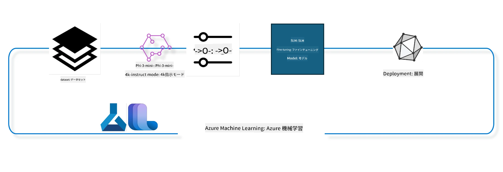

## Azure ML システムレジストリのチャット完了コンポーネントを使用してモデルをファインチューニングする方法

この例では、Phi-3-mini-4k-instruct モデルのファインチューニングを行い、ultrachat_200k データセットを使用して2人の会話を完結させます。



この例では、Azure ML SDK と Python を使用してファインチューニングを行い、ファインチューニング済みモデルをリアルタイム推論用のオンラインエンドポイントにデプロイする方法を示します。

### トレーニングデータ

ultrachat_200k データセットを使用します。これは UltraChat データセットの厳選版で、最先端の7bチャットモデルである Zephyr-7B-β のトレーニングに使用されました。

### モデル

Phi-3-mini-4k-instruct モデルを使って、チャット完了タスク向けにモデルをファインチューニングする方法を示します。このノートブックを特定のモデルカードから開いた場合は、該当するモデル名に置き換えてください。

### タスク

- ファインチューニングするモデルを選択する。
- トレーニングデータを選択し、確認する。
- ファインチューニングジョブを構成する。
- ファインチューニングジョブを実行する。
- トレーニングと評価のメトリクスを確認する。
- ファインチューニング済みモデルを登録する。
- リアルタイム推論用にファインチューニング済みモデルをデプロイする。
- リソースをクリーンアップする。

## 1. 前提条件のセットアップ

- 依存関係をインストールする
- AzureML ワークスペースに接続する。詳細は SDK 認証のセットアップをご覧ください。以下の <WORKSPACE_NAME>, <RESOURCE_GROUP>, <SUBSCRIPTION_ID> を置き換えてください。
- Azure ML システムレジストリに接続する
- 任意の実験名を設定する
- コンピュートを確認または作成する

> [!NOTE]
> 要件として、単一のGPUノードに複数のGPUカードを搭載できます。例えば、Standard_NC24rs_v3 の1ノードには4台の NVIDIA V100 GPU があり、Standard_NC12s_v3 には2台の NVIDIA V100 GPU があります。この情報はドキュメントをご参照ください。ノードあたりのGPUカード数は下記の gpus_per_node パラメータで設定します。この値を正しく設定することでノード内のすべてのGPUが利用されます。推奨GPUコンピュートSKUはこちらとこちらで確認できます。

### Python ライブラリ

下記セルを実行して依存関係をインストールしてください。新しい環境で実行する場合は必須のステップです。

```bash
pip install azure-ai-ml
pip install azure-identity
pip install datasets==2.9.0
pip install mlflow
pip install azureml-mlflow
```

### Azure ML との対話

1. この Python スクリプトは Azure Machine Learning (Azure ML) サービスとやり取りするためのものです。具体的には以下を行います：

    - azure.ai.ml、azure.identity、azure.ai.ml.entities から必要なモジュールをインポートし、time モジュールもインポートしています。

    - DefaultAzureCredential() を使い認証を試みます。これはAzureクラウド上でアプリを素早く開発開始できるシンプルな認証手法です。失敗した場合は InteractiveBrowserCredential() で対話型ログインを行います。

    - 次に from_config メソッドを使い、デフォルトの設定ファイル(config.json)から構成を読み込み MLClient インスタンスを作成しようとします。失敗した場合は subscription_id、resource_group_name、workspace_name を手動で渡して MLClient インスタンスを生成します。

    - さらにモデルやファインチューニングパイプライン、環境が格納されている Azure ML レジストリ "azureml" に対する MLClient インスタンスを作成します。

    - experiment_name を "chat_completion_Phi-3-mini-4k-instruct" に設定します。

    - 現在時刻（エポック秒、浮動小数点数）を整数化して文字列化し、ユニークなタイムスタンプを生成します。これは一意の名前やバージョン作成時に使用できます。

    ```python
    # Azure ML と Azure Identity から必要なモジュールをインポートする
    from azure.ai.ml import MLClient
    from azure.identity import (
        DefaultAzureCredential,
        InteractiveBrowserCredential,
    )
    from azure.ai.ml.entities import AmlCompute
    import time  # time モジュールをインポートする
    
    # DefaultAzureCredential を使って認証を試みる
    try:
        credential = DefaultAzureCredential()
        credential.get_token("https://management.azure.com/.default")
    except Exception as ex:  # DefaultAzureCredential が失敗した場合は InteractiveBrowserCredential を使用する
        credential = InteractiveBrowserCredential()
    
    # デフォルトの構成ファイルを使って MLClient インスタンスを作成しようとする
    try:
        workspace_ml_client = MLClient.from_config(credential=credential)
    except:  # それが失敗した場合は、手動で詳細を指定して MLClient インスタンスを作成する
        workspace_ml_client = MLClient(
            credential,
            subscription_id="<SUBSCRIPTION_ID>",
            resource_group_name="<RESOURCE_GROUP>",
            workspace_name="<WORKSPACE_NAME>",
        )
    
    # "azureml" という名前の Azure ML レジストリ用に別の MLClient インスタンスを作成する
    # このレジストリはモデル、ファインチューニングパイプライン、および環境が保存される場所である
    registry_ml_client = MLClient(credential, registry_name="azureml")
    
    # 実験名を設定する
    experiment_name = "chat_completion_Phi-3-mini-4k-instruct"
    
    # ユニークである必要がある名前やバージョンに使用できる一意のタイムスタンプを生成する
    timestamp = str(int(time.time()))
    ```

## 2. ファインチューニングする基盤モデルを選択する

1. Phi-3-mini-4k-instruct は38億パラメータの軽量な最先端オープンモデルで、Phi-2 用のデータセットに基づいて構築されています。このモデルは Phi-3 ファミリーに属し、Mini バージョンは4K と 128K の2種類のコンテキスト長（トークン数）があります。利用には特定用途向けにファインチューニングが必要です。AzureML Studio モデルカタログでチャット完了タスクに絞ってこれらのモデルを参照できます。本例では Phi-3-mini-4k-instruct を使用します。別のモデル用ノートブックを開いた場合は、モデル名とバージョンを適宜置き換えてください。

> [!NOTE]
> ファインチューニングジョブの入力としてモデルの id プロパティが渡されます。これは AzureML Studio モデルカタログのモデル詳細画面の Asset ID フィールドと対応しています。

2. この Python スクリプトは Azure Machine Learning サービスとやりとりしています。具体的な処理は以下の通りです：

    - model_name を "Phi-3-mini-4k-instruct" に設定します。

    - registry_ml_client オブジェクトの models プロパティの get メソッドを使用して、Azure ML レジストリから指定モデル名の最新バージョンを取得します。get メソッドはモデル名と "latest" ラベルを受け取ります。

    - コンソールにファインチューニングに使用するモデルの名前、バージョン、IDを表示します。文字列の format メソッドで foundation_model オブジェクトのプロパティを埋め込みます。

    ```python
    # モデル名を設定します
    model_name = "Phi-3-mini-4k-instruct"
    
    # Azure ML レジストリからモデルの最新バージョンを取得します
    foundation_model = registry_ml_client.models.get(model_name, label="latest")
    
    # モデル名、バージョン、IDを出力します
    # この情報はトラッキングやデバッグに役立ちます
    print(
        "\n\nUsing model name: {0}, version: {1}, id: {2} for fine tuning".format(
            foundation_model.name, foundation_model.version, foundation_model.id
        )
    )
    ```

## 3. ジョブで使用するコンピュートの作成

ファインチューニングジョブは GPU コンピュートでのみ動作します。必要なコンピュートのサイズはモデルの大きさにより異なり、適切なコンピュートの選定はしばしば難しいものです。本セルではユーザーがジョブに適したコンピュートを選べるよう案内します。

> [!NOTE]
> 下記にリストしたコンピュートは最適化された構成で動作します。設定変更は CUDA メモリ不足エラー（OOM）の原因となる場合があります。その場合はより大きなコンピュートサイズへアップグレードすることを検討してください。

> [!NOTE]
> compute_cluster_size 選択時はリソースグループで対象のコンピュートが利用可能か確認してください。利用不可の場合はアクセスリクエストが可能です。

### ファインチューニング対応モデルの確認

1. この Python スクリプトは Azure Machine Learning モデルとやり取りしています。処理内容は以下のとおりです：

    - Python の抽象構文木 (AST) を処理する ast モジュールをインポートします。

    - foundation_model オブジェクト（Azure ML のモデル）が finetune_compute_allow_list というタグを持つかどうかを確認します。Azure ML のタグは、モデルのフィルタリングや整理に使うキー・バリュー形式のメタデータです。

    - finetune_compute_allow_list タグがある場合、その値（文字列）を ast.literal_eval によって Python のリストに安全に変換し、それを computes_allow_list に代入します。続けて「このリストからコンピュートを作成すべき」というメッセージを表示します。

    - タグが無い場合は computes_allow_list を None に設定し、「finetune_compute_allow_list タグがモデルのタグに含まれていない」旨のメッセージを表示します。

    - 要約すると、このスクリプトはモデルのメタデータに特定のタグを探し、その値をリスト化して、ユーザーへフィードバックを行います。

    ```python
    # Pythonの抽象構文文法ツリーを処理する関数を提供するastモジュールをインポートします
    import ast
    
    # モデルのタグに 'finetune_compute_allow_list' タグが存在するか確認します
    if "finetune_compute_allow_list" in foundation_model.tags:
        # タグが存在する場合は、ast.literal_evalを使ってタグの値（文字列）を安全にPythonのリストに解析します
        computes_allow_list = ast.literal_eval(
            foundation_model.tags["finetune_compute_allow_list"]
        )  # 文字列をPythonリストに変換します
        # リストから計算を作成すべきことを示すメッセージを出力します
        print(f"Please create a compute from the above list - {computes_allow_list}")
    else:
        # タグが存在しない場合、computes_allow_listをNoneに設定します
        computes_allow_list = None
        # 'finetune_compute_allow_list' タグがモデルのタグに含まれていないことを示すメッセージを出力します
        print("`finetune_compute_allow_list` is not part of model tags")
    ```

### コンピュートインスタンスの確認

1. この Python スクリプトは Azure Machine Learning サービスのコンピュートインスタンスに対して複数のチェックを行います。具体的な処理は以下です：

    - compute_cluster 変数に格納された名前のコンピュートインスタンスをワークスペースから取得しようとします。取得後、そのプロビジョニング状態が "failed" なら ValueError を送出します。

    - computes_allow_list が None でなければ、そのリストに含まれるコンピュートサイズをすべて小文字化し、現在のコンピュートインスタンスのサイズがリストに存在するか確認します。無い場合は ValueError を送出します。

    - computes_allow_list が None の場合は、現在のコンピュートサイズがサポート外のGPU VMサイズリストに含まれていないかチェックし、含まれていれば ValueError を発生させます。

    - ワークスペースで利用可能なすべてのコンピュートサイズを取得し、そのリストを巡回します。現在のコンピュートのサイズ名と一致するものを探し、そのサイズの GPU 数を取得して gpu_count_found を True にします。

    - gpu_count_found が True なら、コンピュートインスタンスに搭載されているGPU数を表示します。False の場合は ValueError を投げます。

    - 要約すると、このスクリプトは Azure ML ワークスペース内のコンピュートインスタンスの状態、サイズ許可リスト/不許可リストとの整合性、GPU数を検証します。
    
    ```python
    # 例外メッセージを出力する
    print(e)
    # ワークスペースでコンピュートサイズが利用できない場合、ValueErrorを発生させる
    raise ValueError(
        f"WARNING! Compute size {compute_cluster_size} not available in workspace"
    )
    
    # Azure MLワークスペースからコンピュートインスタンスを取得する
    compute = workspace_ml_client.compute.get(compute_cluster)
    # コンピュートインスタンスのプロビジョニング状態が "failed" かどうかを確認する
    if compute.provisioning_state.lower() == "failed":
        # プロビジョニング状態が "failed" の場合、ValueErrorを発生させる
        raise ValueError(
            f"Provisioning failed, Compute '{compute_cluster}' is in failed state. "
            f"please try creating a different compute"
        )
    
    # computes_allow_listがNoneでないかを確認する
    if computes_allow_list is not None:
        # computes_allow_list内のすべてのコンピュートサイズを小文字に変換する
        computes_allow_list_lower_case = [x.lower() for x in computes_allow_list]
        # コンピュートインスタンスのサイズがcomputes_allow_list_lower_caseに含まれているかを確認する
        if compute.size.lower() not in computes_allow_list_lower_case:
            # コンピュートインスタンスのサイズがcomputes_allow_list_lower_caseに含まれていない場合、ValueErrorを発生させる
            raise ValueError(
                f"VM size {compute.size} is not in the allow-listed computes for finetuning"
            )
    else:
        # サポートされていないGPU VMサイズのリストを定義する
        unsupported_gpu_vm_list = [
            "standard_nc6",
            "standard_nc12",
            "standard_nc24",
            "standard_nc24r",
        ]
        # コンピュートインスタンスのサイズがunsupported_gpu_vm_listに含まれているかを確認する
        if compute.size.lower() in unsupported_gpu_vm_list:
            # コンピュートインスタンスのサイズがunsupported_gpu_vm_listに含まれている場合、ValueErrorを発生させる
            raise ValueError(
                f"VM size {compute.size} is currently not supported for finetuning"
            )
    
    # コンピュートインスタンスのGPU数が見つかったかどうかを確認するフラグを初期化する
    gpu_count_found = False
    # ワークスペース内の利用可能なすべてのコンピュートサイズのリストを取得する
    workspace_compute_sku_list = workspace_ml_client.compute.list_sizes()
    available_sku_sizes = []
    # 利用可能なコンピュートサイズのリストを繰り返し処理する
    for compute_sku in workspace_compute_sku_list:
        available_sku_sizes.append(compute_sku.name)
        # コンピュートサイズの名前がコンピュートインスタンスのサイズと一致するかを確認する
        if compute_sku.name.lower() == compute.size.lower():
            # 一致する場合、そのコンピュートサイズのGPU数を取得し、gpu_count_foundをTrueに設定する
            gpus_per_node = compute_sku.gpus
            gpu_count_found = True
    # gpu_count_foundがTrueの場合、コンピュートインスタンスのGPU数を出力する
    if gpu_count_found:
        print(f"Number of GPU's in compute {compute.size}: {gpus_per_node}")
    else:
        # gpu_count_foundがFalseの場合、ValueErrorを発生させる
        raise ValueError(
            f"Number of GPU's in compute {compute.size} not found. Available skus are: {available_sku_sizes}."
            f"This should not happen. Please check the selected compute cluster: {compute_cluster} and try again."
        )
    ```

## 4. モデルファインチューニング用のデータセットを選択する

1. ultrachat_200k データセットを使用します。このデータセットは4つのスプリットに分割されており、教師付きファインチューニング（sft）に適しています。生成ランキング（gen）です。各スプリットの例数は以下の通りです：

    ```bash
    train_sft test_sft  train_gen  test_gen
    207865  23110  256032  28304
    ```

1. 次の数セルではファインチューニング用の基本的なデータ準備を示します：

### データ行の可視化

このサンプルを高速に実行するために、すでに絞り込んだ行の5%を含む train_sft, test_sft ファイルを保存します。これによりファインチューニング済みモデルの精度は低下しますので、実運用には適しません。download-dataset.py は ultrachat_200k データセットのダウンロードと、ファインチューニングパイプラインコンポーネントで利用可能な形式への変換を行います。データセットは大きいため、一部のみを扱います。

1. 下記のスクリプトの実行によりデータの5%だけがダウンロードされます。dataset_split_pc パラメータを変更することで希望の割合に設定可能です。

> [!NOTE]
> 一部の言語モデルは異なる言語コードを持つため、データセット中の列名もそれに合わせる必要があります。

1. データの例は以下の通りです：
チャット完了用のデータセットはパルケット形式で保存され、各エントリは以下のスキーマを使います：

    - これは JSON（JavaScript Object Notation）形式のドキュメントで、実行可能コードではなくデータ保存・転送用のフォーマットです。その構造は以下：

    - "prompt": AIアシスタントに対するタスクや質問を表す文字列。

    - "messages": オブジェクトの配列で、ユーザーとAIアシスタント間の会話のメッセージを表します。各メッセージオブジェクトは2つのキーを持ちます：

    - "content": メッセージの内容を示す文字列。
    - "role": メッセージを送信した者の役割を示す文字列。ユーザー ("user") またはアシスタント ("assistant")。
    - "prompt_id": プロンプトの一意識別子を示す文字列。

1. この特定の JSON では、ユーザーがディストピア物語の主人公をAIアシスタントに作ってもらう会話を表しています。アシスタントが回答し、ユーザーが詳細を求め、アシスタントが応じています。会話全体には特定の prompt id が紐づけられています。

    ```python
    {
        // The task or question posed to an AI assistant
        "prompt": "Create a fully-developed protagonist who is challenged to survive within a dystopian society under the rule of a tyrant. ...",
        
        // An array of objects, each representing a message in a conversation between a user and an AI assistant
        "messages":[
            {
                // The content of the user's message
                "content": "Create a fully-developed protagonist who is challenged to survive within a dystopian society under the rule of a tyrant. ...",
                // The role of the entity that sent the message
                "role": "user"
            },
            {
                // The content of the assistant's message
                "content": "Name: Ava\n\n Ava was just 16 years old when the world as she knew it came crashing down. The government had collapsed, leaving behind a chaotic and lawless society. ...",
                // The role of the entity that sent the message
                "role": "assistant"
            },
            {
                // The content of the user's message
                "content": "Wow, Ava's story is so intense and inspiring! Can you provide me with more details.  ...",
                // The role of the entity that sent the message
                "role": "user"
            }, 
            {
                // The content of the assistant's message
                "content": "Certainly! ....",
                // The role of the entity that sent the message
                "role": "assistant"
            }
        ],
        
        // A unique identifier for the prompt
        "prompt_id": "d938b65dfe31f05f80eb8572964c6673eddbd68eff3db6bd234d7f1e3b86c2af"
    }
    ```

### データのダウンロード

1. この Python スクリプトは download-dataset.py というヘルパースクリプトを使いデータセットをダウンロードします。具体的に行っていることは：

    - OS 機能を使う os モジュールをインポートします。

    - os.system 関数を使い、download-dataset.py スクリプトを特定のコマンドライン引数と共にシェルで実行します。引数にはダウンロード対象のデータセット名(HuggingFaceH4/ultrachat_200k)、保存先ディレクトリ名(ultrachat_200k_dataset)、およびデータセット分割割合(5%)が指定されます。os.system はコマンドの終了状態を返し、これを exit_status に格納します。

    - exit_status が 0 でない場合、Unix系OSでは0は正常終了を表すため、それ以外の場合には Exception を発生させ「データセットのダウンロード中にエラーが発生した」旨のメッセージを表示します。

    - 要約すると、このスクリプトはヘルパースクリプトを使ってデータセットをダウンロードし、失敗時には例外を投げます。
    
    ```python
    # OS 固有の機能を使用する方法を提供する os モジュールをインポートする
    import os
    
    # os.system 関数を使用して、特定のコマンドライン引数付きで download-dataset.py スクリプトをシェルで実行する
    # 引数はダウンロードするデータセット（HuggingFaceH4/ultrachat_200k）、ダウンロード先のディレクトリ（ultrachat_200k_dataset）、およびデータセットの分割割合（5）を指定する
    # os.system 関数は実行したコマンドの終了ステータスを返し、このステータスは exit_status 変数に格納される
    exit_status = os.system(
        "python ./download-dataset.py --dataset HuggingFaceH4/ultrachat_200k --download_dir ultrachat_200k_dataset --dataset_split_pc 5"
    )
    
    # exit_status が 0 でないかどうかを確認する
    # Unix 系のオペレーティングシステムでは、終了ステータスが 0 の場合はコマンドが成功したことを示し、それ以外の番号はエラーを示すことが多い
    # exit_status が 0 でない場合、データセットのダウンロードにエラーがあったことを示すメッセージで例外を発生させる
    if exit_status != 0:
        raise Exception("Error downloading dataset")
    ```

### DataFrame へのデータロード


1. このPythonスクリプトはJSON LinesファイルをpandasのDataFrameに読み込み、最初の5行を表示します。以下はその内容の内訳です：

    - 強力なデータ操作および分析ライブラリであるpandasをインポートしています。

    - pandasの表示オプションで列の最大幅を0に設定しています。これはDataFrameを表示した際に各列のテキストを省略せずに全て表示することを意味します。

    - pd.read_json関数を使ってultrachat_200k_datasetディレクトリのtrain_sft.jsonlファイルをDataFrameに読み込んでいます。lines=True引数はファイルがJSON Lines形式で各行が個別のJSONオブジェクトであることを示します。

    - headメソッドを使ってDataFrameの最初の5行を表示しています。DataFrameの行数が5未満なら全ての行が表示されます。

    - 要約すると、このスクリプトはJSON LinesファイルをDataFrameに読み込み、各列のテキストを完全に表示した状態で最初の5行を表示します。

    ```python
    # 強力なデータ操作および分析ライブラリであるpandasライブラリをインポートする
    import pandas as pd
    
    # pandasの表示オプションで最大列幅を0に設定する
    # これはDataFrameが表示されるときに各列のテキスト全体が切り捨てられず表示されることを意味する
    pd.set_option("display.max_colwidth", 0)
    
    # pd.read_json関数を使ってultrachat_200k_datasetディレクトリのtrain_sft.jsonlファイルをDataFrameに読み込む
    # lines=True引数はファイルがJSON Lines形式で、各行が個別のJSONオブジェクトであることを示す
    df = pd.read_json("./ultrachat_200k_dataset/train_sft.jsonl", lines=True)
    
    # headメソッドを使ってDataFrameの最初の5行を表示する
    # DataFrameの行数が5行未満の場合は全て表示される
    df.head()
    ```

## 5. モデルとデータを入力として微調整ジョブを送信する

チャット補完パイプラインコンポーネントを使用するジョブを作成します。微調整でサポートされる全パラメーターの詳細はこちらをご覧ください。

### 微調整パラメーターの定義

1. 微調整パラメーターは大きく2つのカテゴリに分けられます - トレーニングパラメーターと最適化パラメーター

1. トレーニングパラメーターは以下のようなトレーニングに関する設定を定義します -

    - 使用するオプティマイザやスケジューラ
    - 微調整の最適化対象となるメトリクス
    - トレーニングステップ数やバッチサイズなど
    - 最適化パラメーターはGPUメモリの最適化や計算資源の効率的使用を支援します。

1. 以下はこのカテゴリに属する主なパラメーターの一部です。最適化パラメーターはモデルごとに異なり、その違いを扱うためモデルにパッケージされています。

    - deepspeedおよびLoRAを有効にする
    - 混合精度トレーニングを有効にする
    - マルチノードトレーニングを有効にする

> [!NOTE]
> 教師あり微調整は整合性の損失や壊滅的忘却を引き起こす可能性があります。問題の有無を確認し、微調整後に整合性ステージを実行することを推奨します。

### 微調整パラメーター

1. このPythonスクリプトは機械学習モデルの微調整に使うパラメーターを設定しています。以下はその内容の内訳です：

    - トレーニングエポック数、トレーニングおよび評価時のバッチサイズ、学習率、学習率スケジューラのタイプなど、デフォルトのトレーニングパラメーターを設定しています。

    - Layer-wise Relevance Propagation（LoRa）とDeepSpeedの適用有無やDeepSpeedのステージなど、デフォルトの最適化パラメーターを設定しています。

    - トレーニングパラメーターと最適化パラメーターを1つの辞書finetune_parametersにまとめています。

    - foundation_modelがモデル固有のデフォルトパラメーターを持つか確認し、もしあれば警告メッセージを表示して、そのモデル固有のデフォルト値でfinetune_parametersを更新します。ast.literal_eval関数は文字列をPython辞書に変換するために使われています。

    - 実行に使われる最終的な微調整パラメーターのセットを表示しています。

    - 要約すると、このスクリプトは機械学習モデルの微調整に使うパラメーターを設定・表示し、デフォルトパラメーターをモデル固有のものに上書き可能にしています。

    ```python
    # 訓練エポック数、訓練および評価用のバッチサイズ、学習率、学習率スケジューラの種類などのデフォルトの訓練パラメータを設定する
    training_parameters = dict(
        num_train_epochs=3,
        per_device_train_batch_size=1,
        per_device_eval_batch_size=1,
        learning_rate=5e-6,
        lr_scheduler_type="cosine",
    )
    
    # Layer-wise Relevance Propagation (LoRa) の適用の有無や DeepSpeed の使用有無、DeepSpeed のステージなどのデフォルトの最適化パラメータを設定する
    optimization_parameters = dict(
        apply_lora="true",
        apply_deepspeed="true",
        deepspeed_stage=2,
    )
    
    # 訓練パラメータと最適化パラメータを finetune_parameters という単一の辞書に結合する
    finetune_parameters = {**training_parameters, **optimization_parameters}
    
    # foundation_model にモデル固有のデフォルトパラメータがあるかどうかを確認する
    # もしあれば、警告メッセージを表示し、モデル固有のデフォルトパラメータで finetune_parameters 辞書を更新する
    # ast.literal_eval 関数はモデル固有のデフォルトパラメータを文字列から Python の辞書に変換するために使われる
    if "model_specific_defaults" in foundation_model.tags:
        print("Warning! Model specific defaults exist. The defaults could be overridden.")
        finetune_parameters.update(
            ast.literal_eval(  # 文字列を Python の辞書に変換する
                foundation_model.tags["model_specific_defaults"]
            )
        )
    
    # 実行に使用される最終的なファインチューニングパラメータを表示する
    print(
        f"The following finetune parameters are going to be set for the run: {finetune_parameters}"
    )
    ```

### トレーニングパイプライン

1. このPythonスクリプトは機械学習用トレーニングパイプラインの表示名を生成する関数を定義し、その関数を呼び出して表示名を生成・表示します。以下はその内容の内訳です：

1. get_pipeline_display_name関数が定義されています。この関数はトレーニングパイプラインに関係する様々なパラメーターを基に表示名を生成します。

1. 関数内で、デバイスあたりのバッチサイズ、勾配蓄積ステップ数、ノードあたりのGPU数、微調整に使うノード数を掛け合わせて合計バッチサイズを算出します。

1. さらに学習率スケジューラタイプ、DeepSpeed適用有無とステージ、LoRa適用有無、保持するモデルチェックポイントの上限、最大シーケンス長など各種パラメーターを取得します。

1. これらのパラメーターをハイフンで区切った文字列を構築します。DeepSpeedあるいはLoRaが適用されている場合は、それぞれ "ds" にDeepSpeedステージ、または "lora" を含めます。適用されていなければ "nods" または "nolora" を含めます。

1. 関数はこの文字列を返し、トレーニングパイプラインの表示名として使用されます。

1. 関数定義後、表示名を生成して印刷しています。

1. 要約すると、このスクリプトは機械学習のトレーニングパイプライン用の表示名を各種パラメーターから生成し、その結果を表示しています。

    ```python
    # トレーニングパイプラインの表示名を生成する関数を定義する
    def get_pipeline_display_name():
        # デバイスあたりのバッチサイズ、勾配累積ステップ数、ノードあたりのGPU数、およびファインチューニングに使用するノード数を掛け合わせて総バッチサイズを計算する
        batch_size = (
            int(finetune_parameters.get("per_device_train_batch_size", 1))
            * int(finetune_parameters.get("gradient_accumulation_steps", 1))
            * int(gpus_per_node)
            * int(finetune_parameters.get("num_nodes_finetune", 1))
        )
        # 学習率スケジューラーのタイプを取得する
        scheduler = finetune_parameters.get("lr_scheduler_type", "linear")
        # DeepSpeedが適用されているかどうかを取得する
        deepspeed = finetune_parameters.get("apply_deepspeed", "false")
        # DeepSpeedのステージを取得する
        ds_stage = finetune_parameters.get("deepspeed_stage", "2")
        # DeepSpeedが適用されている場合は表示名に「ds」とDeepSpeedのステージを含め、適用されていない場合は「nods」を含める
        if deepspeed == "true":
            ds_string = f"ds{ds_stage}"
        else:
            ds_string = "nods"
        # 層ごとの関連性伝播（LoRa）が適用されているかどうかを取得する
        lora = finetune_parameters.get("apply_lora", "false")
        # LoRaが適用されている場合は表示名に「lora」を含め、適用されていない場合は「nolora」を含める
        if lora == "true":
            lora_string = "lora"
        else:
            lora_string = "nolora"
        # 保持するモデルチェックポイントの最大数を取得する
        save_limit = finetune_parameters.get("save_total_limit", -1)
        # 最大シーケンス長を取得する
        seq_len = finetune_parameters.get("max_seq_length", -1)
        # これらすべてのパラメータをハイフンで区切って表示名を構築する
        return (
            model_name
            + "-"
            + "ultrachat"
            + "-"
            + f"bs{batch_size}"
            + "-"
            + f"{scheduler}"
            + "-"
            + ds_string
            + "-"
            + lora_string
            + f"-save_limit{save_limit}"
            + f"-seqlen{seq_len}"
        )
    
    # 表示名を生成する関数を呼び出す
    pipeline_display_name = get_pipeline_display_name()
    # 表示名を出力する
    print(f"Display name used for the run: {pipeline_display_name}")
    ```

### パイプラインの構成

このPythonスクリプトはAzure Machine Learning SDKを使って機械学習パイプラインを定義および構成しています。以下はその内容の内訳です：

1. 必要なモジュールをAzure AI ML SDKからインポートしています。

1. レジストリから "chat_completion_pipeline" という名前のパイプラインコンポーネントを取得しています。

1. `@pipeline`デコレータと `create_pipeline`関数を使ってパイプラインジョブを定義しています。パイプラインの名前は `pipeline_display_name` に設定されています。

1. 関数内部で取得したパイプラインコンポーネントを、モデルパス、各ステージで使用するコンピュートクラスター、トレーニングとテスト用のデータセットスプリット、微調整に使うGPU数など各種パラメーターとともに初期化しています。

1. 微調整ジョブの出力をパイプラインジョブの出力にマッピングしています。これは微調整済みモデルを容易に登録できるようにするためで、オンラインまたはバッチエンドポイントへのデプロイに必要です。

1. `create_pipeline`関数を呼び出してパイプラインのインスタンスを作成しています。

1. パイプラインの `force_rerun` を `True` に設定し、過去のキャッシュ結果を使用しないようにしています。

1. パイプラインの `continue_on_step_failure` を `False` に設定し、いずれかのステップが失敗した場合パイプラインを停止させます。

1. 要約すると、このスクリプトはAzure Machine Learning SDKを用いてチャット補完タスクのための機械学習パイプラインを定義し構成しています。

    ```python
    # Azure AI ML SDKから必要なモジュールをインポートする
    from azure.ai.ml.dsl import pipeline
    from azure.ai.ml import Input
    
    # レジストリから「chat_completion_pipeline」という名前のパイプラインコンポーネントを取得する
    pipeline_component_func = registry_ml_client.components.get(
        name="chat_completion_pipeline", label="latest"
    )
    
    # @pipelineデコレーターとcreate_pipeline関数を使ってパイプラインジョブを定義する
    # パイプラインの名前はpipeline_display_nameに設定される
    @pipeline(name=pipeline_display_name)
    def create_pipeline():
        # 取得したパイプラインコンポーネントをさまざまなパラメーターで初期化する
        # これにはモデルパス、各ステージのコンピュートクラスター、トレーニングおよびテスト用のデータセット分割、ファインチューニングに使用するGPU数、その他のファインチューニングパラメーターが含まれる
        chat_completion_pipeline = pipeline_component_func(
            mlflow_model_path=foundation_model.id,
            compute_model_import=compute_cluster,
            compute_preprocess=compute_cluster,
            compute_finetune=compute_cluster,
            compute_model_evaluation=compute_cluster,
            # データセットの分割をパラメーターにマッピングする
            train_file_path=Input(
                type="uri_file", path="./ultrachat_200k_dataset/train_sft.jsonl"
            ),
            test_file_path=Input(
                type="uri_file", path="./ultrachat_200k_dataset/test_sft.jsonl"
            ),
            # トレーニング設定
            number_of_gpu_to_use_finetuning=gpus_per_node,  # コンピュートで利用可能なGPUの数に設定する
            **finetune_parameters
        )
        return {
            # ファインチューニングジョブの出力をパイプラインジョブの出力にマッピングする
            # これはファインチューニングされたモデルを簡単に登録できるようにするためである
            # モデルの登録は、モデルをオンラインまたはバッチエンドポイントにデプロイするために必要である
            "trained_model": chat_completion_pipeline.outputs.mlflow_model_folder
        }
    
    # create_pipeline関数を呼び出してパイプラインのインスタンスを作成する
    pipeline_object = create_pipeline()
    
    # 以前のジョブからのキャッシュされた結果は使用しない
    pipeline_object.settings.force_rerun = True
    
    # ステップ失敗時の継続設定をFalseにする
    # これは、いずれかのステップが失敗した場合にパイプラインが停止することを意味する
    pipeline_object.settings.continue_on_step_failure = False
    ```

### ジョブの送信

1. このPythonスクリプトはAzure Machine Learningワークスペースに機械学習パイプラインジョブを送信し、そのジョブ完了まで待機します。以下はその内容の内訳です：

    - workspace_ml_clientのjobsオブジェクトのcreate_or_updateメソッドを呼び出してパイプラインジョブを送信します。実行するパイプラインはpipeline_objectで指定し、ジョブを実行する実験名はexperiment_nameで指定しています。

    - 続いて、jobsオブジェクトのstreamメソッドを呼び出し、pipeline_jobオブジェクトのname属性で指定したジョブの完了を待ちます。

    - 要約すると、このスクリプトはAzure Machine Learningワークスペースにパイプラインジョブを送信し、その完了まで待機しています。

    ```python
    # パイプラインジョブを Azure Machine Learning ワークスペースに送信します
    # 実行するパイプラインは pipeline_object で指定されます
    # ジョブが実行される実験は experiment_name で指定されます
    pipeline_job = workspace_ml_client.jobs.create_or_update(
        pipeline_object, experiment_name=experiment_name
    )
    
    # パイプラインジョブが完了するまで待ちます
    # 待機するジョブは pipeline_job オブジェクトの name 属性で指定されます
    workspace_ml_client.jobs.stream(pipeline_job.name)
    ```

## 6. 微調整済みモデルをワークスペースに登録する

微調整ジョブの出力からモデルを登録します。これにより微調整モデルと微調整ジョブのトレーサビリティが確保されます。さらに微調整ジョブは基盤モデル、データ、トレーニングコードとのトレーサビリティも保持します。

### MLモデルの登録

1. このPythonスクリプトはAzure Machine Learningパイプラインでトレーニングされた機械学習モデルを登録しています。以下はその内容の内訳です：

    - Azure AI ML SDKから必要なモジュールをインポートしています。

    - pipeline_jobの出力からtrained_modelが利用可能か workspace_ml_client の jobs オブジェクトの get メソッドを呼び出して確認しています。

    - pipeline_jobの名前と出力名("trained_model")を使ってモデルのパスを文字列から構築しています。

    - 元のモデル名に "-ultrachat-200k" を付加し、スラッシュをハイフンに置換した名前を微調整済みモデルの名前として定義しています。

    - モデルのパス、モデルタイプ(MLflowモデル)、名前、バージョン、説明などを含むModelオブジェクトを作成し、登録用の準備をしています。

    - workspace_ml_clientのmodelsオブジェクトのcreate_or_updateメソッドを呼び出し、Modelオブジェクトを渡してモデルを登録しています。

    - 登録されたモデルの情報を出力しています。

1. 要約すると、このスクリプトはAzure Machine Learningパイプラインでトレーニングされた機械学習モデルをワークスペースに登録します。

    ```python
    # Azure AI ML SDKから必要なモジュールをインポートする
    from azure.ai.ml.entities import Model
    from azure.ai.ml.constants import AssetTypes
    
    # パイプラインジョブから`trained_model`出力が利用可能か確認する
    print("pipeline job outputs: ", workspace_ml_client.jobs.get(pipeline_job.name).outputs)
    
    # パイプラインジョブの名前と出力名（"trained_model"）を使って、訓練済みモデルのパスを文字列フォーマットで作成する
    model_path_from_job = "azureml://jobs/{0}/outputs/{1}".format(
        pipeline_job.name, "trained_model"
    )
    
    # 元のモデル名に「-ultrachat-200k」を付加し、スラッシュをハイフンに置き換えてファインチューニング済みモデルの名前を定義する
    finetuned_model_name = model_name + "-ultrachat-200k"
    finetuned_model_name = finetuned_model_name.replace("/", "-")
    
    print("path to register model: ", model_path_from_job)
    
    # さまざまなパラメータでModelオブジェクトを作成し、モデルを登録する準備をする
    # これにはモデルのパス、モデルの種類（MLflowモデル）、モデルの名前やバージョン、モデルの説明が含まれる
    prepare_to_register_model = Model(
        path=model_path_from_job,
        type=AssetTypes.MLFLOW_MODEL,
        name=finetuned_model_name,
        version=timestamp,  # バージョン競合を避けるためにタイムスタンプをバージョンとして使用する
        description=model_name + " fine tuned model for ultrachat 200k chat-completion",
    )
    
    print("prepare to register model: \n", prepare_to_register_model)
    
    # workspace_ml_clientのmodelsオブジェクトのcreate_or_updateメソッドをModelオブジェクトを引数にして呼び出し、モデルを登録する
    registered_model = workspace_ml_client.models.create_or_update(
        prepare_to_register_model
    )
    
    # 登録されたモデルを出力する
    print("registered model: \n", registered_model)
    ```

## 7. 微調整済みモデルをオンラインエンドポイントにデプロイする

オンラインエンドポイントはモデルを利用するアプリケーションと連携するための耐久性のあるREST APIを提供します。

### エンドポイント管理

1. このPythonスクリプトはAzure Machine Learningで登録済みモデル向けのマネージドオンラインエンドポイントを作成しています。以下はその内容の内訳です：

    - Azure AI ML SDKから必要なモジュールをインポートしています。

    - オンラインエンドポイントの一意な名前を作成しています。名前は "ultrachat-completion-" にタイムスタンプを付加したものです。

    - ManagedOnlineEndpointオブジェクトを作成し、エンドポイント名、説明、認証モード("key")などのパラメーターを設定してオンラインエンドポイントの作成準備をしています。

    - workspace_ml_clientのbegin_create_or_updateメソッドを呼び出してオンラインエンドポイントの作成を開始し、waitメソッドで作成完了を待機しています。

1. 要約すると、このスクリプトはAzure Machine Learningで登録済みモデルのマネージドオンラインエンドポイントを作成します。

    ```python
    # Azure AI ML SDKから必要なモジュールをインポートする
    from azure.ai.ml.entities import (
        ManagedOnlineEndpoint,
        ManagedOnlineDeployment,
        ProbeSettings,
        OnlineRequestSettings,
    )
    
    # "ultrachat-completion-"にタイムスタンプを追加してオンラインエンドポイントの一意の名前を定義する
    online_endpoint_name = "ultrachat-completion-" + timestamp
    
    # ManagedOnlineEndpointオブジェクトをさまざまなパラメータで作成し、オンラインエンドポイントの作成を準備する
    # これにはエンドポイントの名前、エンドポイントの説明、認証モード("key")が含まれる
    endpoint = ManagedOnlineEndpoint(
        name=online_endpoint_name,
        description="Online endpoint for "
        + registered_model.name
        + ", fine tuned model for ultrachat-200k-chat-completion",
        auth_mode="key",
    )
    
    # ManagedOnlineEndpointオブジェクトを引数としてworkspace_ml_clientのbegin_create_or_updateメソッドを呼び出してオンラインエンドポイントを作成する
    # その後、waitメソッドを呼び出して作成操作の完了を待つ
    workspace_ml_client.begin_create_or_update(endpoint).wait()
    ```

> [!NOTE]
> デプロイに対応するSKUの一覧はこちらで確認できます - [Managed online endpoints SKU list](https://learn.microsoft.com/azure/machine-learning/reference-managed-online-endpoints-vm-sku-list)

### MLモデルのデプロイ

1. このPythonスクリプトは登録済み機械学習モデルをAzure Machine Learningのマネージドオンラインエンドポイントにデプロイしています。以下はその内容の内訳です：

    - Pythonの構文木を処理するためのastモジュールをインポートしています。

    - デプロイに使用するインスタンスタイプを "Standard_NC6s_v3" に設定しています。

    - foundation_modelにinference_compute_allow_listタグがあるかチェックし、あれば文字列からPythonリストに変換してinference_computes_allow_listに代入します。なければNoneを代入します。

    - 指定したインスタンスタイプが許可リストに含まれているか確認し、含まれていなければ許可リスト内から選択するようユーザーにメッセージを表示します。

    - ManagedOnlineDeploymentオブジェクトを作成し、デプロイ名、エンドポイント名、モデルID、インスタンスタイプと数、リブネスプローブ設定、リクエスト設定などのパラメーターを指定してデプロイ作成の準備をします。

    - workspace_ml_clientのbegin_create_or_updateメソッドを呼び出しManagedOnlineDeploymentオブジェクトを渡してデプロイを開始し、waitメソッドで作成完了を待機します。

    - エンドポイントのトラフィックを設定し、トラフィックの100%を "demo" デプロイメントに割り当てます。

    - workspace_ml_clientのbegin_create_or_updateメソッドを呼び出しエンドポイントを更新し、resultメソッドで更新完了を待ちます。

1. 要約すると、このスクリプトは登録済みモデルをマネージドオンラインエンドポイントにデプロイします。

    ```python
    # Pythonの抽象構文文法のツリーを処理する関数を提供するastモジュールをインポートする
    import ast
    
    # デプロイメントのインスタンスタイプを設定する
    instance_type = "Standard_NC6s_v3"
    
    # ファウンデーションモデルに`inference_compute_allow_list`タグが存在するか確認する
    if "inference_compute_allow_list" in foundation_model.tags:
        # 存在する場合、タグの値を文字列からPythonのリストに変換し、`inference_computes_allow_list`に代入する
        inference_computes_allow_list = ast.literal_eval(
            foundation_model.tags["inference_compute_allow_list"]
        )
        print(f"Please create a compute from the above list - {computes_allow_list}")
    else:
        # 存在しない場合、`inference_computes_allow_list`を`None`に設定する
        inference_computes_allow_list = None
        print("`inference_compute_allow_list` is not part of model tags")
    
    # 指定されたインスタンスタイプが許可リストにあるか確認する
    if (
        inference_computes_allow_list is not None
        and instance_type not in inference_computes_allow_list
    ):
        print(
            f"`instance_type` is not in the allow listed compute. Please select a value from {inference_computes_allow_list}"
        )
    
    # `ManagedOnlineDeployment`オブジェクトをさまざまなパラメータで作成して、デプロイメントの準備をする
    demo_deployment = ManagedOnlineDeployment(
        name="demo",
        endpoint_name=online_endpoint_name,
        model=registered_model.id,
        instance_type=instance_type,
        instance_count=1,
        liveness_probe=ProbeSettings(initial_delay=600),
        request_settings=OnlineRequestSettings(request_timeout_ms=90000),
    )
    
    # `ManagedOnlineDeployment`オブジェクトを引数にして、`workspace_ml_client`の`begin_create_or_update`メソッドを呼び出し、デプロイメントを作成する
    # 次に、`wait`メソッドを呼び出して作成操作の完了を待つ
    workspace_ml_client.online_deployments.begin_create_or_update(demo_deployment).wait()
    
    # エンドポイントのトラフィックを設定し、トラフィックの100%を"demo"デプロイメントに向ける
    endpoint.traffic = {"demo": 100}
    
    # `endpoint`オブジェクトを引数にして、`workspace_ml_client`の`begin_create_or_update`メソッドを呼び出し、エンドポイントを更新する
    # 次に、`result`メソッドを呼び出して更新操作の完了を待つ
    workspace_ml_client.begin_create_or_update(endpoint).result()
    ```

## 8. サンプルデータでエンドポイントをテストする

テストデータセットからサンプルデータを取得し、オンラインエンドポイントに推論用に送信します。推論結果ラベルと正解ラベルを並べて表示します。

### 結果の読み込み

1. このPythonスクリプトはJSON Linesファイルをpandas DataFrameに読み込み、ランダムサンプルを抽出し、インデックスをリセットします。以下はその内容の内訳です：

    - ./ultrachat_200k_dataset/test_gen.jsonl ファイルをpandasのread_json関数で読み込みます。lines=True引数はファイルが各行がJSONオブジェクトのJSON Lines形式であるために指定しています。

    - DataFrameからランダムに1行を抽出します。sample関数のn=1引数はランダム抽出数を指定しています。

    - DataFrameのインデックスをリセットします。reset_indexのdrop=True引数は元のインデックスを破棄し、デフォルトの整数インデックスに置き換えます。

    - head関数に引数2を渡して先頭2行を表示します。ただしサンプルが1行のみなので1行だけが表示されます。

1. 要約すると、このスクリプトはJSON Linesファイルをpandas DataFrameに読み込み、1行のランダムサンプルを抽出しインデックスをリセットして、その1行を表示します。

    ```python
    # pandasライブラリをインポートする
    import pandas as pd
    
    # JSON Linesファイル './ultrachat_200k_dataset/test_gen.jsonl' をpandasのDataFrameとして読み込む
    # 'lines=True' 引数は、ファイルが各行が別々のJSONオブジェクトであるJSON Lines形式であることを示す
    test_df = pd.read_json("./ultrachat_200k_dataset/test_gen.jsonl", lines=True)
    
    # DataFrameからランダムに1行のサンプルを取得する
    # 'n=1' 引数は選択するランダム行の数を指定する
    test_df = test_df.sample(n=1)
    
    # DataFrameのインデックスをリセットする
    # 'drop=True' 引数は元のインデックスを削除し、デフォルトの整数値の新しいインデックスに置き換えることを示す
    # 'inplace=True' 引数は新しいオブジェクトを作成せずにDataFrameをその場で変更することを示す
    test_df.reset_index(drop=True, inplace=True)
    
    # DataFrameの最初の2行を表示する
    # しかし、サンプリング後DataFrameに1行しか含まれていないため、これはその1行のみを表示することになる
    test_df.head(2)
    ```

### JSONオブジェクトの作成
1. このPythonスクリプトは、特定のパラメーターを持つJSONオブジェクトを作成し、それをファイルに保存しています。以下はその内容の内訳です：

    - jsonモジュールをインポートしており、これはJSONデータを扱うための関数を提供します。

    - 機械学習モデルのパラメーターを表すキーと値を持つ辞書parametersを作成します。キーは "temperature"、"top_p"、"do_sample"、"max_new_tokens" で、それぞれの値は0.6、0.9、True、200です。

    - 別の辞書test_jsonを作成し、2つのキー "input_data" と "params" を持ちます。"input_data" の値は、"input_string" と "parameters" というキーを持つ辞書です。"input_string" の値は test_df データフレームの最初のメッセージを含むリストで、"parameters" の値は先に作成したparameters辞書です。"params" の値は空の辞書です。

    - sample_score.jsonという名前のファイルを開きます
    
    ```python
    # JSONデータを操作するための関数を提供するjsonモジュールをインポートする
    import json
    
    # 機械学習モデルのパラメータを表すキーと値を持つ辞書`parameters`を作成する
    # キーは"temperature"、"top_p"、"do_sample"、"max_new_tokens"で、それぞれの対応する値は0.6、0.9、True、および200である
    parameters = {
        "temperature": 0.6,
        "top_p": 0.9,
        "do_sample": True,
        "max_new_tokens": 200,
    }
    
    # ２つのキー "input_data" と "params" を持つ別の辞書`test_json`を作成する
    # "input_data"の値は、"input_string"と"parameters"のキーを持つ別の辞書である
    # "input_string"の値は、`test_df`データフレームの最初のメッセージを含むリストである
    # "parameters"の値は、以前に作成した`parameters`辞書である
    # "params"の値は空の辞書である
    test_json = {
        "input_data": {
            "input_string": [test_df["messages"][0]],
            "parameters": parameters,
        },
        "params": {},
    }
    
    # `./ultrachat_200k_dataset`ディレクトリ内の`sample_score.json`という名前のファイルを書き込みモードで開く
    with open("./ultrachat_200k_dataset/sample_score.json", "w") as f:
        # `json.dump`関数を使って`test_json`辞書をJSON形式でファイルに書き込む
        json.dump(test_json, f)
    ```

### エンドポイントの呼び出し

1. このPythonスクリプトは、Azure Machine Learningのオンラインエンドポイントを呼び出してJSONファイルをスコアリングしています。以下はその内容の内訳です：

    - workspace_ml_clientオブジェクトのonline_endpointsプロパティのinvokeメソッドを呼び出します。このメソッドはオンラインエンドポイントにリクエストを送信し、レスポンスを取得するために使用されます。

    - endpoint_nameおよびdeployment_name引数でエンドポイントとデプロイメントの名前を指定します。この場合、エンドポイント名はonline_endpoint_name変数に格納されており、デプロイメント名は "demo" です。

    - request_file引数でスコアリングするJSONファイルのパスを指定します。この場合、ファイルは ./ultrachat_200k_dataset/sample_score.json です。

    - エンドポイントからのレスポンスをresponse変数に格納します。

    - 生のレスポンスを出力します。

1. まとめると、このスクリプトはAzure Machine Learningのオンラインエンドポイントを呼び出してJSONファイルをスコアリングし、そのレスポンスを表示しています。

    ```python
    # Azure Machine Learning のオンラインエンドポイントを呼び出して `sample_score.json` ファイルをスコアリングします
    # `workspace_ml_client` オブジェクトの `online_endpoints` プロパティの `invoke` メソッドを使用して、オンラインエンドポイントへリクエストを送信しレスポンスを取得します
    # `endpoint_name` 引数はエンドポイントの名前を指定し、`online_endpoint_name` 変数に格納されています
    # `deployment_name` 引数はデプロイメントの名前を指定し、値は "demo" です
    # `request_file` 引数はスコアリング対象の JSON ファイルのパスを指定し、`./ultrachat_200k_dataset/sample_score.json` です
    response = workspace_ml_client.online_endpoints.invoke(
        endpoint_name=online_endpoint_name,
        deployment_name="demo",
        request_file="./ultrachat_200k_dataset/sample_score.json",
    )
    
    # エンドポイントからの生のレスポンスを表示します
    print("raw response: \n", response, "\n")
    ```

## 9. オンラインエンドポイントの削除

1. オンラインエンドポイントを削除し忘れると、そのエンドポイントが使用するコンピューティングリソースの課金が継続してしまいますので注意してください。このPythonコード行はAzure Machine Learningのオンラインエンドポイントを削除しています。以下はその内容の内訳です：

    - workspace_ml_clientオブジェクトのonline_endpointsプロパティのbegin_deleteメソッドを呼び出します。このメソッドはオンラインエンドポイントの削除を開始します。

    - name引数で削除するエンドポイントの名前を指定します。この場合、エンドポイント名はonline_endpoint_name変数に格納されています。

    - waitメソッドを呼び出して削除処理の完了を待ちます。これはブロッキング操作であり、削除が完了するまでスクリプトは先に進みません。

    - まとめると、このコード行はAzure Machine Learningのオンラインエンドポイントの削除を開始し、処理の完了を待っています。

    ```python
    # Azure Machine Learningのオンラインエンドポイントを削除する
    # `workspace_ml_client`オブジェクトの`online_endpoints`プロパティの`begin_delete`メソッドは、オンラインエンドポイントの削除を開始するために使用されます
    # `name`引数は削除するエンドポイントの名前を指定し、その名前は`online_endpoint_name`変数に保存されています
    # 削除操作が完了するまで待つために`wait`メソッドが呼び出されます。これはブロッキング操作であり、削除が完了するまでスクリプトの実行を停止させます
    workspace_ml_client.online_endpoints.begin_delete(name=online_endpoint_name).wait()
    ```

---

<!-- CO-OP TRANSLATOR DISCLAIMER START -->
**免責事項**:  
本書類はAI翻訳サービス「Co-op Translator」（https://github.com/Azure/co-op-translator）を使用して翻訳されました。正確性に努めておりますが、自動翻訳には誤りや不正確な部分が含まれる可能性があります。原文が正式な参照資料とみなされます。重要な情報については、専門の人間翻訳を推奨いたします。本翻訳の使用によって生じたいかなる誤解や誤訳についても、当方は一切責任を負いかねます。
<!-- CO-OP TRANSLATOR DISCLAIMER END -->