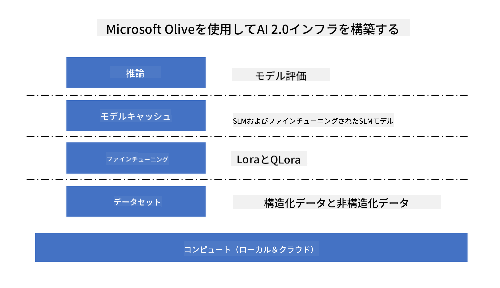
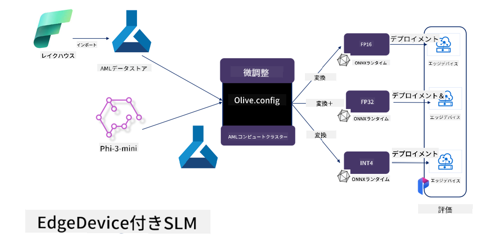

<!--
CO_OP_TRANSLATOR_METADATA:
{
  "original_hash": "727978e690ed9c055f594a4bfe01d75c",
  "translation_date": "2025-04-04T13:14:32+00:00",
  "source_file": "md\\03.FineTuning\\FineTuning_MicrosoftOlive.md",
  "language_code": "ja"
}
-->
# **Microsoft Olive を使った Phi-3 のファインチューニング**

[Olive](https://github.com/microsoft/OLive?WT.mc_id=aiml-138114-kinfeylo) は、モデルの圧縮、最適化、コンパイルなど業界トップの技術を統合した、ハードウェアに対応したモデル最適化ツールです。

このツールは機械学習モデルの最適化プロセスを簡素化し、特定のハードウェアアーキテクチャを効率的に活用できるように設計されています。

クラウドベースのアプリケーションやエッジデバイスでの作業に関わらず、Olive を使えばモデルの最適化を簡単かつ効果的に行うことができます。

## 主な特徴:
- Olive は、目的のハードウェアターゲットに対して最適化技術を統合し、自動化します。
- すべてのシナリオに適した単一の最適化技術は存在しないため、Olive は拡張性を持ち、業界の専門家が独自の最適化技術を追加できるようにしています。

## エンジニアリング作業の軽減:
- 開発者は通常、トレーニング済みモデルを展開するために複数のハードウェアベンダー固有のツールチェーンを学び、利用する必要があります。
- Olive は、目的のハードウェアに対する最適化技術を自動化することで、この作業を簡素化します。

## E2E最適化ソリューションの提供:

統合された技術を組み合わせて調整することで、Olive はエンドツーエンドの最適化を実現する統一されたソリューションを提供します。
モデルの最適化中には、精度やレイテンシーなどの制約を考慮します。

## Microsoft Olive を使ったファインチューニング

Microsoft Olive は、生成型人工知能分野でのファインチューニングと参照の両方をカバーできる非常に使いやすいオープンソースのモデル最適化ツールです。簡単な設定と、オープンソースの小型言語モデルや関連するランタイム環境（AzureML / ローカルGPU、CPU、DirectML）の組み合わせを使用することで、自動最適化を通じてモデルのファインチューニングや参照を完了し、クラウドやエッジデバイスに展開する最適なモデルを見つけることができます。これにより、企業はオンプレミスやクラウドで独自の業界特化型モデルを構築することが可能になります。



## Microsoft Olive を使った Phi-3 のファインチューニング 



## Phi-3 Olive のサンプルコードと例
この例では Olive を使用して以下を行います:

- LoRA アダプターをファインチューニングし、フレーズを「悲しい」「喜び」「恐れ」「驚き」に分類します。
- アダプターの重みをベースモデルに統合します。
- モデルを int4 に最適化および量子化します。

[サンプルコード](../../code/03.Finetuning/olive-ort-example/README.md)

### Microsoft Olive のセットアップ

Microsoft Olive のインストールは非常に簡単で、CPU、GPU、DirectML、Azure ML 用にインストールすることも可能です。

```bash
pip install olive-ai
```

ONNXモデルをCPUで実行したい場合は以下を使用します:

```bash
pip install olive-ai[cpu]
```

ONNXモデルをGPUで実行したい場合は以下を使用します:

```python
pip install olive-ai[gpu]
```

Azure ML を使用したい場合は以下を使用します:

```python
pip install git+https://github.com/microsoft/Olive#egg=olive-ai[azureml]
```

**注意**
OS 要件: Ubuntu 20.04 / 22.04 

### **Microsoft Olive の Config.json**

インストール後、データ、計算、トレーニング、展開、モデル生成など、モデル固有の設定を Config ファイルを通じて構成できます。

**1. データ**

Microsoft Olive では、ローカルデータやクラウドデータでのトレーニングがサポートされており、設定で構成することができます。

*ローカルデータの設定*

ファインチューニングに必要なデータセットを設定するだけで簡単に構成できます。通常は json 形式で、データテンプレートに適合させます。これはモデルの要件に基づいて調整する必要があります（例えば、Microsoft Phi-3-mini が必要とする形式に適合させるなど。他のモデルを使用する場合は、それぞれのモデルが必要とするファインチューニング形式を参照してください）。

```json

    "data_configs": [
        {
            "name": "dataset_default_train",
            "type": "HuggingfaceContainer",
            "load_dataset_config": {
                "params": {
                    "data_name": "json", 
                    "data_files":"dataset/dataset-classification.json",
                    "split": "train"
                }
            },
            "pre_process_data_config": {
                "params": {
                    "dataset_type": "corpus",
                    "text_cols": [
                            "phrase",
                            "tone"
                    ],
                    "text_template": "### Text: {phrase}\n### The tone is:\n{tone}",
                    "corpus_strategy": "join",
                    "source_max_len": 2048,
                    "pad_to_max_len": false,
                    "use_attention_mask": false
                }
            }
        }
    ],
```

**クラウドデータソースの設定**

Azure AI Studio/Azure Machine Learning Service のデータストアをリンクすることでクラウド内のデータを接続し、Microsoft Fabric や Azure Data を通じて異なるデータソースを Azure AI Studio/Azure Machine Learning Service に導入し、ファインチューニング用のデータをサポートすることができます。

```json

    "data_configs": [
        {
            "name": "dataset_default_train",
            "type": "HuggingfaceContainer",
            "load_dataset_config": {
                "params": {
                    "data_name": "json", 
                    "data_files": {
                        "type": "azureml_datastore",
                        "config": {
                            "azureml_client": {
                                "subscription_id": "Your Azure Subscrition ID",
                                "resource_group": "Your Azure Resource Group",
                                "workspace_name": "Your Azure ML Workspaces name"
                            },
                            "datastore_name": "workspaceblobstore",
                            "relative_path": "Your train_data.json Azure ML Location"
                        }
                    },
                    "split": "train"
                }
            },
            "pre_process_data_config": {
                "params": {
                    "dataset_type": "corpus",
                    "text_cols": [
                            "Question",
                            "Best Answer"
                    ],
                    "text_template": "<|user|>\n{Question}<|end|>\n<|assistant|>\n{Best Answer}\n<|end|>",
                    "corpus_strategy": "join",
                    "source_max_len": 2048,
                    "pad_to_max_len": false,
                    "use_attention_mask": false
                }
            }
        }
    ],
    
```

**2. コンピューティング設定**

ローカルの場合は、ローカルのデータリソースを直接使用できます。Azure AI Studio / Azure Machine Learning Service のリソースを使用する場合は、関連する Azure パラメータや計算能力名などを構成する必要があります。

```json

    "systems": {
        "aml": {
            "type": "AzureML",
            "config": {
                "accelerators": ["gpu"],
                "hf_token": true,
                "aml_compute": "Your Azure AI Studio / Azure Machine Learning Service Compute Name",
                "aml_docker_config": {
                    "base_image": "Your Azure AI Studio / Azure Machine Learning Service docker",
                    "conda_file_path": "conda.yaml"
                }
            }
        },
        "azure_arc": {
            "type": "AzureML",
            "config": {
                "accelerators": ["gpu"],
                "aml_compute": "Your Azure AI Studio / Azure Machine Learning Service Compute Name",
                "aml_docker_config": {
                    "base_image": "Your Azure AI Studio / Azure Machine Learning Service docker",
                    "conda_file_path": "conda.yaml"
                }
            }
        }
    },
```

***注意***

Azure AI Studio / Azure Machine Learning Service でコンテナを通じて実行されるため、必要な環境を構成する必要があります。これは conda.yaml 環境で構成されます。

```yaml

name: project_environment
channels:
  - defaults
dependencies:
  - python=3.8.13
  - pip=22.3.1
  - pip:
      - einops
      - accelerate
      - azure-keyvault-secrets
      - azure-identity
      - bitsandbytes
      - datasets
      - huggingface_hub
      - peft
      - scipy
      - sentencepiece
      - torch>=2.2.0
      - transformers
      - git+https://github.com/microsoft/Olive@jiapli/mlflow_loading_fix#egg=olive-ai[gpu]
      - --extra-index-url https://aiinfra.pkgs.visualstudio.com/PublicPackages/_packaging/ORT-Nightly/pypi/simple/ 
      - ort-nightly-gpu==1.18.0.dev20240307004
      - --extra-index-url https://aiinfra.pkgs.visualstudio.com/PublicPackages/_packaging/onnxruntime-genai/pypi/simple/
      - onnxruntime-genai-cuda

    

```

**3. SLM の選択**

Hugging face からモデルを直接使用することも、Azure AI Studio / Azure Machine Learning の Model Catalog と組み合わせて使用するモデルを選択することもできます。以下のコード例では Microsoft Phi-3-mini を例として使用します。

モデルがローカルにある場合は以下の方法を使用します:

```json

    "input_model":{
        "type": "PyTorchModel",
        "config": {
            "hf_config": {
                "model_name": "model-cache/microsoft/phi-3-mini",
                "task": "text-generation",
                "model_loading_args": {
                    "trust_remote_code": true
                }
            }
        }
    },
```

Azure AI Studio / Azure Machine Learning Service からモデルを使用したい場合は以下の方法を使用します:

```json

    "input_model":{
        "type": "PyTorchModel",
        "config": {
            "model_path": {
                "type": "azureml_registry_model",
                "config": {
                    "name": "microsoft/Phi-3-mini-4k-instruct",
                    "registry_name": "azureml-msr",
                    "version": "11"
                }
            },
             "model_file_format": "PyTorch.MLflow",
             "hf_config": {
                "model_name": "microsoft/Phi-3-mini-4k-instruct",
                "task": "text-generation",
                "from_pretrained_args": {
                    "trust_remote_code": true
                }
            }
        }
    },
```

**注意:**
Azure AI Studio / Azure Machine Learning Service と統合する必要があるため、モデルを設定する際にはバージョン番号や関連する名前付けを参照してください。

Azure 上のすべてのモデルは PyTorch.MLflow に設定する必要があります。

Hugging face のアカウントを持ち、Azure AI Studio / Azure Machine Learning の Key 値にキーをバインドする必要があります。

**4. アルゴリズム**

Microsoft Olive は LoRA や QLoRA のファインチューニングアルゴリズムを非常にうまくカプセル化しています。関連するパラメータをいくつか構成するだけで済みます。ここでは QLoRA を例として挙げます。

```json
        "lora": {
            "type": "LoRA",
            "config": {
                "target_modules": [
                    "o_proj",
                    "qkv_proj"
                ],
                "double_quant": true,
                "lora_r": 64,
                "lora_alpha": 64,
                "lora_dropout": 0.1,
                "train_data_config": "dataset_default_train",
                "eval_dataset_size": 0.3,
                "training_args": {
                    "seed": 0,
                    "data_seed": 42,
                    "per_device_train_batch_size": 1,
                    "per_device_eval_batch_size": 1,
                    "gradient_accumulation_steps": 4,
                    "gradient_checkpointing": false,
                    "learning_rate": 0.0001,
                    "num_train_epochs": 3,
                    "max_steps": 10,
                    "logging_steps": 10,
                    "evaluation_strategy": "steps",
                    "eval_steps": 187,
                    "group_by_length": true,
                    "adam_beta2": 0.999,
                    "max_grad_norm": 0.3
                }
            }
        },
```

量子化変換を行いたい場合、Microsoft Olive のメインブランチはすでに onnxruntime-genai メソッドをサポートしています。必要に応じて以下のように設定できます：

1. アダプターの重みをベースモデルに統合
2. 必要な精度でモデルを onnx モデルに変換（ModelBuilder を使用）

例: 量子化された INT4 に変換

```json

        "merge_adapter_weights": {
            "type": "MergeAdapterWeights"
        },
        "builder": {
            "type": "ModelBuilder",
            "config": {
                "precision": "int4"
            }
        }
```

**注意** 
- QLoRA を使用する場合、ONNXRuntime-genai の量子化変換は現在サポートされていません。

- ここで指摘しておくべき点は、上記の手順を自身のニーズに応じて設定できることです。これらすべての手順を完全に構成する必要はなく、ニーズに応じてアルゴリズムの手順を直接使用することも可能です。最後に関連するエンジンを構成する必要があります。

```json

    "engine": {
        "log_severity_level": 0,
        "host": "aml",
        "target": "aml",
        "search_strategy": false,
        "execution_providers": ["CUDAExecutionProvider"],
        "cache_dir": "../model-cache/models/phi3-finetuned/cache",
        "output_dir" : "../model-cache/models/phi3-finetuned"
    }
```

**5. ファインチューニングの完了**

コマンドラインで、olive-config.json のディレクトリで以下を実行します:

```bash
olive run --config olive-config.json  
```

**免責事項**:  
この文書は、AI翻訳サービス [Co-op Translator](https://github.com/Azure/co-op-translator) を使用して翻訳されています。正確性を追求しておりますが、自動翻訳には誤りや不正確さが含まれる可能性があります。元の言語で書かれた原文が正式な情報源として考慮されるべきです。重要な情報については、専門の人間による翻訳を推奨します。この翻訳の使用に起因する誤解や誤った解釈について、当方は責任を負いません。